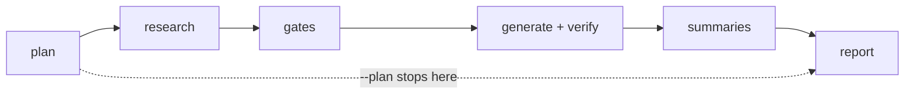
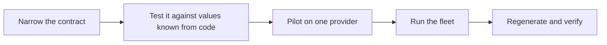

# Research refresh: exact values, one command, one report

Claudine's provider metadata is driven by fleet research. That research is a
quarter old, most of it is prose, and until 2026-09-29 no fleet could run.

This fix makes research produce exact values and makes refreshing it routine.
A contract decides what a research document must contain. One command decides
what is stale, runs the research, checks it, regenerates code from it, and
leaves one report of what changed and what needs a decision.

## Revision note, 2026-09-29

The first draft of this spec was written before the reasoning-level pilot.
This revision reconciles it with decisions made since.

| Change | From | To |
| --- | --- | --- |
| Replaced | One researcher for every topic: Codex with `gpt-5.6-sol` at low effort | A rotation of three researchers ([Researchers](#researchers)) |
| Replaced | No change to any research contract | Every contract is narrowed ([The contract standard](#the-contract-standard)) |
| Replaced | A first full refresh under the current contracts | Topic by topic, each after its contract is narrowed ([Order](#order)) |
| Replaced | Fingerprint of `_schema.yaml` | Fingerprint of every file a contract is made of |
| Removed | The question of which researcher the first run uses | Decided |
| Moved | A fix | A feature, since it narrows every contract and adds a topic |
| Added | The contract standard and its two gates | |
| Added | What the pilot proved and the defects it found | |
| Added | The reasoning-level topic | |
| Added | Work already done | |

An earlier draft, `2026-09-29-research-contracts`, held the contract standard.
Its content is in this document, and the draft was deleted.

## Outcome

After this fix:

1. **Research records exact values.** A flag, a level, a field path, or a
   version is copied as observed and checked against a pattern or a closed
   set. A document that does not satisfy its contract is rejected and
   researched again.
2. **Refreshing is one command.**

   ```sh
   just refresh-research            # plan, research, gates, generate, report
   just refresh-research --plan     # read-only: what would run, why, and for how long
   ```

   The operator never edits a topic list, never remembers which fleet needs
   which researcher, never updates a pinned hash by hand, and never searches
   research frontmatter to learn what changed.

The run ends in the state "implementation complete, ready for review".

## Why now

### The research is a quarter old

| Topic group | Last refreshed | Feeds code generation? |
| --- | --- | --- |
| `agent-logging`, `agent-models` | 2026-07-01 | yes |
| `model-config` | 2026-07-02 | yes |
| `acp`, `agent-cli`, `resume`, `skills`, `non-interactive-sessions` | 2026-07-03 | yes |
| `hooks`, `mcp`, `agent-permissions`, `plugins`, `slash-commands`, `subagents`, `system-prompt`, `usage`, `local_runners` | 2026-07-03 | documentation and summaries only |
| `signals` | 2026-07-06 | yes |
| `agent-errors` | 2026-07-14 | yes |
| `steering` | 2026-09-08 | yes |
| `reasoning-level` | 2026-09-29 | not yet |

Providers ship weekly. On the development host on 2026-09-29, Gemini was at
0.61.0 against a researched 0.51.0, Pi at 0.87.1 against 0.84.4, and Kimi at
2.0.2 against 0.28.1.

### A consumer is blocked on it

The `2026-09-18-edit-integration` review ruled that Kimi's `--edit -i`
behavior cannot be decided until the research is current. Kimi is refreshed
in place: the 2.x findings replace the 0.28.1 findings under the same roster
entry.

### The contracts accept prose

Measured across the 21 topic contracts and 195 research documents:

| Finding | Measure |
| --- | --- |
| Free-text properties | Most contracts have more free-text properties than typed ones. Non-interactive sessions has about 109 |
| Property descriptions | None of the 21 contracts describes a property in the contract itself |
| Object notation | Every object is written as one quoted string |
| Researcher recorded | 107 of 195 documents record the model as `default` |
| Update signal | 174 documents set `requires_claudine_update: true`; nothing reads it |

Generated code cannot act on a sentence. In steering, the wire protocol of
every mechanism reaches the generated tables as prose, and no production code
reads it.

### The fleets could not run

Found on 2026-09-29. None of these appears in a dry run, which composes a
prompt and stops before the researcher launches, so no lifecycle event fires.

| Defect | State |
| --- | --- |
| The rosters held their entries under `list:`, which the sequence loader rejects | Fixed, in Claudine and in the three rosters of other package areas |
| Three recipes ran `cargo run -p claudine-cli`, which fails because the package has four binaries | Fixed |
| 20 of the 22 fleet prompts reported a failure with `err.message`, which is not a field; the reason printed empty | Fixed; the field is `err.msg` |
| 17 of the 21 fleet prompts accept any document dated today; only 4 validate the contract | Open |
| A sequence plans one researcher before any step exists, so a prompt cannot choose a researcher per provider | Open; described in `2026-09-27-sequence-improvements` |

### The refresh is not turnkey

1. The recipe carries a hand-maintained topic array. It omits `agent-errors`,
   `steering`, and `reasoning-level`, and would omit the next topic added.
2. Each fleet prompt sets its own freshness window and its own researcher.
   The recipe overrides the agent but not the model.
3. The order of steps after research is undocumented as a whole: the topic
   checks, `just signals-check`, `claudine providers generate --yes`, then
   `just test`. `just test` fails after a correct regeneration, because
   `gen/tests/fixtures/generated-artifact-baseline.json` pins hashes of
   fifteen generated files that are updated by hand.
4. `requires_claudine_update`, `reason`, and `changes` are read by nothing,
   so they cannot tell an operator what is new since the last refresh.
5. The cross-provider summaries have no runner. All but two are dated
   2026-07-03. `plugins.md` and `agent-plugins.md` compete.
6. The model catalog is produced in another package area, and the generator
   only warns when it is more than thirty days old. On 2026-09-29 it was 84
   days old.
7. `docs/topics/provider-metadata.md` documents a
   `claudine providers generate --check` flag that does not exist, and
   `docs/topics/how-to-create-a-new-provider.md` describes hand-written
   providers.

### Cost

| Run | Researcher | Time per document |
| --- | --- | --- |
| July topic fleets | OpenCode, `kimi-for-coding/k2p7` | 5 to 15 min |
| `agent-errors`, 2026-07-14 | Codex, `gpt-5.6-sol`, low effort | about 3 min |
| Reasoning level, 2026-09-29 | Claude, `sonnet`, high effort | 6, 16, and 18 min |
| Reasoning level, 2026-09-29 | Codex, `gpt-6-luna`, high effort | 8, 10, and 14 min |
| Reasoning level, 2026-09-29 | OpenCode, `zai-coding-plan/glm-5.3` | 14, 20, and 33 min |

These are nine documents of one topic, so they are a weak basis for an
estimate. At 15 minutes a document, 185 documents take about 46 hours in
series and about 15 hours three wide.

Time is not the only limit. OpenCode's plan reached its usage limit after
three research documents and a handful of short test runs, and two providers
went unresearched. The process must survive interruption, skip what is
current, report a limit without retrying, and need no one watching it.

## Work already done

| Item | Location |
| --- | --- |
| Rosters and generator use `sequence:` | `docs/providers.yaml`, `docs/local-runners.yaml`, `gen/src` |
| Types shared between contracts | `docs/research/_types.yaml` |
| Reasoning-level contract, types, and fleet prompt | `docs/research/reasoning-level/` |
| Reasoning-level research for all ten providers, confirmed by both gates | `docs/research/reasoning-level/` |
| What the research found, and what the runs showed about the contract and the process | [reasoning-level-findings.md](reasoning-level-findings.md) |
| Revision 2 of the reasoning-level contract, applied | `docs/research/reasoning-level/` |
| The relations gate for reasoning level, run by the fleet prompt | `docs/research/reasoning-level/_relations.py` |
| Prototype of the description lint | [prototypes](prototypes/) |
| `just research <topic>`: one command, three researchers, cover on a usage limit | `justfile` |
| The three pre-roster files under `acp/` are deleted | `docs/research/acp/` |
| Recipes name the `claudine` binary; every fleet prompt reports `err.msg` | `justfile`, `docs/research/*/_fleet.md` |
| Draft of the narrowed steering prompt | `2026-09-29-steering-pipeline` |
| Draft of the narrowed steering contract, with Codex and Pi filled in from shipped code | `2026-09-29-steering-pipeline` |

## The contract standard

A research contract meets the standard when these four rules hold.

### 1. Types are as narrow as the fact allows

- A value from a known set is an `enum`.
- An identifier, a version, a field path, a flag, or a token has a `pattern`.
- A number has bounds where bounds exist.
- A plain `string` is used only for text a person reads, and is `not-empty`.
- `unknown` is a member of a set wherever research may fail to establish the
  fact, and each `unknown` has a matching entry in `gaps`. A document never
  omits a required property to avoid answering.

### 2. Objects are named types in nested notation

A contract is a set of files:

| File | Holds |
| --- | --- |
| `docs/research/<topic>/_schema.yaml` | The properties of a research document |
| `docs/research/<topic>/_types.yaml` | The topic's object shapes |
| `docs/research/_types.yaml` | Shapes and patterns every topic shares, such as evidence, gaps, identifiers, and versions |

Every object shape is a named type, written as a mapping with one property
per line. A named type is closed, so a misspelled key is an error. A mapping
nested directly inside another accepts any key, so it is not used.

```yaml
condition:
    field: pointer(required)@this -> Where to look in the value being tested
    test: enum(equals,present,absent; required) -> Whether the field must hold a value, merely exist, or not exist
```

### 3. Every property has a description that carries meaning

A description states something the name and type do not: the purpose, the
consequence, or the rule for choosing a value.

| Weak | Meaningful |
| --- | --- |
| Sources for this mechanism | Evidence for the message shape, the delivery boundary, and the provider's answer |
| Result of the test | Result of the test; only passed can support an activation grant |

Descriptions appear in validation errors, so a rejected document tells the
researcher what each failing property is for.

A lint enforces the rule. It fails on a property without a description, a
description shorter than six words, one that restates the property's name,
wording repeated across properties, and an object written as a string.

A description must not contain a colon followed by a space. YAML reads that
as the start of a mapping, and the whole contract becomes unreadable.

### 4. Lifecycle events communicate and validate

Every fleet prompt uses these events:

| Event | Communicates | Validates |
| --- | --- | --- |
| `initialize` | Which provider is researched and by whom, or why it was skipped | Nothing; it may not run commands |
| `start` | Whether the provider is installed on the host | Nothing |
| `success` | That the document satisfies its contract, with a link | The document was updated today, records the assigned researcher, and passes both gates |
| `failure` | What failed and why, on the terminal and the messaging route | Nothing |
| `finalize` | Nothing | Retries once after a failure |

A failed validation in `success` raises an error, which turns the run into a
failure. The retry shows the researcher the validator's output, so the second
attempt corrects the named properties.

Three more rules hold for every fleet prompt:

- It sets `fail_fast: false`, so one provider's rejected research does not
  stop the others.
- It does not retry after a usage limit. It reports the limit, and another
  researcher covers.
- It reads only the documents its own run writes. Runs work in parallel, and
  another run may be in the middle of writing one of the others.
- It researches only the providers assigned to the agent it launches, and
  refuses a model outside the rotation. The document therefore records the
  researcher that wrote it.

### Two gates

| Gate | Checks | State |
| --- | --- | --- |
| Shape | Types, closed sets, patterns, unknown keys | `md schema validate`; works today |
| Relations | What a shape cannot express: an identifier that must name an existing entry, a property required only in some cases, an `unknown` that needs a gap entry | Hand-written for steering and agent errors only |

The relations gate becomes one checker configured per topic. Each topic
declares its relations in a file beside its contract, and
`claudine providers research check <topic> <slug>` enforces them. The
steering and agent-errors checkers become configurations of it.

### What the pilot proved

The reasoning-level prompt ran for Claude Code on 2026-09-29, and then for
the rest of the roster.

| Behavior | Result |
| --- | --- |
| `initialize` reports the provider and the researcher | Confirmed |
| `success` validates the document and reports the link | Confirmed |
| `success` rejects a document that violates the contract | Confirmed with a deliberately invalid document |
| `failure` reports the reason | Confirmed |
| `finalize` retries once | Confirmed |
| The retry shows the researcher the validator's output | Confirmed |
| A second failure ends the run with a non-zero exit | Confirmed |
| A confirmed document is skipped on the next run | Confirmed |
| A real rejection is retried and then passes | Confirmed; Kilo's first attempt was rejected and its second passed |
| A usage limit is reported and not retried | Confirmed against the limited agent |

The document it produced has 20 evidence entries, 8 from live tests. It
found that `docs/providers/facts/claude.yaml` records Claude Code's effort
flag as `thinking_effort` with three levels, where the provider has
`--effort` with five.

## Researchers

Research rotates over three researchers by position in the roster.

| Agent | Model | Effort for a topic that feeds code generation | Effort for any other topic |
| --- | --- | --- | --- |
| OpenCode | `zai-coding-plan/glm-5.3` | provider default | provider default |
| Claude | `sonnet` | high | low |
| Codex | `gpt-6-luna` | high | low |

OpenCode stays at its provider default until research confirms which levels
`glm-5.3` accepts.

- The order is chosen so that no agent researches its own provider. The plan
  stage fails when an assignment would break that rule.
- A contract accepts only these agents and models. A document that records
  `default` is rejected.
- The document records what the agent reports at run time, and the refresh
  record states the resolved model.

Two limits apply until Claudine changes:

| Limit | Consequence |
| --- | --- |
| A sequence plans one researcher before any step exists | A fleet names its agent on the command line and runs once per agent |
| Claudine cannot set reasoning effort from a prompt, and each agent spells it differently | Effort is passed on the command line of each per-agent run |

The reasoning-level topic produces the facts an effort setting needs.

A researcher can run out. When a researcher reaches its usage limit, the
others cover for it in rotation order, and none researches its own provider.
A document records the researcher that wrote it, so a covered document names
the researcher that covered.

## Design

### One driver, six stages



| Stage | What it does | Deterministic? |
| --- | --- | --- |
| **plan** | Reads the topic manifest, decides freshness for every topic and provider, assigns researchers, and prints the matrix, the fleets that will run, and a wall-clock estimate. Writes nothing under `--plan`. | yes |
| **research** | Launches the fleet of each stale topic, once per agent, at most N in parallel, passing the stale providers so each fleet skips the rest. | no |
| **gates** | Runs the shape and relations gates for every document the fleet did not already check. Findings are recorded and do not stop other topics. | yes |
| **generate + verify** | `claudine providers generate --yes`, updates the pinned hashes, then `just test-gen` and `just test`. A failure is a finding; the research stays valid. Refreshes the model catalog first under `--models`. | yes |
| **summaries** | Re-runs a summary only when a document it reads is newer than the summary, then publishes. Skippable. | no |
| **report** | Writes the refresh record. | yes |

The driver is `claudine research {plan,run,report}` in `claudine-cli`,
wrapped by `just refresh-research`. It runs `claudine sequence` and
`claudine-gen` as the existing `providers` subcommands do.

### The topic manifest

`docs/research/topics.yaml` is the one place a research topic is registered.
It replaces the topic array in the recipe and the researcher and freshness
settings in each prompt.

Every `docs/research/<topic>/_fleet.md` must appear in the manifest, enabled
or disabled with a reason, and every entry must have a directory. Either
mismatch fails `plan` with a message naming the file.

```yaml
defaults:
    max_age: 6wk
    parallel: 3
researchers:
    - agent: opencode
      model: zai-coding-plan/glm-5.3
    - agent: claude
      model: sonnet
      effort: high
    - agent: codex
      model: gpt-6-luna
      effort: high
topics:
    - name: reasoning-level
      roster: providers.yaml
      consumers: [codegen]
      contract: [_schema.yaml, _types.yaml, ../_types.yaml]
      relations: _relations.yaml
    - name: hooks
      roster: providers.yaml
      consumers: [summary]
    - name: memory
      enabled: false
      reason: no documents yet
summaries:
    - file: hooks.md
      reads: [hooks]
```

| Field | Meaning |
| --- | --- |
| `researchers` | The rotation, in assignment order |
| `roster` | Which roster the fleet runs over |
| `consumers` | `codegen`, `summary`, or `docs`; orders the plan and fills the report's generation section |
| `contract` | Every file the contract is made of; their content decides freshness |
| `relations` | The topic's relation rules |
| `max_age` | How old research may get |
| `enabled`, `reason` | Whether the topic is researched, and why not |

### Freshness is decided in one place

The driver decides, and the fleet obeys. A document is current when all of
these hold:

| Condition | Source |
| --- | --- |
| The fleet confirmed it against its contract | `contract_checked`, written by the `success` event after both gates pass, never by the researcher |
| The contract has not changed since | A fingerprint of every file in `contract` |
| The fleet prompt has not changed since | A fingerprint of `_fleet.md` |
| It is younger than `max_age` | `last_updated` |

The driver passes the stale providers to the fleet as `refresh`. The fleet's
`initialize` keeps two rules: skip a provider that is not in `refresh`, and
skip a provider whose document was confirmed today.

The fingerprints matter. During the pilot a contract changed without a
revision change, and the document already written became invalid while still
looking current.

Fingerprints are not built twice. They arrive with
`2026-09-28-content-policy`, as a document's own `content_policy`
declaration evaluated by that library. Until then, a contract change is
marked by changing `schema_revision`, and a document is current when it
carries the contract's revision and the fleet's stamp and is younger than
`max_age`.

The answer is `true`, `false`, or `unknown`. `unknown` is treated as stale
and reported as such.

### The update signal gets a lifecycle

`requires_claudine_update` and `reason` stay what the researcher wrote. The
report computes what is new since the last refresh:

- For each document, the frontmatter the contract declares is compared with
  the same document at the commit recorded in the previous refresh record.
  Added, removed, and changed values are listed per topic and provider. Prose
  bodies are not compared. Narrow types are what make this comparison
  readable.
- A `reason` counts as new when its text differs from the previous refresh.
- `docs/research/_triage.md` is the ledger of decisions, one line per item,
  marked `[ ]`, `[I]`, `[S]`, or `[W]`. The report appends items that have no
  decision and never removes one. An item already in the ledger is not
  raised again, so a refresh that changes nothing reports nothing.

The run ends by listing the items without a decision. The author decides
them.

### The refresh record

`docs/research/_refresh/<YYYY-MM-DD>.md`, committed with the refresh, holds:

1. **Run telemetry** per fleet and provider: agent, resolved model, effort,
   start, saved, gate result, attempts.
2. **Freshness before and after**, with every `unknown` and every skip and
   its reason.
3. **Gate outcomes** per topic and provider.
4. **Generation impact**: which generated files changed, the updated hashes,
   and the `just test` result.
5. **Research changes**: the frontmatter comparison per document, and the new
   `reason` texts.
6. **Summaries**: which were regenerated and which were current.
7. **Model catalog age**, and whether `--models` ran.
8. **Items without a decision** appended to `_triage.md` by this run.

The record's frontmatter carries the commit it was compared against.

### Commit boundaries

The driver never commits. It leaves the tree so that review is tractable, and
the operator prompt commits in this order when asked:

1. research documents, reviewed through the report's changes section;
2. generated code, the updated hashes, and any facts or overrides the triage
   decided on;
3. summaries and their published copies;
4. the refresh record and the ledger.

### The operator prompt

A repo slash command runs `just refresh-research --plan` and shows the plan,
runs the refresh in the background with a budget ledger, reads only the
refresh record when it returns, proposes a decision for each open item, and
stops at "implementation complete, ready for review".

## Order

Each topic follows the same steps.



| Step | Topics |
| --- | --- |
| 1 | Reasoning level |
| 2 | Steering |
| 3 | Non-interactive sessions |
| 4 | Signals and agent errors |
| 5 | Agent models, model config, agent CLI, and agent logging |
| 6 | The remaining topics, with ACP last |

A topic is refreshed as soon as its contract is narrowed. No topic is
refreshed under its current contract.

Steps 1 to 3 proceed by hand, as the pilot did. The driver is built after
them, when the manifest, the rotation, and the relation rules have settled
shapes.

## Decisions (proposed; to be ratified)

| ID | Decision | State |
| --- | --- | --- |
| D1 | The driver is Rust, `claudine research`, entered through `just refresh-research` | Proposed |
| D2 | Topics are registered in `docs/research/topics.yaml`, guarded in both directions against the topic directories | Proposed |
| D3 | The driver alone decides freshness. No prompt holds a freshness window | Proposed |
| D3a | Research may be six weeks old by default. The expectation is that four weeks proves right | Decided 2026-09-29 |
| D4 | Research rotates over three researchers, and no agent researches its own provider | Decided 2026-09-29 |
| D4a | Effort is high for a topic that feeds code generation and low for any other | Decided 2026-09-29 |
| D5 | `claudine providers generate --yes` updates the pinned hashes | Proposed |
| D6 | Every contract is narrowed to the standard | Decided 2026-09-29 |
| D7 | Summaries are part of the refresh, run only when an input changed, and skippable | Proposed |
| D8 | The model catalog stage is opt-in with `--models` and always reported | Proposed |
| D9 | A research failure never blocks another topic. A generation failure never discards research | Proposed |
| D10 | A contract is narrowed before its topic is refreshed | Decided 2026-09-29 |
| D11 | Kimi is refreshed in place | Decided 2026-09-29 |
| D12 | A contract is a document schema plus named types, in nested notation | Decided 2026-09-29 |
| D13 | The relations gate is one checker configured per topic | Proposed |
| D14 | Reasoning level is a research topic | Decided 2026-09-29 |
| D15 | When a researcher reaches its usage limit, the others cover for it in rotation order | Decided 2026-09-29 |
| D16 | Freshness by fingerprint waits for `2026-09-28-content-policy` and is not built separately | Decided 2026-09-29 |
| D17 | The pre-roster files under `acp/` are deleted | Decided and done 2026-09-29 |

## Acceptance criteria

1. Every contract passes the description lint and both gates exist for it.
2. Every fleet prompt validates in `success`, reports through the five
   events, sets `fail_fast: false`, and contains no freshness window.
3. No research document records an agent or model outside the rotation, and
   none is researched by its own provider's agent.
4. `just refresh-research --plan` prints a freshness matrix for every enabled
   topic and provider, names the fleets that would run with their
   researchers, estimates wall-clock, and writes nothing.
5. Adding a topic is: create its contract and prompt, and add one manifest
   entry. A prompt with no entry, or an entry with no directory, fails `plan`
   with a message naming the file.
6. `just refresh-research` on a stale tree researches only stale documents,
   runs every gate, regenerates, updates the hashes, passes `just test-gen`
   and `just test`, writes the refresh record and ledger, and exits zero.
   Stopping it and running it again continues where it stopped.
7. Changing any file of a contract makes every document of that topic stale.
8. A refresh on a current tree changes nothing and produces a record that
   says so.
9. The refresh record shows, for at least one provider in the first real
   run, a changed value and a new `reason`.
10. The Kimi question in `2026-09-18-edit-integration` is answerable from
    `non-interactive-sessions/kimi.md` and `agent-cli/kimi.md`, and the
    answer is recorded in that fix's review.
11. `docs/topics/provider-metadata.md` names no flag that does not exist and
    gains a "Refreshing research" section a newcomer can follow.
    `how-to-create-a-new-provider.md` matches the generated pipeline.
12. The Claudine skill's research section points at the manifest and the
    refresh record.

## Phases

| Phase | Deliverable | Gate |
| --- | --- | --- |
| 0 | Repairs: the recipe's `cargo run`, `err.msg` in every prompt, the three rosters outside Claudine, the pre-roster files under `acp/`. **Done 2026-09-29** | Every fleet composes and reports a failure reason |
| 1 | Reasoning level: revision 2 of the contract, then a fleet run for all ten providers. **Done 2026-09-29: all ten providers confirmed under revision 2** | Criteria 1 to 3 for that topic |
| 2 | Steering: narrowed contract live, relation rules, generator reads the new fields, fleet run | Criteria 1 to 3 for that topic |
| 3 | Non-interactive sessions, the same way | Criteria 1 to 3 for that topic |
| 4 | The driver: manifest, `plan`, `run`, `report`, the refresh record, the ledger, automated hashes | Criteria 4 to 9 |
| 5 | The remaining topics through the driver, in the stated order; summaries; docs and skill | Criteria 1 to 3 for every topic; 10 to 12 |
| 6 | Freshness through `content_policy` declarations, including a fingerprint of every contract file | Blocked on `2026-09-28-content-policy` |

## Defects found outside this fix

| Defect | Area |
| --- | --- |
| A lifecycle write to a file outside the repository is dropped without a message, along with every later action in that stack item, and the step reports success. Research never writes outside the repository; a test did | Claudine |
| `validate_schema()` called from a lifecycle event cannot resolve a relative `$schema` | Claudine or Darkmatter |
| A `pattern(...)` that contains parentheses or a space does not parse; the documentation shows one | Darkmatter |
| A multi-line inline object does not parse in a contract file; the documentation says it does | Darkmatter |
| A file with `kind: schema` rejects a `$schema` key, so a contract and its types cannot share one file | Darkmatter |
| A mapping nested directly in a contract is accepted; the documentation says it is an error | Darkmatter |
| `biscuit-terminal/docs/research/terminal-multiplexing/_fleet.md` had frontmatter that did not parse: an unquoted value began with `@`. Repaired with `md clean --save`. A sequence does not apply that repair when it loads a prompt | biscuit-terminal; Claudine |
| `biscuit-terminal/docs/multiplexers.yaml` calls `dasherize(name)`, which is not a function | biscuit-terminal |
| `biscuit-tui/docs/style-guide/_style-guide.md` has a `::block` that is never closed | biscuit-tui |

## Out of scope

- Acting on what the research reveals. Behavior gaps go to the ledger and to
  their own fixes.
- The steering delivery pipeline, which is `2026-09-29-steering-pipeline`.
- An effort setting in Claudine. This fix produces the research it needs.
- A scheduler. Cadence is declared; something still has to run the command.
- Rate-limit awareness across concurrent fleets.

## Open questions for the author

### Q1. Who runs a refresh: a Rust command or a recipe?

`just research <topic>` exists today as a shell recipe of about 60 lines. It
runs the three researchers, covers for one at its usage limit, and checks
that every provider ends with a confirmed document.

The driver in this spec does more: it reads every document's frontmatter to
decide what is stale, compares each document with its previous version, and
writes the refresh record.

| Option | For | Against |
| --- | --- | --- |
| A Rust command, `claudine research` | It can reuse Claudine's frontmatter reader, be tested against a fixture tree, and run on Windows | More work before the first full refresh |
| Keep growing the recipe | It exists and works | Reading 200 documents and comparing them with git history in shell is fragile, and has no tests |

**Recommendation:** Rust, built after steering and non-interactive sessions
are narrowed. The recipe carries the work until then.

### Q2. What happens to the pinned hashes?

`gen/tests/fixtures/generated-artifact-baseline.json` holds a hash of each of
fifteen generated files, and a test fails when any file differs. It was
written to prove that a refactor of the generator changed no output. That
refactor is finished.

Every refresh changes generated files on purpose, so this test fails after
every refresh until the hashes are updated by hand. Other tests already check
that the committed files are what the generator produces from the committed
inputs.

| Option | Consequence |
| --- | --- |
| Retire the test and the file | Nothing to update. The refresh record lists which generated files changed |
| Update the hashes automatically during generation | The test always passes, so it no longer detects anything |

**Recommendation:** retire it. Updating it automatically keeps a test that
can never fail.

### Q3. Where does the operator's prompt live?

The operator's prompt is a command a person gives an agent to refresh
research: it shows the plan, runs the refresh, reads the report, and proposes
a decision for each finding. It is a convenience over `just refresh-research`.

| Location | Examples there today | Consequence |
| --- | --- | --- |
| The repository's `prompts/` directory | `prompts/commit.md`, `prompts/clarify.md`; none uses a prefix | Versioned with the recipe it runs, and available to anyone who works in the repository |
| The author's personal commands, under the `research:` prefix | `research:update`, `research:publish`, which turn research into skills | Available in every repository on one machine, and absent from every other |

**Recommendation:** the repository, as `prompts/refresh-research.md`. The
prompt depends on this repository's recipe and report.

### Q4. Are the summaries part of a refresh?

A summary is one document per topic that compares all providers, such as
`docs/research/summary/hooks.md`. A copy is published into the Claudine
skill, so an agent reading the skill learns how providers differ without
opening ten research documents. Each summary is written by a model that reads
the ten documents. All but two are dated 2026-07-03.

With narrow contracts, much of a summary no longer needs a model. The tables
in [reasoning-level-findings.md](reasoning-level-findings.md) are
produced from frontmatter by a script.

| Option | Consequence |
| --- | --- |
| Rewrite every summary on every refresh | Always current; costs a model run per topic |
| Rewrite a summary only when a document it reads has changed | Current, at lower cost |
| Generate the comparison tables from frontmatter, and ask a model only for the prose around them | Tables are exact and free; the prose is shorter |

**Recommendation:** the third for a narrowed topic, and the second for a
topic that is not yet narrowed.

### Q5. Where does the description lint live?

The lint checks that every property of a contract has a description that
carries meaning. A prototype is in [prototypes](prototypes/).

Contracts are written in Darkmatter's schema language, and Darkmatter's `md`
command already validates documents against them. Other package areas write
contracts too.

| Option | Consequence |
| --- | --- |
| A Darkmatter command, such as `md schema lint` | Every contract in the monorepo can use it |
| A Claudine check | Only research contracts are covered |

**Recommendation:** Darkmatter. The rule is about contracts, and Claudine's
are one case.

### Q6. May a closed set contain a word that YAML reads as a truth value?

A research document is YAML. The readers of a research document do not agree
on what `yes`, `no`, `on`, and `off` mean when they are written without
quotes.

| Reader | Reads `warns: yes` as |
| --- | --- |
| Darkmatter, which validates documents | the text `yes` |
| The generator | the text `yes` |
| Python's YAML library, and other readers of YAML 1.1 | the truth value true |

The relations gate is written in Python and met this on its first run. It
now reads every value as text. Any other tool that reads a research document
may make the same mistake without an error.

Contracts use these words today. The reasoning-level contract has `yes` and
`no` in two sets and `off` in one. The steering contract has `yes` and `no`
in six.

| Option | Consequence |
| --- | --- |
| Forbid these words in a closed set, and have the lint enforce it | Every reader agrees. Sets are renamed, for example `warns`, `silent`, `unknown` |
| Keep them | Nothing changes now. Each new tool must know the hazard |

**Recommendation:** forbid them. Apply the rule to the steering contract
before its first fleet run, and to the reasoning-level contract at its next
refresh, so that no document is researched again for this alone.
