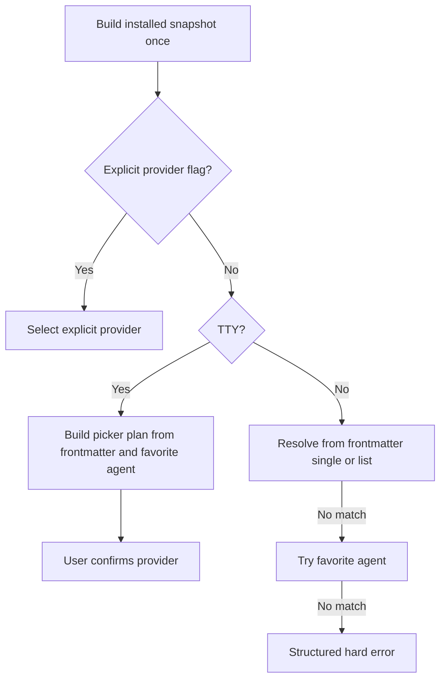
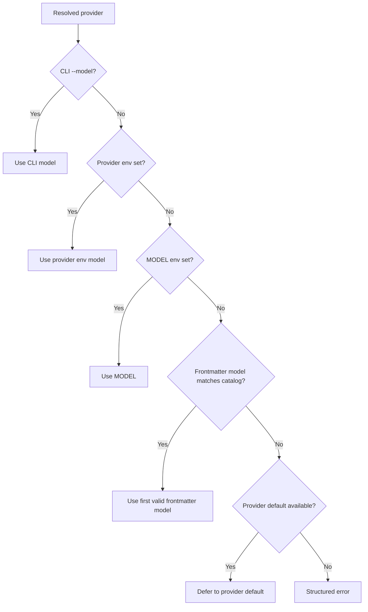
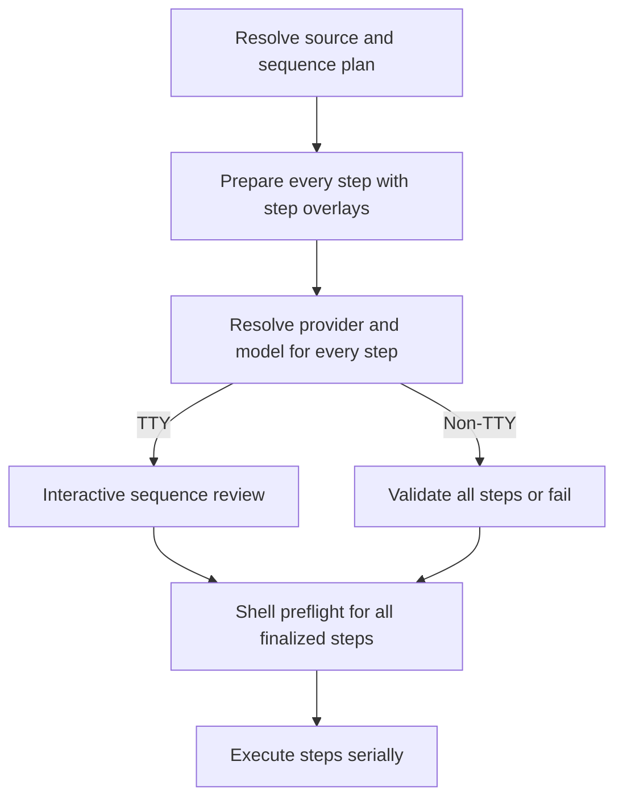

# Agent Selection Technical Design

Primary inputs:

- `claudine/features/_unscheduled/agent-selection/spec.md`
- current composition preparation in `claudine/lib/src/composition/prepare.rs`
- current composition selection in `claudine/lib/src/composition/select.rs`
- current wrapper-grade execution in `claudine/cli/src/commands/wrap/composition.rs`
- current sequence orchestration in `claudine/cli/src/commands/wrap/sequence.rs`
- current config model in `claudine/lib/src/config/claudine_config.rs`

## Summary

This feature replaces Claudine's current "lazy provider selection" for `compose`, `inline-compose`, and `sequence` with a mode-aware execution target resolver:

- In TTY mode, `--<provider>` still wins immediately, but otherwise Claudine always shows an interactive provider picker for one-shot composition and a sequence-wide review flow for `sequence`.
- In non-TTY mode, the picker is forbidden and frontmatter `agent` plus the configured favorite agent become resolving signals.
- Model selection is resolved in parallel, with precedence `--model` -> provider env -> `MODEL` -> frontmatter `model` -> provider default.
- Frontmatter `agent` and `model` become typed, validated inputs instead of ad hoc raw JSON.
- Sequence gets a new front-loaded step-resolution phase so agent/model decisions are finalized before any step executes.

The design keeps the existing wrapper profiles as the launch mechanism. It adds a new typed resolution layer ahead of launch rather than inventing a second execution engine.

## Goals

1. Match the spec's TTY and non-TTY resolution chains exactly.
2. Remove the current implicit `single installed provider` shortcut from composition selection.
3. Support frontmatter `agent` as either a string or an ordered list.
4. Support frontmatter `model` as either a string or an ordered list.
5. Keep "installed on host" tied to `InstalledAiClients::is_installed(provider.sniff_ai_cli())`.
6. Front-load all agent/model questions for `sequence`.
7. Add a cached model-catalog layer with user overrides so frontmatter `model` hints can be validated without hardcoding all models into Claudine.

## Non-Goals

1. No change to the direct wrapper subcommands such as `claudine codex ...`; this design is for composition flows only.
2. No sequence parallelism.
3. No bespoke full-screen Ratatui editor in v1; instead this feature reuses the **`InputTable`** component from `biscuit-tui` (workspace crate, lives at `biscuit-tui/lib/`) for the sequence review screen, and **`ChooseOne`** for the one-shot picker. No custom widget code is introduced.
4. No attempt to add new Roo wrapper support as part of this feature.

## Current Baseline

Today composition selection works like this:

1. explicit provider flag
2. single installed candidate after exclusions
3. frontmatter `agent` string
4. config `preferred_agent`
5. interactive picker or error

Current gaps relative to the spec:

- `single installed candidate` auto-selection exists today and must be removed.
- `agent` is only handled as a raw singular JSON value; list semantics do not exist.
- `model` frontmatter is not resolved at all.
- one-shot composition prompts interactively only as a late fallback instead of "always picker in TTY mode".
- `sequence` does not build or confirm a per-step agent/model plan before execution.
- model validation infrastructure does not exist.

There is also one important scope constraint in the current codebase:

- `profile_for_provider(Provider::RooCode)` returns `None`.
- `build_candidate_set(...)` already excludes `RooCode` for composition.

That means v1 of this design applies to the currently wrappable composition providers:

- `claude`
- `codex`
- `gemini`
- `goose`
- `kimi`
- `opencode`
- `qwen`

If Roo support is required later, wrapper support must land first or in parallel.

## Design Decisions

### Keep the stored config key compatible

The spec uses the product term "favorite agent". The codebase already has a persisted `preferred_agent` field. Renaming the persisted key now would create unnecessary churn across config loading, migration tests, init, and the config TUI.

Decision:

- keep the persisted field name as `preferred_agent`
- change its type from `Provider` to `Option<Provider>`
- accept `favorite_agent` as a serde alias on input
- keep repo config overrides rejecting this field in either spelling
- expose `favorite-agent` as the user-facing CLI/config label

This gives the spec's "absence is not an error" behavior without breaking existing configs.

### Resolve from typed hints, not raw JSON

`PreparedComposition` currently carries `effective_agent_hint: Option<Value>`. That is too weak for the new behavior because both `agent` and `model` now have ordered-list semantics and different validation rules.

Decision:

- parse selection-related frontmatter into typed hints during `prepare_direct(...)` and `prepare_inline(...)`
- keep `effective_frontmatter` unchanged for harness and lifecycle code
- stop re-parsing raw JSON inside the resolver

Recommended types:

```rust
pub struct EffectiveSelectionHints {
    pub agent: Option<AgentHint>,
    pub model: Option<ModelHint>,
}

pub enum AgentHint {
    Single(Provider),
    Ordered(Vec<Provider>),
}

pub enum ModelHint {
    Single(String),
    Ordered(Vec<String>),
}
```

`PreparedComposition` then carries:

```rust
pub selection_hints: EffectiveSelectionHints
```

### Split pure resolution from terminal UI

The resolution rules belong in library code. The actual picker and review UI belong in the CLI.

Decision:

- library code computes plans, rankings, and resolved targets
- CLI code renders the picker and review UI from those plans using `biscuit-tui` components (`ChooseOne` for the one-shot picker, `InputTable` for the sequence review), driven via `tui_chrome::run_standalone`
- sequence review state is CLI-owned, but backed by typed library structs

This keeps TTY code out of `claudine/lib` and makes the resolver unit-testable without a terminal. It also avoids inventing custom widget code: rendering and event handling are inherited from `biscuit-tui`.

## Proposed Architecture

### Library modules

Recommended additions:

```text
claudine/lib/src/composition/
├── prepare.rs
├── select.rs              # expand into agent + model resolution
├── sequence.rs
├── types.rs
└── error.rs

claudine/lib/src/model_catalog/
├── mod.rs
├── cache.rs
├── config.rs
├── provider_sources.rs
└── service.rs
```

Responsibilities:

- `composition/prepare.rs`
  - parse `agent` and `model` into typed hints
  - validate frontmatter types early
- `composition/select.rs`
  - compute installed-provider snapshots
  - resolve provider in TTY and non-TTY modes
  - resolve model for a chosen provider
  - return typed reasons for logging and UX
- `model_catalog/*`
  - fetch, cache, merge, and validate provider model lists

### CLI modules

Recommended additions and edits:

```text
claudine/cli/src/commands/
├── compose.rs
├── sequence.rs
└── wrap/
   ├── composition.rs
   ├── sequence.rs
   └── selection_ui.rs     # new helper module
```

Responsibilities:

- `wrap/composition.rs`
  - build installed snapshot once
  - if TTY and no explicit provider flag, show the one-shot picker
  - otherwise resolve non-interactively
  - pass a fully resolved target into launch
- `wrap/sequence.rs`
  - build per-step prepared compositions first
  - resolve each step's provider/model before shell preflight or execution
  - show sequence review UI in TTY mode
  - keep existing two-phase "front-load prompts, then execute" structure
- `wrap/selection_ui.rs`
  - one-shot provider picker built on `tui_chrome::ChooseOne`
  - sequence review screen built on `tui_chrome::InputTable`
  - both are driven by `tui_chrome::run_standalone`; this module owns the small glue that converts library-side `ProviderPickerPlan` / `SequenceStepDraft` values into `ChoiceInput` / `InputTableState` and translates `EventOutcome::Submitted` / `Cancelled` back into resolution decisions

## Data Model

### Resolution mode and installed snapshot

```rust
pub enum ResolutionMode {
    Tty,
    NonTty,
}

pub struct InstalledProviderSnapshot {
    pub runnable: Vec<Provider>,
    pub excluded: BTreeSet<Provider>,
}
```

Rules:

- build once at command start
- use `InstalledAiClients::is_installed(provider.sniff_ai_cli())`
- keep ordering in canonical `PROVIDERS_DISPLAY_ORDER`
- apply `--exclude` only to automatic selection and picker candidates
- explicit provider flags continue to override exclusions

### Resolved execution target

```rust
pub struct ResolvedExecutionTarget {
    pub provider: Provider,
    pub provider_reason: ProviderResolutionReason,
    pub model: Option<String>,
    pub model_reason: ModelResolutionReason,
}
```

`model: None` means "let the wrapper/provider use its default model".

Recommended reason enums:

```rust
pub enum ProviderResolutionReason {
    ExplicitFlag,
    FrontmatterSingle,
    FrontmatterList,
    FavoriteAgent,
    InteractivePicker,
    SequenceReview,
}

pub enum ModelResolutionReason {
    ExplicitCli,
    ProviderEnv(&'static str),
    GenericEnv,
    FrontmatterSingle,
    FrontmatterList,
    ProviderDefault,
    SequenceReview,
}
```

### Interactive plans

The library should return typed plans for the CLI rather than raw vectors.

```rust
pub struct ProviderPickerPlan {
    pub options: Vec<ProviderPickerOption>,
    pub default_index: usize,
}

pub struct ProviderPickerOption {
    pub provider: Provider,
    pub rank_reason: Option<PickerInfluence>,
}

pub enum PickerInfluence {
    FrontmatterSingle,
    FrontmatterList,
    FavoriteAgent,
}
```

For sequence:

```rust
pub struct SequenceStepDraft {
    pub step_index: usize,
    pub step_name: String,
    pub provider_plan: ProviderPickerPlan,
    pub proposed_model: Option<String>,
    pub model_reason: ModelResolutionReason,
    pub provider_locked: bool,
    pub model_locked: bool,
}
```

## Agent Resolution

### Compose and inline-compose

Agent resolution becomes:



Important behavioral changes:

- no `single installed` auto-selection
- TTY mode always prompts unless an explicit provider flag is present
- non-TTY mode never prompts

### Frontmatter `agent`

Accepted shapes:

```yaml
agent: codex
```

```yaml
agent:
  - codex
  - claude
  - gemini
```

Parsing rules:

1. strings are fuzzy-matched through the existing `Provider` matcher
2. ordered lists preserve author order
3. unknown provider names are errors
4. installed-vs-uninstalled is not a parse error; it is resolved later against the installed snapshot

TTY behavior:

- singular installed hint sets the default row
- ordered list lifts installed items to the top in list order
- favorite agent only applies if no frontmatter default applies

Non-TTY behavior:

- singular installed hint resolves directly
- ordered list resolves to the first installed provider in list order
- otherwise favorite agent is tried
- otherwise error

### Picker ordering

Natural order should be `PROVIDERS_DISPLAY_ORDER`, not process discovery order and not alphabetical order.

TTY picker algorithm:

1. start from installed runnable providers in canonical display order
2. if frontmatter `agent` is an ordered list, move listed installed providers to the top in authored order
3. set the default cursor to:
   - frontmatter singular match, else
   - first installed provider from the frontmatter list, else
   - favorite agent if installed, else
   - index `0`

## Model Resolution

Model resolution is independent of TTY mode after the provider is known.



### Environment variable mapping

The composition resolver should use Claudine-owned mappings rather than letting each wrapper profile independently guess precedence:

| Provider | Provider envs before `MODEL` |
| --- | --- |
| Codex | `CODEX_MODEL`, `OPENAI_MODEL` |
| Claude | `CLAUDE_MODEL`, `ANTHROPIC_MODEL` |
| Gemini | `GEMINI_MODEL` |
| Goose | `GOOSE_MODEL` |
| Kimi | `KIMI_MODEL` |
| OpenCode | `OPENCODE_MODEL` |
| Qwen | `QWEN_MODEL` |

Notes:

- the resolver checks these names in order, then falls back to `MODEL`
- once a model is resolved, it is passed into `CompositionExecutionRequest`
- the composition path should no longer rely on OpenCode's wrapper profile to discover `OPENCODE_MODEL`; resolution happens earlier and uniformly

### Frontmatter `model`

Accepted shapes:

```yaml
model: gpt-5.4
```

```yaml
model:
  - gpt-5.4
  - gpt-5.4-mini
```

Rules:

1. wrong JSON type is an error
2. invalid model names for the chosen provider are skipped, not errored
3. the first valid list entry wins
4. if the provider has no catalog information available, frontmatter `model` is ignored and resolution falls through

That last rule is important because the spec leaves several provider data sources as TBD. Claudine must remain usable while those sources are incomplete.

### OpenCode special case

For non-interactive OpenCode runs:

- if the final resolution chain produces no model, the run errors before launch
- the error text should keep the current actionable guidance about `--model` and `OPENCODE_MODEL`

For all other providers:

- if no explicit or validated model is resolved, Claudine leaves `model = None`
- wrapper launch then uses the provider's own default model behavior

## Model Catalog Subsystem

### Purpose

The model catalog exists only to answer one question for this feature:

- "Is this frontmatter model valid for the provider we already chose?"

It is not a general remote model browser in v1.

### Storage

Recommended cache location:

```text
~/.claudine/cache/models/<provider>.json
```

Recommended cache payload:

```json
{
  "provider": "codex",
  "fetched_at": "2026-04-14T12:34:56Z",
  "source": "unchained-ai",
  "models": ["gpt-5.4", "gpt-5.4-mini"]
}
```

The service should accept stale cache reads if refresh fails. Frontmatter model resolution should not fail just because the network or a subprocess source is temporarily unavailable.

### Config override shape

Recommended user-config shape:

```json5
{
  preferred_agent: "codex",
  models: {
    codex: ["gpt-5.4", "gpt-5.4-mini"],
    opencode: {
      mode: "replace",
      values: ["openrouter/auto"]
    }
  }
}
```

Recommended Rust shape:

```rust
pub struct ProviderModelOverride {
    pub mode: ModelOverrideMode,
    pub values: Vec<String>,
}

pub enum ModelOverrideMode {
    Add,
    Replace,
}
```

Semantics:

- bare list means additive
- object form allows explicit `replace`
- overrides are user-scope only in v1
- repo config should reject `models.*` for now so one repository cannot silently redefine another user's validation rules

### Provider sources

Recommended source mapping:

| Claudine provider | Source |
| --- | --- |
| Codex | `unchained-ai` generated OpenAI model enums |
| Claude | `unchained-ai` generated Anthropic model enums |
| OpenCode | `opencode models` subprocess parser |
| Qwen | `opencode models` filtered and normalized to Qwen entries |
| Gemini | no fetched source in v1; user overrides only |
| Kimi | no fetched source in v1; user overrides only |
| Goose | no fetched source in v1; user overrides only |

For Codex and Claude, the implementation should consume the generated enums shipped in `unchained-ai/lib` rather than shelling out to the generator package directly. The generator is the production source of truth, but the runtime dependency should be the generated Rust catalog already present in the workspace.

## Sequence Design

### New phase ordering

`sequence` needs one extra front-loaded phase before today's shell preflight work.



### Step preparation and resolution

For each step:

1. build the existing `SequenceStepOverlay`
2. prepare the step so effective frontmatter is fully composed
3. resolve provider/model from that prepared frontmatter plus shared CLI/config/env state

This matters because step state may influence frontmatter:

```yaml
agent: "{{state.agent}}"
model:
  - "{{state.primary_model}}"
  - "{{state.fallback_model}}"
```

The sequence resolver must therefore operate on prepared per-step frontmatter, not on the raw source document.

### Interactive review

The review screen is a `biscuit-tui` `InputTable` constructed from the per-step `SequenceStepDraft` values. This delivers the spec's end-state UX (an in-place navigable/editable table) directly, with no `inquire`-based MVP step.

Column layout per row:

| Column | `InputTableColumn` variant | Source |
| --- | --- | --- |
| Step  | `StaticText` | `SequenceStepDraft.step_index` and `step_name`; not editable |
| Agent | `ChooseOne` over installed providers | options ordered by `ProviderPickerPlan.options`; default cursor at `default_index`; locked when `provider_locked` is true |
| Model | `ChooseOne` over the resolved model catalog | falls back to `TextInput` for providers whose catalog is `None` or empty (Gemini/Kimi/Goose in v1, plus any provider whose cache is unavailable); locked when `model_locked` is true |

Behavior is inherited from `InputTable`:

- arrow keys navigate cells; Tab/Shift+Tab wrap
- entering a cell activates its inner widget for in-place editing
- `Ctrl+S` validates and submits the entire table as the single sign-off; `Esc` cancels and aborts the sequence command
- locked cells (from CLI flag locks, see "Locked fields") are rendered as `StaticText` rather than as an editable widget

When `Ctrl+S` returns `EventOutcome::Submitted`, the CLI reads the typed `Vec<Row>` value back out of `InputTableState`, maps each row's `CellValue` back onto the corresponding `SequenceStepDraft`, and produces the final per-step `ResolvedExecutionTarget`.

### Locked fields

Sequence review must honor explicit CLI flags:

- explicit provider flag locks the provider for all rows
- explicit model flag locks the model for all rows
- locked values should be shown in the review summary but not editable

### Non-TTY sequence failure

Non-TTY mode must validate every step's provider/model before any step executes.

Decision:

- aggregate unresolved step failures into one error report
- do not start partial execution

Recommended error shape:

```rust
CompositionError::SequenceSelectionFailed {
    failures: Vec<SequenceSelectionFailure>,
}
```

with entries such as:

- step number
- step name
- provider failure reason
- available installed providers at the time of resolution

## Execution Path Changes

### Composition request shape

Today `CompositionExecutionRequest` carries unresolved selection inputs such as `explicit_provider`, `excluded`, and `model`.

Recommended evolution:

```rust
pub struct CompositionExecutionRequest {
    ...
    pub resolved_target: Option<ResolvedExecutionTarget>,
    pub explicit_provider: Option<Provider>,
    pub excluded: BTreeSet<Provider>,
    pub model: Option<String>,
    ...
}
```

Behavior:

- if `resolved_target` is present, the executor skips provider/model resolution
- if absent, the executor performs one-shot resolution using the new library logic

This keeps the current compose flow incremental while allowing `sequence` to carry step-specific reviewed targets.

### Logging and dispatch context

`composition_dispatch_context(...)` should be extended with:

- `provider_selection_reason`
- `resolved_model`
- `model_selection_reason`
- `selection_mode`

This gives later reporting/resume work a stable record of how the run target was chosen.

## Config and CLI Changes

### Config model

Changes to `ClaudineConfig`:

```rust
#[serde(default, alias = "favorite_agent")]
pub preferred_agent: Option<Provider>,
#[serde(default)]
pub models: HashMap<Provider, ProviderModelOverride>,
```

Additional behavior:

- init must allow "no favorite agent" when no providers are installed
- the config TUI should render favorite agent as optional
- repo config validation must reject both `preferred_agent` and `favorite_agent`
- repo config validation should also reject `models`

### Setter command

This feature should not invent a new bespoke config write path. It should plug into the existing/planned config mutation surface.

Recommended user-facing setter:

```text
claudine config set favorite-agent <provider>
```

Internally this writes `preferred_agent`.

If the generic `set-key-value` feature lands first, this feature should reuse it and only add the favorite-agent alias.

## Error Handling

Recommended new error variants:

```rust
AgentHintWrongType(String),
ModelHintWrongType(String),
SelectionUnavailable {
    mode: ResolutionMode,
    installed: Vec<Provider>,
    favorite_agent: Option<Provider>,
    frontmatter_agent_present: bool,
},
SequenceSelectionFailed {
    failures: Vec<SequenceSelectionFailure>,
},
```

Guidance for error style:

- non-TTY selection errors must tell the user exactly which signals can resolve the run
- step-level sequence errors must identify the failing step and step name
- frontmatter type errors should fail early during preparation, not late in launch

## Testing Plan

### Unit tests

Add focused tests for:

1. `agent` string parsing
2. `agent` list parsing
3. `model` string parsing
4. `model` list parsing
5. invalid frontmatter types
6. TTY picker ranking and default index
7. non-TTY resolution order without the old `single installed` shortcut
8. favorite-agent absence
9. environment variable precedence per provider
10. additive and replace model override merges
11. stale cache fallback
12. OpenCode non-interactive hard error when no model survives resolution

### CLI and integration tests

Add or update tests around:

1. `compose` non-TTY error text
2. `inline-compose` non-TTY error text
3. `sequence` front-loaded failure before any step execution
4. `sequence` per-step resolved target propagation
5. explicit provider/model lock behavior in sequence review planning

The interactive UI itself should be kept thin so most behavior is exercised through planner tests rather than terminal automation.

## Documentation Updates

Update after implementation:

1. `claudine/docs/topics/composition.md`
2. `claudine/cli/README.md`
3. `claudine/.claude/skills/claudine/SKILL.md`
4. config documentation for `preferred_agent` and `models`

The composition docs must explicitly call out that:

- TTY mode always prompts unless an explicit provider flag is present
- non-TTY mode never prompts
- frontmatter `agent` and `model` are read from effective composed frontmatter
- Roo is not part of the composition candidate set until wrapper support exists

## Implementation Order

Recommended order:

1. relax `preferred_agent` to `Option<Provider>` and add the config alias/validation rules
2. add typed frontmatter selection hints in `prepare.rs`
3. replace the current provider resolver with mode-aware agent resolution
4. add the model resolver and OpenCode hard-error path
5. add the model-catalog cache and user overrides
6. wire one-shot TTY picker behavior using `tui_chrome::ChooseOne` + `run_standalone`
7. wire sequence pre-resolution and review flow using `tui_chrome::InputTable` + `run_standalone`
8. expand tests and update docs

This ordering keeps the feature shippable in coherent slices while preserving the current wrapper launch path until the new resolver is ready.
