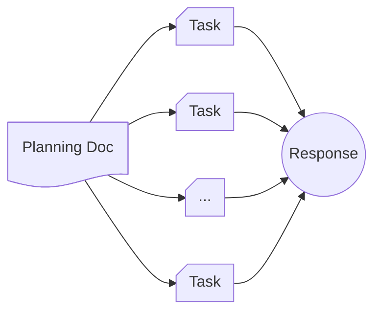

# The `concurrent` command in Claudine

This feature introduces the `concurrent` command to Claudine. This primitive is related to the `concurrent` command we've already implemented in that it's _scope_ is not a single Agentic query and response but rather a **set** of queries and responses.

## The "concurrent" Flow

Whereas the "concurrent" command _serializes_ operations, "concurrent" parallelizes it's tasks. 

This type of parallel execution flow is more and more common these days and many people implement something similar _within_ an Agent CLI using an "orchestrator" and sub-agents.

## Usage in Claudine

The basic syntax is:

> `claudine concurrent <file>`

Where the file reference points to a Markdown document which must have a `tasks` Frontmatter property. The `tasks` property is where we define all of the _concurrent tasks_ which will be managed by Claudine. These tasks fit into these categories:

1. **State** based Task

    Defines a "state" for the task where state is then used to interpolate into the body of the "planning document" to create the prompt.

1. **File Reference** based Task

    Refers to another Markdown document for the task's definition. The file being referred to will have it's Frontmatter properties evaluated to determine how it 

1. **Shell command** Task

