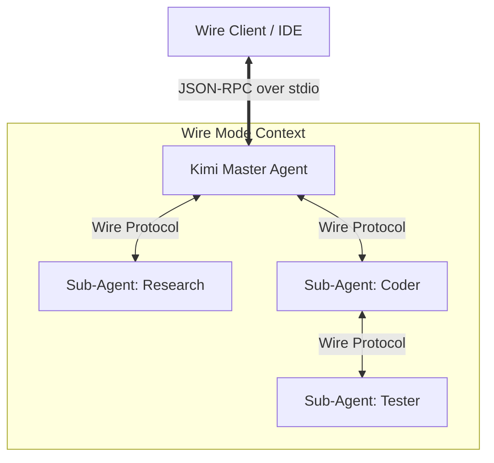
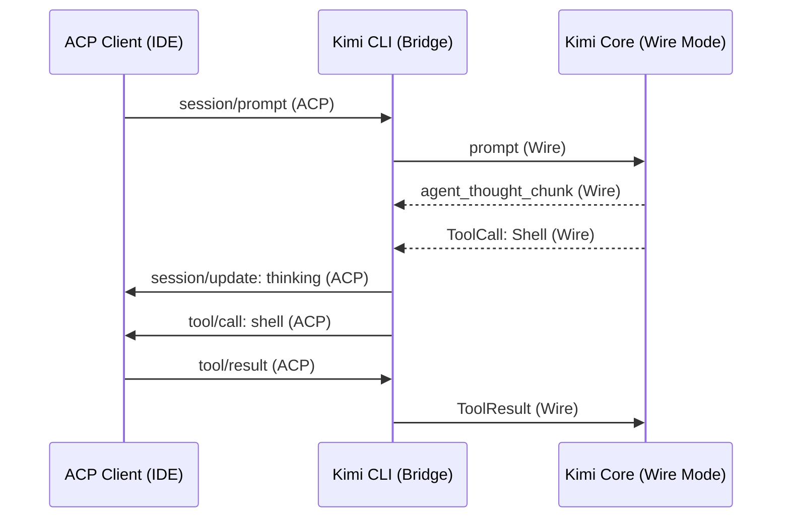

# Kimi CLI Wire Mode: Architecture and Intent

Kimi CLI's **Wire Mode** represents a specialized, low-level communication protocol designed to expose the internal reasoning and execution state of the Kimi agent. Unlike standard CLI interactions that prioritize human-readable terminal output, Wire Mode is engineered for machine-to-machine orchestration, allowing the agent core to be embedded into custom environments, IDEs, and multi-agent "swarms."

## Overview of Wire Mode

The primary intent of Wire Mode is the **complete decoupling** of the agent's reasoning core from its presentation layer. In the Kimi ecosystem, even the standard Shell UI is architecturally treated as a client of the Wire protocol.

- **Purpose:** To provide a high-fidelity, bidirectional stream of agent "intent," including internal thoughts, planned tool calls, and execution telemetry.
- **Activation:** Wire Mode is activated via the `--wire` flag (e.g., `kimi --wire`).
- **Target Use Cases:** Building custom IDE plugins, creating automated testing harnesses for agents, and orchestrating sub-agent swarms where a "master" agent controls multiple specialized sub-agents.

## Architecture and Protocol

Wire Mode is built on a **JSON-RPC 2.0** foundation, utilizing newline-delimited JSON (NDJSON) over standard input (`stdin`) and standard output (`stdout`).

### Protocol Fundamentals

- **Transport:** Synchronous `stdio` streams.
- **State Management:** Stateful sessions identified by session IDs, allowing for context persistence across multiple turns.
- **Versioning:** As of early 2026, the protocol is at version **1.7**, reflecting significant maturity in handling complex tool-use cases and multi-modal inputs.

### Communication Flow

The protocol categorizes messages into three distinct flows:

1. **Client Requests (Client → Agent):** Commands to initialize the agent, start a prompt turn, or cancel an operation.
2. **Agent Events (Agent → Client):** Asynchronous notifications (fire-and-forget) regarding the agent's state transitions, token usage, or content generation.
3. **Agent Requests (Agent → Client):** Blocking requests where the agent pauses execution to wait for client approval (e.g., before running a destructive shell command) or to request data (e.g., an external tool result).

### Sub-Agent Orchestration

A unique architectural feature of Wire Mode is its native support for **recursive sub-agents**. Through the `SubagentEvent`, a primary agent can forward events from nested agents, enabling a tree-structured tracking of complex task execution across a swarm.

## Key Features and Intent Architecture

Kimi's "Intent Architecture" refers to how it signals its high-level goals before executing them. This is surfaced through specific Wire Mode messages.

### Structured Intent Signaling

Unlike standard LLM streaming which outputs raw text, Wire Mode separates the agent's "Thinking" from its "Message."

- **Think Chunks (`agent_thought_chunk`):** Real-time streaming of the model's internal reasoning (Deep Think traces).
- **Message Chunks (`agent_message_chunk`):** The actual content intended for the user.
- **Tool Intent:** Tool calls are signaled *before* execution, allowing clients to render planned actions in a UI.

### Human-in-the-Loop (Approval Requests)

For sensitive operations like file system mutations or shell execution, Wire Mode issues an `ApprovalRequest`. The agent explicitly stops and waits for a `result` from the client. This ensures that the client (and by extension, the user) maintains ultimate authority over the agent's "intent."

### External Tool Execution

Clients can register "External Tools" during the `initialize` handshake. When the agent intends to use one of these tools, it sends a `ToolCallRequest` to the client. The client executes the logic (e.g., querying a private database) and returns the output to the agent's context.

## Comparison: Wire Mode vs. ACP

While both protocols use JSON-RPC 2.0, they serve different layers of the agentic ecosystem.

| Feature             | Wire Mode (Kimi)                                    | Agent Client Protocol (ACP)                      |
|:--------------------|:----------------------------------------------------|:-------------------------------------------------|
| **Primary Intent**  | Internal agent orchestration & telemetry            | Cross-vendor Editor ↔ Agent interoperability     |
| **Scope**           | Deep agent-core state (Steps, Compaction, Thinking) | UI-centric interactions (Files, Terminal, Diffs) |
| **Standardization** | Vendor-specific (Moonshot AI)                       | Open Industry Standard (Zed, Google, JetBrains)  |
| **Tool Execution**  | Internal Tool Router                                | "Reverse Request" model (Client executes all)    |
| **Swarm Support**   | Native `SubagentEvent` support                      | Session-based (Multi-agent handled by Client)    |

### Functional Relationship

In the Kimi ecosystem, **Wire Mode** is the "internal nervous system." When Kimi is used in an IDE via **ACP** (using the `kimi acp` command), the CLI acts as a bridge, translating internal Wire Mode events into standardized ACP messages.

## Comparable Offerings in the Ecosystem

While Kimi is unique in exposing its internal protocol as "Wire Mode," most modern agentic CLIs provide a machine-readable mode, primarily through **ACP** or **LSP-like** interfaces.

- **Claude Code:** Primarily supports **ACP** for IDE integration. It does not expose a separate "Wire Mode" but uses a similar streaming JSON-RPC model for its internal communication with the Claude-Core.
- **Gemini CLI:** Strictly follows **ACP** for interaction with Zed and Google's internal tooling.
- **Codex CLI / Goose:** These agents are built specifically on **ACP** as their primary interface for all non-interactive sessions.
- **OpenCode / Qwen Code:** Utilize a simplified JSON-RPC stream for VS Code extensions, though they are rapidly moving toward **ACP** compliance to match the broader ecosystem.

Kimi's Wire Mode remains the most "verbose" of these protocols, providing specific hooks for events like **Context Compaction** and **Sub-agent spawning** that are not yet fully standardized in the current version of ACP.
