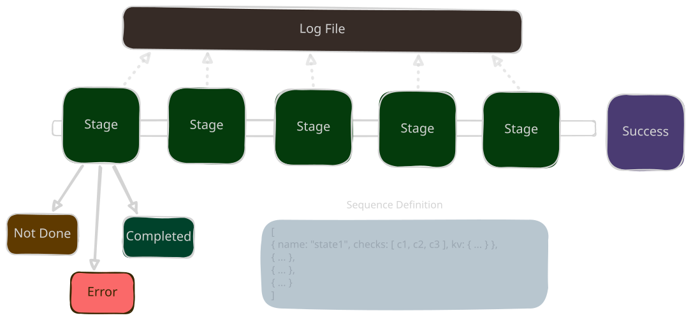

# Claudine Sequences

## Overview

A `sequence` in Claudine is an orchestrated set of steps which:

- have a name representing the "state name"
    - when the sequence is run Claudine will set the `state` property to this "name"
- optionally have a set of `checks` which are used 
    - each of the checks are shell commands which all must result in `true` to achieve a successful outcome and allow the sequence to move to the next stage
- optionally provide a `kv` property as a key/value dictionary
    - when this is set 

### Sequence Illustration



### Checks

A "check" is a bag of properties which allow us to check whether a **Stage** has completed successfully and how to handle a check failure. This check will be represented in Rust as a struct:

```rust
pub struct StageRecovery {

    prompt: Option<String>,
    commands: Option<vec!<ShellCommand>>,
    user_message: Option<String>,

}

pub enum SequenceFailureAction {
    /// the `SequenceCheck` failed but the Agent should be able to
    /// recover from this failure
    RecoverableFailure(StageRecovery),
    /// The failure is too severe to consider trying to continue
    /// with the sequence. The string parameter is a description
    /// which will be conveyed in the log and to STDERR about
    /// what went wrong or why we're stopping.
    Abandon(String)
}

pub enum CheckCommand {
    /// **CommandExitCode**`(command)`
    /// 
    /// the pass/failure of this command will be 
    /// determined by the exit code returned (0 = ok, 1+ = failure)
    CommandExitCode(String),
    /// **IncludesText**`(command, find)`
    /// 
    /// If the content returned in STDOUT contains
    /// the text provided (`find` parameter) then
    /// the check passes.
    CommandIncludesText(String, String),
    /// **AvoidsText**`(command, find)`
    /// 
    /// If the content returned in STDOUT contains
    /// the text provided (`find` parameter) then
    /// the check passes.
    CommandAvoidsText(String, String),

    /// Received valid JSON from STDOUT
    ValidJson,
    /// Received valid JSON5 from STDOUT
    ValidJson5,
    /// Received valid YAML from STDOUT
    ValidYaml,
    /// Received valid TOML from STDOUT
    ValidToml,

    /// if the file referenced does exist in the 
    FileExists(String),
    /// if the file referenced both exists and is valid JSON
    JsonFileExists(String),
    /// if the file referenced both exists and is valid JSON5
    Json5FileExists(String),
    /// if the file referenced both exists and is valid YAML
    YamlFileExists(String),
    /// if the file referenced both exists and is valid TOML
    TomlFileExists(String),

    /// the repo has no staged files
    NoStagedFiles,
    NoStagedFilesInPackageArea(String),
    NoStagedFilesInPackage(String),

    /// **FilePropertyEquals**`(file_ref, frontmatter_prop, value)`
    /// 
    /// If the frontmatter property exists in the `file_ref` and the 
    /// frontmatter properties value equals the specified value then 
    /// the check passes.
    FilePropertyEquals(String,String,FrontmatterValue),
    FilePropertyNotEqual(String,String,FrontmatterValue),

    LineCountEquals(String, i32),
    LineCountGreaterThan(String, i32),
    LineCountLessThan(String, i32),
    CharacterCountEquals(String, i32),
    CharacterCountGreaterThan(String, i32),
    CharacterCountLessThan(String, i32),
}

pub struct SequenceCheck {
    name: String,
    command: CheckCommand,
    failure: SequenceFailureAction,
}
```
