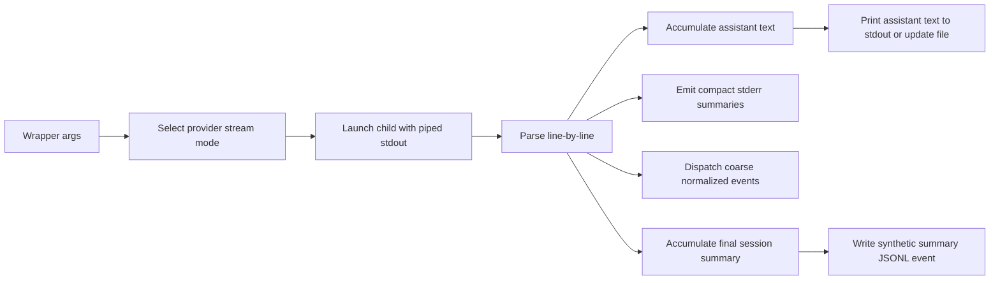

# Stream-JSON Wrapper Spec

## Summary

Claudine should use provider-native structured streaming output as the default control plane for wrapped non-interactive sessions, while preserving the current shell-friendly contract that `stdout` contains the assistant response and `stderr` contains operational status.

This feature covers six providers documented under `claudine/docs/non-interactive-sessions/`:

- Claude Code
- Codex
- Gemini CLI
- Kimi Code
- OpenCode
- Qwen CLI

The design standardizes four things:

1. how wrapped non-interactive sessions are launched
2. what appears on `stdout` and `stderr`
3. what gets routed into Claudine's existing dispatch pipeline
4. what gets persisted into Claudine JSONL logs for reporting

## Problem

Today, wrapped non-interactive sessions are only partially observable.

- Plain-text stdout does not expose session IDs, resolved model IDs, token usage, cost, duration, cache behavior, rate-limit state, or structured tool timelines.
- Some providers emit hook noise or status chatter into stdout, which contaminates shell pipelines and inline composition.
- Claudine's reporting pipeline can only index what reaches normalized JSONL logs. Non-interactive wrapper runs currently lose high-value metadata that providers already expose in their structured stream formats.
- Compose and document-update flows mostly rely on exit code alone, which is too weak for error classification and retry decisions.

## Goals

- Preserve a stable default UX for non-interactive wrapper users:
  `stdout` remains the assistant response, not raw provider JSONL.
- Surface compact, high-value runtime metadata on `stderr`.
- Reuse the existing Claudine adapter, dispatch, JSONL, and reporting pipeline instead of creating a second telemetry system.
- Normalize cost and token usage into the existing reporting schema wherever possible.
- Support live coarse-grained event dispatch without flooding logs with deltas.
- Improve compose and inline-update reliability by extracting clean assistant output from structured streams.

## Non-Goals

- Replacing native provider hook systems for interactive sessions.
- Persisting every raw provider delta event into Claudine JSONL.
- Building a new database schema for first rollout.
- Perfect event parity across all providers on day one.
- Exposing raw provider stream formats as the default wrapper UX.

## Primary Users

### Shell users

They expect:

- clean assistant text on `stdout`
- progress and usage on `stderr`
- predictable exit codes

### Compose and document-update workflows

They need:

- structured extraction of final assistant text
- better error classification
- cleaner retry behavior

### Reporting and observability users

They want:

- session IDs
- resolved model IDs
- token usage
- cost
- duration
- tool activity summaries

## Scope

This spec applies to wrapped non-interactive execution paths in `claudine cli`, including:

- normal wrapped non-interactive runs
- inline composition / document mutation runs that currently use captured stdout

It does not change the semantics of provider hook registration or interactive TTY sessions.

## Existing Constraints

The implementation must fit the current Claudine architecture:

- provider wrappers live in `claudine/cli/src/commands/wrap/`
- normalized event parsing lives in `claudine/lib/src/adapters/`
- event dispatch lives in `claudine/lib/src/dispatch/`
- JSONL reporting ingestion expects normalized `EventMeta`
- reporting already extracts `extra.model`, `extra.token_usage`, and `extra.cost_usd`

This means the feature should prefer:

- direct wrapper-side stream parsing
- direct calls into library dispatch for coarse events
- direct JSONL summary writes for reporting-only synthetic events

## Provider Capability Matrix

| Provider | Internal structured mode | Final response source | Summary source | Distinct requirements |
|---|---|---|---|---|
| Claude | `--print --verbose --output-format stream-json` | `assistant.message.content[].text` | `result`, plus `init`, optional `rate_limit_event`, optional `assistant.error` | richest metadata; `--verbose` required for full init/auth/version info |
| Codex | `exec --json --output-last-message <tempfile>` | output-last-message file, with stream as metadata/control plane | `turn.completed`, thread lifecycle, coarse item events | preserve raw JSONL only when explicitly requested |
| Gemini | `--output-format stream-json` | concatenated assistant `message` deltas | `result.stats` | correlate tools by `tool_id` |
| Kimi | `--print --output-format stream-json` | accumulated assistant content parts | latest `StatusUpdate` plus child exit | no aggregate final result; reports context pressure |
| OpenCode | `run --output-format json` | accumulated text events | accumulated per-step usage/cost plus child exit | uses NDJSON `json`, not `stream-json`; model comes from wrapper config/env |
| Qwen | `--output-format stream-json` | accumulated assistant stream text | final result/usage event when available | share Gemini-style logic where event shapes match, but tolerate Qwen-specific names |

## Functional Requirements

## 1. Activation Rules

When a provider is wrapped in non-interactive mode and the caller did not explicitly request a raw output format, Claudine must prefer the provider's structured stream mode internally if that provider supports it.

This internal structured mode is an implementation detail. It must not change the default user-facing `stdout` contract.

### Default behavior

- Supported provider runs use structured streaming internally.
- Claudine parses the stream live.
- Claudine reconstructs the assistant response for `stdout`.
- Claudine emits metadata summaries to `stderr`.

### Explicit output behavior

If the caller explicitly requests an output mode, Claudine must respect that request.

| User intent | Required behavior |
|---|---|
| default wrapped non-interactive | use internal structured mode and reconstruct text stdout |
| `--output text` | use provider text mode; do not force structured rewriting |
| `--output json` | preserve provider-native JSON output contract |
| `--output stream` | preserve raw provider stream/JSONL/NDJSON on stdout unchanged |

If a provider cannot support a requested explicit mode, current wrapper validation behavior remains authoritative.

## 2. Stdout Contract

In default wrapped non-interactive mode, `stdout` must contain only the assistant response intended for pipeline consumption.

`stdout` must not contain:

- provider hook debug logs
- session metadata summaries
- token usage summaries
- progress messages
- raw stream envelopes

### Provider-specific extraction rules

| Provider | Extraction rule |
|---|---|
| Claude | concatenate `assistant` message text parts in arrival order |
| Codex | prefer `--output-last-message` file; use stream item text only as fallback |
| Gemini | concatenate assistant `message` events with `role=assistant` |
| Kimi | concatenate assistant text-bearing `ContentPart` events |
| OpenCode | concatenate assistant text fragments from NDJSON text events |
| Qwen | concatenate assistant text-bearing stream events |

For providers that stream deltas, Claudine must preserve arrival order and avoid inserting extra separators unless the provider format requires them.

## 3. Stderr Contract

`stderr` is reserved for Claudine's operator-facing runtime summaries.

These summaries must be concise, human-readable, and safe for normal command-line use.

### Start summary

When available and not suppressed by `--quiet` or `--silent`, Claudine should print a compact session-start summary containing the best available subset of:

- provider session/thread ID
- resolved model
- wrapper/provider version if available
- auth source if operationally important
- permission/sandbox mode if available

### Warning and error summaries

Claudine must print important runtime warnings immediately when they appear in the stream, including:

- structured provider warnings
- rate-limit warnings
- retry/backoff relevant failures
- context pressure warnings for Kimi
- provider-classified errors such as Claude `billing_error`

### Completion summary

When available and not suppressed:

- print duration
- print input/output/cache token counts
- print cost if present
- print tool-call count if present
- print final status on failure

### Verbosity rules

| Flag | Behavior |
|---|---|
| default | start summary, warnings/errors, completion summary |
| `--quiet` | warnings/errors plus a single compact completion line |
| `--silent` | no Claudine-generated stream summaries |

Raw provider stderr that Claudine is not synthesizing may still appear according to existing wrapper behavior.

## 4. Live Dispatch Rules

Structured stream parsing must support live routing of coarse events into Claudine's existing library dispatch path.

Dispatch must use the provider's existing adapter logic whenever possible.

### Events that should be dispatched live

- session start
- turn start
- turn complete
- turn error
- before tool
- after tool
- permission request
- compact notification or plan update when it maps cleanly and is operationally useful

### Events that must not become first-class Claudine events in the first rollout

- token or text deltas
- reasoning deltas
- command output chunks
- raw provider fragments with no stable mapping
- large init payload arrays such as Claude tools/skills/agents lists

### Dispatch behavior

- Dispatch must call library code directly, not shell out to `claudine handle`.
- Unknown provider events should be ignored or preserved only in parser-local state.
- Parsing one malformed line must not kill the entire session unless the stream becomes unusable.

## 5. Reporting and JSONL Logging

This feature must enrich Claudine's existing JSONL-first reporting pipeline without requiring a new storage system.

### Required logging outputs

The feature must produce two kinds of telemetry:

1. live coarse-grained normalized events, when the provider stream exposes them and they are useful for hooks/reporting
2. one synthetic wrapper summary event at session end for reporting completeness

### Synthetic wrapper summary event

Every structured-wrapper session must emit exactly one reporting-oriented summary event after child completion, even when the provider itself lacks a final aggregate stream event.

This summary event is for logging and reporting. It must not trigger user-configured hooks a second time.

Recommended characteristics:

- normalized `EventMeta`
- `event = session_end`
- `extra.synthetic = true`
- `extra.synthetic_kind = "stream_wrapper_summary"`
- `extra.stream_protocol = "stream-json" | "jsonl" | "ndjson"`
- `extra.model`
- `extra.token_usage`
- `extra.cost_usd` when known
- `extra.duration_ms`
- `extra.duration_api_ms` when known
- `extra.provider_status`
- `extra.exit_code`
- `extra.tool_calls` when known
- `extra.raw_summary` or provider-specific compact summary object when safe

### Reporting compatibility requirements

The summary event must populate existing reporting keys so current ingestion works without a schema migration:

- `extra.model`
- `extra.token_usage.input`
- `extra.token_usage.output`
- `extra.token_usage.total`
- `extra.token_usage.cache_read`
- `extra.cost_usd`

Additional provider-specific fields may live in `extra` and remain queryable through JSON.

## 6. Compose and Inline-Update Behavior

Inline composition and similar captured-output flows must use the same structured parsing rules as live wrapped execution, not a separate ad hoc parser per call site.

### Required outcomes

- assistant response extraction is deterministic
- provider noise is excluded from the document body
- provider-classified failures can be surfaced clearly
- retry-relevant metadata is available to future compose logic

### Error-classification requirement

The structured parsing path must expose normalized failure metadata when the provider gives it.

Examples:

- Claude `assistant.error = billing_error` should be distinguishable from transport failure
- Claude or other providers with rate-limit metadata should surface retry-after hints when possible
- Kimi/OpenCode runs with no aggregate result must still report whether the session appears complete or interrupted

## 7. Provider-Specific Requirements

## Claude

- Must use `--verbose --output-format stream-json` in wrapped structured mode.
- Must parse `init` for session ID, model, auth source, version, permission mode, and MCP count summary.
- Must parse `assistant.error` for failure classification.
- Must parse `result` for duration, API duration, turns, usage, per-model usage, cost, stop reason, and permission denials.
- Must parse `rate_limit_event` when present and surface it on `stderr` when notable.
- Must not persist large `init` arrays such as tools, slash commands, skills, or agents into reporting summary fields.

## Codex

- Must use `exec --json` as the live metadata stream.
- Must pair structured mode with `--output-last-message <tempfile>` in default text-output mode.
- Must treat the stream as the control plane and the output-last-message file as the primary source of final response text.
- Must parse thread lifecycle, turn lifecycle, coarse item lifecycle, usage, and failures where available.
- Must treat persisted Codex session JSONL files as fallback/audit paths, not the primary real-time integration path.
- Must still support live logging when Codex is run with `--ephemeral`.

## Gemini

- Must parse `init`, assistant `message`, `tool_use`, `tool_result`, `error`, and `result`.
- Must correlate tool results to tool uses via `tool_id`.
- Must normalize `result.stats` into Claudine token usage fields.
- Must preserve Gemini's distinction between total prompt-side input and non-cached input in provider-specific extra fields.

## Kimi

- Must treat the stream as incremental state, not a final-summary protocol.
- Must accumulate assistant text from content events.
- Must keep the most recent `StatusUpdate` token usage snapshot as the session summary basis.
- Must surface context pressure warnings when `context_usage` indicates high utilization.
- Must tolerate the absence of model ID and cost in the stream.

## OpenCode

- Must use provider-native NDJSON `json` output, not `stream-json`.
- Must accumulate per-step usage and cost across the run because no aggregate final result is guaranteed.
- Must source model identity from wrapper configuration, explicit `--model`, or relevant environment variables when the stream does not provide it.
- Must emit retry and step-failure warnings to `stderr` when available, but avoid noisy per-fragment tracing by default.

## Qwen

- Must support Qwen's structured non-interactive output as a first-class wrapped mode.
- Should share Gemini-style parsing logic where upstream shapes truly match.
- Must tolerate Qwen-specific event names or result envelopes instead of assuming Gemini parity.
- Must normalize any reported usage into the shared token-usage shape.

## 8. Normalized Summary Shape

The wrapper parsing layer should produce a provider-agnostic summary object conceptually equivalent to:

```rust
pub struct StreamExecutionSummary {
    pub provider: Provider,
    pub session_id: Option<String>,
    pub model: Option<String>,
    pub assistant_text: String,
    pub provider_status: Option<String>,
    pub exit_code: i32,
    pub is_error: bool,
    pub error_kind: Option<String>,
    pub error_message: Option<String>,
    pub duration_ms: Option<u64>,
    pub duration_api_ms: Option<u64>,
    pub num_turns: Option<u32>,
    pub token_usage: Option<NormalizedTokenUsage>,
    pub cost_usd: Option<f64>,
    pub tool_calls: Option<u32>,
    pub rate_limit: Option<RateLimitInfo>,
    pub context_usage: Option<ContextUsage>,
    pub raw_summary: Option<serde_json::Value>,
}
```

This does not mandate a specific file or trait name, but the implementation must expose an equivalent abstraction so:

- stdout reconstruction
- stderr summaries
- logging
- reporting
- compose error handling

all consume the same parsed result instead of reimplementing provider rules in multiple places.

## 9. Token Normalization Rules

Claudine must normalize provider usage into the shared reporting shape:

```json
{
  "input": 0,
  "output": 0,
  "total": 0,
  "cache_read": 0
}
```

Optional fields such as `cache_write` may be preserved provider-natively in `extra`.

### Mapping rules

| Provider | Shared mapping |
|---|---|
| Claude | from `result.usage` |
| Codex | from `turn.completed.usage` |
| Gemini | from `result.stats` |
| Kimi | from latest `StatusUpdate.token_usage` |
| OpenCode | from accumulated step usage |
| Qwen | from result/usage payload in stream |

If a provider does not expose a field, Claudine should omit it rather than inventing a value.

## 10. Failure Handling

The stream parser must degrade gracefully.

### Required fallback behavior

- malformed individual lines should be skipped with a warning, not crash the whole wrapper
- if structured parsing fails completely, Claudine should fall back to the best available raw stdout or provider-specific fallback artifact
- Codex should fall back to the last-message file when stream parsing is incomplete
- if the child exits non-zero, summary logging should still occur when enough metadata is available
- summary logging failure must not rewrite the provider child exit code

### Failure reporting

When Claudine cannot fully trust the stream result, it should communicate that clearly in `stderr` unless `--silent` is active.

## 11. Performance and Volume Constraints

- Live parsing must be line-oriented and streaming, not whole-output buffering for normal runs.
- High-volume delta events must be collapsed or ignored for Claudine logging.
- The synthetic summary event must be compact.
- Provider payloads stored in `extra` must avoid known bulky arrays or repeated deltas.

## 12. Security and Data Minimization

This feature must not broaden logging scope unnecessarily.

- Do not dump raw provider init payloads wholesale into the reporting summary event.
- Do not log every assistant delta or tool output chunk just because the provider exposes it.
- Preserve only the fields needed for dispatch, reporting, and operator diagnostics.

## 13. Output-Mode Decision Table

| Mode | Child stdout format | Claudine parsing | Final stdout |
|---|---|---|---|
| default wrapped non-interactive | provider structured stream | required | assistant text only |
| explicit `--output text` | provider text | optional/no forced parsing | provider text |
| explicit `--output json` | provider JSON/JSONL | optional tee only if non-mutating | raw provider JSON contract |
| explicit `--output stream` | provider stream JSONL/NDJSON | optional tee only if non-mutating | raw provider stream |
| inline composition | provider structured stream when supported | required | file body updated with assistant text only |

## 14. End-to-End Flow



## 15. Acceptance Criteria

The feature is complete when all of the following are true:

1. Default wrapped non-interactive runs for the six scoped providers keep `stdout` clean and text-oriented.
2. Claudine prints useful runtime summaries on `stderr` without flooding it.
3. Parsed structured metadata reaches Claudine JSONL logs and current reporting ingestion through normalized `token_usage`, `model`, and `cost_usd` fields when providers expose them.
4. Coarse useful stream events can reach the existing dispatch pipeline without shelling out per event.
5. Inline composition uses the same parsing rules and no longer depends on provider-specific stdout cleanliness.
6. Raw JSON/stream passthrough remains available when explicitly requested.
7. Providers without aggregate final-result events still emit one reliable wrapper summary event.

## 16. Test Plan

Minimum automated coverage:

- default wrapped run prints assistant text only to `stdout`
- default wrapped run prints session/usage summary to `stderr`
- `--quiet` and `--silent` behave as specified
- explicit raw JSON/stream modes preserve provider-native stdout
- normalized token usage reaches reporting ingestion for each provider that exposes it
- Codex `--ephemeral` still yields live metadata and summary logging
- Claude `billing_error` style failures surface a classified error
- Kimi summary uses last seen `StatusUpdate`
- OpenCode accumulates per-step usage/cost correctly
- malformed individual JSON lines do not abort an otherwise successful run
- synthetic summary event is written exactly once per wrapped session

## 17. Rollout Plan

### Phase 1

- add wrapper-side structured parsing for all six scoped providers
- reconstruct clean stdout
- emit stderr summaries
- write one synthetic summary event for reporting

### Phase 2

- feed coarse live events into direct library dispatch
- improve provider-specific retry/error classification in compose flows
- expand reporting queries only if current schema proves insufficient

## 18. Open Questions

- Should the synthetic summary event be written through a small dedicated reporting helper or through a generalized non-hook JSONL writer API?
- Should explicit `--output json` still tee parsed metadata internally for reporting when it can do so without mutating stdout?
- Should duration and tool-call totals eventually become first-class reporting columns, or remain in `extra` for now?

## Recommendation

Claudine should standardize on a single principle:

Provider structured output is the internal runtime transport for wrapped non-interactive sessions, but not the default user-facing output format.

That gives Claudine:

- cleaner shell UX
- better inline composition
- real session observability
- richer reporting
- a reusable cross-provider control plane

without breaking the current expectation that wrapped commands behave like normal CLI tools.
