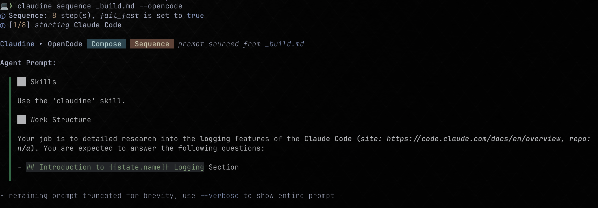

It is critical that when a sequence is run that for each state in the sequence we interpolate the frontmatter into the page. This WAS working but somehow has regressed. I'm SHOCKED that there are no failing tests as a result!!!

The image shown here shows the "Agent Prompt" and the `{{state.name}}` variable is NOT interpolated and yet we know that a sequence always defines a name. Interestingly, the template tag `state.desc` has been interpolated as "Claude Code (site: https://code.claude.com/docs/en/overview, repo:
  ▌ n/a)".

So it appears -- at least on the surface -- to be less of a "interpolation" issue than a state management problem.

The sequence file I'm using is @claudine/docs/research/agent-logging/_build.md 
