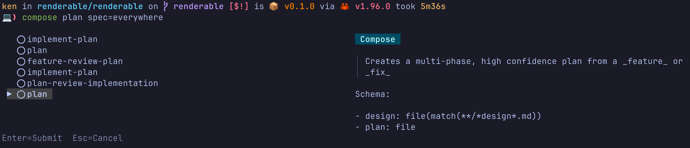

I ran `claudine compose plan spec=everywhere`:

- both the "plan" and "everywhere" text represent valid substrings but not complete values
- this is precisely what the auto-complete feature is meant for
- the "plan" sub-string represents the prompt file that the compose operation is supposed to use:
    1. It did pop up a TUI input to let me choose between options but:
        - The "description" that was shown when moving between files is meant to render the text as `Prose` text
          but instead what I was seeing was the unprocessed text found in the "description" Frontmatter
        - the file choices have no path component listed -- this is actually ok but _looks_ like an error because we are not dedupping the completions:
            - if there is a file at `prompts/plan.md` and `~/.claudine/prompts/plan.md` we are only supposed to see "plan" once!
            - and of the two files it finds only the "most local" one should be retained
            - this is described quite clearly in the auto-complete spec
        - because we are NOT deduplicating I am able to see two plan options with no way to distinguish one from the other
        - however, I tried both, and it fails immediately if I choose the document at `~/.claudine/prompts/plan.md`
        - by contrast, choosing the `plan` that maps to the `prompts/plan.md` file does match something but i'm unsure it's actually the right file. Why? I'm worried that it's somehow doing something unexpected with worktrees (see next bullet point)
        - the schema of `prompts/plan.md` in the worktree that I was executing this command in:

            ```yaml
            $schema:
                spec: file(required;match(**/*spec*.md);eager)
                design: file(match(**/*design*.md))
                plan: file
            ```

            However, NEITHER of the "Schema:" sections which are presented to the user look like the correct schema:

            ```md
            - design: file(match**/*design*.md))
            - plan: file
            ```

            this one at least comes close but is missing the critical and only required property `spec`!

            Also the _formatting_ is VERY poorly implemented! The schema is YAML and so when we render it we should be rendering the YAML under the `$schema` property as a YAML code block!
    - the next error comes when I press ENTER
    - what I'd expect is that it would see the "everywhere" string and see that this is a match for precisely one file which matches the glob pattern for the type (`**/*spec*.md`) and based on this it should have brought up a confirmation dialog that this was the match I meant.
    - instead what I get is an error:

        ```sh
        💻❯ claudine compose plan spec=everywhere
        
         CompositionError: schema validation
        ┃
        ┃ Schema validation failed for /Users/ken/.claudine/worktrees/rusty-biscuit/renderable/prompts/plan.md.
        ┃
        ┃ /spec: no existing file matched reference `everywhere` while resolving from `/Users/ken/.claudine/worktrees/rusty-
        ┃ biscuit/renderable/renderable`
        ┃
        ┃ Problems:
        ┃ - `/spec`
        
                                                                                                                                            yaml
        
        1 │ ---
        2 │ $schema:
        3 │     spec: file(required;match(**/*spec*.md);eager)
        4 │     design: file(match(**/*design*.md))
        5 │     plan: file
        6 │
        7 │ description: "Creates a multi-phase, high confidence plan from a _feature_ or _fix_"
        8 │ root: "{{ctx.repo_root}}"
        9 │ area: "{{ctx.current_package_area == 'root' ? ctx.current_package || '' : ctx.current_package_area}}"
        10 │ plan: "{{ dirname(spec) + '/spec.md' }}"
        11 │ start:
        12 │     message: "🖊️ creating a plan for the `{{spec}}` specification"
        13 │ success:
        14 │     stderr: "The `{{plan}}` _plan_ has been created"
        15 │     message: "✅  the _plan_ for the spec `{{spec}}` was created _at_ {{ctx.time}}"
        16 │ failure:
        17 │     message: "❌️  the _plan_ for the spec `{{spec}}` failed to complete!"
        18 │ ---
        ```
