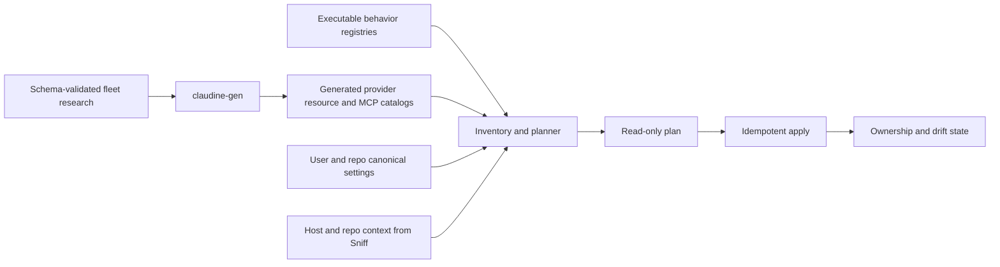

# Research-Driven Shared Resource Synchronization

## Status

This specification is implementation-ready except for the decisions collected in
[Open decisions](#open-decisions). It replaces the Claude-centered synchronization
paths for Agent Skills, slash commands, and agent/subagent definitions, and it makes
MCP availability and round-trip safety derive from the same research-to-catalog
pipeline used by the rest of Claudine.

The fix is complete only when the generated catalog, the installed-provider
inventory, the mutation planner, and the provider behavior adapters agree. Adding a
provider to the compiled roster must fail until that provider has an explicit outcome
for all four resource families.

## Outcome

After this fix:

- each user and repository scope can choose a different canonical provider for
  skills, commands, and agents;
- list, analyze, and apply use the configured canonical provider rather than a
  hidden Claude default;
- every research-declared location is inventoried with scope, origin, precedence,
  and activation information;
- every source-provider to target-provider pair receives one of the five ratified
  portability outcomes;
- direct symbolic links are created only for genuinely portable pairs;
- deterministic mappings create Claudine-owned artifacts with provenance and drift
  detection;
- provider-native, managed, bundled, plugin, marketplace, URL, and built-in assets
  remain visible without becoming automatic mutation sources;
- MCP native capability is generated from the MCP research fleet, while implemented
  import, export, persistent-write, and runtime behavior is declared by executable
  adapters and checked against that capability;
- supported MCP schemas round-trip without losing behaviorally relevant fields; and
- provider graduation fails when metadata, behavior, fixtures, or evidence are
  incomplete.

## Problem

The provider-metadata project built the correct fleet research and generator seam,
but the production shared-resource paths still use an earlier model.

### The production source is still Claude

The three CLI workflows display a configured canonical provider, then call library
functions that scan Claude's directories and skip Claude in their target loops:

- `lib/src/linking/skills/{portable,native}.rs`
- `lib/src/linking/commands.rs`
- `lib/src/linking/agents.rs`

The newer detector and compatibility types are effectively test-only. They do not
control the public list or apply paths.

### The richer canonical configuration is calculated and discarded

The review identified that production ignores canonical selection. The code audit
found an earlier break in the chain:

1. `init` creates an eight-slot `CanonicalProviderSettings` value covering scope and
   resource;
2. it calls `select_canonical_provider` for every slot;
3. it discards that value; and
4. it persists only `ClaudineConfig.canonical_provider`, one provider for the whole
   user scope, while `RepoOverrideConfig` has one provider for the whole repository
   scope.

`events::LinkingSettings` contains the richer structure, but it belongs to the
legacy `GlobalSettings` model and is not the persisted Claudine configuration used by
the shared-resource commands. The config TUI likewise exposes only one user provider
and one repo provider.

This means the current UI cannot actually persist the per-resource contract the
linking library claims to support.

### Generated resource metadata is a stale facts projection

`ProviderInfo.resource_support` is generated, but its registry source is still
`docs/providers/facts/<slug>.yaml`. Only the coarse `supports_skills` boolean is read
from live research. The generated structure can express one format, one user path,
one repo path, and a flat compatibility-root list. It cannot express:

- multiple locations or operating-system-specific locations;
- provider-owned versus compatibility-read locations;
- origin and mutation eligibility;
- precedence and shadowing;
- activation or trust gates;
- artifact kind;
- target-specific field mappings;
- deterministic versus semantic conversion; or
- the five-class pairwise portability result.

This is why current generated data can say that Codex agents are Markdown even though
the subagent research says TOML, omit Gemini's higher-priority `.agents/skills`
roots, and resolve Antigravity's `~/.gemini/config/skills` as `<home>/~/.gemini/...`.

### Inventory means “Claude canonical set,” not installed-provider inventory

The public reports scan Claude user and repo roots only. Compatible alternate roots
are used only to suppress missing-link warnings. They are not scanned, so Claudine
cannot report isolated provider-native assets, collisions, shadowing, or managed and
plugin origins.

The detector can recognize Markdown, TOML, and YAML files, but it scans only one path
per provider/scope and does not carry location origin, precedence, activation, or
sync eligibility.

### Format equality is mistaken for behavioral portability

The current apply paths reduce compatibility to support level, file format, required
property presence, and a short Claude-specific property blacklist. This treats many
same-format Markdown definitions as safe links even when model, tool, permission,
argument, activation, or inheritance semantics differ. It also treats deterministic
native formats such as Gemini command TOML and Codex agent TOML as simply
incompatible.

### MCP capability and implementation are conflated

`McpBehavior::supported()` is hand-written and true for only Claude, Codex, Gemini,
and OpenCode. It is the gate used by import and routing even though all ten providers
have schema-validated MCP research. Provider-native support and Claudine's current
implementation are different facts and must not share one boolean.

The normalized MCP server also loses provider-native fields. Gemini handling is the
most immediate unsafe case: parser and writer keys do not match current research,
remote transport variants can be changed, and authentication/filter fields can be
dropped. Claude headers and behaviorally relevant provider overrides have similar
loss risks.

### Symbolic-link application is Unix-only

`create_resource_link` returns “symbolic link creation is only supported on Unix” on
Windows. Listing and planning can be cross-platform today, but the mutation contract
is not. This fix must either implement Windows file/directory symbolic links or
report a capability failure before mutation; it must not silently copy and create a
new drift problem.

## Scope

### In scope

1. Agent Skills
2. Slash commands and custom prompts
3. Agent/subagent definitions
4. MCP catalog import, export, persistent synchronization, and runtime injection
5. User- and repo-scope canonical configuration for the first three families
6. Research schemas, generated provider metadata, behavior conformance, inventory,
   planning, application, provenance, drift detection, CLI reporting, and tests
7. macOS, Windows, and Linux path and mutation behavior

### Out of scope

- Synchronizing arbitrary scripts. `LinkableResource::Script` may remain as a
  compatibility type during migration, but no new script behavior is enabled until a
  dedicated research topic defines its security and portability contract.
- Synchronizing plugins or extensions as packages. Assets contributed by them are
  inventoried with provenance only.
- Executing semantic rewrites with a model. `RewriteRequired` is a reportable outcome,
  not permission to invoke composition or mutate files.
- Copying provider OAuth tokens, credential-store contents, or secrets between
  providers.
- Changing provider-native precedence, trust, approval, or activation behavior.
- Treating subagent runtime observability as resource synchronization. The two may
  share generated metadata, but remain separate systems.
- Adding a central Claudine-authored resource store. The configured provider remains
  the source of truth for this fix.

## Source-of-truth boundaries

The design has three distinct authorities.

| Authority | Owns | Must not own |
|---|---|---|
| Research fleet | Provider-native support, paths, formats, precedence, activation, portability evidence, MCP schema and runtime mechanisms | Whether Claudine has implemented an adapter |
| Generated catalog | Typed, validated projection of the research needed at runtime | Runtime filesystem state or hand-written routing decisions |
| Behavior registry | Parsers, emitters, config patchers, runtime injectors, and implemented conversion recipes | Provider facts already present in research |
| User/repo config | Canonical provider choices and user policy | Provider capability claims |

Effective support is the intersection of native capability and implemented behavior.
A native capability without behavior is reported as an implementation gap. Behavior
without matching generated capability is a fleet-invariant failure.



## Research schema v2

The current `skills`, `slash-commands`, `subagents`, and `mcp` sidecars are too
coarse for runtime decisions. They must be expanded before production code consumes
them. The existing fleet pipeline and Darkmatter schema validation remain the only
research format; no parallel YAML facts model is introduced.

### Common location record

Every resource location becomes a structured record with:

- stable location ID within the provider/topic document;
- operating system;
- scope: user, repo, local, system, managed, extension, plugin, marketplace,
  bundled, built-in, URL, remote, or other;
- path template and its base: home, repository root, provider config root, named
  environment root, system root, or absolute;
- whether the path names a root, an entry-point pattern, a config file, or a registry;
- artifact kind and accepted filename patterns;
- origin kind: provider-native, compatibility-read, provider-managed, or external;
- precedence tier and stable order within the tier;
- whether the location is authorable, inventory-only, or runtime-only;
- trust and activation gates; and
- evidence reference.

Path templates must not encode base semantics in prose. A home-based record may use a
home-relative path or a `{home}` segment, but not a literal `~/` value that a caller
must reinterpret. Generation rejects incompatible base/path combinations, unknown
environment roots, unresolved placeholders, and a Windows-only path on a Unix record
or vice versa.

The resolver is shared by canonical selection, inventory, plan, apply, and display.
It receives one `ResourceEnvironment` built from Sniff's OS/repository discovery plus
the resolved user home and provider config-root environment variables. No caller may
join raw catalog strings independently.

### Artifact records

Each provider/topic declares one or more artifact records rather than one broad file
format. Required initial vocabulary includes:

- `skill_md_directory`
- `flat_markdown_skill`
- `markdown_command`
- `toml_command`
- `yaml_recipe`
- `json_config_entry`
- `config_plus_recipe`
- `markdown_agent`
- `toml_agent_config_layer`
- `yaml_agent_package`
- `recipe_subrecipe`
- `extension_convention`
- `builtin_only`

An artifact record carries syntax, entry point, recognized and required fields,
argument grammar where applicable, field semantics, value grammar, and whether
unknown fields are preserved or rejected by the provider.

“Markdown” alone is never sufficient evidence for linking. The planner compares
artifact semantics and the explicit pairwise result.

### Pairwise portability records

Each source provider document must contain exactly one target record for every other
active roster provider for that topic. Each record contains:

- target provider slug;
- class: `Portable`, `PortableWithProviderMapping`, `LinkedButDegraded`,
  `RewriteRequired`, or `NonPortable`;
- conversion: `none`, `mechanical`, or `semantic`;
- source and target artifact IDs;
- field mappings and value mappings, when deterministic;
- a stable conversion recipe ID, when code is required;
- activation or permission differences that survive conversion;
- degradation summary or blocking reason; and
- evidence references.

The generator rejects duplicates, omissions, self-target records, unknown providers,
mechanical conversion without a recipe, semantic conversion without
`RewriteRequired`, `Portable` records that require mapping, and evidence paths that
do not exist.

Pairwise records are intentionally directional. Qwen's ability to read a Claude agent
does not imply that Claude can safely read a Qwen agent.

### Inventory and activation records

The schemas also carry:

- provider precedence model and ordered tiers;
- same-name behavior within a tier;
- compatibility roots and the provider whose format they accept;
- model/user invocation availability;
- required tools, extensions, consent, trust, and permission gates;
- enable/disable mechanisms; and
- non-user origins that should be inventoried but never synchronized.

### MCP capability record

The MCP topic already has most required facts. Its generated subset must include:

- native MCP support;
- config locations, scopes, formats, and merge precedence;
- transports;
- normalized and provider-specific server fields;
- import, export, and native apply capability;
- persistent-config and one-run runtime mechanisms;
- runtime isolation requirements;
- tool/resource/prompt/client capability summaries;
- authentication and credential-storage references;
- trust and security gates; and
- current evidence.

Provider-native `support` remains a capability summary, not the executable Claudine
implementation status.

## Generated catalog

### Resource catalog

`ProviderInfo.resource_support` is replaced by a research-sourced resource catalog.
The exact Rust type names may follow surrounding module conventions, but the runtime
shape must provide:

- provider identity;
- one record for each governed resource family;
- all locations and artifact variants;
- precedence and activation policy;
- the complete directional portability table; and
- evidence references suitable for diagnostics.

The `resource_support` keys in all facts files are deleted in the same change that
graduates the four research sources. The generator's source-collision gate prevents
them from returning.

The old `SupportLevel`, single `ResourceFormat`, single user/repo path, and
`also_reads_from` model must not remain as an independent authority. Temporary
facades are allowed only while call sites migrate, must be derived from the new
catalog, and must have a removal test or dated removal phase.

### MCP catalog

`ProviderInfo` gains a serialized generated MCP capability record. The existing
`mcp` trait object remains the behavior half but loses responsibility for declaring
native support.

The generator emits a stable schema-versioned representation to
`docs/providers/catalog.json`. This is a catalog schema bump. Consumers must reject
newer unknown schema versions rather than silently ignore resource or MCP fields.

### Behavior conformance

The hand-written behavior registry exposes implemented operations explicitly:

- filesystem inventory adapter, when static scanning is insufficient;
- canonical parser/normalizer for each source artifact kind;
- target emitter for each mechanical recipe;
- MCP discovery/parser;
- MCP persistent writer;
- MCP native apply adapter, when distinct from writing;
- MCP runtime injector; and
- round-trip fidelity level.

There is no default “supported” implementation. An absent adapter is represented as
absent behavior, not an inherited false/empty method that can hide an unfinished
provider.

Fleet tests compare this implementation record with generated capability. Examples:

- a mechanical recipe in research must exist in the conversion registry;
- a provider claiming MCP import must expose a parser and fixtures;
- runtime injection capability must have an injector;
- Pi must explicitly declare native MCP unsupported and expose no MCP mutator; and
- an adapter must not claim an operation absent from the generated capability.

## Canonical configuration

### Target model

Canonical selection is persisted in the real `ClaudineConfig` and
`RepoOverrideConfig`, not in `events::GlobalSettings`.

The user configuration owns user-scope choices:

```json
{
  "linking": {
    "preference": ["claude", "codex", "gemini"],
    "canonical": {
      "skills": "claude",
      "commands": "codex",
      "agents": "gemini"
    }
  }
}
```

The repository override owns repo-scope choices with the same three keys. A repo
choice does not overwrite the effective user choice; the engine loads both scopes
simultaneously.

MCP does not receive a canonical provider slot. The Claudine MCP catalog is already
the canonical normalized source; provider state records its native projections.

`Script` receives no new persisted slot in this fix. Any legacy script slot is ignored
with a migration diagnostic until script research is specified.

### Validation

Configuration loading validates that a chosen canonical provider:

- is in the compiled provider roster;
- is installed when apply is requested;
- natively supports authorable resources of that kind and scope;
- has a resolvable provider-owned location for the current OS; and
- has an implemented source parser for its artifact kind.

An inventory-only, compatibility-read, managed, bundled, plugin, URL, or built-in
location cannot become the canonical authoring root.

List mode may still show a configured but currently unavailable provider. Apply fails
before mutation and explains the failed precondition.

### Initialization and TUI

`claudine init` persists the actual result of each resource selection. The config TUI
shows independent user and repo selectors for skills, commands, and agents. Candidate
lists are generated from catalog eligibility for that scope/resource/OS; selecting a
provider that cannot author the resource is impossible.

The old single `canonical_provider` migration policy remains an open decision, but no
runtime path may silently treat it as Claude.

## Unified resource engine

Skills, commands, and agents share one library engine. Resource-specific behavior is
supplied by catalog data and codecs, not by three copy-pasted list/fix modules.

### Phase 1: environment and inventory

The engine receives explicit home, repository root, OS, installed providers, and
environment-root values. Production construction uses Sniff for host, provider, and
repository discovery. Tests construct the environment directly.

For every provider and research-declared location on the current OS, inventory emits
records containing:

- stable resource identity and display name;
- provider and resource family;
- scope;
- resolved location ID and path;
- native artifact kind and syntax;
- origin kind and compatibility origin;
- precedence tier/order;
- activation and trust state when discoverable;
- whether the asset is authorable, synchronizable, or inventory-only;
- symbolic-link target, if applicable;
- content and semantic hashes;
- parse status and diagnostics; and
- source evidence.

Static filesystem roots use the generic scanner. Config-backed registries, plugin
manifests, nested provider conventions, or runtime-only inventories require a
behavior adapter. An unimplemented dynamic inventory source is reported as an
implementation gap; it is not silently omitted from an “all providers” report.

The inventory retains all origins. It separately computes the provider's effective
resource by applying generated precedence. The same physical asset discovered through
several compatibility roots is one asset with several reader/provenance edges, not
several independent definitions.

### Phase 2: canonical projection

For each scope and resource family, the engine loads the configured provider and its
provider-owned authorable location. All assets from that location are canonical
candidates for that slot.

Repo resources mask same-named user resources only in the effective view. User and
repo assets remain separate plan inputs and are never linked across scopes.

The canonical parser converts the provider-native artifact into a resource-specific
intermediate document that preserves:

- body/prompt/instructions;
- known fields with semantic identities;
- provider-specific fields;
- arguments and interpolation grammar;
- sibling files for directory resources; and
- source artifact and content hashes.

Parsing is loss-aware. If the source adapter cannot faithfully represent the fields
needed for the requested target, planning stops for that asset/target.

### Phase 3: target planning

Planning is read-only and deterministic. For every canonical asset and installed
target provider, the planner combines:

1. the directional portability record;
2. target locations and precedence;
3. implemented conversion behavior;
4. current inventory state; and
5. ownership state.

The five portability classes have these minimum effects:

| Class | Default plan effect |
|---|---|
| `Portable` | Create or verify a direct symbolic link when the target reads symbolic links and no higher-precedence definition shadows it |
| `PortableWithProviderMapping` | Emit or refresh a deterministic Claudine-owned target artifact; never create a direct link |
| `LinkedButDegraded` | Open decision; must always carry a visible degradation diagnostic |
| `RewriteRequired` | Report the required semantic rewrite; no automatic mutation |
| `NonPortable` | Inventory only; no synchronization action |

Other plan outcomes include already effective through a compatibility root, shadowed,
collision, wrong link target, missing adapter, unsupported scope, unresolved path,
inactive dependency, stale generated artifact, and unowned existing artifact.

Planning never decides safety from file extension equality or a provider-name match.

### Phase 4: apply

Apply executes an immutable plan. Before each action it verifies that the source and
target precondition hashes still match the plan. If either changed, that action stops
without mutation and the caller must re-plan.

Mutation rules:

- never overwrite a real unowned file or directory;
- never replace an unknown symbolic link;
- never mutate inventory-only origins;
- create user-scope links with absolute targets;
- create repo-scope links with relative targets when source and target are on the same
  volume;
- use the platform file/directory symbolic-link API on Windows and report the OS error
  before creating any fallback copy;
- write generated artifacts through the shared atomic-write implementation;
- preserve provider-required encoding and newline rules;
- validate generated artifacts with the target parser before installation;
- write ownership state only after the artifact is installed successfully; and
- remove an artifact only when state proves Claudine owns that exact target and its
  current hash still matches the last generated hash.

Actions are individually atomic and idempotent. A batch may report both successes and
failures; rerunning from a fresh plan converges safely. The engine does not attempt a
cross-provider global rollback.

### Ownership and drift

Owned generated artifacts require, at minimum:

- source provider, scope, resource kind, and stable source identity;
- target provider and path;
- conversion recipe and version;
- source semantic hash;
- generated artifact hash;
- timestamp for diagnostics; and
- catalog schema/generator version.

The storage location and whether safe native formats also receive embedded provenance
remain open decisions. Loss of ownership state must degrade to “unowned existing
artifact,” never permission to overwrite.

All content hashes use `biscuit-hash`. When hashing the frontmatter/body semantics of a
Markdown artifact, use Darkmatter's Markdown-aware hashing rather than a new parser or
ad hoc delimiter logic.

## MCP synchronization

MCP shares the generated-capability/implemented-behavior boundary but does not use the
file-resource canonical-provider engine.

### Effective operations

For each provider, Claudine computes separate effective availability for:

- discover/import;
- serialize/export;
- persistent config write;
- provider-native apply command, if one exists; and
- one-run runtime injection.

The CLI and wrapper route through these operation-specific results. There is no single
`supported()` gate.

The target implementation roster follows current research:

| Provider | Native MCP | Persistent import/export target | One-run target |
|---|---:|---:|---:|
| Antigravity | yes | yes | no |
| Claude | yes | yes | yes, native one-run config |
| Codex | yes | yes | yes, isolated config home |
| Gemini | yes | yes, after round-trip gate | yes, after round-trip gate |
| Goose | yes | yes | yes, synthesized launch arguments |
| Kilo | yes | yes | yes, inline config overlay |
| Kimi | yes | yes | no |
| OpenCode | yes | yes | yes, inline config overlay |
| Pi | no | explicitly unsupported | explicitly unsupported |
| Qwen | yes | yes | no for standalone CLI; daemon injection remains a separate adapter |

This table states the desired Claudine outcome, not permission to bypass fixture gates
or provider security policy.

### Lossless normalized server

The catalog continues to expose normalized connection fields, but an imported entry
also carries a provider-native extension produced by that provider's parser. The
extension preserves fields that affect behavior or are required to reproduce the
native entry, including unknown fields accepted by the provider.

The exact extension representation remains an open decision. Whatever representation
is selected must satisfy these rules:

- it is namespaced by provider and schema version;
- it never contains copied OAuth token-store contents;
- secrets already present inline in native config are not printed in reports;
- a writer can distinguish “field absent” from “field present with native default”;
- unrelated top-level config and unowned server entries survive a write;
- an unknown field is either preserved or causes the entry to be rejected as
  non-round-trippable; and
- behaviorally relevant extension data participates in merge/conflict decisions.

Use two hashes rather than overloading one fingerprint:

- a connection hash for candidate correlation across providers; and
- a behavior hash covering normalized fields plus behaviorally relevant native
  extensions for equality, drift, and safe merge.

Two entries may be correlated by connection hash while remaining a conflict by
behavior hash. Provider-specific extensions for different providers may coexist on
one catalog server. Two different extensions for the same provider do not
auto-merge.

### Import contract

Parsing returns the normalized server, provider-native extension, native name, source
scope/location, and a fidelity result:

- lossless;
- lossless for supported fields with preserved unknown fields;
- inventory-only because the entry cannot be re-emitted; or
- rejected because even connection semantics are ambiguous.

Automatic sync imports only the first two classes. Inventory-only entries are visible
but cannot become managed exports. Rejected entries carry a diagnostic and do not
modify the catalog.

### Write contract

Provider writers patch their owned server section while preserving:

- unrelated top-level settings;
- unowned server entries;
- native fields from the provider extension;
- provider-required transport discriminators;
- native key spelling and value shape; and
- credential references.

Writers use atomic writes and the existing backup facility. A writer refuses apply
when the catalog entry lacks fields required by that provider, contains an extension
schema newer than the writer understands, or failed its round-trip fixture class.

### Runtime injection contract

Runtime injectors consume the same provider writer/serializer used by persistent
export wherever the native shapes are equivalent. A second hand-written serializer
for the same provider is prohibited.

Runtime overlays must remain reversible and isolated:

- Claude: temporary native one-run config plus strict mode when requested and allowed;
- Codex and Gemini: isolated provider home/config roots with required sidecars copied,
  never user config mutation;
- OpenCode and Kilo: merge into the existing inline config environment value without
  clobbering system-prompt or permission overlays;
- Goose: synthesize the documented repeated extension arguments; and
- providers without a safe one-run mechanism: explain that persistent export is
  required.

Managed policy or provider safe/bare modes may disable injection even when the catalog
says the mechanism exists. That is a runtime precondition failure, not a metadata
contradiction.

### Immediate Gemini safety gate

Until current Gemini fixtures prove lossless handling of stdio, SSE, Streamable HTTP,
headers, OAuth/auth-provider fields, tool filters, timeout/trust fields, and relevant
sidecars:

- persistent apply is disabled;
- runtime injection is disabled; and
- import may run only in inventory/report mode unless the entry is proven lossless.

The CLI must state that the provider supports MCP natively but Claudine has disabled
mutation because its current adapter is unsafe.

## CLI behavior

The existing commands remain the primary surface:

- `claudine skills`
- `claudine commands`
- `claudine agents`
- `claudine mcp ...`

### File-resource commands

Without `--apply`, each command is read-only and renders the unified analysis model.
It must distinguish:

- effective canonical assets;
- other provider-native or compatibility-origin assets;
- user assets masked by repo assets;
- managed/bundled/plugin/extension/marketplace/URL/built-in inventory;
- planned actions;
- shadowing and collisions;
- portability/degradation decisions; and
- metadata or implementation gaps.

With `--apply`, the command plans first, renders blockers, then applies only the safe
actions in that plan. `--fix` remains an alias. Filtering changes presentation and the
selected apply set, but must not make directory-level failures disappear from the
precondition checks.

The configured canonical provider displayed in the header is the same value carried
in the library request. CLI code does not reload or reinterpret it separately.

Rendering continues to use `TerminalRenderable` components. The library owns all
inventory, precedence, compatibility, planning, and mutation logic; the CLI owns
argument parsing and rendering only.

### Fail-closed transition behavior

Before the unified engine is active, the legacy file-resource apply functions must
refuse to run when the effective configured canonical provider is not Claude. The
error explains that the installed build still has a Claude-only mutation path. This
guard is removed with the legacy functions.

### MCP commands

MCP output reports native capability and Claudine implementation separately. For
example, “native: import + runtime; Claudine: import implemented, runtime missing” is
valid and actionable. “unsupported” is reserved for providers such as Pi that lack a
native surface.

Dry-run output uses the same writer plan as apply. No command infers operation support
from provider identity.

## Safety invariants

1. A displayed canonical provider and the source provider in the mutation plan are
   always identical.
2. A list operation never writes, normalizes, or enriches the canonical file.
3. Apply never changes a canonical source merely to make a target accept it.
4. Only `Portable` may produce a direct symbolic link.
5. Mechanical conversions are deterministic, target-native, validated, and owned.
6. Semantic conversions never run automatically.
7. Unowned real files, directories, config entries, and unknown links are never
   overwritten or removed.
8. Inventory-only origins never become automatic sources or targets.
9. Scope boundaries are preserved.
10. Generated precedence determines effective state; directory iteration order does
    not.
11. Unsupported or unimplemented behavior is explicit in reports and fleet tests.
12. MCP apply is disabled for any provider/fixture class that is not lossless.
13. Credential material is never copied between provider stores or exposed in output.
14. macOS, Windows, and Linux resolve the same logical location model with
    platform-native paths.

## Provider graduation gates

A provider cannot enter the compiled roster until all of these pass:

- one schema-valid research document for each of the four topics;
- every research evidence path or URL is valid;
- all current-OS-independent location records have explicit OS/scope/base/origin and
  inventory eligibility;
- all three file-resource topics contain exactly one portability result for every
  other active provider;
- every mechanical recipe has an executable converter and fixtures;
- every provider/resource/scope has an explicit authorable, inventory-only,
  unsupported, or unimplemented disposition;
- generated catalog and behavior implementation agree;
- all claimed MCP operations have native fixtures and round-trip coverage;
- native MCP unsupported providers have no mutating behavior;
- generated `data.rs` and `catalog.json` are current; and
- the unified dispatch inventory has no new unapproved provider branching.

Changing research facts must run the same gates. A capability change cannot regenerate
quietly while leaving behavior stale.

## Testing strategy

All deterministic synchronization coverage is Level 1. Temporary directories,
explicit `ResourceEnvironment` values, and fixture config files are sufficient; real
terminal tests are not required for filesystem semantics.

### Generator and schema tests

- schema-to-registry compatibility for all four topics;
- exact active-provider target coverage in pairwise records;
- rejection of stale facts keys and missing evidence;
- artifact/format consistency;
- path-base and OS-path validation;
- recipe ID and conversion-kind consistency;
- catalog schema version and byte-for-byte generation drift; and
- roster graduation failures for missing dispositions.

### Resource engine tests

- user and repo canonical providers differ by resource and are honored;
- non-Claude canonical providers drive list and apply;
- every declared location kind is inventoried or reported unimplemented;
- compatibility roots deduplicate physical assets while retaining provenance;
- precedence and repo masking are deterministic;
- directional portability is not treated as symmetric;
- direct links occur only for `Portable`;
- generated artifacts are created, validated, detected as current/stale, and refreshed;
- unowned collisions and changed owned artifacts are preserved;
- source changes between plan and apply stop mutation;
- repeated apply is idempotent;
- path resolution covers macOS, Linux, and Windows fixtures, including Antigravity's
  home root and environment/config roots;
- Windows file and directory symbolic-link calls are selected correctly and permission
  failures are actionable; and
- script behavior remains disabled.

Large module tests follow Claudine's test-placement rule: production files over roughly
800 lines or test modules over roughly 300 lines use sibling `tests.rs` modules.

### CLI tests

- headers and mutations receive the same canonical settings object;
- the TUI persists independent resource selectors;
- old config migration follows the chosen policy;
- read-only reports show canonical, isolated, shadowed, inventory-only, degraded, and
  unimplemented states;
- filters do not bypass apply preconditions;
- the temporary legacy guard rejects non-Claude apply; and
- output is rendered through `TerminalRenderable` components with stable plain-mode
  text.

### MCP fixture tests

Every implemented provider has checked-in, redacted fixtures for every supported
transport and meaningful schema variant. At minimum:

1. parse native fixture;
2. normalize and preserve its provider extension;
3. write into a fixture containing unrelated settings and unowned servers;
4. parse the result again;
5. compare normalized semantics, provider extension, and preserved unrelated data;
6. verify deterministic output on a second write; and
7. verify secrets are redacted from reports.

Gemini coverage must include `url` versus `httpUrl`, transport discrimination,
camelCase tool filters, headers, OAuth, auth-provider fields, trust/timeouts, and
sidecar behavior. Claude covers headers and managed policy. Codex covers TOML tables,
header/env-header variants, required/enabled/tool filters, and timeouts. JSONC
providers cover comments or document the parser's exact preservation boundary.

### Verification commands

Run from the Claudine package area:

```sh
cd claudine
just test
just test-gen
just lint
```

Run the generator drift check through the existing `claudine providers generate
--check` surface or the equivalent `claudine-gen` check recipe. Do not run write-mode
`cargo fmt` as part of this work.

## Implementation sequence

### Phase 0 — Stop unsafe mutations

1. Add the non-Claude canonical mismatch guard to legacy file-resource apply.
2. Disable Gemini MCP persistent apply and runtime injection pending fixtures.
3. Update reports to distinguish native MCP capability from current implementation
   where possible without the new catalog.
4. Add regression tests proving the guards run before mutation.

### Phase 1 — Upgrade and rerun the fleets

1. Expand the four sidecar schemas.
2. Rerun fleet research for all ten providers, preserving current body research and
   filling structured v2 fields.
3. Regenerate the four cross-provider summaries through the existing composition
   pipeline; do not hand-edit generated summaries.
4. Resolve contradictions and evidence failures before generator work.

### Phase 2 — Generate executable catalogs

1. Add the resource and MCP vocabulary to `claudine-catalog-types` where the generator
   and runtime need the same enums.
2. Change registry ownership from facts to the four research topics.
3. Implement coercion, validation, emission, and catalog schema versioning.
4. Delete the facts-owned `resource_support` blocks.
5. Add behavior-conformance and provider-graduation gates.

### Phase 3 — Migrate canonical configuration and paths

1. Add the real persisted `linking` block to user and repo config.
2. Apply the selected old-config migration policy.
3. Remove or relocate the unused `events::LinkingSettings` duplicate.
4. Update init and the config TUI.
5. Replace all raw resource path joining with the one typed resolver.

Because GitNexus rates the `ClaudineConfig` structure CRITICAL (32 direct dependents,
70 symbols within three hops), this phase lands with loader, merge, serialization,
init, TUI, and composition regression coverage before any legacy field is removed.

### Phase 4 — Land the unified resource engine

1. Build inventory and effective-precedence projection.
2. Build canonical parsing and the target planner.
3. Implement ownership and drift state.
4. Implement portable symbolic links on Unix and Windows.
5. Cut skills over first, then commands, then agents, using the same engine.
6. Delete the three legacy list/fix implementations and their hard-coded Claude logic.
7. Remove temporary compatibility facades and fail-closed guards.

### Phase 5 — Implement mechanical recipes

Prioritize deterministic conversions proved by research:

1. Gemini command TOML;
2. Codex agent TOML config layers;
3. Goose command config/recipe forms;
4. Kimi YAML agent packages; and
5. other mechanical pair records in generated order.

No recipe lands without source and target fixtures, round-trip validation where the
source format is also accepted, and drift tests.

### Phase 6 — Make MCP lossless and complete provider coverage

1. Choose and implement the provider-native extension representation.
2. Split native capability from operation implementation.
3. Make existing Claude, Codex, Gemini, and OpenCode adapters fixture-lossless.
4. Re-enable Gemini only after its gate passes.
5. Add Antigravity, Goose, Kilo, Kimi, and Qwen persistent adapters as supported by
   research.
6. Add Claude, Goose, and Kilo runtime strategies.
7. Keep Pi explicitly unsupported.
8. Add fleet conformance and wrapper integration tests.

### Phase 7 — Documentation and closeout

Update alongside behavior:

- `claudine/docs/topics/skills.md`
- `claudine/docs/topics/mcp-catalog.md`
- `claudine/docs/topics/mcp-mode.md`
- `claudine/docs/topics/provider-metadata.md`
- `.claude/skills/claudine/linking-strategy.md`
- `.claude/skills/claudine/non-portable-assets.md`
- `.claude/skills/claudine/architecture.md`
- `.claude/skills/claudine/cli-reference.md`
- `.claude/skills/claudine/SKILL.md`
- package READMEs and dependency docs if public behavior or dependencies change; and
- `AGENTS.md` only if the provider-graduation workflow changes at repo level.

Move this fix to `_completed` only after all exit criteria and generated-artifact drift
checks pass.

## Exit criteria

The review is resolved when all of the following are demonstrably true:

- per-resource user and repo canonical choices are persisted and honored by list,
  plan, and apply;
- the three file-resource commands share one inventory/plan/apply engine;
- all research-declared locations are inventoried or visibly reported as an
  implementation gap;
- inventory distinguishes native, compatibility, managed, bundled, plugin,
  extension, marketplace, URL, built-in, and runtime origins;
- precedence and shadowing match generated research;
- every directional provider pair has one of the five portability outcomes;
- only `Portable` creates a direct symbolic link;
- every mechanical conversion is deterministic, owned, validated, and
  drift-detectable;
- semantic and non-portable assets are never silently mutated;
- path resolution and apply behavior are defined for macOS, Windows, and Linux;
- MCP native capability and Claudine implementation status agree for all ten
  providers;
- all enabled MCP import/export/apply/runtime paths pass provider fixture round-trip
  tests;
- behaviorally relevant provider extension data affects equality and merge safety;
- Gemini is not re-enabled before its fixture gate passes;
- fleet tests fail provider graduation or research drift with missing behavior;
- generated provider data and catalog artifacts are clean; and
- stale Claude-centric docs and claims are updated.

## Open decisions

The remaining decisions are deliberately narrow; none changes the requirement for a
research-derived catalog or a unified planner.

1. How should the old single canonical provider setting migrate into the new
   per-resource settings?
2. What, if anything, should automatic apply do for `LinkedButDegraded`?
3. Where should ownership/provenance for generated file resources live?
4. What representation should preserve provider-native MCP fields losslessly?

Recommended options are presented in the accompanying brainstorm before implementation
begins.
