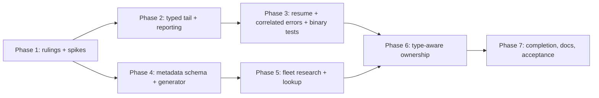

# Plan: Composition forwards provider CLI switches to the agent

Source: `spec.md` in this directory (reviewed 2026-10-01). Terminal state for an
agent is "implementation complete, ready for review": never move the fix to
`_completed` and never run `just complete`.

## Summary and Definition of Done

The headline bug (forwarding `--codex -c ...` through `compose`,
`inline-compose`, `sequence`) already landed in `2c7f98dcf`. What remains falls
into three independent bodies of work plus one dependent core:

| Stream | Spec items | Nature |
| --- | --- | --- |
| Reporting hardening | R2, R3, R5, R6 | Typed tail descriptor, correlated native-error report, per-command INFO notice, redaction, direct-wrapper parity |
| Launch threading | R1, R7 | Resume carries tail exactly once; compiled-binary coverage |
| Switch metadata | R8 | Research schema, fleet re-research, `claudine-gen` projection, lookup |
| Type-aware ownership | R9, R4 | One shared ownership function used by partition and completion; `argv` positionals; ambiguity; resolved-provider check |

Dependency shape:

**Done when** all 29 acceptance criteria in the spec are Done, `just test`,
`just test-l2`, `just lint` pass from `claudine/`,
`cargo run -p claudine-gen -- check` is clean, docs and the claudine skill are
updated with no link back to this fix, and `spec.md` status/acceptance table is
refreshed to match.

Cross-cutting constraints (apply to every phase):

- No `cargo fmt`; no commits unless explicitly told; nextest only.
- Every behavior change includes a pass over the `///`/`//!` docs and comments of the touched symbols.
- Terminal output goes through `biscuit-terminal` components (`TerminalRenderable`).
- Must compile and work on macOS, Linux, native Windows, WSL2 (load the `os` skill before touching path or `#[cfg(windows)]` code).
- L1 binary tests use `CliProcessFixture`; any L2 session stays in the background and never takes focus.
- Load skills as needed: `claudine`, `clap`, `rust-testing`, `biscuit-terminal`, `darkmatter`, `schemars`/`serde` for the generator.

## Phase 1: Rulings, spikes, and baseline

Purpose: settle ambiguities in the spec before code, and capture a safety net.

### Necessary Rules

These are gaps or tensions found while reading the spec. Each needs an author
ruling (or the default noted is used and recorded in the implementation log).

1. **Phasing of R9 versus R8 (default: R9 lands only after R8 data exists).**
   R9 depends on generated metadata, but R1/R2/R3/R5/R6/R7 do not. Default: ship
   the reporting stream first against the current partition, as the spec's
   "until type-aware ownership lands" language anticipates.
2. **Behavior when metadata is entirely `unknown` for a provider at launch of R9.**
   Spec says unknown is treated as unrecognized (rule 5). Default: that holds
   even for the whole fleet, so R9 is functionally safe to land before every
   provider is fully researched, provided each compiled provider has an entry or
   explicit unknown gap (generator must enforce).
3. **Where the shared ownership function lives.** The spec says one function
   used by `argv/partition.rs` and completion, with the typed tail in the
   library. Default: types and pure ownership logic in the `claudine` lib
   (`composition`), CLI wraps with clap's `OwnedFlags::for_composition`. Needs
   confirmation because the lib currently has no clap surface; the owned-flag
   set must be passed in as data.
4. **Shape of the `argv` reserved-key error versus `--set`.** Spec says the error
   applies "whether or not positionals are given". Confirm the `--set` JSON
   object check happens at the same point as the setter check (default: yes,
   one validator).
5. **Numeric ownership grammar.** "Finite decimal with optional fraction and
   exponent". Confirm a leading `+` is accepted and a bare `.5` / `5.` are
   (default: accept `+`, accept `.5` and `5.`; reject `0x..`, `NaN`, `inf`, `1_000`).
6. **Variadic minimum count source.** Default: `variadic_min` in the catalog; a
   missing value is `unknown` min and is treated as 1 for ownership but never
   fails the resolved-provider check.
7. **Wider measurement.** The spec says no performance spike. Do not add
   benchmarks; if the early frontmatter read shows concrete new cost, the author
   decides whether to widen measurement.
8. **Prompt answer persistence.** Ambiguity prompt answer is per invocation and
   not cached on disk (default; spec is silent).
9. **Windows/WSL2.** Argv is `String`-based; the non-UTF-8 refusal test must
   use `OsString` construction that is valid on Windows (WTF-8/unpaired
   surrogate) as well as Unix bytes. Default: platform-gated fixtures.

### Spikes

Run once, before the work they inform. One host, quick sample.

- [x] **Spike A: early frontmatter read seam.** Read `lib/src/composition/hints.rs` (`parse_selection_hints_from_frontmatter`) and composition's file-reference/schema resolver. Confirm an existing entry point can read frontmatter and `$schema` property names with no template, shell, lifecycle, provider discovery, or network. Record the function to call, or the minimal extraction needed. Informs Phase 6.
- [x] **Spike B: structured-stream capture bounds.** Identify how the direct wrapper and `harness_orch/attempt.rs` capture stdout/stderr tails today and which bounds exist. Confirm bounded tails of both streams are obtainable without retaining full streams. Informs Phase 3.
- [x] **Spike C: schema-validation of a `string[]` named `argv`.** Confirm `SimplifiedSchema` can validate the effective `argv` array and that an overlay is not persisted by `inline-compose`. Informs Phase 6.
- [x] **Spike D: generator extension point.** Read `claudine/gen` and `catalog-types` to identify where `cli_switches` flows into `data.rs`, and whether `cli_switches` is read today. Informs Phase 4.

### Tasks

- [x] **Record rulings.** Write the rulings above (author answers or accepted defaults) into a new `implementation-log.md` in this directory.
- [x] **Run the spikes.** Record each spike's finding (a few lines each) in `implementation-log.md`; if a spike answers "this spec assumption is wrong", record it as a ruling for the author instead of silently diverging.
- [x] **Baseline.** From `claudine/`, run `just test`, `just lint`, and `cargo run -p claudine-gen -- check`; record any pre-existing failures so they are not attributed to this work.
- [x] **Locate guards.** Confirm `tests/l1/wrap_direct_argv.rs`, `tests/l1/argv_normalization.rs`, `tests/l1/test_placement.rs`, and `dispatch_inventory.rs` exist and note what each protects.

Checkpoint 1: rulings recorded, spikes answered, baseline known.

## Phase 2: Typed tail descriptor, redaction, and notice (R6, R3, R5-descriptor)

Purpose: replace the two parallel fields with one typed descriptor and fix the notice, with no change to child argv. Waves run in order; tasks within a wave are parallel.

### Wave 1: descriptor (single owner; others depend on it)

- [x] **ProviderTail type.** In `lib/src/composition/types.rs` add one descriptor holding ordered args and `Option<usize>` boundary index (None = no boundary, 0 = fully explicit, len = authored empty suffix). Implicit prefix keeps switch/value assignment slots (initially empty/unassigned; filled by Phase 6). Implement `Default`.
    - Redacted `Debug`: never print raw tokens, ownership records, or notice keys. Provide an accessor that returns the unredacted tokens for launching only.
    - Replace `CompositionExecutionRequest.provider_args` + `provider_args_explicit`.
- [x] **CLI conversion.** Make `argv::ProviderArgs` become the type or convert at exactly one place; replace both fields in `SharedComposeArgs` (`commands/compose/mod.rs`). Update the `commands/sequence.rs` test helper to use `Default`.
- [x] **Launch plan seeding.** Keep `LaunchPlanInputs::provider_args_tail` seeding order unchanged; feed it from the descriptor.

Checkpoint 2a: `just test` green; `wrap_direct_argv.rs` and `argv_normalization.rs` unchanged and green.

### Wave 2: parallel

- [x] **Non-UTF-8 refusal.** Replace `to_string_lossy` in the partitioner with a targeted partition error naming the position, not the bytes. Tests: Unix invalid bytes and Windows unpaired surrogate (platform-gated); proves criterion 15 and that direct wrappers behave consistently.
- [x] **Redaction and display.** Single function to render a value-free switch-name list from a descriptor (strip `=value`; for implicit short tokens, with no metadata yet, describe an unrecognized short token such as `-csecret` without echoing it; explicit tail never listed as names). Route dry-run "Provider args" row, debug traces, and `AGENT_PARAMS` through `redact_sensitive_args`.
- [x] **Command-scoped notice state.** Delete `static ANNOUNCED` in `wrap/composition/provider_args.rs`. Add a notice registry owned by the top-level command, keyed `(provider, tail, boundary)`, claimed atomically (no lock held across render or launch), thread it to composition, sequence tasks, and direct wrappers.
- [x] **Notice module move and wording.** Move the notice out of `wrap/composition/` to a module both launch paths use (for example `wrap/provider_tail_report.rs`). Implicit: `Forwarding provider arguments to Codex: -c`. Explicit: `Forwarding an opaque argument tail to Codex (passed after --).`. Mixed tails: one notice with prefix names plus opaque summary. Render with `TerminalRenderable`; stderr; suppressed by `--quiet` and `--silent`. Remove "not recognized by Claudine".
- [x] **Direct wrapper population (R5).** Populate the same descriptor from the existing passthrough parsing with no composition ownership checks; emit the same notice and redaction. Child argv must not change.

### Wave 3: tests

- [x] **L1 unit/binary tests.** Distinct-pair dedup, two invocations in one process do not leak, parallel sequence tasks claim once, quiet/silent suppression, mixed-boundary key, redacted `Debug` (a test that formats `{:?}` of a descriptor holding `sk-secret` and asserts absence), notice wording for implicit and explicit.

Checkpoint 2b: `just test` and `just lint` green; `wrap_direct_argv.rs` untouched and green. Docs: update `docs/topics/argv-normalization.md`, `cli-pre-parsing.md`, and the Provider Argument Forwarding section of `composition.md` for notice wording, scope, redaction.

## Phase 3: Resume, correlated errors, binary coverage (R1, R2, R7)

Depends on Phase 2 (descriptor). Waves in order.

### Wave 1: parallel

- [x] **Resume carries tail (R1).** In `wrap/resume.rs::append_resume_passthrough_args` and `harness_orch/launch.rs`: append the request's descriptor tokens exactly once at the position the resume entrypoint expects; feed the allowlist carry-over from arguments identified as Claudine injections, not from a base argv that already contains the tail. Preserve authored repetitions and order; no dedup by spelling. A user-supplied `--json`/`--format` must be neither dropped nor doubled.
    - Update the comment in `harness_orch/session_key.rs` (canonical argv comparison; the tail is invocation-fixed and must not make a resume look incompatible).
- [x] **Typed native-exit input (R2).** Define a type holding exit code, `ProcessTermination`, and bounded stdout/stderr tails (reuse existing capture bounds, per Spike B). Produce it from both the direct wrapper (`commands/wrap/mod.rs`) and `harness_orch/attempt.rs`.
- [x] **Classifier fixes (R2).** In `output/error_report.rs`: read both streams; precedence interruption → timeout → missing binary → auth/permission → API failure → model not found → argument rejected → missing argument → none; tighten signatures (`invalid argument` must not match `invalid argument: api key`); each kept signature has a positive and a near-miss fixture; uncertain returns `None`.

### Wave 2

- [x] **One report builder.** `AgentErrorReport::correlated_with_forwarded_tail` becomes the one builder called exactly once per terminal failure by both paths, producing the correlated report only when tail non-empty, exit non-zero, and classifier returned `ArgumentRejected`; if a rejection names a switch, correlate only if it belongs to the forwarded tail (a rejection naming an injected Claudine switch stays generic). Wording: redacted switch names or "opaque", redacted diagnostic excerpt, "likely caused by the forwarded arguments"; no "not recognized by Claudine".
    - Excerpt redaction: shared claudine secret recognizer, masks echoes of values recognized in the original tail even without their flag, escapes terminal control characters and markup.
    - No duplicate stderr echo plus report. A handled retry must not emit a terminal report before recovery is exhausted. Never suppressed by quiet/silent; stderr only; exit code, termination, lifecycle `failure`/`finalize`, and retry policy unchanged.
    - Remove stale `#[allow(dead_code)]`.

### Wave 3: compiled-binary coverage (R7)

All with `CliProcessFixture` and a deterministic fake provider; no real provider or network; silent audio defaults kept.

- [x] **Exact child argv** for the headline command under `compose`, `inline-compose`, `sequence`, setter-shaped value not applied to frontmatter (criteria 1, 2).
- [x] **Exactly-once** on retry, proxy target, resume (with repeated authored switches and a user `--json`), and each step of a multi-provider sequence (criteria 7, 25).
- [x] **Secrets**: `--api-key sk-…`, `--token=…`, `-csecret` reach the fake provider unchanged and appear in none of INFO, dry-run, debug, `AGENT_PARAMS`, correlated output (criterion 9, 28).
- [x] **Notice counts** per distinct pair; none under `--quiet`/`--silent`.
- [x] **Correlation matrix**: fixture-backed rejection on stderr and on stdout; injected-switch rejection not attributed; explicit operand-only rejection reported once; no correlation for auth, timeout, interruption, API, ambiguous; exit code preserved (criteria 10, 28).

Checkpoint 3: `just test`, `just test-l2`, `just lint` green. Docs: resume carry-over, correlated errors, redaction in `argv-normalization.md`/`composition.md`; CLI reference for direct-wrapper reporting. Criteria 7 (resume part), 8 (once scope/wording), 9, 10, 11, 15, 25 (resume part), 28 flip to Done in the spec table.

## Phase 4: Switch-metadata contract and generator (R8, part 1)

Independent of Phases 2–3; can start after Phase 1 in parallel with them (touches research docs and `claudine/gen`, `claudine/catalog-types`, not the argv/wrap code).

### Wave 1: contract

- [x] **Types in `_types.yaml`.** Per the research-contracts standard (read `.claude/skills/claudine/research-contracts.md`): named types for switch and invocation-scope records; closed enums for `value_type` (`none|string|number|variadic|unknown`) and for attachment forms (space, equals, short-attached); `aliases`; `value_optional`; variadic minimum count; normalized scope (global marker or exact native command path, empty path = root); evidence and observed-version fields; explicit `unknown` with a described evidence gap. Every property has a description. `value` stays a human placeholder.
- [x] **Update `agent-cli/_schema.yaml`** `cli_switches[]`; increment `schema_revision`; do not reinterpret `config`/`model_selection` labels as command paths.

### Wave 2: generator (parallel with Wave 1 once types are agreed)

- [x] **Shared vocabulary** in `claudine-catalog-types`: switch metadata record, `ValueType`, scope, attachment forms; static-friendly types.
- [x] **`claudine-gen` projection** into each `lib/src/provider/<slug>/data.rs` as typed static metadata, deterministic order. Validation: alias/canonical uniqueness per effective scope (global plus exact-path set; conflicts fail generation rather than depend on insertion order), legal types, non-empty descriptions, every compiled provider has entries or an explicit unknown gap.
- [x] **Generator tests** (L1, in the gen/catalog-types area): conflict, illegal type, empty description, ordering determinism, unknown-gap acceptance. Drift check covers output.

### Input Robustness Matrix

This work adds a reader of the `cli_switches` research format and a token reader for provider switches. Load-bearing fields: `value_type`, `value_optional`, variadic minimum, `aliases`, scope. One test per format (the research YAML sidecar through generation) walks one edit per cell from a real fixture of the codex entry, asserting through the generated public lookup result, plus a control row proving the unedited fixture gives `-c` = `string` for Codex.

| Shape | `value_type` | `value_optional` | variadic min | `aliases` | scope |
| --- | --- | --- | --- | --- | --- |
| absent | generation error (required) | defaults only where schema declares; else error | error when `variadic`; ignored otherwise | empty by definition (documented) | error (required) |
| explicit null | error, not conflated with absent | error | error | error | error |
| wrong type, whole field | error | error | error | error (e.g. string) | error |
| wrong type, one element | n/a | n/a | n/a | error, no silent filtering | error (one path segment) |
| wrong type, every element | n/a | n/a | n/a | error | error |
| empty | error (empty string) | n/a | error (0 for variadic) | `[]` = no aliases (valid) | `[]` = root path, valid; empty scope list = error |
| duplicate key | YAML duplicate key rejected | rejected | rejected | duplicate alias error | rejected |
| trailing/invalid content | invalid document rejected | | | | |

- [x] **Matrix test** per the table, with the grep smells checked before closure: `#[serde(default)]` on these fields, `Option<T>` where absent and null must differ, `filter_map(.. as_str())`, `unwrap_or_default()`, `.ok()` on a parse.

Checkpoint 4: `cargo run -p claudine-gen -- check` clean; generator and catalog-types L1 green via the area recipes; `just lint`.

## Phase 5: Fleet research, lookup, message enrichment (R8, part 2)

Depends on Phase 4.

- [ ] **Update the fleet prompt** (`docs/research/agent-cli/_fleet.md`) to request the new fields, with evidence for value consumption and attachment forms; validate in the fleet's success lifecycle with both shape and relation checks, and revision-aware refresh so a recently dated doc cannot skip the changed contract.
- [ ] **Pilot one provider** (Codex, because `-c` is the headline case) and inspect before the fleet. Record observed version and evidence.
- [ ] **Re-research all roster providers**; respect `skip_research` roster entries, but every compiled provider still gets metadata or an explicit unknown gap. Repeatable scalar switches stay scalar. Anything not established is `unknown` with the gap described, never guessed.
- [ ] **Regenerate** (`claudine providers generate` / `claudine-gen`), commit nothing; run the drift check.
- [ ] **Lookup API** in the lib: keyed by provider and effective entrypoint (global + exact-path entries), returns a switch record or the union type for a candidate set, and keeps each arm so Phase 6 can name which candidate disagrees. Remove no handwritten list because none exists; guard with a test that no handwritten switch-type table exists in the CLI.
- [ ] **Message enrichment.** Known switch: `-c is Codex's --config switch (override a configuration value); forwarding to Codex.`; unrecognized: states the compiled catalog has no established type at this entrypoint and Claudine forwards anyway, without claiming the provider rejects it; explicit tail stays opaque. Use the lookup to strip attached values in notices (`-csecret` → `-c`) when `-c` is researched as short-attachable.
- [ ] **Tests**: criterion 14 (Codex `-c` = `--config`, `string`, enriched message, drift rejected); lookup precedence (exact name/alias); command-scoped resume metadata.

Checkpoint 5: fleet outputs validated; generated data compiled; `just test`, `just lint`, gen check green. Docs: research topic description, `research-contracts.md` if the process changed; update the claudine skill if the workflow changed.

## Phase 6: Type-aware ownership (R9)

Depends on Phases 2, 3, and 5.

### Wave 1: pure core (parallel tasks)

- [ ] **Ownership function** (one, shared; in the lib per ruling 3). Inputs: tokens after the file, Claudine owned-flag surface, authored snapshot (schema parameter names, `agent` hints), CLI-named provider, candidate-set types. Output: classified tokens, typed tail descriptor with per-switch value assignments, positionals, setters. Implement rules 1–9 exactly as specified, including: left-to-right application; `key=value` rule 3; none/string/number/variadic/union; ambiguity result type; contiguous value runs that are not reconnected after a Claudine token is removed; exact spellings and researched attached forms only; `-` prefixed values need attachment; empty-string values; number grammar per ruling 5; unknown ≠ none; first `--` consumed, later `--` forwarded; explicit tail never checked.
- [ ] **Candidate resolution**: CLI provider → frontmatter `agent` (via `parse_selection_hints_from_frontmatter`; unresolved expression retains all) → all providers. Per-step sequence providers do not narrow.
- [ ] **Authored snapshot reader**: using the Spike A seam; literal `$schema` (source-relative), literal `agent`; SimplifiedSchema property names from every union arm; raw JSON Schema top-level names including union branches via the existing loader; unestablished names make a contested setter-shaped token an error telling the user to use `--` or `--set`. Schema read failure is an execution error; completion gets no suggestions. No templates, shell, lifecycle, provider discovery, network. Help/version must not open a file.
- [ ] **`argv` positionals**: `parse_composition_positionals` (`commands/compose/setters.rs`) collects leftover bare words into `argv` and drops the multiple-file error (and fix its misattributing comment in the partition); `argv=` setter or `--set` containing `argv` is an error before `--` with bare-word guidance; reserved key directly after a provider switch; opaque after `--`; strings not JSON5-parsed; overrides authored `argv` only when at least one positional; sequence applies it via the existing caller-overlay path; participates in ordinary schema validation; `inline-compose` must not persist it (Spike C).

### Wave 2: checks and prompt (depends on Wave 1)

- [ ] **Ambiguity handling**: when candidates disagree on consumption (including scalar vs variadic and unknown vs known), prompt when eligible (`prompt_for_missing` true, stdin and stderr TTYs, no `--silent`); the answer decides ownership only. Otherwise fail with `ambiguous provider argument` naming the switch and each provider's interpretation and suggesting a provider flag or `--`. Completion never prompts. Prompt text states it is resolving how arguments are read. Use `biscuit-tui`/`inquire` consistent with the existing prompt loop.
- [ ] **Resolved-provider check**: implemented once with the per-candidate assignments preserved; missing value, extra value, min-count, attachment; error names switch, token, resolved provider. Run at ownership (mismatch holds for every candidate), at preflight for the command and each statically resolvable `sequence` step (fails before step 1), and before each spawn for runtime-resolved providers (retry, proxy target, resume, runtime-decided step). Use the actual entrypoint including resume. Unknown types defer to the provider. Explicit tails bypass it.
- [ ] **Wire into the partition**: replace `partition_composition_tail`'s first-unowned-switch rule; file identification still the first bare non-setter token before any provider switch; switch/`--` before file stays an error with ordering guidance. Ownership is fixed once per invocation; retries and steps recheck, never reassign. Update the `looks_like_setter` doc comment in `argv/mod.rs`.

### Wave 3: tests

- [ ] **Ownership fixture suite** (partition tests stay beside `argv/partition.rs`): optional and variadic counts, attached and empty values, aliases, mixed implicit/explicit tails, unknown catalog entries, numeric boundaries, a Claudine token interrupting a value run (`--codex -c phase=2 x=y` fails rather than attaching `x=y`), snapshot semantics (`agent=codex` does not narrow), source-relative schema, union schema, templated `agent`, command-scoped resume metadata, unresolved file/schema read, help with no valid file, prompt vs non-prompt ambiguity. Assert both ownership and exact forwarded tokens.
- [ ] **Binary tests** for the spec's three example commands and for `argv` frontmatter propagation through sequence steps and proxy runs.
- [ ] Verify criteria 4, 16–24, 26, 27, 29.

#### Input robustness (token reader)

The provider-token reader is a parser, so each load-bearing input has a defined outcome asserted through the public result (the forwarded tail/errors), walked in one table-driven test with a control row (`--codex -c model_reasoning_effort=low phase=2`).

| Shape | Switch value | Type metadata | Schema parameter names | `argv` key |
| --- | --- | --- | --- | --- |
| absent | missing value error when type requires one | unknown, rule 5 (never none) | unestablished: contested setter errors | not set: authored left alone |
| explicit null | n/a (no null token) | unknown with described gap | schema `null` property type ignored, name still counts | `argv=null` is an error |
| wrong type, whole | `--n abc` for number: not taken, becomes positional or error per rule | n/a | non-object schema → read error, no guessing | `argv=[1]`-shaped setter rejected |
| wrong type, one element | variadic run ends at first switch/setter | n/a | one non-string key: error | n/a |
| wrong type, every element | n/a | n/a | n/a | n/a |
| empty | empty string is a valid string value; `[]` schema props = none declared, setters go to Claudine | n/a | no params ≠ unestablished (distinct outcomes asserted) | no positionals ≠ absent only when authored `argv` exists |
| duplicate | repeated scalar switch stays two assignments (no variadic merge) | duplicate alias rejected at generation | duplicate key across arms is one name | duplicate bare words preserved in order |
| trailing/invalid | non-UTF-8 refused (Phase 2); `--` boundary only first consumed | n/a | invalid schema is a read error | n/a |

Checkpoint 6: `just test`, `just test-l2`, `just lint` green; acceptance table criteria 1–29 all verifiable.

## Phase 7: Completion, documentation, and close-out (R4, docs)

Depends on Phase 6. Tasks parallel unless noted.

- [ ] **Completion (R4).** Delete `is_value_bearing_flag` and its stale comment in `completion/engine/tokens.rs`; cursor scan uses `OwnedFlags::for_composition` and the shared ownership function with the file's `$schema`/`agent`. Never fails or prompts: ambiguity, unreadable file, missing/extra-value errors yield no suggestions. No Claudine suggestions after authored `--`; file and setter completion keep working; no provider switch completion. Distinguish an unfinished value slot from a terminal missing-value error; no Claudine suggestions while the cursor belongs to a provider. Completion read-only, no side effects. Tests under `tests/` for each case. (Criteria 12, 27.)
- [ ] **Documentation.** Update `docs/topics/argv-normalization.md`, `cli-pre-parsing.md`, `composition.md` (provider forwarding; `argv` array; reserved setter name; propagation through sequence and proxy), `frontmatter-properties.md` (`argv`), `docs/topics/completions/`, the CLI reference; document authored snapshot, schema precedence, ambiguity, entrypoint checks, `--` escape. Audience: a developer with no repo experience: lead with what they can do, give a compact example per rule, add a Mermaid diagram for the ownership flow. Pages must not link to this fix by name or path. No page promises switch recognition beyond what the catalog establishes.
- [ ] **Skill.** Update `.claude/skills/claudine/` where the shared descriptor or parsing workflow changed (and `docs/dependencies.md` only if crates were added; none expected).
- [ ] **Drift pass.** Review all touched `///`/`//!` and inline comments; resolve drift in favor of the code and report it in the implementation log.
- [ ] **Spec upkeep.** Update status/acceptance table in `spec.md` to reflect landed work (a snapshot edit allowed because the status section is the lifecycle record); record departures in `implementation-log.md`.
- [ ] **Final verification.** From `claudine/`: `just test`, `just test-l2`, `just lint`; `cargo run -p claudine-gen -- check`; generator and catalog-types L1 via area recipes. Confirm the three guards (`wrap_direct_argv.rs`, `spawn_site_guard.rs`, `dispatch_inventory.rs`) are green and no L2 window took focus.
- [ ] **Hand off.** State "implementation complete, ready for review". Do not move the fix to `_completed` and do not run `just complete`. Do not commit unless asked.

Checkpoint 7: all 29 criteria Done with evidence cited in `implementation-log.md`.
