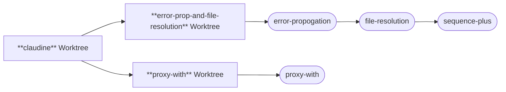

## Context

We are trying to merge the `claudine` branch with two forked branches: `error-prop-and-file-resolution` and `proxy-with`. This will be a complex merge and we want to take all the precautions necessary to make it go
smoothly. The overall goal will be to have the `claudine` worktree and branch to host ALL of the merged code and ensuring that the acceptance criteria for all of the features and fixes that were developed during this timeframe are met along with L1 and L2 tests passing as well as lints.

### Features and Fixes

The work that has been performed over the lifetime of these two branches are:

- `2026-07-13-error-propogation`
    - reporting errors correctly and verbosely is important for Claudine
    - this feature was born out of a set of errors which were doing a very bad job of this
    - the fix tries to tackle at the pattern level and get a whole category of errors to report much richer results 
- `2026-07-13-file-resolution`
    - fixes a bug with out implicit relative references are handled in Claudine
- `2026-07-11-sequence-plus`
    - a major upgrade to the `sequence` operation in Claudine
- `2026-07-13-proxy-with`
    - allows flow control actions to modify Frontmatter state more ergonomically before passing flow control over to another prompt
    
## Task

::block when="state.name == 'claudine'"
Your task is to focus exclusively on the `claudine` worktree and branch and document it's modern history. This document will be saved to: '{{ claudine_log }}'

- the first section -- called `## Overview` -- will:
    - review the features/fixes that were executed in or merged into `claudine`:
        - there are no features/fixes that were believed to be exclusively written here
    - the review section should open with a broad based paragraph introducing the work but then should allow for each of the features/fixes which have been worked on to have a more detailed description of precisely what this work hoped to achieve and what it's acceptance criteria looked like
    - make sure to document the `packages` that were changed in this feature/fix as well as what _modules_ within those packages were changed
- the next section will be a timeline of commits which will go in it's own H2 heading: `## Timeline`
    - this timeline should be an unordered list with every commit made in this branch since (and including) when `error-prop-and-file-resolution` and `proxy-with` were branched off from `claudine`
    - for many of the commits all that's necessary is the first line of the commit message which summarizes what happened
    - however, for commits that have particular significance you should create a nested list of messages describing the commit and describing why it's important
- the final section entitled `## File Blast Radius` will capture a list of all files which were mutated in `claudine` directly over the period that `error-prop-and-file-resolution`, `proxy-with` and `claudine` were split.

> NOTE: make sure to use the 'claudine' skill during this task
::end-block

::block when="state.name == 'error-prop-and-file-resolution'"
Your task is to focus exclusively on the `error-prop-and-file-resolution` worktree and branch and document it's modern history. This document will be saved to: '{{ error_log }}'

- the first section -- called `## Overview` -- will:
    - review the features/fixes that were executed in `error-prop-and-file-resolution`:
        - `2026-07-13-error-propogation`
        - `2026-07-13-file-resolution`
        - `2026-07-11-sequence-plus`
    - the review section should open with a broad based paragraph introducing the work but then should allow for each of the features/fixes which have been worked on to have a more detailed description of precisely what this work hoped to achieve and what it's acceptance criteria looked like
    - make sure to document the `packages` that were changed in this feature/fix as well as what _modules_ within those packages were changed
- the next section will be a timeline of commits which will go in it's own H2 heading: `## Timeline`
    - this timeline should be an unordered list with every commit made in this branch since (and including) when `error-prop-and-file-resolution` and `proxy-with` were branched off from `claudine`
    - for many of the commits all that's necessary is the first line of the commit message which summarizes what happened
    - however, for commits that have particular significance you should create a nested list of messages describing the commit and describing why it's important
- the final section entitled `## File Blast Radius` will capture a list of all files which were mutated in `error-prop-and-file-resolution` directly over the period that `error-prop-and-file-resolution`, `proxy-with` and `claudine` were split.

> NOTE: make sure to use the 'claudine' skill during this task
::end-block

::block when="state.name == 'proxy-with'"
Your task is to focus exclusively on the `proxy-with` worktree and branch and document it's modern history. This document will be saved to: '{{ proxy_log }}'

- the first section -- called `## Overview` -- will:
    - review the features/fixes that were executed in `proxy-with`:
        - `2026-07-13-proxy-with`
    - the review section should open with a broad based paragraph introducing the work but then should allow for each of the features/fixes which have been worked on to have a more detailed description of precisely what this work hoped to achieve and what it's acceptance criteria looked like
    - make sure to document the `packages` that were changed in this feature/fix as well as what _modules_ within those packages were changed
- the next section will be a timeline of commits which will go in it's own H2 heading: `## Timeline`
    - this timeline should be an unordered list with every commit made in this branch since (and including) when `error-prop-and-file-resolution` and `proxy-with` were branched off from `claudine`
    - for many of the commits all that's necessary is the first line of the commit message which summarizes what happened
    - however, for commits that have particular significance you should create a nested list of messages describing the commit and describing why it's important
- the final section entitled `## File Blast Radius` will capture a list of all files which were mutated in `proxy-with` directly over the period that `error-prop-and-file-resolution`, `proxy-with` and `claudine` were split.

> NOTE: make sure to use the 'claudine' skill during this task
::end-block

::block when="state.name == 'conflict'"
We have created to documents which detail the changes to all three of the Claudine branches/worktrees:

- [`claudine` branch]({{ claudine_log }})
- [`error-prop-and-file-resolution` branch]( {{ error_log }} )
- [`proxy-with` branch]( {{ proxy_log }} )

Your task is to write a conflict report to '{{ conflict }}' which:

- describes in detail the key conflict areas which will need to be carefully managed during this merge
- describes what functionality was developed that exists _outside_ of the **Claudine** package area
- describes the appropriate approach we should use to merge this successfully
- define how we will make sure that the underlying "acceptance criteria" of each fix/feature is assured after the merge is complete

If there are any things which can be done to further reduce the merge risk prior to starting please mention that as well.

> NOTE: make sure to use the 'claudine' skill during this task
::end-block
