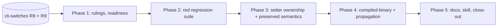

# Plan: A shorthand setter after a provider switch is applied, not forwarded

Source: `spec.md` in this directory (reviewed 2026-10-01). An agent's terminal
state is "implementation complete, ready for review": never move the fix to
`_completed` and never run `just complete`.

## Summary and Definition of Done

**The defect.** `partition_composition_tail` (`cli/src/argv/partition.rs`)
forwards every non-Claudine token after the first unowned switch, so
`compose plan.md --codex -c x=y phase=2` sends `phase=2` to Codex and renders
the key's default. Shape alone cannot separate `-c`'s own `x=y` from the caller
setter `phase=2`; the partitioner must know how many values `-c` consumes.

**How this fix is built.** This spec is a *consumer* of
`2026-07-13-cli-switches` (R8 researched switch metadata, R9 type-aware token
ownership, resolved-provider check). It adds no second parser, switch catalog,
warning mechanism, or workstream. So the plan is:

1. settle rulings and confirm the dependency's state (Phase 1);
2. write the failing regression suite first, against the shared classifier's
   seam (Phase 2);
3. land the setter-specific behavior that the dependency's classifier does not
   already deliver, and prove it through the existing override path (Phase 3);
4. prove it through compiled binaries on all three commands and every launch
   path (Phase 4);
5. docs, skill, and close-out (Phase 5).

**Done when** every acceptance criterion in the spec is checked, and from
`claudine/`: `just test`, `just test-l2`, and `just lint` pass; the existing
`reported_command_forwards_config_switch` test passes unchanged; the
reproduction renders "Phase 2" with only `-c` and its value as provider args;
`docs/topics/composition.md` and the claudine skill are updated with no link
back to a fix spec.

### Cross-cutting constraints

- No `cargo fmt`; no commits unless explicitly told; nextest only (`just test`).
- Every behavior change includes a pass over `///`/`//!` docs and inline
  comments of the touched symbols (notably the `partition.rs` module docs
  "Ownership model", which describe the retired first-unowned-switch rule, and
  the `looks_like_setter` doc in `argv/mod.rs`). Code wins on drift; report it.
- Must work on macOS, Linux, native Windows, WSL2. Load the `os` skill before
  touching path-comparison code; fixtures must be portable Rust, not shell.
- Binary tests use `CliProcessFixture` with isolated home and cwd, private
  audio policy, and fake providers; shared env state goes through Test Toolkit
  helpers. No real provider, no network, no window takes focus.
- Load skills as needed: `claudine`, `rust-testing`, `clap`, `darkmatter`
  (schema precedence), `os`.
- Do not build a setter-only classifier, switch table, or merge path. If the
  dependency's seam cannot express a case, stop and raise a ruling.

## Phase 1: Rulings, readiness, and fixture spike

### Necessary Rules

Defaults apply unless the author rules otherwise; record each in a new
`implementation-log.md` in this directory.

1. **Sequencing against the dependency (default: this fix's behavior lands
   only on top of cli-switches R9, never as an interim rule).** The spec
   forbids a second parser, so the setter ownership table cannot be satisfied
   before R8 metadata and the R9 ownership function exist. Phase 2 may run
   earlier because its tests are red by design; Phase 3 starts only when R9's
   shared ownership function is on the branch. If R9 is delayed the author
   decides whether to wait or reorder; the agent does not improvise a stopgap.
2. **Injectable switch metadata for tests (default: required).** Table rows 4
   and 6 and the acceptance bullet "resolved to Claude fails before spawn" need
   controlled switch types ("takes no value", "variadic", "none for Claude and
   string for Codex") independent of whatever the fleet research says today.
   Ruling needed that R9's ownership function accepts a metadata lookup as data
   (it should, per the dependency's ownership-in-lib ruling) so unit fixtures do
   not depend on generated data. Binary tests use real generated metadata with a
   fixture chosen from it (row 4: "choose a fixture from the generated metadata").
3. **Setters keep original positions in the Claudine argv (default: yes).** The
   partitioner's Claudine output keeps reclaimed setters in original relative
   order alongside setters seen before the switch, so
   `parse_composition_positionals` collects them in one pass and
   "last occurrence wins, including straddling provider args" falls out of the
   existing `Map::insert` order. No separate merge path is added.
4. **Order of precedence between the schema-claimed setter and a missing value
   (default: spec wins).** `--codex -c phase=2` with `phase` declared keeps
   `phase=2` a setter and fails for missing `-c` value before launch; the error
   names `-c`, `phase`, and Codex, redacts the setter value, and suggests a
   separate provider value or `--`. `--codex -c phase=2 x=y` must not rebind
   `x=y` (adjacency survives classification).
5. **Dotted keys (default: spec wins).** `foo.bar=baz` is not a setter, so it
   goes through the dependency's ordinary rules (positional or provider value),
   not this fix. One test pins that no new setter grammar was introduced.
6. **`argv=` after a provider switch (default: dependency owns it).** Error with
   bare-word guidance; this fix adds no exception and only asserts the
   existing/planned behavior is not weakened by the new routing.
7. **Frontmatter `status: proposed` in `spec.md`** is outside the `$schema`
   enum. This plan does not edit spec frontmatter. Recommendation to the
   author: set `draft-spec`, or `planned` once this plan is adopted.
8. **Measurement.** The spec rules out a performance spike and new CI matrix.
   If the early frontmatter read shows concrete new cost, one host and a quick
   sample; anything wider is the author's call. No benchmark is added.

### Spikes

Run once, now, one host, quick sample. No re-checks in later phases.

- [x] **Spike A: dependency state.** Read `2026-07-13-cli-switches/plan.md`,
  its `implementation-log.md` if present, and `git log` for `cli/src/argv/` and
  the generated `lib/src/provider/*/data.rs` to determine which of R8 (metadata,
  lookup) and R9 (ownership function, resolved-provider check, `argv`
  positionals, ambiguity) have landed. Record in the log, with the exact
  function names this plan's tasks must call. Informs ruling 1 and Phase 3.
- [x] **Spike B: fake-provider fixtures.** In `cli/tests/l1/cli_process_fixture.rs`
  and the existing compose-binary tests, confirm `CliProcessFixture` can stand up
  fake `codex` and `claude` providers that record their exact argv, and that
  `--dry-run` reports the stderr "Provider args" row without any provider
  installed. If not, list the minimal fixture extension. Informs Phase 4.

### Tasks

- [x] **Record rulings.** Write rulings 1-8 (author answers or accepted defaults)
  into `implementation-log.md`.
- [x] **Run the spikes.** Record each finding in a few lines; a finding that
  contradicts the spec is a ruling for the author, not a silent divergence.
- [x] **Baseline.** From `claudine/`, run `just test` and `just lint`; record
  pre-existing failures (the worktree has uncommitted changes in unrelated
  files) so they are not attributed to this work.
- [x] **Locate guards.** Confirm the existing tests this fix must preserve and
  note what each protects: `reported_command_forwards_config_switch`,
  `setter_before_tail_stays_with_claudine`, `owned_flag_after_tail_is_reclaimed`,
  `explicit_separator_forwards_opaque_tail`, `switch_before_file_errors`,
  `separator_before_file_errors` (all in `argv/partition.rs`), the setter tests in
  `compose/setters.rs`/`compose/tests.rs`, `tests/l1/argv_normalization.rs`,
  `tests/l1/wrap_direct_argv.rs`, `tests/l1/completion_setter.rs`, and the
  caller-propagation coverage (`compose_caller_file_provenance.rs`).

Checkpoint 1: rulings recorded, dependency state known, baseline known.

## Phase 2: Red regression suite (tests first)

Purpose: capture every ownership-table row and acceptance bullet as an
executable assertion before behavior changes, so each flips green for a stated
reason. Tasks in a wave are parallel; waves run in order.

### Wave 1: parallel

- [ ] **Ownership table, unit.** Beside `argv/partition.rs`, add one
  table-driven test over the spec's nine rows plus the acceptance extras. Each
  case asserts **both** the Claudine argv/caller setters and the exact forwarded
  token list (never only one). Use the controlled metadata of ruling 2, and a
  control row `--codex -c model_reasoning_effort=low` that already passes.
  Cases:
    - `--codex -c x=y phase=2`: forward `-c x=y`; setter `phase=2`.
    - `-c x=y phase=2` with a document that has **no `agent` hint**, so the
      candidate union is really exercised; forward `-c x=y`; setter `phase=2`.
    - `--codex --yolo phase=2`: `--yolo` Claudine-owned, setter applied.
    - controlled "takes no value" provider-only switch then `phase=2`.
    - `--claude --add-dir a b phase=2`: forwards `--add-dir a b`.
    - `--claude --add-dir x=y phase=2` (neither key in schema): forwards
      `--add-dir x=y` only; `phase=2` a setter.
    - `--codex -c phase=2` with `phase` declared: setter kept, missing-value
      error for `-c` naming switch, `phase`, Codex; nothing launched.
    - unrecognized provider switch then `phase=2`: setter.
    - `--codex --config=x=y phase=2`: attached value one token; setter applied.
    - `--codex -c x=y -m gpt5 phase=2`: `-m gpt5` Claudine's, `-c x=y` forwarded,
      setter applied.
    - A Claudine option interrupting a variadic run: later tokens do not
      reconnect (`--claude --add-dir a -m gpt5 b` leaves `b` out of the run).
    - `--codex -c phase=2 x=y` with declared `phase`: fails; `x=y` never becomes
      the `-c` value (adjacency preserved).
    - `--codex -- -c x=y phase=2` and the same with `phase` declared: both
      setter-shaped values forwarded untouched, neither a setter; no
      missing-value check on the opaque part.
- [ ] **Schema-source matrix, unit.** For a declared `phase` directly after `-c`:
  inline `$schema`; a root schema union (declared in a non-first arm); a raw JSON
  Schema with statically declared properties; and a source-relative external
  schema resolved from the composition file's directory (assert resolution is
  relative to the file, not the cwd; use portable paths). Plus an unestablished
  schema (unreadable/dynamic) giving the dependency's contested-value error with
  the `--`/`--set` guidance, and no silent provider routing.
- [ ] **Setter semantics, unit.** Beside `compose/setters.rs`: `count=3`,
  `enabled=true`, `phase=`, `label=a=b` keep their types after reclaim;
  duplicate shorthand keys are last-wins across a provider-switch boundary;
  shorthand beats `--set` regardless of placement; dotted key `foo.bar=baz`
  is not a setter; provider switch values stay unchanged strings (`-c count=3`
  forwards the string `count=3`).

### Wave 2: depends on Wave 1 fixtures

- [ ] **Resolved-provider failure fixture.** With no schema claiming `x`:
  `-c x=y phase=2` classified across candidates but resolved to Claude (where
  `-c` takes none) fails before spawn naming the switch, token, and provider,
  and does not reroute `x=y` into frontmatter. Controlled metadata and a fake
  Claude provider; assert no process was spawned.

Checkpoint 2: new tests compile; the table's defect rows fail for the intended
reason (setter forwarded or wrong error) while the control rows and all
Phase 1 guard tests stay green. Record the red set in the log.

## Phase 3: Setter ownership on the shared classifier

Depends on Phase 1 ruling 1 (R9 ownership function present). Waves in order.

### Wave 1

- [ ] **Wire the classifier result into the partition.** Make
  `partition_composition_tail` obtain ownership solely from R9's shared function;
  reclaimed setters are emitted into the Claudine argv at their original relative
  positions (ruling 3); provider tokens go to the typed tail descriptor with
  per-switch value assignments. No setter-specific branch, regex, or table in
  `partition.rs`. Delete the "first unowned switch forwards every later token"
  logic and rewrite the module docs "Ownership model" to match.
- [ ] **Setter shape check shared, not copied.** Where R9 decides "key=value",
  call the existing key grammar of `parse_compose_setter` (ASCII letter or `_`
  first, then letters, digits, `_`, `-`; split at first `=`). Remove or
  de-duplicate `looks_like_setter` if it becomes a second copy, and update its
  doc comment: shape no longer decides ownership by itself.
- [ ] **Adjacency-preserving errors.** Ensure the missing-value error for
  `-c phase=2` (declared) is produced from original adjacency, not from the
  filtered argv, so `x=y` cannot reattach. Error text: switch, conflicting setter
  key where applicable, provider; guidance to supply a separate provider value or
  put intentional provider arguments after `--`; the setter value is not echoed
  (dependency redaction contract).

### Wave 2: parallel

- [ ] **Setter path preserved.** Confirm reclaimed setters reach
  `parse_composition_positionals` (`commands/compose/setters.rs`) through clap's
  positionals and `merge_set_overrides`, with no new merge path. If the
  dependency's `argv` change touches that function, keep setter behavior
  byte-for-byte: key grammar, JSON5-then-string value, empty value is an empty
  string, shorthand wins over `--set`, last occurrence wins.
- [ ] **Provenance and anchoring.** Verify reclaimed setters are recorded as
  caller overrides, with file-reference anchoring, through the same call as
  pre-switch setters, never as document-authored values (extend
  `compose_caller_file_provenance.rs` with a post-switch setter that is a file
  reference).
- [ ] **`inline-compose` and `sequence` plumbing.** Confirm reclaimed setters
  flow through the existing caller-overlay path: `inline-compose` applies them as
  an invocation overlay without persisting them to the source file (agent edits
  keep existing behavior); `sequence` applies them to every step, with the
  reserved per-step overlay keys keeping their established precedence.
- [ ] **Launch-path invariance.** Retry, resume, and proxy launches reuse the
  original ownership decision and caller inputs; add a guard test (no second
  classification call on those paths) rather than new code, unless Spike A shows
  a path that reclassifies.

### Wave 3: green the Phase 2 suite

- [ ] Run the Phase 2 suites; fix defects at the source, not in the tests. Any
  row the shared classifier cannot express is a ruling for the author, not a
  local special case.
- [ ] **Drift pass** on `partition.rs`, `argv/mod.rs`, `setters.rs` comments;
  fix comments to match code and note each in the log.

Checkpoint 3: `just test` and `just lint` green from `claudine/`;
`reported_command_forwards_config_switch` and all guards unchanged and green;
every Phase 2 table row green.

## Phase 4: Compiled-binary coverage and propagation

Depends on Phase 3. All tests use `CliProcessFixture`; Spike B settles fixture
gaps. Tasks parallel unless noted.

- [ ] **Reproduction, dry-run.** Portable Rust fixture writing the shell-free
  `plan.md` (`phase: 1`, body `Phase {{ phase }}`) in a temp dir. Control
  `phase=2 --codex -c ... --dry-run` and defect
  `--codex -c ... phase=2 --dry-run` both render "Phase 2". Assert the stderr
  "Provider args" **token list** (not table spacing) holds `-c` and its value
  and no `phase=2`. No Codex install required; temp dir removed.
- [ ] **`compose` output.** A post-switch setter changes rendered output and is
  absent from the fake provider's recorded argv; exact child argv asserted.
- [ ] **`inline-compose` effective launch input.** Setter applies to the launch
  input; the source file is not modified by the overlay (assert file bytes).
- [ ] **`sequence`, every applicable step.** Multi-step fixture; each step sees
  the setter and none receives it as an argument; the tail still reaches every
  step token for token.
- [ ] **Propagation.** A reclaimed setter survives retry, resume, and proxy
  adoption with the original ownership and no reclassification (fake provider
  scripted to fail once, then resume).
- [ ] **Failure paths launch nothing.** `--codex -c phase=2` (declared `phase`),
  `--codex -c phase=2 x=y`, the Claude-resolved `-c x=y phase=2`, and an
  unestablished schema each exit non-zero before any spawn with the expected
  message fields; stderr/stdout split preserved.
- [ ] **Escape hatch and typing.** `--codex -- -c x=y phase=2` forwards both
  verbatim even with `phase` declared; numeric, boolean, empty, and
  string-containing-`=` setters keep types end to end; duplicate setters
  last-wins; shorthand beats `--set`.
- [ ] **Preserved errors.** Switch-before-file and separator-before-file still
  produce today's ordering guidance.
- [ ] **Placement.** Place tests per `rust-testing` (L1 under `cli/tests/l1`,
  registered so `test_placement.rs` stays green). L2 only if a real-terminal
  behavior is needed (none expected); any L2 stays in the background.

### Input robustness note

No new file format or configuration reader is added: schema property-name
reading, setter parsing, and metadata loading belong to the dependency and the
existing setter grammar, whose matrices live in the dependency's plan. This
plan's setter-token cases (empty, string-with-`=`, duplicate, dotted,
non-first-arm schema declaration, unreadable schema) are enumerated in Phase 2
and asserted through the public result (child argv and rendered frontmatter).

Checkpoint 4: `just test` and `just test-l2` green from `claudine/`; no
terminal or browser window took focus; the reproduction passes.

## Phase 5: Documentation and close-out

Tasks are parallel unless noted.

- [ ] **`docs/topics/composition.md`.** Under Positional Arguments and Provider
  Argument Forwarding explain, for a reader with no repo experience: setters
  after provider switches (compact example per rule: `-c x=y phase=2`, variadic
  run, `-m` after a switch), the schema-priority missing-value error, and `--` as
  the provider-data escape hatch; include a Mermaid flowchart of the
  per-token ownership decision if the dependency has not already added one
  (extend it rather than duplicate).
- [ ] **Related docs.** Update argument-normalization and cli-pre-parsing topic
  pages with the dependency. Remove any text saying a setter after a switch is
  forwarded. The `docs/` tree must not link to or name this fix or its
  dependency by path or `{date}-{name}`.
- [ ] **Skill.** Update `.claude/skills/claudine/` (architecture and
  compose-related pages) for the changed ownership behavior.
- [ ] **Reader's-note behavior change.** Doc that routing before an authored `--`
  intentionally changed: callers wanting `key=value` as provider data put it
  after `--`.
- [ ] **Drift pass.** Review `///`/`//!` and inline comments across all touched
  files; resolve in favor of the code; report in `implementation-log.md`.
- [ ] **Final verification.** From `claudine/`: `just test`, `just test-l2`,
  `just lint`. Walk the spec's acceptance checklist and check each box with
  evidence (test names) in `implementation-log.md`.
- [ ] **Hand off.** Do not edit spec frontmatter beyond what the author directs,
  do not move the fix to `_completed`, do not run `just complete`, do not commit
  unless asked. State "implementation complete, ready for review", and note that
  completing this spec does not complete the dependency's larger fix.

Checkpoint 5: all acceptance criteria checked with evidence; docs and skill
updated; lint and tests green on `claudine/`.

## Acceptance traceability

| Spec acceptance criterion | Proven in |
| --- | --- |
| Existing `reported_command_forwards_config_switch` passes | Phase 1 guard, Phase 3 checkpoint |
| Every table case asserts setters and exact forwarded tokens | Phase 2 Wave 1 |
| `--codex -c x=y -m gpt5 phase=2` | Phase 2 Wave 1 |
| Claudine option interrupting a variadic run | Phase 2 Wave 1 |
| Inline / union / source-relative / unestablished schema | Phase 2 Wave 1 (schema matrix) |
| `--codex -c phase=2 x=y` fails, no reattach | Phase 2, Phase 3 Wave 1, Phase 4 |
| Claude-resolved `-c x=y phase=2` fails before spawn | Phase 2 Wave 2, Phase 4 |
| `--codex -- -c x=y phase=2` forwarded unchanged | Phase 2, Phase 4 |
| Type retention, duplicates, shorthand over `--set` | Phase 2 setter semantics, Phase 4 |
| Binary coverage for compose, inline-compose, sequence | Phase 4 |
| Retry, resume, proxy propagation | Phase 3 Wave 2, Phase 4 |
| Reproduction renders "Phase 2", provider args only `-c` | Phase 4 |
| Docs and skill | Phase 5 |
