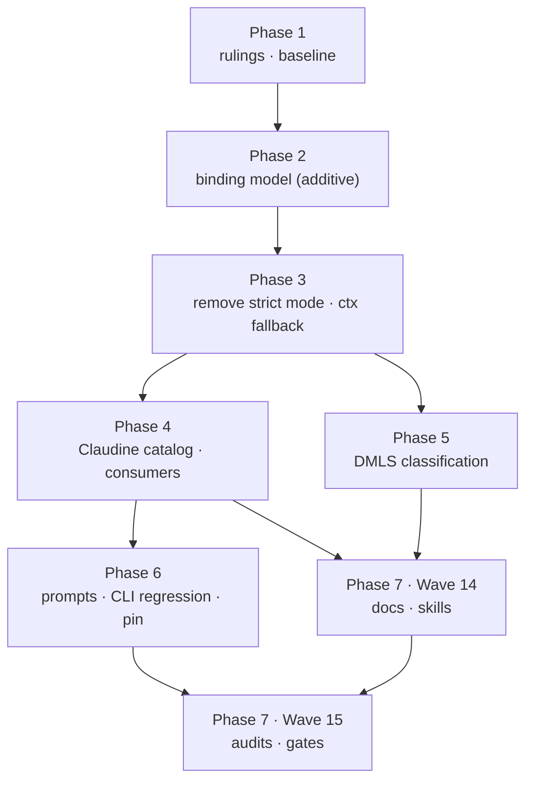

# Remove Strict Mode and Centralize Expression Binding — Implementation Plan

This plan implements the **core** of [spec.md](spec.md) as re-scoped on
2026-10-01 ([spec.md § Scope](spec.md#scope-re-scoped-2026-10-01)). It replaces
the 2026-09-17 draft, which was marked superseded and is preserved in git
history at commit `13df7698f`. The design inputs are the in-scope parts of
[design.md](design.md) (D1, D2, D4, D7, D8, D21),
[design-contracts.md](design-contracts.md) (C1, C2, C9, and C3's per-event
matrix), and [migration-inventory.md](migration-inventory.md) without its
"Schema and trigger migration" section.

Nothing the spec marks **Out of scope** is planned here: R10, R11, R12, R7c,
the unified global schema entry point, schema exports and local type names,
the `schema-trigger` and `--no-schema-triggers` renames, the trigger AND/OR
grammar, and acceptance criteria 18 and 20–22. The same applies to C4
(provenance envelopes), C5–C8, D3, D5, D6, and D9–D20, D22.

## Work Summary and Definition of Success

### What changes

1. **Darkmatter gains a binding model (R2, D1, D2, D7, C1).** Expression lookup
   gets one fallible resolution channel that can tell four outcomes apart:
   - a document property, present or absent (absent evaluates to `null`);
   - a reserved namespace (`doc`, `ctx`, `env`, `current`, `current_env`);
   - an available global, including one whose value is `null`;
   - an unavailable global, which raises a typed error.

   Hosts declare their globals in an immutable, provider-free declaration
   (`BindingView`). They associate the runtime entries (eager, lazy, or
   unavailable) through a checked boundary that rejects reserved names and
   incomplete registrations before any provider runs. Each
   `SubtreeCompose::compose` call or direct evaluation gets a fresh session
   with its own lazy cache.
2. **Darkmatter gains a passive prepared-expression validator (R2, D4, C2).** It
   checks every authored reference, including references in inactive branches,
   against a `BindingView`. It reports definitely unavailable globals without
   invoking providers or evaluating anything. Runtime evaluation uses the same
   classification.
3. **Strict mode is removed (R1, R3).** This removes `SubtreeStrictness`,
   `.strict()`, `with_strictness`, the strictness argument of
   `compose_subtree`, `validate_strict_roots`, the subtree-local
   `collect_variable_roots`, and `EvaluationLookup::is_known_variable_root`
   from every implementation. The bare-name fallback to `ctx` is removed from
   every lookup. The `collect_variable_roots` that orders shell-expansion
   dependencies in `frontmatter_interpolation.rs` stays.
4. **Claudine declares lifecycle bindings and stops walking expressions (R4,
   R5, R6, D8, C3, C9).** One Claudine-owned catalog declares `err`, `timing`,
   and `group` with per-scope availability. Every event, task, and approval
   surface hands Darkmatter a complete session. The following are deleted:
   - `first_undefined_stack_variable` and its walkers;
   - `validate_no_undefined_lifecycle_variables` and
     `CompositionError::LifecycleUndefinedVariable`;
   - the custom AST walk inside `validate_no_err_in_no_error_events`;
   - the surviving-span post-evaluation rejection.

   The typed Darkmatter cause survives through the Claudine library boundary.
   Setup and teardown commands run the bytes approved at sequence-wide
   preflight.
5. **DMLS reports an undeclared property as an advisory and takes its root
   classification from Darkmatter (R7a, R7b).**
6. **Prompts and docs are corrected (R8, R9).** The `(x || false)` legality
   guards are removed from shipped prompts. A literal shipped-prompt regression
   proves the reported router case. The hash pin is refreshed after that
   regression passes, and docs and skills describe one contract.

### Definition of success

The phase is done when all of these are true:

- Spec acceptance criteria **1–17 and 19** each have passing evidence. Each
  phase's checkpoint names the criteria it closes; Phase 7 closes the rest
  and records the mapping in the implementation log.
- `rg 'SubtreeStrictness|with_strictness|is_known_variable_root|validate_strict_roots|first_undefined_stack_variable|LifecycleUndefinedVariable|validate_no_undefined_lifecycle_variables'`
  over `darkmatter/` and `claudine/` source returns nothing outside historical
  specs and logs.
- `{{ plan ? '- a plan file was identified: ' + plan : '' }}` in the
  repository-root `prompts/implement.md` runs unguarded to the router's
  authored `error` action in a hermetic CLI L1 test.
- `just test` and `just lint` pass in `darkmatter/` and `claudine/`, and
  `just test-l2` passes where an existing L2 suite covers the changed
  composition boundary. No CI matrix cell is added.
- The spec's frontmatter is left for the author. The terminal state is
  "implementation complete, ready for review"; no agent moves this fix to
  `_completed`.

### Input Robustness Matrix

Not applicable. This fix changes expression binding and lookup, not a reader
of a file format or configuration. The lifecycle-global catalog is declared in
Rust (R4); the parked R7c would make it schema data and would need the matrix
then.

## Phase 1 — Rulings, approval gate, and baseline

### Necessary Rules

These rulings must be recorded, by the owner or by accepting the stated
recommendation, before Phase 2 starts. Each one resolves a gap between the
design record (written 2026-09-19) and either the re-scope or the code as it
stands on 2026-10-01.

- [x] **NR-1: Design approval gate (rollout ruling 2).** The rollout
  strategy lists "independent design review and design approval for the
  strict-mode core" as unmade, and `design.md` still reads "not yet approved
  for implementation planning". This plan was requested before that ruling was
  recorded.
  - **Recommendation:** treat the review as covering this plan together with
    the in-scope design artifacts. Record the approval in
    `claudine/docs/rollout-strategy.md` (ruling 2) and in the `design.md`
    status line before Phase 2.
- [x] **NR-2: Plain values instead of `ValueEnvelope`.** C1 and C2 are written
  against C4's `ValueEnvelope`, and C4 is out of scope.
  - **Recommendation:** in the core, `ResolvedBinding`, `RuntimeBinding::Eager`,
    lazy providers, and `evaluate_prepared` carry `serde_json::Value`. Lazy
    providers keep today's `InjectedGlobal::lazy(Fn() -> Value)` shape.
  - No provenance, stage, or policy metadata is introduced. The envelope can
    later wrap the value without changing the classification.
- [x] **NR-3: Which names are reserved.** The spec's Language Contract names
  three reserved namespaces (`doc`, `ctx`, `env`). Darkmatter now reserves
  five through `reserved_root_descriptors()` in
  `darkmatter/lib/src/markdown/compose/expression/catalog/roots.rs`: `doc`,
  `ctx`, `env`, `current`, and `current_env`. The more-context work landed
  after the design.
  - **Recommendation:** the binding model takes its reserved-namespace set from
    that one table. Registration rejects every name in it, which slightly
    widens acceptance criterion 2 from "exactly `doc`, `ctx`, `env`" to "every
    reserved root".
  - `current` therefore leaves C3's Claudine catalog: it is a Darkmatter
    namespace, not a lifecycle global.
  - **Owner sign-off required**, because this widens an acceptance criterion
    (spec: "bring that decision back to the human").
- [x] **NR-4: `timing`, not `tracking`.** C3 and the parked unified schema name
  a `tracking` global; Claudine injects `timing`
  (`lifecycle_injected_globals` in
  `claudine/lib/src/composition/lifecycle/context.rs`).
  - **Recommendation:** the catalog declares `err`, `timing`, and `group`. No
    rename in this fix; a rename belongs to the parked schema work.
- [x] **NR-5: One resolution channel, not three methods.** D1 chose a richer
  method with an ordinary default. Since then the trait has gained
  `get_checked`, a fallible channel the evaluator already reads through.
  - **Recommendation:** evolve `get_checked` into
    `resolve(&self, path) -> Result<ResolvedBinding, ExpressionError>`, with a
    default that wraps `get` as `Document`. Add `binding_view()` (default
    `None`) and `format_resolved`, as C1 describes.
  - Existing `ContextNotCaptured` and `ContextProjectionInvariant` errors move
    onto that channel unchanged. This is D1 option B with one channel instead
    of two parallel fallible methods.
- [x] **NR-6: Scope of the prepared representation (D4, C2).** Without R10 and
  C5, C2's feature-violation family, schema-generation identity, and
  `PreparedContextMismatch` against a mutable editor registry have no caller.
  - **Recommendation:** the core ships `prepare_value`, `validate_prepared`,
    and `evaluate_prepared`. The prepared identity is the `BindingView`
    identity alone.
  - The core omits the feature-restriction policy and the semantic-bundle
    identity, and adds error families only for binding configuration and
    unavailable bindings. The existing parse, evaluation, and schema errors
    remain as they are.
- [x] **NR-7: Diagnostic code and classification for undeclared properties
  (R7a).** The Darkmatter library (`unknown_identifiers.rs`, `absence.rs`)
  and DMLS (`overlay/expressions.rs`) share the code
  `dm.expression.unknown_identifier`. Its message says the name "matches no
  frontmatter key, schema property, `ctx.*`, `env.*`, or function".
  `absence.rs::is_statically_known_root` also treats bare context-descriptor
  names as known roots, which is the static mirror of the `ctx` fallback that
  R3 removes.
  - **Recommendation:** rename the code to
    `dm.expression.undeclared_property` in the library, DMLS, `md` CLI tests,
    and docs in one change, with no alias.
  - Reword the message to "`{root}` is an undeclared document property (unknown
    type; `null` unless supplied at runtime)".
  - Drop context-descriptor names from the known-root check.
  - Keep the existing suppression when an author wrote a fallback or ternary.
    The diagnostic is an advisory, and the suppression does not make anything
    legal at runtime.
- [x] **NR-8: Loop `_loop_*` names.** The inventory (row 13) proposes
  registering `_loop_*` as explicit loop globals. `2026-09-21-lifecycle-ergonomics`
  removes those names, and the spec's Non-Goals exclude reworking loop action
  handling.
  - **Recommendation:** `LoopExpressionLookup` keeps `_loop_*` as ordinary data
    through the default `resolve`, and only its `ctx` fallback is removed. No
    loop catalog is built.
- [x] **NR-9: Approved command artifacts for setup and teardown (D8, C9).** The
  lifecycle investigation found that setup and teardown commands are approved
  as resolved bytes, then re-parsed and re-evaluated at execution
  (`collect_lifecycle_shell` compared with `TaskExecution::parse_stacks`).
  - **Recommendation:** fix this gap in scope, as D8 and acceptance criterion 9
    (byte parity) require. Use a minimal Claudine-private `ApprovedCommand`
    (site identity plus `String` bytes) with no envelope (NR-2).
- [x] **NR-10: Delete the provenance spike test.**
  `claudine/lib/tests/l1/strict_mode_provenance_spike.rs` is a test-only D5
  prototype, and D5 is out of scope.
  - **Recommendation:** delete it when `.strict()` is removed. Its findings
    stay recorded in [spike-results.md](spike-results.md).
- [x] **NR-11: Behavior changes the owner should see before merge.** These
  follow from the spec and design. They are listed because shipped prompts or
  user documents may depend on today's behavior:
  - bare `err` in `finalize` or teardown with no error now reads an explicit
    `null` global instead of falling through to a document property `err` (D7);
  - bare `group` outside any group, and inside sequence-wide shell approval,
    raises a typed unavailable error instead of reading a document property
    `group` (D8). `doc.group` still reads the document;
  - a bare name matching a context key (for example `branch`) no longer reads
    `ctx.branch` (R3).
  - **Recommendation:** accept these. Task "Prompt exposure audit" below
    measures their reach before Phase 2.

### Spikes

No new spike is scheduled. The two spikes the owner requested on 2026-09-19
covered provenance transfer and DMLS failure recovery, and both subjects are
now out of scope. The core's remaining risks concern API shape and migration
breadth, not unknown runtime behavior. They are handled by the inventory and
impact tasks in Wave 2 and by Phase 2's contract tests.

### Wave 1 — rulings (serial, owner)

- [x] **Record rulings**
  - Record NR-1 through NR-11 outcomes in a `## Rulings` section of
    `implementation-log.md` beside this plan (create it), with the date and
    the person who decided.
  - If NR-3 is accepted, note the widened criterion 2 in the implementation
    log. The spec is a snapshot and is not edited.

### Wave 2 — baseline and inventory (parallel; read-only except the log)

- [x] **Test baseline**
  - Run `just test` and `just lint` in `darkmatter/` and `claudine/` on the
    unmodified tree. Record pre-existing failures in the implementation log so
    later phases are not blamed for them.
- [x] **Lookup inventory refresh**
  - Re-verify the 21-row lookup table in
    [migration-inventory.md](migration-inventory.md) against current source and
    record the deltas in the implementation log. Known deltas on 2026-10-01:
    - **New:** `DeferrableLookup` (`darkmatter/lib/src/markdown/compose/inline/interpolation.rs:163`)
      is a forwarding wrapper and must forward the richer method.
    - **New:** the test-only `Nothing` in `expression/absence.rs:398`.
    - **Moved:** the two integration fixtures now live under
      `darkmatter/lib/tests/l1/`.
    - **Ignore:** `darkmatter/features/2026-09-21-schema-enhancements/spikes/coercion-baseline`
      has no `Cargo.toml` and is not compiled.
  - The result is the checklist Phase 3 migrates: 23 implementations plus
    2 rustdoc examples.
- [x] **Seam impact check**
  - Run GitNexus `impact` on `EvaluationLookup`, `SubtreeCompose`,
    `InjectedGlobal`, `LayeredLookup`, `lifecycle_injected_globals`, and
    `CompositionError`. Verify `UNKNOWN` results by text search, and record
    callers outside the inventory.
- [x] **Prompt exposure audit**
  - Search `prompts/`, `claudine/` prompts and fixtures, and `darkmatter/`
    fixtures for:
    - `|| false` and `|| ''` guards whose only purpose is legality;
    - bare `err` in `finalize` or teardown;
    - bare `group` outside a group;
    - bare names that match `ctx` keys.
  - Known instances:
    - `prompts/implement.md` lines 53–82 (`review || false` in `when:`, and
      `spec`/`plan`/`review` guards in messages);
    - `prompts/review.md` lines 32–45;
    - the guidance line `prompts/_prompt.md:89`, which teaches the
      workaround.
  - Classify each instance as **legality guard** (remove in Phase 6) or **real
    default** (keep). For example, `frontmatter(spec, "implemented") || false`
    renders the word `false` on purpose and is kept.

**Checkpoint 1:** rulings recorded, the baseline is known, and the migration
checklist and prompt-exposure list are written in the implementation log.
This closes the planning half of acceptance criterion 13.

## Phase 2 — Darkmatter binding model (additive)

Everything in this phase is additive. Strictness still exists, every crate
still compiles, and no caller changes behavior yet. Code lives in
`darkmatter/lib/src/markdown/compose/` (new module `expression/binding.rs`, or
beside `subtree.rs`; the implementer chooses).

### Wave 3 — binding types and checked association (serial; the foundation)

- [x] **Binding types**
  - Add `ResolvedBinding { Document, Namespace, Global }` carrying
    `Option<Value>` or `Value` (NR-2).
  - Add `BindingError`, with `Unavailable { root, path, scope_id, reason, span }`
    and the configuration arms from C2: reserved name, duplicate, unknown
    global, omitted declared global, and contradicting a definite declaration.
  - Add `UnavailabilityReason` with a stable namespaced code and structured
    parameters.
- [x] **Declarations and sessions**
  - Add an immutable, provider-free `BindingView`. It declares global roots,
    each scope's availability (`available`, `unavailable(reason)`, or
    `execution-dependent`), and scope identity.
  - Add `RuntimeBinding { Eager(Value), Lazy(provider), Unavailable(reason) }`.
  - Add `BindingEnvironment::associate(view, document, runtime) -> EvaluationSession`.
    Following D7, association checks the full registration map before any
    evaluation or provider call:
    - reserved names from `reserved_root_descriptors()` are rejected (NR-3);
    - root identifiers only, never dotted paths;
    - every declared global has an entry;
    - an `execution-dependent` declaration resolves to an explicit entry;
    - definite declarations are not contradicted.
  - Following D2, the session owns one lazy cache. It caches a root once
    (including a `null` result) and does not hold its lock while user code
    runs.
- [x] **Trait channel (NR-5)**
  - Evolve `EvaluationLookup::get_checked` into `resolve`. The default wraps
    `get` as `Document`. Add `binding_view()` and `format_resolved`, and keep
    `get`/`get_string` for external callers.
  - The two `SimpleLookup` rustdoc examples in `expression/mod.rs` must still
    compile.

### Wave 4 — evaluator routing and passive validation (parallel after Wave 3)

- [x] **Evaluator routing**
  - The evaluator and interpolator resolve every variable through `resolve`,
    and format through `format_resolved`. That includes the interpolation
    variable fast path that D4 flagged as calling `get`/`get_string`.
  - An unavailable global raises a typed error and never falls through to the
    document. An available `null` global stays a global. Once a root is
    classified as a global or namespace, a missing descendant stays within that
    root.
  - Files: `expression/` evaluator and `interpolation/`.
- [x] **Prepared validator**
  - Add `prepare_value(input, AuthoredMode, &PreparationContext)`,
    `validate_prepared(&PreparedValue, &BindingView) -> Vec<ValidationDiagnostic>`,
    and `evaluate_prepared(&PreparedValue, &EvaluationSession)` (C2, scoped by
    NR-6).
  - Reuse the existing scanners and `SpannedExpr`. Walk all branches and report
    definitely unavailable roots and unknown functions. Defer
    `execution-dependent` roots, invoke no provider, and evaluate nothing.
  - Files: a new prepared module only; do not touch the evaluator files that
    the "Evaluator routing" task owns.

### Wave 5 — contract tests (parallel after Wave 4)

- [x] **Binding contract tests** (Darkmatter L1, a `darkmatter/lib/tests/l1/`
  file or module tests). Cover:
  - available-null compared with unavailable compared with absent document
    property;
  - an injected global shadowing a same-named document property;
  - registration of each reserved root failing before any lazy provider runs.
    Use a provider that panics, to prove it is never called;
  - an omitted declared global failing association even when its only
    reference is in an inactive branch;
  - `doc.doc`, `doc.ctx`, and `doc.env` reading document data;
  - one lazy evaluation per session, including a `null` result.
- [x] **Passive validation tests**
  - A definitely unavailable root in an inactive ternary branch fails
    `validate_prepared`.
  - An `execution-dependent` root is deferred.
  - A counting provider records zero calls during preparation and validation.

**Checkpoint 2:** `cargo check --workspace` is clean, and `just test` and
`just lint` pass in `darkmatter/`. No behavior has changed for existing
callers. This is evidence toward acceptance criteria 6 and 8 (partial).

## Phase 3 — Remove strict mode and the `ctx` fallback in Darkmatter

This phase breaks Claudine's compile at the five `.strict()` call sites. To
keep the workspace building, the same phase deletes those calls mechanically
(Wave 7). Claudine's own walkers stay until Phase 4, so Claudine behavior is
unchanged except that Darkmatter no longer pre-rejects roots.

### Wave 6 — Darkmatter removals (parallel; disjoint files)

- [x] **Subtree API removal** (`darkmatter/lib/src/markdown/compose/subtree.rs`,
  `interpolation/rewrite.rs`)
  - Delete `SubtreeStrictness`, `.strict()`, `with_strictness`, the
    `compose_subtree` strictness argument, `validate_strict_roots`, and the
    subtree-local `collect_variable_roots`. Subtree interpolation stays
    fail-fast; this is ordinary error propagation, not a mode.
  - Rebuild `LayeredLookup` on the Wave 3 session. `with_global` and the
    `globals` map become runtime entries associated against an optional
    `BindingView`. Without a view, an injected global is simply an available
    global.
  - Rewrite the strict/lenient unit tests in `subtree.rs` as single-behavior
    tests and fix the rustdoc examples.
- [x] **Namespace fallback removal** (`context/effective_state.rs`,
  `frontmatter_interpolation.rs`, `conditions.rs`, `expression/ctx.rs`)
  - Remove the bare-name `get_context_value(path)` fallback from
    `EffectiveState` (lines 247 and 277), from `FrontmatterSeedState`, and
    from `ShortcutLookup`.
  - Resolve reserved namespaces first, including exact namespace roots. Keep
    name coercion and captured context.
  - Delete `is_known_variable_root` from these implementations.
- [x] **Lookup migration, remaining implementations**
  - Remove `is_known_variable_root` from the trait and from every other
    implementation on the Wave 2 checklist: catalog fixtures, semantics,
    `TestLookup`, `Nothing`, the two `tests/l1` fixtures, and
    `ResolvingLookup`/`DeferrableLookup`. Each forwarder forwards `resolve`,
    `binding_view`, and `format_resolved`.
  - Add the lookup parity inventory test required by R3. It enumerates the
    implementations and asserts that none of them resolves a bare missing name
    from `ctx`, so a new lookup cannot quietly restore the fallback.
- [x] **Undeclared-property advisory** (`unknown_identifiers.rs`,
  `expression/absence.rs`, `pipeline/mod.rs`, `transclusion/engine.rs`,
  `context/report.rs`)
  - Replace the missing-root observer's dependence on `is_known_variable_root`
    with the binding classification. The advisory fires only for a
    `Document` binding that is absent from both authored frontmatter and the
    effective schema.
  - Apply NR-7 (code rename, wording, dropping context-descriptor names from
    `is_statically_known_root`) across the library and the `md` CLI tests
    (`darkmatter/cli/tests/l1/compose_unknown_identifiers.rs`).

### Wave 7 — Claudine compile bridge and Darkmatter test updates (parallel after Wave 6)

- [x] **Claudine compile bridge**
  - Delete `.strict()` at the five call sites: `lifecycle/executor.rs:1023`,
    `preflight.rs:480`, `sequence/preflight/mod.rs:944`,
    `sequence/task/mod.rs:913`, and `lifecycle/context/tests.rs:613`.
  - Update `interpolation_conformance.rs` and other test-only
    `SubtreeStrictness` uses so they compile. The matrix rewrite itself is
    Phase 4.
  - Delete `claudine/lib/tests/l1/strict_mode_provenance_spike.rs` (NR-10).
  - Also fix compile-only references in `claudine/lib/src/signals/version.rs`,
    `darkmatter/cli/src/commands/compose.rs`, and
    `darkmatter/dmls/src/diagnostics/frontmatter.rs`, if they use the removed
    API. DMLS behavior is Phase 5.
- [x] **Darkmatter Level 1 contract tests** (spec § Verification → Darkmatter
  Level 1, in-scope items)
  - Cover absent bare property and `doc.
` as `null` whole values, empty in
    mixed strings, the ternary falsy branch, and `||` value semantics.
  - Cover a schema-declared but unset property and an undeclared property both
    being valid, while a required-property violation still blocks.
  - Cover a missing bare property not resolving from `ctx.
`.
  - Cover malformed syntax, unknown functions, rejected arguments, and
    file-operation failures still raising errors.
  - Cover all three escape forms (triple braces, `\{{ x }}`, `\{\{ x }}`),
    whole-value results, and mixed strings, with no extra evaluation pass.
  - Rewrite the fatality characterization matrix in
    `darkmatter/lib/tests/l1/compose_expression_failure_contract.rs` so it
    tests real expression failures instead of root membership.
  - Update `unknown_identifier_warning.rs`, `compose_diagnostic_identity.rs`,
    `feature_review_incident.rs`, and `schemas_literal_expression.rs` for
    NR-7.

**Checkpoint 3:** `cargo check --workspace` is clean, `darkmatter`
`just test`/`just lint` pass, and the `claudine` `just test` failures are
limited to tests that encode the old contract (listed in the implementation
log for Phase 4). Acceptance criteria 1, 3, and 4 hold in Darkmatter.

## Phase 4 — Claudine lifecycle binding catalog and consumer migration

Claudine changes are all in `claudine/lib/src/composition/` unless stated.
Phase 5 (DMLS) can run **concurrently** with this phase; it depends only on
Phase 3.

### Wave 8 — catalog and session construction (serial; the foundation)

- [x] **Lifecycle binding catalog**
  - Add one Claudine-owned module (for example `lifecycle/bindings.rs`) that
    builds a `BindingView` declaring `err`, `timing`, and `group` (NR-3,
    NR-4). It covers every scope in C3's matrix:
    - `initialize`, `start`, `success`, `loop`, `blocked`, `failure`, and
      `finalize`;
    - task setup and task teardown;
    - early lifecycle shell approval and sequence-wide shell approval.
  - Reasons use namespaced codes: `claudine.event-has-no-error`,
    `claudine.preflight-unavailable`, and `claudine.outside-group`.
    Darkmatter never matches on them.
  - `group` follows the lexical rule: an established group means available
    (an empty object counts); a known absence means unavailable; unknown
    membership means `execution-dependent` during passive checks.
  - `outputs` stays unavailable at sequence shell approval under its existing
    policy, expressed in the same catalog (C3).
- [x] **Complete runtime entries**
  - Replace `lifecycle_injected_globals` with a constructor that returns a
    complete runtime map per scope. For example, `err` is eager in
    `blocked`/`failure`, eager or explicit `null` in `finalize`/teardown, and
    `Unavailable` elsewhere.
  - Replace the `group` injection at `lifecycle/executor.rs:914` with the
    catalog's entry. Do not express unavailability by leaving an entry out.

### Wave 9 — consumer migration (parallel after Wave 8; each task owns its files)

- [x] **Event-time lifecycle** (`lifecycle/executor.rs`,
  `lifecycle/action_shape.rs`)
  - `when_matches`, `render_message`, `resolve_typed_value`, and
    `resolve_string_value` evaluate through the event's session.
  - Delete the three `first_undefined_stack_variable` calls, `ctx_scan_hint`
    and its variable-path traversal, the surviving-span rejection, and
    typed-result re-evaluation.
  - `proxy.with` and mapping-based `set` resolve the complete candidate before
    any write. A genuine error leaves nothing published, and an absent
    property is a successful `null`.
- [x] **Shell approval and byte parity** (`preflight.rs`,
  `sequence/preflight/mod.rs`, `sequence/task/` setup and teardown paths)
  - Lifecycle shell preflight uses the early-approval scope. Sequence-wide
    preflight uses the sequence-approval scope, in which `group` is
    unavailable for primary, setup, teardown, and referenced-prompt commands
    (D8).
  - Add the Claudine-private `ApprovedCommand { site, bytes }` (NR-9). Store it
    beside prepared task stacks, and execute setup and teardown from those
    approved bytes rather than re-evaluating the authored string.
- [x] **Sequence values and expressions** (`sequence/task/mod.rs`,
  `sequence/expr.rs`, `sequence/task/group.rs`)
  - Task value resolution uses the actual task scope.
  - `SourceExpressionLookup` treats the per-item overlay as the document layer
    beneath the reserved namespaces, with no `ctx` fallback. Replace its
    duplicate `evaluate_whole`/`render_interpolated` traversal with
    `prepare_value`/`evaluate_prepared`.
  - Group variables still evaluate before the new group's scope is entered.
- [x] **Loop and hook lookups** (`looping/expression.rs`, `looping/actions.rs`,
  `dispatch/expression.rs`)
  - Remove the `ctx` fallback. `SizedLookup` and `EventMetaConditionLookup`
    forward the full contract.
  - Keep `_loop_*` and the hook metadata as ordinary data (NR-8). No lifecycle
    catalog is installed on these surfaces.

### Wave 10 — remove validators and preserve typed causes (parallel after Wave 9)

- [x] **Prepare-time validation** (`lifecycle/validate.rs`, `prepare.rs`)
  - Delete `validate_no_undefined_lifecycle_variables`,
    `first_undefined_stack_variable`, and their root-inventory walkers.
  - Reduce `validate_no_err_in_no_error_events` to an adapter. It builds the
    event's `BindingView`, prepares each authored value, calls
    `validate_prepared`, and maps diagnostics into Claudine context.
    Alternatively, inline that into the existing prepare path and delete the
    function.
  - The `initialize` shell prohibition (parser rejection plus
    `DisabledShellRunner`) is untouched.
- [x] **Typed cause preservation** (`lifecycle/` error types,
  `CompositionError`, proxy and recovery transport)
  - Delete `CompositionError::LifecycleUndefinedVariable` and its renderer
    branches in `claudine/cli`.
  - Give `LifecycleExprError` typed Darkmatter arms, and have
    `CompositionError` carry an owned or `Arc` cause reachable through typed
    accessors and `Error::source`. Remove the proxy-overlay conversion to text.
  - `LifecycleErrorInfo` JSON remains the `err` projection, not the cause.

### Wave 11 — Claudine Level 1 tests (parallel after Wave 10)

- [x] **Event-time behavior tests** (spec § Claudine Level 1)
  - An absent property in `when:` skips the action.
  - An absent property in a message renders as `null`.
  - An absent property in a typed value resolves to `null`.
  - `proxy.with` and `set` stay atomic with `null` values, and a failing last
    member publishes nothing.
  - An unavailable global fails with its diagnostic and never reads a
    same-named document property.
  - Malformed expressions and unknown functions halt before side effects.
- [x] **Lifecycle binding matrix**
  - One table-driven test crosses each catalog global (`err`, `timing`,
    `group`) with every scope in Wave 8. Each case goes through both
    `validate_prepared` and runtime resolution, with no Claudine walker.
  - Include an omitted entry compared with an explicit unavailable entry, and
    explicit `null` in `finalize`/teardown.
- [x] **Library typed-cause test**
  - A library-only test downcasts the original Darkmatter cause and reads the
    Claudine context after direct, proxy, lifecycle, and catch wrapping,
    without the CLI and without parsing rendered text (acceptance criterion 16).
- [x] **Validation boundary and initialize regressions**
  - A required-schema failure stops before lifecycle actions or provider
    launch, and recovery routes still run under existing policy.
  - Prohibited shell expansion never runs, including on recovery routes and in
    inactive branches.
  - Keep the existing `initialize` regressions.
- [x] **Conformance and parity**
  - Rewrite `interpolation_conformance.rs` as one shared missing-property
    semantics table, with no strict/lenient divergence.
  - Use the same escape, whole-value, and mixed-string fixtures as Darkmatter
    Wave 7. Successful output containing braces is not rejected.
  - Add byte-parity tests for approval and execution of primary, setup,
    teardown, and referenced-prompt commands. Add a test that `group` is
    unavailable at sequence-wide approval while `doc.group` still reads the
    document.

**Checkpoint 4:** `claudine` `just test` and `just lint` pass, and the
existing L2 suites that cover lifecycle and composition pass under
`just test-l2` (for example `level2_lifecycle_control.rs`). The source scan in
the Definition of Success returns nothing for Claudine. Acceptance criteria 5,
6, 7, 8, 9, 16, 17, and 19 hold.

## Phase 5 — DMLS consumes the shared classification (concurrent with Phase 4)

DMLS lives in `darkmatter/dmls/`. This phase depends on Phase 3 only, and its
files do not overlap Phase 4's.

### Wave 12 — DMLS migration (serial within the crate)

- [x] **Shared classification**
  - Replace DMLS's own root decisions (`overlay/expressions.rs::is_unknown_root`,
    and the `"ctx"` special cases in `providers/frontmatter.rs` and
    `providers/dsl.rs`) with Darkmatter's classification:
    `reserved_root_descriptors()` and the binding model's baseline view.
  - No hardcoded root list remains in DMLS. Claudine descriptors are not
    supplied (R7c is out of scope).
- [x] **Advisory diagnostic**
  - Apply NR-7 in `diagnostics/codes.rs`, `diagnostics/frontmatter.rs`, and
    `overlay/expressions.rs`. The code is `dm.expression.undeclared_property`,
    with advisory severity, at most one per source span, worded as a valid,
    currently undeclared, unknown-typed document property.
  - Unknown functions stay hard errors. Keep the dash-separated-key quick-fix.
- [x] **DMLS Level 1 tests** (spec § DMLS Level 1, in-scope items)
  - An undeclared property produces at most one advisory.
  - A schema-declared but unset property keeps its type in hover.
  - A runtime-supplied property is not a parser error.
  - Unknown functions are distinct errors.
  - Validation runs no actions, no shell, no file effects, and no lazy
    providers.
  - Completion and hover classify bare names as document properties.
  - A source-scan test asserts that DMLS has no separate root catalog.
  - Update `nested_span_tests.rs` and `darkmatter/dmls/tests/l1/lsp_session.rs`.

**Checkpoint 5:** `darkmatter` `just test` and `just lint` (which cover DMLS)
pass. Acceptance criterion 10 holds.

## Phase 6 — Shipped prompts and the reported-case regression

This phase depends on Phase 4. Per the rollout strategy's
[one prompt sweep at a time](../../docs/rollout-strategy.md#one-prompt-sweep-at-a-time)
rule, this sweep merges before `2026-09-21-lifecycle-ergonomics` touches
`prompts/`.

### Wave 13 — prompt restoration and regression (serial: the test before the pin)

- [x] **Restore plain expressions** (R8)
  - In `prompts/implement.md`, restore
    `{{ plan ? '- a plan file was identified: ' + plan : '' }}` and the
    sibling `spec`/`review` lines to plain ternaries. Remove the other
    legality guards found by the Wave 2 audit, including `when: "review || false"`
    and the guard comment above it.
  - Make the same changes in `prompts/review.md` lines 32–45.
  - Rewrite the guidance at `prompts/_prompt.md:89` so it no longer tells
    authors to guard optional inputs. A fallback is for choosing a default
    value.
  - Keep fallbacks classified as real defaults.
- [x] **CLI L1 regression** (`claudine/cli/tests/l1/`, a new file or an
  extension of `shipped_prompts.rs`)
  - Use `CliProcessFixture::command()` with its child-local `PLAYA_DRY_RUN=1`
    and private spool.
  - Copy the root `prompts/implement.md` into the fixture with `include_str!`
    and create the `spec` file inside the fixture.
  - Assert, in one run:
    - the list-form `$schema` accepts the document with only `spec` supplied;
    - every absent `plan`/`review` reference evaluates without a lifecycle
      evaluation error;
    - the run ends at the authored routing `error`;
    - the output contains the spec line and the routing error, and does not
      contain `unknown root`, `undefined variable`, or fallback advice;
    - no provider starts, and `fixture.audio_spool()` is absent.
  - No window gains focus.
- [x] **Refresh pins** (only after the regression passes)
  - Re-derive the route-drift fixture under
    `claudine/cli/tests/fixtures/shipped_implement_route/_implement`.
  - Refresh `prompts/implement.md`'s hash in `shipped-hashes.json`.
  - Confirm `shipped_prompt_route_drift.rs`, `shipped_prompt_contract.rs`, and
    `compose_initialize_acceptance.rs` pass.

**Checkpoint 6:** `claudine` `just test` passes with the new regression and
the refreshed pin. Acceptance criterion 11 holds.

## Phase 7 — Documentation, audits, and final gates

Wave 14 can start once Phases 4 and 5 are complete, in parallel with Phase 6.
Wave 15 waits for everything.

### Wave 14 — documentation and skills (parallel; disjoint files)

- [x] **Darkmatter docs** (R9)
  - Update the expression and interpolation docs (`darkmatter/docs/inline/interpolation.md`,
    the expression topic pages, `darkmatter/docs/lsp/features.md`, and
    `darkmatter/docs/topics/schemas/dmls-schema-support.md`):
    - one namespace contract;
    - absent means `null`;
    - no `ctx` fallback;
    - executable expressions fail on parser and evaluator errors and on
      unavailable globals;
    - literal and escape output follows ordinary rules;
    - the binding API for hosts, with a compact example;
    - the renamed advisory code.
  - Add a Mermaid diagram of the resolution order (reserved namespace, then
    registered global, available or unavailable, then document property). The
    pages are written for a developer new to the repository.
  - Update the `.claude/skills/darkmatter` snapshot to match.
- [x] **Claudine docs and skill** (R9)
  - Update `claudine/docs/topics/composition.md`,
    `topics/flow-control/lifecycle.md`, and
    `topics/flow-control/flow-control-reference.md`:
    - remove strict-mode and "unknown root" claims and `||`-for-legality
      advice;
    - document the `err`/`timing`/`group` availability table per event and
      scope;
    - document explicit `null` `err` in `finalize`;
    - document `group` being unavailable at sequence-wide approval.
  - Update `.claude/skills/claudine/SKILL.md` (the "strict, fail-closed"
    wording in the Lifecycle stacks row) and add a `timeline.md` entry.
  - Historical specs and completed logs are not edited.
- [x] **Stale-wording sweep**
  - Search `darkmatter/` and `claudine/` docs, READMEs, rustdoc, and skills
    for "strict mode", "unknown root", "strict()", and "SubtreeStrictness" in
    the expression sense. Many hits are unrelated style or schema strictness;
    leave those alone.
  - Fix drifted rustdoc on every symbol whose behavior changed, under the
    CLAUDE.md comment rules.

### Wave 15 — audits and gates (serial)

- [x] **DRY seam audit** (acceptance criterion 14)
  - Check the [DRY table](migration-inventory.md#dry-and-ownership-audit)
    against the final code, adjusted for the re-scope. There is no envelope,
    and descriptors exist only in Rust.
  - Record in the implementation log each retained duplication with its
    owner reason, and each consolidation made.
- [x] **Acceptance evidence map**
  - In the implementation log, map acceptance criteria 1–17 and 19 to the
    test or source scan that proves each one.
  - Record departures from the spec or design (for example the NR-3 widening,
    NR-4, and NR-5) as departures. Correct the docs; leave the spec unchanged.
- [x] **Final gates**
  - Run `just test` and `just lint` in `darkmatter/` and `claudine/`, plus
    `just test-l2` in both areas where an existing L2 suite covers lifecycle,
    composition, or subtree interpolation.
  - Review `just ci-local --plan` before any push. Do not add a CI cell.
  - Changed Rust must stay portable across macOS, Linux, Windows, and WSL2.
    No `#[cfg]` paths are expected; if any are added, load the `os` skill.
- [x] **Hand-off**
  - Set the implementation log to "implementation complete, ready for review".
  - Do not edit the spec's `status`/`implemented` fields unless the author's
    workflow asks for it, and do not move the fix to `_completed`.

**Checkpoint 7:** every gate is green, the acceptance map is complete, and
docs and skills carry one vocabulary. Acceptance criteria 12, 13, 14, and 15
hold.

## Dependency Overview

| Wave | Phase | Parallel tasks | Blocks on |
| --- | --- | --- | --- |
| 1 | 1 | rulings (owner) | — |
| 2 | 1 | baseline ∥ inventory ∥ impact ∥ prompt audit | — (may overlap Wave 1) |
| 3 | 2 | binding types → declarations and sessions → trait channel | Wave 1 |
| 4 | 2 | evaluator routing ∥ prepared validator | Wave 3 |
| 5 | 2 | binding tests ∥ passive validation tests | Wave 4 |
| 6 | 3 | subtree removal ∥ namespace fallback ∥ lookup migration ∥ advisory | Wave 5 |
| 7 | 3 | Claudine compile bridge ∥ Darkmatter L1 tests | Wave 6 |
| 8 | 4 | catalog → complete runtime entries | Wave 7 |
| 9 | 4 | event-time ∥ shell approval ∥ sequence values ∥ loop/hook | Wave 8 |
| 10 | 4 | prepare-time validation ∥ typed causes | Wave 9 |
| 11 | 4 | five Claudine test tasks in parallel | Wave 10 |
| 12 | 5 | DMLS classification → advisory → tests | Wave 7 (runs alongside Waves 8–11) |
| 13 | 6 | restore prompts → regression → pins | Wave 11 |
| 14 | 7 | Darkmatter docs ∥ Claudine docs ∥ wording sweep | Waves 11, 12 |
| 15 | 7 | DRY audit → evidence map → gates → hand-off | Waves 13, 14 |

In Wave 6, the lookup migration task and the namespace fallback task both
remove `is_known_variable_root`. Split them strictly by file (the
fallback task owns `effective_state.rs`, `frontmatter_interpolation.rs`,
`conditions.rs`, and `ctx.rs`; the migration task owns the rest), and land the
trait-method deletion last, in the lookup migration task.
