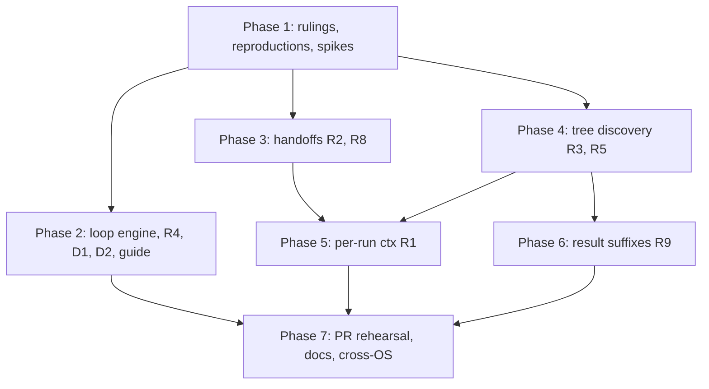

# Plan: lifecycle handoff gaps

## Summary and Success Criteria

### The work

The spec reports eight Claudine findings (F1–F8) and two findings in
neighboring packages (D1 in Darkmatter, D2 in terminal rendering). It also asks
for one new authoring surface (R9: shell result suffixes and lifecycle `set`
execution). All of them are measured against one contract: a document reached
through the active-document coordinator behaves like the same document invoked
directly. The work falls into six technical tracks:

1. **Handoff ownership (F2, F7 → R2, R8).** A proxy raised by a looping
   document's terminal event, or by a sequence task's `start`/terminal event,
   never reaches the owner that must adopt it. Two causes are known.
   `build_loop_iteration_output` (`cli/src/commands/compose/loop_run.rs:73`)
   drops `SingleCompositionOutcome::initialize_handoff`, a field that already
   carries terminal-route handoffs despite its name. And a sequence step takes
   the unowned-handoff route (`route_unowned_handoff`,
   `cli/src/commands/wrap/harness_orch/loop_control.rs`) for every route except
   `initialize`. Underneath both, `RunLedger::approve_hop`
   (`lib/src/composition/coordinator/invocation.rs:382`) adds the target to the
   chain at *approval*, before adoption. That is why F2 reports a phantom cycle.
2. **Outcome propagation (F4 → R4).** An `error` downgrade in `success` routes
   `failure`/`finalize` correctly, but the exit code and the rendered
   diagnostic are lost before they reach the owning command.
3. **Loop engine and loop gate (F6, F8 → R7, R11).** Delete the pre-checked
   `execute_loop`/`execute_loop_with_config`
   (`lib/src/composition/looping/engine.rs:59`, `:95`) and port their tests.
   Give `run_loop_gate` (`:818`) the same ambient `_loop_*` values its
   condition already sees.
4. **Transclusion-tree discovery (F3, F5 → R3, R5).** Two scans stop short of
   the composed tree. The first is `ctx` requirement collection:
   `darkmatter::…::ContextRequirements::for_document` (`context/capture/groups.rs`)
   scans only the root. The second is shell-approval discovery, which
   interpolates a transcluded command without the immediate `proxy.with:`
   overlay. The spec asks whether these two walks can be one. Spike S5 answers
   that.
5. **Per-composition-run context (F1 → R1).** Volatile git working state moves
   from the invocation-lifetime `OnceLock` cells on `RepositoryEntry`
   (`lib/src/invocation_context.rs:306-316`) to a composition-run scope.
   Stable evidence keeps its invocation lifetime. The sequence parallel-group
   rules and the staged-boot `initialize` rules are layered on top.
6. **Shell result suffixes (R9).** Darkmatter learns the `::ok`,
   `::exit-code`, and `::result` suffixes, and its command cache stores the
   whole outcome. DMLS learns the suffixes for completion, hover, and
   diagnostics. Claudine executes whole-value `$(…)` in lifecycle `set`
   mappings, from approved bytes, and commits all destinations atomically.

Around these sit D1 (a literal-only file keeps `{{{ }}}`), D2 (Prose mangles
underscores and leaks `</i>`), R10 (the prompt guide finds this spec by
directory identity, not by a literal path), and R6 (remove the PR-flow
workarounds as each fix lands, then rehearse the flow).

### Packages touched

`claudine` (lib), `claudine-cli`, `darkmatter` (lib), `darkmatter-cli`, `dmls`,
and `biscuit-terminal` (lib). Ruling **N14** adds `biscuit-terminal`, which
the spec's `packages` list does not include.

### Definition of done

- [ ] Every row of the F1 table (`proxy`, `sequence`, `loop`, `retry`,
      `resume`) observes the staged file in run B. The `proxy` row gives the
      same answer whether or not the source mentions the property. `ctx.cwd`
      and `ctx.repo_root` are identical across each hop. Stable identity,
      topology, and host discovery are not repeated.
- [ ] Serial group tasks observe earlier tasks' mutations. Parallel siblings
      share one initial capture but keep their own `ctx.agent`/`ctx.model`. A
      sibling that re-enters captures fresh evidence.
- [ ] A body-only `ctx` property is captured before `initialize`. A property
      first mentioned by an include is captured after `initialize` (the one
      exception). Both are pinned by tests and stated in `composition.md`.
- [ ] A looping source that proxies from `success`, `failure`, or `finalize`
      runs one iteration and adopts the target at its `initialize`, and the
      chain gains exactly one entry. A refused request (resolution, overlay,
      cycle, or hop limit) leaves the chain untouched.
- [ ] A sequence `prompt:` task whose document proxies from `start` or from a
      terminal event runs the target within the step. The step succeeds once,
      and setup, teardown, and output publication each happen once.
- [ ] The five-row F3 matrix approves the executed bytes in every row.
      `NotPreApproved` can no longer be downgraded by `when_error` or
      `no_error`.
- [ ] An `error` in `success` exits non-zero and renders one canonical
      diagnostic. The same holds on a first attempt, after a retry or resume,
      for a sequence step (under both `fail_fast` values), and for a loop
      iteration.
- [ ] `ctx` properties mentioned only in a partial (including a partial two
      levels deep, and one named by an interpolated `::file`) render the same
      under `claudine compose` as under `md compose`.
- [ ] `claudine::composition` exports one loop entry point. A workspace
      search for `execute_loop` finds only `execute_loop_with_lifecycle`. The
      F6 table passes as a characterization test.
- [ ] The `loop:` block's notification fields and stack read every `_loop_*`
      value. The `lifecycle.md` loop example runs as written.
- [ ] `::ok`, `::exit-code`, and `::result` work on every `$()` shape, in
      top-level frontmatter and in lifecycle `set`. They are typed, validated
      by `$schema` after expansion, cached as whole outcomes, and approved
      under their bare command bytes. DMLS lists all five suffixes.
- [ ] A literal-only file converts `{{{ x }}}` to `{{ x }}` in all four
      routes (`md compose`/`claudine compose` × direct/transcluded).
- [ ] The D2 description, and the F8 diagnostic's `_loop_count`, render
      exactly as authored after stripping terminal styling.
- [ ] `prompts/_prompt.md` resolves this spec by directory identity. It
      reports a missing or ambiguous lookup, and each finding's warning
      disappears when (and only when) its id is in `fixed:`. The F6 and D2
      warnings are added or explicitly justified.
- [ ] Every workaround in the R6 table is removed, and the PR flow completes
      every listed route against a stub provider. `shipped_prompt_contract` is
      green.
- [ ] `fixed:` lists F1–F8, D1, and D2. Each id was added in the change that
      landed its requirement.
- [ ] The Phase 1 performance budgets hold on macOS, Linux, native Windows,
      and WSL2, recorded in `implementation-log.md` with host, sample count,
      and variance.
- [ ] `just test`, `just test-l2`, and `just lint` are green in `claudine/`,
      `darkmatter/`, and `biscuit-terminal/`.
- [ ] Every `docs/` page and skill file listed in Phase 7 describes the new
      behavior. No `docs/` page names this fix.

---

## Phase 1 — Rulings, Reproductions, and Spikes

The goal is to lock the design points the spec leaves to implementation,
reproduce every finding as a red test on today's code, and measure the context
cost before any capture code changes. The spec explicitly requires that
measurement ("Spike Before Planning"). Because this plan is being written
before the spike ran, the spike runs here as a gate for Phases 4 and 5.

### Necessary Rules

These rulings are proposed by the planner. The spec leaves each point open, and
each is needed before implementation can proceed with confidence. The author
should confirm or overrule them before the phase that depends on them starts.
Under `yolo: true`, implementation proceeds on the stated default.

- [ ] **N1 — The ledger records commits, not approvals (R2).** Split
      `RunLedger::approve_hop` into two steps. `check_hop(&self, target) ->
      Result<HopApproval, HopRejection>` is pure: it checks the hop budget and
      cycles and does not mutate. `commit_hop(&mut self, approval)` pushes to
      the chain. The coordinator that adopts the target calls `commit_hop`
      under the same ledger lock, immediately before `adopt`, so no
      observable state exists in which a hop is committed but not adopted, or
      adopted but not committed. Every current caller of `approve_hop`
      migrates; no compatibility shim remains. An adopted target that later
      fails stays in the chain (spec R2).
- [ ] **N2 — One handoff field for every route.**
      `SingleCompositionOutcome::initialize_handoff`
      (`cli/src/commands/wrap/composition/mod.rs:141`) already carries
      terminal-recovery and target-initialize-chain handoffs (see its own doc
      comment and `harness_orch/loop_control.rs:1192`). Rename it to
      `handoff`, and correct the doc comment in the same change. Both owners
      (the loop builder in `loop_run.rs` and the sequence step in
      `sequence/iterate.rs:360`) consume that single field. No
      route-specific second field is added.
- [ ] **N3 — Ownership is a property of the request, not of the route
      (R8).** A sequence task's composition request always carries an owning
      handoff ledger, so `start`, `success`, `failure`, and `finalize`
      proxies surface to `run_step_proxy_loop` the same way `initialize`
      already does. Spike S3 locates where ownership is dropped for
      non-`initialize` routes. Direct provider wrappers still carry no ledger
      and still refuse with `LifecycleProxyWithoutOwningCoordinator`.
- [ ] **N4 — Chains are per task, not per step (R8).** Each task owns its
      handoff ledger. A serial step has one task, so its chain is the step's
      chain. Parallel siblings each get their own ledger, so two siblings may
      adopt the same target. Cycle and hop checks apply within each chain.
      Today's per-step `step_ledger` (`sequence/iterate.rs:344`) moves to per
      task.
- [ ] **N5 — A downgrade uses the `start`-error outcome (R4).** An
      unrecovered `error` downgrade in `success` produces the same exit code
      and the same effective-diagnostic render path as the same `error` raised
      from `start` (exit `1`, one `Error:` block, and `err.*` and machine
      output projecting the same diagnostic). In a loop, the downgraded
      iteration becomes `LoopIterationFailed` carrying the lifecycle error's
      snapshot (`snapshot: Some(..)`, not `None`), so the loop's existing
      failure policy applies. A successful retry, resume, or proxy recovery
      clears the pending downgrade.
- [ ] **N6 — Context requirements are collected by Darkmatter (R5).**
      Claudine does not hand-roll a transclusion walk. Darkmatter gains a
      tree-level requirement collector (working name
      `ContextRequirements::for_tree`) that follows the composition parser's
      executable-span rules, include conditions, per-file overrides,
      file-resolution policy, and cycle and depth limits. It executes nothing.
      This keeps faith with `2026-09-17-remove-strict-mode` R5 ("remove
      duplicate expression traversal"). The same change replaces
      `for_document`'s `serde_json::to_string(..).unwrap_or_default()`: a
      serialization failure is an error, never an empty requirement set.
- [ ] **N7 — One discovery walk if S5 allows it (R3, R5).** Default: the
      walk that discovers a target's shell surface also yields its `ctx`
      requirements, and it interpolates against the target's full effective
      state (defaults, inherited state, immediate `with:` overlay, caller
      overrides, reserved sequence inputs, transclusion-local `set.*`) through
      the execution resolver. If S5 shows that merging the walks would couple
      stages that must run at different times (the pre-`initialize` root scan
      vs. the post-`initialize` tree), keep two walks that share one resolver
      and one base-directory rule, and record why in the implementation log.
- [ ] **N8 — The volatile set (R1).** The volatile evidence groups are
      `file_changes` (backing `staged_files`, `dirty_files`, and the rest of
      the change keys) and the HEAD-derived facts: `branch`, `worktree`, and
      `recent_commits`. `recent_commits` is included because the motivating PR
      flow commits between runs (`commit.md`), and the spec's rule "a stage
      can create a branch" applies equally to a commit. The source-scanned
      `languages` and `documents` groups keep their invocation lifetime, and
      `composition.md` says so explicitly. **Author to confirm**: this is the
      one place the plan widens the spec's named list (`recent_commits`) and
      draws a line the spec does not draw (`languages`, `documents`).
- [ ] **N9 — Mechanism for per-run evidence (R1).** Introduce a per-run
      volatile scope (working name `RunEvidence`), created by whichever owner
      starts a composition run: the compose coordinator on adopt, the
      sequence iterator per task (or per parallel group), the loop engine per
      iteration, and the retry/resume re-entry. The run's `ComposeContext`
      reads volatile groups from it, and stable groups still come from the
      invocation-scoped `RepositoryEntry`. The `OnceLock` cells for volatile
      groups leave `RepositoryEntry`. Within one run, extension (the
      post-`initialize` reread, or the include exception) fills empty cells of
      the same `RunEvidence` and never replaces a filled one.
- [ ] **N10 — Parallel groups (R1).** Before any sibling starts, the
      sequence iterator unions the requirements of every task the group
      launches (N6 applied to each task's root page, plus its tree where
      discoverable pre-`initialize`) and captures one `RunEvidence`. Each
      sibling's first run gets a clone of it, layered under its own resolved
      provider identity. A sibling's retry, resume, proxy, or next loop
      iteration creates a fresh `RunEvidence`.
- [ ] **N11 — Result suffix semantics (R9).** Darkmatter's command cache
      entry becomes a whole outcome, working name `ShellOutcome { status:
      ShellStatus, stdout, stderr }`, where `ShellStatus` is `Exited(i32)`,
      `TimedOut`, `Signaled`, or `Interrupted`. The entry is keyed on the
      approved command bytes plus the execution context (CWD and effective
      environment) plus the effective timeout. Concurrent identical requests
      share one execution through a per-key once-cell. The suffix is parsed
      off the value and is never part of the approved bytes. **Duplicate
      suffixes of any kind** (including `::timeout:5::timeout:9` and
      `::no-cache::no-cache`) are a parse error. This extends the spec's "at
      most one result suffix", so that no suffix is last-wins.
- [ ] **N12 — Lifecycle `set` executes through Darkmatter (R9).** Claudine
      does not spawn the command itself. It calls Darkmatter's frontmatter
      shell executor with the preflight-approved bytes, a fresh per-assignment
      cache scope, and the suffix. Only a whole-value `$(…)` executes. A
      mixed value (`"sha is $(cmd)"`) keeps today's behavior and is stored as
      data. This is documented, not rejected, because rejecting it is new
      scope. Nested objects and arrays are not scanned for shells.
- [ ] **N13 — The guide fails safe (R10).** `prompts/_prompt.md` resolves
      the spec by directory identity through the existing file-resolution
      facilities. Spike S6 picks the concrete form. When the lookup is
      missing or ambiguous, or `fixed:`/`status:` has a shape other than those
      in the R10 robustness matrix, the guide renders a visible notice and
      **every** warning. An unreadable list never hides a warning.
- [ ] **N14 — D2 is fixed in `biscuit-terminal`'s `Prose`, and at every
      interpolation site (R13).** Two defects combine. First, Prose's
      underscore emphasis does not follow CommonMark flanking rules and does
      not treat code spans as opaque. Second, callers such as
      `cli/src/commands/wrap/composition/dry_run.rs:252`
      (`Prose::new(format!("<i><dim>{description}</dim></i>"))`) splice author
      text into markup, so a stray emphasis toggle unbalances the tags and
      leaks `</i>`. Fix the Prose parser. Add (or reuse, if S4 finds one) a
      Prose escaping helper for author text spliced into markup, and use it
      at every site S4 finds. Add `biscuit-terminal` to the spec's
      `packages`.
- [ ] **N15 — Sequencing against `2026-09-17-remove-strict-mode`.** That
      plan has not started (`phase: 1`). This fix lands first. The F8 fix
      supplies the missing bindings rather than relaxing strictness, so it
      survives that spec's work. The N6 tree collector lives in Darkmatter,
      where that spec's binding environment can consume it. Record the
      handoff in this fix's implementation log. Do not edit the other spec.
- [ ] **N16 — Test tiers.** Every deterministic behavior (documents, exit
      status, chains, approvals, typed values, text conversion) is L1:
      library tests, or `claudine` CLI tests through `CliProcessFixture` with
      a stub provider. The D2 header additionally gets one L2 real-terminal
      capture with no focus change. No L3 test is needed, because no
      requirement involves a physical keypress. New `claudine-cli` test files
      are declared in `tests/l1/main.rs` or `tests/level2/main.rs`.
- [ ] **N17 — `fixed:` is updated in the landing change.** Each phase that
      lands a requirement appends its finding id in the same change: F1 (R1),
      F2 (R2), F3 (R3), F4 (R4), F5 (R5), F6 (R7), F7 (R8), F8 (R11), D1
      (R12), D2 (R13). R9 has no finding id. The spec's `status` moves to
      `planned` when this plan is accepted and to `implemented` at the end of
      Phase 7. An agent never moves the spec to `_completed`.

### Wave 1 — Reproductions and spikes (all parallel)

Each reproduction is a red test left in place (not `#[ignore]`d) for the phase
that turns it green. Record each red output under "Reproduction record" in
`implementation-log.md`. Use isolated fixtures, not this checkout: private git
repositories under the fixture workspace, a stub `claude` from the fixture
`bin`, and silent audio (`PLAYA_DRY_RUN=1`, private spool).

- [ ] **Create implementation log**
    - Create `claudine/fixes/2026-09-20-lifecycle-handoff-gaps/implementation-log.md`
      with sections: Reproduction record, Spike results, Budgets, Departures
      from spec, Changed expectations, Cross-OS evidence.
- [ ] **Reproduce F1 (R1)**
    - Add a table-driven L1 CLI test (working file
      `cli/tests/l1/ctx_per_run.rs`) with one row per vehicle: `proxy`,
      `sequence`, `loop`, `retry`, `resume`. Each row runs run A, stages a
      file from the vehicle's own lifecycle or shell step, then runs run B,
      and asserts run B's `length(ctx.staged_files)` is `1`.
    - Add the first-mention row: the `proxy` case with and without the
      source mentioning `ctx.staged_files`. It asserts equal values (red
      today: `0` vs `1`).
    - Add the transclusion control: a partial shares its parent's value when
      the parent also mentions the property. That keeps F5 out of the row, so
      it is expected green today.
- [ ] **Reproduce F2 (R2)**
    - A library or L1 CLI test with a looping source that proxies from
      `success`. Assert one iteration, target `initialize` fired, and a
      chain of exactly two entries. Add `failure` and `finalize` rows.
    - Add a ledger unit test proving a refused hop leaves the chain unchanged.
      It is red today because `approve_hop` pushes before adoption.
- [ ] **Reproduce F3 (R3)**
    - A table-driven L1 test of the five F3 rows. Each row records the
      approval set and the executed command bytes, and asserts
      `executed ⊆ approved`. Row 4 is red.
- [ ] **Reproduce F4 (R4)**
    - Add an L1 row beside
      `level2_lifecycle_success_stack_error_downgrades_keeps_success_comm`
      (`cli/tests/level2/level2_lifecycle_dispatch.rs:532`) that asserts a
      non-zero exit and exactly one rendered `Error:` block. Keep the
      existing L2 event-order assertion unchanged.
- [ ] **Reproduce F5 (R5)**
    - The F5 table as an L1 test comparing `claudine compose --dry-run` output
      with `md compose` output for the same tree.
- [ ] **Reproduce F7 (R8)**
    - A two-step sequence whose first task's document proxies from `start`.
      Assert the target ran, step 1 succeeded once, and step 2 ran.
- [ ] **Reproduce F8 (R11)**
    - The F8 document as an L1 test asserting the gate message renders the
      iteration number on every pass, including the pass that ends the loop.
- [ ] **Reproduce D1 (R12)**
    - Four rows: `md compose` and `claudine compose`, each direct and
      transcluded, on a literal-only file, all expecting `{{ expr }}`.
- [ ] **Reproduce D2 (R13)**
    - A rendering test for the D2 description asserting the exact text after
      stripping styling, at a narrow width and with `NO_COLOR=1`. Add one for
      the F8 diagnostic's `_loop_count`.
- [ ] **S1 — Context cost baseline (spec "Spike Before Planning")**
    - Build the five workloads as fixtures: (1) a 10-iteration loop reading
      `ctx.dirty_files`; (2) a 5-hop proxy chain where each page reads a
      git-state property; (3) a 10-step sequence with a parallel group of 4;
      (4) a run with no git-state property; (5) a prompt transcluding ten
      partials.
    - Measure each with `--perf`, the sequence performance integration
      tests, and the invocation work counters (`launch_context_constructions`,
      sniff request counters). Take repeated warm and cold runs on macOS,
      Linux, native Windows, and WSL2. Load the `os` skill for host access.
    - Record host, sample count, mean, and variance per workload.
    - Derive the budgets Phases 4 and 5 must meet. Either "within noise on
      every host", or a named budget per workload (for example, "a
      composition run's volatile capture stays under N ms on WSL2"). Workload
      4 must show zero additional git-state requests after the change.
- [ ] **S2 — F3 root cause**
    - Trace which state discovery (`lib/src/composition/preflight.rs` and the
      proxy target preparation paths) uses when it interpolates a transcluded
      `::shell-block`, versus what execution uses. Confirm or refute the
      spec's lead: the immediate overlay is missing from discovery of the
      transclusion graph.
    - Identify where `NotPreApproved` is downgraded to a warning under
      `when_error` (Darkmatter `shell_expansion/mod.rs`, `preflight/collect.rs`).
- [ ] **S3 — Handoff ownership map**
    - For `compose`, `inline-compose`, a loop iteration, and a sequence task,
      map for each route (`initialize`, `start`, `success`, `failure`,
      `finalize`) where the proxy request is approved, committed, adopted, or
      refused. Name the exact branch that sends a sequence task's `start`
      proxy to `route_unowned_handoff`.
- [ ] **S4 — F4 loss point, and D2 site sweep**
    - F4: trace the downgrade from the lifecycle executor through
      `harness_orch/loop_control.rs` to `SingleCompositionOutcome` and the
      command's exit. Name the line where the verdict is overwritten or
      dropped.
    - D2: find every site that interpolates author text (descriptions, names,
      diagnostic identifiers) into `Prose` markup. Start with `rg
      'Prose::new\(format!'` across `claudine/`, `darkmatter/`, and
      `biscuit-terminal/`. Determine whether Prose already has an escape
      helper.
- [ ] **S5 — One walk or two**
    - Compare the shell-discovery walk with what `ContextRequirements` needs.
      Decide N7 based on staging (the pre-`initialize` root scan vs. the
      post-`initialize` tree) and on the resolver each needs. Record the
      decision.
- [ ] **S6 — Guide lookup form**
    - Determine which existing Darkmatter facility (a file-reference form,
      `file(match)`, a glob function, or `FileReference`) can resolve
      `**/fixes/**/2026-09-20-lifecycle-handoff-gaps/spec.md` from
      `prompts/_prompt.md`, and report zero or several matches as an error.
      Determine which type predicates exist to validate `fixed:` and
      `status:` shapes (see the R10 matrix). Add a new Darkmatter function
      only if none suffices, and record why.

### Wave 2 — Rulings closure

- [ ] Amend N1–N17 with the spike findings (as the sibling fix did, with
      "Confirmed by S*" or "Amended in Phase 1" notes).
- [ ] Record the S1 budgets under "Budgets" in the implementation log.
- [ ] Set the spec's `status: planned`.

### Phase 1 validation checkpoint

- [ ] Every reproduction test exists, compiles on all targets, and fails for
      the reported reason (not for a fixture error).
- [ ] S1 has numbers from all four hosts, or a recorded reason why a host
      could not produce them and when it will.
- [ ] `just lint` is green in `claudine/`.

---

## Phase 2 — Independent Repairs: Loop Engine, Outcome, Rendering, Guide

These repairs share no files with the handoff, discovery, or context tracks.
They land first because they are small, and because R10 makes every later
`fixed:` update visible to prompt authors.

### Wave 3 — Four parallel tracks

Agents in this wave must not edit the same files. Track A owns
`looping/engine.rs` and its tests. Track B owns `harness_orch/loop_control*`
and `loop_run.rs`'s failure branch. Track C owns Darkmatter literal conversion,
`biscuit-terminal` Prose, and the D2 sites. Track D owns `prompts/_prompt.md`.

- [ ] **Track A — One loop engine (R7, F6)**
    - Add the F6 table as a table-driven characterization test against
      `execute_loop_with_lifecycle`. Assert iteration count and the `n` each
      body observes, for all four rows. It must pass before the deletion.
    - Delete `execute_loop` and `execute_loop_with_config`. Remove them from
      `lib/src/composition/mod.rs:112-113`. Delete `compute_is_last` (`:1122`)
      and any other helper only they use; confirm each with a workspace
      search before removing it.
    - Port `looping/engine/tests/iteration_actions.rs` (15 mentions),
      `rate_limits.rs` (7), and `seed_state.rs` (3) to
      `execute_loop_with_lifecycle`. Re-derive every iteration count from the
      F6 rule. Do not edit an assertion until it passes. List each changed
      count, with its derivation, in "Changed expectations".
    - Reword the doc comment in `cli/src/commands/compose/loop_run.rs` that
      links to `execute_loop`.
    - Remove the "Implementation note" from `docs/topics/flow-control/looping.md`.
- [ ] **Track A (continued, sequential after R7) — Loop gate ambient (R11, F8)**
    - Pass `run_loop_gate`'s `ambient` into the `StackExecutionContext` used
      for the `loop:` block's notification fields and stack, so they resolve
      `_loop_count`, `_loop_is_first`, `_loop_is_last`, `_loop_last_output`,
      and `_loop_last_exit_code` with the just-finished iteration's values.
    - Turn the F8 reproduction green, including the pass that ends the loop.
    - Add the `lifecycle.md` loop example verbatim as an L1 fixture that runs
      as written.
- [ ] **Track B — Downgrade reaches the outcome (R4, F4)**
    - Apply the S4 finding: carry the lifecycle verdict to
      `SingleCompositionOutcome.exit_code` and the effective diagnostic (N5).
      Render through the existing effective-diagnostic selection
      (`docs/topics/error-architecture.md`).
    - Loop: the failure branch of `build_loop_iteration_output` carries the
      lifecycle error snapshot for a downgraded iteration (N5).
    - Tests (L1): a first attempt, a retried attempt that fails again, a
      retried attempt that succeeds (exit `0`, no stale error), a resumed
      attempt, a `sequence` step under `fail_fast: true` and `false`, and a
      loop iteration. Each asserts exit status, exactly one rendered `Error:`
      block, preserved author `warn` lines, and unchanged event order.
    - Remove the `prompts/_pr/fix.md` `warn` that duplicates the exhaustion
      `error` (R6 row 5).
- [ ] **Track C1 — Literals convert in every file (R12, D1)**
    - In Darkmatter, find the pass that skips literal conversion when a file
      has no real span. Start at `convert_authored_literals`
      (`compose/frontmatter_interpolation.rs:411`) and the body-interpolation
      equivalent. Make conversion unconditional per file, including
      transcluded files.
    - Turn the four D1 rows green. Keep the "file with a real span and a
      literal" control green.
    - Remove the artificial real span from `prompts/_prompt.md`, together
      with its explanatory comment.
- [ ] **Track C2 — Author text renders as written (R13, D2)**
    - Fix `Prose`'s emphasis parsing in `biscuit-terminal` (N14):
      underscores follow CommonMark left- and right-flanking rules,
      intraword underscores are literal, and code spans are opaque.
    - Add or reuse a Prose escape helper, and apply it at every S4 site,
      starting with `dry_run.rs:252`.
    - Turn the D2 reproductions green (header description and the F8
      diagnostic). Add the L2 real-terminal header capture (N16), which must
      not steal focus.
    - Add `biscuit-terminal` unit tests for the parser rules. Update
      `biscuit-terminal/docs/components/prose.md` if it documents emphasis
      or escaping.
- [ ] **Track D — The guide reads this spec by identity (R10)**
    - Replace `defects_spec: "&claudine/fixes/2026-09-20-lifecycle-handoff-gaps/spec.md"`
      (`prompts/_prompt.md:24`) with the S6 lookup form.
    - Implement the N13 fail-safe for a missing or ambiguous lookup, a
      `status: completed` spec (section hidden), and every shape in the R10
      robustness matrix below.
    - Add warnings for F6 (loop timing: documentation previously described a
      pre-checked loop) and D2 (author text in headers and diagnostics may
      render wrong), or document in the guide why a finding does not affect
      prompt authoring.
    - L1 test: compose a prompt that transcludes the guide against temporary
      copies of the spec (never edit this spec's own `fixed:` for a test).
      Cover `fixed: []`, one id listed (only that warning disappears), a
      relocated copy under `_completed/`, `status: completed`, a missing
      lookup, an ambiguous lookup, and every matrix cell.

### Wave 4 — Record and validate

- [ ] Append `F4`, `F6`, `F8`, `D1`, and `D2` to the spec's `fixed:` (N17).
- [ ] Run `just test` and `just lint` in `claudine/`, `darkmatter/`, and
      `biscuit-terminal/`, and `just test-l2` in `claudine/`.
- [ ] Workspace search: `rg 'execute_loop\b|execute_loop_with_config'` finds
      nothing.

### Phase 2 validation checkpoint

- [ ] The F4, F6, F8, D1, and D2 reproductions are green. The guide test
      proves that each newly fixed id's warning (and only that one) is gone.

---

## Phase 3 — Handoffs Reach Their Owners

### Wave 5 — Ledger invariant (sequential; everything else depends on it)

- [ ] **Commit, not approve (N1)**
    - Split `RunLedger::approve_hop` into `check_hop` and `commit_hop`.
      Migrate every caller (`rg 'approve_hop'`), including
      `commit_initialize_proxy` (`composition/pipeline.rs`),
      `commit_proxy_in_context` (`compose/prep.rs:333`), and the harness
      coordinator.
    - Unit tests: a refused resolution, a refused overlay evaluation, a cycle,
      and the hop limit each leave the chain unchanged. One commit adds
      exactly one entry. An adopted target that fails `initialize` stays
      recorded.
    - Rename `initialize_handoff` to `handoff` (N2), and fix its doc comment
      and every consumer's comment in the same change.

### Wave 6 — Two owners (parallel)

- [ ] **Loop owner (R2, F2)**
    - `build_loop_iteration_output` copies `outcome.handoff` onto the
      `LoopIterationOutput` via `with_handoff`, in both branches.
    - Confirm that the engine's existing handoff branch
      (`execute_loop_with_lifecycle`) returns the handoff without running the
      gate, and that the compose coordinator adopts the target at its
      `initialize`.
    - `success`/`failure` sources skip the source's ordinary `finalize`. A
      `finalize` source does not run `finalize` again.
    - Turn the F2 reproductions green for `success`, `failure`, and
      `finalize`, and keep `loop_initialize_proxy_hands_off_without_iterating`
      green.
- [ ] **Sequence owner (R8, F7)**
    - Apply N3 at the S3 site, so that every route surfaces to
      `run_step_proxy_loop`.
    - Apply N4: the handoff ledger is created per task, and parallel siblings
      get independent chains.
    - Preserve task inputs, task identity, timing, output attribution,
      budget accounting, and once-only setup, teardown, and output
      publication. The step result is the final target's result.
    - Tests (L1): the F7 reproduction; a terminal-event proxy from a task; a
      target that fails, under `fail_fast: true` and `false` (teardown and
      publication happen once); two parallel siblings adopting the same
      target; a cycle within one sibling's chain; and a direct provider
      wrapper that still refuses.

### Wave 7 — Record and validate

- [ ] Re-evaluate R6 row 4 (`prompts/_pr/fix.md` bounded `retry: 2` plus the
      `fix_attempts` counter vs. a `loop:`). Keep `retry` unless a `loop:`
      reads clearly better now that terminal proxies work, and record the
      decision in the implementation log.
- [ ] Append `F2` and `F7` to `fixed:`.
- [ ] Run `just test`, `just test-l2`, and `just lint` in `claudine/`.

### Phase 3 validation checkpoint

- [ ] The F2 and F7 reproductions and all ledger-invariant tests are green.
      The chain never contains an unadopted target, which is proven by a test
      that attempts a refused hop and then a legitimate one.

---

## Phase 4 — Transclusion-Tree Discovery

Depends on Phase 1 (S2, S5, and the S1 budgets). Tracks R3 and R5 converge on
one walk (N7), so they share a phase.

### Wave 8 — Darkmatter collector (sequential)

- [ ] **Tree requirements (N6)**
    - Add the tree-level `ContextRequirements` collector in Darkmatter. It
      follows `::file` (including an interpolated reference, resolved in
      stages from already captured requirements), respects include
      conditions, per-file overrides, file-resolution policy, and cycle and
      depth limits, skips fenced examples, interpolation literals, and raw
      `::code` inclusions, and scans included frontmatter and lifecycle
      expressions. It executes no shell and no side effect.
    - When staged expansion cannot finish safely, return a source-attributed
      preparation error. Never return an empty set.
    - Replace the `unwrap_or_default()` in `for_document` (N6).
    - Darkmatter unit tests for each rule above, plus a cycle and a depth
      overflow.

### Wave 9 — Claudine discovery (parallel after Wave 8)

- [ ] **R5 — use the tree collector (F5)**
    - Claudine's composition preparation requests the tree requirements for
      a run's post-`initialize` tree. Before `initialize`, only the root is
      scanned (R1 staged rule, Phase 5).
    - Turn the F5 reproduction green, and add the two-levels-deep row and the
      interpolated `::file` row. Claudine's output equals `md compose`'s
      output for the same tree.
- [ ] **R3 — discovery uses the execution state (F3)**
    - Apply the S2 root cause. Discovery of a proxy target's transclusion
      graph uses the same resolver, the same effective state (the precedence
      list in N7), and the same source-relative base directory as execution.
      Untaken branches are discovered without executing. A fresh target still
      receives its full audit, and a reused approval never authorizes changed
      bytes.
    - `NotPreApproved` becomes non-suppressible: neither `when_error` nor
      lifecycle `no_error` turns it into a warning or into missing data.
      Ordinary command failures keep their recovery behavior.
    - Turn the F3 five-row matrix green, and add rows for a nested partial, a
      conditional partial, transclusion-local `set.*`, and an untaken branch.
    - Update `docs/topics/pre-flight-checks.md` if it describes discovery
      state.

### Wave 10 — Shared walk, workarounds, and budget

- [ ] If N7 chose one walk, fold shell discovery and requirement collection
      into it now, and confirm that both Wave 9 test sets stay green.
- [ ] R6: extract the facts `::shell-block`s from `prompts/_pr/push.md` into a
      shared `prompts/_pr/_facts.md` partial (R6 row 3).
- [ ] Re-run S1 workload 5 on all four hosts, and compare against its budget.
- [ ] Append `F3` and `F5` to `fixed:`.
- [ ] Run `just test` and `just lint` in `darkmatter/` and `claudine/`, and
      `just test-l2` in `claudine/`.

### Phase 4 validation checkpoint

- [ ] F3 and F5 are green, `shipped_prompt_contract` is green with
      `_facts.md`, and workload 5 is within budget on every host.

---

## Phase 5 — `ctx` Is Evaluated Once per Composition Run

Depends on Phase 3 (handoff owners are the run boundaries) and Phase 4 (tree
requirements).

### Wave 11 — Evidence lifetime split (sequential)

- [ ] **Per-run volatile evidence (N8, N9)**
    - Move the volatile `OnceLock` cells (`file_changes` at
      `invocation_context.rs:314`, and the HEAD-derived facts behind
      `branch`, `worktree`, and `recent_commits`) out of `RepositoryEntry`
      into `RunEvidence`. `project_evidence` (`:1177`) reads volatile groups
      from the run scope and stable groups from the invocation scope.
    - Only groups a run requests are observed ("found on the page"
      unchanged).
    - Split the work counters so volatile observations are counted separately
      from stable discovery.
    - Library tests: stable identity, topology, host, and environment are
      discovered once per invocation. A volatile group is observed at most
      once per requesting run. First mention has no effect on a later run's
      value.

### Wave 12 — Run boundaries (parallel after Wave 11)

- [ ] **Compose coordinator and retry/resume**
    - A fresh `RunEvidence` on each adopt (proxy) and on each retry and resume
      re-entry, alongside the existing canonical fresh read.
- [ ] **Loop engine**
    - A fresh `RunEvidence` per iteration.
- [ ] **Sequence iterator**
    - A fresh `RunEvidence` per serial task. For a parallel group, one shared
      capture from the union of its tasks' requirements (N10), layered under
      each sibling's own provider identity. Re-entry within a sibling creates
      a fresh scope.
- [ ] **Staged boot**
    - Before `initialize`, scan the root document's text (frontmatter,
      lifecycle blocks, and body) for `ctx` mentions and capture those groups
      into the run's `RunEvidence`. The scan composes nothing, follows no
      `::file`, and runs no shell.
    - After `initialize`, extend from the tree requirements (Phase 4) without
      replacing filled cells. An include that is the first to mention a
      volatile group captures it on first demand (the one exception), and it
      is held for the rest of the run.

### Wave 13 — Tests, workarounds, and budget

- [ ] Turn every F1 reproduction row green (`proxy` both ways, `sequence`,
      `loop`, `retry`, `resume`), with `ctx.cwd` and `ctx.repo_root`
      identical across each hop.
- [ ] Add rows: a serial group observes earlier tasks; parallel siblings
      share evidence but not `ctx.agent`/`ctx.model`/`env.AGENT`/`env.MODEL`;
      a sibling's retry sees its siblings' changes; a branch change between
      runs; a body-only property captured before `initialize`; the include
      exception captured after it; a transcluded partial shares its parent's
      value; one prepared-context construction per new run.
- [ ] Add a test that `current` is stable within one event and fresh in the
      next (pins today's behavior, which R1 documents).
- [ ] R6: remove the stale staged-file text passed through `message` in
      `prompts/_pr/dirty.md` and `prompts/_pr/fix.md`. Replace
      `prompts/_pr/push.md`'s working-state `::shell-block` with
      `ctx.dirty_files`, and drop the second half of its explanatory comment.
      Leave `commit.md`'s `current.ctx.staged_files` gate unchanged.
- [ ] Re-run S1 workloads 1–4 on all four hosts against their budgets.
      Workload 4 shows zero additional git-state requests.
- [ ] Append `F1` to `fixed:`.
- [ ] Run `just test`, `just test-l2`, and `just lint` in `claudine/`.

### Phase 5 validation checkpoint

- [ ] F1 is green on every row, the budgets hold, and the parallel and
      staged-boot rows are green.

---

## Phase 6 — Shell Result Suffixes and Lifecycle `set` (R9)

Independent of Phases 3–5 in code, but it touches the shell-approval paths
that Phase 4 changed, so it follows Phase 4. It may run in parallel with
Phase 5 if staffing allows, because the two phases share no files.

### Wave 14 — Darkmatter grammar and outcome (sequential)

- [ ] **Suffix grammar**
    - Extend `FrontmatterShellSuffix`
      (`darkmatter/lib/src/markdown/compose/frontmatter_shell_expansion.rs:57`)
      with `Ok`, `ExitCode`, and `Result`. There is at most one result suffix,
      and no duplicate of any suffix (N11). Suffixes combine with `::timeout`
      and `::no-cache` in any order. The unrecognized-suffix error lists all
      five.
- [ ] **Whole outcome and cache (N11)**
    - Implement `ShellOutcome`, re-key the per-compose cache on bytes,
      context, and timeout, add once-cell sharing for concurrent identical
      requests, and make `::no-cache` bypass reads and writes. An unsuffixed
      reader of a cached non-zero outcome still fails.
- [ ] **Shapes**
    - Single command, `&&`/`||` chains (the last executed status; the streams
      of every executed command, joined as unsuffixed stdout joins today), and
      ternaries selecting a command, a chain, or a literal (`code 0`, `stdout`
      is the literal's text). A raising condition, a signal, and a user
      interruption are never values.
    - Timeouts fail unless `--allow-shell-timeout` is set, in which case the
      values are `false`, `null`, and `{ok: false, code: null, …}`.
    - Missing, blacklisted, and denied commands fail exactly as today.
- [ ] **Typed values and `$schema`**
    - Whole-value typing: `::ok` is a boolean, `::exit-code` is a number or
      null, and `::result` is an object with dotted access. Validate against
      `$schema` after expansion, including a type-mismatch test.
- [ ] **Darkmatter tests**
    - The R9 verification table: each suffix × {exit 0, non-zero, timeout
      with and without allow}; the two-result-suffix parse error; one row per
      shape; a suffix with `::timeout` and `::no-cache` in both orders;
      `$(cmd)` plus `$(cmd)::result` executes once; concurrent identical
      requests execute once.
    - The R9 robustness matrix below, walked by one test from a real fixture
      with one edit per cell plus a control row.
    - Keep tests portable: use portable exit-code and timeout helpers from
      the test toolkit, not POSIX-only commands.

### Wave 15 — Consumers (parallel after Wave 14)

- [ ] **DMLS**
    - Completion, hover, and the unrecognized-suffix diagnostic for all five
      suffixes (`darkmatter/dmls/src/overlay/expressions.rs` and its
      neighbors). Update the DMLS tests.
- [ ] **Claudine lifecycle `set` (N12)**
    - Preflight discovers whole-value `$(…)` in mapping `set` values, resolves
      its arguments from early-binding values, and approves the bare bytes
      (suffix excluded).
    - At execution time (after the guard passes, never during preflight or a
      lifecycle-free dry run), call Darkmatter's executor with the approved
      bytes and a fresh per-assignment cache scope. Read all values against
      pre-write state, and commit every destination only if every value
      succeeds. Never re-interpolate against later runtime writes.
    - Reject shell-bearing assignments in `initialize`, including in dead
      branches and catches. Keep the runtime prohibition on early
      blocked, failure, and finalize routes. A `set` in `start` is legal even
      when the document has `initialize`.
    - L1 tests: a `start` `set` gates its next item on the value; the command
      is approved in preflight under its bare text; the same assignment in
      `initialize` is rejected; typed `::result` exposes `ok`, `code`,
      `stdout`, and `stderr` to a later `when:`; a failed mapping leaves
      every destination unchanged; a false guard and a dry run execute
      nothing; `start` and `success` each execute the command (a fresh
      result); approved bytes are unchanged after an intervening runtime
      `set`; missing, denied, blacklisted, cancelled, and timed-out commands
      each follow policy.

### Wave 16 — Docs and validation

- [ ] Update `darkmatter/docs/inline/fm-shell-expansion.md` (suffix table,
      shapes, cache, timeouts, what is never a value) and the DMLS docs.
- [ ] Update `claudine/docs/topics/flow-control/lifecycle.md` (lifecycle
      `set` executes whole-value shells; the approval and result lifetimes;
      external effects cannot be rolled back; `capture:` is deferred).
- [ ] Run `just test` and `just lint` in `darkmatter/` (lib, cli, and dmls)
      and in `claudine/`.

### Phase 6 validation checkpoint

- [ ] Every R9 verification row is green, and the R9 robustness matrix test
      passes, including its control row.

---

## Phase 7 — PR Flow Rehearsal, Documentation, and Cross-OS Closure

### Wave 17 — Rehearsal and docs (parallel)

- [ ] **PR flow rehearsal (R6)**
    - Against a stub provider and a disposable local repository with a local
      bare remote (no real push or network), drive every route: a clean tree;
      a dirty tree with `uncommitted=commit`, with `uncommitted=abort`, and
      with no answer and no TTY; starting on the base branch; a blocked push
      under `on_failure=ask`, `fix`, and `stop`; a fix that verifies on a
      later attempt; and a fix that never verifies.
      `shipped_prompt_contract` is green.
- [ ] **Docs (drift maintenance)**
    - `claudine/docs/topics/composition.md`: state the per-composition-run
      rule once, in the same words, in "Launch-Anchored Prepared Context" and
      the "Binding time" table. Cover the volatile/stable split (N8), the
      parallel-group rule, the pre-`initialize` root scan, and the include
      exception. Correct the `current` wording to "refreshed once per event".
      Also cover sequence proxy containment (R8) and loop terminal proxies
      (R2).
    - `claudine/docs/topics/flow-control/lifecycle.md`,
      `flow-control-reference.md`, and `looping.md`: loop terminal proxies,
      downgrade outcomes (R4), loop-gate ambient values (R11), and one loop
      engine.
    - `claudine/docs/topics/error-architecture.md` only if R4 changed a
      projection rule.
    - Darkmatter literal docs (R12), and `biscuit-terminal` Prose docs (R13).
    - Confirm that no `docs/` page names this fix.
- [ ] **Skills**
    - `.claude/skills/claudine/SKILL.md`: update the "Binding time"
      paragraph to the same wording as `composition.md`, and correct the
      `current` claim and the loop-engine and handoff rows.
    - `.claude/skills/claudine/timeline.md`: add an entry for this fix.
    - `.claude/skills/darkmatter/`: result suffixes and literal conversion.
    - `.claude/skills/biscuit-terminal/`: Prose emphasis and escaping rules.
    - `.claude/skills/os/`: any OS-specific fact learned the hard way.

### Wave 18 — Cross-OS evidence and closure

- [ ] Collect macOS, Linux, native Windows, and WSL2 evidence for the
      `claudine`, `darkmatter`, and `biscuit-terminal` L1 suites, and the
      `claudine` L2 suite. Reuse qualifying passing evidence per the repo's
      evidence rules. Use the `ci:all-os` label or the reachable hosts in the
      `os` skill for Windows and WSL2. Record the results in
      "Cross-OS evidence".
- [ ] Confirm that the final budgets table in the implementation log covers
      all five S1 workloads on all four hosts.
- [ ] Confirm that `fixed:` lists F1–F8, D1, and D2, and that the guide
      renders no warnings for them.
- [ ] Set the spec's `implemented: true`, `implemented_by: claude/opus`, and
      `status: implemented`. Leave the spec in `fixes/` for the author's
      review (N17).

### Phase 7 validation checkpoint

- [ ] Every Definition of done item is checked, with the evidence linked in
      the implementation log.

---

## Input Robustness Matrices

Two readers change in this fix: Darkmatter's frontmatter shell-value reader
(R9, both in top-level frontmatter and in Claudine's lifecycle `set`), and the
guide's reading of this spec's frontmatter (R10). The format is YAML
frontmatter in both. Each matrix is walked by one test that starts from a real
fixture with the positive result (the control row) and applies one edit per
cell. Assert through the public composition result (the composed output, the
typed value, the error diagnostic, or the rendered warnings), not through
parser return values. Before declaring either matrix done, grep the touched
code for `#[serde(default)]` on these fields, `Option<T>` where absent and null
must differ, and `filter_map(.. as_str())`, `unwrap_or_default()`, or `.ok()`
on these parses. The `ContextRequirements::for_document`
`unwrap_or_default()` (N6) is one such hit, already scheduled.

### R9 — shell value readers

Control: `v: "$(git diff --quiet)::ok"` on a clean fixture repository gives
`v == true` (a boolean). The lifecycle `set` column uses the same value inside
`set: { v: … }` in `start`.

| Shape | Top-level frontmatter value | Lifecycle `set` mapping value |
|---|---|---|
| absent (no suffix: `"$(cmd)"`) | trimmed stdout, and a non-zero exit fails the composition (today's behavior) | same as the frontmatter column, executed at action time |
| explicit null (`v: null`, `v:`) | null, nothing executes, and it is not conflated with a missing key under `$schema` `required` | destination set to null, nothing executes |
| wrong type, whole field (`v: 123`) | number `123`, nothing executes | stores `123`, nothing executes |
| wrong type, one element (`$(cmd)::ok::bogus`) | parse error naming `::bogus` and listing all five suffixes | the same parse error at lifecycle validation, before preflight approval |
| wrong type, every element (`$(cmd)::bogus`) | the same parse error | the same parse error |
| empty (`$(cmd)::`, `$()`) | parse error ("empty suffix"; for `$()`, the existing "at least one real command" error), never read as no suffix | the same errors |
| duplicate (`::ok::result`, `::timeout:5::timeout:9`, a YAML key twice) | parse error naming both suffixes (N11); a duplicate YAML key is a frontmatter parse error, never last-wins | the same; a duplicate `set` destination is a lifecycle parse error |
| trailing or invalid content (`$(cmd)::ok trailing`) | parse error; a recognized suffix followed by non-suffix text is never accepted as that suffix | the same parse error |

Plus the non-whole-value cell that is specific to lifecycle `set`: `"sha
$(cmd)"` is stored as data and does not execute (N12). If today's YAML parser
is last-wins on duplicate keys, record that as a finding and fix it for these
two fields in Phase 6.

### R10 — the guide reading this spec

Control: a temporary copy of the spec with `status: finalized-spec` and
`fixed: []` renders every warning and no notice.

| Shape | `fixed` | `status` | directory lookup |
|---|---|---|---|
| absent | notice plus all warnings (never read as `[]`) | notice plus all warnings | zero matches: notice plus all warnings |
| explicit null | notice ("`fixed` is null") plus all warnings, a distinct message from absent | notice plus all warnings | n/a |
| wrong type, whole field (`fixed: F1`) | notice plus all warnings; a substring `contains` on a string must not hide `F1` | `status: 3`: notice plus all warnings | n/a |
| wrong type, one element (`[F1, 3]`) | notice plus all warnings; the bad element is never filtered out silently | n/a | n/a |
| wrong type, every element (`[3]`) | notice plus all warnings; never read as empty | n/a | n/a |
| empty (`[]`) | all warnings, no notice (the positive control) | `status: ""`: notice plus all warnings | n/a |
| duplicate key | frontmatter parse error surfaced as a notice, plus all warnings | the same | two matches (for example, active and `_completed`): an ambiguity notice plus all warnings |
| trailing or invalid content (unterminated frontmatter) | parse error surfaced as a notice, plus all warnings | the same | n/a |

`status: completed` hides the whole section, and each id in a well-formed
`fixed:` hides exactly its own warning. Both are asserted beside the matrix.

---

## Dependency Graph

Phases 2, 3, and 4 can proceed in parallel after Phase 1 if they are staffed
separately. Their file sets are disjoint except for `fixed:` in the spec,
which each phase appends to at its end. Phase 2 Track A (`looping/engine.rs`)
and Phase 3's loop owner work touch neighboring code, so run Phase 3 Wave 6
after Phase 2 Track A lands. Phases 5 and 6 may overlap.
