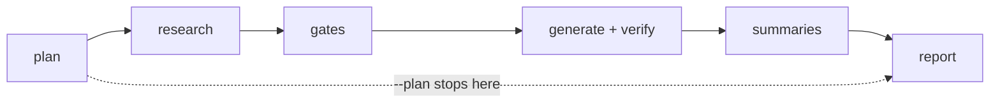

# Turnkey research refresh: from "a dozen remembered steps" to one command and one report

Claudine's provider metadata is driven by fleet research, and that research is
overdue. This fix makes the refresh a routine operation: one command (or one
prompt that runs it) decides what is stale, runs the research, propagates it
through generation and the deterministic gates, and leaves behind a single
review artifact that says what changed and what now needs a human decision.

## Outcome

After this fix, refreshing Claudine's research is:

```sh
just refresh-research            # plan → research → gates → generate → report
just refresh-research --plan     # read-only: what would run, and why, and for how long
```

or, equivalently, invoking one slash-command prompt that runs the recipe and
then triages the report. The operator never edits a topic list, never remembers
which fleets need which agent, never re-pins a hash by hand, and never grep-s
research frontmatter to learn what changed. The run ends in the state
"implementation complete, ready for review" with a committed refresh record.

## Why now

### The research is a quarter old

Every fleet topic except `steering` was last written in the first two weeks of
July 2026. `steering` is dated 2026-09-08. The providers ship weekly.

| Topic group | Last refreshed | Feeds codegen? |
| --- | --- | --- |
| `agent-logging`, `agent-models` | 2026-07-01 | yes |
| `model-config` | 2026-07-02 | yes |
| `acp`, `agent-cli`, `resume`, `skills`, `non-interactive-sessions` | 2026-07-03 | yes |
| `hooks`, `mcp`, `agent-permissions`, `plugins`, `slash-commands`, `subagents`, `system-prompt`, `usage`, `local_runners` | 2026-07-03 | documentation and summaries only |
| `signals` | 2026-07-06 | yes |
| `agent-errors` | 2026-07-14 | yes |
| `steering` | 2026-09-08 | yes |

Two documents were refreshed by hand-run fleets since (`mcp/codex.md`
2026-09-15, `non-interactive-sessions/pi.md` 2026-09-08), which is itself a
symptom: refresh happens when a feature needs it, one document at a time.

### A concrete consumer is blocked on it

The `2026-09-18-edit-integration` review ruled that Kimi's `--edit -i`
behavior cannot be decided until the research is current: whether Kimi Code
now has an interactive-with-initial-prompt entry point is a research question,
and the answer flows through facts and generation before the wrapper can use
it. That ruling scheduled this fix.

### The refresh is not turnkey today

The pieces exist. Nothing joins them, and several are tribal knowledge spread
across four completed specs:

1. `just run-fleet-research` carries a hand-maintained topic array. It already
   omits `agent-errors` and `steering`, the two fleets with deterministic gates,
   and would silently omit the next topic added.
2. Each fleet hard-codes its own freshness window (`date_delta(..., '14d')`)
   and its own agent and model. The July fleets pin `opencode` with
   `kimi-for-coding/k2p7`; `steering` pins `codex` with `gpt-5.6-sol` at low
   reasoning. The recipe overrides the agent but not the model, so a recipe
   run and a hand run of the same fleet can research on different models.
3. After research, the propagation order is undocumented as a whole:
   `claudine providers steering check`, `claudine providers agent-errors check`
   per provider, `just signals-check`, `claudine providers generate --yes`,
   then `just test`. And `just test` still fails after a correct regenerate,
   because `gen/tests/fixtures/generated-artifact-baseline.json` pins xxh64
   hashes of fifteen generated files that must be re-pinned by hand.
4. The `requires_claudine_update` / `reason` signal that every research doc
   carries is read by nothing. It is a sticky boolean nobody clears, so it has
   saturated: 174 documents say `true`, 23 say `false`. It cannot tell an
   operator what is new since the last refresh. The `changes[]` changelog is
   equally unread.
5. The cross-provider summaries have no runner. Each
   `docs/research/summary/<topic>.md` is a three-step sequence run by hand,
   then published to the skill with `just publish-summary-research`. All but
   two are dated 2026-07-03. The directory also holds two competing plugin
   summaries (`plugins.md` and `agent-plugins.md`) with different prompts.
6. The model ground truth (`unchained-ai/artifacts/models-catalog.json`) is a
   separate pipeline in another package area (`just generate-models` then
   `just artifact` in `unchained-ai/`) that the generator only warns about
   after thirty days.
7. `docs/topics/provider-metadata.md` documents a `claudine providers generate
   --check` flag that does not exist (the drift check is `claudine-gen check`,
   run by `just test`), and `docs/topics/how-to-create-a-new-provider.md` still
   describes hand-templated providers.

### Cost is real, so the process must be resumable and selective

Two data points from the record:

| Fleet run | Agent and model | Ten providers took |
| --- | --- | --- |
| July topic fleets | `opencode`, `kimi-for-coding/k2p7` | 1 to 2.5 h per topic (5 to 15 min per document) |
| `agent-errors` 2026-07-14 | `codex`, `gpt-5.6-sol`, low reasoning | 30 min 48 s, ten clean first attempts |

A full refresh is eighteen topic fleets, about 185 documents. Serially on the
July contract that is a working week; three topics wide on the Codex contract
it is an afternoon. Either way it is long enough that the process must survive
interruption, skip what is already fresh, and never make an operator babysit a
terminal.

## Design

### One driver, five stages



| Stage | What it does | Deterministic? |
| --- | --- | --- |
| **plan** | Reads the topic manifest, evaluates freshness for every (topic, provider) document, prints the matrix, the fleets that will run, and a wall-clock estimate. Exits without side effects under `--plan`. | yes |
| **research** | Launches one `claudine sequence <topic>/_fleet.md -y` per stale topic, at most N in parallel, passing the stale provider set so each fleet's own gate skips the rest. Resumable by construction (the same-day skip stays). | no (LLM inside the fleets) |
| **gates** | Runs every topic's declared checks: `agent-errors check <slug>`, `steering check`, `signals-check`, `md schema validate` where a fleet did not already. Findings are recorded, not fatal to other topics. | yes |
| **generate + verify** | `claudine providers generate --yes`, re-pin the byte baseline, `just test-gen`, `just test`. A generation or test failure is a finding in the report; the research stays valid and reviewable. Optionally refreshes the model artifact first (`--models`). | yes |
| **summaries** | Re-runs a summary sequence only when a document it reads is newer than the summary; then `just publish-summary-research`. Skippable with `--skip summaries`. | no |
| **report** | Writes the refresh record (below), including everything that changed and everything a human must now decide. | yes |

The driver is `claudine research {plan,run,report}` in `claudine-cli`, wrapped
by `just refresh-research`. It shells out to `claudine sequence` and to
`claudine-gen` exactly as the existing `providers` subcommands do; it links
nothing new. Rust rather than a longer bash recipe because plan and report read
frontmatter across ~200 documents and compare against git history, which needs
the frontmatter reader Claudine already has, and because it has to work on
Windows (see decision D1).

### The topic manifest replaces the hard-coded array

`docs/research/topics.yaml` is the single registration of a research topic.
The driver discovers nothing by convention alone: every
`docs/research/<topic>/_fleet.md` must appear in the manifest (enabled, or
disabled with a reason), and every manifest entry must have a directory. Either
mismatch fails `plan` loudly, which is how the next `steering` cannot be
forgotten.

```yaml
defaults:
    agent: codex
    model: gpt-5.6-sol
    max_age: 4wk
    parallel: 3
topics:
    - name: hooks
      roster: providers.yaml
      consumers: [summary]
    - name: agent-errors
      roster: providers.yaml
      consumers: [codegen]
      checks: ["claudine providers agent-errors check {{slug}}"]
    - name: steering
      roster: providers.yaml
      consumers: [codegen]
      agent: codex
      model: gpt-5.6-sol
      checks: ["claudine providers steering check {{slug}}"]
    - name: local_runners
      roster: local-runners.yaml
      consumers: [summary]
      summary: local-runners.md
    - name: memory
      enabled: false
      reason: deferred B2 topic; no documents yet
summaries:
    - file: hooks.md
      reads: [hooks]
```

Fields: `roster` (which `kind: sequence` roster the fleet iterates),
`consumers` (`codegen`, `summary`, or `docs`; drives plan ordering and the
report's "generation impact" section), `checks` (deterministic gates run after
the fleet), `agent`/`model` (a per-topic pin; otherwise `defaults`),
`max_age` (per-topic cadence override), `enabled`/`reason`.

### Freshness is decided in one place

Today each `_fleet.md` decides freshness with a literal `14d`. After this fix
the driver is the single oracle and the fleet only honors it:

- The driver computes, per (topic, provider), `needs_refresh: true | false |
  unknown` and passes the resulting provider set into the fleet as a
  `refresh:` variable. The fleet's `initialize` stack keeps two rules: skip when
  `last_updated == ctx.today` (protects same-day re-runs after a prompt fix)
  and skip when `state.slug` is not in `refresh`. A fleet run by hand without
  the driver behaves as before, minus the literal window.
- **Phase 1 oracle:** `last_updated` older than the topic's `max_age`, or the
  document missing, or `--force topic[:provider]`. `unknown` (no
  `last_updated`) is treated as stale and reported as such.
- **Phase 2 oracle (after content-policy ships):** the document's own
  declaration, evaluated by the `content-policy` library with the topic's
  `max_age` as the default policy:

  ```yaml
  last_updated: 2026-10-02
  fleet_fingerprint: blake3-lf:…
  schema_fingerprint: blake3-lf:…
  content_policy:
      - ValidFor(4wk, @last_updated)
      - FileChanged(_fleet.md, @fleet_fingerprint)
      - FileChanged(_schema.yaml, @schema_fingerprint)
  ```

  This is the primitive the existing gates were approximating. `ValidFor` is
  the cadence; the two `FileChanged` rules make a prompt or schema amendment
  self-triggering, which today is done by remembering to backdate
  `last_updated`. After a fleet writes a document, the driver runs the
  library's renewal so the fingerprints record what the research was produced
  against. The `_schema.yaml` sidecars gain the three properties at that
  point; a hand-edit to research frontmatter is otherwise overwritten by the
  next fleet pass, so the declaration is carried by the fleet prompt's capture
  step like every other stamp. Content-policy's later candidates
  (`ProgramInstalled`, `SemVerMajorChange`) are the natural next trigger, a
  provider shipping a new version, and need no change to this design when
  they arrive.

Content-policy evaluates one document per call and leaves looping to callers;
the driver is that caller. Its CLI answer is `true | false | unknown` rather
than an exit code precisely so a wrapper cannot read `unknown` as fresh; the
driver preserves that distinction in the plan matrix.

### The signal gets a lifecycle: deltas and a triage ledger

No schema change. `requires_claudine_update` and `reason` stay what the
researcher wrote. What changes is that the report computes **what is new since
the last refresh** rather than what is true:

- For each document, the typed frontmatter (everything the sidecar schema
  declares) is diffed against the same document at the commit recorded in the
  previous refresh record. Added, removed, and changed keys are listed per
  (topic, provider); prose bodies are never diffed into the report.
- A `reason` counts as **new** when its text differs from the previous
  refresh, or when no previous refresh record exists.
- `docs/research/_triage.md` is the disposition ledger, in the shape
  `summary-triage.md` already proved: one line per item, `[ ]`/`[I]`/`[S]`/`[W]`,
  keyed by `(topic, provider, reason digest)`. The report appends untriaged
  items; it never removes one. An item whose digest is already in the ledger is
  not re-raised, so a refresh that changes nothing reports nothing.

Surfacing is not completion (the rule from `2026-07-02-provider-metadata`):
the run ends with the ledger's untriaged items listed in the final message,
and the author dispositions them.

### The refresh record is the review artifact

`docs/research/_refresh/<YYYY-MM-DD>.md`, committed with the refresh, holds:

1. **Run telemetry** per fleet and provider, in the table shape
   `agent-errors/_fleet-review.md` established: agent, resolved model, start,
   saved, gate, attempts, resumes.
2. **Freshness before and after**: the plan matrix and the post-run matrix,
   with every `unknown` and every skip and its reason.
3. **Gate outcomes** per topic and provider (`clean`, `findings`, `gate_error`,
   with the findings path).
4. **Generation impact**: the list of generated files that changed
   (`data.rs` per provider, `catalog.json`, `vocabulary.rs`,
   `signals/generated.rs`, `steering/generated.rs`, `families_generated.rs`,
   the Darkmatter `agentic_cli_generated.rs`), the baseline re-pin, and the
   `just test` result. A failure here is a finding with the failing test's
   output, not a reason to discard the research.
5. **Research deltas**: the typed frontmatter diff summary per document, and
   the new `reason` texts.
6. **Summaries**: which were regenerated and published, which were skipped as
   current.
7. **Model artifact age** and whether `--models` ran.
8. **Untriaged items** appended to `_triage.md` by this run.

The record's frontmatter carries the commit it was diffed against, so the next
refresh knows its baseline. This replaces the per-spec review files
(`_fleet-review.md`, `_delta-report.md`) for routine refreshes; those remain as
the one-time records they are.

### Commit boundaries

The driver never commits. It leaves the tree in an order that makes review
tractable, and the operator prompt commits in that order when asked:

1. research documents (large, LLM-written; review by the report's delta
   section, not by reading);
2. generated code, the re-pinned baseline, and any facts/overrides edits the
   triage decided on;
3. summaries and the published skill copies;
4. the refresh record and the triage ledger.

### The operator prompt

The "prompt" Ken asked for is thin by design. A repo slash command (under
`prompts/`, namespace to be decided in Q5) does four things: runs
`just refresh-research --plan` and shows the plan; runs the refresh in the
background with a budget ledger; when it returns, reads only the refresh record
(never research bodies) and proposes a disposition for each untriaged item;
then stops at "implementation complete, ready for review". The orchestration
rules from the July closeout plan apply verbatim: frontmatter only in the
orchestrator, evaluation fanned out to subagents when a document's quality is
in doubt, one fleet at a time per agent budget.

## Decisions (proposed; to be ratified)

- **D1. Driver in Rust (`claudine research`), entry point `just
  refresh-research`.** Alternatives considered: extend the bash recipe (cannot
  read 200 frontmatters portably, cannot diff against git blobs cleanly, no
  tests); a `claudine sequence` document that orchestrates fleets with an
  agent (nests agents two deep, burns orchestrator context on bookkeeping,
  and produces no deterministic diff). The Rust driver has L1 tests over a
  fixture research tree; the LLM is used only where judgment is required.
- **D2. Registration in `docs/research/topics.yaml`, with a bidirectional
  guard against the `_fleet.md` directories.** Alternative: a `research:`
  block in each `_fleet.md` frontmatter. The manifest wins because it is also
  where summary-to-topic and roster-to-topic mappings live, and because a
  fleet's frontmatter is composed as template state.
- **D3. Freshness has one oracle, the driver; fleets honor it.** Phase 1 by
  age, phase 2 by content-policy declarations. The fleets lose their literal
  windows in phase 1 so there is never a second opinion.
- **D4. Default execution contract is Codex `gpt-5.6-sol` at low reasoning,
  overridable per topic and per run.** Rationale: the measured 31-minute
  ten-provider fleet against 1 to 2.5 hours, and both post-July fleets were
  authored on it. The July documents' `model` stamps record the sequence's
  selector rather than the resolved model; the driver records the resolved
  model in telemetry.
- **D5. The generated-artifact byte baseline is re-pinned by `claudine
  providers generate --yes`** rather than by hand. The `committed ==
  regenerated` drift tests guard correctness; the pin's job, noticing churn,
  is served by the report's generation-impact section and the diff. Alternative
  for Q3: retire the pin.
- **D6. No research schema change for the update signal.** Deltas plus a
  ledger give the lifecycle without a fleet-wide sidecar edit. The
  content-policy properties in phase 2 are the one schema addition, made
  when every document is being rewritten anyway.
- **D7. Summaries are part of the refresh but change-gated and skippable.**
  A summary re-runs only when one of its inputs is newer than it. `plugins.md`
  and `agent-plugins.md` are reconciled into one before the first run.
- **D8. The model artifact stage is opt-in (`--models`) and always
  reported.** It needs provider API keys and lives in another package area;
  the driver runs the two unchained-ai recipes when asked and otherwise reports
  the artifact's age against the generator's thirty-day warning.
- **D9. Research failures never block other topics; generation failures never
  discard research.** Both are findings. The run's exit code is non-zero only
  when a stage could not run at all.

## Acceptance criteria

1. `just refresh-research --plan` on this branch prints a freshness matrix for
   every enabled topic and provider, names the fleets that would run with
   their agent and model, and estimates wall-clock; it writes nothing.
2. Adding a topic is: create `_fleet.md` and `_schema.yaml`, add one manifest
   entry. A `_fleet.md` with no entry, or an entry with no directory, fails
   `plan` with a message naming the file.
3. `just refresh-research` with no arguments on a stale tree runs only stale
   documents, runs every declared gate, regenerates, re-pins, passes
   `just test-gen` and `just test`, writes the refresh record and ledger, and
   exits zero. Killing it and re-running continues where it stopped.
4. A refresh on a fresh tree changes nothing and produces a record that says
   so; `_triage.md` gains no lines.
5. The refresh record shows, for at least one provider in the first real run,
   a typed frontmatter delta and a new `reason` that the July record could not
   have shown.
6. After the first real run, the Kimi question in `2026-09-18-edit-integration`
   is answerable from `non-interactive-sessions/kimi.md` and `agent-cli/kimi.md`,
   and the answer is recorded in that fix's review, whichever way it goes.
7. `docs/topics/provider-metadata.md` no longer names a nonexistent flag, gains
   a "Refreshing research" section that a newcomer can follow, and
   `how-to-create-a-new-provider.md` matches the generated pipeline.
8. Every fleet's `initialize` stack contains no freshness literal.
9. The claudine skill's research section points at the manifest and the
   refresh record instead of listing topics by hand.

## Phases

| Phase | Deliverable | Gate |
| --- | --- | --- |
| 0 | `topics.yaml`, `claudine research plan`, manifest guards, fleets rewired to the `refresh` variable | criteria 1, 2, 8 |
| 1 | `run` (research stage, gates, parallelism, budget ledger, per-fleet logs), `report`, refresh record, `_triage.md` | criteria 3, 4 |
| 2 | generate + verify stage with automated re-pin; summaries stage with change gating; plugin-summary reconciliation; docs and skill drift (criterion 7, 9) | criteria 3, 7, 9 |
| 3 | The first full refresh, run through the tool; triage; Kimi answer recorded | criteria 5, 6 |
| 4 | Phase 2 oracle: content-policy declarations and fingerprints in sidecars and fleet capture steps; driver evaluates through the library | blocked on `2026-09-28-content-policy` landing |

Phase 3 is the reason this fix exists and should not wait for phase 4.

## Out of scope

- Acting on what the research reveals. Behavior gaps go to the ledger and to
  their own fixes; this fix ships the machinery and one refresh.
- A scheduler. Cadence is declared; something still has to run the command.
- Per-provider rate-limit awareness across concurrent fleets.
- Deleting the legacy pre-roster files (`acp/gemini-cli.md`, `acp/json-rpc.md`,
  `acp/kimi-code-cli.md`) that the July plan kept as validation assets. The
  first refresh record should list them so a follow-up can drop them.

## Open questions for the author

- **Q1. Cadence.** Is `4wk` the right default? Should codegen-feeding topics
  run tighter (say `2wk`) than summary-only topics (`6wk`)?
- **Q2. Rust driver versus recipe.** D1 recommends Rust. If a recipe is
  preferred for speed of delivery, phases 0 and 1 shrink but criterion 2's
  guards and the frontmatter diff become best-effort.
- **Q3. Byte baseline.** Automate the re-pin (D5) or retire the pin now that
  the regenerate-equals-committed tests exist?
- **Q4. First run contract.** Codex `gpt-5.6-sol` low for every topic (D4), or
  keep the July topics on their authored OpenCode/Kimi contract for
  comparability with the July documents?
- **Q5. Where the prompt lives.** A `claudine:` namespace under `prompts/`, or
  the existing `research:` namespace beside `research:update`?
- **Q6. Summaries every refresh** (D7, change-gated) or on demand only?
