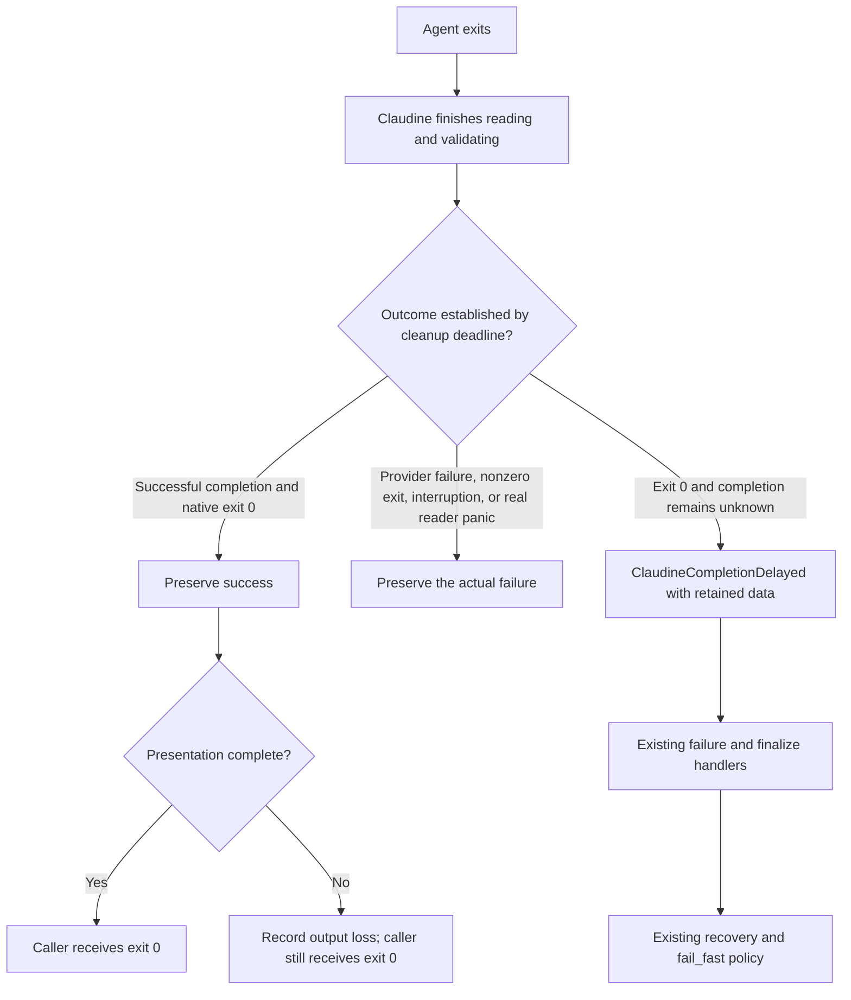

# Claudine completion delays preserve verdicts and expose retained responses

## Outcome

A successful provider transaction stays successful when Claudine takes longer
to finish presenting it. If Claudine reaches its cleanup deadline without a
confirmed completion verdict, the caller receives `ClaudineCompletionDelayed`
with the available response and honest completeness information. Markdown
authors can recognize that condition through the existing diagnostic and
lifecycle interfaces and apply their existing recovery or continuation policy.

When another live delay occurs, a bounded diagnostic record identifies which
Claudine operation was outstanding. Any CPU observation is supporting evidence
only; it does not choose the deadline or establish the cause of the delay.
Whether this fix records CPU at all is an author decision (see
[Open Questions](#open-questions)).

This is a follow-up to `2026-10-06-stream-reader-join-timeout`. That repair's
result-preservation and bounded-output mechanisms are the baseline, not work
to replace. Its outstanding author decision about permanent terminal silence
remains separate and is not resolved by this spec.

## Report and evidence

The user observed an apparently completed final answer followed by
"Stream parser thread panicked" and a failed iteration. A nonzero Claudine
exit could prevent subsequent work in a shell chain.

The old implementation waited five seconds for the stdout reader after child
exit. A timeout and a real reader panic selected the same `ErrorParser`, which
set `is_error: true` and `parse_failure` while retaining the child's exit code.
The harness converted a completed attempt with child exit 0 and an error flag
into Claudine exit 1. The agent's recorded exit 0 was not evidence that the
calling shell received exit 0. The abandoned reader could continue emitting
output, and Codex could independently recover its last-message file without
clearing the false failure flag.

The original eleven panic-message incidents include nine Claude runs and two
Codex runs, identified from their provider stream records. Some fallback
session-end records mislabeled Codex as Claude. Continued reader activity
establishes that many incidents were timeouts, but the old message alone
cannot distinguish timeout from panic for every case.

For the October 6 Claude incident, its native transcript recorded the final
answer at 08:21:29.979 UTC and completed its stop hook at 08:21:30.172.
Claudine logged the false failure at 08:22:26.640994, the same answer at
08:22:26.641015, and the provider result at 08:22:26.641202. The answer existed
about 56.7 seconds before Claudine logged it. Semantic logging followed
rendering callbacks, and session-end logging followed summary presentation;
these timestamps do not identify the blocked operation or the instant the
reader join expired.

A computation spike using six incident answers in reconstructed Claude
assistant/result envelopes measured warmed mean times of 0.046–0.095 ms for
generic JSON decoding, provider parsing, and summary construction, and
1.24–3.18 ms for Markdown rendering into a string. A synthetic 483800-character
answer took about 6 ms to parse and 284 ms to render. These measurements used
the current unoptimized development build on one macOS host. They excluded
terminal writes, actual signal matching, hooks, logging, accumulated session
state, and deliberate CPU saturation. They do not reproduce the old uncached
font-discovery contribution or explain the live incident's delay.

The evidence does not justify assuming JSON decoding, ordinary rendering,
CPU contention, or a WezTerm defect caused every incident. The current record
of behavior and observations is [Timeouts](../../docs/topics/timeouts.md).
That spike already answers the computation-cost question; this fix adds no
further benchmark or performance campaign.

## Current execution model

A reader join waits for a Claudine thread to finish and return its parser and
accumulated result. Child exit does not mean that buffered output has been
parsed or that reader callbacks have returned.

The current reader coordination grants 120 seconds while processing output.
The five-second bound applies to a settled pipe read, with a continuous
250 ms read wait required before that short cutoff. Both bounds share a
monotonic clock started after process-tree teardown. Output delivery uses the
same cleanup deadline and a bounded worker.

The provider's result line is parsed and its finalized summary is published
before callbacks for that line run. An earlier answer line can still invoke
rendering before a later completion line is read. Publishing a result before
its own callbacks therefore does not prove that all earlier presentation work
is outside the parser's path. Instrument that boundary before proposing a
larger change to live rendering.

Today, a reader that times out while still holding its parser is settled from
what the provider had already reported (the "Outcomes" tables in
[Timeouts](../../docs/topics/timeouts.md)). Three facts from that settlement
shape this fix:

- **Exit 0 with no result yet** is reported as `error_kind:
  stream_reader_timeout`, and Claudine exits 1. This is the case this spec
  renames and enriches as `ClaudineCompletionDelayed`.
- **Nonzero exit or interruption with no result read** is also reported as
  `stream_reader_timeout`, so the reader warning currently hides the
  provider's own failure. This spec changes that deliberately (see R3).
- **`stream_reader_timeout` has no diagnostic code.** It is absent from
  `code_for_error_kind` (`claudine/lib/src/diagnostics/error_kind.rs`), so a
  lifecycle handler sees `err.code == null` for it and no author handler can
  match it today. Introducing a stable code is therefore an addition, not a
  rename of something authors already match.



## Requirements

### R1 — Prove the shell caller receives the correct outcome

Add shipped-CLI regressions for both Claude and Codex using hermetic fake
providers. Each provider produces a nonempty answer, a successful completion
verdict, and native exit 0 while a controlled Claudine operation is delayed.

The **completion verdict** is the provider's own end-of-transaction record,
already recognized by its parser:

| Provider | Verdict record | Not a verdict |
| --- | --- | --- |
| Claude | the stream's `result` event (success or error subtype) | assistant text, the stop hook, the native transcript |
| Codex | `turn.completed` or `turn.failed` | the `--output-last-message` file, agent messages |

The Codex last-message file is answer text: it may populate `response_text`
(R4) but never establishes success. Other providers keep whatever verdict
their parser already uses; this spec does not add verdicts to them.

- Once the successful verdict is available, delayed callbacks or presentation
  cannot replace it with a parser failure or a nonzero Claudine exit.
- A shell chain of the form `claudine ... && <write a marker>` must execute
  its second command. Assert both the Claudine exit and the marker, rather
  than inferring success from a session-end record or visible text.
- Cover a complete verdict published before an outstanding callback returns,
  as well as unfinished terminal delivery. Use injected short budgets and
  synchronization handshakes, not real 120-second waits or startup sleeps.
- Controls must show that a genuine provider error, nonzero native exit, real
  reader panic, interruption, and provider timeout retain their outcomes and
  prevent the success chain where appropriate.
- An unconfirmed completion (`ClaudineCompletionDelayed`) exits with the
  existing generic failure code 1, so the chain's second command does not run.
  This fix adds no new exit code; shell callers distinguish the condition
  through the session record or lifecycle diagnostic, not the exit status.
- A visible answer alone must not establish success. Preserve the existing
  structured-provider and incomplete-subagent verdict checks.
- Preserve exactly one session-end publication before lifecycle completion.
  Its outcome and the caller's outcome must be distinguishable when native
  exit 0 accompanies a genuine semantic failure or unconfirmed completion.

Reuse existing parser, blocked-sink, and lifecycle tests where they already
prove a requirement (for example, the reader-join outcome matrix in
`claudine/cli/src/commands/wrap/exec/reader_join/matrix.rs` already proves a
stall during the final render keeps success). New shipped-CLI checks fill the
caller-boundary gap; they are not a second copy of the parser matrix.

### R2 — Observe the actual Claudine delay without claiming a cause

Record monotonic durations and the current outstanding operation at these
reader and completion boundaries:

- waiting for pipe data and processing a received record;
- generic JSON decoding/signal observation and provider parsing;
- completion-verdict publication and summary construction;
- Markdown/render-frame computation and output submission;
- semantic logging and lifecycle/hook callbacks;
- terminal delivery, including queued versus in-progress output;
- join start/end, cutoff, and final transaction settlement.

Distinguish computation from terminal delivery and distinguish provider data
arrival from Claudine's later semantic-event logging. Do not describe a
processing state as proof that parsing or terminal I/O is the cause. A
`PipeOpen` stall (a process the agent started still holds the pipe) reports
"waiting for pipe data" as its operation; the diagnostic must not suggest
Claudine was slow in that case.

Use bounded per-run counters and a bounded last-state/history representation,
not an unbounded event log. Observation must not hold run-state locks across
callbacks, terminal I/O, or diagnostic publication. The diagnostic must retain
the last published state even if the reader is still blocked; producing it
must not require joining that reader or locking its parser.

The per-record cost must stay proportional to the work it observes: record
the operation and its start time with lock-free stores (for example, atomics
holding an operation tag and a monotonic offset), with no allocation or
formatting on the per-record path. This is a design constraint, not a
benchmark requirement; no new performance measurement is needed.

An exhausted cleanup deadline must publish the observation through the
existing run/session diagnostic storage where available, without depending on
terminal delivery or opt-in tracing. A blocked terminal cannot be the only
destination. This matters because, when the readers use the whole budget,
the output worker's drain deadline has already passed and queued warnings are
not shown even on a healthy terminal (a known, undecided item from the
predecessor fix). Keep the native exit, Claudine outcome, provider identity,
and run/attempt identity explicit; do not derive provider identity from a
fallback summary's default provider.

CPU: `sniff` currently exposes only static CPU facts (brand, architecture,
core counts in `sniff/lib/src/hardware/cpu.rs`), with no load or utilization
sample. Under this spec's rule against adding a CPU-discovery subsystem, a
CPU observation would always be unknown. Whether to keep the field, and in
what form, is [Open Question 1](#1-should-this-fix-record-a-cpu-observation);
the requirement below applies only if the author keeps it. Whatever is
recorded, unsupported, missing, or failed measurements are explicit unknowns,
never a low-load observation; sampling must not introduce a second unbounded
wait; and CPU telemetry neither selects the cleanup budget nor triggers an
automatic provider retry.

### R3 — Expose `ClaudineCompletionDelayed` only for unconfirmed completion

Use `ClaudineCompletionDelayed` as the human-facing condition name, with
internal error kind `claudine_completion_delayed` and stable diagnostic code
`timeout.claudine_completion_delayed`. Register the diagnostic through the
existing `Diagnostic`/`BlockError` architecture so terminal reports, lifecycle
`err.*`, and machine output describe the same selected condition.

The registry row (`claudine/lib/src/diagnostics/registry.rs`) is:

| Facet | Value | Why |
| --- | --- | --- |
| `category` | `timeout` | matches the code prefix, as the registry requires |
| `disposition` | `transient` | the same transaction may complete on a later attempt |
| `origin` | `internal` | Claudine's own cleanup deadline expired; remediation is diagnosing Claudine, not the provider or the author |
| severity | warning | the default for `transient`; no override |
| `detail` | the R4 field list | |

This is the first `timeout.*` code with `internal` origin. The existing
`timeout.step_silence` and `timeout.wall_clock` are provider-origin because
the agent went silent or ran too long. Here the agent has already exited.
`code_for_error_kind` gains the mapping `claudine_completion_delayed` →
`timeout.claudine_completion_delayed`.

Warning severity does not imply a successful exit:
without recovery, unconfirmed completion remains a nonzero caller outcome.
The message must say Claudine's cleanup deadline expired and that the provider
completion verdict remains unconfirmed. It must not say the agent timed out,
the parser panicked, or CPU load caused the condition without evidence.

| State at cutoff | Contract |
| --- | --- |
| Successful provider completion parsed and native exit 0 | Success; any presentation loss is a warning/status, not this error |
| Genuine provider failure, nonzero native exit, interruption, or provider timeout established | Preserve the primary outcome; attach cleanup observations without replacing it |
| Reader actually panicked | Actual parser failure with panic payload, not a delay label |
| Native exit 0, no confirmed completion verdict, and no stronger primary outcome | `ClaudineCompletionDelayed`, with retained data and observations |

> **Reader's note — intended change to the nonzero-exit row.** Today a
> nonzero exit or interruption with no result read is reported as
> `stream_reader_timeout`. Under this table it reports the provider's own
> failure, with the reader stall attached as an observation. That failure
> uses the same `error_kind` the parser already produces when the reader
> finishes (`exit_failure` for a nonzero exit, `interrupted` for an
> interruption). The exit code is unchanged. This change is intended: the
> provider's failure is the stronger, more actionable fact. Note that
> `exit_failure` has no diagnostic code mapping today (only `agent_failure`
> maps to `provider.exited`), so whether to add one is a planning detail;
> this spec does not require it. The timeout topic page's outcome table must
> be updated in the same change, and the reader-join outcome matrix test
> updated to the new cells.

Presentation-only delay must not fire the failure lifecycle or create this
diagnostic as its primary cause. Conversely, nonempty prose cannot turn an
unconfirmed verdict into success. Error flags and provider/task-ledger state
are authoritative; do not search arbitrary Markdown for the word "error".

Expose the new condition consistently through attempt status, the session
record, enclosing composition/sequence errors, and lifecycle diagnostics.
The `stream_reader_timeout` label stops being a primary `error_kind` on the
stdout path. It remains as the reader warning text and as a subordinate
observation. It is never a competing primary identity for the same outcome.
The stderr reader's timeout keeps its current behavior: a warning that does
not change the summary.
Implementation must enumerate and update every consumer of the label. Known
consumers are `reader_failure` in `exec/reader_join.rs`, the reader-join
outcome matrix and `provider_streams` tests, and the session-end/attempt test
helpers (`policy/session_end_tests.rs`, `harness_orch/attempt/tests.rs`). It
has no diagnostic-code mapping to remove.

### R4 — Retain response data before the work that may block

The diagnostic's typed `err.detail` must include the following fields, with
unknown values explicitly null and completeness stated separately:

| Field | Meaning |
| --- | --- |
| `provider` | Actual provider identity |
| `exit_code` | Observed provider child exit code, separate from Claudine's eventual exit |
| `elapsed_ms`, `limit_ms` | Shared cleanup elapsed time and deadline budget, with units |
| `verdict_received` | Whether an authoritative completion verdict was published; false for the primary delayed-completion condition |
| `response_text` | Available original answer text, before terminal styling; null if no answer has been identified |
| `response_complete` | Whether the identified answer is known to be complete; independent of its nonempty length |
| `raw_output` | Retained pre-parse provider output, distinct from extracted Markdown |
| `raw_output_complete` | Whether the raw representation covers the complete expected output |
| `raw_output_truncated` | Whether the retention policy omitted already observed bytes |
| `raw_output_path` | Existing retained artifact containing additional/full raw output, when available |
| `observed_operation` | Last observed Claudine operation at cutoff |
| `cpu_observation` | **Only if kept by [Open Question 1](#1-should-this-fix-record-a-cpu-observation).** CPU value, units, observation time/interval, and availability; null when unknown |

> **Reader's note — `exit_code`, not `native_exit_code`.** The registry keeps
> one name per concept across codes (the "shared field vocabulary" rule in
> `registry.rs`), and `provider.exited` already names the provider child's
> exit status `exit_code`. Reusing that name lets one handler read the
> child's exit across both codes. Claudine's own exit is not a detail field.

Raw provider output can be JSONL or another protocol, not just Markdown.
Capture available bytes before provider parsing and rendering, and preserve
already identified answer text separately. Do not invent data from unread
pipe bytes, decode malformed data as if it were a final answer, or describe
a retained tail as the original complete response.

The answer must be retained before the callbacks that can block. The
predecessor fix recorded a deferred gap here: a reader that stalls in the
sink while still handling the result line keeps success but loses the answer
text, because the feed call borrows the parser at that moment. Closing that
gap is in scope. Snapshot the answer text into the bounded observation state
before invoking callbacks, so it can be read without the parser.

**The detail must be carried, not reconstructed from a label.** Today a
session `error_kind` reaches lifecycle handlers through
`LifecycleErrorInfo::from_action_failure`
(`claudine/lib/src/composition/lifecycle/context.rs`). That seam maps the
label to a code and seeds a catalog-shaped `err.detail` with every field
null. That is why `timeout.step_silence`'s `elapsed_ms`/`limit_ms` read
null to authors today. The R4 payload cannot travel that way. The attempt
must carry a populated diagnostic snapshot (or equivalent typed detail) from
reader settlement through the session summary to the lifecycle context. The
label-only seam stays as the fallback for kinds that have no per-instance
data. Back-filling the existing timeout codes' detail is out of scope.

Retention must be bounded in memory. The implementation plan must state the
inline byte limit, overflow policy, and lifetime of any existing capture
artifact used by a handler. An overflow must be explicit; when a complete
retained artifact exists, expose it rather than silently replacing full text
with a clipped payload. If no complete copy exists, report that limitation.
Do not create an unbounded invocation transcript or introduce a new durable
spool service for this fix. Author-visible data must be a frozen snapshot;
late readers cannot mutate it after settlement.

The only existing raw artifact is the opt-in capture enabled by
`CLAUDINE_RAW_STREAM_DIR` (`exec/stream_capture.rs`). It is off by default,
mirrors only lines already fed to the parser, and is written through a
buffered writer owned by the reader thread. A blocked reader can therefore
leave its tail unflushed. `raw_output_path` may name that file only when
capture is enabled. When it does, `raw_output_complete` must stay false
unless the capture is known to be flushed through the last line received.
Without the capture, `raw_output` is the bounded in-memory retention and
`raw_output_path` is null.

Keep response data out of the concise notification-safe `err.msg`; authors
can explicitly access `err.detail.response_text` or the raw representation.
Do not interpolate or execute provider-produced text as authored instructions.

### R5 — Authors handle the condition through the existing lifecycle contract

Expose the diagnostic in the existing `failure` and `finalize` events. Authors
match the stable code, not message text or deprecated internal error names.
For example, the following handler reports the available answer without
assuming that printing it repairs the failed transaction:

```yaml
failure:
  stack:
    - when: "err.code == 'timeout.claudine_completion_delayed' && err.detail.response_text != null"
      action: { stdout: "{{ err.detail.response_text }}" }
```

Existing retry, resume, and proxy directives keep their normal semantics and
budgets. Existing sequence/loop `fail_fast` policy governs whether later work
runs while a step remains failed. A handler that only prints or stores the
payload must not silently rewrite an unconfirmed transaction as success.

The documented continuation policy is `fail_fast: false` on the sequence (or
`--fail-fast` absent with document `fail_fast: false`), or on the loop. Under
it, the failed step is recorded in the summary and later steps still run. No
other existing policy continues past a failed step while keeping it failed.
`no_error` only covers side-effect dispatch failures of lifecycle actions, so
it is not a continuation mechanism. Document and test a complete author
example: a sequence with `fail_fast: false` whose step's `failure` handler
reads the retained response. Verify that the later step runs and that the
original step keeps its honest failed outcome. Also test default failure
behavior (`fail_fast` defaults to `true`, so the sequence halts), an explicit
successful recovery, and exactly-once `finalize`. This spec adds no generic
"ignore any error" directive and no new lifecycle event.

The documentation must warn that `transient` means "may succeed on another
attempt", not "nothing happened". The provider exited and may have finished
its work (edits, commits, messages), so a `retry` re-runs a transaction whose
side effects may already exist. The doc example should show reading
`err.detail.response_text` before choosing to retry. This is guidance only;
retry semantics are unchanged.

### R6 — Preserve budgets and validate with real-run evidence

Retain the shared 120-second processing/output-cleanup limit and the separate
settled-pipe bound. Do not reset or extend the shared clock when reader state
changes, add public timeout settings, or make the limit depend on CPU load.
Preserve process-tree teardown and lifecycle actions' independent deadlines.

After local validation, install the current implementation through the normal
Claudine recipe and observe representative real Claude and Codex runs. Record
the tested revision/build, provider version, native exit, caller exit, and
available completion observations. Preserve terminal/browser focus during
integration observation. An absence of recurrence is evidence for those runs,
not proof of the original cause or a measured future failure probability.

A naturally recurring delay is not required for implementation completion.
If one occurs, use the diagnostic to locate it before proposing CPU
optimizations, new rendering architecture, or terminal recovery. Retain any
unresolved cause explicitly in the current documentation.

## Scope boundaries

In scope: caller-boundary regressions, bounded completion observations,
retained-response diagnostics (including closing the result-line answer-loss
gap and carrying a populated detail to lifecycle handlers), existing author
handling, and verification of the current repair in real runs.

The condition applies to every provider whose stdout goes through the shared
reader join. Tests cover Claude and Codex; other providers inherit the
contract through the shared settlement code without per-provider tests.

Out of scope:

- recovering terminal visibility after the output worker has been abandoned,
  cancellable terminal writes, a separate writer process, or additional writers;
- resolving the earlier permanent-silence author decision by implication;
- changing provider timeout rules, arbitrary lifecycle or messaging deadlines;
- populating per-instance detail for existing codes (`timeout.step_silence`,
  `timeout.wall_clock`) that currently travel through the label-only seam;
- declaring CPU contention, JSON decoding, Markdown rendering, or WezTerm the
  historical cause without evidence;
- speculative parser optimization, a sustained host-saturation campaign, or
  replacing the JSON library;
- changing all provider protocols, extending Kimi wire-session joins, or adding
  new CI environments/gates.

## Verification and documentation

Use the monorepo test toolkit and canonical nextest-backed recipes. Run focused
tests first, followed by the relevant package-area `just test` and `just lint`.
Reuse existing passing local evidence when no subsequent implementation change
affects it. Use `just test-l2` only for behavior that needs a real terminal;
these hermetic caller checks and controlled stalls are Level 1.

The synthetic observations, diagnostics, data-retention tests, and fake-provider
caller checks must work on macOS, Linux, native Windows, and WSL2. Platform
shell fixtures must use the existing portable process fixture and toolkit;
do not add Unix-only coverage for a portable caller promise. Read the `os`
skill before changing Windows branches or path comparisons. Real-provider
observation remains separate evidence, not an automatic CI dependency.

Acceptance requires:

- both providers' success chains continue despite delayed Claudine cleanup;
- actual failures and missing-verdict controls remain failures, and a
  nonzero exit with no result read reports the provider's failure rather than
  a reader timeout;
- deadline diagnostics identify the observed phase without cause inference;
- a lifecycle handler reads populated `err.detail` values (not all-null) for
  `timeout.claudine_completion_delayed`;
- complete, partial, unavailable, and overflowed payloads have honest flags;
- an answer is retained when the reader stalls while handling the result line;
- terminal blockage cannot prevent diagnostic snapshot publication through
  the existing storage route or cause duplicate lifecycle/session completion;
- author recovery and continuation examples behave as documented;
- existing normal output order/content, verdicts, deadlines, and bounded
  thread/memory behavior remain covered.

Update the timeout, lifecycle, composition, and non-interactive-session topic
pages and any affected README descriptions alongside implementation,
including the timeout page's "Outcomes" tables for the nonzero-exit change.
Update the diagnostic catalog/registry, `claudine errors` output, and skill
guidance if their architecture or workflow changes. The topic pages carry
planned behavior until it lands; remove those markers when implemented. Record
departures in the implementation log rather than rewriting this snapshot after
review closes.

## Planning questions

The implementation plan must resolve this within the requirements above:

1. What inline byte limit for `response_text` and `raw_output` keeps author
   access reliable while bounding memory and the size of the persisted
   session record? The only existing raw artifact is the opt-in
   `CLAUDINE_RAW_STREAM_DIR` capture (see R4); state its lifetime when it is
   referenced.

This is a planning detail, not permission to weaken result preservation,
claim unavailable raw data, introduce implicit success, or expand terminal
recovery into this fix.

> **Reader's note.** Two earlier planning questions were answered during
> review and folded into the requirements. Which existing failure policy
> continues a sequence is answered in R5 (`fail_fast: false`). What `sniff`
> offers for CPU is answered in R2: only static facts. That second answer
> raised the decision below.

## Open Questions

### 1. Should this fix record a CPU observation?

`sniff` has no CPU load or utilization sample, and this spec forbids building
a CPU-discovery subsystem for this fix. The `cpu_observation` field would
therefore always be null. The diagnostic registry is additive-only: a field
added now cannot be renamed or removed later without breaking author `when:`
clauses. That makes a permanently-null field a lasting contract cost.

1. **Drop CPU from this fix (recommended).** Remove `cpu_observation` from
   the R4 detail and the CPU requirement from R2. Add it later as an additive
   field once `sniff` offers a load sample.
   - Pros: no dead field in a locked contract; no sampling thread or wait; R2
     already identifies the outstanding operation, and that is what locates a
     delay.
   - Cons: if a delay recurs before `sniff` grows the capability, there is
     no host-load context in the record.
2. **Keep the field, always null with an availability reason** (for example
   `{ "available": false, "reason": "unsupported" }`).
   - Pros: the shape is fixed now, so later population is not a schema
     change.
   - Cons: the shape is fixed before anyone knows what a useful CPU
     observation looks like (process versus system, instant versus interval).
     Authors see a field that never carries data.
3. **Add a minimal load sample to `sniff` as part of this fix**, for example
   system CPU over the cleanup window. The `sysinfo` crate, already a
   `claudine-cli` dependency, can produce one, but it needs two refreshes
   at least about 200 ms apart, so a background sampler.
   - Pros: real data when a delay recurs.
   - Cons: contradicts this spec's scope; adds a sampling thread plus
     Windows/Linux/macOS behavior to verify. The computation spike already
     shows parsing and rendering are cheap, which makes CPU the less likely
     lead.

Recommendation: option 1. The point of this fix is to name the outstanding
Claudine operation and preserve the verdict. A CPU number cannot do either
and, per this spec, may not establish a cause anyway. Adding the field later
is non-breaking; removing it is not.
