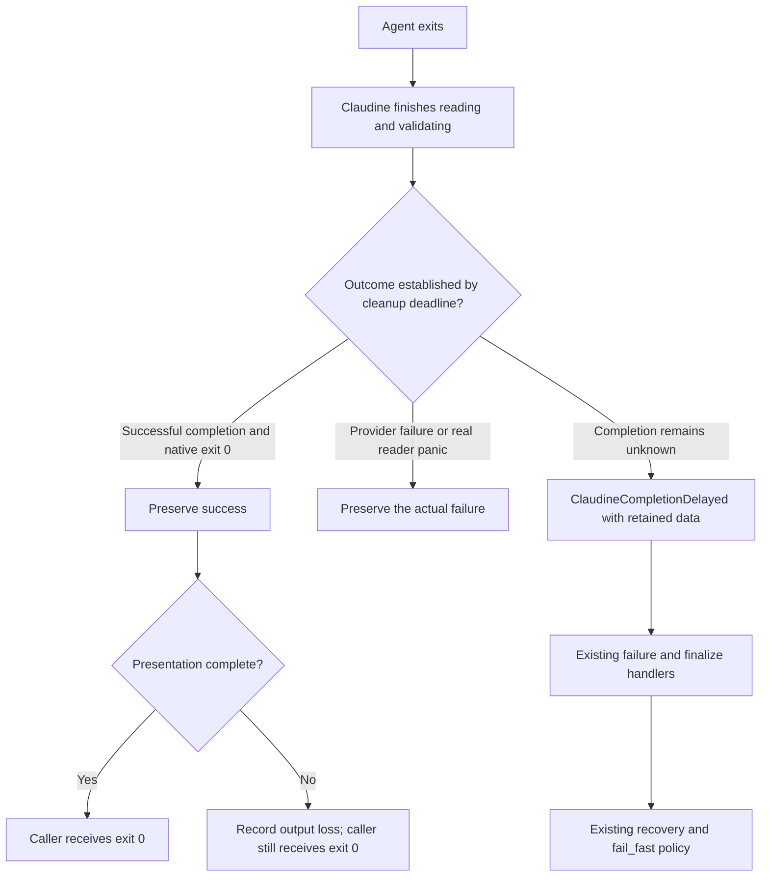

# Claudine completion delays preserve verdicts and expose retained responses

## Outcome

A successful provider transaction stays successful when Claudine takes longer
to finish presenting it. If Claudine reaches its cleanup deadline without a
confirmed completion verdict, the caller receives `ClaudineCompletionDelayed`
with the available response and honest completeness information. Markdown
authors can recognize that condition through the existing diagnostic and
lifecycle interfaces and apply their existing recovery or continuation policy.

When another live delay occurs, a bounded diagnostic record identifies which
Claudine operation was outstanding. CPU observations are supporting evidence;
they do not choose the deadline or establish the cause of the delay.

This is a follow-up to `2026-10-06-stream-reader-join-timeout`. That repair's
result-preservation and bounded-output mechanisms are the baseline, not work
to replace. Its outstanding author decision about permanent terminal silence
remains separate and is not resolved by this spec.

## Report and evidence

The user observed an apparently completed final answer followed by
"Stream parser thread panicked" and a failed iteration. A nonzero Claudine
exit could prevent subsequent work in a shell chain.

The old implementation waited five seconds for the stdout reader after child
exit. A timeout and a real reader panic selected the same `ErrorParser`, which
set `is_error: true` and `parse_failure` while retaining the child's exit code.
The harness converted a completed attempt with child exit 0 and an error flag
into Claudine exit 1. The agent's recorded exit 0 was not evidence that the
calling shell received exit 0. The abandoned reader could continue emitting
output, and Codex could independently recover its last-message file without
clearing the false failure flag.

The original eleven panic-message incidents include nine Claude runs and two
Codex runs, identified from their provider stream records. Some fallback
session-end records mislabeled Codex as Claude. Continued reader activity
establishes that many incidents were timeouts, but the old message alone
cannot distinguish timeout from panic for every case.

For the October 6 Claude incident, its native transcript recorded the final
answer at 08:21:29.979 UTC and completed its stop hook at 08:21:30.172.
Claudine logged the false failure at 08:22:26.640994, the same answer at
08:22:26.641015, and the provider result at 08:22:26.641202. The answer existed
about 56.7 seconds before Claudine logged it. Semantic logging followed
rendering callbacks, and session-end logging followed summary presentation;
these timestamps do not identify the blocked operation or the instant the
reader join expired.

A computation spike using six incident answers in reconstructed Claude
assistant/result envelopes measured warmed mean times of 0.046–0.095 ms for
generic JSON decoding, provider parsing, and summary construction, and
1.24–3.18 ms for Markdown rendering into a string. A synthetic 483800-character
answer took about 6 ms to parse and 284 ms to render. These measurements used
the current unoptimized development build on one macOS host. They excluded
terminal writes, actual signal matching, hooks, logging, accumulated session
state, and deliberate CPU saturation. They do not reproduce the old uncached
font-discovery contribution or explain the live incident's delay.

The evidence does not justify assuming JSON decoding, ordinary rendering,
CPU contention, or a WezTerm defect caused every incident. The current record
of behavior and observations is [Timeouts](../../docs/topics/timeouts.md).

## Current execution model

A reader join waits for a Claudine thread to finish and return its parser and
accumulated result. Child exit does not mean that buffered output has been
parsed or that reader callbacks have returned.

The current reader coordination grants 120 seconds while processing output.
The five-second bound applies to a settled pipe read, with a continuous
250 ms read wait required before that short cutoff. Both bounds share a
monotonic clock started after process-tree teardown. Output delivery uses the
same cleanup deadline and a bounded worker.

The provider's result line is parsed and its finalized summary is published
before callbacks for that line run. An earlier answer line can still invoke
rendering before a later completion line is read. Publishing a result before
its own callbacks therefore does not prove that all earlier presentation work
is outside the parser's path. Instrument that boundary before proposing a
larger change to live rendering.



## Requirements

### R1 — Prove the shell caller receives the correct outcome

Add shipped-CLI regressions for both Claude and Codex using hermetic fake
providers. Each provider produces a nonempty answer, a successful completion
verdict, and native exit 0 while a controlled Claudine operation is delayed.

- Once the successful verdict is available, delayed callbacks or presentation
  cannot replace it with a parser failure or a nonzero Claudine exit.
- A shell chain of the form `claudine ... && <write a marker>` must execute
  its second command. Assert both the Claudine exit and the marker, rather
  than inferring success from a session-end record or visible text.
- Cover a complete verdict published before an outstanding callback returns,
  as well as unfinished terminal delivery. Use injected short budgets and
  synchronization handshakes, not real 120-second waits or startup sleeps.
- Controls must show that a genuine provider error, nonzero native exit, real
  reader panic, interruption, and provider timeout retain their outcomes and
  prevent the success chain where appropriate.
- A visible answer alone must not establish success. Preserve the existing
  structured-provider and incomplete-subagent verdict checks.
- Preserve exactly one session-end publication before lifecycle completion.
  Its outcome and the caller's outcome must be distinguishable when native
  exit 0 accompanies a genuine semantic failure or unconfirmed completion.

Reuse existing parser, blocked-sink, and lifecycle tests where they already
prove a requirement. New shipped-CLI checks fill the caller-boundary gap;
they are not a second copy of the parser matrix.

### R2 — Observe the actual Claudine delay without claiming a cause

Record monotonic durations and the current outstanding operation at these
reader and completion boundaries:

- waiting for pipe data and processing a received record;
- generic JSON decoding/signal observation and provider parsing;
- completion-verdict publication and summary construction;
- Markdown/render-frame computation and output submission;
- semantic logging and lifecycle/hook callbacks;
- terminal delivery, including queued versus in-progress output;
- join start/end, cutoff, and final transaction settlement.

Distinguish computation from terminal delivery and distinguish provider data
arrival from Claudine's later semantic-event logging. Do not describe a
processing state as proof that parsing or terminal I/O is the cause.

Use bounded per-run counters and a bounded last-state/history representation,
not an unbounded event log. Observation must not hold run-state locks across
callbacks, terminal I/O, or diagnostic publication. The diagnostic must retain
the last published state even if the reader is still blocked; producing it
must not require joining that reader or locking its parser.

An exhausted cleanup deadline must publish the observation through the
existing run/session diagnostic storage where available, without depending on
terminal delivery or opt-in tracing. A blocked terminal cannot be the only
destination. Keep the native exit, Claudine outcome, provider identity, and
run/attempt identity explicit; do not derive provider identity from a fallback
summary's default provider.

Record CPU observations through supported `sniff` capabilities when available,
including what was measured and its sampling interval. Unsupported, missing,
or failed measurements are explicit unknowns, never a low-load observation.
Do not add a new cross-platform CPU-discovery subsystem merely to populate
this field. Sampling and diagnostics must not introduce a second unbounded
wait. CPU telemetry neither selects the cleanup budget nor triggers an
automatic provider retry.

### R3 — Expose `ClaudineCompletionDelayed` only for unconfirmed completion

Use `ClaudineCompletionDelayed` as the human-facing condition name, with
internal error kind `claudine_completion_delayed` and stable diagnostic code
`timeout.claudine_completion_delayed`. Register the diagnostic through the
existing `Diagnostic`/`BlockError` architecture so terminal reports, lifecycle
`err.*`, and machine output describe the same selected condition.

The diagnostic is transient, originates in Claudine (`internal` origin), and
has warning severity. Warning severity does not imply a successful exit:
without recovery, unconfirmed completion remains a nonzero caller outcome.
The message must say Claudine's cleanup deadline expired and that the provider
completion verdict remains unconfirmed. It must not say the agent timed out,
the parser panicked, or CPU load caused the condition without evidence.

| State at cutoff | Contract |
| --- | --- |
| Successful provider completion parsed and native exit 0 | Success; any presentation loss is a warning/status, not this error |
| Genuine provider failure, nonzero native exit, interruption, or provider timeout established | Preserve the primary outcome; attach cleanup observations without replacing it |
| Reader actually panicked | Actual parser failure with panic payload, not a delay label |
| No confirmed completion verdict and no stronger primary outcome | `ClaudineCompletionDelayed`, with retained data and observations |

Presentation-only delay must not fire the failure lifecycle or create this
diagnostic as its primary cause. Conversely, nonempty prose cannot turn an
unconfirmed verdict into success. Error flags and provider/task-ledger state
are authoritative; do not search arbitrary Markdown for the word "error".

Expose the new condition consistently through attempt status, the session
record, enclosing composition/sequence errors, and lifecycle diagnostics.
Keep any existing `stream_reader_timeout` reader warning as a subordinate
observation if needed; do not expose it as a competing primary identity for
the same unconfirmed-completion outcome. Implementation must enumerate and
update consumers of that existing label, including diagnostic-code mappings.

### R4 — Retain response data before the work that may block

The diagnostic's typed `err.detail` must include the following fields, with
unknown values explicitly null and completeness stated separately:

| Field | Meaning |
| --- | --- |
| `provider` | Actual provider identity |
| `native_exit_code` | Observed child exit code, separate from Claudine's eventual exit |
| `elapsed_ms`, `limit_ms` | Shared cleanup elapsed time and deadline budget, with units |
| `verdict_received` | Whether an authoritative completion verdict was published; false for the primary delayed-completion condition |
| `response_text` | Available original answer text, before terminal styling; null if no answer has been identified |
| `response_complete` | Whether the identified answer is known to be complete; independent of its nonempty length |
| `raw_output` | Retained pre-parse provider output, distinct from extracted Markdown |
| `raw_output_complete` | Whether the raw representation covers the complete expected output |
| `raw_output_truncated` | Whether the retention policy omitted already observed bytes |
| `raw_output_path` | Existing retained artifact containing additional/full raw output, when available |
| `observed_operation` | Last observed Claudine operation at cutoff |
| `cpu_observation` | CPU value, units, observation time/interval, and availability; null when unknown |

Raw provider output can be JSONL or another protocol, not just Markdown.
Capture available bytes before provider parsing and rendering, and preserve
already identified answer text separately. Do not invent data from unread
pipe bytes, decode malformed data as if it were a final answer, or describe
a retained tail as the original complete response.

Retention must be bounded in memory. The implementation plan must state the
inline byte limit, overflow policy, and lifetime of any existing capture
artifact used by a handler. An overflow must be explicit; when a complete
retained artifact exists, expose it rather than silently replacing full text
with a clipped payload. If no complete copy exists, report that limitation.
Do not create an unbounded invocation transcript or introduce a new durable
spool service for this fix. Author-visible data must be a frozen snapshot;
late readers cannot mutate it after settlement.

Keep response data out of the concise notification-safe `err.msg`; authors
can explicitly access `err.detail.response_text` or the raw representation.
Do not interpolate or execute provider-produced text as authored instructions.

### R5 — Authors handle the condition through the existing lifecycle contract

Expose the diagnostic in the existing `failure` and `finalize` events. Authors
match the stable code, not message text or deprecated internal error names.
For example, the following handler reports the available answer without
assuming that printing it repairs the failed transaction:

```yaml
failure:
  stack:
    - when: "err.code == 'timeout.claudine_completion_delayed' && err.detail.response_text != null"
      action: { stdout: "{{ err.detail.response_text }}" }
```

Existing retry, resume, and proxy directives keep their normal semantics and
budgets. Existing sequence/loop `fail_fast` policy governs whether later work
runs while a step remains failed. A handler that only prints or stores the
payload must not silently rewrite an unconfirmed transaction as success.

Document and test a complete author example that reads the retained response
and deliberately permits later sequence work using an existing supported
policy. Verify the later step runs and that the original step retains its
honest outcome. Also test default failure behavior, an explicit successful
recovery, and exactly-once `finalize`. This spec adds no generic "ignore any
error" directive and no new lifecycle event.

### R6 — Preserve budgets and validate with real-run evidence

Retain the shared 120-second processing/output-cleanup limit and the separate
settled-pipe bound. Do not reset or extend the shared clock when reader state
changes, add public timeout settings, or make the limit depend on CPU load.
Preserve process-tree teardown and lifecycle actions' independent deadlines.

After local validation, install the current implementation through the normal
Claudine recipe and observe representative real Claude and Codex runs. Record
the tested revision/build, provider version, native exit, caller exit, and
available completion observations. Preserve terminal/browser focus during
integration observation. An absence of recurrence is evidence for those runs,
not proof of the original cause or a measured future failure probability.

A naturally recurring delay is not required for implementation completion.
If one occurs, use the diagnostic to locate it before proposing CPU
optimizations, new rendering architecture, or terminal recovery. Retain any
unresolved cause explicitly in the current documentation.

## Scope boundaries

In scope: caller-boundary regressions, bounded completion observations,
retained-response diagnostics, existing author handling, and verification of
the current repair in real runs.

Out of scope:

- recovering terminal visibility after the output worker has been abandoned,
  cancellable terminal writes, a separate writer process, or additional writers;
- resolving the earlier permanent-silence author decision by implication;
- changing provider timeout rules, arbitrary lifecycle or messaging deadlines;
- declaring CPU contention, JSON decoding, Markdown rendering, or WezTerm the
  historical cause without evidence;
- speculative parser optimization, a sustained host-saturation campaign, or
  replacing the JSON library;
- changing all provider protocols, extending Kimi wire-session joins, or adding
  new CI environments/gates.

## Verification and documentation

Use the monorepo test toolkit and canonical nextest-backed recipes. Run focused
tests first, followed by the relevant package-area `just test` and `just lint`.
Reuse existing passing local evidence when no subsequent implementation change
affects it. Use `just test-l2` only for behavior that needs a real terminal;
these hermetic caller checks and controlled stalls are Level 1.

The synthetic observations, diagnostics, data-retention tests, and fake-provider
caller checks must work on macOS, Linux, native Windows, and WSL2. Platform
shell fixtures must use the existing portable process fixture and toolkit;
do not add Unix-only coverage for a portable caller promise. Read the `os`
skill before changing Windows branches or path comparisons. Real-provider
observation remains separate evidence, not an automatic CI dependency.

Acceptance requires:

- both providers' success chains continue despite delayed Claudine cleanup;
- actual failures and missing-verdict controls remain failures;
- deadline diagnostics identify the observed phase without cause inference;
- complete, partial, unavailable, and overflowed payloads have honest flags;
- terminal blockage cannot prevent diagnostic snapshot publication through
  the existing storage route or cause duplicate lifecycle/session completion;
- author recovery and continuation examples behave as documented;
- existing normal output order/content, verdicts, deadlines, and bounded
  thread/memory behavior remain covered.

Update the timeout, lifecycle, composition, and non-interactive-session topic
pages and any affected README descriptions alongside implementation. Update
the diagnostic catalog/registry and skill guidance if their architecture or
workflow changes. The topic pages carry planned behavior until it lands;
remove those markers when implemented. Record departures in the implementation
log rather than rewriting this snapshot after review closes.

## Planning questions

The implementation plan must resolve these within the requirements above:

1. Which existing raw-capture/answer storage can retain the required data
   without adding a new spool, and what inline byte limit and artifact lifetime
   make author access reliable?
2. Which CPU observations are already available through `sniff` on each OS?
   If none are available cheaply, leave the observation explicitly unknown;
   completion diagnostics and the fixed cleanup budget must still work.
3. Which existing failure policy provides the clearest complete sequence
   continuation example while keeping an unconfirmed step failed?

These are planning details, not permission to weaken result preservation,
claim unavailable raw data, introduce implicit success, or expand terminal
recovery into this fix.
