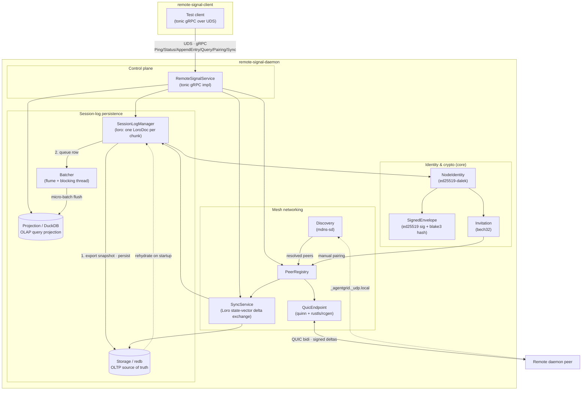

# Remote Signal

## Service Overview

The **Remote Signal** daemon process is meant to compliment the Claudine CLI by providing a long running service which can provide:

1. [Logging](./docs/logging.md)
2. [Scheduling & Queuing](./docs/scheduling-and-queuing.md)
3. [Dreaming](./docs/dreaming.md) (_for Memory Files_)
4. [Remote Execution & Interaction](./docs/remote-execution.md)

## Crate Structure

The implementation is split across three crates:

1. `remote-signal-core` 
    - shared protobuf/gRPC stubs, identity, signed envelopes, invitations, IPC helpers
2. `remote-signal-daemon` 
    - the long-running service
3. `remote-signal-client` (TESTING)
    - a thin gRPC test client. 
    - the local client drives the daemon over a Unix Domain Socket; 
    - the daemon persists session logs through a `redb → Loro → DuckDB` pipeline and syncs with remote peers over an authenticated QUIC mesh.

## High Level Architecture

### Local Interaction Architecture

On a single device/host the interactions are:

### Distributed Architecture

### Tech Stack

- **CRDT Engine:** [`loro`](../docs/research/remote-signal/loro.md) 
  - chosen for its high-performance Movable Tree capabilities and efficient version tracking
  - research found at @claudine/docs/research/remote-signal/loro.md
- **Mesh Networking:** [`web-transport`](../docs/research/remote-signal/web-transport.md)
  - backed natively by `quinn` for QUIC/UDP, 
  - providing a future-proof path to WebAssembly/Browser clients
  - research found at @claudine/docs/research/remote-signal/web-transport.md
- **Inter-Process Communication (IPC):** 
  - **gRPC** via `tonic` over Unix Domain Sockets (UDS) or Named Pipes.
  - research found at @claudine/docs/research/remote-signal/tonic.md
- **Transactional Storage (OLTP):** `redb` 
  - Embedded, high-performance Key-Value store for CRDT binary snapshots and deltas).
  - research found at @claudine/docs/research/remote-signal/redb.md
- **Analytical Storage (OLAP):** `duckdb` 
  - embedded columnar database for fast SQL queries on resolved document state
  - research found at @claudine/docs/research/remote-signal/duckdb.md
- **Async Runtime:** `tokio`
  - we will use the `tokio` runtime
  - research found at @claudine/docs/researchremote-signal//tokio.md
- **Signaling / Bootstrap:** `axum`
  - HTTPS/WebSocket for initial peer discovery
  - research found at @claudine/docs/research/remote-signal/axum.md
