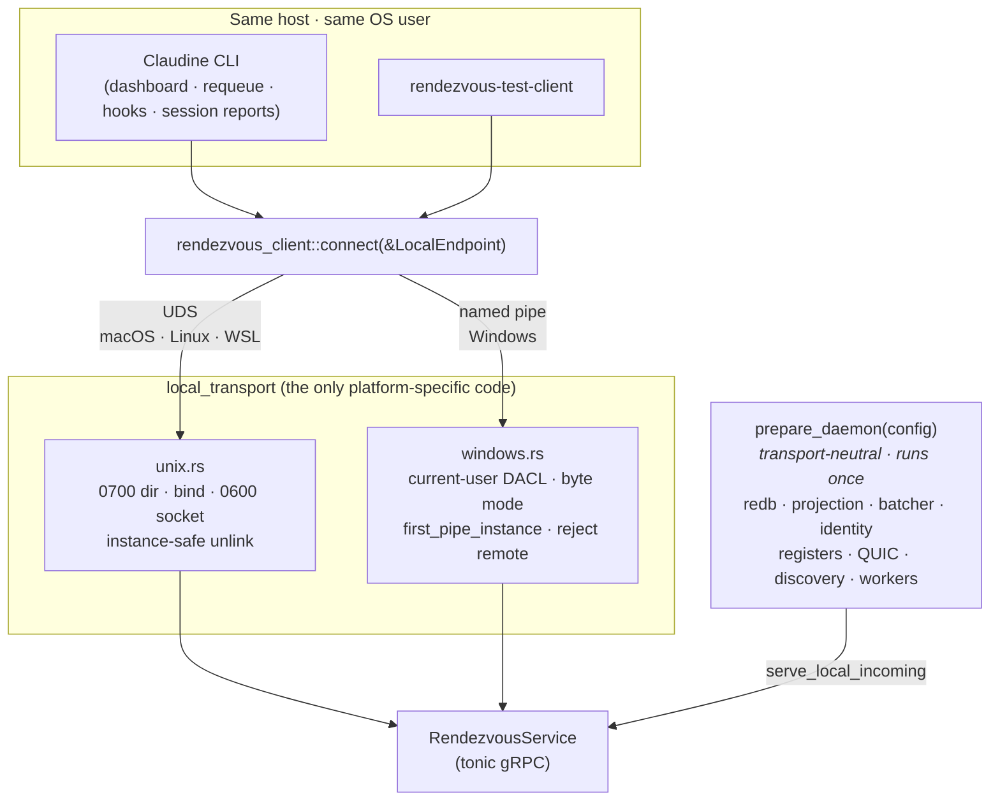
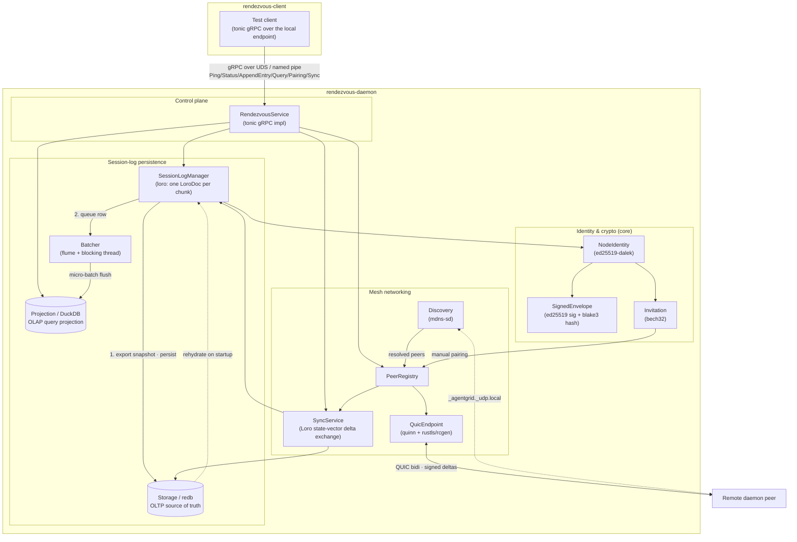

# Rendezvous

## Service Overview

The **Rendezvous** daemon process is meant to compliment the Claudine CLI by providing a long running service which can provide:

1. [Logging](./docs/logging.md)
2. [Scheduling & Queuing](./docs/scheduling-and-queuing.md)
3. [Dreaming](./docs/dreaming.md) (_for Memory Files_)
4. [Remote Execution & Interaction](./docs/remote-execution.md)

## Crate Structure

The implementation is split across three crates:

1. `rendezvous-core` 
    - shared protobuf/gRPC stubs, identity, signed envelopes, invitations, and the typed `LocalEndpoint` contract
2. `rendezvous-daemon` 
    - the long-running service
    - owns local-endpoint and data-root authorization, listener setup, and cleanup
3. `rendezvous-client` (TESTING)
    - a thin gRPC test client, plus the portable `connect(&LocalEndpoint)` used by the Claudine CLI
    - the local client drives the daemon over the platform's local endpoint;
    - the daemon persists session logs through a `redb → Loro → DuckDB` pipeline and syncs with remote peers over an authenticated QUIC mesh.

## Two Planes

The daemon speaks over two deliberately separate planes:

| Plane | Transport | Reach | Authorized by |
|---|---|---|---|
| **Local control** | tonic gRPC over a Unix-domain stream socket (macOS, Linux, WSL) or a Windows named pipe (native Windows) | Same host, same OS user | The OS: socket/directory ownership and modes on Unix, a current-user pipe DACL on Windows |
| **Remote mesh** | QUIC (`quinn`) | Explicitly paired nodes, any host | Per-node Ed25519 signatures on every envelope |

Local gRPC is never exposed across hosts, and QUIC is never a local fallback.
Both are implemented and runtime-tested on macOS, Linux, and Windows.

The local plane is **per stable OS user** — the effective UID on Unix, the
process token's account SID on Windows, never a username. Exactly one daemon,
node identity, data root, and endpoint per account.

**The authoritative local-IPC contract is
[`claudine/docs/rendezvous/local-ipc.md`](../docs/rendezvous/local-ipc.md)**:
transport selection, endpoint resolution and overrides, Unix permissions and
cleanup, the Windows DACL and accept behavior, WSL separation, the client
error/retry vocabulary, and the threat boundary.

## High Level Architecture

### Local Interaction Architecture

On a single device/host, one portable `spawn_local_server` binds the endpoint to
a transport-neutral daemon that is built exactly once:

### Distributed Architecture

### Tech Stack

- **CRDT Engine:** [`loro`](../docs/research/rendezvous/loro.md) 
  - chosen for its high-performance Movable Tree capabilities and efficient version tracking
  - research found at @claudine/docs/research/rendezvous/loro.md
- **Mesh Networking:** [`web-transport`](../docs/research/rendezvous/web-transport.md)
  - backed natively by `quinn` for QUIC/UDP, 
  - providing a future-proof path to WebAssembly/Browser clients
  - research found at @claudine/docs/research/rendezvous/web-transport.md
- **Inter-Process Communication (IPC):** 
  - **gRPC** via `tonic` over Unix domain sockets (macOS, Linux, WSL) or Windows named pipes
  - per stable OS user; modeled by the typed `LocalEndpoint`, never a bare path
  - contract: [`local-ipc.md`](../docs/rendezvous/local-ipc.md)
  - research found at @claudine/docs/research/rendezvous/tonic.md
- **Transactional Storage (OLTP):** `redb` 
  - Embedded, high-performance Key-Value store for CRDT binary snapshots and deltas).
  - research found at @claudine/docs/research/rendezvous/redb.md
- **Analytical Storage (OLAP):** `duckdb` 
  - embedded columnar database for fast SQL queries on resolved document state
  - research found at @claudine/docs/research/rendezvous/duckdb.md
- **Async Runtime:** `tokio`
  - we will use the `tokio` runtime
  - research found at @claudine/docs/researchrendezvous//tokio.md
- **Signaling / Bootstrap:** `axum`
  - HTTPS/WebSocket for initial peer discovery
  - research found at @claudine/docs/research/rendezvous/axum.md
