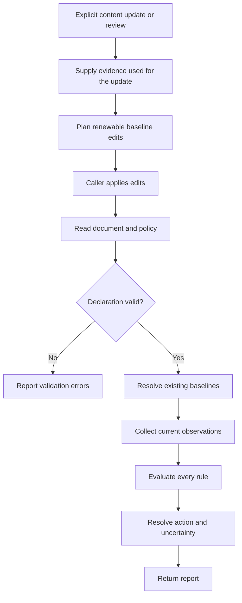

# Policy Evaluation and Renewal

**Status: planned.** Content Policy is in design review. This page describes the
agreed lifecycle; details labeled proposed have not yet been approved or built.

Use content policies to tell an application when a Markdown document needs a
refresh or should leave active use. A document can carry both kinds of rule:

```yaml
---
last_updated: 2026-09-28
content-policy:
  - rule: ValidFor(3mo, @last_updated)
    action: refresh
  - rule: ValidUntil(2027-01-01)
    action: archive
---
```

`ValidFor` measures an interval from the recorded update date. `ValidUntil` has a
fixed deadline. Updating the first date does not move the second.

## Keep the Baseline with the Document

A baseline records what the content was based on. For a time policy this can be
an inline date, `ValidFor(3mo, 2026-09-28)`, or a reference,
`ValidFor(3mo, @last_updated)`. The `@` prefix means a frontmatter property
reference in that argument position. No sidecar is required.

The proposed shorthand `ValidFor(3mo)` uses a configurable default date property,
initially `last_updated`. The proposed default policy for documents without a
policy is `ValidFor(6mo)`. Missing baseline evidence produces `unknown`; checking
a document does not invent an update date.

Future relative policies need different evidence. A package rule needs the
version used during research; a file rule needs a content fingerprint. A shared
`last_updated` date cannot replace those observations.

## Evaluate Without Renewing



Evaluation reads existing state. Renewal records a content update or review.
For example, a stale three-month rule can renew when `last_updated` is explicitly
advanced after review. Merely running the evaluator again leaves it stale.

`Evergreen` never triggers and `TimeSensitive` always triggers; neither has a
baseline to advance. `ValidUntil` is nonrenewable: once its deadline passes,
ordinary renewal does not clear it. Changing that deadline is a policy edit.

Proposed renewal behavior preserves references and edits their target properties.
If one property supplies both a renewable baseline and a nonrenewable deadline,
the renewal must surface that conflict rather than silently move the deadline.

## Choose the Action

A compact rule defaults to `refresh`:

```yaml
content-policy:
  - ValidFor(3mo, @last_updated)
```

An explicit action can request retirement instead:

```yaml
content-policy:
  - rule: ValidFor(3mo, @last_updated)
    action: archive
```

Renewability describes how the rule's baseline can advance. Action describes
what to do when the rule triggers. These are independent choices.

When multiple rules trigger, use **`remove` > `archive` > `refresh`**. For
example, simultaneous refresh and removal triggers produce an effective action
of `remove`. Keep both triggered rules in the report so the decision is
explainable. Declaration order does not affect the result.

The consuming application executes the action. Evaluation itself does not
refresh, archive, or remove a document.

## Understand Incomplete Evidence

A valid rule can be triggered, not triggered, or unknown. A missing baseline or
failed observation is unknown. An invalid rule declaration is a validation error.
Neither should silently become a successful freshness check.

| Evidence | Document status | Effective action |
| --- | --- | --- |
| All rules evaluated; none triggered | Fresh | None |
| No confirmed trigger; some unknown | Unknown | None |
| Highest confirmed action is refresh | Stale | Refresh |
| Highest confirmed action is archive/remove | Expired | Archive/remove |

Unknown rules cannot nominate actions. However, an unknown removal rule could
outrank a confirmed refresh. Report that refresh as the highest confirmed action
and mark action resolution incomplete.

If removal is already confirmed, an unknown refresh cannot change the winner.
Action resolution is complete even though evaluation still has an unknown
result. Consumers need both completeness indicators.

## Library Ownership

The library defines policy meaning, interprets baselines, compares observations,
and resolves actions. Providers obtain facts from the outside world. Optional
bundled integrations are planned for existing package, file, symbol, and web
capabilities; callers can substitute their own providers.

For example, a package provider reports a release version. The policy evaluator
decides whether that version crosses the configured major or minor boundary.
Time policies need only the document data and an explicit evaluation time.

The proposed first implementation covers time and constant rules, followed by
file content changes. Exact date boundaries, structured declaration syntax,
reference traversal, and CLI renewal syntax remain under design review.
