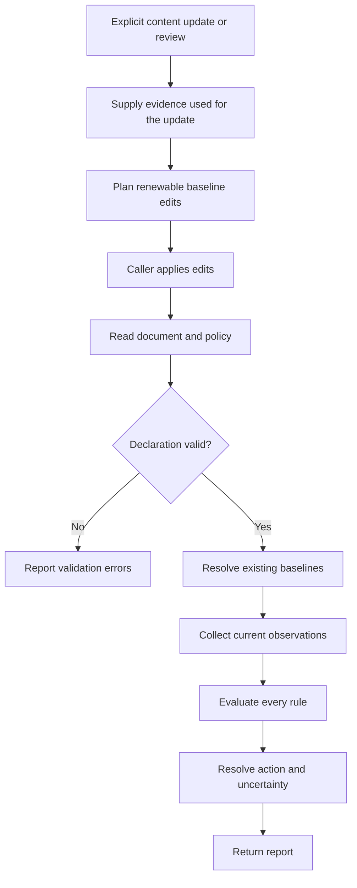
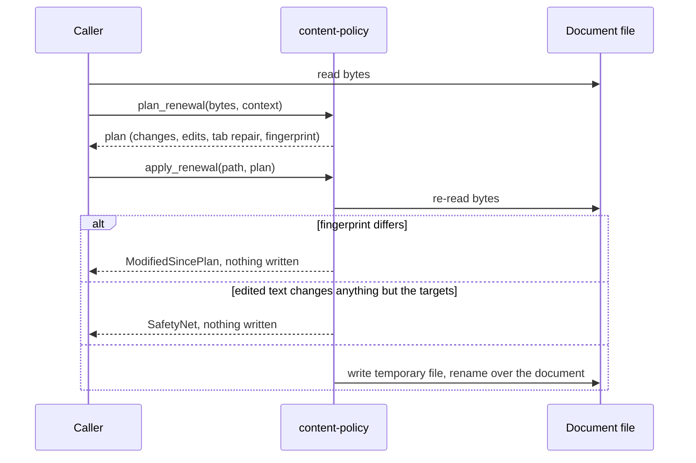
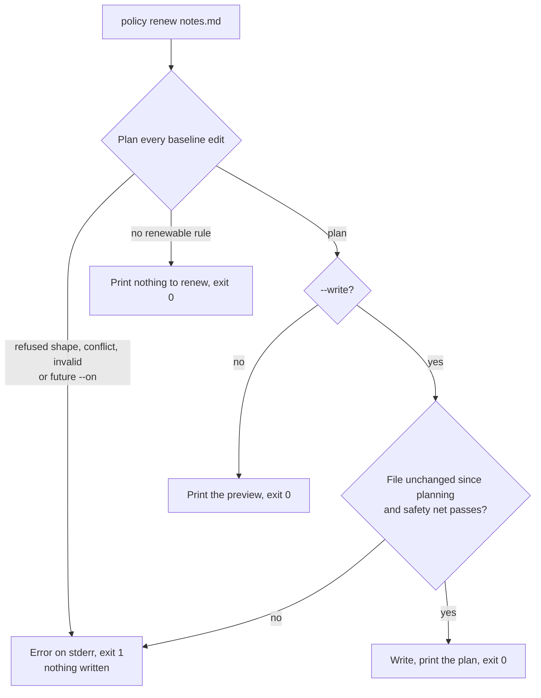

# Policy Evaluation and Renewal

**Status: in progress.** The time and constant rules (`Evergreen`,
`TimeSensitive`, `ValidFor`, and `ValidUntil`) are built end to end: the
library's frontmatter reader, evaluation, renewal, the `policy` CLI, and the
editor schema. `FileChanged` and the reference to the editor schema from
Darkmatter's base document schema are **planned**; the sections on them
describe the agreed design.

Use content policies to tell an application when a Markdown document needs a
refresh or should leave active use. A document can carry both kinds of rule:

```yaml
---
last_updated: 2026-09-28
content_policy:
  - rule: ValidFor(3mo, @last_updated)
    action: refresh
  - rule: ValidUntil(2027-01-01)
    action: archive
---
```

`ValidFor` measures an interval from the recorded update date. `ValidUntil` has a
fixed deadline. Updating the first date does not move the second.

## Keep the Baseline with the Document

A baseline records what the content was based on. For a time policy this can be
an inline date, `ValidFor(3mo, 2026-09-28)`, or a reference,
`ValidFor(3mo, @last_updated)`. The `@` prefix means a frontmatter property
reference in that argument position. No sidecar is required.

A reference names one top-level property. A dotted path such as
`@review.last_checked` is a validation error, not a lookup inside `review`.

The shorthand `ValidFor(3mo)` uses a configurable default date property,
`last_updated` unless the caller chooses another. Missing baseline evidence
produces `unknown`; checking a document does not invent an update date.

A document without a policy is always evaluated under a default policy. The
built-in default is `ValidFor(6mo)`. A caller can replace it with any policy
but cannot remove it, so every valid document gets a status. A consumer that
must never treat an undeclared document as fresh, such as a cache, sets its
default to `TimeSensitive`, so anything without a policy is always recomputed.

An empty list is not the same as no policy. `content_policy: []` is a
validation error, and the message suggests `Evergreen`, the rule that says a
document never expires:

```yaml
content_policy:
  - Evergreen
```

A date is written `YYYY-MM-DD` and must be a real calendar date. Quoting it or
not makes no difference. Anything else in a date position is handled as follows:

| Value | Result |
| --- | --- |
| Property absent, or present with no value (`last_updated:`) | Missing baseline: `unknown` |
| `2026-02-30`, `Sept 28`, or another string that is not a date | Validation error |
| A timestamp such as `2026-09-28T10:00:00Z` | Validation error; only dates are supported |
| A number, `true`/`false`, a list, or a mapping | Validation error |

Watch for YAML spellings that do not mean what they look like. `yes`, `on`,
and `010` arrive as strings, so in a date position they are invalid dates;
`True` is a boolean; `.inf` and `.nan` arrive as empty values, so they read as
a missing baseline.

Frontmatter that repeats a top-level key is also a validation error, because
YAML tools disagree about which copy wins.

The reader is strict about YAML, with one exception. Frontmatter indented with
tabs, which YAML forbids but Darkmatter tolerates, is repaired in memory:
`policy check` reports on the repaired text with a warning, and `policy renew`
offers the repair as an edit of its own. Frontmatter that Darkmatter reads only
by protecting unquoted `{{ }}` templates is rejected, and the message says so;
quote the template to fix it.

### When a Date Takes Effect

Every date takes effect at the start of its day, 00:00 UTC. **The named day is
not included**, whatever the host's timezone:

| Rule | Last day not triggered | First day triggered |
| --- | --- | --- |
| `ValidUntil(2027-01-01)` | December 31, 2026 | January 1, 2027, from 00:00 UTC |
| `ValidFor(3mo, 2026-09-28)` | December 27, 2026 | December 28, 2026, from 00:00 UTC |

A duration is a positive whole number with one unit: `d` (days), `wk` (weeks),
`mo` (calendar months), or `yr` (calendar years). A month or year that lands on
a day the destination month lacks moves back to that month's last day: January
31 plus `1mo` is February 28 in a non-leap year. Only dates are supported;
timestamps are not.

Policies live under the `content_policy` key by default (snake_case, like the
repository's other frontmatter keys); a caller can choose a different key.
Some early research notes used a `Duration(3mo)` rule, some of them under an
`update_policy:` key. `Duration` is not a rule name and is reported as a
validation error, so write `ValidFor(3mo)` instead. `update_policy:` is not
read at all: a document that has only that key is evaluated under the default
policy. The existing notes have been migrated to
`content_policy: - ValidFor(...)`, with each `update_policy:` key removed. An
entry that has no rule yet, such as a major-version check, is kept only as a
YAML comment beside the migrated rule, so it is visibly not enforced:

```yaml
content_policy:
  - ValidFor(1yr) # pending: MajorVersion(latest_version)
```

Relative policies need different evidence. A package rule needs the version
used during research; a file rule needs a content fingerprint. A shared
`last_updated` date cannot replace those observations.

### Watch a File for Changes

A planned `FileChanged` rule names a file and the frontmatter property that
holds its content fingerprint:

```yaml
config_fingerprint: blake3-lf:9f2c41…e7
content_policy:
  - FileChanged(src/config.rs, @config_fingerprint)
```

The property reference is required; `FileChanged(src/config.rs)` on its own is
a validation error. Each watched file gets its own property, so two rules never
overwrite each other's fingerprint.

A fingerprint is written `<scheme>:<hex>`. The scheme says how the file was
hashed:

- `blake3-lf`, the default, converts CRLF line endings to LF before hashing.
  A text file checked out on Windows with CRLF endings has the same
  fingerprint as on macOS or Linux, so it does not read as changed.
- `blake3` hashes the raw bytes. Use it for binary files, where CRLF is data.

You do not compute the fingerprint by hand; `policy renew` writes it (see
below), and it keeps whichever scheme the property already uses.

| Situation | Rule result |
| --- | --- |
| The file's fingerprint matches the stored one | Not triggered |
| The file's fingerprint differs | Triggered |
| The file is missing or was deleted | Triggered, reason "source removed" |
| The file exists but cannot be read | Unknown |
| The path names a directory | Unknown |
| The fingerprint property is absent or empty | Unknown (missing baseline) |
| The stored scheme is not recognized | Unknown; never proof of a change or of freshness |

#### Which Files a Rule Can Watch

A rule watches files that travel with the document. The path must resolve to a
file inside a **boundary**:

- in a Git repository, the repository root;
- outside a repository, the directory the command was started from (the
  document tree root), which stands in for the repository root.

A relative path starts from the document's directory. A library caller
evaluating a record with no document behind it passes that directory instead;
the boundary is always discovered, never passed in.

| Path | Accepted? |
| --- | --- |
| `src/config.rs`, `./config.rs` | Yes |
| `../src/config.rs` | Yes, while it stays inside the boundary |
| `&Cargo.toml` (from the repository root), `^README.md` (package, then package area, then repository root) | Yes; outside a repository both resolve from the document tree root |
| `/etc/hosts`, `C:\x`, `src\config.rs` | No: absolute paths and backslashes mean different files on different machines |
| `~/x`, `@x`, `%x`, `vault:x`, `{{HOME}}/x`, a URL | No: they depend on the machine or its environment |
| `" src/config.rs"` (leading or trailing space) | No |
| Any path that ends up outside the boundary | No |

A rejected path is a validation error, and so is a path that escapes the
boundary. Outside a repository there are no packages, so `^` falls back to the
document tree root and names the same file as `&`. The boundary, and so the
file a sigil names, depends on where you run the command: a rule in `~/writing/notes/doc.md` that
watches `../drafts/x.md` is valid when checked from `~/writing` and invalid
when checked from `~/writing/notes`. Inside a repository the answer is the
same wherever you run it.

A path cannot contain `,` or `)`, because those end a rule's argument. A path
that contains ` #` or `: ` confuses YAML, which reads the first as a comment
and the second as a key; quote the whole rule to use one:

```yaml
content_policy:
  - "FileChanged(notes/a #1.md, @notes_fingerprint)"
```

## Evaluate Without Renewing



Evaluation reads existing state. Renewal records a content update or review.
For example, a stale three-month rule can renew when `last_updated` is explicitly
advanced after review. Merely running the evaluator again leaves it stale.

`policy renew` is not the only thing that advances `last_updated`. Darkmatter's
`md hash` bumps it when a document's content hash changes, Darkmatter's effect
writes do the same when they re-hash a document, and Claudine stamps it
whenever it writes a document back. Each of those is a content update, so it
renews every rule whose baseline is `@last_updated`, including the
`ValidFor(3mo)` shorthand. Only `policy renew` also updates inline dates such as
`ValidFor(3mo, 2026-09-28)`.

A baseline dated later than today's UTC date reads as inconsistent and produces
`unknown`. That is why every stamp is a UTC date: a local date written just after
midnight east of Greenwich would be a day ahead. All three of those writers
stamp the UTC date for this reason.

Renewal also records a baseline that is missing, such as an absent or empty
`last_updated` or fingerprint property. This first capture needs no extra
flag: the preview labels it "new baseline", separately from values being
renewed, and nothing is written until you add `--write`. A document with no
frontmatter is evaluated under the default policy; renewing it creates a
frontmatter block holding `last_updated` and leaves the body untouched.

`Evergreen` never triggers and `TimeSensitive` always triggers; neither has a
baseline to advance. `ValidUntil` is nonrenewable: once its deadline passes,
ordinary renewal does not clear it. Changing that deadline is a policy edit.

Renewal preserves references and edits their target properties.
If one property supplies both a renewable baseline and a nonrenewable deadline,
the renewal must surface that conflict rather than silently move the deadline.

Renewal edits only the bytes of the values it changes, so comments,
quoting, key order, line endings, a byte-order mark, and the Markdown body
survive untouched. The one exception is tab-indented frontmatter: the preview
lists the tab repair as its own edit, and `--write` applies it along with the
dates. An empty `last_updated:` is filled in as `last_updated: 2026-09-28`,
and a trailing comment stays after the new value.

A missing property is added as one new line at the end of the frontmatter
block, using the line ending of the line above it. One case moves it up: when
the block ends with a block scalar that keeps its final line break (`|` or
`>`, not `|-`), a line after it would add that break to the scalar's value, so
the new property goes in front of that last entry instead:

```yaml
title: Notes
last_updated: 2026-09-28   # added here, not after `note`
note: |
  Text whose value stays "Text"
```

Renewal writes one date, the **update date**. It defaults to today's UTC date;
an earlier date can be given, such as the day the content was regenerated, but
a later one is rejected, because evaluation would read it as inconsistent. A
baseline that already holds the update date is reported as unchanged. A
baseline property that holds something other than a date, such as
`last_updated: Sept 28`, is an error: renewal records updates and does not
repair values.

That precision limits which YAML shapes renewal can edit. It refuses, and
writes nothing, when:

- a value it must change sits inside a one-line bracketed (flow-style) policy
  list, or inside an entry written as `- {rule: …, action: …}`
- a value it must change is a block scalar or spans several lines
- a value it must change is a double-quoted string containing escape sequences
- a value it must change carries a YAML anchor, alias, or tag, such as
  `last_updated: &lu 2026-09-28`; changing an anchored value would silently
  change every alias of it too
- the frontmatter block has no closing `---` (a `...` closing line included),
  or its fences are near misses such as `----`

As a final check, renewal re-reads its result. If anything other than the
values it meant to change came out different, it writes nothing.

A bracketed list is fine when nothing inside it changes. Both of these renew
the same way, because the only edit is the `last_updated` line:

```yaml
last_updated: 2026-09-28
content_policy:
  - ValidFor(3mo, @last_updated)
```

```yaml
last_updated: 2026-09-28
content_policy: ["ValidFor(3mo, @last_updated)"]
```

The quotes in the second form are required. Without them the comma splits the
rule, the second half starts with `@`, which YAML reserves, and the frontmatter
does not parse at all.

An inline date is different. In a block list renewal edits it in place; inside
brackets it is refused:

```yaml
content_policy: ["ValidFor(3mo, 2026-09-28)"]   # refused: the date is inside the list
```

The error message suggests rewriting the policy as a block list:

```yaml
content_policy:
  - ValidFor(3mo, 2026-09-28)
```

Evaluation reads a flow-style list, with one trap. Inside YAML's `[...]` syntax
a comma separates items, so this is a list of two broken strings,
`ValidFor(3mo` and `2026-09-28)`:

```yaml
content_policy: [ValidFor(3mo, 2026-09-28)]   # split at the comma
```

The YAML itself is valid, so the policy check reports the error and shows the
block-list form above as the fix.

### Renew from a Library

The CLI is not the only way to renew. A library caller plans a renewal from a
document's bytes, previews it, and applies it:

```rust
use chrono::NaiveDate;
use content_policy::{RenewalContext, apply_renewal, plan_renewal};

let path = std::path::Path::new("notes.md");
let bytes = std::fs::read(path)?;
// `RenewalContext::now()` uses the system clock's UTC date; tests pass a date.
let context = RenewalContext::now().with_document("notes.md");
let plan = plan_renewal(&bytes, &context)?;
if plan.nothing_to_renew() {
    println!("nothing to renew");
} else {
    for change in &plan.changes {
        println!("{:?} -> {:?} ({:?})", change.target, change.value, change.kind);
    }
    apply_renewal(path, &plan)?; // re-reads the file and writes atomically
}
```

Planning never writes. Applying only writes to the exact bytes the plan was
made from, and only if the edited text passes the safety net:



A plan holds these fields. `policy renew --json` prints the plan in this
shape, and the names are stable:

| Field | Meaning |
| --- | --- |
| `update_date` | The date every renewed baseline receives |
| `fingerprint` | `xxh64:` and 16 hex digits of the bytes planned from; never written to the document |
| `policy` | The policy's source (`declared` or `defaulted`), grammar version, and identity, as in a report |
| `changes` | One per baseline: its `target` (an `inline` date in entry N, or a `property`), the entries it serves, its `kind` (`renewed`, `new_baseline`, or `unchanged`), and the previous and new dates |
| `edits` | The byte edits that make those changes, in document offsets |
| `tab_repair` | The tab-indentation repair, listed separately and applied with `edits` |

Several rules that share one property, such as `ValidFor(3mo)` and
`ValidFor(1yr, @last_updated)`, produce one change listing both entries. A
plan with no changes means the policy has nothing to renew.

Planning fails, and returns no plan, for a future update date, unreadable or
invalid frontmatter, a baseline value that is not a date, a conflict (a
renewed property that is also a `ValidUntil` deadline), or any refused shape.
Every refusal and conflict is listed, not only the first. `RenewalPlan::apply_to`
does the same checks on bytes in memory, for a caller that stores documents
somewhere other than a file.

## Choose the Action

A compact rule defaults to `refresh`:

```yaml
content_policy:
  - ValidFor(3mo, @last_updated)
```

An explicit action can request retirement instead:

```yaml
content_policy:
  - rule: ValidFor(3mo, @last_updated)
    action: archive
```

Renewability describes how the rule's baseline can advance. Action describes
what to do when the rule triggers. These are independent choices.

When multiple rules trigger, use **`remove` > `archive` > `refresh`**. For
example, simultaneous refresh and removal triggers produce an effective action
of `remove`. Keep both triggered rules in the report so the decision is
explainable. Declaration order does not affect the result.

The consuming application executes the action. Evaluation itself does not
refresh, archive, or remove a document.

A document also does not say how a consumer should behave while it is stale;
each consumer maps the action to its own response. A cache, for example, treats
`refresh` as "recompute" and `archive` or `remove` as a miss, while a model
catalog might keep serving its data with a warning. Two consumers can read the
same document and respond differently.

## Understand Incomplete Evidence

A valid rule can be triggered, not triggered, or unknown. A missing baseline or
failed observation is unknown. An invalid rule declaration is a validation error.
Neither should silently become a successful freshness check.

| Evidence | Document status | Effective action |
| --- | --- | --- |
| All rules evaluated; none triggered | Fresh | None |
| No confirmed trigger; some unknown | Unknown | None |
| Highest confirmed action is refresh | Stale | Refresh |
| Highest confirmed action is archive/remove | Expired | Archive/remove |

Unknown rules cannot nominate actions. However, an unknown removal rule could
outrank a confirmed refresh. Report that refresh as the highest confirmed action
and mark action resolution incomplete.

If removal is already confirmed, an unknown refresh cannot change the winner.
Action resolution is complete even though evaluation still has an unknown
result. Consumers need both completeness indicators.

## Read a Report

An evaluation returns a report only when every entry is valid. Any invalid
entry, or a date property holding something that is not a date, produces a
list of diagnostics instead, one per problem, and no status at all. A partial
verdict could understate the action: the invalid entry might be the only
`remove` rule.

A report serializes to JSON with these fields. The names are stable:

```json
{
  "document": "notes.md",
  "evaluated_at": "2026-12-28T00:00:00Z",
  "policy": { "source": "declared", "grammar_version": 1, "identity": "xxh64:…" },
  "status": "stale",
  "action": "refresh",
  "evaluation_complete": true,
  "action_resolution_complete": true,
  "results": [
    {
      "index": 0,
      "rule": "ValidFor(3mo, @last_updated)",
      "action": "refresh",
      "renewal": "renewable",
      "result": "triggered",
      "unknown_reason": null,
      "baseline": { "source": "property", "property": "last_updated", "value": "2026-09-28" },
      "deadline": null,
      "due": "2026-12-28",
      "reason": "Validity interval elapsed"
    }
  ],
  "warnings": []
}
```

| Field | Meaning |
| --- | --- |
| `document` | The document label as the caller gave it (never canonicalized), or `null` |
| `policy.source` | `declared`, or `defaulted` when the document had no policy key |
| `policy.identity` | Digest of the rules and actions (see [Library Ownership](#library-ownership)) |
| `status` | `fresh`, `unknown`, `stale`, or `expired` |
| `action` | The winning confirmed action, or `null` |
| `results[].rule` | The rule in canonical form, such as `ValidFor(3mo, 2026-09-28)` |
| `results[].renewal` | `renewable` (`ValidFor`), `nonrenewable` (`ValidUntil`), or `no_baseline` |
| `results[].result` | `triggered`, `not_triggered`, or `unknown` |
| `results[].unknown_reason` | `missing_baseline` (absent or empty date) or `inconsistent_baseline` (a baseline after the evaluation date); `null` otherwise |
| `results[].baseline` / `deadline` | Where the `ValidFor` start or the `ValidUntil` deadline came from: `inline`, `property`, or `default_property`, with the property name and date |
| `results[].due` | The date the rule triggers from, at 00:00 UTC |
| `warnings` | Reader warnings, such as `tab_indentation_repaired` |

A library caller evaluates in one of three ways:

- `evaluate_document` reads Markdown bytes through the library's frontmatter
  reader;
- `evaluate_record` takes a map of property names to JSON values that the
  caller already holds, such as Darkmatter's parsed frontmatter, and reads the
  policy from its key;
- `evaluate_policy` takes an explicit policy and a map, such as a cache
  manifest with no document behind it.

Each takes the evaluation time explicitly. None of them writes anything, so
checking a document never records a baseline.

A policy can also be stored on its own as JSON, for example in a cache
manifest:

```json
{"grammar_version":1,"entries":[{"rule":"ValidFor(30d, @generated_on)","action":"refresh"}]}
```

Reading it back is strict. A missing, `null`, or duplicated field, an unknown
field, trailing text, an empty `entries` list, or a `grammar_version` newer
than the library's is an error, never a policy.

## Check and Renew from the CLI

The `policy` command has two subcommands:

```sh
policy check notes.md                  # report (add --plain or --json)
policy check --at 2027-01-01 notes.md  # evaluate as of a chosen date
policy renew notes.md                  # preview the renewal edits
policy renew notes.md --write          # apply them
```

Each takes one document path, and the report labels the document with the path
exactly as you typed it.

### Read the Check Output

By default `policy check` prints a one-line summary and a table of entries,
styled for the terminal. `--plain` prints the same text with no colors or other
styling, and `--json` prints the [report](#read-a-report) and nothing else:

```text
$ policy check --plain --at 2026-12-28 notes.md
notes.md: stale, action refresh (declared policy, evaluated 2026-12-28 00:00 UTC)
┌───┬─────────────────────┬─────────┬───────────┬─────────────────┬────────────┐
│ # │ Rule                │ Action  │ Result    │ Date            │ Due        │
├───┼─────────────────────┼─────────┼───────────┼─────────────────┼────────────┤
│ 1 │ ValidFor(3mo,       │ refresh │ triggered │ 2026-09-28      │ 2026-12-28 │
│   │ @last_updated)      │         │           │ (@last_updated) │            │
│ 2 │ ValidUntil(2027-01- │ archive │ not       │ 2027-01-01      │ 2027-01-01 │
│   │ 01)                 │         │ triggered │ (inline)        │            │
└───┴─────────────────────┴─────────┴───────────┴─────────────────┴────────────┘
```

The summary names the status, the winning action, and whether the policy was
declared or is the default. When an unknown entry could still raise the action,
it says so. The `Date` column shows where each baseline or deadline came from,
and an unknown result names its reason, such as `unknown (missing baseline)`.
Reader warnings, such as the notice that tab-indented frontmatter was repaired
in memory, print below the table as part of the report, not on stderr.

`--at <YYYY-MM-DD>` evaluates at 00:00 UTC on that date instead of now. It
shows what a check will report on a later date, or what it reported on an
earlier one, as long as that date is not before any baseline the document now
holds. Before a baseline, the rule has no valid starting point and reports
`unknown`, so after a renewal `--at` cannot reproduce the verdicts from before
it.

### Exit Codes

| Exit | `policy check` | `policy renew` |
| --- | --- | --- |
| `0` | A report was produced, whatever its status: `stale`, `expired`, and `unknown` included | A preview was printed, the edits were written, or there was nothing to renew |
| `1` | An invalid declaration, an unreadable file, or malformed frontmatter | Any error; nothing is written |
| `2` | A usage error, such as an unknown flag or a date not in `YYYY-MM-DD` form | The same |

Errors go to stderr as text, in `--json` mode too, so stdout holds either the
whole report or nothing. An invalid declaration lists every invalid entry:

```text
$ policy check --json notes.md
error: notes.md: invalid content policy
  entry 1: unknown rule `Duration`; write `ValidFor` instead, such as `ValidFor(3mo)`
  entry 2 action: unknown action `delete`; expected `refresh`, `archive`, or `remove` (case-sensitive)
```

### Ask Whether a Document Needs Action

`policy check --needs-action` answers "does this document need action?" by
printing `true` (stale or expired), `false` (fresh), or `unknown` (no trigger
is confirmed and not every rule could be evaluated). A confirmed trigger prints
`true` even when another entry is unknown. It exits `0` for all three answers;
`1` means an error, and `2` a usage error. It cannot be combined with `--json`.
The answer is printed rather than signaled by exit code because a shell `if`
treats any non-zero exit as false and would quietly read `unknown` as fresh.
Compare the text instead:

```sh
case "$(policy check --needs-action notes.md)" in
  true)    echo "notes.md needs a refresh, archive, or removal" ;;
  false)   echo "notes.md is fresh" ;;
  unknown) echo "notes.md could not be fully evaluated; read the report" ;;
  *)       echo "policy check failed" >&2; exit 1 ;;
esac
```

### Renew from the Command Line



`policy renew` changes nothing unless `--write` is given. `--on <YYYY-MM-DD>`
sets the update date, which defaults to today's UTC date and cannot be in the
future. The preview lists one row per baseline, labels a first capture "new
baseline", and lists a tab repair as its own item:

```text
$ policy renew --plain notes.md
notes.md: renewal on 2026-10-01 (preview; pass --write to apply)
┌──────────────┬─────────┬──────────────┬────────┬────────────┐
│ Baseline     │ Entries │ Change       │ From   │ To         │
├──────────────┼─────────┼──────────────┼────────┼────────────┤
│ last_updated │ 1       │ new baseline │ (none) │ 2026-10-01 │
└──────────────┴─────────┴──────────────┴────────┴────────────┘
tab repair: 1 frontmatter line(s) indented with tabs, which YAML forbids, are re-indented with two spaces per tab
```

With `--write` the same output says `written`. `--json` prints the
[plan](#renew-from-a-library) instead, with or without `--write`. A policy with
nothing to renew, such as `Evergreen`, `TimeSensitive`, or a lone `ValidUntil`,
prints "nothing to renew" and exits `0`.

### Configure the Key, Default Policy, and Date Property

Both subcommands take three settings. Each flag falls back to an environment
variable, then to a built-in value:

| Flag | Environment variable | Built-in value |
| --- | --- | --- |
| `--key <name>` | `CONTENT_POLICY_KEY` | `content_policy` |
| `--default-policy <policy>` | `CONTENT_POLICY_DEFAULT` | `ValidFor(6mo)` |
| `--date-property <name>` | `CONTENT_POLICY_DATE_PROPERTY` | `last_updated` |

```sh
export CONTENT_POLICY_DEFAULT='TimeSensitive'
policy check notes.md                                   # default: TimeSensitive
policy check --default-policy 'ValidFor(1yr)' notes.md  # the flag wins
```

A default policy is one compact rule, whose action is `refresh`, or, when the
value starts with `[`, a YAML flow list of entries in either form:

```sh
policy check --default-policy \
  '["ValidFor(3mo)", {rule: "ValidUntil(2027-01-01)", action: archive}]' notes.md
```

The list follows the same rules as a declaration, including the comma trap:
quote any rule that contains a comma. `--default-policy` always takes a policy;
there is no way to turn the default off. An empty or invalid value, from the
flag or the environment variable, is a usage error (exit `2`), as is an empty
key or date property. There is no configuration file.

## Get Help in the Editor

Content Policy ships an editor schema,
[`content-policy/schemas/content-policy.yaml`](../../schemas/content-policy.yaml),
for editors that run DMLS (Darkmatter's language server). It declares three
types:

| Type | Accepts |
| --- | --- |
| `short_form` | One compact rule: `Evergreen`, `TimeSensitive`, `ValidFor(<duration>)`, `ValidFor(<duration>, @name)`, `ValidFor(<duration>, YYYY-MM-DD)`, `ValidUntil(YYYY-MM-DD)`, or `ValidUntil(@name)` |
| `long_form` | A `{rule, action}` entry, where `action` is `refresh`, `archive`, or `remove` |
| `policy` | One list entry in either form |

With it, the editor suggests rule forms (dates only) and flags an unknown rule
or action, such as `Duration(3mo)`, `ValidFor(3w)`, or `action: delete`,
before the document is ever checked. The schema is a convenience; evaluation
is the authority and checks more. The schema checks a date's shape but not
whether the day exists (`2026-02-30` passes), and it does not flag a
`{rule, action}` entry that is missing `rule`, which evaluation reports.

Today a schema cannot type a whole list of `policy` entries, so the schema
applies to one entry per property. A document can use it through an inline
`$schema` map that names each property, for example while writing or testing a
policy:

```yaml
---
$schema:
  first: "policy@./content-policy.yaml"
  second: "policy@./content-policy.yaml"
first: ValidFor(3mo)
second: {rule: "ValidUntil(2027-01-01)", action: archive}
---
```

Setting a document's `$schema` to the file itself validates nothing, because
the file declares types and no properties.

Darkmatter's base document schema is **planned** to type `content_policy` as a
list of `policy` entries, so that every Markdown document gets these checks
with no `$schema` of its own.

## Library Ownership

The library defines policy meaning, interprets baselines, compares observations,
and resolves actions. Providers obtain facts from the outside world. Optional
bundled integrations are planned for existing package, file, symbol, and web
capabilities; callers can substitute their own providers.

For example, a package provider reports a release version. The policy evaluator
decides whether that version crosses the configured major or minor boundary.
Time policies need only the document data and an explicit evaluation time.

A library caller that already has parsed frontmatter, such as Darkmatter, passes
it directly as a map of property names to JSON values. Everyone else, the CLI
included, goes through the library's own frontmatter reader, so every caller
reads a document the same way.

Each report carries a **policy identity**, a digest of the policy's rules and
actions, which a cache can store to notice when a policy changes. Baseline
values are not part of it: `ValidFor(3mo, 2026-09-28)` and
`ValidFor(3mo, 2026-12-29)` share an identity, and `@last_updated` counts as a
name, not a date. Rule parameters such as durations, deadlines, and file paths
do count. Renewal therefore never changes a policy's identity.

Time and constant rules are built; file content changes (`FileChanged`) are
the next increment.
