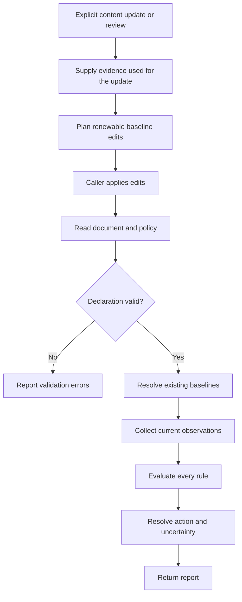

# Policy Evaluation and Renewal

**Status: planned.** Content Policy is in design review. This page describes the
agreed lifecycle; details labeled proposed have not yet been approved or built.

Use content policies to tell an application when a Markdown document needs a
refresh or should leave active use. A document can carry both kinds of rule:

```yaml
---
last_updated: 2026-09-28
content_policy:
  - rule: ValidFor(3mo, @last_updated)
    action: refresh
  - rule: ValidUntil(2027-01-01)
    action: archive
---
```

`ValidFor` measures an interval from the recorded update date. `ValidUntil` has a
fixed deadline. Updating the first date does not move the second.

## Keep the Baseline with the Document

A baseline records what the content was based on. For a time policy this can be
an inline date, `ValidFor(3mo, 2026-09-28)`, or a reference,
`ValidFor(3mo, @last_updated)`. The `@` prefix means a frontmatter property
reference in that argument position. No sidecar is required.

The proposed shorthand `ValidFor(3mo)` uses a configurable default date property,
`last_updated` unless the caller chooses another. Missing baseline evidence
produces `unknown`; checking a document does not invent an update date.

A document without a policy is always evaluated under a default policy. The
built-in default is `ValidFor(6mo)`. A caller can replace it with any policy
but cannot remove it, so every valid document gets a status. A consumer that
must never treat an undeclared document as fresh, such as a cache, sets its
default to `TimeSensitive`, so anything without a policy is always recomputed.

A date is written `YYYY-MM-DD` and must be a real calendar date. Quoting it or
not makes no difference. Anything else in a date position is handled as follows:

| Value | Result |
| --- | --- |
| Property absent, or present with no value (`last_updated:`) | Missing baseline: `unknown` |
| `2026-02-30`, `Sept 28`, or another string that is not a date | Validation error |
| A timestamp such as `2026-09-28T10:00:00Z` | Validation error; only dates are supported |
| A number, `true`/`false`, a list, or a mapping | Validation error |

Frontmatter that repeats a top-level key is also a validation error, because
YAML tools disagree about which copy wins.

Policies live under the `content_policy` key by default (snake_case, like the
repository's other frontmatter keys); a caller can choose a different key.
Some early research notes used a `Duration(3mo)` rule. `Duration` is not a
rule name and is reported as a validation error, so write `ValidFor(3mo)`
instead. The existing notes are planned to be migrated.

Relative policies need different evidence. A package rule needs the version
used during research; a file rule needs a content fingerprint. A shared
`last_updated` date cannot replace those observations.

### Watch a File for Changes

A planned `FileChanged` rule names a file and the frontmatter property that
holds its content fingerprint:

```yaml
config_fingerprint: blake3-lf:9f2c41…e7
content_policy:
  - FileChanged(src/config.rs, @config_fingerprint)
```

The property reference is required; `FileChanged(src/config.rs)` on its own is
a validation error. Each watched file gets its own property, so two rules never
overwrite each other's fingerprint. The CLI resolves the path relative to the
document's directory; a library caller supplies the base directory.

A fingerprint is written `<scheme>:<hex>`. The scheme says how the file was
hashed:

- `blake3-lf`, the default, converts CRLF line endings to LF before hashing.
  A text file checked out on Windows with CRLF endings has the same
  fingerprint as on macOS or Linux, so it does not read as changed.
- `blake3` hashes the raw bytes. Use it for binary files, where CRLF is data.

You do not compute the fingerprint by hand; `policy renew` writes it (see
below), and it keeps whichever scheme the property already uses.

| Situation | Rule result |
| --- | --- |
| The file's fingerprint matches the stored one | Not triggered |
| The file's fingerprint differs | Triggered |
| The file is missing or was deleted | Triggered, reason "source removed" |
| The file exists but cannot be read | Unknown |
| The fingerprint property is absent or empty | Unknown (missing baseline) |
| The stored scheme is not recognized | Unknown; never proof of a change or of freshness |

## Evaluate Without Renewing



Evaluation reads existing state. Renewal records a content update or review.
For example, a stale three-month rule can renew when `last_updated` is explicitly
advanced after review. Merely running the evaluator again leaves it stale.

`policy renew` is not the only thing that advances `last_updated`. Darkmatter's
`md hash` bumps it when a document's content hash changes, Darkmatter's effect
writes do the same when they re-hash a document, and Claudine stamps it
whenever it writes a document back. Each of those is a content update, so it
renews every rule whose baseline is `@last_updated`, including the
`ValidFor(3mo)` shorthand. Only `policy renew` also updates inline dates such as
`ValidFor(3mo, 2026-09-28)`.

A baseline dated later than today's UTC date reads as inconsistent and produces
`unknown`. That is why every stamp is a UTC date: a local date written just after
midnight east of Greenwich would be a day ahead. All three of those writers
currently stamp the local date and are planned to switch to the UTC date for
this reason.

Renewal also records a baseline that is missing, such as an absent or empty
`last_updated` or fingerprint property. This first capture needs no extra
flag: the preview labels it "new baseline", separately from values being
renewed, and nothing is written until you add `--write`. A document with no
frontmatter is evaluated under the default policy; renewing it creates a
frontmatter block holding `last_updated` and leaves the body untouched.

`Evergreen` never triggers and `TimeSensitive` always triggers; neither has a
baseline to advance. `ValidUntil` is nonrenewable: once its deadline passes,
ordinary renewal does not clear it. Changing that deadline is a policy edit.

Proposed renewal behavior preserves references and edits their target properties.
If one property supplies both a renewable baseline and a nonrenewable deadline,
the renewal must surface that conflict rather than silently move the deadline.

Renewal is planned to edit only the bytes of the values it changes, so comments,
quoting, key order, and the Markdown body survive untouched. That precision
limits which YAML shapes it can edit. Renewal refuses, and writes nothing, when:

- a value it must change sits inside a one-line bracketed (flow-style) policy
  list
- a value it must change is a block scalar or spans several lines
- a value it must change is a double-quoted string containing escape sequences

A bracketed list is fine when nothing inside it changes. Both of these renew
the same way, because the only edit is the `last_updated` line:

```yaml
last_updated: 2026-09-28
content_policy:
  - ValidFor(3mo, @last_updated)
```

```yaml
last_updated: 2026-09-28
content_policy: [ValidFor(3mo, @last_updated)]
```

An inline date is different. In a block list renewal edits it in place; inside
brackets it is refused:

```yaml
content_policy: ["ValidFor(3mo, 2026-09-28)"]   # refused: the date is inside the list
```

The error message suggests rewriting the policy as a block list:

```yaml
content_policy:
  - ValidFor(3mo, 2026-09-28)
```

Evaluation reads a flow-style list, with one trap. Inside YAML's `[...]` syntax
a comma separates items, so this is a list of two broken strings,
`ValidFor(3mo` and `2026-09-28)`:

```yaml
content_policy: [ValidFor(3mo, 2026-09-28)]   # split at the comma
```

The YAML itself is valid, so the policy check reports the error and shows the
block-list form above as the fix.

## Choose the Action

A compact rule defaults to `refresh`:

```yaml
content_policy:
  - ValidFor(3mo, @last_updated)
```

An explicit action can request retirement instead:

```yaml
content_policy:
  - rule: ValidFor(3mo, @last_updated)
    action: archive
```

Renewability describes how the rule's baseline can advance. Action describes
what to do when the rule triggers. These are independent choices.

When multiple rules trigger, use **`remove` > `archive` > `refresh`**. For
example, simultaneous refresh and removal triggers produce an effective action
of `remove`. Keep both triggered rules in the report so the decision is
explainable. Declaration order does not affect the result.

The consuming application executes the action. Evaluation itself does not
refresh, archive, or remove a document.

## Understand Incomplete Evidence

A valid rule can be triggered, not triggered, or unknown. A missing baseline or
failed observation is unknown. An invalid rule declaration is a validation error.
Neither should silently become a successful freshness check.

| Evidence | Document status | Effective action |
| --- | --- | --- |
| All rules evaluated; none triggered | Fresh | None |
| No confirmed trigger; some unknown | Unknown | None |
| Highest confirmed action is refresh | Stale | Refresh |
| Highest confirmed action is archive/remove | Expired | Archive/remove |

Unknown rules cannot nominate actions. However, an unknown removal rule could
outrank a confirmed refresh. Report that refresh as the highest confirmed action
and mark action resolution incomplete.

If removal is already confirmed, an unknown refresh cannot change the winner.
Action resolution is complete even though evaluation still has an unknown
result. Consumers need both completeness indicators.

## Check and Renew from the CLI

The planned `policy` command has two subcommands:

```sh
policy check notes.md                  # report (add --plain or --json)
policy check --at 2027-01-01 notes.md  # evaluate as of a chosen date
policy renew notes.md                  # preview the renewal edits
policy renew notes.md --write          # apply them
```

`--at` shows what a check will report on a later date, or what it reported on an
earlier one, as long as that date is not before any baseline the document now
holds. Before a baseline, the rule has no valid starting point and reports
`unknown`, so after a renewal `--at` cannot reproduce the verdicts from before
it.

`policy check --needs-action` answers "does this document need action?" by
printing `true` (stale or expired), `false` (fresh), or `unknown` (not every
rule could be evaluated). It exits `0` for all three answers; `1` means an
error such as an invalid declaration or unreadable file, and `2` a usage error.
The answer is printed rather than signaled by exit code because a shell `if`
treats any non-zero exit as false and would quietly read `unknown` as fresh.
Compare the text instead:

```sh
case "$(policy check --needs-action notes.md)" in
  true)    echo "notes.md needs a refresh, archive, or removal" ;;
  false)   echo "notes.md is fresh" ;;
  unknown) echo "notes.md could not be fully evaluated; read the report" ;;
  *)       echo "policy check failed" >&2; exit 1 ;;
esac
```

`policy renew` changes nothing unless `--write` is given. `--on <date>` sets
the update date, which defaults to today (UTC). Like `check`, it accepts
`--plain` and `--json`. A policy with nothing to renew, such as `Evergreen` or
a lone `ValidUntil`, prints "nothing to renew" and exits `0`. Otherwise it
exits `0` when a preview is produced or the edits are written, and `1` on any
error: an unsupported YAML shape, a file that changed between planning and
writing, or missing evidence.

Both subcommands take three settings. Each flag falls back to an environment
variable, then to a built-in value; the variable names are proposed:

| Flag | Environment variable | Built-in value |
| --- | --- | --- |
| `--key <name>` | `CONTENT_POLICY_KEY` | `content_policy` |
| `--default-policy <policy>` | `CONTENT_POLICY_DEFAULT` | `ValidFor(6mo)` |
| `--date-property <name>` | `CONTENT_POLICY_DATE_PROPERTY` | `last_updated` |

```sh
export CONTENT_POLICY_DEFAULT='TimeSensitive'
policy check notes.md                                   # default: TimeSensitive
policy check --default-policy 'ValidFor(1yr)' notes.md  # the flag wins
```

`--default-policy` always takes a policy; there is no way to turn the default
off. There is no configuration file.

## Get Help in the Editor

Content Policy is planned to ship a schema describing `content_policy` entries,
and Darkmatter's base document schema is planned to reference it. Editors that
run DMLS (Darkmatter's language server) can then suggest rule forms (dates
only) and flag an unknown rule or action, such as `Duration(3mo)` or
`action: delete`, before the document is ever checked.

## Library Ownership

The library defines policy meaning, interprets baselines, compares observations,
and resolves actions. Providers obtain facts from the outside world. Optional
bundled integrations are planned for existing package, file, symbol, and web
capabilities; callers can substitute their own providers.

For example, a package provider reports a release version. The policy evaluator
decides whether that version crosses the configured major or minor boundary.
Time policies need only the document data and an explicit evaluation time.

A library caller that already has parsed frontmatter, such as Darkmatter, passes
it directly as a map of property names to JSON values. Everyone else, the CLI
included, goes through the library's own frontmatter reader, so every caller
reads a document the same way.

Each report carries a **policy identity**, a digest of the policy's rules and
actions, which a cache can store to notice when a policy changes. Baseline
values are not part of it: `ValidFor(3mo, 2026-09-28)` and
`ValidFor(3mo, 2026-12-29)` share an identity, and `@last_updated` counts as a
name, not a date. Rule parameters such as durations, deadlines, and file paths
do count. Renewal therefore never changes a policy's identity.

The first implementation is planned in two phases: time and constant rules,
then file content changes. Exact date boundaries and reference traversal
remain under design review.
