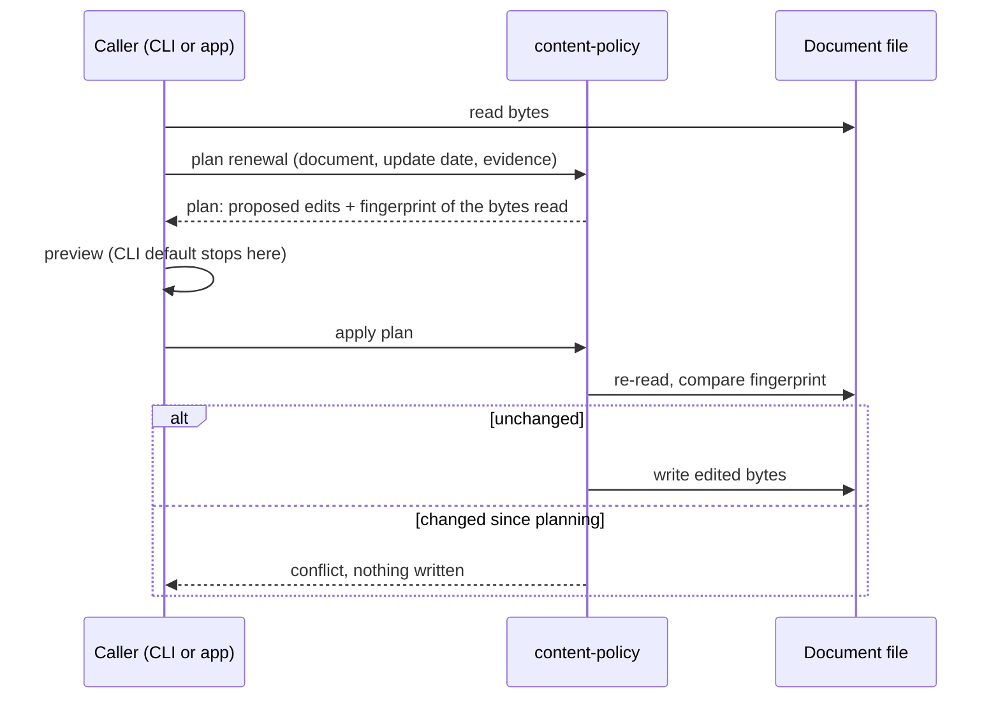

# Content Policy: Evaluation, Baselines, and Renewal

Implementation has not started.

## Purpose

Let Markdown documents declare when they need to be refreshed, archived, or
removed. Provide a reusable Rust library and a CLI that share the same policy
semantics. Evidence should travel with the document through inline values or
frontmatter references, without requiring a sidecar.

This draft separates the agreed model from recommendations awaiting review.
Sections labeled **proposed** are design choices, not implementation commitments.
The current reader-facing description is in
[Policy Evaluation and Renewal](../../docs/topics/policy-lifecycle.md).

## Decisions (2026-09-28 clarification)

The owner settled these in a clarification session. Each is written into the
body below, and its open question has been removed.

1. **Renewal edits files with span-targeted byte edits** built on Biscuit
   File's YAML helpers, with no spike first. It is the only approach that keeps
   renewal in the library and preserves every unedited byte. See
   [Renewal file editing](#renewal-file-editing).
2. **Done means both increments**: time rules, then `FileChanged`, planned as
   phases of one plan. `FileChanged` is what proves provider injection and
   persisted fingerprints; explicit invalidation stays a later candidate. See
   [Delivery Scope](#delivery-scope).
3. **The default frontmatter key is `content_policy`** (snake_case), with no
   kebab-case alias. Every repo-defined, multi-word, top-level frontmatter key
   that Claudine or Darkmatter interprets is snake_case: 22 in Claudine (for
   example `step_timeout` and `fail_fast`), 3 in Darkmatter (for example
   `interpolate_code_blocks`), and `last_updated` in both. None is kebab-case.
   Kebab-case appears only in Darkmatter's nested, CSS-like `style:` keys
   (which also accept snake_case aliases) and in keys copied from external
   formats, such as Claude Code's `argument-hint`. The key remains
   caller-configurable. The package and crate names stay `content-policy` and
   `content-policy-cli`.
4. **Existing `Duration(...)` notes are migrated to `ValidFor(...)`** as a task
   of this feature, and `Duration` gets no alias. Only six hand-written notes
   use it, so migrating them is cheaper than carrying a second rule name. See
   [Backwards compatibility](#backwards-compatibility).
5. **The CLI is `policy`, with `check` and `renew` subcommands**, and the
   yes/no flag is `--needs-action`, which prints `true`, `false`, or `unknown`
   and exits `0` whenever a report was produced. An exit-code answer would let
   a shell `if` read `unknown` as fresh. See [CLI Contract](#cli-contract).

## Agreed Model

- Policies are declared in Markdown frontmatter under a configurable key,
  `content_policy` by default.
- Multiple rules combine as OR of triggers. Each rule has an action, defaulting
  to `refresh`.
- Action precedence is fixed: `remove` > `archive` > `refresh`. Declaration
  order has no effect on the winner.
- Baselines can be literal values inside a rule or references to frontmatter
  properties. `@` identifies a property reference.
- Evaluation does not initialize or renew baselines. Recording an update is an
  explicit operation after review or regeneration of the content.
- Renewability belongs to a rule type. `ValidFor` renews its starting date while
  retaining its duration. `ValidUntil` retains its deadline across content
  updates and stays triggered after expiration unless the policy is edited.
- Action and renewability are independent. A renewable rule can request archive
  or removal.
- The library owns policy semantics. Replaceable providers gather evidence;
  bundled integrations are available to library consumers and the CLI.
- Reports retain all triggered rules. Unknown results cannot nominate actions;
  uncertainty that could change the winner is reported explicitly.
- Evaluation reports actions. Execution of refresh, archive, or removal belongs
  to the consuming application.

## Relationship to the Existing `ContentPolicy` Contract

> **Reader's note (added in review).** This spec is not the first word on
> `ContentPolicy`. The completed Darkmatter fix
> `2026-09-16-content-policy-no-cache` turned off persistent caching of composed
> documents "until a `ContentPolicy` exists". It recorded the minimum contract that
> policy must meet, and the owner confirmed it on 2026-09-18. Darkmatter's
> source still points at that future type
> ([cache/mod.rs](../../../darkmatter/lib/src/markdown/compose/cache/mod.rs),
> [cache/manifest.rs](../../../darkmatter/lib/src/markdown/compose/cache/manifest.rs)).
> The draft did not mention that contract. The review reconciled the two here,
> because the content-policy package is the "feature that builds
> `ContentPolicy`" that the ruling anticipated.

The earlier ruling assigned the shared vocabulary to "a new dependency-light
shared library". This package is that library, and its main types are named
`ContentPolicy`. Darkmatter, Claudine, and Research must never define their own
unqualified `ContentPolicy`.

| Earlier requirement | How this spec meets it |
| --- | --- |
| Shared library is dependency-light, has no dependency cycle, and Darkmatter can consume it | Core crate never depends on Darkmatter. Domain integrations are opt-in features (see [Library Architecture](#library-architecture--proposed)) |
| Library holds **vocabulary only; no evaluators** | **Intentional departure**, explained below |
| "Any predicate expires the content" | OR of triggers (agreed model) |
| Empty policy has no meaning | An explicit empty list is a validation error (see [Defaults and references](#defaults-and-references--proposed)) |
| Fail closed: an absent, unknown, malformed, or newer-version policy is never an optimistic hit | Unknown results never yield `fresh`. Invalid declarations produce no verdict. A caller that configures no default policy gets `no_policy`, not `fresh`. A newer policy version is a validation error |
| Versioned, serializable policy identity | Normalized policy carries a grammar version and a stable identity (see [Report shape](#report-shape--proposed)) |
| Generation time and versions stored as **evidence**, not mutable policy fields | References resolve against an *evidence record*. For a Markdown document that record is the frontmatter; for a cache artifact it is the artifact manifest |
| Deterministic under an injected clock | Evaluation time is an explicit input |
| Calendar months/years define exact arithmetic and timezone | [Time Semantics](#time-semantics--proposed) |
| Explicit stale action (recompute, warn, or fail) | Partly met. `refresh`/`archive`/`remove` describe what the *content* needs; warn-or-fail is left to the consumer. See [Open Question 3](#3-where-warn-or-fail-stale-behavior-lives) |
| Minimum vocabulary: duration, explicit invalidation, source-content change, software/library version change, model retirement | Duration is in increment 1 and source-content change in increment 2; both are required for this feature. Explicit invalidation and model retirement are added to [Later Policy Decisions](#later-policy-decisions) |

**Why evaluators now live in the shared library.** The earlier ruling kept
evaluators out because evaluation looked domain-specific. This spec splits
evaluation into two parts. *Observation* is domain-specific ("what version is
on crates.io now?") and stays in replaceable providers. *Judgment* is shared:
is the version newer, which action wins, is the answer complete. If every
consumer re-implemented judgment, the result would be the "incompatible stale
behavior" the ruling itself warned against. The concern behind the ruling
(dependency weight and cycles) is met by keeping domain adapters behind opt-in
features that never lead back to Darkmatter.

Adopting the library in Darkmatter's compose cache, in Claudine's model-catalog
artifact, and in Research is **out of scope** for this feature. The core API
must still accept a non-Markdown evidence record, so those adoptions need no
redesign. Research's draft
[`ContentPolicy`](../../../research/lib/src/metadata/content_policy.rs) has no
callers. Per the 2026-09-18 ruling, its migration applies only if the Research
package survives, and this feature does not touch it.

## Delivery Scope

*(Decided 2026-09-28.)* The feature is done when **both** increments are
delivered. They are planned as two phases of one implementation plan.

The first increment delivers a complete lifecycle for `Evergreen`,
`TimeSensitive`, `ValidFor`, and `ValidUntil`: declaration parsing, validation,
references, evaluation, renewal planning and application, and CLI reporting.
It also migrates the existing `Duration(...)` notes (see
[Backwards compatibility](#backwards-compatibility)).
The second adds `FileChanged` to prove provider injection and persisted
fingerprints. Two rulings are still needed before the second phase starts:
line endings in fingerprints
([Open Question 4](#4-line-endings-in-filechanged-fingerprints)) and the
structured declaration shape as it applies to `FileChanged`
([Open Question 5](#5-declaration-shape)).

Package versions, symbols, URL/schema changes, explicit invalidation, model
retirement, and file/program presence rules follow after their comparison
contracts are reviewed. None of them is part of this feature, and they should
not delay either increment. Reaper is not a prerequisite for time or file
policies. It is currently a placeholder crate.

Outside this initial scope:

- automatic content generation
- archive destinations and file deletion
- a scheduler
- a policy expression language with AND/NOT
- sidecar storage
- configurable action precedence
- evaluating many documents in one CLI call (callers loop, or a later feature adds it)
- adoption by Darkmatter, Claudine, or Research

### Backwards compatibility

Six hand-written notes in `biscuit-terminal/docs/research/terminal-multiplexing/`
(`about.md`, `cmux.md`, `ghostty.md`, `tmux.md`, `wezterm.md`, `zellij.md`)
already declare `content_policy:` with `Duration(3mo)`; `about.md` uses
`Duration(12mo)`. All six have `last_updated`, so the shorthand's default date
property resolves. This feature rewrites each `Duration(...)` entry as the
equivalent `ValidFor(...)` entry.

There is no `Duration` alias. After the migration, `Duration` is an unknown rule
name and a validation error like any other. Nothing else needs migrating:
no Rust code writes the old form, and Research's draft `ContentPolicy` type has
no callers.

## Terms

| Term | Meaning |
| --- | --- |
| Rule | A condition that can trigger, such as an elapsed validity interval |
| Policy entry | A rule plus its configured action |
| Baseline | Evidence accepted when content was last updated or reviewed |
| Evidence record | The property map that `@name` references resolve against: frontmatter for a Markdown document, or a manifest for a cache artifact |
| Observation | Current evidence used for a comparison |
| Renewal | Explicitly replacing a renewable rule's baseline after a content update |
| Effective action | Highest-priority action among confirmed triggered entries |

## Declaration Format

The compact and action-bearing forms express the same model:

```yaml
last_updated: 2026-09-28
content_policy:
  - ValidFor(3mo, @last_updated)
  - rule: ValidUntil(2027-01-01)
    action: archive
```

Inline baselines are equally valid:

```yaml
content_policy:
  - ValidFor(3mo, 2026-09-28)
```

The four first-increment rules:

| Rule | Triggers | Typical use |
| --- | --- | --- |
| `Evergreen` | Never | State plainly that a document does not expire, instead of relying on the caller's default |
| `TimeSensitive` | Always | Content that must be refreshed before every use, such as a snapshot of live data |
| `ValidFor(duration[, baseline])` | When evaluation time reaches baseline + duration | Periodic review |
| `ValidUntil(deadline)` | When evaluation time reaches the deadline | Fixed retirement or re-review date |

### Defaults and references — proposed

- The policy value must be a YAML list. A single string such as
  `content_policy: ValidFor(3mo)` is a validation error whose message suggests
  the list form. One accepted shape keeps renewal edits and error messages
  simple. Evaluation accepts any valid YAML list, including a flow-style list
  such as `content_policy: [ValidFor(3mo)]`; renewal is narrower (see
  [Renewal file editing](#renewal-file-editing)).
- The default key is `content_policy`. A caller can configure another key, but
  no kebab-case `content-policy` alias is read.
- An absent policy key, or a document with no frontmatter, uses the caller's
  default policy. The CLI default is `ValidFor(6mo)`. A library caller can
  instead configure **no default**, and an absent policy then yields the
  `no_policy` outcome instead of a verdict. A cache consumer needs this: under
  the earlier contract, a missing policy must never read as fresh.
- An explicit empty list is a validation error. *(Changed in review: the draft
  treated it like an absent key.)* The earlier contract gives an empty policy
  no meaning. Research documents used an empty list to mean "evergreen", so
  silently reading it as "use the default" would invert what some authors
  intended. Use `Evergreen` to request no expiry. A malformed or null
  declaration is also an error.
- `Evergreen` must be the only entry. Combined with any other rule it
  contradicts itself ("never expires" plus "expires when…"), so the combination
  is a validation error.
- Rule and action names are case-sensitive: `ValidFor`, not `validfor`;
  `archive`, not `Archive`.
- `ValidFor(3mo)` resolves the caller's default date property, initially
  `last_updated`. That spelling is already the most common update-date key in
  the repository's Markdown. The report says whether the effective rule was
  defaulted or explicitly declared, and records where its baseline came from.
- Initially, `@name` selects one top-level property of the evidence record. No
  nested paths, recursive references, environment lookup, or cross-document
  lookup is implied. A referenced string is consumed as a typed value, not
  reparsed as an expression.
- A missing property is unavailable evidence and yields `unknown`. Each of the
  following is a validation error, and none causes a fallback to a different
  baseline:
  - a present value of the wrong type
  - an invalid date
  - a malformed reference
  - a timestamp (such as `2026-09-28T10:00:00Z`) while timestamps are deferred.
    The time part is not silently dropped.
- References occupy typed baseline and deadline positions. Elsewhere in the repo
  a leading `@` already means something else: Biscuit File and Darkmatter use
  it for "magic" paths, and Darkmatter schemas use it for `Name@file` imports.
  Inside a policy argument, `@name` always means a property reference. A future
  file selector must use a distinct, explicitly named argument (as the
  structured `file:` key below does), not a bare `@` path.

A structured form is proposed for richer rules. For example, a file baseline
needs the digest algorithm as well as the digest:

```yaml
content_policy:
  - rule:
      type: FileChanged
      file: src/config.rs
      baseline:
        algorithm: blake3
        digest: "<recorded digest>"
    action: refresh
```

The digest above is a placeholder, not valid stored evidence. Structured and
compact forms must normalize to the same internal representation. The first
increment need only accept the illustrated time-rule forms. The structured
grammar for `FileChanged` must be settled before the second phase starts
([Open Question 5](#5-declaration-shape)).

In the structured form, a reference must be quoted, as in
`baseline: "@last_updated"`. YAML reserves `@` at the start of a plain value,
so an unquoted `@last_updated` is a YAML syntax error before the policy parser
ever sees it. The compact form avoids this because its string starts with the
rule name.

## Time Semantics — Proposed

The evaluator takes an explicit evaluation time. The CLI captures it once for
the whole document, and `--at` can override it. Tests supply it directly.

- Initially accept ISO dates (`YYYY-MM-DD`) and positive integer durations with
  one unit: `d`, `wk`, `mo`, or `yr`. Compound durations, timestamps, and unit
  aliases (`w`, `y`, `months`) are deferred. Durations whose deadline falls
  outside the supported date range are validation errors.
- These units mean the same as in Darkmatter's expression duration parser
  ([`parse_duration_spec`](../../../darkmatter/lib/src/markdown/compose/expression/functions/mod.rs),
  used by `older_than`/`newer_than`), where `mo` and `yr` are calendar months
  and years. So `3mo` means the same thing in a policy and in a Darkmatter
  expression. Sniff's recent-commit filter treats `mo` as a fixed 30 days;
  content-policy deliberately does not follow it.
- Interpret dates at midnight UTC. `ValidUntil(2027-01-01)` triggers at the start
  of January 1, rather than the end of that day.
- `ValidFor` triggers when evaluation time is greater than or equal to its
  computed deadline. Days/weeks are UTC day increments; months/years use calendar
  arithmetic, clamping to the last valid day of the destination month.
- For example, January 31 plus one month becomes February 28 in a non-leap year;
  February 29 plus one year becomes February 28 in the following year.
- A future starting date yields `unknown` with an inconsistent-baseline reason;
  it does not establish freshness. A future `ValidUntil` deadline is normal.

These choices intentionally make expiration independent of the host's timezone,
while leaving date-only boundary behavior visible for review.

## Evaluation Contract

Separate declaration validity from evidence availability. Invalid syntax,
unknown rule/action names, invalid parameters, and wrong-typed resolved values
produce validation diagnostics with entry/property locations.

If **any** entry is invalid, the document gets no verdict (no status and no
action), and the diagnostics list every invalid entry, not just the first. A
partial verdict would be unsafe: the invalid entry might be the only `remove`
rule, and a verdict built from the rest would understate the action.

Each valid entry evaluates to `triggered`, `not_triggered`, or `unknown`.
Unknown results carry reasons such as missing baseline, missing provider,
unsupported capability, timeout, or failed observation. A successful observation
of absence is distinct from an observation failure; the rule decides what that
absence means.

All entries are evaluated for a complete report. Do not stop after finding a
trigger: later entries may request a higher-priority action or provide useful
explanations. Identical observation requests can share evidence within a run.

### Aggregation

| Confirmed results | Document status | Effective action |
| --- | --- | --- |
| No triggers, no unknowns | `fresh` | None |
| No triggers, at least one unknown | `unknown` | None |
| Highest triggered action is refresh | `stale` | `refresh` |
| Highest triggered action is archive or remove | `expired` | `archive` or `remove` |

A caller with no default policy that evaluates a document with no policy gets
`no_policy` instead of one of these statuses.

Document status describes confirmed evidence. A separate action-resolution
field says whether unknown entries could still change the effective action.
"Complete" in the table below means the unknown entry cannot change the winner.
It could still have added another reason to the report.

| Known triggered action | Unknown entry's action | Resolution |
| --- | --- | --- |
| None | Any | Incomplete |
| Refresh | Refresh | Complete |
| Refresh | Archive or remove | Incomplete |
| Archive | Refresh or archive | Complete |
| Archive | Remove | Incomplete |
| Remove | Any | Complete |

A fully evaluated fresh document has complete action resolution and no action.
Evaluation completeness and action-resolution completeness are separate fields.
Consumers must not interpret a complete winning action as proof that every rule
was evaluated successfully.

### Report shape — proposed

Return:

- document identity and evaluation time
- the effective policy (marked as defaulted or declared), its grammar version,
  and its policy identity
- overall status and effective action
- evaluation completeness and action-resolution completeness
- a result for every entry: entry location, action, renewal classification,
  baseline source and value, the current observation when available, and a
  reason

Sensitive provider configuration is never report data.

The **policy identity** is a `biscuit-hash` digest of the normalized policy's
canonical serialization, prefixed with its algorithm, following the existing
`xxh64:{hex}` convention in
[messenger's research canonicalization](../../../messenger/lib/src/research/canonical.rs).
A cache consumer stores the identity in its artifact manifest, so a changed
policy invalidates artifacts produced under the old one. A serialized policy
whose grammar version is newer than the library understands is a validation
error, so it fails closed.

Illustrative JSON for two confirmed triggers:

```json
{
  "status": "expired",
  "action": "remove",
  "evaluation_complete": true,
  "action_resolution_complete": true,
  "results": [
    {"rule": "ValidFor(3mo, @last_updated)", "result": "triggered", "action": "refresh", "reason": "Validity interval elapsed"},
    {"rule": "ValidUntil(2027-01-01)", "result": "triggered", "action": "remove", "reason": "Fixed deadline reached"}
  ]
}
```

This is an excerpt, not a finalized serialization schema. The finalized field
names are part of the public contract and are documented on the package's
`docs/` topic page in the same change that implements them.

## Recording Updates and Renewal

Evaluation never writes policy state. Repeated checks against the same evidence
must not make a stale document fresh.

Renewal is an explicit assertion that content has been updated or reviewed using
the replacement evidence. A library operation should produce proposed document
edits for the caller to persist. File persistence is a shared library helper;
the CLI must not be the only consumer able to renew policies.



### Renewal rules — proposed

- A renewal request applies to **every renewable entry** in the policy. A content
  update refreshes the whole document, so every baseline that describes "what
  the content was based on" advances together. Renewing a chosen subset of
  entries is deferred.
- The update date defaults to the current UTC date. The caller may supply an
  earlier date, such as the date regeneration actually ran. A future date is
  rejected, because evaluation would treat it as an inconsistent baseline.
- Replace an inline `ValidFor` baseline in place. For `@last_updated`, propose
  an edit to that property while preserving the reference.
- For shorthand/defaulted rules, create or update the configured date property.
  Evaluation alone never creates it.
- Preserve durations, selectors, actions, and nonrenewable deadlines. Renewal
  does not guarantee freshness: `TimeSensitive` still triggers and a passed
  `ValidUntil` still expires the document.
- Let callers supply evidence captured during the content update. A new fetch
  after generation may observe a different version than the content used.
- Consolidate identical writes to a shared property. Reject conflicting writes.
  If a proposed write also changes a nonrenewable rule's referenced deadline,
  report a conflict instead of silently extending that deadline.
- Missing baseline targets can be initialized explicitly. Present malformed
  values need correction; renewal is not a general repair operation.
- Plan the entire requested renewal before writing. If required evidence is
  unavailable, return diagnostics without partially advancing baselines.
- Preserve the Markdown body, unrelated frontmatter, and declaration form.
  "Preserve" means byte-for-byte outside the edited values, including comments
  and quoting. How this is achieved is described in
  [Renewal file editing](#renewal-file-editing).
- Detect intervening document edits before applying a prepared renewal. The
  plan records an `xxh64` fingerprint (via `biscuit-hash`) of the exact bytes it
  was planned from. Apply re-reads the file and refuses to write if the bytes
  differ.

A fingerprint baseline must identify its comparison algorithm and scope.
Changing the fingerprint scheme requires explicit recapture; incompatible
fingerprints cannot be treated as proof of content changes or freshness.
Content fingerprints are computed with `biscuit-hash` (BLAKE3). The monorepo
does not hash directly with the `blake3` crate.

### Renewal file editing

*(Decided 2026-09-28.)* The content-policy library applies renewal as
span-targeted byte edits, using two Biscuit File YAML helpers:

- [`locate_yaml_value`](../../../biscuit-file/lib/src/yaml/analyze/locate.rs)
  finds a value's byte span in YAML source. The span **includes** any quotes,
  and the result carries a `plain` flag that says whether the scalar is
  unquoted. It locates values only inside block mappings and block sequences.
  It returns `None` for anything inside a flow collection (such as
  `content_policy: [ValidFor(3mo)]`) and for multi-line and block scalars.
- [`apply_edit_set`](../../../biscuit-file/lib/src/yaml/analyze/edit_set.rs)
  applies non-overlapping byte-range edits, expressed as `YamlRepair` items,
  and leaves every other byte unchanged. An edit with an empty span is an
  insertion. It is the same applier Biscuit File's YAML repair uses.

Biscuit File has no dependency path to Darkmatter, even with all features
enabled (checked with `cargo tree`), so the library may use it under the
[dependency rule](#library-architecture--proposed). Darkmatter's own
frontmatter writer (`fm_insert` followed by `as_string`) was rejected: it
re-serializes the whole YAML block and drops comments and quoting, and the
dependency rule puts it out of the library's reach.

The helpers work on YAML source, not on a Markdown file, so content-policy
itself must:

1. Slice out the frontmatter block, locate values within it, and translate each
   span into an offset in the whole file.
2. Find the date *inside* a compact rule string, such as the `2026-09-28` in
   `ValidFor(3mo, 2026-09-28)`, and narrow the edit to it. This is
   straightforward for plain and single-quoted scalars. A double-quoted scalar
   that contains escape sequences is refused, because source offsets no longer
   match the decoded text.
3. Build the insertion that appends a missing top-level property, such as
   `last_updated`, as one new line at the end of the frontmatter block.

As a consequence, renewal refuses these shapes with a clear message that
suggests rewriting the policy as a block list:

- a flow-style policy list, such as `content_policy: [ValidFor(3mo)]`
- a value it must edit that is a block scalar or multi-line scalar
- a value it must edit that is a double-quoted string containing escape
  sequences

A refusal writes nothing. Evaluation is unaffected: it still accepts any valid
YAML list shape.

## Library Architecture — Proposed

Use one library crate (`content-policy`, in `content-policy/lib`) with optional
provider integration modules, and a separate CLI crate (`content-policy-cli`, in
`content-policy/cli`), following the repo's `{name}` / `{name}-cli` convention.
Avoid requiring callers to assemble every provider for a date check.

| Layer | Owns |
| --- | --- |
| Declaration/model | Parsing, validation, references, typed policies and baselines |
| Evaluation | Time/version comparisons, result aggregation, precedence |
| Renewal | New baseline interpretation, proposed document edits, applying them |
| Provider contracts | Typed requests and observations for external capabilities |
| Bundled integrations | Adapters to existing monorepo packages, each behind an off-by-default feature |
| CLI | Configuration, input/output, invoking evaluation or explicit renewal |

**Dependency rule.** Darkmatter must be able to depend on the library, so the
library, including every optional feature, must never depend on Darkmatter or
on anything that depends on Darkmatter. That rule has three consequences:

- The core evaluates against an evidence record: a map of property names to
  values. A Darkmatter consumer passes its already-parsed
  [`Frontmatter`](../../../darkmatter/lib/src/markdown/frontmatter.rs) map, and
  a cache consumer passes its manifest's evidence.
- Default features stay near Serde-level: `serde`, `chrono`, and `biscuit-hash`.
- The CLI crate is not a dependency of anything, so it may use Darkmatter to
  load documents if that turns out to be the simplest route.

Sniff, Biscuit File, and Tree Hugger do not depend on Darkmatter today, so the
planned integrations meet this rule.

Providers return observations, not final freshness judgments. Introduce only
traits required by implemented policies; do not stub every future capability.
Keep external crate types out of policy declarations where they would couple
storage to a particular implementation. Exact Rust signatures, async boundaries,
and feature names await implementation design.

| Integration | Useful capability | Remaining policy responsibility |
| --- | --- | --- |
| Sniff (`network` feature) | Registry releases (crates.io and npm `latest_version`) and program discovery | Version comparison and release selection semantics |
| Biscuit File | File references; HTTP fetching behind its off-by-default `fetch` feature | Content comparison, baseline handling, error interpretation |
| Tree Hugger | Symbol selection and source extraction | Define comparison scope and fingerprint selected content |
| Reaper, when implemented | Extract meaningful page content | Define what content changes invalidate the document |

Tree Hugger's symbol identity alone is not a content-change fingerprint.
A file's modification time is not a portable substitute for its content baseline.
Request credentials and runtime network policy belong to provider configuration.

A `FileChanged` path is resolved relative to the directory of the document that
declares it, through Biscuit File's `FileReference`. It is stored with `/`
separators on every OS, so a policy written on Windows evaluates the same on
macOS and Linux.

## Later Policy Decisions

These candidates retain the original idea without claiming settled semantics:

| Candidate | Decision required before implementation |
| --- | --- |
| `SemVerMajorChange` | Package identity, registry, baseline version, release channel; propose a strictly newer major release |
| `SemVerMinorChange` | Propose a newer minor or major release; define prerelease and pre-1.0 behavior |
| `FileChanged` | In scope as the second phase of this feature. Propose byte-content fingerprints; define missing/deleted file behavior. Line-ending handling and the structured declaration shape are rulings required before that phase ([Open Questions 4 and 5](#open-questions)) |
| `SymbolChanged` | File plus qualified selector, ambiguity/deletion handling, signature/body/docs scope |
| `UrlChanged` | Request identity, selected response content, normalization, conditional-response handling |
| `SchemaChanged` | Structural changes versus compatibility-breaking changes; schema dialect and reference scope |
| `WhenFileCreated` / `WhenFileRemoved` | Current presence/absence versus transition since a baseline |
| `ProgramInstalled` / `ProgramRemoved` | Presence versus transition; host/environment identity and discovery scope |
| Explicit invalidation (for example a `stale: true` flag) | Property name and type; whether renewal clears the flag. Required by the earlier contract's minimum vocabulary; needs no provider, so it is a cheap candidate, but it is not part of this feature |
| Model retirement | Model identity and which provider reports retirement. Required by the earlier contract's minimum vocabulary |

In particular, a missing program on another host should not accidentally prove
that the program was uninstalled on the host used to create the document.

## CLI Contract

The CLI follows the monorepo's CLI standards
([cli skill](../../../.claude/skills/cli/cli-best-practices.md)).

*(Decided 2026-09-28.)* The binary is `policy`, built by the
`content-policy-cli` crate. Each operation is a subcommand, so a document path
can never be mistaken for a command name, and later subcommands have room to
arrive.

*(Changed in review: the draft printed JSON by default. That was an accidental
departure from the repo standard, which makes terminal-formatted output the
default and requires both `--json` and `--plain`.)*

### `policy check`

- `policy check document.md` prints the evaluation report. The default output
  is terminal-formatted and built from `biscuit-terminal` components: a `Prose`
  summary line, then a `Table` of entries. `--plain` removes styling, and
  `--json` prints the serialized report as the only content on stdout.
- `--at <YYYY-MM-DD>` sets the evaluation time to midnight UTC on that date.
  Scripts and reviewers can then reproduce a past or future verdict without
  changing the system clock.
- Exit codes follow the repo standard. `0` means a report was produced, even one
  that reports `stale`, `expired`, or `unknown`. `1` covers invalid declarations,
  unreadable files, and malformed frontmatter; the diagnostics go to stderr,
  including in `--json` mode. `2` is a usage error, reported by clap.

`policy check --needs-action document.md` answers whether any rule has
confirmed a need for action, including expiration. It prints `true` for
stale/expired, `false` for fresh, and `unknown` when no trigger is confirmed
and at least one rule could not be evaluated. A known trigger still prints
`true` when action resolution is incomplete. The full report is required to
choose an action.

It uses the same exit codes as the report: `0` whenever a report was produced,
whatever the answer; `1` only for errors; `2` for usage errors. The answer is
carried in the printed word, not the exit code, because a shell `if` treats
every non-zero exit as false and would silently read `unknown` as fresh. Scripts
compare the text:

```sh
case "$(policy check --needs-action notes.md)" in
  true)    echo "notes.md needs a refresh, archive, or removal" ;;
  false)   echo "notes.md is fresh" ;;
  unknown) echo "notes.md could not be fully evaluated; read the report" ;;
  *)       echo "policy check failed" >&2; exit 1 ;;
esac
```

### `policy renew`

- `policy renew document.md [--on <YYYY-MM-DD>]` plans a renewal and prints the
  proposed edits. It changes nothing. `--on` supplies the update date; it
  defaults to the current UTC date, and a future date is rejected (see
  [Renewal rules](#renewal-rules--proposed)).
- `--write` applies the planned edits to the file.
- Exit codes: `0` means a preview was produced or the edits were written. `1`
  covers every error, including a refused YAML shape (see
  [Renewal file editing](#renewal-file-editing)), a conflict because the file
  changed after the plan was made, and missing required evidence; nothing is
  written in any of these cases. `2` is a usage error.
- **Proposed** beyond the ruling: `renew` accepts `--plain` and `--json` for its
  preview, like `check`; a policy with no renewable entry is not an error, so
  it exits `0` with a preview that proposes no edits.

The contract requires explicit invocation, previewable edits, and no automatic
refresh/archive/remove execution.

## Acceptance Criteria for Implementation

1. Compact and action-bearing declarations normalize consistently; defaults and
   baseline sources are visible in reports.
2. Inline and referenced dates evaluate equivalently. Missing dates produce
   unknown results, and wrong-typed values produce validation diagnostics.
3. A fixed evaluation time makes time-policy results deterministic, including
   exact deadlines, month ends, leap years, and future baselines.
4. Reordering entries does not change the effective action. All combinations of
   confirmed and unknown actions follow the aggregation tables.
5. Evaluation performs no document writes and never implicitly captures a
   baseline, including on the first evaluation.
6. Renewal changes only the intended baseline values, preserves policy settings,
   consolidates shared writes, and rejects conflicts or incomplete capture.
7. The lifecycle example below passes through both library and CLI behavior
   (`policy check`, `policy renew`, and `policy renew --write`).
8. The file increment demonstrates the same lifecycle with a fake provider and
   a bundled file adapter, including read failures and incompatible fingerprints.
   This criterion is required for the feature to be done.
9. New crates follow repository package-area conventions and support macOS,
   Linux, native Windows, and WSL2. Implementation follows existing test recipes
   and maintains topic/dependency documentation and applicable skills.
10. Fail-closed cases each have a test and none yields `fresh`. They cover: an
    empty policy list, `Evergreen` combined with another rule, a single-string
    policy value, an absent policy when the caller has no default (`no_policy`),
    and a serialized policy with a newer grammar version.
11. The core library can evaluate a policy against a plain evidence map, with no
    Markdown document involved, and its dependency graph contains no path to
    Darkmatter.
12. Applying a renewal leaves every byte outside the edited values unchanged,
    including frontmatter comments. It refuses to write if the file changed
    after the plan was made.
13. The package's `docs/` topic page and README are updated to match the
    decisions in this spec, in particular the CLI output and exit codes, the
    empty-list rule, and the `no_policy` outcome.
14. Renewal refuses, writes nothing, and names the block-list form in its
    message for each unsupported shape: a flow-style policy list, a block or
    multi-line scalar it must edit, and a double-quoted rule string containing
    escape sequences. Each case has a test, and evaluation of the same
    documents still succeeds (flow-style lists included).
15. `policy check --needs-action` prints `true`, `false`, or `unknown` and exits
    `0` for each, with a test per answer; it exits `1` only for errors.
16. The six `Duration(...)` notes under
    `biscuit-terminal/docs/research/terminal-multiplexing/` are rewritten to
    `ValidFor(...)` and evaluate without diagnostics. A `Duration(...)` entry is
    a validation error for an unknown rule name.

### Lifecycle example

A document is updated on September 28, 2026. It has `ValidFor(3mo, @last_updated)`
with `refresh` and `ValidUntil(2027-01-01)` with `archive`. Under the proposed
date semantics it is fresh before December 28, stale on December 28, and renewed
when an explicit content update sets the baseline to December 29. On January 1,
2027 it is expired with action `archive`. Further content updates do not move
that deadline or clear expiration. Changing the retirement action to `remove`
changes the winning action, while every triggered entry remains in the report.

## Open Questions

The review turned the draft's review questions into this list. Where it
recommends an answer, it gives the options with their pros and cons. The
2026-09-28 clarification settled the former questions on renewal file editing,
`--is-stale` output, the renewal command shape, and scope (see
[Decisions](#decisions-2026-09-28-clarification)); the remaining questions are
renumbered.

### 1. Defaults and references

Approve `last_updated` as the default date property and top-level-only `@name`?
Nested references can wait unless existing document metadata needs them. The
empty-list rule has changed from the draft (it is now an error; see
[Defaults and references](#defaults-and-references--proposed)). Confirm or
reverse that change. The default policy key, `content_policy`, is already
decided and is not part of this question.

### 2. Dates

Approve midnight UTC expiration, calendar month/year clamping, and the initial
date-only duration grammar? In particular, should a named `ValidUntil` date
instead remain valid through that entire day?

### 3. Where "warn or fail" stale behavior lives

The earlier contract asks the policy for an explicit stale action: recompute,
serve with a warning, or fail. This spec's actions describe what the content
needs (refresh, archive, remove), not how a cache should respond meanwhile.

1. **Keep warn/fail out of the policy; each consumer maps actions to its own
   behavior (recommended).** A cache treats `refresh` as recompute and
   `archive`/`remove` as a miss. Claudine's model catalog can keep serving with
   a warning.
   - Pros: the document vocabulary stays about content; different consumers of
     the same document can respond differently.
   - Cons: departs from the earlier contract's wording, which this spec must
     record (it does, in the reconciliation table).
2. **Add a per-entry `on_stale: recompute | warn | fail` field.**
   - Pros: matches the earlier contract literally.
   - Cons: puts consumer behavior into author-facing frontmatter; a document read
     by two consumers can only name one behavior.

**Recommendation:** option 1, because the owner of the response is the consumer,
not the document author.

### 4. Line endings in `FileChanged` fingerprints

On Windows, Git's `core.autocrlf` can check out the same committed file with
CRLF line endings. A raw-byte fingerprint recorded on macOS would then report a
change on Windows that never happened. The repo requires every package to work
on all four environments, so this must be settled before the file increment.
**This ruling is required before the `FileChanged` phase starts**; it is not
deferred.

1. **Record a normalization in the fingerprint scheme (recommended).** For
   example, `algorithm: blake3` with `normalize: lf`: CRLF is converted to LF
   before hashing. The scheme field already required above makes the choice
   explicit and recapturable.
   - Pros: the same verdict on every OS; the scheme records the choice.
   - Cons: a CRLF-only change is invisible, which is the intent for text but
     wrong for binary files. Binary files can opt out with `normalize: none`.
2. **Raw bytes only.**
   - Pros: simplest; exact.
   - Cons: false "changed" results on Windows checkouts.
3. **Normalize only when the file decodes as UTF-8 text.**
   - Pros: automatic.
   - Cons: implicit behavior that differs by file content is hard to explain,
     and the result can flip when a file gains a single non-UTF-8 byte.

**Recommendation:** option 1, with `lf` as the default for `FileChanged`.

### 5. Declaration shape

Approve `{ rule, action }` with a string or structured rule, including the
baseline object for fingerprint policies and quoted `"@name"` references in the
structured form?

The time-rule phase needs only the compact and `{ rule, action }` string
forms already shown. **The structured grammar as it applies to `FileChanged`
is a ruling required before the `FileChanged` phase starts**; it is not
deferred.

Questions 1 to 3 should be answered before implementation planning and public
Rust API design. Questions 4 and 5 must be answered before the `FileChanged`
phase starts.
