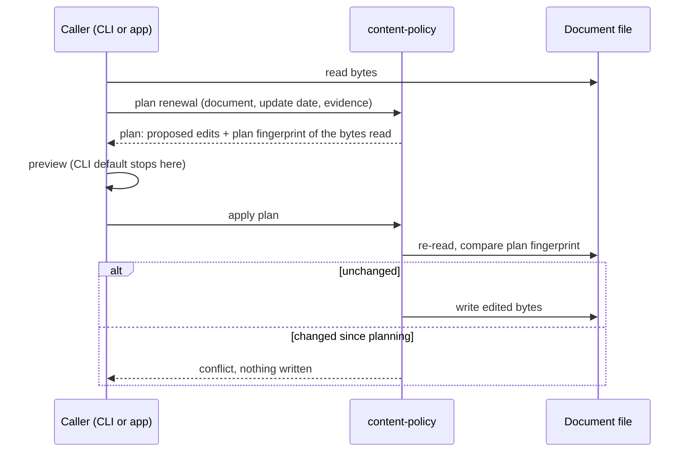

# Content Policy: Evaluation, Baselines, and Renewal

Implementation has not started.

## Purpose

Let Markdown documents declare when they need to be refreshed, archived, or
removed. Provide a reusable Rust library and a CLI that share the same policy
semantics. Evidence should travel with the document through inline values or
frontmatter references, without requiring a sidecar.

This draft separates the agreed model from recommendations awaiting review.
Sections labeled **proposed** are design choices, not implementation commitments.
The current reader-facing description is in
[Policy Evaluation and Renewal](../../docs/topics/policy-lifecycle.md).

## Decisions (2026-09-28 clarification)

The owner settled these in a clarification session; rulings 6 to 10 came in a
second batch the same day, and rulings 11 to 18 in a third. Each is written
into the body below, and its open question has been removed.

1. **Renewal edits files with span-targeted byte edits** built on Biscuit
   File's YAML helpers, with no spike first. It is the only approach that keeps
   renewal in the library and preserves every unedited byte. See
   [Renewal file editing](#renewal-file-editing).
2. **Done means both increments**: time rules, then `FileChanged`, planned as
   phases of one plan. `FileChanged` is what proves provider injection and
   persisted fingerprints; explicit invalidation stays a later candidate. See
   [Delivery Scope](#delivery-scope).
3. **The default frontmatter key is `content_policy`** (snake_case), with no
   kebab-case alias. Every repo-defined, multi-word, top-level frontmatter key
   that Claudine or Darkmatter interprets is snake_case: 22 in Claudine (for
   example `step_timeout` and `fail_fast`), 3 in Darkmatter (for example
   `interpolate_code_blocks`), and `last_updated` in both. None is kebab-case.
   Kebab-case appears only in Darkmatter's nested, CSS-like `style:` keys
   (which also accept snake_case aliases) and in keys copied from external
   formats, such as Claude Code's `argument-hint`. The key remains
   caller-configurable. The package and crate names stay `content-policy` and
   `content-policy-cli`.
4. **Existing `Duration(...)` notes are migrated to `ValidFor(...)`** as a task
   of this feature, and `Duration` gets no alias. Only six hand-written notes
   use it, so migrating them is cheaper than carrying a second rule name. See
   [Backwards compatibility](#backwards-compatibility).
5. **The CLI is `policy`, with `check` and `renew` subcommands**, and the
   yes/no flag is `--needs-action`, which prints `true`, `false`, or `unknown`
   and exits `0` whenever a report was produced. An exit-code answer would let
   a shell `if` read `unknown` as fresh. See [CLI Contract](#cli-contract).
6. **The default date property stays `last_updated`, and any content edit that
   advances it counts as renewal.** Darkmatter's `md hash` and Claudine's
   closure write-back already stamp it on content change, and treating those
   stamps as anything else would make every such document read as stale. This
   feature also makes `md hash` stamp the UTC date, because a local date ahead
   of UTC reads as a future baseline. See
   [Other writers of the baseline](#other-writers-of-the-baseline).
7. **Evidence values are `serde_json::Value`s keyed by property name, and dates
   are `YYYY-MM-DD` strings.** It is the type Darkmatter's frontmatter map and
   cache manifests already hold, so no consumer converts. A present `null`
   counts as missing. See [Evidence values](#evidence-values).
8. **content-policy owns one frontmatter reader for evaluation and renewal**,
   built on Biscuit File with only its `yaml` feature. One reader means the CLI
   and renewal can never disagree about what a document says. See
   [Renewal file editing](#renewal-file-editing).
9. **content-policy ships a SimplifiedSchema for policies, and Darkmatter's base
   document schema references it**, so every Markdown document gets completion
   and checking through DMLS without a Rust dependency. See
   [Editor schema](#editor-schema).
10. **Dates only.** Timestamps stay deferred, and the schema's suggestions are
    date-only, so the editor never suggests a value evaluation rejects.
11. **The UTC stamping fix covers all three writers that stamp `last_updated`
    with the local date**: `md hash`, Darkmatter's auto-rehash on effect writes,
    and Claudine's write-back. Any one of them left on the local date would
    still produce a future baseline. See
    [Changes outside the new crates](#changes-outside-the-new-crates).
12. **`FileChanged` is declared as `FileChanged(<path>, @<property>)`**, and the
    content fingerprint lives in its own top-level frontmatter property as
    `<scheme>:<hex>`, with `blake3-lf` (CRLF normalized to LF) as the default
    scheme. A compact string fits the editor schema, and a scheme prefix makes
    the Windows line-ending choice explicit and recapturable. See
    [`FileChanged` declaration](#filechanged-declaration).
13. **Policy identity hashes rules and actions only; baseline values are
    excluded**, so renewal never changes it. The earlier contract treats
    baselines as evidence, not policy fields. See
    [Report shape](#report-shape--proposed).
14. **There is always a default policy.** The built-in default is
    `ValidFor(6mo)`; callers may replace it but not remove it, and the
    `no_policy` outcome is gone. A fail-closed consumer gets the same safety by
    choosing `TimeSensitive` as its default. See
    [Defaults and references](#defaults-and-references).
15. **The CLI is configured by flags with environment-variable fallbacks**, and
    no configuration file in this feature. Flags and variables cover every
    setting without a new file format to design. See
    [Configuration](#configuration).
16. **`policy renew` initializes missing baselines without an extra flag**, and
    its preview labels each one "new baseline". The preview and `--write` already
    make first capture a visible, deliberate act. See
    [Renewal rules](#renewal-rules--proposed).
17. **Renewal accepts a flow-style policy list unless a value it must change
    sits inside the brackets.** Refusing edits it can make safely would push
    authors to rewrite valid policies for no gain. See
    [Renewal file editing](#renewal-file-editing).
18. **`renew` supports `--plain` and `--json`, and a policy with nothing
    renewable prints "nothing to renew" and exits `0`.** It matches `check`, and
    an empty renewal is not a failure. See [`policy renew`](#policy-renew).

## Agreed Model

- Policies are declared in Markdown frontmatter under a configurable key,
  `content_policy` by default.
- Multiple rules combine as OR of triggers. Each rule has an action, defaulting
  to `refresh`.
- Action precedence is fixed: `remove` > `archive` > `refresh`. Declaration
  order has no effect on the winner.
- Baselines can be literal values inside a rule or references to frontmatter
  properties. `@` identifies a property reference.
- Evaluation does not initialize or renew baselines. Recording an update
  happens after review or regeneration of the content, through renewal or a
  tool that stamps the baseline property on content change.
- Renewability belongs to a rule type. `ValidFor` renews its starting date while
  retaining its duration. `ValidUntil` retains its deadline across content
  updates and stays triggered after expiration unless the policy is edited.
- Action and renewability are independent. A renewable rule can request archive
  or removal.
- The library owns policy semantics. Replaceable providers gather evidence;
  bundled integrations are available to library consumers and the CLI.
- Reports retain all triggered rules. Unknown results cannot nominate actions;
  uncertainty that could change the winner is reported explicitly.
- Evaluation reports actions. Execution of refresh, archive, or removal belongs
  to the consuming application.

## Relationship to the Existing `ContentPolicy` Contract

> **Reader's note (added in review).** This spec is not the first word on
> `ContentPolicy`. The completed Darkmatter fix
> `2026-09-16-content-policy-no-cache` turned off persistent caching of composed
> documents "until a `ContentPolicy` exists". It recorded the minimum contract that
> policy must meet, and the owner confirmed it on 2026-09-18. Darkmatter's
> source still points at that future type
> ([cache/mod.rs](../../../darkmatter/lib/src/markdown/compose/cache/mod.rs),
> [cache/manifest.rs](../../../darkmatter/lib/src/markdown/compose/cache/manifest.rs)).
> The draft did not mention that contract. The review reconciled the two here,
> because the content-policy package is the "feature that builds
> `ContentPolicy`" that the ruling anticipated.

The earlier ruling assigned the shared vocabulary to "a new dependency-light
shared library". This package is that library, and its main types are named
`ContentPolicy`. Darkmatter, Claudine, and Research must never define their own
unqualified `ContentPolicy`.

| Earlier requirement | How this spec meets it |
| --- | --- |
| Shared library is dependency-light, has no dependency cycle, and Darkmatter can consume it | Core crate never depends on Darkmatter. Domain integrations are opt-in features (see [Library Architecture](#library-architecture)) |
| Library holds **vocabulary only; no evaluators** | **Intentional departure**, explained below |
| "Any predicate expires the content" | OR of triggers (agreed model) |
| Empty policy has no meaning | An explicit empty list is a validation error (see [Defaults and references](#defaults-and-references)) |
| Fail closed: an absent, unknown, malformed, or newer-version policy is never an optimistic hit | Unknown results never yield `fresh`. Invalid declarations produce no verdict. An absent policy always falls back to the caller's default policy, which can be replaced but not removed; a fail-closed consumer, such as a cache, sets its default to `TimeSensitive`, so an undeclared artifact is always recomputed. A newer policy version is a validation error |
| Versioned, serializable policy identity | Normalized policy carries a grammar version and a stable identity (see [Report shape](#report-shape--proposed)) |
| Generation time and versions stored as **evidence**, not mutable policy fields | References resolve against an *evidence record*. For a Markdown document that record is the frontmatter; for a cache artifact it is the artifact manifest |
| Deterministic under an injected clock | Evaluation time is an explicit input |
| Calendar months/years define exact arithmetic and timezone | [Time Semantics](#time-semantics--proposed) |
| Explicit stale action (recompute, warn, or fail) | Partly met. `refresh`/`archive`/`remove` describe what the *content* needs; warn-or-fail is left to the consumer. See [Open Question 3](#3-where-warn-or-fail-stale-behavior-lives) |
| Minimum vocabulary: duration, explicit invalidation, source-content change, software/library version change, model retirement | Time-based expiry (`ValidFor`, `ValidUntil`) is in increment 1 and source-content change (`FileChanged`) in increment 2; both are required for this feature. Explicit invalidation and model retirement are added to [Later Policy Decisions](#later-policy-decisions) |

**Why evaluators now live in the shared library.** The earlier ruling kept
evaluators out because evaluation looked domain-specific. This spec splits
evaluation into two parts. *Observation* is domain-specific ("what version is
on crates.io now?") and stays in replaceable providers. *Judgment* is shared:
is the version newer, which action wins, is the answer complete. If every
consumer re-implemented judgment, the result would be the "incompatible stale
behavior" the ruling itself warned against. The concern behind the ruling
(dependency weight and cycles) is met by keeping domain adapters behind opt-in
features that never lead back to Darkmatter.

Adopting the library in Darkmatter's compose cache, in Claudine's model-catalog
artifact, and in Research is **out of scope** for this feature. The core API
must still accept a non-Markdown evidence record, so those adoptions need no
redesign. Research's draft
[`ContentPolicy`](../../../research/lib/src/metadata/content_policy.rs) has no
callers. Per the 2026-09-18 ruling, its migration applies only if the Research
package survives, and this feature does not touch it.

## Delivery Scope

*(Decided 2026-09-28.)* The feature is done when **both** increments are
delivered. They are planned as two phases of one implementation plan.

The first increment delivers a complete lifecycle for `Evergreen`,
`TimeSensitive`, `ValidFor`, and `ValidUntil`: declaration parsing, validation,
references, evaluation, renewal planning and application, and CLI reporting.
It also makes the changes outside the new crates listed below.
The second adds `FileChanged` to prove provider injection and persisted
content fingerprints. Its declaration and fingerprint format are settled (see
[`FileChanged` declaration](#filechanged-declaration)), so no ruling blocks the
second phase.

### Changes outside the new crates

1. **Migrate the `Duration(...)` notes** to `ValidFor(...)` (see
   [Backwards compatibility](#backwards-compatibility)).
2. **Make every `last_updated` stamp a UTC date.** Three call sites compute the
   stamp with `chrono::Local::now()`:

   | Writer | Call site |
   | --- | --- |
   | Darkmatter `md hash` | `darkmatter/cli/src/commands/hash.rs`, line 188 |
   | Darkmatter auto-rehash on effect write | `darkmatter/lib/src/effects/verbs.rs`, line 46 |
   | Claudine write-back | `claudine/cli/src/commands/wrap/harness_orch/loop_control.rs`, line 2274 |

   Between local midnight and UTC midnight east of Greenwich, that date is a
   day ahead of UTC, and content-policy reads it as a future baseline:
   `unknown`, not `fresh`. Each site switches to the UTC date and gains a test.
   See [Other writers of the baseline](#other-writers-of-the-baseline).
3. **Ship the editor schema**, `content-policy/schemas/content-policy.yaml`
   (see [Editor schema](#editor-schema)).
4. **Reference it from Darkmatter's base document schema**, with one line in
   `darkmatter/schemas/partials/doc.yaml`.

Only tasks 3 and 4 wait on `2026-09-28-recursive-schema-types`: task 4 needs
`policy[]` over a union type, and task 3 needs it only for the `(required)`
marker on `rule`. Everything else in both phases proceeds without it.

Package versions, symbols, URL/schema changes, explicit invalidation, model
retirement, and file/program presence rules follow after their comparison
contracts are reviewed. None of them is part of this feature, and they should
not delay either increment. Reaper is not a prerequisite for time or file
policies. It is currently a placeholder crate.

Outside this initial scope:

- automatic content generation
- archive destinations and file deletion
- a scheduler
- a policy expression language with AND/NOT
- sidecar storage
- configurable action precedence
- evaluating many documents in one CLI call (callers loop, or a later feature adds it)
- adoption by Darkmatter, Claudine, or Research

### Backwards compatibility

Six hand-written notes in `biscuit-terminal/docs/research/terminal-multiplexing/`
(`about.md`, `cmux.md`, `ghostty.md`, `tmux.md`, `wezterm.md`, `zellij.md`)
already declare `content_policy:` with `Duration(3mo)`; `about.md` uses
`Duration(12mo)`. All six have `last_updated`, so the shorthand's default date
property resolves. This feature rewrites each `Duration(...)` entry as the
equivalent `ValidFor(...)` entry.

There is no `Duration` alias. After the migration, `Duration` is an unknown rule
name and a validation error like any other. Nothing else needs migrating:
no Rust code writes the old form, and Research's draft `ContentPolicy` type has
no callers.

## Terms

| Term | Meaning |
| --- | --- |
| Rule | A condition that can trigger, such as an elapsed validity interval |
| Policy entry | A rule plus its configured action |
| Baseline | Evidence accepted when content was last updated or reviewed |
| Evidence record | The property map that `@name` references resolve against: frontmatter for a Markdown document, or a manifest for a cache artifact. Values are `serde_json::Value`s keyed by property name |
| Plan fingerprint | An `xxh64` digest of the exact document bytes a renewal plan was built from, used only to detect edits between planning and applying |
| Content fingerprint | A `<scheme>:<hex>` BLAKE3 digest of a watched file's content, stored in the frontmatter property a `FileChanged` rule references |
| Observation | Current evidence used for a comparison |
| Renewal | Explicitly replacing a renewable rule's baseline after a content update |
| Effective action | Highest-priority action among confirmed triggered entries |

## Declaration Format

The compact and action-bearing forms express the same model:

```yaml
last_updated: 2026-09-28
content_policy:
  - ValidFor(3mo, @last_updated)
  - rule: ValidUntil(2027-01-01)
    action: archive
```

Inline baselines are equally valid:

```yaml
content_policy:
  - ValidFor(3mo, 2026-09-28)
```

The four first-increment rules:

| Rule | Triggers | Typical use |
| --- | --- | --- |
| `Evergreen` | Never | State plainly that a document does not expire, instead of relying on the caller's default |
| `TimeSensitive` | Always | Content that must be refreshed before every use, such as a snapshot of live data |
| `ValidFor(duration[, baseline])` | When evaluation time reaches baseline + duration | Periodic review |
| `ValidUntil(deadline)` | When evaluation time reaches the deadline | Fixed retirement or re-review date |

### Defaults and references

- The policy value must be a YAML list. A single string such as
  `content_policy: ValidFor(3mo)` is a validation error whose message suggests
  the list form. One accepted shape keeps renewal edits and error messages
  simple. Evaluation accepts a flow-style list such as
  `content_policy: [ValidFor(3mo)]`, with the caveat below; renewal is narrower
  (see [Renewal file editing](#renewal-file-editing)).
- **The flow-list comma trap.** Inside YAML's inline `[...]` syntax a comma
  separates items, so `content_policy: [ValidFor(3mo, 2026-09-28)]` is a list of
  two broken strings, `ValidFor(3mo` and `2026-09-28)`. The YAML is valid, so
  only the policy parser can catch it. When a flow-style policy yields an entry
  with unbalanced parentheses, the validation diagnostic names the cause and
  shows the block-list form. Quoting each rule inside the brackets
  (`["ValidFor(3mo, 2026-09-28)"]`) also parses, but the block list is the form
  the message recommends, because renewal can edit it.
- The default key is `content_policy`. A caller can configure another key, but
  no kebab-case `content-policy` alias is read.
- An absent policy key, or a document with no frontmatter, uses the caller's
  default policy. *(Decided 2026-09-28.)* There is always a default policy.
  The library's built-in default is `ValidFor(6mo)`. A caller may replace it
  with any policy but cannot remove it, so every valid document gets one of the
  four statuses. A fail-closed consumer, such as a cache, sets its default to
  `TimeSensitive`: under the earlier contract a missing policy must never read
  as fresh, and `TimeSensitive` guarantees an undeclared artifact is always
  recomputed.
- An explicit empty list is a validation error. *(Changed in review: the draft
  treated it like an absent key.)* The earlier contract gives an empty policy
  no meaning. Research documents used an empty list to mean "evergreen", so
  silently reading it as "use the default" would invert what some authors
  intended. Use `Evergreen` to request no expiry. A malformed or null
  declaration (`content_policy:` with no value) is also an error. Only the
  policy value is treated this way; a null *baseline* property is missing
  evidence (see [Evidence values](#evidence-values)).
- A frontmatter block with a duplicate top-level key is a validation error,
  whichever key is duplicated. YAML parsers disagree about which occurrence
  wins, so no answer drawn from such a block can be trusted.
- `Evergreen` must be the only entry. Combined with any other rule it
  contradicts itself ("never expires" plus "expires when…"), so the combination
  is a validation error.
- Rule and action names are case-sensitive: `ValidFor`, not `validfor`;
  `archive`, not `Archive`.
- `ValidFor(3mo)` resolves the caller's default date property, `last_updated`.
  That spelling is already the most common update-date key in the repository's
  Markdown, and other tools already advance it on content change (see
  [Other writers of the baseline](#other-writers-of-the-baseline)). The report
  says whether the effective rule was defaulted or explicitly declared, and
  records where its baseline came from.
- Initially, `@name` selects one top-level property of the evidence record. No
  nested paths, recursive references, environment lookup, or cross-document
  lookup is implied. A referenced string is consumed as a typed value, not
  reparsed as an expression.
- A missing property is unavailable evidence and yields `unknown`. The typing
  rules for present values, including when a value is a validation error, are
  in [Evidence values](#evidence-values). No error causes a fallback to a
  different baseline.
- References occupy typed baseline and deadline positions. Elsewhere in the repo
  a leading `@` already means something else: Biscuit File and Darkmatter use
  it for "magic" paths, and Darkmatter schemas use it for `Name@file` imports.
  Inside a policy argument, `@name` always means a property reference. A file
  path is a plain positional argument, as in
  `FileChanged(src/config.rs, @config_fingerprint)`, never a bare `@` path.

### `FileChanged` declaration

*(Decided 2026-09-28.)* A file rule is a compact string,
`FileChanged(<path>, @<property>)`. The content fingerprint lives in its own
top-level frontmatter property, which the rule references with `@`:

```yaml
config_fingerprint: blake3-lf:9f2c41…e7
content_policy:
  - FileChanged(src/config.rs, @config_fingerprint)
```

The digest above is abbreviated, not valid stored evidence. The
`{ rule, action }` form takes the same string, as in
`rule: FileChanged(src/config.rs, @config_fingerprint)`. There is no structured
rule object: every rule, time or file, is a compact string, which is what the
[editor schema](#editor-schema) types.

The property reference is required. The one-argument shorthand
`FileChanged(src/config.rs)` is not supported and is a validation error. Unlike
`ValidFor`'s default date property, a default fingerprint property would be
shared by every `FileChanged` rule in the document, so two watched files would
overwrite each other's fingerprint.

A fingerprint value is a string of the form `<scheme>:<hex>`. Both schemes hash
with BLAKE3 through `biscuit-hash`:

| Scheme | Hashes | Use for |
| --- | --- | --- |
| `blake3-lf` (default) | The file's bytes after CRLF is normalized to LF | Text files. A Windows checkout with `core.autocrlf` produces the same fingerprint as macOS or Linux |
| `blake3` | The raw bytes | Binary files, where CRLF is data, not a line ending |

Renewal writes the fingerprint property, both when it first captures a
fingerprint and when it renews one (see
[Renewal rules](#renewal-rules--proposed)). A first capture uses `blake3-lf`;
renewing an existing value keeps its scheme. An author who wants `blake3` for a
binary file writes that scheme once, and renewal preserves it.

Evaluation compares the watched file's current fingerprint, computed with the
stored value's scheme, against the stored value:

| Situation | Result |
| --- | --- |
| Fingerprints match | `not_triggered` |
| Fingerprints differ | `triggered` |
| The watched file is missing or deleted | `triggered`, reason "source removed" |
| The watched file exists but cannot be read (permissions, I/O error) | `unknown`, reason names the read failure |
| The fingerprint property is absent or `null` | `unknown`, missing baseline |
| The stored value's scheme is not recognized, such as `sha256:…` | `unknown`, incompatible fingerprint; never proof of change or freshness |

**Proposed:** a fingerprint value that is not a string, or a string without the
`<scheme>:<hex>` shape, is a validation error, matching how a malformed date is
handled under [Evidence values](#evidence-values).

A missing file triggers rather than reporting `unknown` because its absence was
observed successfully; the content the document was based on is gone. A read
failure observed nothing, so it cannot confirm either outcome.

### Evidence values

*(Decided 2026-09-28.)* An evidence record maps property names to
`serde_json::Value`s. That is what Darkmatter's frontmatter map already holds
(`FrontmatterMap` is `IndexMap<String, serde_json::Value>`), and cache
manifests are JSON, so neither consumer converts anything.

A date is a JSON string that matches `YYYY-MM-DD` and names a real calendar
date. YAML's quoted and unquoted dates are equivalent here: both
`last_updated: 2026-09-28` and `last_updated: "2026-09-28"` arrive as the same
string. For a value in a date position (an inline baseline, a referenced
baseline, or a `ValidUntil` deadline):

| Value | Result |
| --- | --- |
| Property absent | Missing baseline: `unknown` |
| Present `null`, such as `last_updated:` with no value | Missing baseline: `unknown` |
| String such as `2026-09-28` | A date |
| String of the right shape that is not a calendar date, such as `2026-02-30` | Validation error: invalid date |
| Other string, such as `Sept 28` | Validation error: invalid date |
| Timestamp string, such as `2026-09-28T10:00:00Z` | Validation error: dates only. The time part is not silently dropped |
| Number, boolean, list, or object | Validation error: wrong type |

Treating `null` as missing matches SimplifiedSchema, where an optional property
accepts `null`. A document can therefore carry `last_updated:` as a placeholder
and still read as "no baseline yet" rather than as broken, and renewal may fill
it in.

### Editor schema

*(Decided 2026-09-28.)* content-policy ships a SimplifiedSchema file,
`content-policy/schemas/content-policy.yaml`, so editors that run DMLS
(Darkmatter's language server) can complete and check policies. It is a
`kind: schema` file that declares types only:

| Type | Shape |
| --- | --- |
| `short_form` | A union of pattern-constrained strings, one member per compact rule form, each with a `->` description |
| `long_form` | An object: `rule` (a `short_form`, required) and `action` (`enum(refresh, archive, remove)`, required) |
| `policy` | A union of `short_form` and `long_form`: one list entry |

Darkmatter's base document schema, `darkmatter/schemas/partials/doc.yaml`, gains
one line beside `last_updated`:

```yaml
content_policy: policy[]@../../../content-policy/schemas/content-policy.yaml
```

That line is a data-file reference, not a Rust dependency, so the
[dependency rule](#library-architecture) is untouched.

An illustrative excerpt follows. The patterns are illustrative, not the final
grammar; each is anchored with `^` and `$`.

```yaml
kind: schema
types:
  short_form:
    - 'string(pattern(^Evergreen$); suggest(Evergreen, TimeSensitive, "ValidFor(3mo)", "ValidFor(3mo, @last_updated)", "ValidFor(3mo, 2026-09-28)", "ValidUntil(2027-01-01)")) -> Never triggers'
    - 'string(pattern(^TimeSensitive$)) -> Always triggers'
    - 'string(pattern(^ValidFor\x28[1-9][0-9]*[a-z]+\x29$)) -> Interval from the default date property'
    - 'string(pattern(^ValidFor\x28[1-9][0-9]*[a-z]+\x2C\x20@[A-Za-z_][A-Za-z0-9_]*\x29$)) -> Interval from a property'
    - 'string(pattern(^ValidFor\x28[1-9][0-9]*[a-z]+\x2C\x20[0-9]{4}-[0-9]{2}-[0-9]{2}\x29$)) -> Interval from an inline date'
    - 'string(pattern(^ValidUntil\x28[0-9]{4}-[0-9]{2}-[0-9]{2}\x29$)) -> Fixed deadline'
    - 'string(pattern(^FileChanged\x28[^\x2C\x29]+\x2C\x20@[A-Za-z_][A-Za-z0-9_]*\x29$)) -> Content change of a file, fingerprint held in a property'
  long_form:
    rule: "short_form(required)@./content-policy.yaml"
    action: "enum(refresh, archive, remove; required)"
  policy:
    - "short_form@./content-policy.yaml"
    - "long_form@./content-policy.yaml"
```

Every suggestion is date-only, like the grammar itself. A schema that suggests a
value evaluation rejects would teach authors the wrong form.

The `FileChanged` member ships with the `FileChanged` phase. It requires the
`@<property>` argument, so the unsupported one-argument shorthand is flagged in
the editor as well as by evaluation. The fingerprint property itself has an
author-chosen name, so the schema does not type it.

The patterns and cross-references follow what `md schema validate`, built from
this branch, accepts today. Experiments with that build found:

- **`policy[]` over a union-typed named type is rejected** ("cannot apply `[]`
  / constraints to the union-typed named type"). `2026-09-28-recursive-schema-types`
  lifts this (its design item 3), which is why this feature depends on it. Only
  the schema tasks wait on it.
- **`(required)` on a union-typed reference hits the same rejection**, so
  `rule: "short_form(required)@…"` does not load today. Without `(required)`
  the file loads and validates, and a `long_form` entry missing `action` is
  flagged, but one missing `rule` is not. The dependency's item 3 names `[]`
  only. If it does not also lift constraints, the schema omits `(required)`
  on `rule` and evaluation alone enforces it.
- **A type cannot name a sibling type in the same file by bare name**
  (`unknown type short_form`). `short_form@./content-policy.yaml` works, and so
  does the documented self-target `short_form@this`. The excerpt uses the file
  path unless the dependency lifts the restriction.
- **Pattern arguments cannot contain a literal `(`, `)`, `,`, or space**, even
  escaped with a backslash or inside a character class, because the constraint
  parser reads them as argument syntax. Regex groups such as `(d|mo)` fail for
  the same reason. The excerpt writes them as `\x28`, `\x29`, `\x2C`, and
  `\x20`, in single-quoted YAML so the backslashes reach the regex.
- **A union-typed named type accepts at most one `suggest(...)` across all its
  members** ("a property definition may contain at most one `suggest`
  constraint"), so the suggestions cannot sit on each rule's member. The
  excerpt puts them all on the first member.

DMLS reaches this typing only when it resolves the base schema from
`darkmatter/schemas/`. Today Darkmatter still embeds
`darkmatter/docs/schemas/darkmatter.yaml` as its runtime baseline, and the move
to the authored catalog is pending (see
[Open Question 4](#4-how-the-base-schema-line-reaches-dmls)).

## Time Semantics — Proposed

The evaluator takes an explicit evaluation time. The CLI captures it once for
the whole document, and `--at` can override it. Tests supply it directly.

- Initially accept ISO dates (`YYYY-MM-DD`) and positive integer durations with
  one unit: `d`, `wk`, `mo`, or `yr`. Compound durations, timestamps, and unit
  aliases (`w`, `y`, `months`) are deferred. Durations whose deadline falls
  outside the supported date range are validation errors.
- These units mean the same as in Darkmatter's expression duration parser
  ([`parse_duration_spec`](../../../darkmatter/lib/src/markdown/compose/expression/functions/mod.rs),
  used by `older_than`/`newer_than`), where `mo` and `yr` are calendar months
  and years. So `3mo` means the same thing in a policy and in a Darkmatter
  expression. Sniff's recent-commit filter treats `mo` as a fixed 30 days;
  content-policy deliberately does not follow it.
- Interpret dates at midnight UTC. `ValidUntil(2027-01-01)` triggers at the start
  of January 1, rather than the end of that day.
- `ValidFor` triggers when evaluation time is greater than or equal to its
  computed deadline. Days/weeks are UTC day increments; months/years use calendar
  arithmetic, clamping to the last valid day of the destination month.
- For example, January 31 plus one month becomes February 28 in a non-leap year;
  February 29 plus one year becomes February 28 in the following year.
- A future starting date yields `unknown` with an inconsistent-baseline reason;
  it does not establish freshness. A future `ValidUntil` deadline is normal.

These choices intentionally make expiration independent of the host's timezone,
while leaving date-only boundary behavior visible for review.

## Evaluation Contract

Separate declaration validity from evidence availability. Invalid syntax,
unknown rule/action names, invalid parameters, and wrong-typed resolved values
produce validation diagnostics with entry/property locations.

If **any** entry is invalid, the document gets no verdict (no status and no
action), and the diagnostics list every invalid entry, not just the first. A
partial verdict would be unsafe: the invalid entry might be the only `remove`
rule, and a verdict built from the rest would understate the action.

Each valid entry evaluates to `triggered`, `not_triggered`, or `unknown`.
Unknown results carry reasons such as missing baseline, missing provider,
unsupported capability, timeout, or failed observation. A successful observation
of absence is distinct from an observation failure; the rule decides what that
absence means.

All entries are evaluated for a complete report. Do not stop after finding a
trigger: later entries may request a higher-priority action or provide useful
explanations. Identical observation requests can share evidence within a run.

### Aggregation

| Confirmed results | Document status | Effective action |
| --- | --- | --- |
| No triggers, no unknowns | `fresh` | None |
| No triggers, at least one unknown | `unknown` | None |
| Highest triggered action is refresh | `stale` | `refresh` |
| Highest triggered action is archive or remove | `expired` | `archive` or `remove` |

Every valid document gets one of these four statuses. A document with no policy
is evaluated under the caller's default policy, which always exists (see
[Defaults and references](#defaults-and-references)).

Document status describes confirmed evidence. A separate action-resolution
field says whether unknown entries could still change the effective action.
"Complete" in the table below means the unknown entry cannot change the winner.
It could still have added another reason to the report.

| Known triggered action | Unknown entry's action | Resolution |
| --- | --- | --- |
| None | Any | Incomplete |
| Refresh | Refresh | Complete |
| Refresh | Archive or remove | Incomplete |
| Archive | Refresh or archive | Complete |
| Archive | Remove | Incomplete |
| Remove | Any | Complete |

A fully evaluated fresh document has complete action resolution and no action.
Evaluation completeness and action-resolution completeness are separate fields.
Consumers must not interpret a complete winning action as proof that every rule
was evaluated successfully.

### Report shape — proposed

Return:

- document identity and evaluation time
- the effective policy (marked as defaulted or declared), its grammar version,
  and its policy identity
- overall status and effective action
- evaluation completeness and action-resolution completeness
- a result for every entry: entry location, action, renewal classification,
  baseline source and value, the current observation when available, and a
  reason

Sensitive provider configuration is never report data.

The **policy identity** is a `biscuit-hash` digest of the normalized policy's
canonical serialization, prefixed with its algorithm, following the existing
`xxh64:{hex}` convention in
[messenger's research canonicalization](../../../messenger/lib/src/research/canonical.rs).
A cache consumer stores the identity in its artifact manifest, so a changed
policy invalidates artifacts produced under the old one.

*(Decided 2026-09-28.)* The identity covers **rules and actions only**. Baseline
values are evidence, not policy fields, so they are excluded:

| Part of the declaration | In the identity? |
| --- | --- |
| Rule names and actions | Yes |
| Rule parameters: `ValidFor` durations, `ValidUntil` deadlines, `FileChanged` paths | Yes |
| `@name` references | Yes, as the name, not the value it resolves to |
| Inline baseline values, such as the date in `ValidFor(3mo, 2026-09-28)` | No, stripped before hashing |

So `ValidFor(3mo, 2026-09-28)` and `ValidFor(3mo, 2026-12-29)` share an
identity, while `ValidFor(3mo)` and `ValidFor(6mo)` do not. Renewal, and every
tool that stamps `last_updated`, never changes a policy's identity. A consumer
that needs the baseline itself records it separately. A serialized policy
whose grammar version is newer than the library understands is a validation
error, so it fails closed.

Illustrative JSON for two confirmed triggers:

```json
{
  "status": "expired",
  "action": "remove",
  "evaluation_complete": true,
  "action_resolution_complete": true,
  "results": [
    {"rule": "ValidFor(3mo, @last_updated)", "result": "triggered", "action": "refresh", "reason": "Validity interval elapsed"},
    {"rule": "ValidUntil(2027-01-01)", "result": "triggered", "action": "remove", "reason": "Fixed deadline reached"}
  ]
}
```

This is an excerpt, not a finalized serialization schema. The finalized field
names are part of the public contract and are documented on the package's
`docs/` topic page in the same change that implements them.

## Recording Updates and Renewal

Evaluation never writes policy state. Repeated checks against the same evidence
must not make a stale document fresh.

Renewal is the content-policy operation that records an update: an explicit
assertion that content has been updated or reviewed using the replacement
evidence. It is not the only thing that can advance a baseline. A tool that
stamps the baseline property when it changes content is recording a content
update too, and content-policy treats that stamp exactly like one written by
renewal (see [Other writers of the baseline](#other-writers-of-the-baseline)).

A library operation should produce proposed document edits for the caller to
persist. File persistence is a shared library helper; the CLI must not be the
only consumer able to renew policies.



### Renewal rules — proposed

- A renewal request applies to **every renewable entry** in the policy. A content
  update refreshes the whole document, so every baseline that describes "what
  the content was based on" advances together. Renewing a chosen subset of
  entries is deferred.
- The update date defaults to the current UTC date. The caller may supply an
  earlier date, such as the date regeneration actually ran. A future date is
  rejected, because evaluation would treat it as an inconsistent baseline.
- Replace an inline `ValidFor` baseline in place. For `@last_updated`, propose
  an edit to that property while preserving the reference.
- For shorthand/defaulted rules, create or update the configured date property.
  Evaluation alone never creates it.
- Preserve durations, selectors, actions, and nonrenewable deadlines. Renewal
  does not guarantee freshness: `TimeSensitive` still triggers and a passed
  `ValidUntil` still expires the document.
- Let callers supply evidence captured during the content update. A new fetch
  after generation may observe a different version than the content used.
- Consolidate identical writes to a shared property. Reject conflicting writes.
  If a proposed write also changes a nonrenewable rule's referenced deadline,
  report a conflict instead of silently extending that deadline.
- For `FileChanged`, write a fresh content fingerprint to the referenced
  property, keeping the stored value's scheme (see
  [`FileChanged` declaration](#filechanged-declaration)). A watched file that is
  missing or unreadable is unavailable evidence, so renewal writes nothing. A
  stored value with an unrecognized scheme cannot be recomputed, so renewal
  reports it for correction instead of guessing a scheme.
- *(Decided 2026-09-28.)* Missing baseline targets, such as an absent or `null`
  `last_updated` or fingerprint property, are initialized by plain renewal
  with no extra flag. This is the **first capture** of a baseline. The preview
  labels each one "new baseline", distinct from a renewed value, and nothing
  is written without `--write`. A document with no frontmatter at all gets a
  new frontmatter block holding the date property; this is how a document that
  fell back to the default policy is renewed. Present malformed values need
  correction; renewal is not a general repair operation.
- Plan the entire requested renewal before writing. If required evidence is
  unavailable, return diagnostics without partially advancing baselines.
- Preserve the Markdown body, unrelated frontmatter, and declaration form.
  "Preserve" means byte-for-byte outside the edited values, including comments
  and quoting. How this is achieved is described in
  [Renewal file editing](#renewal-file-editing).
- Detect intervening document edits before applying a prepared renewal. The
  plan records a **plan fingerprint**: an `xxh64` digest (via `biscuit-hash`)
  of the exact bytes it was planned from. Apply re-reads the file and refuses
  to write if the bytes differ. The plan fingerprint is never stored in the
  document.

A **content fingerprint**, the stored baseline of `FileChanged`, is a different
thing: it is stored in the document, and its `<scheme>:` prefix identifies its
comparison algorithm and scope. Changing the scheme requires explicit
recapture; incompatible content fingerprints cannot be treated as proof of
content changes or freshness. Content fingerprints are computed with
`biscuit-hash` (BLAKE3). The monorepo does not hash directly with the `blake3`
crate.

### Other writers of the baseline

*(Decided 2026-09-28.)* Existing tools advance `last_updated` when they change a
document's content:

- **Darkmatter's `md hash`** bumps `last_updated` when the content hash changes
  (`apply_hash_save_text` in `darkmatter/lib/src/markdown/hash/write.rs`).
- **Darkmatter's effect writes** re-hash a document that carries a `hash`
  property when auto-rehash is on, through the same hash-save path, and so
  bump `last_updated` the same way (`darkmatter/lib/src/effects/verbs.rs`).
- **Claudine's closure write-back** stamps `last_updated` on every write it
  makes (`CLOSURE_OWNED_PROPERTIES` in
  `claudine/lib/src/composition/closure.rs`, line 31).

Each one therefore renews every rule whose baseline is `@last_updated`,
including the `ValidFor(3mo)` shorthand. That is the intended behavior: a
content edit that moves `last_updated` is a content update. `policy renew`
remains the explicit path, and the only one that also renews inline baselines
and other baseline properties. None of these tools knows about content
policies, and none needs to.

Such a stamp must be a UTC date, because evaluation reads a baseline later than
today's UTC date as inconsistent (`unknown`). All three writers currently stamp
the host's local date with `chrono::Local::now()`. East of Greenwich, a document
written shortly after local midnight gets tomorrow's UTC date, and
content-policy reports it as `unknown` until UTC catches up. This feature
changes all three stamps to the UTC date (see
[Changes outside the new crates](#changes-outside-the-new-crates) for the call
sites).

### Renewal file editing

*(Decided 2026-09-28.)* content-policy owns **one frontmatter reader**, used by
both evaluation and renewal. The CLI always uses it. A library caller that
already holds a parsed map, such as Darkmatter with its `Frontmatter`, skips it
and passes the map as the evidence record. The reader:

- finds and parses the frontmatter block and produces the evidence record
  ([Evidence values](#evidence-values)) along with the source spans renewal
  needs;
- treats a duplicate top-level key as a validation error;
- reports "no frontmatter" as a distinct result, so evaluation can apply the
  default policy and renewal can **create** a frontmatter block.

It is built on Biscuit File with `default-features = false, features = ["yaml"]`.
Biscuit File's default features pull in its PDF crates, which a policy check
never needs.

Renewal is applied as span-targeted byte edits against the spans the reader
found, using two Biscuit File YAML helpers:

- [`locate_yaml_value`](../../../biscuit-file/lib/src/yaml/analyze/locate.rs)
  finds a value's byte span in YAML source. The span **includes** any quotes,
  and the result carries a `plain` flag that says whether the scalar is
  unquoted. It locates values only inside block mappings and block sequences.
  It returns `None` for anything inside a flow collection (such as
  `content_policy: [ValidFor(3mo)]`) and for multi-line and block scalars.
- [`apply_edit_set`](../../../biscuit-file/lib/src/yaml/analyze/edit_set.rs)
  applies non-overlapping byte-range edits, expressed as `YamlRepair` items,
  and leaves every other byte unchanged. An edit with an empty span is an
  insertion. It is the same applier Biscuit File's YAML repair uses.

Biscuit File has no dependency path to Darkmatter, even with all features
enabled (checked with `cargo tree`), so the library may use it under the
[dependency rule](#library-architecture).

Darkmatter already has a byte-preserving frontmatter writer:
`apply_hash_save_text` and its `rewrite_date_scalar` helper in
`darkmatter/lib/src/markdown/hash/write.rs`. They edit `last_updated` in place,
keep the document's newline style and every other byte, and create a minimal
frontmatter block when a document has none. content-policy cannot call them,
because the dependency rule forbids any path to Darkmatter. They are the
**reference implementation**: the reader matches their behavior for the same
edits, and their tests are a source of cases. (Darkmatter's general
`fm_insert` followed by `as_string` re-serializes the whole block and drops
comments and quoting, so it is not a model.)

The helpers work on YAML source, not on a Markdown file, so content-policy
itself must:

1. Slice out the frontmatter block, locate values within it, and translate each
   span into an offset in the whole file.
2. Find the date *inside* a compact rule string, such as the `2026-09-28` in
   `ValidFor(3mo, 2026-09-28)`, and narrow the edit to it. This is
   straightforward for plain and single-quoted scalars. A double-quoted scalar
   that contains escape sequences is refused, because source offsets no longer
   match the decoded text.
3. Build the insertion that appends a missing top-level property, such as
   `last_updated`, as one new line at the end of the frontmatter block, or,
   for a document with no frontmatter, a new block at the top of the file.

As a consequence, renewal refuses these shapes with a clear message that
suggests rewriting the policy as a block list:

- a value it must edit that sits inside a flow-style (one-line bracketed)
  policy list
- a value it must edit that is a block scalar or multi-line scalar
- a value it must edit that is a double-quoted string containing escape
  sequences

*(Decided 2026-09-28.)* A flow-style policy list is refused only when a value to
change sits inside the brackets. When every edit target is outside the list,
such as `last_updated:` or a fingerprint property, renewal proceeds. These two
documents renew identically, because the only edit is the `last_updated` line:

```yaml
last_updated: 2026-09-28
content_policy:
  - ValidFor(3mo, @last_updated)
```

```yaml
last_updated: 2026-09-28
content_policy: [ValidFor(3mo, @last_updated)]
```

Moving the date inside the rule changes the answer. The block-style form below
renews by editing the date in place; the one-line bracketed form is refused,
because the date to change is inside the brackets:

```yaml
content_policy:
  - ValidFor(3mo, 2026-09-28)          # renewed in place
```

```yaml
content_policy: ["ValidFor(3mo, 2026-09-28)"]   # refused
```

A refusal writes nothing. Evaluation is unaffected: it still accepts a
flow-style list, subject to the comma trap described in
[Defaults and references](#defaults-and-references), which is why the refused
example quotes its rule.

## Library Architecture

Use one library crate (`content-policy`, in `content-policy/lib`) with optional
provider integration modules, and a separate CLI crate (`content-policy-cli`, in
`content-policy/cli`), following the repo's `{name}` / `{name}-cli` convention.
Avoid requiring callers to assemble every provider for a date check.

| Layer | Owns |
| --- | --- |
| Declaration/model | Parsing, validation, references, typed policies and baselines |
| Evaluation | Time/version comparisons, result aggregation, precedence |
| Renewal | New baseline interpretation, proposed document edits, applying them |
| Provider contracts | Typed requests and observations for external capabilities |
| Bundled integrations | Adapters to existing monorepo packages, each behind an off-by-default feature |
| CLI | Configuration, input/output, invoking evaluation or explicit renewal |

**Dependency rule.** Darkmatter must be able to depend on the library, so the
library, including every optional feature, must never depend on Darkmatter or
on anything that depends on Darkmatter. That rule has three consequences:

- The core evaluates against an evidence record: a map of property names to
  `serde_json::Value`s. A Darkmatter consumer passes its already-parsed
  [`Frontmatter`](../../../darkmatter/lib/src/markdown/frontmatter.rs) map, and
  a cache consumer passes its manifest's evidence.
- Default features stay near Serde-level: `serde`, `serde_json`, `chrono`,
  `biscuit-hash`, and Biscuit File with only its `yaml` feature. Renewal and the
  frontmatter reader live in the library, so these are not optional.
- The CLI loads documents through the library's frontmatter reader, never
  through Darkmatter, so the CLI and every library caller parse a document the
  same way.

Sniff, Biscuit File, and Tree Hugger do not depend on Darkmatter today, so the
planned integrations meet this rule.

Providers return observations, not final freshness judgments. Introduce only
traits required by implemented policies; do not stub every future capability.
Keep external crate types out of policy declarations where they would couple
storage to a particular implementation. Exact Rust signatures, async boundaries,
and feature names await implementation design.

| Integration | Useful capability | Remaining policy responsibility |
| --- | --- | --- |
| Sniff (`network` feature) | Registry releases (crates.io and npm `latest_version`) and program discovery | Version comparison and release selection semantics |
| Biscuit File | File references; HTTP fetching behind its off-by-default `fetch` feature | Content comparison, baseline handling, error interpretation |
| Tree Hugger | Symbol selection and source extraction | Define comparison scope and fingerprint selected content |
| Reaper, when implemented | Extract meaningful page content | Define what content changes invalidate the document |

Tree Hugger's symbol identity alone is not a content-change fingerprint.
A file's modification time is not a portable substitute for its content baseline.
Request credentials and runtime network policy belong to provider configuration.

A `FileChanged` path is resolved relative to a **base directory** through
Biscuit File's `FileReference`. An evidence record alone has no location (a
cache manifest has no document directory), so the core evaluation API takes the
base directory as an explicit input. The CLI sets it to the directory of the
document being checked; a cache consumer supplies whatever directory its
manifest's paths are relative to. The path is stored with `/` separators on
every OS, so a policy written on Windows evaluates the same on macOS and Linux.

## Later Policy Decisions

These candidates retain the original idea without claiming settled semantics:

| Candidate | Decision required before implementation |
| --- | --- |
| `SemVerMajorChange` | Package identity, registry, baseline version, release channel; propose a strictly newer major release |
| `SemVerMinorChange` | Propose a newer minor or major release; define prerelease and pre-1.0 behavior |
| `SymbolChanged` | File plus qualified selector, ambiguity/deletion handling, signature/body/docs scope |
| `UrlChanged` | Request identity, selected response content, normalization, conditional-response handling |
| `SchemaChanged` | Structural changes versus compatibility-breaking changes; schema dialect and reference scope |
| `WhenFileCreated` / `WhenFileRemoved` | Current presence/absence versus transition since a baseline |
| `ProgramInstalled` / `ProgramRemoved` | Presence versus transition; host/environment identity and discovery scope |
| Explicit invalidation (for example a `stale: true` flag) | Property name and type; whether renewal clears the flag. Required by the earlier contract's minimum vocabulary; needs no provider, so it is a cheap candidate, but it is not part of this feature |
| Model retirement | Model identity and which provider reports retirement. Required by the earlier contract's minimum vocabulary |

In particular, a missing program on another host should not accidentally prove
that the program was uninstalled on the host used to create the document.

## CLI Contract

The CLI follows the monorepo's CLI standards
([cli skill](../../../.claude/skills/cli/cli-best-practices.md)).

*(Decided 2026-09-28.)* The binary is `policy`, built by the
`content-policy-cli` crate. Each operation is a subcommand, so a document path
can never be mistaken for a command name, and later subcommands have room to
arrive.

*(Changed in review: the draft printed JSON by default. That was an accidental
departure from the repo standard, which makes terminal-formatted output the
default and requires both `--json` and `--plain`.)*

### `policy check`

- `policy check document.md` prints the evaluation report. The default output
  is terminal-formatted and built from `biscuit-terminal` components: a `Prose`
  summary line, then a `Table` of entries. `--plain` removes styling, and
  `--json` prints the serialized report as the only content on stdout.
- `--at <YYYY-MM-DD>` sets the evaluation time to midnight UTC on that date.
  Scripts and reviewers can then see a future verdict, or reproduce a past one,
  without changing the system clock. A past verdict is reproducible only for
  dates on or after the document's current baselines: evaluated before a
  stored baseline, a `ValidFor` rule reads it as a future baseline and reports
  `unknown`. Once a document has been renewed, `--at` cannot show what it
  reported before the renewal.
- Exit codes follow the repo standard. `0` means a report was produced, even one
  that reports `stale`, `expired`, or `unknown`. `1` covers invalid declarations,
  unreadable files, and malformed frontmatter; the diagnostics go to stderr,
  including in `--json` mode. `2` is a usage error, reported by clap.

`policy check --needs-action document.md` answers whether any rule has
confirmed a need for action, including expiration. It prints `true` for
stale/expired, `false` for fresh, and `unknown` when no trigger is confirmed
and at least one rule could not be evaluated. A known trigger still prints
`true` when action resolution is incomplete. The full report is required to
choose an action.

It uses the same exit codes as the report: `0` whenever a report was produced,
whatever the answer; `1` only for errors; `2` for usage errors. The answer is
carried in the printed word, not the exit code, because a shell `if` treats
every non-zero exit as false and would silently read `unknown` as fresh. Scripts
compare the text:

```sh
case "$(policy check --needs-action notes.md)" in
  true)    echo "notes.md needs a refresh, archive, or removal" ;;
  false)   echo "notes.md is fresh" ;;
  unknown) echo "notes.md could not be fully evaluated; read the report" ;;
  *)       echo "policy check failed" >&2; exit 1 ;;
esac
```

### `policy renew`

- `policy renew document.md [--on <YYYY-MM-DD>]` plans a renewal and prints the
  proposed edits. It changes nothing. `--on` supplies the update date; it
  defaults to the current UTC date, and a future date is rejected (see
  [Renewal rules](#renewal-rules--proposed)).
- `--write` applies the planned edits to the file.
- The preview labels each first capture of a missing baseline "new baseline",
  distinct from a renewed value (see [Renewal rules](#renewal-rules--proposed)).
- Output follows `check`: terminal-formatted by default, `--plain` removes
  styling, and `--json` prints the serialized plan as the only content on
  stdout.
- A policy with nothing renewable, such as `Evergreen`, `TimeSensitive`, or
  only `ValidUntil` rules, prints a "nothing to renew" message and exits `0`.
  It is not an error.
- Exit codes: `0` means a preview was produced, the edits were written, or
  there was nothing to renew. `1` covers every error, including a refused YAML
  shape (see [Renewal file editing](#renewal-file-editing)), a conflict because
  the file changed after the plan was made, and missing required evidence;
  nothing is written in any of these cases. `2` is a usage error.

The contract requires explicit invocation, previewable edits, and no automatic
refresh/archive/remove execution.

### Configuration

*(Decided 2026-09-28.)* Both subcommands take three settings as flags, each
with an environment-variable fallback. This feature adds no configuration file.

| Flag | Environment variable (proposed name) | Built-in value |
| --- | --- | --- |
| `--key <name>` | `CONTENT_POLICY_KEY` | `content_policy` |
| `--default-policy <policy>` | `CONTENT_POLICY_DEFAULT` | `ValidFor(6mo)` |
| `--date-property <name>` | `CONTENT_POLICY_DATE_PROPERTY` | `last_updated` |

Precedence is flag, then environment variable, then the built-in value. For
example, a CI job that must never treat an undeclared document as fresh sets
the default once for every call:

```sh
export CONTENT_POLICY_DEFAULT='TimeSensitive'
policy check notes.md                                   # default: TimeSensitive
policy check --default-policy 'ValidFor(1yr)' notes.md  # the flag wins
```

`--default-policy` takes a policy, never `none`: there is always a default
policy (see [Defaults and references](#defaults-and-references)). How a
multi-entry default is spelled on the command line is left to implementation
design.

## Acceptance Criteria for Implementation

1. Compact and action-bearing declarations normalize consistently; defaults and
   baseline sources are visible in reports.
2. Inline and referenced dates evaluate equivalently, and quoted and unquoted
   YAML dates are equivalent. Each row of the
   [Evidence values](#evidence-values) table has a test: an absent property and
   a present `null` (`last_updated:` with no value) both yield `unknown` with a
   missing-baseline reason; a non-calendar date, a timestamp, and each non-string
   type yield their validation diagnostics.
3. A fixed evaluation time makes time-policy results deterministic, including
   exact deadlines, month ends, leap years, and future baselines.
4. Reordering entries does not change the effective action. All combinations of
   confirmed and unknown actions follow the aggregation tables.
5. Evaluation performs no document writes and never implicitly captures a
   baseline, including on the first evaluation.
6. Renewal changes only the intended baseline values, preserves policy settings,
   consolidates shared writes, and rejects conflicts or incomplete capture.
7. The lifecycle example below produces the stated result at every step,
   through both the library and the CLI (`policy check --at`, `policy renew`,
   and `policy renew --write`).
8. The file increment demonstrates the same lifecycle with a fake provider and
   a bundled file adapter. Each row of the
   [`FileChanged` outcome table](#filechanged-declaration) has a test,
   including a removed file (`triggered`, "source removed"), a read failure
   (`unknown`), and an unrecognized scheme (`unknown`). A `blake3-lf`
   fingerprint of a file is unchanged when the file's line endings switch
   between LF and CRLF; a `blake3` fingerprint changes. The one-argument
   `FileChanged(path)` form is a validation error. First capture writes a
   `blake3-lf:` value and renewal keeps an existing `blake3:` scheme. The
   evidence-map API resolves `FileChanged` paths against an explicit base
   directory, tested with a map that has no document behind it. This criterion
   is required for the feature to be done.
9. New crates follow repository package-area conventions and support macOS,
   Linux, native Windows, and WSL2. Implementation follows existing test recipes
   and maintains topic/dependency documentation and applicable skills.
10. Fail-closed cases each have a test and none yields `fresh`. They cover: an
    empty policy list, `Evergreen` combined with another rule, a single-string
    policy value, and a serialized policy with a newer grammar version. An
    absent policy under a caller default of `TimeSensitive` yields `stale`,
    and the library API offers no way to remove the default policy.
11. The core library can evaluate a policy against a plain evidence map, with no
    Markdown document involved, and its dependency graph contains no path to
    Darkmatter.
12. Applying a renewal leaves every byte outside the edited values unchanged,
    including frontmatter comments. It refuses to write if the file changed
    after the plan was made.
13. The package's `docs/` topic page and README are updated to match the
    decisions in this spec, in particular the CLI output and exit codes, the
    empty-list rule, and the always-present default policy.
14. Renewal refuses, writes nothing, and names the block-list form in its
    message for each unsupported shape: a value to edit inside a flow-style
    policy list, a block or multi-line scalar it must edit, and a double-quoted
    rule string containing escape sequences. Each case has a test, and
    evaluation of the same documents still succeeds (flow-style lists
    included). A flow-style policy whose only edit target is outside the list,
    such as `content_policy: [ValidFor(3mo, @last_updated)]`, renews
    successfully, with a test.
15. `policy check --needs-action` prints `true`, `false`, or `unknown` and exits
    `0` for each, with a test per answer; it exits `1` only for errors.
16. The six `Duration(...)` notes under
    `biscuit-terminal/docs/research/terminal-multiplexing/` are rewritten to
    `ValidFor(...)` and evaluate without diagnostics. A `Duration(...)` entry is
    a validation error for an unknown rule name.
17. A flow-style policy whose rule contains a comma, such as
    `content_policy: [ValidFor(3mo, 2026-09-28)]`, produces a validation
    diagnostic that names the comma split and shows the block-list form. It
    has a test.
18. A frontmatter block with a duplicate top-level key is a validation error,
    with a test for a duplicated `content_policy` and for a duplicated
    `last_updated`.
19. Renewing a document with no frontmatter (evaluated under the default
    policy) creates a frontmatter block holding the date property and leaves
    the body byte-for-byte unchanged. It has a test.
20. All three writers that stamp `last_updated`, across Darkmatter and
    Claudine (`md hash`, Darkmatter's auto-rehash on effect write, and
    Claudine's write-back), stamp the UTC date. Each has a test with an
    injected clock at a moment when the local date is ahead of UTC, showing the
    UTC date is written.
21. `content-policy/schemas/content-policy.yaml` loads with
    `md schema validate`. A mixed list of compact and `{ rule, action }`
    entries validates; an unknown rule string (such as `Duration(3mo)`) and an
    unknown action (such as `delete`) are each flagged. Once
    `2026-09-28-recursive-schema-types` lands, the `doc.yaml` line loads and
    the same cases hold for a document with no `$schema` of its own.
22. The library's default features are `serde`, `serde_json`, `chrono`,
    `biscuit-hash`, and Biscuit File with only `yaml`; `cargo tree` for the
    default build shows no PDF crate.
23. A policy's identity is unchanged by renewal and by changing an inline
    baseline value, and changes when a rule, action, duration, deadline, path,
    or `@name` reference changes. Each case has a test.
24. `--key`, `--default-policy`, and `--date-property` each resolve with
    precedence flag, then environment variable, then built-in value, with a
    test per level.
25. `policy renew` labels a first capture "new baseline" in its preview and
    writes nothing without `--write`; it accepts `--plain` and `--json`; a
    policy with nothing renewable prints "nothing to renew" and exits `0`.
    Each has a test.

### Lifecycle example

A document has `last_updated: 2026-09-28` and this policy:

```yaml
content_policy:
  - rule: ValidFor(3mo, @last_updated)
    action: refresh
  - rule: ValidUntil(2027-01-01)
    action: archive
```

`3mo` from September 28 is December 28. Under the proposed date semantics:

| Step | Command | Expected result |
| --- | --- | --- |
| 1 | `policy check --at 2026-12-27` | `fresh`, no action |
| 2 | `policy check --at 2026-12-28` | `stale`, action `refresh` (`ValidFor` triggered) |
| 3 | `policy renew --on 2026-12-29 --write` | `last_updated` becomes `2026-12-29`; nothing else changes |
| 4 | `policy check --at 2026-12-29` | `fresh`, no action (the new deadline is March 29, 2027) |
| 5 | `policy check --at 2026-12-28` | `unknown`: the baseline is now in that date's future |
| 6 | `policy check --at 2027-01-01` | `expired`, action `archive` (`ValidUntil` triggered, `ValidFor` not) |
| 7 | `policy renew --on 2027-01-01 --write`, then check at `2027-01-01` | still `expired`, action `archive`: renewal does not move the deadline |
| 8 | Change the second entry's action to `remove`, check at `2027-01-01` | `expired`, action `remove`; the report still lists both entries with their results |

Each renewal step runs with the current date at or after its `--on` date,
because renewal rejects a future update date; tests inject the clock rather
than waiting for the calendar.

## Open Questions

The review turned the draft's review questions into this list. Where it
recommends an answer, it gives the options with their pros and cons. The
2026-09-28 clarifications settled the former questions on renewal file editing,
`--is-stale` output, the renewal command shape, scope, the default date
property, evidence typing, and the frontmatter reader (see
[Decisions](#decisions-2026-09-28-clarification)). The third batch settled the
questions on policy identity scope, CLI configuration, `no_policy` in the CLI,
`renew` output formats, first capture in plain `renew`, renewing a flow-style
policy, line endings in content fingerprints, and the `FileChanged` declaration
shape. The remaining questions are renumbered.

### 1. References and the empty list

Approve top-level-only `@name`? Nested references can wait unless existing
document metadata needs them. The empty-list rule has changed from the draft
(it is now an error; see [Defaults and references](#defaults-and-references)).
Confirm or reverse that change. The default policy key (`content_policy`) and
the default date property (`last_updated`) are already decided and are not part
of this question.

### 2. Date boundary

Approve midnight UTC expiration, calendar month/year clamping, and the initial
date-only duration grammar? In particular, should a named `ValidUntil` date
instead remain valid through that entire day (expiring at the end of the day
rather than its start)? Timestamps stay deferred either way.

### 3. Where "warn or fail" stale behavior lives

The earlier contract asks the policy for an explicit stale action: recompute,
serve with a warning, or fail. This spec's actions describe what the content
needs (refresh, archive, remove), not how a cache should respond meanwhile.

1. **Keep warn/fail out of the policy; each consumer maps actions to its own
   behavior (recommended).** A cache treats `refresh` as recompute and
   `archive`/`remove` as a miss. Claudine's model catalog can keep serving with
   a warning.
   - Pros: the document vocabulary stays about content; different consumers of
     the same document can respond differently.
   - Cons: departs from the earlier contract's wording, which this spec must
     record (it does, in the reconciliation table).
2. **Add a per-entry `on_stale: recompute | warn | fail` field.**
   - Pros: matches the earlier contract literally.
   - Cons: puts consumer behavior into author-facing frontmatter; a document read
     by two consumers can only name one behavior.

**Recommendation:** option 1, because the owner of the response is the consumer,
not the document author.

### 4. How the base schema line reaches DMLS

The [editor schema](#editor-schema) is added to
`darkmatter/schemas/partials/doc.yaml`, part of Darkmatter's authored schema
catalog. Darkmatter's runtime baseline is still the embedded
`darkmatter/docs/schemas/darkmatter.yaml`, and the move to the authored catalog
is pending. Until it lands, the new line types nothing in DMLS. When it lands,
an embedded baseline that references a file in another package area has to
resolve that path somehow. Is the line enough on its own, or does this feature
also add the same reference to the embedded baseline, or wait for the
migration?

Questions 1 to 3 should be answered before implementation planning and public
Rust API design. Question 4 must be answered before the schema tasks close. No
open question blocks the `FileChanged` phase.
