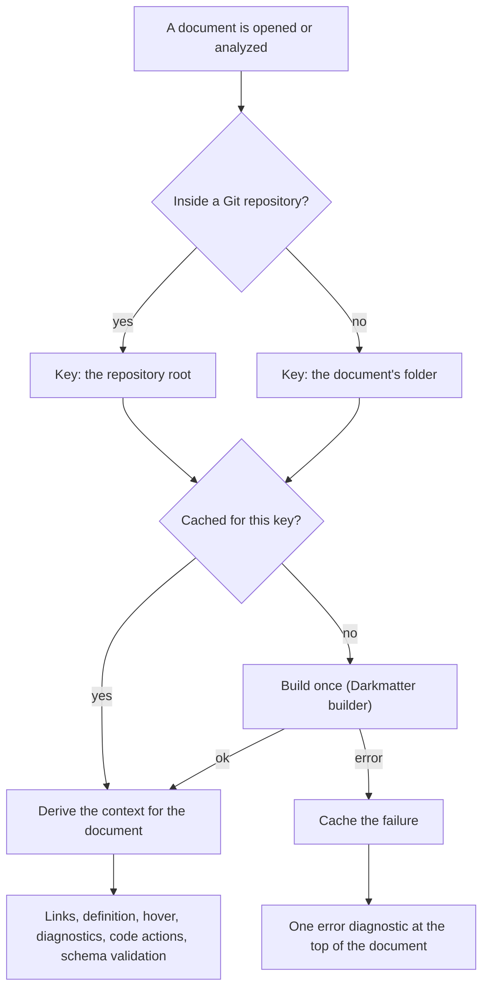

# How DMLS Resolves File References

Every editor feature that follows a path resolves it the way `md compose`
does when you run it from the repository root. That covers links, `::file`,
`::code`, and `::toc-linking` targets, `$schema` values, and `file(...)`-typed
frontmatter values. A `&`, `^`, or `@` reference that composes also resolves in the
editor, and one that fails to compose is flagged.

```markdown
<!-- repo/area/pkg/docs/guide.md -->
::file &README.md          <!-- the repository root's README.md -->
::file ^CHANGELOG.md       <!-- the package's, else the area's, else the root's -->
::file @prompts/review.md  <!-- the `@` search chain -->
[setup](./setup.md)        <!-- beside this document, then the repository root -->
```

The sigils themselves are defined in
[File references](../../../biscuit-file/docs/topics/file-references.md). This
page covers how the editor gets the context they resolve in.

## One context per repository

A **context** holds what references resolve against: the repository root,
its package catalog (for `^`), the `@` roots, `HOME` (for `~`), and the
environment (for `{{VAR}}`). DMLS builds it with Darkmatter's
`build_resolution_context`, the same builder `md` uses.

- **One build per repository.** The first time DMLS sees a document in a
  repository, it builds that repository's context and caches it. Every other
  document in the repository reuses the cached context, derived for its own
  folder.
- **The request directory is the repository root.** This holds even when your
  editor's workspace folder is above the repository, or is one of several
  folders inside it. Editor results therefore equal `md compose` run from the
  repository root.
- **No repository, its own folder.** A document outside any repository gets a
  context for its own folder. Relative paths work there, and `&` and `^` fail
  with `MissingContext` because there is no repository to anchor them.
- **`HOME` and the environment are fixed at startup.** DMLS reads them once,
  when the server starts. Restart the server to pick up a change.



## What drops a cached context

A cached context, or a cached failure, is dropped and rebuilt on the next
request when any of these happen:

| Event | What is dropped |
|---|---|
| `workspace/didChangeWatchedFiles` names a path | Every entry keyed at an ancestor of the path, plus, for a file inside `.git/`, every entry keyed inside that repository |
| A save triggers the server-side rescan (clients without a file watcher) and the rescan finds a changed document or package manifest | The same entries as for a watched change at that path |
| `workspace/didChangeConfiguration` | Every entry |

DMLS asks watching clients to report Markdown files, schema YAML, the package
manifests sniff detects packages by (`Cargo.toml`, `package.json`,
`pyproject.toml`, `go.mod`), and `.git/config`. Adding a package changes what
`^` finds, so the new manifest alone is enough:

```text
repo/pkg/doc.md contains   ::file ^pkg-only.md
repo/pkg/pkg-only.md       exists, but pkg/ is not a package yet → broken
add repo/pkg/Cargo.toml    the client reports it → the context rebuilds → resolves
```

Each drop also re-resolves the workspace graph and re-publishes diagnostics
for every open document.

## When a context cannot be built

The builder fails when repository discovery fails, for example on a corrupt
`.git/config`, or when the context it builds is invalid. DMLS then:

- publishes exactly one **error** diagnostic at line 0, column 0, with code
  `dm.context.build_failure`, a message naming the failure class and the
  directory, and `data: {"resolution_failure": "<Class>"}`;
- logs the failure once, at `error` level;
- resolves **nothing** in that document: document links, go-to-definition,
  and transclusion and link diagnostics return no result. Schema validation,
  schema hover, and schema completion are off too, because the document's
  `$schema` reference and trigger schemas resolve through the same context.
  Nothing falls back to a guess. Features that need no path, such as folding,
  symbols, and expression diagnostics, keep working.

```text
error dm.context.build_failure (darkmatter.context)
file references are not resolved in this document (MissingContext):
repository discovery failed at `/work/repo/docs`: …
```

Repair the cause and the next watched or rescanned change drops the cached
failure. The diagnostic clears and the features return.

## Untitled buffers

An `untitled:` buffer has no folder. It borrows a repository's context when
your workspace folders lie in exactly one repository: each folder counts the
repository that contains it, and repositories nested below a folder do not
count. The buffer is then analyzed as if it sat at that repository's root.

With folders in two or more repositories, or in none, the buffer gets the
`dm.context.build_failure` diagnostic and resolves nothing. Any other choice
would make the same buffer resolve differently depending on which other
folders happen to be open.

## Failure classes on diagnostics

Every diagnostic about a reference that did not resolve carries the class in
its `data`, so a client never has to parse the message:

| Diagnostic | `data.resolution_failure` |
|---|---|
| `dm.links.broken_path` | `NoMatch`, or why the reference could not be planned (for example `MissingContext` for `&` outside a repository) |
| `dm.transclusion.broken_path` | The class from resolving the target |
| `dm.schema.invalid_file_reference` | The class from validating the value (`InvalidReference` for bad syntax, `NoMatch` for a missing file) |
| `dm.context.build_failure` | The build failure's class |

The classes are biscuit-file's `ResolutionFailure` variants: `InvalidReference`,
`MissingContext`, `NoMatch`, `Io`, and `UnsupportedRemote`.

## Resolution without the filesystem

The workspace graph resolves links, transclusions, and file uses without
touching the disk. A reference resolves to the first planned candidate that
is an indexed document, so an unsaved open buffer counts. Features that report
a single target, such as hover, document links, definition, and transclusion
diagnostics, probe the filesystem the way composition does. The
create-missing-file code action creates the file at the first planned
candidate, where `md compose` would look first.
