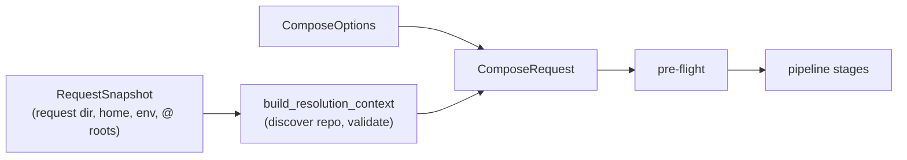

# Composition

Darkmatter's two biggest tasks are **composition** and **rendering** and this document will provide an overview of what **composition** is and how to take full advantage of it.

## Before the Pipeline: the Request

Every composition runs inside a prepared [compose request](../topics/compose-requests.md).
Preparing it fixes, once, where file references start: the request directory,
the home directory, the environment, the repository with its packages, and any
extra `@` roots. Every stage below, and every transcluded child, resolves file
references against that one context, and `ctx.*` and `env.*` read the same
snapshot. `md` prepares the request from the directory you run it in; a
library caller names its directory in a `RequestSnapshot`.



## Pipeline Flow

When we talk about composition we talk primarily about:

1. Inline Operations (pre)
2. Transclusion
3. Inline Operations (post)


### Inline Operations

We compose Inline Operations into two groups:

1. Those which _precede_ Transclusions

    ```mermaid
    flowchart LR
        preflight(Pre-Flight\nChecks)
        interpolation(Interpolate\nFM - 1st pass)
        schema(Schema\nValidation)
        fm_shell(Shell Expansion\nFrontmatter)
        interpolation_2(Interpolate\nFM - 2nd pass)
        text_replace(Text\nReplace)
        page_blocks(Page\nBlocks)
        body_interpolation(Interpolate\nBody)
        body_shell(Shell Expansion\nBody)
        shell_blocks(Shell Expansion\nBody Blocks)
        link_resolve(Link\nResolve)
    
        preflight --> interpolation --> schema --> fm_shell --> interpolation_2 --> text_replace --> page_blocks --> body_interpolation --> body_shell --> shell_blocks --> link_resolve
    ```

2. and those who _follow_ Transclusion

    ```mermaid
    flowchart LR
    clean
    normalize
    
    clean --> normalize
    ```

While these groups are important to distinguish between they both are characteristically similar in a way that distinguishes them from **Transclusion**:

- all operations work on a single document
- they can mutate the Frontmatter, mutate the prose/body section, they can _link_ to other content, but
- they can NOT bring in other pages content directly into the page

An inline operation is _not_ recursive in nature whereas Transclusion is.

### Transclusions

The other major operation type originates from
