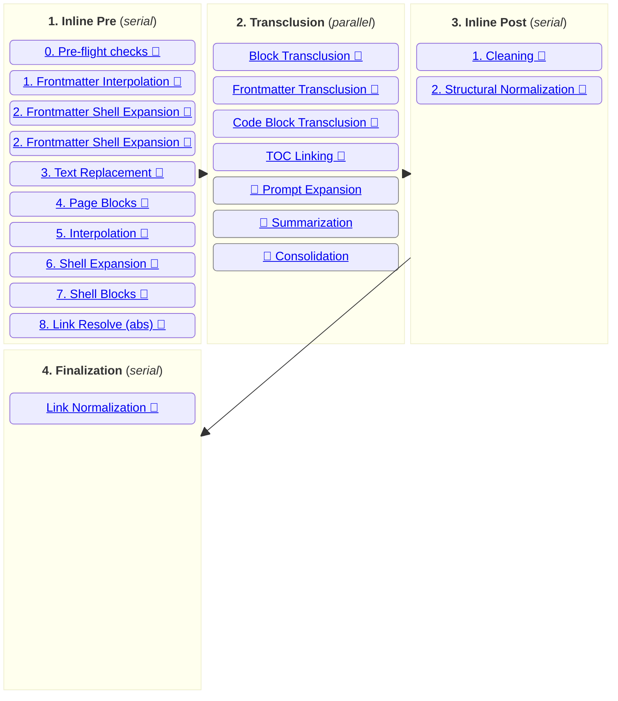
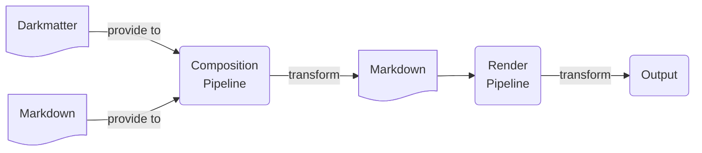

# Darkmatter Compose Pipeline

## High Level Flow

> **Note:** items marked with `🏁` are implemented

## Pipeline Stages

### 1. Inline Pre

The **Pre Transclusion** group are a set operations run in a serial process, one operation after another. These operations take place _before_ any transclusions take place and allow the document to become stable before the transclusion process is executed.

Being run serial is important so that one operation can _setup_ or _effect_ the next operation. Rather then be a side effect, this is intentional and often adds useful power to the pipeline. It does mean, however, that the ordering of these operations must be considered and organized in a way to provide maximum value.

> **Example:** if a conditional page block is evaluated to _false_ (aka, do not render this page), then identifying this first means any
shell expansion commands (or any other inline mutation) contained within the block will now be ignored because this part of the page has
been removed.
>
> **Note:** in this example, even though we will not execute the shell expansion, when we do the pre-flight checks we will require that ALL shell commands are whitelisted before starting the 

### 2. Transclusion

The **transclusion** stage is typified by recursive operations which have the potential to be time consuming (and more dependent on 
[caching](./topics/caching.md)) then those found in the inline steps. 

> **Note:** Not all operations are expensive -- for instance the most common transclusion directive is the `::file <ref>` directive which points to another local Markdown document. Assuming the document it references
doesn't have it's own transclusions this operation will be lightning fast and no slower than any of the the inline mutation operations.
However, even in this example, we don't know how expensive the operation is until the graph dependency has been traversed

### 3. Inline Post

- [Cleaning](./inline/cleaning.md) - makes the markdown as standard bearing and consistent as possible                    
- [Normalization](./inline/structural-normalization.md) - ensures that the heading structure is valid and fixes where it is not

### 4. Finalization

The **finalization** stage is _only_ performed in the root document of the compose operation and does any adjustments on the fully transposed document before passing it back to the caller.

- [Link Normalization](./operations/link-normalization.md) - converts absolute paths back to portable forms (relative, `~/`, or `${ENV}`)

## Rendering

The Compose pipeline does not do any "rendering" per se but it's not uncommon programmatically to chain 
[rendering](./darkmatter-rendering-pipeline.md) immediately _after_ a page being _composed_. In addition the 
Darkmatter CLI reinforces this pattern by providing CLI switches to provide this same chaining. 
This back-to-back pipelining transform is visualized below:

The key things to remember are:

- the **Compose Pipeline** expects either Markdown or Darkmatter content as input
    - in the case of receiving a Markdown document _without_ any Darkmatter directives, only very mild formatting changes from operations like 
- the [Rendering Pipeline](./darkmatter-render-pipeline.md) expects to receive Markdown content not Darkmatter and it returns one of the supported [output formats](./topics/output-formats.md).

> For more details on the **rendering pipeline** always refer to: [Rendering Pipeline](./darkmatter-rendering-pipeline.md)
