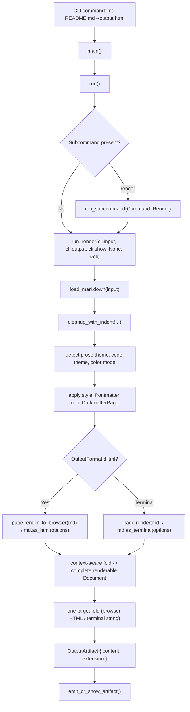

# Darkmatter Rendering Pipeline

## Functional Goal

The _rendering_ pipeline is designed to receive Markdown content and transform it into some other form. The _outputs_ the pipeline produces is illustrated below:

## Render Features

Every target output will have different capabilities but outside of the **AST** output, which does not implement any of these features, the goal is to maximize each targets ability implement the features listed below but it's important to recognize that both the **Terminal** and the **Enriched Markdown** have important design and capability constraints. Only the **Web** target will fully implement all of these. 

- [Table Rendering](./rendering/table-rendering.md)      
- [Block Quotes](./rendering/block-quote.md)
- [YouTube Embedding](./rendering/youtube-embedding.md)  
- [Popover](./rendering/popover.md)                      
- [List Expansion](./rendering/list-expansion.md)        
- [Smart Image](./rendering/smart-image.md)              
- [Image Rendering 🏁](./rendering/image-rendering.md)  
- [Disclosure Blocks](./rendering/disclosure.md)         
- [Block Columns](./rendering/block-columns.md)          
- [Audio Content](./rendering/audio-content.md)          
- [Mermaid Rendering 🏁](./rendering/mermaid.md)         
- [TOC Generation](./rendering/toc-generation.md)        
- [Person Card](./rendering/person.md)                   
- [Place Card](./rendering/place.md)                     
- [Product Card](./rendering/product.md)     

## Pipeline Operations

The primary library we are leveraging in the conversion process is the `pulldown-cmark` crate. With this crate we are able to create a single pass

The transformation of the input Markdown to one of the targeted output flows along a set of operations. Each operation is responsible for a targeted mutation to the input document. 

All of the operations, in the order in which they are executed

            

## CURRENT STATE NOTES

The render path runs on the canonical `renderable` render tree. The legacy
single-pass, event-stream HTML/terminal serializers (`output::as_html`'s manual
event loop, `MarkProcessor`, `RuleProcessor`) have been **deleted**.

- The CLI always runs the compose pipeline before rendering.
- The public entry points are `Markdown::as_html` and `Markdown::as_terminal`
  (`markdown/mod.rs`), plus `DarkmatterPage::render` / `render_to_browser`
  (`layout/page.rs`). All of them render `md.content()`, so YAML frontmatter is
  already split off and attached to the `Document`'s metadata above the fold.
- Every path folds the `pulldown-cmark` 0.13 event stream into a complete
  `renderable::tree::Document` via darkmatter's **context-aware** fold
  (`render_tree::build_context`, a `TreeBuildContext`), then runs **one target
  fold** (terminal / browser / Markdown) over it. There is no post-fold
  decoration pass and no post-render HTML rewriting.
- Component policy, page-inheriting color, alpha-bearing `PaintColor`,
  hyperlink/image text layout, structured link/image browser attrs, and HR
  defaults are all baked onto the tree nodes **during construction** by the build
  context — see [Render-Tree Fold](./render-tree-fold.md).
- Structured link/image metadata (class, target, `data-*`, per-node CSS) is
  parsed once during construction into typed `NodeAttrs::browser` attrs and
  lowered by the browser fold to `<a>` / `` attributes; a validated
  `inline_style` replaces the derived `Style` declaration for the same property.
- Fenced code blocks fold to `NodeKind::Code` and are syntax-highlighted by the
  shared code renderer (syntect-backed). A malformed fenced code-block directive
  is a fatal `MarkdownError::InvalidLineRange` via the `validate_code_directives`
  preflight the HTML entry points run over the folded tree. Mermaid fences route
  through `biscuit-terminal` (terminal) / darkmatter's `Mermaid` (HTML).
- Code highlighting resolves the mode-agnostic `ThemePair` (`code_theme`) to a
  concrete light/dark theme via `color_mode`. Both the HTML and terminal paths
  invert the code theme for page contrast (`ColorMode::inverted()`), so a dark
  page gets a light code panel on either target. See
  [Code Highlighting](./rendering/code-highlighting.md).
- The HTML browser fold produces a fragment; `DarkmatterPage::render_to_browser`
  and `HtmlPage` assembly compose the full document. Raw HTML handling follows
  the renderable browser renderer's `RawHtmlPolicy`.

### Render Path

