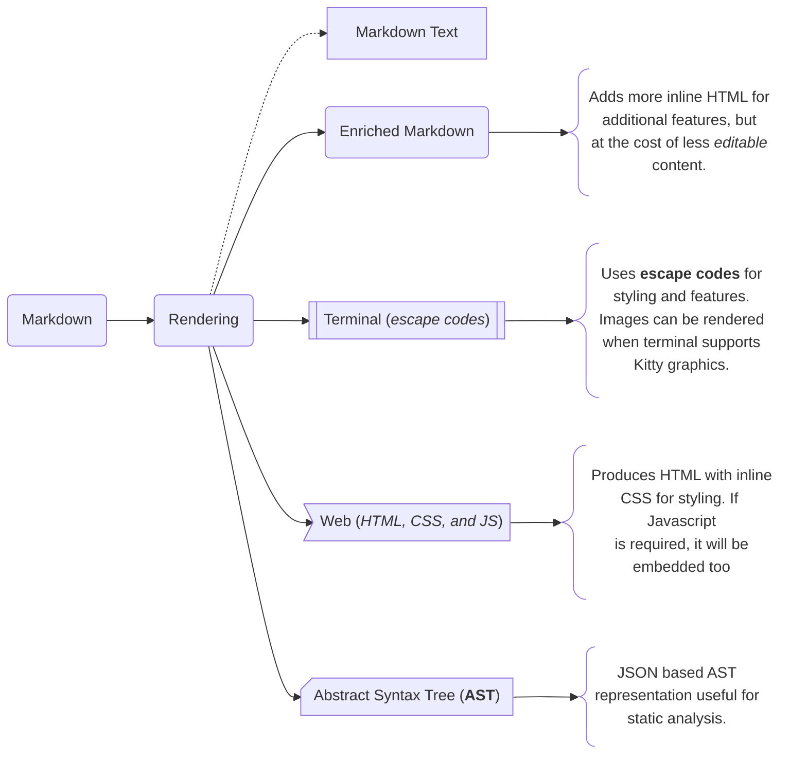
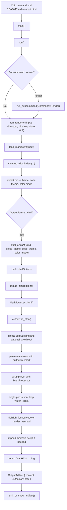

# Darkmatter Rendering Pipeline

## Functional Goal

The _rendering_ pipeline is designed to receive Markdown content and transform it into some other form. The _outputs_ the pipeline produces is illustrated below:

## Render Features

Every target output will have different capabilities but outside of the **AST** output, which does not implement any of these features, the goal is to maximize each targets ability implement the features listed below but it's important to recognize that both the **Terminal** and the **Enriched Markdown** have important design and capability constraints. Only the **Web** target will fully implement all of these. 

- [Table Rendering](./rendering/table-rendering.md)      
- [YouTube Embedding](./rendering/youtube-embedding.md)  
- [Popover](./rendering/popover.md)                      
- [List Expansion](./rendering/list-expansion.md)        
- [Smart Image](./rendering/smart-image.md)              
- [Image Rendering 🏁](./rendering/image-rendering.md)  
- [Disclosure Blocks](./rendering/disclosure.md)         
- [Block Columns](./rendering/block-columns.md)          
- [Audio Content](./rendering/audio-content.md)          
- [Mermaid Rendering 🏁](./rendering/mermaid.md)         
- [TOC Generation](./rendering/toc-generation.md)        
- [Person Card](./rendering/person.md)                   
- [Place Card](./rendering/place.md)                     
- [Product Card](./rendering/product.md)     

## Pipeline Operations

The primary library we are leveraging in the conversion process is the `pulldown-cmark` crate. With this crate we are able to create a single pass

The transformation of the input Markdown to one of the targeted output flows along a set of operations. Each operation is responsible for a targeted mutation to the input document. 

All of the operations, in the order in which they are executed

            

## CURRENT STATE NOTES

- the CLI currently always runs the compose pipeline before rendering (this is probably largely a good idea)
- The current library path is a single-pass, event-driven renderer, not an AST-to-HTML pipeline (this was intended and probably still makes sense)

- The public entry point is Markdown::as_html() in markdown/mod.rs (line 502). 
- It just delegates to output::as_html() in output/html.rs (line 108). 
- It renders md.content(), so YAML frontmatter has already been split off and is not included in the HTML body; that comes from Markdown::content() (line 140).

- `as_html()` (line 108) creates a CodeHighlighter and, if enabled, prepends an inline `<style>` block from generate_styles() line 569.

- It parses the markdown body with `pulldown-cmark`, but only with ENABLE_STRIKETHROUGH turned on in this renderer path, at output/html.rs (line 119). 
- It does not use the shared markdown_parse_options() helper that enables tables elsewhere in the crate at markdown/mod.rs (line 773).

- That parser is wrapped in MarkProcessor (line 94), which rewrites ==highlight== text into custom start/end mark events while skipping code spans and code blocks; see inline/mod.rs (line 127).

- The renderer then streams through those events and manually appends HTML strings. The handled block/inline elements are headings, paragraphs, strong/emphasis/strikethrough, lists, blockquotes, links, inline code, images, text, and line breaks; that logic is in output/html.rs (line 134).

- Fenced code blocks are buffered until the closing fence. Their info string is parsed with parse_code_info, then either:

    - rendered as syntax-highlighted HTML via highlight_code_block() (line 447), which uses syntect and emits inline `` fragments, optionally with a line-number table, or
    - treated as Mermaid if the language is mermaid and mermaid_mode is enabled, at output/html.rs (line 150).
    - Links and images get extra Darkmatter-specific handling:

- links parse structured metadata out of the markdown title via `Link::with_title_parsed(...)`, then emit attributes like class, style, target, title, and data-*; see output/html.rs (line 272).
- images are reconstructed into an ImageRef when possible, then rendered with ImageRef::to_html(); see output/html.rs (line 329).
A few important current-state caveats:

- The result is an HTML fragment, not a full document. 
    - The CLI just writes that fragment directly as the .html artifact in darkmatter/cli/src/output.rs (line 63).
    - Raw HTML inside markdown is escaped, not passed through, at output/html.rs (line 380).
    - HtmlOptions.prose_theme exists, but this renderer does not currently use it; only code highlighting is theme-driven in practice.
    - Code highlighting resolves the mode-agnostic `ThemePair` (`code_theme`) to a concrete light/dark theme via `color_mode`. The **HTML path uses `options.color_mode` directly** (no inversion); the **terminal path inverts** the code theme for page contrast (`ColorMode::inverted()`). See [Code Highlighting](./rendering/code-highlighting.md).
    - Mermaid is special-cased, but the HTML renderer only inserts Mermaid::render_for_html().body and later appends its own generic script block. It does not use the Mermaid renderer’s head output, even though that method produces one at mermaid/mod.rs (line 265).

### Render Path

