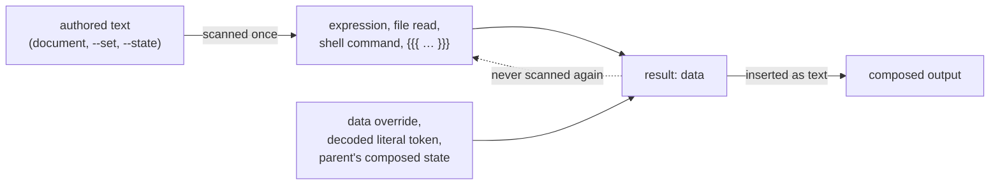
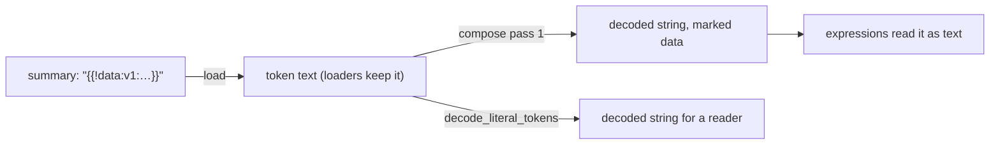

# Interpolation

The Darkmatter compose pipeline provides interpolation of frontmatter, context, and environment values into a document.

Interpolation happens in two stages during the compose pipeline (see the [pipeline overview](../darkmatter-compose-pipeline.md)):

1. **Frontmatter Interpolation** — resolves `{{ }}` expressions inside frontmatter values using seed (non-templated) frontmatter, the `doc` / `doc.*` namespace, `ctx.*`, and `env.*`. This stage itself runs in **two passes** that bracket frontmatter shell expansion (pass 1 pre-shell, pass 2 post-shell, which scans only the keys pass 1 deferred). See [Frontmatter Interpolation](./fm-interpolation.md) for full details.
2. **Body Interpolation** — resolves `{{ }}` expressions in the document body using the effective state (frontmatter + external state + context).

Both stages also expose the [read-side functions](../topics/darkmatter-expressions.md#read-side-functions) (`file_exists`, `frontmatter`, `absolute`, `relative`, …) and the `doc.*` namespace — the same grammar resolves identically across every surface.

Body interpolation runs after text replacement and page blocks have been applied. Within the body, all handlebar placeholders like `{{foo}}` or `{{bar}}` are replaced with their resolved values.

### Nullable directive targets

A whole-value `{{ ... }}` target on `::file`, `::code`, or `::url` has special
absence semantics. If it evaluates to `null` or the empty string, Darkmatter
skips that directive and records a compose warning instead of turning the
value into an authored empty target. Literal missing targets, `::file ""`, and
mixed targets such as `::file "{{dir}}/log.md"` keep their ordinary syntax and
path behavior.

Page blocks run before body interpolation, so the recommended optional-file
form removes the directive before its target is evaluated and suppresses the
runtime warning:

```md
::block when="file_exists(log)"
::file {{log}}
::end-block
```

Shell-approval preflight remains condition-blind: it scans every branch for
commands, but an evaluated-absent target contributes no transclusion edge.
Targets that depend on pending frontmatter shell expansion fail closed before
approval rather than disappearing and later revealing unapproved content.

- **Fallback Values**
    - if a template placeholder in the document refers to a frontmatter property that has no value then the default value of an empty string will be used.
    - when nothing defines that property — no frontmatter key, caller input, or schema property — composition also warns, because the name is most likely a typo (see [Missing Variables](#missing-variables)).
    - this default is suitable for some situations but not others so you are allowed to express a fallback you'd like to use instead with the following syntax, which also tells Darkmatter the absence is intended:

      ```md
      Bob's favorite color is {{ color || "unknown" }}.
      ```

- **Boolean Switch**

    - instead of just having a fallback, it is also possible to use a _truthy_ test to provide a value:

      ```md
      Bob's favorite color is {{ color ? "known" : "unknown" }}.
      ```

    - in this example if the frontmatter property `color` is _truthy_ then we'll replace with `known` otherwise `unknown`.

- **Nested Ternary**

    - ternary expressions can be nested in either branch without extra parentheses:

      ```md
      {{ show_details ? has_name ? name : "unnamed" : "hidden" }}
      ```

    - the expression above is parsed as `show_details ? (has_name ? name : "unnamed") : "hidden"`
    - parentheses may still be used for visual clarity when desired:

      ```md
      {{ show_details ? (has_name ? name : "unnamed") : "hidden" }}
      ```

- **Comparison Switch**

    - rather than relying on the truthiness of a particular property, you may sometimes want to use an explicit comparison operation
    - comparison operators supported are:
        - `==` equality
        - `!=` inequality
        - `>` greater than
        - `>=` greater than or equal
        - `<` less than
    - to make the numeric operators more effective we also provide the following conversion utilities:
        - `length(property)` returns a numeric value representing the string length of the property
            - if the property is an array then the numeric value represents the length of the array
            - if the property is a dictionary then the numeric value represents the number _keys_ in the dictionary
        - `number(property, default = 0)` converts a "number like string" to it's numeric value
        - `round(property, default = 0)`
            - rounds a number up or down to an integer value
            - non-numeric properties are converted to the "default" value
    - any numeric comparison where one or both of the values _can not_ be converted into a numeric quantity resolve to a `false` outcome
    - NOTE: if a string value of "6" is used in a numeric comparison we will automatically convert it to the number 6 for the comparison.

      ```md
      Bob's favorite color is {{ color || blue == "blue" ? blue (how original) : nice choice! }}
      ```

- **Context Variables**

    - there are a certain set of properties that will always be provided to a page as the `ctx` frontmatter value
    - Details on all of the available information provided is found in the document: [Context Variables](../topics/state-management/context-variables.md)

- **Environment Variables**

    - environment variables will be passed through as the `env` variable
    - for example:

        ```md
        Bob's favorite color is {{ env.FAVORITE_COLOR || "unknown" }}
        ```

- **Quoting**

    - when we use a want to express a string literal value we MUST quote the string
        - both single and double quotes are fine (just be consistent on start and end)
    - we _need_ quotations around string literal values because otherwise we would not be able to distinguish between a string literal and a _reference_ to a frontmatter variable.
    - the same is **not** true for numeric values because a numeric value will always be a numeric literal as frontmatter properties can not start with a number
    - For example:

      ```md
      - Bob's favorite color is {{ color ? color : unknown }}
      - Bob's favorite color is {{ color ? color : "unknown" }}
      ```

    - in this example both lines will resolve the frontmatter `color` if it's set but if it's not the two lines will vary:
        - the first line will resolve to the frontmatter property `unknown` which if not set will default to an empty string (and warn, since nothing defines `unknown`)
        - the second line will resolve to the string literal "unknown"

- **Kebab-case Keys**

    - a frontmatter key such as `spec-name` is referenced by its name: `{{ spec-name }}` and `{{ doc.spec-name }}` both read it
    - a `-` joins an identifier only when it sits between identifier characters, so subtraction whose left operand is a name needs whitespace: `{{ iteration - 1 }}` subtracts, while `{{ iteration-1 }}` reads a key named `iteration-1`
    - bracket access still reaches keys the identifier form cannot spell, such as `{{ doc['release.channel'] }}`
    - see [Lexing § `-` inside an identifier](../topics/parsing/lexing.md#--inside-an-identifier) for the full rule

## Missing Variables

A reference to a property that has no value renders as an empty string, and
composition continues. Whether it also warns depends on whether anything
**knows** the name:

| The name is | Result |
| --- | --- |
| present in frontmatter, `--set`, inherited state, or another caller input — even as `null` or `""` | silent |
| declared by the effective schema (the document's `$schema`, the configured baseline, or a matched trigger) | silent; a `required` property left unset already failed schema validation |
| a reserved namespace (`ctx`, `env`, `doc`, …) or a runtime context name | silent |
| none of the above | warning `dm.expression.unknown_identifier`, once per name per source document |

```text
unknown identifier 'colour' at docs/page.md:5: no frontmatter key, caller
input, or schema property defines it, so it resolves to null
```

The warning is decided by the name's root: `{{ user.name }}` warns when nothing
defines `user`. It is suppressed where the author has handled the absence:

| Expression | Unresolved `x` warns? |
| --- | --- |
| `{{ x }}` | yes |
| `{{ x \|\| "d" }}` | no — primary of a fallback |
| `{{ a \|\| x }}` | yes, when the right-hand side is evaluated |
| `{{ x ? a : b }}` | no — ternary condition |
| `{{ x ? x : b }}` | no — the branch is guarded by `x` |
| `{{ a ? x : b }}` | yes, when the `x` branch is evaluated |
| `{{ is_null(x) }}`, `{{ is_empty(x) }}` | no — direct argument of an absence predicate or one of its aliases |
| `{{ is_empty(lower(x)) }}` | yes — the predicate no longer guards the lookup directly |
| `::block when="x"` | yes — a misspelled gate would silently hide content |

Composition warns only for what it evaluates, so an unchosen ternary branch or a
short-circuited fallback never warns. The same rule applies to frontmatter
interpolation, `when="…"` conditions, and `$()` ternaries. The language server
applies the same suppressions while you edit, but checks both ternary branches
(see [DMLS diagnostics](../../dmls/docs/diagnostics.md)).

## Failures

An expression that cannot be parsed, or that fails to evaluate (an unknown
function, a wrong argument type), is an authoring error. It **fails
composition** with exit code 1, naming the file, the authored line and
column, and the expression. Nothing is written to stdout, and the `{{ … }}` never reaches the
output. `ComposeOptions::with_fail_fast(false)` does not relax this; it governs
recoverable non-expression stages such as TOC linking.

A missing *value* is not a failure — see [Missing Variables](#missing-variables).


## Interpolation Literals

When you want to *show* the `{{ ... }}` syntax rather than evaluate it, wrap the span in an extra pair of braces: `{{{ ... }}}`. This interpolation literal composes to the literal text `{{ ... }}` and the content is never evaluated.

```md
Use `{{{ name }}}` to reference the `name` frontmatter value.
```

After compose, the body above becomes:

```md
Use `{{ name }}` to reference the `name` frontmatter value.
```

### Recognition rules

- A literal opens only at **exactly three consecutive `{` characters**. Four or more braces in a row (e.g. `{{{{`) fall through to the existing `{{` scanner behavior.
- A literal closes at the **first subsequent `}}}`**. Because the first `}}}` terminates the literal, content cannot itself contain `}}}`; use a fenced code block to document such a span.
- An **unclosed** `{{{` with no later `}}}` is not a literal. The scanner falls back to the legacy `{{` behavior at the same position, preserving the current malformed-expression diagnostic.
- Literals inside **fenced and indented code blocks** are treated as plain text and are not converted. Inline code spans are scanned, so `{{{ ... }}}` is the correct way to write literal interpolation syntax inside backticks.
- Empty content is allowed: `{{{}}}` becomes `{{}}` and `{{{ }}}` becomes `{{ }}`.

### Examples

```md
Tight form: {{{x}}} becomes {{x}}.
Empty form: {{{}}} becomes {{}}.
Adjacent: {{ a }}{{{ b }}} evaluates a and emits {{ b }} literally.
Nested expression: {{{ {{ x }} }}} becomes {{ {{ x }} }} with x unevaluated.
```

### Frontmatter literals

A literal in a frontmatter value is always text. `key: "{{{ x }}}"` resolves to the string `{{ x }}`, and that string is data from then on: no later frontmatter pass, body reference, or transcluded child evaluates it.

```md
---
area: claudine
note: "fixed {{{ area }}}"
---
Body: {{ note }}
```

composes to `Body: fixed {{ area }}`.

## Inserted Text Is Data

Every authored span is scanned **once**. The text an expression returns, a file read (`frontmatter(...)`), a shell command's output, a literal's output, a decoded [literal token](#literal-tokens), and a caller's data override are data: Darkmatter never scans them again for `{{ … }}`, `{{{ … }}}`, a whole-value `$( … )`, or a body directive (`::shell`, `::shell-block`, `::file`, `::code`, `::url`, `::block`). This holds in frontmatter, in the body, and in transcluded children, which receive their parent's composed values as data.



The rule exists so that text Darkmatter did not author cannot become an instruction. A value that came from a file, a command, or an AI agent's output can mention `{{ ctx.repo }}` or `$(rm -rf x)` and still compose to exactly those characters.

| Inserted text | Result |
| ------------- | ------ |
| `{{ x }}` where `x` is `see {{ y }}` | `see {{ y }}`, never evaluated |
| `{{ x }}` where `x` is `::shell echo hi` | the text `::shell echo hi`, never run |
| `{{ x }}` where `x` is `` ``` `` | text; it cannot open a code fence that hides a later authored directive |
| `::shell {{ exe }} arg` | rejected: an expression may supply arguments, never the executable, a chain operator, or a redirection |
| `::shell-block` holding `echo {{ x }}` where `x` has a line break | rejected: data cannot split or join the block's commands |
| a missing relative link inside inserted text | a warning, not a reference-validation error |

A text replacement (`replace:`) writes its value as authored text when the value is authored, so a replacement can still expand to a directive, and as data when the value was itself produced (for example `replace: {X: "{{ y }}"}`).

A caller can inject data directly: `ComposeOptions::with_data_overrides` and `ComposeOptions::with_override_layers` insert values that are never scanned. `--set` / `with_set_overrides` values are authored templates: a person typed them.

```bash
md compose doc.md --set '{"note": "{{ title }}!"}'   # note becomes "<title>!"
```

Because a `--set` value is scanned, it can also fail to parse. The error names the override rather than the document, which never defined the key:

```text
MarkdownError: interpolation failed
The note frontmatter property failed to evaluate `…`:
parse error: Unexpected character: '…' at position 0
The value came from a command-line override (`--set`), not from the document.
```

An error in a value the document authored keeps its `Defined in:` file, line, and excerpt.

### Migrating from Rescanning

Earlier releases rescanned the text a replacement produced, repeating until nothing changed (a fixed point, capped at ten passes). A template could therefore build another template: a ternary branch holding `{{ x }}`, a frontmatter value holding `{{{ x }}}` that the body later evaluated, or a shell command whose output contained `{{ x }}`. That rescan is gone, and those inner spans now compose as literal text.

To keep the old output, make every expression an authored span. Either concatenate inside one expression:

```md
<!-- Before: relied on a rescan; now composes to "inside {{proj}} now" -->
Nested: {{ proj ? "inside {{proj}} now" : "none" }}

<!-- After: composes to "inside Darkmatter now" -->
Nested: {{ proj ? "inside " + proj + " now" : "none" }}
```

or write the span unescaped where it should be evaluated, instead of deferring it with `{{{ … }}}`:

```yaml
# Before: body {{ tmpl }} rendered "Hello Ada"; it now renders "Hello {{ name }}"
tmpl: "Hello {{{ name }}}"

# After: an authored span, evaluated here; body {{ tmpl }} renders "Hello Ada"
tmpl: "Hello {{ name }}"
```

A `{{{ … }}}` escape now always means "show these braces", in every later pass and every transcluded child. [`lint_expression`](#braces-inside-string-literals) finds nested spans inside quoted literals and suggests the `+` rewrite.

### Literal Tokens

A file can also store a frontmatter string as data, so the next compose of that file does not read it as a template. A tool writes the value as a **literal token**: `{{!data:v1:` plus the string's UTF-8 bytes in unpadded URL-safe base64, then `}}`. It is always written as a double-quoted YAML scalar.

```yaml
---
area: claudine
# The string `fixed {{ area }} parsing`, stored as data
summary: "{{!data:v1:Zml4ZWQge3sgYXJlYSB9fSBwYXJzaW5n}}"
---
{{ summary }}
```

This composes to `fixed {{ area }} parsing`. Frontmatter pass 1 decodes the token once, and the decoded string is data: it is never evaluated, never converted, and never a shell command, even when it reads `$(echo X)`. The file keeps the token until a person edits it.



| Written | Result |
| ------- | ------ |
| `k: "{{!data:v1:JChlY2hvIFgp}}"` | the string `$(echo X)`, never run |
| `k: "{{!data:v1:}}"` | the empty string |
| `k: "see {{!data:v1:YQ}}"` | error: a token must be the entire value |
| `k: " {{!data:v1:YQ}}"` | error: nothing may surround the token, whitespace included |
| `k: "{{!data:v2:YQ}}"` | error: unsupported version |
| `{{!data:v1:YQ}}` in the body | error: tokens exist only as frontmatter values |
| `{{ 'a {{!data:v1:YQ}}' }}` | error: a token inside an expression |
| `k: "{{{!data:v1:YQ}}}"`, `\{{!data:v1:YQ}}` | the spelling as text, via the usual escapes |

A malformed or misplaced token fails composition under every policy, preflight included, with the token's line and column; it is never read as an expression.

```text
MarkdownError: malformed literal token
The k frontmatter property holds `{{!data:v2:YQ}}`, which is not a valid literal token:
unsupported literal token version `v2` (this build reads `v1`)
Defined in: doc.md
Expression at line: 2, column: 5
```
 A token inside a fenced or indented code block is not scanned, like any other `{{`.

- **Reading a file's values.** Loaders keep tokens encoded. A reader that needs the strings calls `darkmatter::markdown::literal_token::decode_literal_tokens` on a loaded value, or `Frontmatter::decoded_literal_tokens`. Do not hand the decoded values back to composition as authored text, because it would scan them. A lexical "is this still a template?" check uses `literal_token::holds_pending_syntax`, which never treats a whole token as pending. The `frontmatter(path)` / `frontmatter(path, prop)` and `markdown_title(path)` expression functions decode for you: `{{ frontmatter('log.md', 'note') }}` inserts the text a stored token holds, never its `{{!data:v1:…}}` spelling. What they return is data, like any expression result, and a malformed token comes back unchanged instead of failing the expression.
- **Decoding one token.** `literal_token::decode(token)` returns the string or a `TokenError` (`NotAToken`, `Unterminated`, `MissingVersion`, `UnsupportedVersion`, `InvalidPayload`, `InvalidUtf8`, `Embedded`). `decode_leaf(value)` returns `None` for a value that is not a token at all.
- **Finding a token's bytes.** `darkmatter::markdown::hash::locate_frontmatter_leaves(document, paths)` returns the exact source range of each requested string leaf (quotes and a block scalar's header included), so a writer can replace one value in place without re-serializing the document. It refuses a leaf behind an anchor, alias, tag, or `<<` merge, a plain flow-collection item, and a nested sequence.
- **Writing a token.** `literal_token::encode_yaml_scalar(value)` returns the quoted scalar and `encode(value)` the bare token. Decide from where the value came from, never from what it looks like: a string that already resembles a token is encoded again.
- **Lifecycle keys.** A key the caller defers to event time (Claudine's lifecycle stacks) keeps its raw text, token included, for the caller that evaluates it.

#### Editing a Token by Hand

A token is written by tools, but a person can change the value it holds. Decode the payload, edit the text, and write it back in one of two ways.

```sh
# Decode: prints `fixed {{ area }} parsing`
python3 -c 'import base64,sys; p=sys.argv[1]; print(base64.urlsafe_b64decode(p + "=" * (-len(p) % 4)).decode())' \
  Zml4ZWQge3sgYXJlYSB9fSBwYXJzaW5n

# Encode the edited text: prints `{{!data:v1:…}}`
python3 -c 'import base64,sys; print("{{!data:v1:" + base64.urlsafe_b64encode(sys.argv[1].encode()).decode().rstrip("=") + "}}")' \
  'fixed {{ area }} parsing, and more'
```

1. **Re-encode it** and paste the new token between double quotes. The value stays data. This is the only safe choice when the text contains a whole-value `$( … )`.
2. **Write a plain quoted value** instead. The key is now authored, and Darkmatter scans it like any other frontmatter you wrote.

The second choice is where edits go wrong. Pasting the decoded text back verbatim turns every `{{ … }}` into a template again, and a value that is exactly `$( … )` into a shell command:

```yaml
# The token held `fixed {{ area }} parsing`
summary: "fixed {{ area }} parsing"     # template: composes to "fixed claudine parsing"
summary: "fixed {{{ area }}} parsing"   # text: composes to "fixed {{ area }} parsing"
```

Use `{{{ … }}}` for each brace pair you want to keep as text, or re-encode. A hand-edited token that no longer decodes fails composition with its line and column, so a typo in the payload cannot slip through as an expression.

> **Follow-up.** The language server (DMLS) does not yet show a token's decoded text on hover or inline, so an editor displays the raw `{{!data:v1:…}}` spelling. Until it does, decode with the commands above or with `literal_token::decode`.


## Escaping an Opener with a Backslash

A document that discusses another template language (Handlebars, Liquid, Jinja, Mustache) can opt a span out of scanning without switching to `{{{ … }}}`:

```md
Handlebars writes a variable as \{{ name }} and a partial as \{\{> header }}.
```

- `\{{` and `\{\{` are both inert. `\{{` is an explicit scanner rule; `\{\{` never forms a `{{` opener in the first place.
- The scanner counts the run of backslashes directly before `{{`. An **odd** run escapes the opener. An **even** run escapes itself, so `\\{{ x }}` still interpolates `x`.
- Compose **preserves every backslash**. The Markdown renderer resolves the escape under CommonMark's backslash-before-punctuation rule, so `\{{` displays as `{{`.
- Parity is counted on the text the scanner receives, after its owning format has decoded it. Inside a double-quoted YAML scalar, write `"\\{{ x }}"` so the decoded value holds one backslash.

## Braces Inside String Literals

A quoted string literal inside an expression is text. The lexer copies it verbatim, so `{{ "in {{ area }}" }}` does not contain a nested expression at parse time. Whether those braces are ever interpolated depends on the surface:

Every surface is single-pass: the literal's braces land in the output as data and are never interpolated. The body and mixed frontmatter strings (`"Hello {{ name }}"`) insert them as text, and a scalar whose trimmed content is **exactly one** `{{ … }}` span takes the whole-value path, which parses and evaluates once and keeps the typed result. `r: "{{ 'b {{ name }}' }}"` composes to `b {{ name }}`, and a body reference `{{ r }}` inserts that text unchanged. Claudine's lifecycle values (communication fields, stack operands, `proxy … with` values, and `when`/`while`/`until` predicates) are single-pass too, and Claudine refuses a nested span there before any provider starts.

Write the value with `+` instead. It resolves on every surface:

```yaml
# Never resolves: the inner braces are text
say: '{{ area ? "Review in {{ area }} completed" : "Review completed" }}'

# Resolves everywhere
say: '{{ area ? "Review in " + area + " completed" : "Review completed" }}'
```

`lint_expression` (in `compose::expression::lint`) finds the defect in authored source and offers the complete `+` rewrite. The rewrite does the following:

- keeps each literal piece byte-for-byte in its original quote character;
- parenthesizes any lifted span that is not atomic, so a ternary or `+` expression keeps its meaning;
- anchors a span with `"" + …` wherever `+` could otherwise add two numbers instead of concatenating;
- is accepted only when it re-parses to the intended tree.

Array- and object-valued spans receive a suggestion like any scalar: both rendering paths stringify aggregates as compact JSON, so the rewrite composes the same text. The suggestion is withheld only when no equivalent rewrite exists. That covers a nested span that does not parse, a literal used as an object key, a `{{{ … }}}` literal sharing the string, and a doubly nested literal.

The lint only describes syntax; callers decide where to report it. A `{{{ … }}}` inside a quoted literal is not a nested span.


## Implementation

The current implementation uses a source-first scanner that reads each authored span once (see [Inserted Text Is Data](#inserted-text-is-data)):

- A scanner finds `{{ ... }}` spans in the document body, and also recognizes `{{{ ... }}}` interpolation literals. Inline code spans (single backticks) are interpolated by default, since the templating pattern `` `var_{{ phase }}` `` is a common use case, and literals inside inline code convert to literal `{{{ ... }}}` text. Fenced and indented code blocks are skipped.
- Each expression is parsed with a dedicated tokenizer and evaluator
- The interpolation context is built from the effective state (frontmatter + external state), `ctx.*` runtime values, and `env.*` environment variables
- Replacements are applied from the end of the string backward to preserve offsets
- Literal conversion (`{{{ ... }}}` → `{{ ... }}`) happens in the same scan as expression evaluation, so only authored literals convert; a literal a replacement value introduces stays as written
- The body carries the byte ranges of inserted data through every stage that rewrites it, until the transclusion directive parse. Each stage that looks for instructions reads a masked view in which data bytes cannot form an expression, a directive, or a code fence; if the ranges ever stop describing the body, composition fails rather than treat data as authored
- A failing expression fails document composition. Under the lenient policy that only `compose_subtree(..., SubtreeStrictness::Lenient)` and preflight discovery use, it is left in place and reported once. Coded warnings are reported once per issue: an unknown `ctx.*` group warns once per source document however often it is referenced, and a transcluded document's issues stay separate from its parent's

See the source modules:

- `darkmatter/lib/src/markdown/compose/interpolation/` — lexer, evaluator, rewriter
- `darkmatter/lib/src/markdown/compose/frontmatter_interpolation.rs` — frontmatter-specific interpolation engine
- `darkmatter/lib/src/markdown/compose/value_origin.rs` and `body_origin.rs` — which frontmatter values and body bytes are data
- `darkmatter/lib/src/markdown/literal_token.rs` — the `{{!data:v1:…}}` codec and `decode_literal_tokens`
