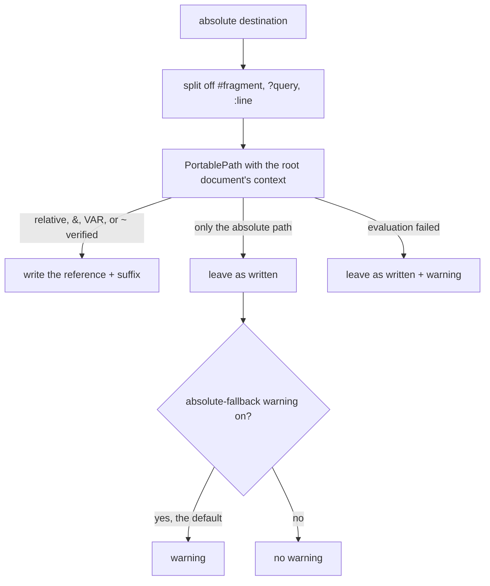

# Link Normalization

**Link Normalization** is the finalization operation that turns the absolute
link destinations of a composed document back into portable references. It
runs once, on the **root document**, at the very end of the composition
pipeline.

Earlier in the pipeline, [Link Resolve](../operations/link-resolve.md) rewrote
every local link it could resolve to an absolute path, so a link authored in a
transcluded child still points at the right file once the child's text sits
inside the root document. Link Normalization undoes that, choosing a spelling
that survives moving the document, the repository, or the whole machine.

```text
composed root document: /home/ana/repo/docs/guide/intro.md

/home/ana/repo/docs/guide/setup.md       → ./setup.md
/home/ana/repo/docs/guide/img/logo.png   → ./img/logo.png
/home/ana/repo/docs/assets/logo.png      → ../assets/logo.png
/home/ana/repo/src/main.rs:42            → &src/main.rs:42
/home/ana/notes/todo.md                  → ~/notes/todo.md
/opt/shared/assets/save.svg              → {{{ASSETS}}}/save.svg   (ASSETS declared portable)
/opt/elsewhere/x.md                      → /opt/elsewhere/x.md     (nothing portable reaches it; warns)
```

## How a destination is chosen

Each absolute destination is handed to `biscuit_file::PortablePath` together
with the root document's file-resolution context (its directory, repository,
home directory, and captured environment). `PortablePath` tries its default
strategy in order and keeps the first spelling that it can verify resolves to
the same file:

1. **A nearby relative link**: the same directory (`./x.md`), a subdirectory
   (`./img/x.png`), a sibling directory (`../assets/x.png`), or the parent
   directory (`../x.md`). Deeper climbs such as `../../x.md` are not written.
2. **The repository root**: `&src/main.rs` for a target in the document's
   repository.
3. **A portable environment variable**: `{{VAR}}/…` for a target under the
   value of a declared variable; the deepest matching value wins.
4. **The home directory**: `~/notes/todo.md`.
5. **The absolute path**, as the last resort. The destination is already
   absolute, so it is left as written, and a warning says the composed
   document still contains a link tied to this host (see
   [Warnings](#warnings)).



Relative and sigil destinations (`./x.md`, `&docs/x.md`, `~/x.md`) are not
touched: Link Resolve already made absolute every destination it could
resolve, so what is left is a link it could not, and normalization has no
target for it either.

## Suffixes

A `#fragment`, a `?query`, and a `:line` or `:line-line` location are split
from the parsed link destination before normalization and reattached
afterwards. Only a trailing run of digits after a colon counts as a line
suffix, so a Windows drive colon (`C:/x.md`) stays part of the path.

```text
/home/ana/repo/docs/assets/x.md#install   → ../assets/x.md#install
/home/ana/repo/src/x.rs:3-7               → &src/x.rs:3-7
```

## Portable environment variables

No variable is portable by default. A variable becomes eligible for
`{{VAR}}/…` when it is declared in either place:

- the `PORTABLE_ENV_VARIABLES` environment variable, a comma-separated list of
  names read from the request's captured environment
  (`PORTABLE_ENV_VARIABLES="ASSETS, NOTES"`);
- `ComposeOptions::with_portable_env`, which adds names for one composition.

```rust
let options = ComposeOptions::new().with_portable_env(["ASSETS"]);
```

Names must match `[A-Z0-9_]+`. An invalid name is skipped and reported once as
a warning. A declared variable that is unset, relative, or not a prefix of the
target is simply not used.

### Why the output says `{{{VAR}}}`

A composed document is Darkmatter source again, and composing it evaluates
`{{ … }}` as an expression. Link Normalization therefore writes the
[interpolation literal](./interpolation.md#interpolation-literals)
`{{{ASSETS}}}/save.svg`. Composing that output turns the literal into the
`{{ASSETS}}` file-reference anchor, Link Resolve expands it from the
environment, and Link Normalization writes `{{{ASSETS}}}/save.svg` again, so
composing a composed document is stable.

## Warnings

A destination is left byte-identical, with a `link_normalization` warning, when:

- only the absolute fallback matched. The composed document still contains a
  link that works only on this host, and the warning names the destination.
  When the path also has no faithful portable spelling (a Windows UNC, device,
  or verbatim path whose components would change meaning without the `\\?\`
  prefix), the warning says that instead; or
- `PortablePath` could not evaluate it, for example because probing the target
  failed for a reason other than absence.

The absolute-fallback warning is on by default and applies to every
destination form: Markdown links and images, and HTML `<a>`, ``,
`<video>`, `<audio>`, `<source>`, `<iframe>`, `<script>`, and stylesheet or
font `<link>` tags. A caller that expects host-specific links turns it off;
the destination is kept either way, and evaluation failures still warn:

```rust
let options = ComposeOptions::new().with_absolute_fallback_warning(false);
```

Because this stage runs after transclusion, keeping the authored text cannot
retarget the link; Link Resolve, which runs before transclusion, errors in the
same situation instead.

## Phase

- **Phase:** `Finalization`
- **Root Only:** this operation never runs on transcluded child documents; it
  runs once on the final, fully composed root document.

## Source Files

- `darkmatter/lib/src/markdown/compose/link_normalization.rs`
