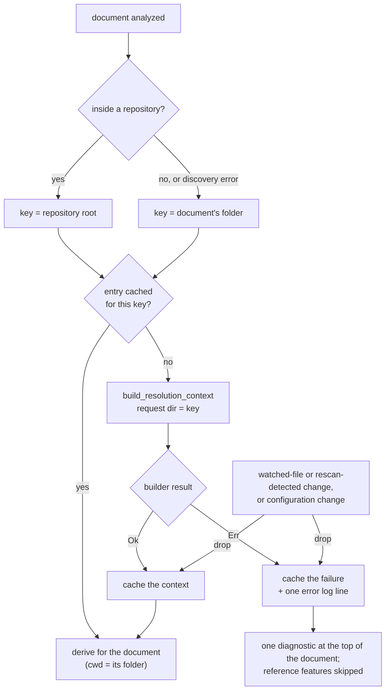

# LSP Architecture

DMLS (`darkmatter/dmls`) is a stdio language server. `run_server` in
[`router.rs`](../../dmls/src/router.rs) performs the `initialize` handshake,
then dispatches every request and notification against one `ServerState`:

- the open documents (the editor's buffers are authoritative over disk)
- the layered configuration (`.dmls.toml` under `workspace/configuration`)
- the workspace index and the graph snapshot that readers load
- the provider registry, the ordered chain of providers per capability
- the diagnostics scheduler and the frontmatter overlay caches
- the watch mode, which decides how on-disk changes are learned
- the file-resolution contexts, one per repository

For each request on an open document, the router assembles a
`DocumentContext` (path, text, source map, graph snapshot, configuration,
overlay, and file-resolution context) and runs the provider chain against
it. The [DMLS README](../../dmls/README.md#architecture) covers the graph,
source map, provider registry, and concurrency model in more detail.

## File resolution contexts

Every feature that follows a file reference (document links,
go-to-definition, hover, the link graph, link and transclusion diagnostics,
anchor completion, the create-missing-file code action, and schema `file`
validation) resolves it through a `FileResolutionContext`. DMLS never joins
paths textually. The user-facing behavior is described in
[DMLS: File References in the Editor](../topics/dmls.md); this section
covers how the server produces and maintains the contexts. The code is in
[`context.rs`](../../dmls/src/context.rs).

### One snapshot, fixed at startup

`main.rs` calls `RequestSnapshot::from_process()` once and passes it to the
server in `RunOptions`. The snapshot carries `HOME` and the environment.
DMLS has no setting for an extra `@` root, so the production snapshot has
none; the snapshot is still where one would enter, and an embedder (or a
test) that starts the server with its own snapshot supplies it there.
Nothing else in DMLS reads the process for resolution,
so every context the server builds sees the same `HOME` and environment
until the server restarts. The snapshot's own request directory is never
used: each build re-anchors it with `snapshot.at_request_dir(key)`. See
[Compose Requests](../topics/compose-requests.md) for the snapshot and the
builder.

### The cache and its keys

`RepositoryContexts` caches one `build_resolution_context` result per key.
It is shared (`Arc`) between the router and the workspace graph.

| Document folder | Key, and the build's request directory |
|---|---|
| Inside a Git repository (`biscuit_file::find_git_root` finds a root) | The repository root |
| In no repository | The folder itself |
| Repository discovery errors | The folder itself; the builder then reports the same error for it |

The request directory is where `@` searches start, so an editor answers
`&`, `^`, and `@` the way `md compose` run from the repository root does,
whatever the editor's workspace folders are. A document's own context is
derived from the cached one with `for_source(path)`: the request directory
stays the key, and `cwd` becomes the document's folder.

```text
key repo/                     request_cwd   cwd
  repo/README.md              repo/         repo/
  repo/docs/guide.md          repo/         repo/docs/
```

A failed build is cached exactly like a success, so a broken repository is
built, and logged at `error` level, once rather than on every request. Each
cached entry has a generation number; a rebuilt context gets a new one, and
the overlay's schema cache keys on it, so `file` values are re-validated
against the fresh context.



### Two ways to resolve

| Consumer | How it resolves | Touches disk? |
|---|---|---|
| Workspace graph (link, transclusion, `uses_schema`, and `uses_file` edges; broken-link and missing-anchor diagnostics; link hover, document links, and definition) | The first planned candidate when it is an **indexed** document; otherwise `resolve_reference`, falling back to a later candidate that is an open, unsaved buffer | Only when the first candidate is not indexed |
| Single-target features (directive links, definition and hover, transclusion diagnostics, frontmatter navigation, the create-missing-file action) | `resolve_reference`: the first planned candidate that exists, else the first candidate as the place a new file would go | Yes, as composition does |
| Anchor completion | The first planned candidate that is an indexed document | No |

The index decides where headings live, never whether a file exists. A graph
edge lands on an indexed document's node, on an existing file the index does
not hold (`EdgeTarget::File`: above the workspace folder, in `HOME`, under a
magic root, or not Markdown), or stays unresolved. For example, with only
`repo/docs/` open, `[t](../target.md)` links to `repo/target.md` and is not
broken. A `#fragment` on an unindexed file is not checked, because its
headings were never read; it is neither resolved to a heading nor reported
missing. A link to an open, unsaved buffer still resolves.

### Invalidation

An entry is dropped, and rebuilt lazily on the next request, when:

| Event | Entries dropped |
|---|---|
| `workspace/didChangeWatchedFiles` names a path | Every entry keyed at an ancestor of the path, and every entry keyed inside the path's owning directory (the parent of `.git` for a path inside `.git/`, otherwise the path's own directory) |
| A save in server-rescan mode, where the rescan finds a changed document or package manifest | The same entries, for each changed path |
| `workspace/didChangeConfiguration` | Every entry, even when the effective configuration is unchanged |

When anything is dropped, the graph is relinked so every reference
re-resolves, and diagnostics are re-published for every open document.

Clients that watch files are asked to report, besides the configured
document globs and schema YAML, every package manifest sniff detects packages
by (`PACKAGE_MANIFEST_FILE_NAMES`: `Cargo.toml`, `package.json`,
`pyproject.toml`, `go.mod`) and `**/.git/config`
([`watch.rs`](../../dmls/src/workspace/watch.rs)). These context inputs
only drop contexts; they are never indexed as documents. In server-rescan
mode (clients without a reliable watcher), each save re-hashes every
package manifest under the workspace roots and compares the result with the
previous scan. The rescan does not read `.git/config`, so a repaired
`.git/config` is noticed there only through another change below the
failing key, a configuration change, or a restart.

### Build failures

A document whose context failed gets one `dm.context.build_failure`
diagnostic (source `darkmatter.context`) at line 0, column 0, and nothing in
it is resolved: providers receive the failure through
`DocumentContext::file_context()` and skip every reference-dependent
answer (a directive hover, for example, keeps its description but shows no
target), and the overlay
assembles no schema, because `$schema` itself resolves through the context.
See [DMLS diagnostics](../../dmls/docs/diagnostics.md#file-resolution-context-source-darkmattercontext)
for the diagnostic's contents.

`ContextFailure` has three variants:

| Variant | When | Class |
|---|---|---|
| `Build` | `build_resolution_context` returned a `ContextBuildError` (`Discovery` or `Invalid`) | The error's own class |
| `UntitledWorkspace` | An untitled buffer's workspace folders do not lie in exactly one repository | `MissingContext` |
| `NotProvided` | A graph was built with `NoContexts` (tests and tools), never in a running server | `MissingContext` |

### Untitled buffers

An `untitled:` buffer has no folder to key on. `for_untitled` counts, for
each workspace folder, the repository containing it (discovered upward from
the folder; repositories nested below a folder do not count). With exactly
one, the buffer uses that repository's context unchanged, so `cwd` is the
repository root, and it is analyzed as if it were a file at that root. With
none, or two or more, it gets `ContextFailure::UntitledWorkspace` and the
same `dm.context.build_failure` diagnostic.
