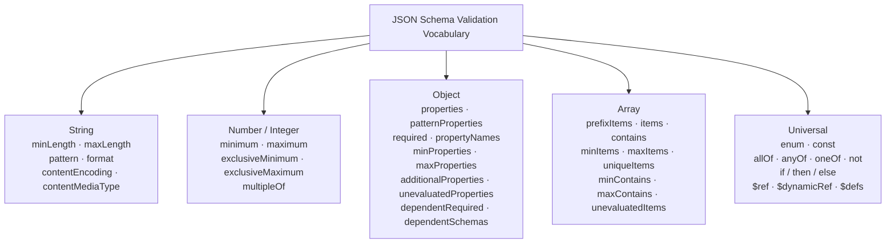

# JSON Schemas in Darkmatter

JSON Schema is the most widely deployed schema language for JSON-shaped data, and equally useful for adjacent formats such as YAML — including the YAML frontmatter that Darkmatter parses out of Markdown documents. This document covers the JSON Schema type/constraint system, surveys the Rust crate ecosystem, and recommends a crate for Darkmatter's two primary needs: (1) translating internal `SimplifiedSchema` dictionaries into JSON Schema documents and (2) validating Markdown frontmatter against those schemas with high throughput and extensible constraint checking.

## JSON Schema Types and Constraints

JSON Schema is built around two ideas: **assertions** (constraints that an instance must satisfy) and **annotations** (descriptive metadata that does not affect validity). The current dialect — and the one any new project should target — is **Draft 2020-12** (`$schema: "https://json-schema.org/draft/2020-12/schema"`).

### Core Types

The `type` keyword constrains the JSON value's primitive type. The seven canonical types are:

| Type      | Description                                                                |
|-----------|----------------------------------------------------------------------------|
| `string`  | A sequence of Unicode code points.                                         |
| `number`  | Any JSON number (integer or floating point).                               |
| `integer` | A number with zero fractional part. Note: JSON itself has no integer type. |
| `boolean` | `true` or `false`.                                                         |
| `object`  | An unordered map of string keys to JSON values.                            |
| `array`   | An ordered list of JSON values.                                            |
| `null`    | The single JSON null value.                                                |

`type` can also be a *set* of types (e.g. `"type": ["string", "null"]`), in which case the instance must match any one of them.

### Type-Specific Constraints

Each type has a vocabulary of validation keywords:



**Notable Draft 2020-12 changes** relative to Draft 07:

- Tuple validation moved from `items` (as an array) to a new `prefixItems` keyword. `items` is now always a schema applied to elements *after* `prefixItems`.
- `$recursiveRef` / `$recursiveAnchor` were replaced by the more general `$dynamicRef` / `$dynamicAnchor`.
- `format` was split into two vocabularies — `format-annotation` (default; pure metadata) and `format-assertion` (must be explicitly enabled to actually validate).
- `definitions` was renamed `$defs`.

### Extending with Custom Constraints

JSON Schema is **explicitly extensible**. Validators are expected to ignore unknown keywords (returning them as annotations). Implementations expose this in two main ways:

1. **Custom `format` validators** — register a name (e.g. `"format": "semver"` or `"format": "iso-duration"`) with a callback that returns valid/invalid for a string. This is the lowest-friction extension point and ideal for domain-specific *value* checks.
2. **Custom keywords** — register a wholly new keyword (e.g. `"x-mustExistInFilesystem": true`) with a function that receives both the instance value and the surrounding schema context. This is needed when validation depends on *more than the value itself* (cross-field rules, IO, environment lookups).

For Darkmatter, custom keywords are how you'd express things like "this frontmatter `slug` must be unique across the corpus" or "this `image` path must resolve via `FileReference`".

### Common Gotchas

- **Typos in keyword names pass silently.** Per spec, unknown keywords are annotations, not errors. `"requried"` instead of `"required"` will validate everything. *Mitigation:* validate your schemas against their meta-schema (most Rust crates do this for you when you build the validator).
- **`additionalProperties: true` is the default.** Schemas accept extra keys unless you set it to `false` or use `unevaluatedProperties: false`. *Mitigation:* be explicit; pick a project-wide default and apply consistently.
- **`format` is annotation-only by default in 2020-12.** Writing `"format": "email"` without enabling format-assertion does *nothing*. *Mitigation:* enable assertion mode on your validator, or use `pattern` for hard requirements.
- **`integer` vs `number` precision.** JSON parsers commonly load all numbers as `f64`, so values like `9_007_199_254_740_993` silently lose precision. *Mitigation:* use serde with `arbitrary_precision` and a crate that supports it (the `jsonschema` crate gates this behind a feature).
- **`prefixItems` vs `items` confusion.** Code written against Draft 07 that uses `"items": [...]` for tuples breaks under 2020-12. *Mitigation:* pin the draft explicitly via `$schema` and via the validator's `with_draft` option.
- **`oneOf` is expensive and easy to misuse.** It requires *exactly one* subschema to match; if two overlap it fails in confusing ways. *Mitigation:* prefer `anyOf` (any match) when subschemas can overlap; reserve `oneOf` for true discriminated unions and pair with `if/then/else` or a discriminator.
- **`$ref` siblings used to be ignored.** Under Draft 07 every keyword next to `$ref` was discarded; under 2019-09+ they apply. Mixing dialects in one tree silently changes behavior. *Mitigation:* don't mix drafts in one schema graph.
- **Regex portability.** `pattern` uses ECMA-262 regex. Crates differ — `jsonschema` uses `fancy-regex` by default (supports lookaround/backrefs) but can be switched to `regex` for linear-time, ReDoS-safe matching. *Mitigation:* prefer the `regex` engine for any schema fed by untrusted input.
- **Cycles in `$ref`** can stack-overflow naive validators. *Mitigation:* use a crate that detects cycles (both `jsonschema` and `boon` do).

## Rust Crates

The Rust ecosystem splits cleanly into two camps: **schema generators** (Rust types → JSON Schema) and **validators** (JSON value × JSON Schema → pass/fail). Darkmatter needs validation primarily, plus *bespoke* schema construction from `SimplifiedSchema`.

### `jsonschema` (Stranger6667)

A high-performance, full-spectrum JSON Schema validator.

- **Footprint:** Validation only. Supports Drafts 4, 6, 7, 2019-09, and 2020-12. Custom keywords, custom format validators, blocking and async `$ref` resolution, structured Output v1 reports, meta-schema validation, configurable regex engine, CLI (`jsonschema validate` / `jsonschema bundle`).
- **URLs:**

    - Repo: <https://github.com/Stranger6667/jsonschema>
    - Docs: <https://docs.rs/jsonschema>
    - crates.io: <https://crates.io/crates/jsonschema>

- **Feature flags:**

    - `resolve-http` — fetch `$ref` over HTTP/HTTPS (blocking).
    - `resolve-file` — resolve `file://` refs.
    - `resolve-async` — non-blocking validator construction.
    - `tls-aws-lc-rs` *(default)* / `tls-ring` — TLS provider for HTTP resolution.
    - `arbitrary-precision` — preserve numeric precision beyond `f64` (only when JSON is parsed from a string).

- **Latest version:** **0.46.4**.
- **Last commit:** Active — released May 2, 2026; multiple releases per month through Q1–Q2 2026.
- **MSRV:** Rust 1.83.

### `boon` (santhosh-tekuri)

A clean, spec-faithful validator emphasizing correctness over raw speed.

- **Footprint:** Validation only. Drafts 4, 6, 7, 2019-09, 2020-12. Custom vocabularies, custom formats, cycle detection, multiple output formats (flag, basic, detailed). CLI ships with YAML support.
- **URLs:**

    - Repo: <https://github.com/santhosh-tekuri/boon>
    - Docs: <https://docs.rs/boon>
    - crates.io: <https://crates.io/crates/boon>

- **Feature flags:** Minimal; main one is enabling format/content assertions at validator-build time rather than via cargo features.
- **Latest version:** **0.6.1**.
- **Last commit:** January 7, 2025 — slower release cadence than `jsonschema`.
- **Notes:** Passes the JSON-Schema-Test-Suite (excluding optional). Reported to be roughly **2–52× slower** than `jsonschema` on typical schemas and dramatically slower on recursive schemas per Stranger6667's benchmarks.

### `schemars` (GREsau)

A *generator*, not a validator — converts Rust types into JSON Schema documents.

- **Footprint:** `#[derive(JsonSchema)]` produces a Draft 2020-12 schema for any Rust type. Heavily used to document REST/RPC interfaces. Does **not** validate; pair it with `jsonschema` or `boon` if you need both.
- **URLs:**

    - Repo: <https://github.com/GREsau/schemars>
    - Docs: <https://docs.rs/schemars>
    - crates.io: <https://crates.io/crates/schemars>
    - Guide: <https://graham.cool/schemars/>

- **Feature flags:** `derive` *(default)*, `std` *(default)*, `preserve_order`, `raw_value`, plus per-ecosystem integrations: `chrono04`, `jiff02`, `uuid1`, `url2`, `indexmap2`, `bigdecimal04`, `rust_decimal1`, `semver1`, `smol_str02`/`smol_str03`, `bytes1`, `either1`, `arrayvec07`, `smallvec1`.
- **Latest version:** **1.2.1** (released February 1, 2026).
- **Last commit:** Active through early 2026.

### `valico` and `jsonschema-valid` (Legacy)

- **`valico`** — older Draft 07 validator + JSON coercer. Still maintained but reported to be **75–645× slower** than `jsonschema` for complex schemas. Useful only if you specifically need the *coercion* feature (numeric strings → numbers, etc.).
- **`jsonschema-valid`** — simple Draft 4/6/7 validator with friendly error messages. No object mapping, no extension API. Reasonable for small CLIs, not for hot paths.

### Recommendation

**Use the `jsonschema` crate (v0.46.x) for Darkmatter's frontmatter validation.**

Why:

1. **Performance is a stated requirement.** `jsonschema` is the fastest Rust validator by a wide margin — 2–52× over `boon`, three orders of magnitude over `valico` — which matters when Darkmatter runs validation across every Markdown file in a corpus on every build.
2. **Extensibility maps directly to the use case.** `ValidationOptions::with_keyword` and `with_format` are exactly the seams needed to add Darkmatter-specific constraints (filesystem-aware checks via `FileReference`, slug-uniqueness across the document set, etc.).
3. **Active maintenance.** Releases ship every few weeks; `boon`'s last release is over a year old as of writing.
4. **Full draft coverage** including 2020-12, the dialect any new project should target.
5. **ReDoS protection** is a one-line opt-in (`PatternOptions::regex()`) — important when schemas could come from user-authored frontmatter conventions.
6. **No tradeoff for `SimplifiedSchema` → JSON Schema.** That conversion is bespoke Darkmatter logic emitting `serde_json::Value`; it's orthogonal to which validator consumes the result. `schemars` is *not* the right tool here because we're translating a runtime dictionary, not deriving from Rust types.

The only reason to pick `boon` instead would be if spec-conformance edge cases turn up where `jsonschema` differs — `boon`'s test-suite coverage is its main selling point. In practice, `jsonschema` is more than conformant enough for frontmatter validation.

## Use Cases

All examples below use `jsonschema = "0.46"` (Draft 2020-12). Add `serde_json = "1"`.

### 1. Validate Markdown Frontmatter Once Per Document

A reusable validator amortizes schema-compile cost across thousands of files.

```rust
use jsonschema::{Validator, ValidationOptions, Draft};
use serde_json::{json, Value};

pub struct FrontmatterValidator {
    inner: Validator,
}

impl FrontmatterValidator {
    pub fn new(schema: &Value) -> Result<Self, jsonschema::ValidationError<'static>> {
        let inner = jsonschema::options()
            .with_draft(Draft::Draft202012)
            .should_validate_formats(true)
            .build(schema)?;
        Ok(Self { inner })
    }

    pub fn check(&self, frontmatter: &Value) -> Result<(), Vec<String>> {
        let errors: Vec<String> = self
            .inner
            .iter_errors(frontmatter)
            .map(|e| format!("{} at {}", e, e.instance_path))
            .collect();
        if errors.is_empty() { Ok(()) } else { Err(errors) }
    }
}

fn demo() {
    let schema = json!({
        "$schema": "https://json-schema.org/draft/2020-12/schema",
        "type": "object",
        "required": ["title", "slug"],
        "properties": {
            "title": { "type": "string", "minLength": 1 },
            "slug":  { "type": "string", "pattern": "^[a-z0-9-]+$" },
            "tags":  { "type": "array", "items": { "type": "string" }, "uniqueItems": true },
            "draft": { "type": "boolean", "default": false }
        },
        "additionalProperties": false
    });

    let validator = FrontmatterValidator::new(&schema).expect("valid schema");
    let fm = json!({ "title": "Hello", "slug": "hello-world", "tags": ["intro"] });
    assert!(validator.check(&fm).is_ok());
}
```

Two things to note: `iter_errors` returns *all* problems (vs. `validate` which short-circuits), and `should_validate_formats(true)` is required to make `format` keywords actually assert — otherwise they're silent annotations.

### 2. Register a Darkmatter-Specific Custom Format

Adds a `format: "darkmatter-fileref"` that delegates to `biscuit-file::FileReference`.

```rust
use jsonschema::{Draft, Keyword, ValidationError};
use serde_json::{json, Value};

fn is_valid_fileref(value: &str) -> bool {
    // In real code this would call biscuit_file::FileReference::parse(value).is_ok()
    !value.is_empty() && !value.contains("..")
}

fn build_validator(schema: &Value) -> jsonschema::Validator {
    jsonschema::options()
        .with_draft(Draft::Draft202012)
        .should_validate_formats(true)
        .with_format("darkmatter-fileref", |value: &str| is_valid_fileref(value))
        .build(schema)
        .expect("valid schema")
}

fn demo() {
    let schema = json!({
        "type": "object",
        "properties": {
            "cover_image": { "type": "string", "format": "darkmatter-fileref" }
        },
        "required": ["cover_image"]
    });

    let validator = build_validator(&schema);

    assert!(validator.is_valid(&json!({ "cover_image": "assets/cover.png" })));
    assert!(!validator.is_valid(&json!({ "cover_image": "../escape.png" })));
}
```

Custom formats are the right tool when the rule is "this string must satisfy property X". For rules that need cross-field context (e.g. "if `kind` is `post`, then `published_at` is required"), prefer JSON Schema's built-in `if`/`then`/`else` rather than a custom keyword.

### 3. Validate `SimplifiedSchema`-Generated Schemas at Build Time

Darkmatter generates JSON Schemas from `SimplifiedSchema` dictionaries. Those generated schemas should themselves be validated against the Draft 2020-12 meta-schema during tests so a bug in the generator can't ship a malformed schema.

```rust
use jsonschema::{Draft, Validator};
use serde_json::{json, Value};

/// Stand-in for darkmatter's SimplifiedSchema -> JSON Schema converter.
fn simplified_to_jsonschema(_simplified: &Value) -> Value {
    json!({
        "$schema": "https://json-schema.org/draft/2020-12/schema",
        "type": "object",
        "properties": { "name": { "type": "string" } },
        "required": ["name"]
    })
}

#[cfg(test)]
mod tests {
    use super::*;

    #[test]
    fn generated_schemas_are_meta_schema_valid() {
        let simplified = json!({ "name": "string!" });
        let generated  = simplified_to_jsonschema(&simplified);

        // Build a validator against the generated schema. If the schema itself
        // is malformed, this construction fails — that's the meta-schema check.
        let validator = jsonschema::options()
            .with_draft(Draft::Draft202012)
            .build(&generated)
            .expect("generated schema must be valid against the 2020-12 meta-schema");

        // And it actually validates instances correctly.
        assert!(validator.is_valid(&json!({ "name": "ada" })));
        assert!(!validator.is_valid(&json!({})));
    }
}
```

This pattern — validate-the-validator — is cheap insurance and catches generator regressions before they reach a user's frontmatter.

---

**Sources:**

- [jsonschema crate on docs.rs](https://docs.rs/jsonschema)
- [jsonschema on crates.io](https://crates.io/crates/jsonschema)
- [Stranger6667/jsonschema on GitHub](https://github.com/Stranger6667/jsonschema)
- [boon on docs.rs](https://docs.rs/boon/latest/boon/)
- [santhosh-tekuri/boon on GitHub](https://github.com/santhosh-tekuri/boon)
- [schemars on crates.io](https://crates.io/crates/schemars)
- [GREsau/schemars on GitHub](https://github.com/GREsau/schemars)
- [JSON Schema Core 2020-12](https://json-schema.org/draft/2020-12/json-schema-core)
- [JSON Schema Validation 2020-12](https://json-schema.org/draft/2020-12/json-schema-validation)
- [JSON Schema 2020-12 Release Notes](https://json-schema.org/draft/2020-12/release-notes)
- [Learn JSON Schema 2020-12](https://www.learnjsonschema.com/2020-12/)
- [Understanding JSON Schema (PDF)](https://json-schema.org/UnderstandingJSONSchema.pdf)
