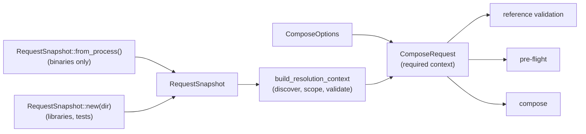

# Compose Requests

Every Darkmatter call that resolves a file reference runs inside a **compose
request**. The request fixes, once, where `./`, `&`, `^`, `@`, `~`, and
`{{VAR}}` references start and which repository they belong to. Every phase of
the request (validation, pre-flight, composition, every transcluded child)
then resolves against that same answer.

## Preparing a request

A request is built from two things:

- **`ComposeOptions`**: what to do (operations, overrides, shell and remote
  policy).
- **`RequestSnapshot`**: where the request runs. It names the request
  directory and carries the home directory, the environment, any extra `@`
  search roots, and the reference that opened the document.

```rust
use darkmatter::markdown::Markdown;
use darkmatter::markdown::compose::{ComposeOptions, ComposeRequest, RequestSnapshot};

// A binary reads its own process once, at its entry point.
let snapshot = RequestSnapshot::from_process()?;
let request = ComposeRequest::prepare(ComposeOptions::new().with_source_file("docs/guide.md"), &snapshot)?;

let md = Markdown::try_from(std::path::Path::new("docs/guide.md"))?;
let preflight = md.compose_preflight(&request)?;
let (composed, report) = md.compose_with(&request)?;
# Ok::<(), Box<dyn std::error::Error>>(())
```

`from_process` takes the home directory from the environment (`HOME`, or
`USERPROFILE` on Windows) and falls back to the platform's profile lookup, so
whoever launches a binary chooses its home through the child's environment.

A library never reads the process. `RequestSnapshot::new(dir)` starts with no
home directory and an empty environment, so a library call states every input
it depends on:

```rust
use std::collections::HashMap;
use darkmatter::markdown::compose::RequestSnapshot;

let snapshot = RequestSnapshot::new("/work/project")
    .with_home(Some("/home/me".into()))
    .with_env(HashMap::from([("NOTES".into(), "/home/me/notes".into())]));
```

`snapshot.at_request_dir(dir)` keeps the home directory, environment, and
extra roots but anchors the request elsewhere, for example at a document that
lives in another repository.



## What the builder does

`build_resolution_context(&snapshot)` is the one way a request obtains a
`FileResolutionContext`. In order, it:

1. Takes the request directory, home directory, and environment from the
   snapshot.
2. Discovers the repository containing the request directory, and its
   packages and package areas. These become the `&` and `^` anchors and the
   launch `@` scope.
3. Adds the snapshot's extra `@` roots (see [magic paths](./magic-paths.md)).
4. Derives the context for the opening reference, when there is one, so a
   document opened as `~/notes/x.md` keeps `~` as its tree root.
5. Validates the result.
6. Logs one `debug` event naming the request directory and where the tree
   root came from (`base_dir_origin`), so a "file not found" report can be
   traced to the context it was resolved in.

`ComposeRequest::prepare` calls the builder. A caller that already holds a
built context (for example one derived for a document in another repository)
uses `ComposeRequest::with_context(options, context)`, which validates it.

A source document outside the request's repository is admitted the way a
transcluded file outside it is: as a trusted external source. Requested from
`/work/repo`, the document `/home/me/notes/doc.md` resolves `./beside.md`
beside itself and `../../outside.md` to `/home/outside.md`; its own folder,
not the repository, bounds nothing. Its schema `file` values resolve the
same way. A document opened through `~` (`::file ~/notes/doc.md`) instead
keeps `HOME` as its tree root, so the same `../../outside.md` is refused.

## Reading a failure's class

Every failed file reference keeps biscuit-file's `ResolutionFailure` class
(`InvalidReference`, `MissingContext`, `NoMatch`, `Io`, `UnsupportedRemote`).
Compare failures by class, never by message:

```rust,ignore
match markdown.compose_with(&request) {
    Err(error) => assert_eq!(error.resolution_failure(), Some(ResolutionFailure::NoMatch)),
    // A failure composition tolerated (the content replaced by a notice)
    // is a warning carrying the same class.
    Ok((_, report)) => assert!(report.warnings.iter().all(|w| w.resolution_failure.is_none())),
}
```

`MarkdownError::resolution_failure()` finds the class through nested
transclusions, `::toc-linking` chains (which report the first target's
class), and schema `file` values. `md` prints the class as a
`failure: <class>` row, in kebab case, on every error block and warning for
a failed reference.

## When a request cannot be built

The builder returns `ContextBuildError` instead of letting a bad context fail
later as a missing file:

| Situation | Error | `resolution_failure()` |
|---|---|---|
| The request directory is relative (`RequestSnapshot::new("docs")`) | `Invalid` (`RelativeContextDirectory`) | `MissingContext` |
| The opening reference resolves outside the request's repository (`~/notes/x.md` opened from inside a repository) | `Invalid` (`RepositoryRootNotContainingSource`) | `MissingContext` |
| Repository discovery fails, for example a corrupt `.git/config` | `Discovery` | `MissingContext` |

Finding no repository is not an error: the request directory becomes the
tree root. `resolution_failure()` uses the same classes as biscuit-file's
`FileReferenceError::resolution_failure()`.

## One environment per request

`{{ env.NAME }}`, `ctx.agent`, `ctx.model`, and a `{{NAME}}/file.md` file
reference all read the snapshot's environment. An expression and a file
reference in one request therefore always agree, even if the process
environment changes or differs.

A `ComposeContext` captured on its own (`ComposeContext::capture_for_document`
and its siblings) reads no process environment either: its `env` starts empty,
so `ctx.agent` is `"unknown"` until a request installs the snapshot's
environment over it. Only `current_env.NAME` reads the live process
environment, by design: it names the value at the moment it is referenced.
