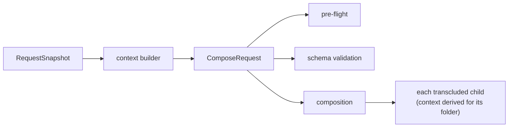

# Local File Referencing

Wherever Darkmatter accepts a local file (`::file`, `::code`,
`::toc-linking <file>`, a schema `file` value, a read-side expression
function, a link, an `md` argument), it accepts every reference form that
[**biscuit-file**](../../../biscuit-file/docs/topics/file-references.md)
defines, and it resolves them all the same way. The common forms:

| Form | Example | Starts from |
|---|---|---|
| Explicit relative | `./intro.md`, `../shared/intro.md` | the folder of the document that wrote it |
| Bare | `intro.md` | the document's folder, then the repository root |
| Repository root | `&/docs/intro.md` | the repository root |
| Repository scoped | `^/intro.md` | the document's package, package area, then repository root |
| Magic | `@/prompts/intro.md` | the request's package, package area, repository root, then `HOME` (see [magic paths](./magic-paths.md)) |
| Home | `~/notes/intro.md` | the home directory |
| Variable | `{{NOTES}}/intro.md` | the value of `NOTES` in the request's environment |
| Absolute | `/srv/docs/intro.md` | the path itself |

## One answer per request

Every reference in a composition resolves against one **request context**,
prepared once before anything runs. It fixes the request directory, the home
directory, the environment, the repository with its packages and package
areas, and any extra `@` roots. Pre-flight, schema validation, composition,
and every transcluded child read that same context, so a reference that
validates also composes, and an expression reading `env.NOTES` sees the same
value as a `{{NOTES}}/x.md` reference.



`md` prepares the request from the directory you run it in. A library caller
names its request directory explicitly; nothing is read from the process
behind its back. See [compose requests](./compose-requests.md) for the API.

## Relative references stay in their tree

`./`, `../`, and bare references resolve from the folder of the document that
wrote them, including inside a transcluded child. They may not climb out of
the document's file tree: the repository, or for a document opened through
`~`, the home directory. A reference that tries fails with
`failure: invalid-reference`; use `&`, `^`, or `@` to reach a file elsewhere
in the repository.

```md
<!-- in /work/repo/docs/guide/intro.md -->
::file ./beside.md          <!-- /work/repo/docs/guide/beside.md -->
::file &/README.md          <!-- /work/repo/README.md -->
::file ../../../outside.md  <!-- refused: leaves /work/repo -->
```

A value you type yourself, such as `md compose ../other/doc.md`, is yours, not
a document's, and may point anywhere.

## When a reference fails

Every failure names a stable class (`no-match`, `invalid-reference`,
`missing-context`, `io`, `unsupported-remote`). See
[file reference failures](../errors/file-reference-failures.md).
