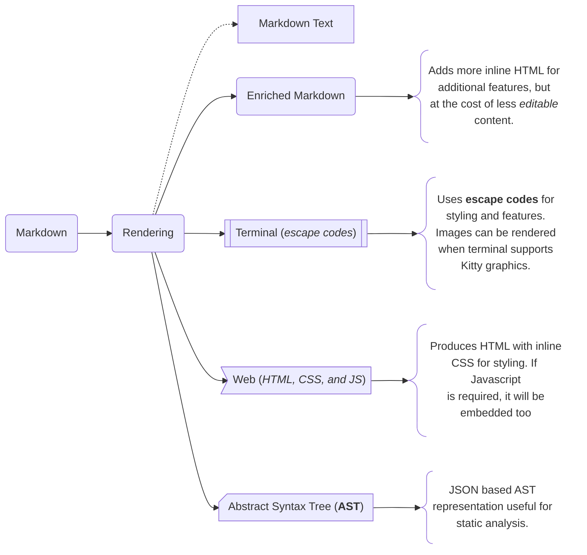

```mermaid
flowchart LR
InputMd(Markdown)

Render(Rendering)
Plain[Markdown Text]
Enriched(Enriched Markdown)
Terminal@{ label: "Terminal (_escape codes_)" , shape: "framed-rectangle"}
Web@{ label: "Web (_HTML, CSS, and JS_)" , shape: "odd" }
AST@{ label: "Abstract Syntax Tree (**AST**)" , shape: "card" }


InputMd --> Render

Render -.-> Plain
Render --> Enriched --> C1@{shape: comment, label: "Adds more inline HTML for\nadditional features, but\nat the cost of less _editable_\ncontent."}
Render --> Terminal -->C2@{shape: comment, label: "Uses **escape codes** for\nstyling and features.\nImages can be rendered\nwhen terminal supports\nKitty graphics." }
Render --> Web -->C3@{shape: comment, label: "Produces HTML with inline\nCSS for styling. If Javascript\nis required, it will be\nembedded too" }
Render --> AST -->C4@{shape: comment, label: "JSON based AST\nrepresentation useful for\nstatic analysis."}
```
