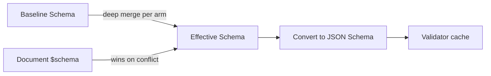
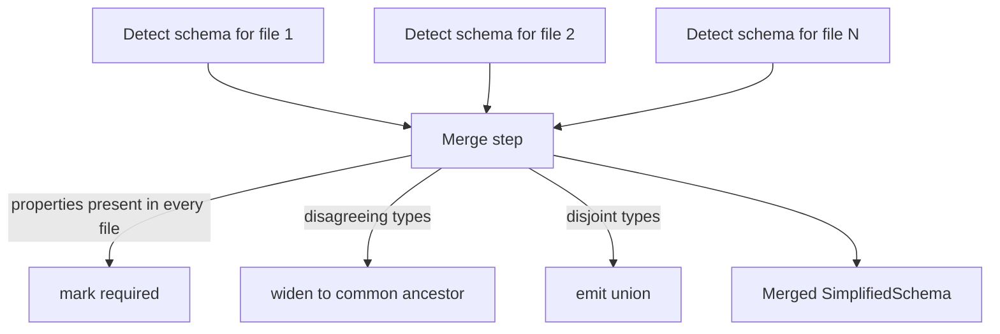

---
related_specs:
    - "@darkmatter/features/_completed/2026-05-11-schemas/spec.md"
    - "@darkmatter/features/_completed/2026-05-23-compose-schema/spec.md"
    - "@darkmatter/features/_completed/2026-05-28-schema-coercion/spec.md"
---

# Schema Definition

Darkmatter can **define**, **detect**, and **evaluate** schemas for Markdown frontmatter. Authors declare the shape of their frontmatter with **SimplifiedSchema** — a single-line YAML grammar that compiles deterministically to a Draft 2020-12 JSON Schema. Every validation runs through the `jsonschema` crate; SimplifiedSchema is a surface, not a parallel validator.

This topic covers the practical usage of schemas for standalone validation, schema detection, and validation within the compose pipeline. The original specification lives in [`features/_completed/2026-05-11-schemas/spec.md`](../../features/_completed/2026-05-11-schemas/spec.md); the compose integration is specified in [`features/2026-05-23-compose-schema/spec.md`](../../features/2026-05-23-compose-schema/spec.md).

## What You Get

- A `$schema` frontmatter property that can hold an inline schema, point at a YAML/JSON file, or list a root-level union.
- A **baseline schema** that every document inherits.
- A `md schema validate` CLI subcommand with `pretty` and `json` output.
- A `md schema detect` CLI subcommand that infers a SimplifiedSchema from existing documents.
- A library API ([`DarkmatterSchemas`](#library-api)) for embedding the same behaviour.
- Schema-aware completion hints for downstream shell-completion tooling.

## The `$schema` Frontmatter Property

`$schema` is **reserved** by Darkmatter inside frontmatter. Its value may be:

1. An inline **SimplifiedSchema** dictionary.
2. A string `FileReference` (resolved via `biscuit-file`) to a `.yaml` / `.json` file containing either a SimplifiedSchema or a JSON Schema.
3. A YAML sequence — a [root-level union](#root-level-unions) where each arm is a complete object schema.

The key is stripped from the frontmatter before validation, so a raw JSON Schema with `additionalProperties: false` will not reject every document for carrying a `$schema` field.

```yaml
---
$schema:
    title: "string(required)"
    tags:  "string[]"
---
```

```yaml
---
$schema: ./schemas/post.yaml
---
```

## SimplifiedSchema Grammar

A SimplifiedSchema is a YAML mapping from property names to **type-and-constraint** strings.

```yaml
$schema:
    name: string
    age:  number
```

### Syntax Forms

Every property value follows one of four shapes:

| Form                                       | Example                                              |
|--------------------------------------------|------------------------------------------------------|
| `{type}`                                   | `name: string`                                       |
| `{type}({constraints})`                    | `name: string(required)`                             |
| `{type} -> {description}`                  | `name: string -> The author's full name`             |
| `{type}({constraints}) -> {description}`   | `slug: string(not-empty;required) -> URL slug`       |

- **Whitespace** inside `(...)` is insignificant. Quote the whole scalar so YAML keeps it as a string when whitespace is present.
- **Multiple constraints** are separated by `;`.
- **Optional by default** — properties are optional unless `required` appears in the constraint list.
- **Arrays** are written by appending `[]` to the type. Item-level constraints sit inside the parens that precede the brackets; array-level constraints sit in a second parens after the brackets.
- **Descriptions** (`-> ...`) populate the `description` annotation in the generated JSON Schema.

```yaml
$schema:
    tags:   string[]                      # optional array of strings
    scores: "number(min(0); max(100))[]"  # each item in 0..=100
```

### Types

| Type         | Accepts                                                                                                | Notes                                                                                                              |
|--------------|--------------------------------------------------------------------------------------------------------|--------------------------------------------------------------------------------------------------------------------|
| `string`     | Any YAML string scalar.                                                                                | Constraints: `min`, `max`, `not-empty`, `pattern`, `default`, `required`.                                          |
| `date`       | ISO-8601 date `YYYY-MM-DD`.                                                                            | JSON Schema `format: date`.                                                                                        |
| `datetime`   | Any ISO-8601 datetime.                                                                                 | JSON Schema `format: date-time`.                                                                                   |
| `time`       | `hh:mm`, `hh:mm:ss`, `hh:mm:ss.ms` with optional TZ (`Z` or `±HH:MM`).                                 | JSON Schema `format: time`.                                                                                        |
| `number`     | Any JSON number.                                                                                       | Constraints: `min`, `max`, `integer`, `default`, `required`.                                                       |
| `numberlike` | A JSON number **or** a numeric string (`"4"`, `"-13"`, `"3.14"`).                                      | Compiles to `anyOf: [number, regex-pattern string]`. A numeric-string value is **normalized** to a real number (see [Type Coercion](#type-coercion)). |
| `boolean`    | Any JSON boolean.                                                                                      | Constraints: `default`, `required`.                                                                                |
| `boolish`    | A JSON boolean **or** the strings `"true"` / `"false"` (any case).                                     | Compiles to `anyOf: [boolean, enum]`. A `"true"` / `"false"` value is **normalized** to a real boolean (see [Type Coercion](#type-coercion)). |
| `object`     | Any YAML/JSON object.                                                                                  | No nested-schema authoring in v1 — `object` accepts any shape. Reference an external file for deeper typing.       |
| `file`       | A file reference resolved via `biscuit-file::FileReference`. Single or array form.                     | Constraints: `match(glob, ...)`, `required`. Resolved **from the CWD** at validation time. See [Files](#files).    |
| `enum`       | A value from an explicit set.                                                                          | Constraints required — the members are the constraint. See [Enumerations](#enumerations).                          |
| `url`        | A string parseable as an absolute URL.                                                                 | Constraints: `scheme(...)`, `default`, `required`.                                                                 |
| `email`      | A string in `addr-spec` form.                                                                          | JSON Schema `format: email`.                                                                                       |
| `any`        | Anything.                                                                                              | Only `required` is meaningful.                                                                                     |

Append `[]` to any type for an array of that type — e.g. `string[]`, `enum(red,green,blue)[]`, `file(match('*.md'))[]`.

### Universal Constraints

Every type accepts:

- `required` — the property must be present.
- `default(value)` — JSON Schema `default`. Darkmatter does **not** mutate documents; downstream tools and detection honour it.

### Numeric Constraints (`number`)

| Constraint   | Effect                          | JSON Schema             |
|--------------|---------------------------------|-------------------------|
| `min(n)`     | Inclusive minimum.              | `minimum`               |
| `max(n)`     | Inclusive maximum.              | `maximum`               |
| `integer`    | Whole numbers only.             | `type: integer`         |
| `default(n)` | Default value.                  | `default`               |
| `required`   | Property is required.           | parent `required` entry |

### String Constraints (`string`)

| Constraint     | Effect                                                                                            | JSON Schema             |
|----------------|---------------------------------------------------------------------------------------------------|-------------------------|
| `min(n)`       | Minimum length (Unicode code points).                                                             | `minLength`             |
| `max(n)`       | Maximum length.                                                                                   | `maxLength`             |
| `not-empty`    | Disallow empty / all-whitespace.                                                                  | `pattern: "^(?!\\s*$).+"` |
| `pattern(re)`  | ECMA-262 regex compiled with `jsonschema::PatternOptions::regex()` (ReDoS-safe, linear-time).     | `pattern`               |
| `default(s)`   | Default string.                                                                                   | `default`               |
| `required`     | Property is required.                                                                             | parent `required` entry |

### Date / Time Constraints

`date`, `datetime`, and `time` accept `default(s)` (ISO string) and `required`. The type itself emits the corresponding `format` with format-assertion enabled.

### Boolean Constraints

`boolean` and `boolish` accept `default(b)` and `required`.

### Enumerations

`enum` requires a positional comma list of members; other constraints follow after a `;`. Members with whitespace, commas, parentheses, or `;` must be single-quoted.

```yaml
$schema:
    color:  enum(red,green,blue; required)
    status: "enum(draft, published, archived; default(draft))"
    spaced: "enum('a, b', 'c; d')"
```

### Files

The `file` type wraps a `FileReference` string. Validity requires:

1. The string parses as a `FileReference`.
2. The reference resolves to an existing filesystem entry **at validation time**.
3. When `match(globs)` is present, the resolved path matches at least one positive glob and is not excluded by a `!`-prefixed negative glob.

Relative paths are resolved from the **current working directory** at validation time, in contrast to `$schema` file references, which resolve from the document's parent directory.

```yaml
$schema:
    doc:         "file(match('*.doc', '*.pdf', '*.md', '*.txt'))"
    source_code: "file(match('src/**/*.rs', '!src/**/test_*.rs'))"
    images:      "file(match('*.png', '*.jpg'))[](min(1))"
```

The array form `file[]` adds the standard array-level constraints (`min`, `max`, `unique`).

### URLs

| Constraint           | Effect                                              |
|----------------------|-----------------------------------------------------|
| `scheme(a, b, ...)`  | Restrict to one of the listed schemes (lowercased). |
| `default(s)`         | Default URL.                                        |
| `required`           | Property is required.                               |

```yaml
$schema:
    homepage:  "url(scheme(https))"
    canonical: "url(required)"
```

### Emails

`email` accepts `default(s)` and `required`; the type emits JSON Schema `format: email` with assertion enabled.

### Array Constraints

Place item constraints inside the parens **before** `[]`; place array-level constraints in a second parens **after** `[]`.

```yaml
$schema:
    # required array of 1..=5 unique lowercase tags
    tags: "string(pattern(^[a-z][a-z0-9-]*$))[](min(1); max(5); unique; required)"
```

| Constraint        | Effect                                       | JSON Schema      |
|-------------------|----------------------------------------------|------------------|
| `min(n)`          | Minimum number of items.                     | `minItems`       |
| `max(n)`          | Maximum number of items.                     | `maxItems`       |
| `unique`          | All items must be distinct.                  | `uniqueItems`    |
| `required`        | Array property is required (not items).      | parent `required` |
| `default([...])`  | Default array.                               | `default`        |

## Unions

### Property-Level Unions

Any property value may be a YAML sequence of type expressions to declare an `anyOf` union. The property matches if at least one arm does.

```yaml
$schema:
    foo:
      - string
      - number

    status:
      - "enum(draft, published, archived)"
      - "number(integer; min(0))"
      - any

    # accepts a positive number or a CSS-length string
    width:
      - "number(min(0))"
      - "string(pattern(^\\d+(px|%)$))"
```

**Hoisting.** `required` and `default(...)` are property-level — they are extracted from whichever arm declares them and applied to the property as a whole. If `required` appears on any arm, the property is required; convention is to place it on the first arm. Differing `default(...)` values on multiple arms is a compile-time error.

```yaml
$schema:
    title:
      - "string(required; not-empty)"  # required hoisted; not-empty stays on this arm
      - "number"
```

Arm-level constraints stay arm-local. Arm descriptions (`-> ...`) annotate that arm in the generated JSON Schema.

### Root-Level Unions

The root `$schema` may itself be a YAML sequence. Each arm is a complete object schema and the document is valid if it matches at least one arm. Arms may be inline SimplifiedSchema mappings or string file references.

```yaml
---
$schema:
  - ./schemas/post.yaml     # arm 0: file reference (SimplifiedSchema)
  - ./schemas/page.yaml     # arm 1: file reference (JSON Schema is fine too)
  - title: string           # arm 2: inline SimplifiedSchema
    body:  string
---
```

The effective schema is `{ "anyOf": [arm0, arm1, ...] }`. **Baseline merging is applied to each arm independently** — a baseline declares the fields every arm inherits.

When validation fails against a root union, Darkmatter reports the **closest-matching arm** — the one producing the fewest problems — and prefixes problems with the arm index. JSON output carries an `arm_index` field on every problem.

## Schema Resolution



The resolution rules:

1. **Inline mapping** at `$schema` — parsed directly as SimplifiedSchema.
2. **String reference** at `$schema` — resolved via `FileReference`, then disambiguated:
   - Parse as YAML.
   - If the root mapping contains a `$schema` key whose value is **itself a mapping**, treat as SimplifiedSchema.
   - Otherwise (no `$schema` key, or the value is a string URI like `https://json-schema.org/draft/2020-12/schema`) treat as raw JSON Schema.
   - `.json` files are always treated as JSON Schema.
3. **YAML sequence** at `$schema` — root union; each arm is resolved by the same rules above.
4. **No `$schema` and no baseline** — validation succeeds vacuously and `pretty` mode emits a `no schema; vacuously valid` note (suppressed by `--quiet`).

Relative paths in `$schema` references resolve from the **document's parent directory**.

Remote (`http://` / `https://`) references are **not supported** in v1 and produce a clear `SchemaError::RemoteUnsupported` directing the user to download the schema locally.

## Baseline Schemas

A baseline schema is a SimplifiedSchema or JSON Schema that every validated document inherits. The library exposes:

```rust
let api = DarkmatterSchemas::new()
    .with_baseline_from_file("./schemas/baseline.yaml")?;
```

The CLI accepts the baseline per invocation:

```bash
md schema validate post.md --schema ./schemas/baseline.yaml
md schema validate post.md     # falls back to $BASELINE_SCHEMA env var
```

**Resolution order for the CLI baseline:**

1. `--schema <path>` flag.
2. `BASELINE_SCHEMA` environment variable.
3. No baseline.

### JSON Schema Baseline Restrictions

When the baseline is a JSON Schema (rather than a SimplifiedSchema), it is restricted to **simple object schemas**. The merge algorithm operates on a property-name-keyed deep merge and cannot reason about arbitrary JSON Schema features.

Allowed root keys: `$schema`, `type`, `properties`, `required`, `additionalProperties` (must be `true`), `description`, `title`.

Any other construct — `$ref`, `allOf`, `anyOf`, `if`/`then`/`else`, `patternProperties`, `additionalProperties: false`, etc. — produces `SchemaError::Baseline` at load time. `additionalProperties: false` is explicitly rejected so the baseline cannot lock out per-document extensions.

### Merge Semantics (`baseline ⊕ document`)

- Object-level deep merge keyed by property name.
- Where both sides declare a property, the **document side wins entirely** — its type and constraints replace the baseline's. There is no per-constraint interleaving.
- `required` is a property-level concern, so replacing a property removes its inherited `required`. Re-state `required` in the document to preserve requiredness while changing the type.
- Properties present only in the baseline remain in the effective schema.
- Properties present only in the document are added.
- For root unions, the baseline is merged into each arm independently.

This semantics is chosen because per-constraint merging produces surprising results (e.g. a baseline `min(5)` silently shadowing a document `min(3)`).

## Type Coercion

When a frontmatter value is *trivially* the wrong JSON type but **unambiguously** convertible to the type its property declares, Darkmatter coerces the stored value to the declared type and accepts it, rather than failing validation. This is driven by the merged compiled JSON Schema, so it covers inline `$schema`, baseline-merged fields, raw JSON Schema, and root unions through one path.

Coercion is **default-on**: there is no opt-in flag and no opt-out / strict-types flag. It is unambiguous by construction — it only *adds* acceptances for values with exactly one possible target, never changes the outcome of an already-valid value, and never masks a genuinely-wrong value. A value outside the matrix below is left untouched and fails with the same `Type` error it does today.

### Coercion Matrix

| Declared type | Incoming value | Coerced result |
|---|---|---|
| `boolean` | a string in the set `{true, false, True, False, TRUE, FALSE}` | real boolean (`"true"` → `true`) |
| `boolish` | same boolish set | real boolean (**normalized** — previously left as a string) |
| `number` / `integer` | a string matching `^-?\d+(\.\d+)?$` | real number (`"42"` → `42`, `"3.14"` → `3.14`) |
| `numberlike` | a numeric string (same regex) | real number (**normalized** — previously left as a string) |
| `string` (incl. `date` / `datetime` / `time` / `url` / `email` / `file`) | a `number` or `boolean` scalar | its canonical string (`42` → `"42"`, `true` → `"true"`) |
| `array` of a coercible item type | an array | each element coerced by the item rule (recursively) |

The string direction is reverse-direction and always unambiguous (every scalar has exactly one canonical string form). It targets `string` only — a number landing in a `date` field coerces to its string form and then fails the `date` format check normally, so coercion never produces a false accept.

### Never Coerced (Ambiguous)

These remain uncoerced and continue to fail strict validation on a type mismatch:

- `"yes"` / `"no"` / `"on"` / `"off"` → boolean (not in the boolish set).
- `"1"` / `"0"` → boolean (equally valid as numbers).
- any string that does not match the numeric regex → number.
- arrays, objects, or `null` → any scalar type.
- a string → object, or an object → string.

Nested object properties are not deeply coerced — coercion applies to top-level properties and to the elements of top-level typed arrays. Coercing an already-correctly-typed value is a no-op (idempotent).

### Root Unions

For a root-level union, coercion must make the instance satisfy *at least one* arm, and arms may type the same property differently. Each arm is tried **in index order**: a per-arm coerced candidate is built and strict-validated, and the **first arm that validates post-coercion wins**; its coerced candidate is committed. If no arm validates post-coercion, the instance is returned unchanged and the existing closest-matching-arm error reporting runs.

## CLI: `md schema validate`

```
md schema validate <FILE_OR_PROP=VALUE>... [--schema <path>] [--format pretty|json] [--quiet]
```

| Flag                       | Effect                                                                                                 |
|----------------------------|--------------------------------------------------------------------------------------------------------|
| `<FILE_OR_PROP=VALUE>...`  | Markdown files **and/or** `<prop>=<value>` assignments. See [Frontmatter Assignments](#frontmatter-assignments). |
| `--schema <path>`          | Baseline schema for this invocation. Falls back to `$BASELINE_SCHEMA`, then to no baseline.            |
| `--format pretty`          | Default. Human-readable, Prose-styled output. One block per file with source line/column info.         |
| `--format json`            | Newline-delimited JSON, one object per file. Pipe-friendly.                                            |
| `--quiet`                  | Suppress success lines; only failures print.                                                           |

### Frontmatter Assignments

Positional arguments are classified as either file paths or `<prop>=<value>` assignments. An argument is treated as an assignment when:

1. It contains `=`, **and**
2. The substring before the first `=` is a dot-separated property path (each segment matches `[A-Za-z_][A-Za-z0-9_-]*`).

Any other token is treated as a file path. A literal file whose name contains `=` (e.g. `weird=name.md`) should be disambiguated with `./` — `./weird=name.md` — because `./weird` is not a valid identifier.

Assignments are applied to **every** document's frontmatter map before validation, and they **always override** existing values. This makes it easy to fill in missing `required` properties and check that a document would pass with them supplied.

```bash
# Satisfy a missing required `title`
md schema validate draft.md title=Hello

# Multiple assignments
md schema validate post.md title=Hello count=5 published=true

# Nested keys via dot notation
md schema validate post.md user.email=ken@ken.net user.name=Ken

# Apply the same overrides to several files
md schema validate a.md b.md c.md title=shared
```

**Value parsing.** The right-hand side of each assignment is parsed as a YAML scalar or flow value (via `serde_yaml_ng`). This matches how frontmatter would have parsed the same value if it were written into the document.

| Argument              | Parsed value                                |
|-----------------------|---------------------------------------------|
| `title=Hello`         | string `"Hello"`                            |
| `count=5`             | integer `5`                                 |
| `rating=2.5`          | float `2.5`                                 |
| `published=true`      | boolean `true`                              |
| `tags=[a, b, c]`      | array `["a", "b", "c"]`                     |
| `user={n: Ken}`       | object `{ "n": "Ken" }`                     |
| `title=`              | empty string `""` (not YAML null)           |

Malformed YAML on the right-hand side (e.g. `user={broken`) is reported as a **usage error** with exit code `64` rather than silently treated as a file path. Bare strings with special YAML characters (commas in flow context, leading `&`, etc.) should be quoted in the shell.

**Schema-aware coercion.** When the effective schema declares a top-level property as a string-shaped scalar (`string`, `date`, `datetime`, `time`, `url`, `email`, `enum`, or `file`), the raw right-hand side is stored verbatim as a string instead of being run through the YAML scalar parser. This lets `bar=true` validate against `bar: string(required)` without the shell-quoting acrobatics that would otherwise be needed to keep the literal `"`. Property-level unions follow the same rule when **any** non-array arm is a string-shaped type — the string variant wins so the value is preserved losslessly.

Coercion is intentionally conservative:

- It only fires for **top-level** scalar paths. Nested `user.email=...` paths land inside `object`-typed properties, which are opaque in v1, so the original YAML parse is used.
- Array-typed properties (`tags: string[]`) are excluded so `tags=[a, b, c]` still flows through the YAML flow-sequence parser.
- Schemas that produce no SimplifiedSchema projection — raw JSON Schema input or root-level unions — also fall back to the plain YAML parse.
- `boolean`, `boolish`, `number`, `numberlike`, `object`, and `any` keep the YAML-parsed value. For `boolish` this means a bare `flag=true` is stored as the boolean variant `true`; pass `flag=\"true\"` (or `'flag="true"'`) to get the quoted-string variant.

**Nested assignments.** Dot-separated paths create or merge intermediate objects:

- `user.email=ken@ken.net` on `{ user: { name: "Ken" } }` produces `{ user: { name: "Ken", email: "ken@ken.net" } }`.
- `user.email=...` on `{ user: "scalar" }` replaces the scalar with `{ email: "..." }` — the descent cannot continue into a non-object parent.

**Caveat.** Source line/column reporting is taken from the original frontmatter text. Problems on assigned properties carry no `line`/`column`; problems on properties that were *overridden* by an assignment still report the original source position of the (now-replaced) value.

### Exit Codes

| Code | Meaning                                                                                |
|------|----------------------------------------------------------------------------------------|
| 0    | All files validated successfully.                                                       |
| 1    | One or more files failed validation.                                                    |
| 2    | Schema or baseline could not be loaded (CLI baseline **or** a per-document `$schema`). |
| 3    | At least one file's frontmatter could not be parsed.                                    |
| 64   | Usage error (bad flags, malformed `<prop>=<value>` YAML, no files supplied).            |

When multiple kinds of failure occur in the same invocation, the more specific failure wins: parse error (`3`) outranks schema-load failure (`2`), which outranks validation failure (`1`).

### Pretty Output

```
post.md  ✓ valid (schema: ./schemas/post.yaml)

draft.md  ✗ 2 problems
  • title "title" is a required property
      at line 2, column 1 of frontmatter
  • tags[2] does not match pattern ^[a-z0-9-]+$
      at line 6, column 5 of frontmatter
```

For root-union failures, problems are prefixed with `arm[N]`:

```
post.md  ✗ 1 problem
  • arm[1]: title "title" is a required property
```

Line/column positions are drawn from the **original frontmatter text** (with the leading `---` delimiter accounted for), so the coordinates match the source the author is editing.

### JSON Output

```json
{"file":"post.md","valid":true,"schema":"./schemas/post.yaml","problems":[]}
{"file":"draft.md","valid":false,"schema":null,"problems":[
  {"path":"/title","message":"\"title\" is a required property","line":2,"column":1,"arm_index":null},
  {"path":"/tags/2","message":"does not match pattern ^[a-z0-9-]+$","line":6,"column":5,"arm_index":null}
]}
```

Parse errors and schema-load failures emit JSON entries with an `error` key (`"frontmatter_parse"` or `"schema"`) and an empty `problems` array.

### Behaviour Without `$schema`

- With a baseline configured, the document is validated against the baseline alone.
- Without a baseline and without `$schema`, validation succeeds vacuously and `pretty` mode prints `valid (no schema; vacuously valid)`.

## CLI: `md schema detect`

```
md schema detect <file>... [--format yaml|json] [--merge]
```

| Flag             | Effect                                                                                                                      |
|------------------|-----------------------------------------------------------------------------------------------------------------------------|
| `--format yaml`  | Default. Emits SimplifiedSchema YAML.                                                                                       |
| `--format json`  | Emits the equivalent Draft 2020-12 JSON Schema.                                                                             |
| `--merge`        | When multiple files are given, union detections: a property is required only if present in every file; types widen to common ancestors. |

Without `--merge`, multiple inputs emit one schema per file with a header comment.

### Detection Algorithm

For each top-level frontmatter property (excluding `$schema`), the inferred type is:

- boolean scalar → `boolean`
- integer scalar → `number(integer)`
- float scalar → `number`
- ISO-8601 date/datetime/time string → that type
- URL string → `url(scheme(<scheme>))`
- email string → `email`
- string that resolves via `FileReference` to an existing path → `file`
- other string → `string`
- array → recursive item-type inference; mixed items fall back to `any[]`
- object → `object` (v1 does not synthesise nested SimplifiedSchemas)

**No constraints are inferred** — detection produces base types only. Patterns, `min` / `max`, enum members, and other constraints are never synthesised from values. All detected properties are marked **optional**: a single sample cannot prove requiredness.

### Multi-File Merge



Type-widening hierarchy:

```
date  ┐
time  ├──> string
url   │
email ┘
number(integer) ──> number ──> numberlike
boolean ──> boolish
file ──> string   (only if the strings stop resolving)
```

When inferred types are **genuinely disjoint** (e.g. `string` and `boolean`), the merger emits a SimplifiedSchema union for that property rather than collapsing to `any`:

```yaml
$schema:
    flag:
      - boolean
      - string
```

### Exit Codes

| Code | Meaning                                          |
|------|--------------------------------------------------|
| 0    | Success.                                         |
| 2    | Conversion to JSON Schema failed (`--format json` only). |
| 3    | At least one file's frontmatter could not be parsed. |

## Library API

The entry point is `darkmatter::markdown::schemas::DarkmatterSchemas`.

```rust
use darkmatter::markdown::Markdown;
use darkmatter::markdown::schemas::{DarkmatterSchemas, DetectOptions};
use std::path::Path;

// Build the API with a baseline.
let api = DarkmatterSchemas::new()
    .with_baseline_from_file("./schemas/baseline.yaml")?;

// Validate a document.
let md = Markdown::try_from(Path::new("./post.md"))?;
let report = api.validate(&md)?;
if !report.valid {
    for problem in &report.problems {
        eprintln!("{} — {}", problem.path, problem.message);
    }
}

// Build the effective schema explicitly (e.g. to inspect generated JSON Schema).
if let Some(effective) = api.effective_for(&md)? {
    println!("{}", effective.json_schema);
}

// Detect a schema from a corpus.
let docs: Vec<Markdown> = /* ... */ vec![];
let refs: Vec<&Markdown> = docs.iter().collect();
let detected = api.detect(&refs, DetectOptions { merge: true });
```

### Key Types

| Type                  | Purpose                                                                                                             |
|-----------------------|---------------------------------------------------------------------------------------------------------------------|
| `DarkmatterSchemas`   | Top-level entry point. Holds optional baseline and the LRU validator cache.                                         |
| `EffectiveSchema`     | The fully-resolved schema for a document. Carries the SimplifiedSchema projection (when available), the compiled JSON Schema, and the validator. |
| `ValidationReport`    | `valid: bool` + `problems: Vec<ValidationProblem>`.                                                                 |
| `ValidationProblem`   | `path` (JSON pointer), `message`, optional `line` / `column`, optional `arm_index` for root-union failures.         |
| `SimplifiedSchema`    | Either `Single(SchemaShape)` or `Union(Vec<SchemaArm>)`.                                                            |
| `SchemaShape`         | Ordered map of property names to `PropertyDef`.                                                                     |
| `PropertyDef`         | Either `Single(PropertyAtom)` or `Union(Vec<PropertyAtom>)`.                                                        |
| `PropertyAtom`        | `ty`, `is_array`, `constraints`, `array_constraints`, `description`.                                                |
| `SimplifiedType`      | Enum of the supported types (`String`, `Date`, `Number`, …, `Any`).                                                 |
| `Constraint`          | Enum of all constraint variants (`Required`, `Default`, `Min`, `Max`, `Members`, `Match`, …).                       |
| `SchemaError`         | All failure modes (grammar, resolution, conversion, baseline, validator build, I/O).                                |

### Free Functions

- `parse_yaml_schema(&serde_yaml_ng::Value)` — parse a YAML value into a `SimplifiedSchema`.
- `to_json_schema(&SimplifiedSchema)` — lower to Draft 2020-12 JSON Schema (`serde_json::Value`).
- `detect_schema(&[&Markdown], DetectOptions)` — multi-file detection entry point.
- `detect_from_document(&Markdown)` — single-document detection (returns a `SchemaShape`).
- `schema_to_yaml(&SimplifiedSchema)` — serialise a SimplifiedSchema back to YAML (used by `md schema detect --format yaml`).

### Validator Cache

`ValidatorCache` keys compiled validators by the SHA-256 of the canonicalised JSON Schema bytes and is bounded by an LRU policy. The default cache size is `DEFAULT_CACHE_SIZE` (64) and is configurable via the `DARKMATTER_SCHEMA_CACHE_SIZE` environment variable (`CACHE_SIZE_ENV`). Validating a large corpus reuses compiled validators across files with the same effective schema.

## Shell-Completion Integration

The `completion` module is a read-only consumer of an `EffectiveSchema`. It exposes:

- `completion::completable_properties(&effective) -> Vec<String>` — properties whose declared type is completable, in declaration order.
- `completion::for_property(&effective, "name") -> Option<CompletionSuggestion>` — completion data for a single property.

Three completion categories are surfaced:

- `CompletionKind::File { patterns }` — filesystem-path completion filtered by the `match(...)` globs (including `!`-prefixed negations). The caller walks the filesystem.
- `CompletionKind::Enum { members }` — the enumerated members in declaration order.
- `CompletionKind::Hint { format }` — a one-line format hint for value-completion-unfriendly types (`url`, `email`, `date`, `datetime`, `time`).

Root unions and raw JSON Schema inputs do not expose a SimplifiedSchema projection, so they return no completion data.

## Error Model

All failure modes are variants of `SchemaError`:

| Variant                 | Meaning                                                                                                   |
|-------------------------|-----------------------------------------------------------------------------------------------------------|
| `Grammar`               | A type-and-constraint string could not be parsed. Carries property name, message, and byte span.          |
| `Unresolved`            | `$schema` reference could not be resolved via `FileReference`.                                            |
| `AmbiguousReferenced`   | Referenced file is neither a valid SimplifiedSchema nor a valid JSON Schema.                              |
| `RemoteUnsupported`     | `http://` / `https://` `$schema` references are rejected in v1.                                           |
| `Baseline`              | Baseline could not be loaded or is not a simple object schema.                                            |
| `Convert`               | SimplifiedSchema could not be lowered to JSON Schema (e.g. conflicting `default(...)` on a union).        |
| `BuildValidator`        | `jsonschema` could not build a validator from the produced schema.                                        |
| `Io`                    | Filesystem read failure with the offending path.                                                          |

Every variant implements `biscuit_terminal::errors::BlockError`, so failures render as rich status blocks in CLI output and integrate with the rest of darkmatter's error rendering.

## Compose Pipeline Integration

Darkmatter runs an **always-on Schema Validation stage** inside `md compose`. It validates the document's effective frontmatter against the resolved `$schema` (and optional baseline) after `--set` / `--state` overrides are applied and after frontmatter interpolation resolves `{{ }}` expressions, but **before** frontmatter shell expansion. This means schema violations fail fast with a clear error naming the offending property, rather than producing cryptic downstream failures (e.g. `dirname ''` from an empty interpolation). Validating after interpolation lets schema-constrained fields derive from templates (e.g. `runtime_agent: '{{ env.AGENT }}'`); validating before shell expansion avoids triggering side-effectful `$(...)` commands when the frontmatter is already invalid.

### Pipeline Placement

```
Load markdown
  └─ Apply --set / --state overrides
      └─ Frontmatter Interpolation   ({{ var }})
          └─ Schema Validation  ──► fails fast on violation
              └─ Frontmatter Shell Expansion ($(cmd))
                  └─ …remaining stages…
```

The stage is **not** part of the `ComposeOperation` enum — it cannot be excluded via `ComposeOptions::only(...)` or `disable(...)`.

### Behaviour

- When the document declares `$schema` **and** validation fails, compose aborts with `MarkdownError::SchemaValidationFailed`.
- When a baseline schema is set via `ComposeOptions::with_baseline_schema(...)` and the document lacks `$schema`, the baseline alone is validated.
- When neither `$schema` nor a baseline is present, the stage is a **no-op** — compose proceeds unchanged.
- `--set` and `--state` overrides are applied **before** validation, so they can fulfill required properties. A document with `spec: ""` plus `--set spec=design.md` validates successfully.
- The stage **mutates** the document: it coerces schema-recognized top-level scalars to their declared types (see [Type Coercion](#type-coercion)) and **writes the coerced values back** into the frontmatter, so the real types flow to every later stage (shell expansion, page blocks, body interpolation, init-stack conditions) and into the composed output. For example, a `has_spec: "{{spec ? true : false}}"` ternary resolves to the string `"true"` during interpolation and is stored as a real JSON boolean `true` after this stage.
- A top-level value still holding a `$(...)` shell expression is **skipped** by the write-back — its literal form must survive into shell expansion. Its real type is resolved later at the post-shell re-validation point, which coerces via the same helper, so compose and the downstream consumer agree.
- Problems whose top-level field value still contains a frontmatter shell expression (`$(...)`) are **deferred** *only when frontmatter shell expansion is enabled* — that value has not been expanded at validation time, so the downstream consumer (e.g. claudine) re-validates the post-shell effective frontmatter. If every problem is deferred, compose proceeds; any composition-independent problem fails fast. When frontmatter shell expansion is **disabled** (e.g. `ComposeOptions::only(&[ComposeOperation::Interpolation])`), no later stage re-resolves those values, so the `$(...)` deferral does not apply and every problem fails fast.
- Recursive compose runs validate every child document after its parent `set=` overlay is applied. A child schema failure aborts the parent compose under `fail_fast` (or when the error is structural); otherwise it surfaces as a transclusion warning.
- The baseline schema participates in transclusion cache keys and persistent cache option hashing, so cached results are not reused across different baselines.

### Library API

```rust
use darkmatter::markdown::compose::ComposeOptions;
use darkmatter::markdown::schemas::SimplifiedSchema;

let baseline: SimplifiedSchema = /* ... */;

let options = ComposeOptions::new()
    .with_baseline_schema(baseline);

let (composed, report) = md.compose_with(options)?;
```

`with_baseline_schema` accepts a pre-built `SimplifiedSchema` (not a file path). When both baseline and document `$schema` declare the same property, the **document wins** — matching the existing `schemas::resolve::merge` rule.

There is no CLI flag for baseline injection in this version; `md compose` honors document-level `$schema` only. Library callers (e.g. claudine) inject baselines programmatically.

### Error Rendering

`MarkdownError::SchemaValidationFailed` implements `biscuit_terminal::errors::BlockError`. The rendered status block shows:

- **Header**: `Schema validation failed` plus an OSC8 link to the source file.
- **Description line**: the document's `description:` frontmatter (if present), rendered dimmed and italic.
- **One bullet per problem**: styled with the property name inverted and colour-coded by category:
  - Missing required: `missing <inverse>property</inverse>: required but not provided`.
  - Wrong type: `type <inverse>property</inverse>: <message>`.
  - Constraint / format failure: `invalid <inverse>property</inverse>: <message>`.
- Each bullet carries the YAML source `line:col` when available.
- Root-union failures include the arm index (e.g. `schema arm 2`).

Schema-preparation errors (unparseable `$schema`, missing referenced file, etc.) produce a block with `schema could not be prepared: <detail>` and an empty problems list, distinguishing them from validation failures (`frontmatter did not satisfy the schema`).

### Compose Report Parity

`md compose` and `md schema validate` share the same `DarkmatterSchemas::validate` call, so their outcomes agree by construction. A document that fails `md schema validate` will also fail `md compose`, and vice versa.

## Limitations (v1)

- **No remote `$schema`.** Download referenced schemas locally for now.
- **No nested object schemas.** `object` accepts any shape; use a referenced schema file for stronger typing.
- **No arrays of unions.** The `[]` suffix binds to a single type expression, and a YAML sequence at a property value is itself the union form. Workaround: reference a JSON Schema file.
- **No coercion opt-out.** [Type coercion](#type-coercion) is default-on with no `--no-coerce` / strict-types flag.
- **No coercions beyond the matrix.** In particular no `"yes"` / `"no"` / `"1"` / `"0"` → boolean, no string-parsing into `date` / `url` / `email`, and no object/array coercions.
- **No `md schema validate --write`.** The library check path reports post-coercion validity but does not rewrite files; only the compose pipeline mutates the (in-memory) document it composes.
- **No constraint inference in detection.** Patterns, `min` / `max`, and enum members are never synthesised from values.
- **No `additionalProperties: false` opt-in.** Generated schemas always allow extra keys; a `strict` mode may land later.
- **No cross-document constraints.** Uniqueness across a corpus is out of scope for v1.

## See Also

- [Schemas specification](../../features/_completed/2026-05-11-schemas/spec.md) — authoritative behaviour, EBNF grammar, ADRs.
- [Compose schema specification](../../features/2026-05-23-compose-schema/spec.md) — schema validation in the compose pipeline.
- [`json-schema-primitives.md`](./json-schema-primitives.md) — JSON Schema primitives reused under the hood.
- [`magic-paths.md`](./magic-paths.md) — `FileReference` resolution rules.
- [`frontmatter-recursion.md`](./frontmatter-recursion.md) — how frontmatter is layered through the compose pipeline.
