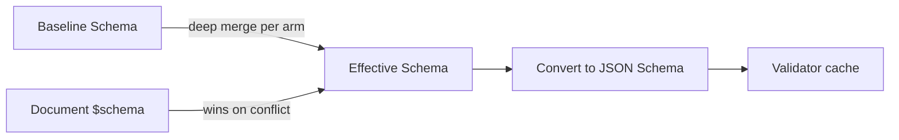
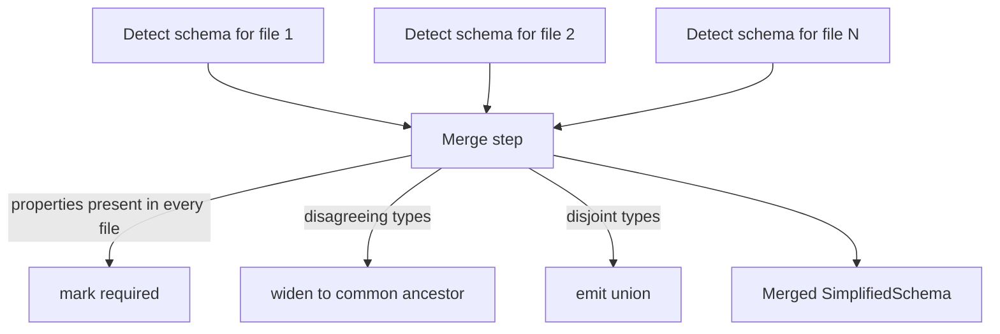

---
related_specs:
    - "@darkmatter/features/_completed/2026-05-11-schemas/spec.md"
    - "@darkmatter/features/_completed/2026-05-23-compose-schema/spec.md"
    - "@darkmatter/features/_completed/2026-05-28-schema-coercion/spec.md"
    - "@darkmatter/features/_completed/2026-06-10-schema-improvement/spec.md"
    - "@darkmatter/features/_completed/2026-07-08-schema-plus/spec.md"
    - "@darkmatter/features/_completed/2026-07-09-suggest-constraint/spec.md"
    - "@darkmatter/features/2026-07-13-meta-schema/spec.md"
---

# Schema Definition

Darkmatter can **define**, **detect**, and **evaluate** schemas for Markdown frontmatter. Authors declare the shape of their frontmatter with **SimplifiedSchema** — a single-line YAML grammar that compiles deterministically to a Draft 2020-12 JSON Schema. Every validation runs through the `jsonschema` crate; SimplifiedSchema is a surface, not a parallel validator.

This topic covers the practical usage of schemas for standalone validation, schema detection, and validation within the compose pipeline. The original specification lives in [`features/_completed/2026-05-11-schemas/spec.md`](../../features/_completed/2026-05-11-schemas/spec.md); the compose integration is specified in [`features/_completed/2026-05-23-compose-schema/spec.md`](../../features/_completed/2026-05-23-compose-schema/spec.md).

## What You Get

- A `$schema` frontmatter property that can hold an inline schema, point at a YAML/JSON file, or list a root-level union.
- A **baseline schema** that every document inherits.
- A `md schema validate` CLI subcommand with `pretty` and `json` output.
- A `md schema detect` CLI subcommand that infers a SimplifiedSchema from existing documents.
- A library API ([`DarkmatterSchemas`](#library-api)) for embedding the same behavior.
- Schema-aware completion hints for downstream shell-completion tooling.

## The `$schema` Frontmatter Property

`$schema` is **reserved** by Darkmatter inside frontmatter. Its value may be:

1. An inline **SimplifiedSchema** dictionary.
2. A string `FileReference` (resolved via `biscuit-file`) to a `.yaml` / `.json` file containing either a SimplifiedSchema or a JSON Schema.
3. A YAML sequence — a [root-level union](#root-level-unions) where each arm is a complete object schema.

The key is stripped from the frontmatter before validation, so a raw JSON Schema with `additionalProperties: false` will not reject every document for carrying a `$schema` field.

```yaml
---
$schema:
    title: "string(required)"
    tags:  "string[]"
---
```

```yaml
---
$schema: ./schemas/post.yaml
---
```

## SimplifiedSchema Grammar

A SimplifiedSchema is a YAML mapping from property names to **type-and-constraint** strings.

```yaml
$schema:
    name: string
    age:  number
```

### Syntax Forms

Every property value follows one of four shapes:

| Form                                       | Example                                              |
|--------------------------------------------|------------------------------------------------------|
| `{type}`                                   | `name: string`                                       |
| `{type}({constraints})`                    | `name: string(required)`                             |
| `{type} -> {description}`                  | `name: string -> The author's full name`             |
| `{type}({constraints}) -> {description}`   | `slug: string(not-empty;required) -> URL slug`       |
| `{ prop: type-expr, ... }`                 | `config: "{ host: string(required), port: number }"` |
| `{ prop: type-expr, ... }[]`               | `entries: "{ foo: string(required) }[]"`             |

- **Whitespace** inside `(...)` and inside `{ ... }` is insignificant. Quote the whole scalar so YAML keeps it as a string when whitespace is present.
- **Multiple constraints** are separated by `;`.
- **Optional by default** — properties are optional unless `required` appears in the constraint list. An optional property also accepts `null` as a sentinel for absent, so a frontmatter value that resolves to `null` validates the same way as a missing key.
- **Arrays** are written by appending `[]` to the type. Item constraints sit inside the parens that precede the brackets; constraints on the array itself sit in a second parens after the brackets.
- **Descriptions** (`-> ...`) populate the `description` annotation in the generated JSON Schema. Inside an inline object, a description terminates at the next top-level comma or closing brace (see [Inline Object Literals](#inline-object-literals)). When a property fails validation, its declared description surfaces at the point of failure — in `md schema validate` (pretty and JSON output) and in compose schema-failure blocks (see [Error Rendering](#error-rendering)).
- **Inline object literals** are an extension of the type-expression grammar. The whole `{ ... }` body is a single string scalar that the string-layer parser recognizes. YAML mapping values at a property position are still errors — quote the mapping as a string to opt into inline object syntax.

```yaml
$schema:
    tags:   string[]                      # optional array of strings
    scores: "number(min(0); max(100))[]"  # each item in 0..=100
```

### Types

| Type         | Accepts                                                                                                | Notes                                                                                                                                                                           |
|--------------|--------------------------------------------------------------------------------------------------------|---------------------------------------------------------------------------------------------------------------------------------------------------------------------------------|
| `string`     | Any YAML string scalar.                                                                                | Constraints: `min`, `max`, `not-empty`, `pattern`, `suggest`, `default`, `required`.                                                                                              |
| `date`       | ISO-8601 date `YYYY-MM-DD`.                                                                            | JSON Schema `format: date`.                                                                                                                                                     |
| `datetime`   | An RFC 3339 datetime `YYYY-MM-DDThh:mm:ss[.ms]` with a **required** offset (`Z` or `±HH:MM`).          | JSON Schema `format: date-time`.                                                                                                                                                |
| `time`       | An RFC 3339 time `hh:mm:ss` or `hh:mm:ss.ms` with a **required** offset (`Z` or `±HH:MM`); seconds are required (`14:30Z` is invalid). | JSON Schema `format: time`.                                                                                                                       |
| `number`     | Any JSON number.                                                                                       | Constraints: `min`, `max`, `integer`, `suggest`, `default`, `required`.                                                                                                         |
| `numberlike` | A JSON number **or** a numeric string (`"4"`, `"-13"`, `"3.14"`).                                      | Compiles to `anyOf: [number, regex-pattern string]`. A numeric-string value is **normalized** to a real number (see [Type Coercion](#type-coercion)).                            |
| `boolean`    | Any JSON boolean.                                                                                      | Constraints: `default`, `required`.                                                                                                                                             |
| `boolish`    | A JSON boolean **or** the strings `"true"` / `"false"` (any case).                                     | Compiles to `anyOf: [boolean, enum]`. A `"true"` / `"false"` value is **normalized** to a real boolean (see [Type Coercion](#type-coercion)).                                  |
| `object`     | Any YAML/JSON object.                                                                                  | No nested-schema authoring in v1 — `object` accepts any shape. Reference an external file for deeper typing.                                                                    |
| `file`       | A file reference parsed via `biscuit-file::FileReference`. Single or array form.                       | Constraints: `eager`, `match(glob, ...)`, `required`. **Lazy by default** (syntax-only); `file(eager)` resolves & checks existence (implicit paths repository-root first, then the document directory; explicit `./`/`../` from the document directory only), and on validation success its stored value is **rewritten** to the repo-relative resolved path. Bare `file` is left verbatim. See [Files](#files).        |
| `enum`       | A value from an explicit set.                                                                          | Constraints required — the members are the constraint. See [Enumerations](#enumerations).                                                                                       |
| `literal`    | Exactly one scalar value, of any scalar type.                                                          | Compiles to JSON Schema `const`. Bare `true`/`2` are typed; quoting forces string. Constraints: `required`, an equal `default`. See [Literals](#literals).                       |
| `url`        | A string parseable as an absolute URL.                                                                 | Constraints: `scheme(...)`, `default`, `required`.                                                                                                                              |
| `email`      | A string in `addr-spec` form.                                                                          | JSON Schema `format: email`.                                                                                                                                                    |
| `yaml`       | A string whose **content** parses as YAML, **or** a native mapping/sequence/scalar coerced to a YAML string. | JSON Schema `format: darkmatter-yaml`. Accepts JSON too (JSON is valid YAML). See [Content-Format Types](#content-format-types-yaml--json).                              |
| `json`       | A string whose **content** parses as strict JSON, **or** a native value coerced to a JSON string.      | JSON Schema `format: darkmatter-json`. Rejects YAML-only syntax. See [Content-Format Types](#content-format-types-yaml--json).                                                  |
| `expression` | A string that parses under the Darkmatter expression grammar. Parse-only — never evaluated.            | JSON Schema `format: darkmatter-expression`. The third content-format string type. Native booleans/numbers coerce to their string form. See [Expressions](#expressions).        |
| `type-definition` | A string type expression, native mapping object definition, or non-empty property union.          | Describes one SimplifiedSchema property definition as data. Parse-only; the value is never resolved or normalized. See [Semantic Meta-Types](#semantic-meta-types).              |
| `schema`     | An inline schema mapping, local schema reference string, or non-empty root union.                       | Describes one complete `$schema` declaration as data. Parse-only; validation checks syntax without reading referenced files. See [Semantic Meta-Types](#semantic-meta-types).  |
| `any`        | Anything.                                                                                              | Only `required` is meaningful. `any(required)` is presence-only because `any` already includes `null`.                                                                          |

Append `[]` to any type for an array of that type — e.g. `string[]`, `enum(red,green,blue)[]`, `file(match('*.md'))[]`.

### Semantic Meta-Types

`type-definition` and `schema` are Darkmatter's semantic meta-types: they let a
SimplifiedSchema describe its own authored grammar without maintaining a
second JSON meta-schema. The existing Rust parsers remain authoritative.
Compiled JSON Schema delegates to those parsers through
`x-darkmatter-type-definition` and `x-darkmatter-schema`.

A semantic meta-type has two distinct type relationships:

- Its **carrier type** is how the definition is represented in YAML. Both
  meta-types accept string, mapping, and sequence carriers.
- Its **denoted type** is what that authored definition describes. For example,
  the value `string(required)` has carrier type `string`, semantic type
  `type-definition`, and denotes a required string property. A union containing
  `string` and an object definition denotes `string | object`.

`type-definition` accepts exactly one complete property definition: a scalar
type expression, a native mapping object definition, or a non-empty property
union. `schema` accepts exactly one complete document schema declaration: an
inline mapping, a syntactically valid local `FileReference`, or a non-empty
root union of those forms. Remote references and malformed or empty unions are
invalid semantic values.

```yaml
$schema:
    field-definition: type-definition(required)
    document-schema:  schema(required)

field-definition:
    - string(required)
    - nested: number
document-schema: ./schemas/article.yaml
```

Both meta-types are **parse-only**. Validation never loads a reference, expands
an import or example, evaluates an expression, runs composition, or accesses
the network. It also preserves the authored YAML representation: mappings stay
mappings and sequences stay sequences. Actual `$schema` preparation remains a
separate operation that may resolve referenced schema files.

#### Source-Aware Presentation Boundary

The semantic parsers operate on YAML values, while DMLS and other diagnostic
consumers additionally require exact source spans. The v1 source-aware grammar
is deliberately capped at these authored presentations:

- plain, single-quoted, and double-quoted scalars;
- block and flow sequences;
- implicit scalar-key block and flow mappings;
- explicit scalar-key block mapping pairs, including compact mapping items in
  block sequences; and
- mapping-value anchors and scalar aliases used by the shipped schema corpus.

This is a SimplifiedSchema authoring grammar, not a promise to project every
presentation accepted by a general YAML parser. Tags, block scalars, complex
keys, explicit flow-mapping keys, directives, and other unlisted YAML
presentations are outside the v1 source-map and DMLS contract. Authors should
prefer ordinary `key: value` mappings. Expanding this closed boundary requires
a separately specified feature; discovering another valid-but-unlisted YAML
spelling is not a production-readiness regression for these meta-types.

#### Semantic Arrays

The ordinary array postfix remains available. `type-definition[]` and
`schema[]` mean arrays of independent semantic values. When one array item is
itself a union, use a nested sequence so the outer sequence remains the
collection boundary.

```yaml
$schema:
    definitions: type-definition[]

definitions:
    - string
    - [number, { nested: boolean }]
```

Only `required`, `default(...)`, and `generated` apply to these nominal types.
Semantic defaults must themselves parse as the declared artifact. Darkmatter
does not infer either meta-type in `md schema detect`, because a carrier value
does not establish the author's semantic intent. Terminal import syntax still
takes precedence, so `schema@file` and `type-definition@file` remain named-type
imports rather than primitive meta-type declarations.

### Universal Constraints

Every type accepts:

- `required` — the property must be present.
- `default(value)` — JSON Schema `default`. Darkmatter does **not** mutate documents; downstream tools and detection honor it.
- `generated` — marks a property whose value the **host tool supplies at compose time** (for example the `ctx.*` context values in the Darkmatter base schema). It emits the `x-darkmatter-generated: true` annotation and suppresses the property's static `required` entry, so an authored document validates before the host fills the value in; the typed (non-null) arm is preserved. `datetime(generated; required)` therefore reads "required once generated", not "must be authored".

### Numeric Constraints (`number`)

| Constraint   | Effect                          | JSON Schema             |
|--------------|---------------------------------|-------------------------|
| `min(n)`     | Inclusive minimum.              | `minimum`               |
| `max(n)`     | Inclusive maximum.              | `maximum`               |
| `integer`    | Whole numbers only.             | `type: integer`         |
| `default(n)` | Default value.                  | `default`               |
| `required`   | Property is required.           | parent `required` entry |

### String Constraints (`string`)

| Constraint     | Effect                                                                                            | JSON Schema             |
|----------------|---------------------------------------------------------------------------------------------------|-------------------------|
| `min(n)`       | Minimum length (Unicode code points).                                                             | `minLength`             |
| `max(n)`       | Maximum length.                                                                                   | `maxLength`             |
| `not-empty`    | Disallow empty / all-whitespace.                                                                  | `pattern: "\\S"`        |
| `pattern(re)`  | ECMA-262 regex compiled with `jsonschema::PatternOptions::regex()` (ReDoS-safe, linear-time).     | `pattern`               |
| `default(s)`   | Default string.                                                                                   | `default`               |
| `required`     | Property is required.                                                                             | parent `required` entry |

### Date / Time Constraints

`date`, `datetime`, and `time` accept `default(s)` (ISO string) and `required`. The type itself emits the corresponding `format` with format-assertion enabled.

### Advisory Suggestions (`suggest`)

`suggest(...)` provides representative completion candidates for `string` and `number` properties. Unlike `enum(...)`, suggestions are **advisory** — a document value is valid when it satisfies the underlying type and constraints, whether or not it appears in the suggestion list. DMLS uses valid suggestions for frontmatter value completion.

```yaml
$schema:
    color: string(suggest(red, green, "blue gray"))
    port: number(integer; suggest(80, 443))
    ratio: number(min(0); max(1); suggest(0.25, 0.5, 1))
    tags: string(suggest(alpha, beta))[]
    retries: number(integer; suggest(1, 2, 3))[]
```

#### Eligibility

`suggest(...)` is available only on exact `string` and `number` types. `number(integer)` remains eligible because `integer` is a constraint on `number`. Array forms (`string[]`, `number[]`) are eligible — their candidates describe individual elements, not whole arrays.

`suggest(...)` is not available on `numberlike`, `date`, `datetime`, `time`, `url`, `email`, `boolean`, `boolish`, `enum`, `any`, `object`, `file`, or raw JSON Schema.

#### Cardinality

A complete property definition may contain at most one `suggest(...)` constraint. A second occurrence is a structural grammar error. This restriction applies across all atoms of a property-level union:

```yaml
# INVALID: two suggest(...) across union atoms
$schema:
    value: [string(suggest(a)), string(suggest(b))]
```

Each property declaration in a separate root-level schema-union arm is an independent complete property definition and may carry its own suggestion list.

`suggest()` with no candidates is a structural grammar error.

#### Argument Grammar

Candidate arguments reuse the existing SimplifiedSchema argument delimiter, quoting, and escaping grammar — the feature introduces no new string literal syntax. The parser retains the exact source span and decoded text for every candidate.

#### String Interpretation

Every syntactically valid argument to `string(suggest(...))` is interpreted as a string. Bare spellings that resemble numbers, booleans, or null are still strings. Quotes delimit and escape; they do not create a distinct candidate type. So `12` and `"12"` are the same interpreted string candidate.

#### Number Interpretation

Bare and quoted arguments to `number(suggest(...))` are interpreted using the **simple decimal** syntax:

```text
optional `-` + one or more digits + optional (`.` + one or more digits)
```

The syntax accepts leading zeros and canonicalizes them. It does not accept exponent notation (`1e3`), a leading plus sign (`+1`), a missing integer portion (`.5`), a missing fractional portion (`5.`), or leading/trailing whitespace.

A simple decimal becomes a JSON number only when its canonical decimal text survives conversion to the supported JSON numeric model and canonical JSON serialization with the same exact value (lossless canonical round-trip equality). For example, `3`, `"3"`, `003`, and `3.0` all have canonical decimal text `3` and interpret to the same numeric candidate `3`. `-0` canonicalizes to `0`.

A simple decimal outside the lossless representation boundary is retained as its exact canonical decimal JSON string — it is invalid metadata that DMLS warns about and omits from completion, but it never blocks schema loading or validation.

An argument whose decoded text does not use simple decimal syntax (e.g. `many`) is also retained as its decoded JSON string for linting and diagnostics — it is not a schema-load error.

#### Uniqueness

Candidates must be unique after target-directed interpretation. A duplicate is a structural grammar error ranged at the later argument, including duplicates created by leading-zero, trailing-fractional-zero, quoted/bare, or negative-zero normalization.

#### Generated Annotation

Darkmatter preserves interpreted suggestions in generated JSON Schema using the custom `x-darkmatter-suggest` annotation. Authors never write this field — they write only `suggest(...)`.

```yaml
$schema:
    score: number(min(0); max(100); suggest(-1, 50, 101))
```

generates:

```json
{
  "type": "number",
  "minimum": 0,
  "maximum": 100,
  "x-darkmatter-suggest": [-1, 50, 101]
}
```

The annotation preserves interpreted candidate order and scalar values. It is never lowered to the standard JSON Schema `examples` annotation and is distinct from Darkmatter's `example(...)` artifact and `x-darkmatter-example` annotation. Raw JSON Schema may contain a field with the same spelling, but Darkmatter and DMLS do not discover suggestions from raw JSON Schema.

#### Candidate Linting

The Darkmatter library owns candidate checking via `lint_suggestions()` — a structured, typed, span-bearing lint API. Each interpreted candidate is checked against its target schema (the non-null scalar or array-item fragment, with `x-darkmatter-suggest` excluded). Applicable number constraints include `min`, `max`, and `integer`; applicable string constraints include `minLength`, `maxLength`, `not-empty`, and `pattern`. `required`, `default`, `generated`, and `example(...)` do not constrain a candidate.

Invalid candidates produce structured lint problems (not schema-load errors) with decoded text, interpreted value, failure reason, and exact source span. Schema resolution, validator construction, frontmatter validation, and composition all continue uninterrupted. See `SuggestionLintProblem` and `SuggestionLintReason` in the library API.

#### Completion Query

DMLS reads suggestions from the SimplifiedSchema representation via `suggestions_for_path()`. This returns lint-valid candidates in declaration order, prefixed-filtered, with YAML-safe insertion text (double-quoted strings, canonical numbers). Invalid candidates are omitted; valid siblings are retained. See `SuggestionItem` and `SuggestionQuery` in the library API.

### Boolean Constraints

`boolean` and `boolish` accept `default(b)` and `required`.

### Enumerations

`enum` requires a positional comma list of members; other constraints follow after a `;`. Members with whitespace, commas, parentheses, or `;` must be single-quoted.

```yaml
$schema:
    color:  enum(red,green,blue; required)
    status: "enum(draft, published, archived; default(draft))"
    spaced: "enum('a, b', 'c; d')"
```

### Literals

`literal(value)` types a property whose value must **equal exactly one scalar**. It compiles to JSON Schema `const`, replaces the single-member-enum workaround (`kind: enum(spec)`), and makes discriminated unions first-class.

```yaml
$schema:
    kind:     literal(spec)                     # string literal
    version:  literal(2; required)              # number literal + constraint
    archived: literal(false)                    # boolean literal
    note:     "literal('a, b'; default('a, b'))"  # quoted value (protects , ; )
```

- Exactly **one** positional value, lexed with the same rules as enum members: a bare token or a single-/double-quoted string. Quoting protects `,`, `;`, and `)`.
- Constraints follow after `;`, exactly like `enum(a, b; required)`.
- `literal()` with no value is a `SchemaError` (*literal requires a value*). Two or more positional values is a `SchemaError` whose message points you at `enum(...)`.

#### Value Typing

The positional value is lexed as a YAML-style scalar, so the literal's JSON type mirrors how YAML would type the frontmatter value being validated:

| Authored                                | Typed as |
|-----------------------------------------|----------|
| bare `true` / `false`                   | boolean  |
| bare integer / float (numberlike-shaped) | number   |
| any other bare token                    | string   |
| quoted (`'2'`, `"true"`)                | string   |

`version: 2` in a document therefore satisfies `literal(2)` without coercion gymnastics, and quoting opts out (`literal('2')` matches the string `"2"`, not the number `2`). Number detection reuses the existing numberlike-shape test — no scientific notation, no leading-zero octal surprises; anything that fails the shape test is text.

A **bare `null`** is rejected with an actionable error (*quote it or drop the key*): optional properties already accept `null`, so a null literal is always an authoring mistake.

#### Constraints

| Constraint  | Allowed | Notes                                                                                                          |
|-------------|---------|----------------------------------------------------------------------------------------------------------------|
| `required`  | yes     | Enforces presence and equality.                                                                                |
| `default(v)` | yes     | Schema-load lint: `v` must equal the literal value, else `SchemaError` — a default that violates its own `const` is always a bug. |
| `suggest(...)` | no   | Completion is implied by the value itself.                                                                     |
| everything else (`min`, `pattern`, …) | no | Nothing to constrain beyond identity.                                                            |

A non-`required` literal accepts missing/`null` through the standard optional-nullable wrapper; otherwise the value must equal the literal.

#### JSON Schema Emission

`literal(spec)` → `{ "const": "spec" }`; `literal(2)` → `{ "const": 2 }`. The array form `literal(x)[]` is **allowed** and places the `const` under `items`, so every item must equal the value — grammatically uniform with every other type, niche but well-defined.

#### Coercion

The literal implies its scalar type, so the write-back pass treats it like the corresponding primitive: a document value `"2"` against `literal(2)` coerces to the number `2`; `"true"` against `literal(true)` coerces to the boolean `true`. **String literals never coerce.** As with all coercion, write-back happens only when the coerced result validates, and `$(...)`-pending values are skipped.

#### Relationship to `enum`

`literal(x)` validates **identically to `enum(x)` for string values**. Keep using `enum` for "one of N strings"; reach for `literal` when you mean "exactly this value, of any scalar type" — including non-string discriminants (`version: 2`) that `enum` cannot express. Single-member enums keep working; there is no deprecation.

#### Trigger Matches

`literal` is a pure value-equality constraint (no I/O), so it is permitted in [trigger-schema](#repository-trigger-schemas) match expressions. `kind: literal(spec)` is the idiomatic trigger discriminant, replacing the older `enum(spec)` spelling.

### Expressions

`expression` types a **string that must parse under the Darkmatter expression grammar**. It is the third member of the content-format string-type family alongside [`yaml` / `json`](#content-format-types-yaml--json), and it is **parse-only** — never evaluated, no I/O, no shell, no function execution.

```yaml
$schema:
    when:  expression                           # bare
    guard: expression(required)                 # with constraints
    hooks: "{ on-error: expression, on-done: expression }"
```

- A plain keyword type with no positional value — parses exactly like `string`.
- There is **no** parameterized form in v1. `expression(condition)` is reserved for a future backward-compatible opt-in and is rejected today.

#### Semantics

The expression language has two dialects that disagree on `&&` / `||`: the **value** dialect (body `{{ }}` interpolation) and the **condition** dialect (`when="..."`, where `&&`/`||` are logical AND/OR). A bare `expression` validates when the string parses under **either** dialect, so `when: expression` accepts `is_agent() && os == "macos"` on day one. In practice this is a single condition-mode parse, because the condition parser accepts a parse-superset of the value dialect.

Validation checks **parseability only**:

- **No evaluation, ever** — the same passivity contract as `yaml` / `json` content-format validation.
- **Unknown identifiers are not schema errors.** Identifier resolution (frontmatter keys, `ctx.*`, `env.*`) is a compose-time concern. DMLS layers richer advisory diagnostics on top inside the editor.

#### JSON Schema Emission and Constraints

Emits `{ "type": "string", "format": "darkmatter-expression" }`, backed by a pure parse check. Constraint applicability, optional-nullability, and the `$()` / `{{ }}` pending-value deferral rules mirror `yaml` / `json` exactly: it permits the universal `required`, `default(...)`, and `generated` constraints plus array constraints when suffixed with `[]`; string constraints and `suggest(...)` are rejected. A `default(...)` value must itself parse as an expression, or the schema fails to load.

#### Coercion

`when: true` and `retries: 3` are valid degenerate expressions that YAML types as boolean/number before the validator sees them. The coercion pass serializes native boolean and number scalars to their canonical literal string forms (`true` → `"true"`, `3` → `"3"`), the same native-value-accepted-then-serialized behavior `yaml`/`json` already have. Number spelling canonicalizes through YAML's reading (`3.10` → `"3.1"`); quoting preserves exact spelling. **Mappings and sequences do not coerce — they are type mismatches.**

#### Consumer Layering

The type ships in Darkmatter; consumers adopt it in their own schemas. Claudine's extension baseline retypes `when: string` → `when: expression` with zero Claudine-specific code in Darkmatter, then DMLS lights up schema-driven expression completion, hover, and diagnostics inside those frontmatter values.

### Files

The `file` type wraps a `FileReference` string and is **lazy by default**. A bare
`file` value is valid as long as it **parses as a `FileReference`** — the reference
is never resolved against the filesystem, so a syntactically valid path to a
not-yet-created output file passes. This is the right default for prompt authoring,
where a property often names a file the run is about to *produce*.

Add `eager` to opt into existence checking. `file(eager)` requires that:

1. The string parses as a `FileReference`.
2. The reference resolves to an existing filesystem entry **at validation time**.

Relative paths in an eager check resolve like implicit file references: a bare path
(`spec.md`, `notes/spec.md`) is tried **repository-root first, then the prompt
document's directory**, while an explicit `./`/`../` path resolves from the document
directory only. This is the same order `$schema` file references and the expression
path (`file_exists`/`frontmatter`) use. No ambient current working directory is read
once the resolution context is captured.

`match(globs)` is **suggestion metadata only** — it shapes path completion (which
candidates a tool offers) but never rejects a value. An existing file that matches no
configured glob still validates.

When an eager `file(eager)` value validates, its stored value is **rewritten to the
resolved, repo-relative path** — the same projection `relative(value)` /
`dirname(value)` already produce. A raw `./spec.md` becomes `area/spec.md` when the
prompt lives in `area/` inside a repo, so `spec` and `dirname(spec)` agree by
construction. Bare (lazy) `file` values, `string`-typed properties, remote URLs,
absent/`null` optionals, and values still holding `$(...)` or unresolved `{{ ... }}`
are left verbatim. The rewrite is idempotent and stores `/` separators on every OS,
so a committed eager-`file` reference is portable across macOS, Linux, and Windows.
See [Schema Validation — Eager-`file` value normalization](../inline/schema-validation.md#eager-file-value-normalization)
for the full contract.

```yaml
$schema:
    review:      "file(eager; required; match('**/*review*.md'))"   # must exist
    plan:        "file"                                              # lazy: may be a future output path
    doc:         "file(match('*.doc', '*.pdf', '*.md', '*.txt'))"   # lazy + completion hints
    source_code: "file(match('src/**/*.rs', '!src/**/test_*.rs'))"
    images:      "file(eager; match('*.png', '*.jpg'))[](min(1))"   # each item must exist
```

`eager` is file-only; `string(eager)` and the like are a fatal schema-preparation
error. The array form `file[]` adds the standard constraints on the array itself
(`min`, `max`, `unique`), while `eager` and `match(...)` apply **per item**.

### URLs

| Constraint           | Effect                                              |
|----------------------|-----------------------------------------------------|
| `scheme(a, b, ...)`  | Restrict to one of the listed schemes (lowercased). |
| `default(s)`         | Default URL.                                        |
| `required`           | Property is required.                               |

```yaml
$schema:
    homepage:  "url(scheme(https))"
    canonical: "url(required)"
```

### Emails

`email` accepts `default(s)` and `required`; the type emits JSON Schema `format: email` with assertion enabled.

### Array Constraints

Place item constraints inside the parens **before** `[]`; place constraints on the array itself in a second parens **after** `[]`.

```yaml
$schema:
    # required array of 1..=5 unique lowercase tags
    tags: "string(pattern(^[a-z][a-z0-9-]*$))[](min(1); max(5); unique; required)"
```

| Constraint        | Effect                                       | JSON Schema      |
|-------------------|----------------------------------------------|------------------|
| `min(n)`          | Minimum number of items.                     | `minItems`       |
| `max(n)`          | Maximum number of items.                     | `maxItems`       |
| `unique`          | All items must be distinct.                  | `uniqueItems`    |
| `required`        | Array property is required (not items).      | parent `required` |
| `default([...])`  | Default array.                               | `default`        |

## Inline Object Literals

The type-expression grammar accepts an **inline object literal** — a single string scalar that declares the shape of a nested object. This is the way to type object-typed properties and arrays of objects without dropping down to an external JSON Schema file. The motivating case is the typed object array:

```yaml
$schema:
    authors: "{ name: string(required), email: email }[]"
```

### Forms

An inline object appears wherever a type expression is valid: as a single property, a property-level union arm, or the item type of an array.

```yaml
$schema:
    # Array of typed objects — the motivating case
    entries: "{ foo: string(required), bar: string }[]"

    # Optional single typed object
    config: "{ host: string(required), port: number(default(8080)) }"

    # Required single typed object — the postfix constraint applies to config
    config_required: "{ host: string }(required)"

    # Multi-line for readability (whitespace inside braces is ignored)
    endpoints: "{
        url: url(scheme(https); required),
        method: enum(GET, POST, PUT, DELETE; required),
        timeout: number(default(30))
    }[]"

    # Nested objects
    database: "{
        primary: { host: string(required), port: number(default(5432)) },
        replicas: { host: string, port: number }[]
    }"

    # Required non-empty array — postfix constraints after [] apply to replicas
    replicas: "{ host: string }[](min(1); required)"

    # Inline object as a union arm
    payload:
      - "{ type: enum(foo; required), foo_id: string(required) }"
      - "{ type: enum(bar; required), bar_count: number(required) }"

    # Mixed: inline object array or a plain string fallback
    metadata:
      - "{ key: string(required), value: string(required) }[]"
      - "string"
```

The inline object body parses identically in single-line and multi-line form because the parser strips whitespace after `{`, around `,` and `:`, and before `}`. Braces are not allowed inside constraint argument lists, so there is no ambiguity with the existing constraint syntax.

### Identifier Rules

Inline object property names are always **unquoted string-layer identifiers** — unquoted ASCII alphanumeric characters plus `-` and `_`, including leading digits. The same scanner is used elsewhere in the grammar.

Accepted: `name`, `foo_id`, `x-custom`, `api2_version`, `123abc`.

Rejected: `display name`, `@type`, `x.custom`, `"x-custom"`. There is no quoted-property-name form in this feature; rename the property to a valid identifier or drop down to a JSON Schema file for richer naming needs.

### Descriptions

Each property inside `{ ... }` may carry a `-> description` suffix that follows the same four syntax forms as top-level properties. Inside an inline object, **descriptions terminate at the next top-level comma or closing brace** at the current nesting level. Commas inside an inline property description are not supported by this feature — keep descriptions comma-free inside `{ ... }`. Top-level descriptions (outside any inline object) still consume the rest of the scalar string after `->` exactly as before.

### Postfix Constraints

Inline objects support the same postfix constraints as primitive atoms.

- A **single inline object** with a postfix constraint — `{ host: string }(required)` — applies the constraint to the containing property. `required` hoists to the parent `required` array; `default(...)` sets a default on the object property.
- An **inline object array** with constraints after `[]` — `{ name: string }[](min(1); required)` — applies those constraints to the array property itself (`minItems`, parent `required`). Constraints on nested properties remain inside the inline object fragment and become JSON Schema constraints on each `items` object.
- A trailing comma after the last property is allowed: `{ foo: string, }` is identical to `{ foo: string }`.

### Nesting Depth

The inline object parser enforces a hard maximum of **32 nesting levels** of inline objects. Exceeding that depth returns `SchemaError::Grammar`. The limit is the same for single inline objects, inline object arrays, and unions whose arms contain inline objects — depth is counted at every level of nested `{ ... }`.

```yaml
$schema:
    # OK: 3 levels of nesting
    a: "{ b: { c: { d: string } } }"

    # Error at depth 33: SchemaError::Grammar
    deep: "{ a: { a: { a: { a: { a: { a: { a: { a: { a: { a: { a: { a: { a: { a: { a: { a: { a: { a: { a: { a: { a: { a: { a: { a: { a: { a: { a: { a: { a: { a: { a: { a: string } } } } } } } } } } } } } } } } } } } } } } } } } } } } } } } }"
```

If you need deeper typing, reference an external JSON Schema file with `$schema: ./path/to/schema.yaml` (or use a root-level union whose arm is a file reference).

### `additionalProperties: false`

Every inline object compiles to a JSON Schema fragment that sets `additionalProperties: false`. This is the intended default — declaring an inline object is a signal that the author wants shape restriction. It differs from the root schema default (`additionalProperties: true`) and from the opaque `object` type, which still compiles to `{ "type": "object" }` with no `additionalProperties: false`. Authors used to the root default may be surprised; this is documented behavior. A future `lenient` constraint on the inline object body may opt back to `true`.

### YAML Mapping vs. Inline Object

A YAML mapping at a property position is still a `SchemaError::Grammar`. Inline object syntax is recognized **only** when the property value is a **quoted string scalar** that the string-layer grammar parser recognizes as an inline object body. Authors who want typed nested objects must quote the object body as a string; YAML-native mapping schemas are a separate, future feature.

```yaml
$schema:
    # OK: string scalar recognized as inline object
    config: "{ host: string(required) }"

    # Error: YAML mapping at a property position is still reserved
    # config:
    #     host: string
```

### JSON Schema Output

An inline object compiles to the same Draft 2020-12 JSON Schema shape a hand-written `{ "type": "object", "properties": ..., "required": ..., "additionalProperties": false }` would produce, with `required` populated from per-property `required` constraints and the inline object's own `required` postfix hoisted to the parent `required` array.

For an array of inline objects, the `items` sub-schema is the inline object fragment and `minItems` / `maxItems` / `uniqueItems` / `required` come from the postfix constraints after `[]`.

## Composition Primitives

Four primitives compose named types, dictionaries, and content-format strings on top of the base grammar. They are additive — a schema that uses none of them parses and compiles exactly as before.

### `example(...)` Constraint

`example(...)` attaches one or more **example artifacts** to a property. Examples are documentation, like a richer `description` — they do **not** constrain the annotated property's value. Comma-separated file references resolve relative to the referencing schema file (magic paths and `this` are honored, mirroring `$schema` resolution).

```yaml
$schema:
    today: "date(required; example(./ctx/today-example.yaml)) -> Local date"
    demo:  "string(example(./a.yaml, ./b.yaml))"
```

Each referenced file is validated at **schema-load time** — a missing, malformed, or invalid example is a schema-load error (fail loud; the point is trustworthy examples). Validation has two layers:

1. The common **envelope** validates against the built-in example schema (`kind`, `invocation`, `returns`, `description`).
2. Target-specific fields such as `parameters` validate against the inherited target shape (for expression-function examples, an array of single-key `name → value` maps).

Resolved example objects are emitted onto the JSON Schema as the `x-darkmatter-example` extension so downstream consumers (`md schema about`, DMLS hover) read them without re-reading disk. Unchanged example files are cached by content hash across warm loads.

### Cross-File Named-Type Imports (`Name@file`)

`Name@fileref` **inlines** the definition of the named type `Name` from the referenced file at the use site — structural substitution, not a persistent reference. A schema file's **top-level `$schema:` entries are its named types**; each is a full SimplifiedSchema definition (scalar, enum, union, or an inline object with literal or pattern keys).

```yaml
$schema:
    type:       type@./types.yaml        # inlines types.yaml's `type` definition
    parameters: parameter[]@./types.yaml # array of the inlined `parameter` map
    value:      type@this                # the `type` defined in *this* file
```

Grammar: `type_ref := ident ('[]')? ('(' constraints ')')? '@' fileref`. Postfix composes **outward**:

- `Name[]@file` — an array of the inlined `Name`.
- `Name(constraints)@file` — the inlined type with `constraints` applied to it.
- `@this` — the current schema file (self-target), including inline top-level documents.

Rules:

- The right side resolves through `biscuit_file::FileReference::resolve_from(base_dir)` — the same resolution as root-union file refs and `$schema`.
- The target must be a SimplifiedSchema file with a matching named type. Importing from a raw JSON Schema file, from a file with no matching type name, or a missing file is a schema error.
- Expansion is **eager, bounded, and cycle-checked**. Named types form a DAG; a type that transitively references itself is a recursion error (`SchemaError::ImportCycle`), and an import chain that exceeds the depth cap is rejected — the same protection as the inline-object nesting cap. True recursive types are deferred.
- Each import is a **dependency edge** recorded on the resolved schema (`ResolvedSchema.imports`) so the schema cache and DMLS index can invalidate when an imported file changes.
- `to_json_schema` rejects any unresolved import that reaches conversion, exactly as it rejects unresolved root-union file arms — imports are always expanded by the resolver first.

Because a named type can be *any* definition and `@` inlines it, composition (named types + `@` + `[]` + unions + pattern keys) **is** the type system — SimplifiedSchema's ergonomic answer to JSON Schema `$ref` / `$defs`.

### Pattern / Dictionary Keys

Inside an inline object (or a YAML-block schema object), keys may follow a **pattern** instead of a fixed literal set. This types dictionaries — objects whose keys are data, not a known vocabulary.

```yaml
$schema:
    headers: "{ <string>: string }"                 # any string key → string value
    parameter:
        "<string>": any                             # any string key → any value
```

Key forms:

| Form                    | Meaning                                              | JSON Schema                          |
|-------------------------|------------------------------------------------------|--------------------------------------|
| `<string>`              | Any string key (catch-all).                          | `additionalProperties: <valueType>`  |
| `<starting::PREFIX>`    | Keys beginning with the **literal** string `PREFIX`. | `patternProperties` (`^PREFIX`)      |
| `<ending::SUFFIX>`      | Keys ending with the **literal** string `SUFFIX`.    | `patternProperties` (`SUFFIX$`)      |
| `<pattern::RE>`         | A raw ECMA-262 regex escape hatch.                   | `patternProperties` (`RE`)           |

Rules:

- **Literal keys win** over pattern keys. Because JSON Schema's `patternProperties` also applies to declared `properties`, the converter subtracts literal names from each emitted non-catch-all pattern with a negative lookahead. For example `<starting::x->` alongside literal key `x-kind` emits a pattern equivalent to `^(?!(?:x-kind)$)x-`. If wrapping would make a user-supplied `<pattern::RE>` invalid, conversion fails loudly rather than silently double-validating.
- Multiple pattern keys are allowed (multiple `patternProperties`).
- A pattern-keyed object is **closed** by default (`additionalProperties: false`) unless a `<string>` catch-all is present, in which case the catch-all lowers to `additionalProperties: <valueType>`.
- A pattern-keyed object whose value type is a `@`-import sidesteps the one-level inline-object nesting cap — cross-file named types are the depth escape hatch.

Schemas that emit a lookaround-bearing pattern are validated with `jsonschema`'s `fancy-regex` engine **per schema**; every other schema keeps the ReDoS-safe linear engine.

### Object Arity Constraints (`min-keys` / `max-keys`)

Pattern-keyed objects match `0..N` keys; some shapes need a bounded count. `min-keys(n)` / `max-keys(n)` are the object analog of the array `min` / `max`, lowering to JSON Schema `minProperties` / `maxProperties`. They apply only to object atoms — using them on a non-object type or an array-level constraint position is a schema error.

They can be authored as **postfix constraints** or via the reserved **`$constraints`** block key — one canonical model, two surfaces:

```yaml
$schema:
    # Postfix form — exactly one key/value pair
    parameter: "{ <string>: any }(min-keys(1); max-keys(1))"

    # $constraints block form — identical desugaring
    parameter:
        "<string>": any
        $constraints:
            min-keys: 1
            max-keys: 1
```

`$constraints` (dollar-prefixed, mirroring `$schema`) is **reserved only inside authored schema objects**: it is stripped before shape assembly and never participates in literal/pattern key matching. Flag constraints are written `name: true`. This does **not** reserve `$constraints` in user frontmatter data — only the schema-authoring language uses the sentinel.

### Content-Format Types (`yaml` / `json`)

`yaml` and `json` type a **string whose content must parse** as a structured document. They join the string-with-format family (`date`, `datetime`, `time`, `email`, `url`, `file`) — the same custom-format seam, not a new mechanism.

```yaml
$schema:
    invocation:
        - string(required)
        - { frontmatter: yaml }   # a frontmatter block expressed as a YAML string
    config: json                  # a string of strict JSON
```

- They compile to `{ "type": "string", "format": "darkmatter-yaml" }` / `"darkmatter-json"`, with validators that parse the value through biscuit-file's YAML / strict-JSON facilities. A parse failure is a validation error.
- **String or native, with coercion.** The value may be a YAML/JSON **string** *or* a **native** mapping/sequence/scalar. A native value is coerced to its YAML/JSON string serialization (the same write-back model as scalar coercion) before validation; a native value that cannot be represented in the target format is a validation error. So `frontmatter: yaml` accepts both `"title: Foo"` and a native `{ title: Foo }`.
- **`json` is strict; `yaml` is a superset.** JSON is valid YAML, so `yaml` accepts JSON; `json` rejects YAML-only syntax.
- Validation-only APIs stay **non-mutating** — they validate against a transient coerced copy and leave the caller's frontmatter untouched. Only the composing/write-back path exposes the serialized value.
- Embedded sub-schema constraints (`yaml(schema(<ref>))`) are deferred to a future extension.

## Unions

### Property-Level Unions

Any property value may be a YAML sequence of type expressions to declare an `anyOf` union. The property matches if at least one arm does.

```yaml
$schema:
    foo:
      - string
      - number

    status:
      - "enum(draft, published, archived)"
      - "number(integer; min(0))"
      - any

    # accepts a positive number or a CSS-length string
    width:
      - "number(min(0))"
      - "string(pattern(^\\d+(px|%)$))"
```

**Hoisting.** `required` and `default(...)` are property-level — they are extracted from whichever arm declares them and applied to the property as a whole. If `required` appears on any arm, the property is required; convention is to place it on the first arm. Differing `default(...)` values on multiple arms is a compile-time error.

```yaml
$schema:
    title:
      - "string(required; not-empty)"  # required hoisted; not-empty stays on this arm
      - "number"
```

Arm-level constraints stay arm-local. Arm descriptions (`-> ...`) annotate that arm in the generated JSON Schema.

A property-level union may mix a `literal` arm with any other atom — something `enum` cannot do, because `enum` members are homogeneous strings:

```yaml
$schema:
    width: [literal(auto), "number(min(1))"]   # the keyword `auto` or a positive number
```

### Discriminated Unions

When the arms of a union are inline objects that each carry a `literal`-typed **discriminant** key, the union becomes a genuine tagged union. Both `md schema validate` diagnostics and DMLS editor behavior narrow to the single matched arm.

```yaml
$schema:
    event:
      - "{ kind: literal(created), path: file(required) }"
      - "{ kind: literal(deleted), reason: string }"
```

Given a document with `kind: created`, validation reports only the `created` arm's missing/unknown/type problems instead of the full `anyOf` noise, and DMLS sibling-key completion offers only that arm's keys.

An arm is selected **only when** all of the following hold:

- the same discriminant key is present as a `literal` in **at least two** arms,
- the instance contains that key with an authored value, and
- exactly **one** arm's typed literal equals the instance value.

Equality is **type-sensitive**: a typed `2` does not select an arm tagged `'2'`. If multiple discriminant keys qualify, they must all select the same arm. For an absent, unknown, duplicate, or conflicting discriminant, validation and completion fall back to the normal merged/union behavior — narrowing never guesses an arm from a partial or ambiguous match. Schemas without literal discriminants keep byte-identical `anyOf` diagnostics.

### Root-Level Unions

The root `$schema` may itself be a YAML sequence. Each arm is a complete object schema and the document is valid if it matches at least one arm. Arms may be inline SimplifiedSchema mappings or string file references.

```yaml
---
$schema:
  - ./schemas/post.yaml     # arm 0: file reference (SimplifiedSchema)
  - ./schemas/page.yaml     # arm 1: file reference (JSON Schema is fine too)
  - title: string           # arm 2: inline SimplifiedSchema
    body:  string
---
```

The effective schema is `{ "anyOf": [arm0, arm1, ...] }`. **Baseline merging is applied to each arm independently** — a baseline declares the fields every arm inherits.

When validation fails against a root union, Darkmatter reports the **closest-matching arm** — the one producing the fewest problems — and prefixes problems with the arm index. JSON output carries an `arm_index` field on every problem.

## Schema Resolution



The resolution rules:

1. **Inline mapping** at `$schema` — parsed directly as SimplifiedSchema.
2. **String reference** at `$schema` — resolved via `FileReference`, then disambiguated:
   - Parse as YAML.
   - If the root mapping contains a `$schema` key whose value is **itself a mapping**, treat as SimplifiedSchema.
   - Otherwise (no `$schema` key, or the value is a string URI like `https://json-schema.org/draft/2020-12/schema`) treat as raw JSON Schema.
   - `.json` files are always treated as JSON Schema.
   - If the file is recognized as a standalone SimplifiedSchema document (see [Standalone Schema Documents](#standalone-schema-documents)), its payload is used directly.
3. **YAML sequence** at `$schema` — root union; each arm is resolved by the same rules above.
4. **No `$schema` and no baseline** — validation succeeds vacuously and `pretty` mode emits a `no schema; vacuously valid` note (suppressed by `--quiet`).

Path references in `$schema` resolve like implicit file references: a bare path is
tried **repository-root first, then the document's directory**, while an explicit
`./`/`../` reference resolves from the document's directory only. A bare **name**
(`$schema: claudine.yaml`, no path separator) instead resolves against the configured
[schema roots](#repository-trigger-schemas) nearest-first. No ambient current working
directory is read.

Remote (`http://` / `https://`) references are **not supported** in v1 and produce a clear `SchemaError::RemoteUnsupported` directing the user to download the schema locally.

## Standalone Schema Documents

A standalone YAML file can be a SimplifiedSchema authoring document, recognized by **content** — not by filename, glob, or consumer discovery. The library classifier `parse_standalone_schema_document()` recognizes two envelopes:

### Pure Envelope

A YAML mapping whose only top-level key is `$schema`:

```yaml
$schema:
    name: string(suggest(Bob, Mary, Sam))
    age: number(integer; min(0); suggest(21, 30, 40))
```

The `$schema` value is the SimplifiedSchema payload. A mapping payload is usable both as a whole-file schema and as the namespace for `Name@fileref` named imports. A sequence payload is a root-level schema union for whole-file use only (it supplies no named-import namespace).

### Tagged Envelope

A YAML mapping containing exactly `kind: schema` and a `types` mapping:

```yaml
kind: schema
types:
    name: string(suggest(Bob, Mary, Sam))
    age: number(integer; min(0); suggest(21, 30, 40))
```

The `types` mapping is semantically equivalent to a pure envelope's `$schema` mapping for whole-file use and named imports.

### Whole-File References and Named Imports

A Markdown document references a standalone schema file via `$schema`:

```yaml
---
$schema: ./schemas/person.yaml
name: Bob
age: 30
---
```

Referencing either mapping envelope as a whole validates the document against that mapping's complete object shape. The `Name@fileref` named-import syntax extracts a single named type from the file's mapping payload and inlines it:

```yaml
$schema:
    display-name: name@./schemas/person.yaml
    ages: age[]@./schemas/person.yaml
```

### Malformed Envelopes

Once an envelope is recognized, a missing or malformed payload is a schema-document error (`SchemaError::SchemaDocument`). The library does not silently reinterpret the document as ordinary YAML or raw JSON Schema. For the tagged envelope, `kind: schema` claims the document even when `types` is missing, malformed, or accompanied by unsupported top-level keys.

### Raw JSON Schema

Existing raw JSON Schema reference support remains a distinct validation format. Raw JSON Schema:

- does not provide `suggest(...)`;
- cannot supply a `Name@fileref` named-import namespace;
- does not receive SimplifiedSchema authoring diagnostics or completion; and
- does not enable suggestion discovery from a hand-authored `x-darkmatter-suggest` field.

## Baseline Schemas

A baseline schema is a SimplifiedSchema or JSON Schema that every validated document inherits. The library exposes:

```rust
let api = DarkmatterSchemas::new()
    .with_baseline_from_file("./schemas/baseline.yaml")?;
```

`md schema validate` accepts the baseline per invocation:

```bash
md schema validate post.md --schema ./schemas/baseline.yaml
md schema validate post.md     # falls back to $BASELINE_SCHEMA env var
```

**Resolution order for the `md schema validate` baseline:**

1. `--schema <path>` flag.
2. `BASELINE_SCHEMA` environment variable.
3. No baseline.

`md compose` has a different CLI default: it injects the Darkmatter base
frontmatter schema as its baseline unless told otherwise. Use
`--no-baseline-schema` or `DARKMATTER_NO_BASELINE_SCHEMA=1` for raw compose
behavior with no default baseline, or `--baseline-schema <path>` to replace the
default with a custom SimplifiedSchema YAML baseline. See
[`docs/schemas/darkmatter-schema.md`](../schemas/darkmatter-schema.md) for the
base schema contract.

### JSON Schema Baseline Restrictions

When the baseline is a JSON Schema (rather than a SimplifiedSchema), it is restricted to **simple object schemas**. The merge algorithm operates on a property-name-keyed deep merge and cannot reason about arbitrary JSON Schema features.

Allowed root keys: `$schema`, `type`, `properties`, `required`, `additionalProperties` (must be `true`), `description`, `title`.

Any other construct — `$ref`, `allOf`, `anyOf`, `if`/`then`/`else`, `patternProperties`, `additionalProperties: false`, etc. — produces `SchemaError::Baseline` at load time. `additionalProperties: false` is explicitly rejected so the baseline cannot lock out per-document extensions.

### Merge Semantics (`baseline ⊕ document`)

- Object-level deep merge keyed by property name.
- Where both sides declare a property, the **document side wins entirely** — its type and constraints replace the baseline's. There is no per-constraint interleaving.
- `required` is a property-level concern, so replacing a property removes its inherited `required`. Re-state `required` in the document to preserve required constraint while changing the type.
- Properties present only in the baseline remain in the effective schema.
- Properties present only in the document are added.
- For root unions, the baseline is merged into each arm independently.

This semantics is chosen because per-constraint merging produces surprising results (e.g. a baseline `min(5)` silently shadowing a document `min(3)`).

## Type Coercion

When a frontmatter value is *trivially* the wrong JSON type but **unambiguously** convertible to the type its property declares, Darkmatter coerces the stored value to the declared type and accepts it, rather than failing validation. This is driven by the merged compiled JSON Schema, so it covers inline `$schema`, baseline-merged fields, raw JSON Schema, and root unions through one path.

Coercion is **default-on**: there is no opt-in flag and no opt-out / strict-types flag. It is unambiguous by construction — it only *adds* acceptances for values with exactly one possible target, never changes the outcome of an already-valid value, and never masks a genuinely-wrong value. A value outside the matrix below is left untouched and fails with the same `Type` error it does today.

### Coercion Matrix

| Declared type | Incoming value | Coerced result |
|---|---|---|
| `boolean` | a string in the set `{true, false, True, False, TRUE, FALSE}` | real boolean (`"true"` → `true`) |
| `boolish` | same boolish set | real boolean (**normalized** — previously left as a string) |
| `number` / `integer` | a string matching `^-?\d+(\.\d+)?$` | real number (`"42"` → `42`, `"3.14"` → `3.14`) |
| `numberlike` | a numeric string (same regex) | real number (**normalized** — previously left as a string) |
| `string` (incl. `date` / `datetime` / `time` / `url` / `email` / `file`) | a `number` or `boolean` scalar | its canonical string (`42` → `"42"`, `true` → `"true"`) |
| `yaml` | a native mapping / sequence / scalar | its YAML string serialization (validated as YAML) |
| `json` | a native mapping / sequence / scalar | its JSON string serialization (validated as strict JSON) |
| `array` of a coercible item type | an array | each element coerced by the item rule (recursively) |

The string direction is reverse-direction and always unambiguous (every scalar has exactly one canonical string form). It targets `string` only — a number landing in a `date` field coerces to its string form and then fails the `date` format check normally, so coercion never produces a false accept.

### Never Coerced (Ambiguous)

These remain uncoerced and continue to fail strict validation on a type mismatch:

- `"yes"` / `"no"` / `"on"` / `"off"` → boolean (not in the boolish set).
- `"1"` / `"0"` → boolean (equally valid as numbers).
- any string that does not match the numeric regex → number.
- arrays, objects, or `null` → any scalar type.
- a string → object, or an object → string.

Nested object properties are not deeply coerced — coercion applies to top-level properties and to the elements of top-level typed arrays. Coercing an already-correctly-typed value is a no-op (idempotent).

### Root Unions

For a root-level union, coercion must make the instance satisfy *at least one* arm, and arms may type the same property differently. Each arm is tried **in index order**: a per-arm coerced candidate is built and strict-validated, and the **first arm that validates post-coercion wins**; its coerced candidate is committed. If no arm validates post-coercion, the instance is returned unchanged and the existing closest-matching-arm error reporting runs.

### Inline Object and Union Coercion

Coercion recurses into the nested structure of an inline object when the matching schema path is unambiguous. The same boolean / boolish / number / numberlike / string-shaped scalar matrix that applies to top-level fields also applies to fields inside an inline object body and to elements of an inline object array. A value at `/authors/0/active` is coerced from `"true"` to `true` when the schema is `authors: "{ active: boolean }[]"`.

For property-level unions, coercion is attempted per arm. The compose stage builds a per-arm coerced candidate using that arm's schema path, validates each candidate against that arm, and commits the coerced value only when **exactly one** arm validates after coercion. If zero arms validate, or if multiple arms validate (ambiguous), the original value is left uncoerced and normal validation/reporting proceeds from the original. This avoids guessing across ambiguous inline object paths while still allowing unambiguous union arms to coerce nested scalars.

The same conservative rules apply at every nested level — coercion never fires on array- or object-typed values, never crosses a property boundary, and never produces a false accept on a value that is genuinely the wrong type.

## CLI: `md schema validate`

```
md schema validate <FILE_OR_PROP=VALUE>... [--schema <path>] [--format pretty|json] [--quiet]
```

| Flag                       | Effect                                                                                                 |
|----------------------------|--------------------------------------------------------------------------------------------------------|
| `<FILE_OR_PROP=VALUE>...`  | Markdown files **and/or** `<prop>=<value>` assignments. See [Frontmatter Assignments](#frontmatter-assignments). |
| `--schema <path>`          | Baseline schema for this invocation. Falls back to `$BASELINE_SCHEMA`, then to no baseline.            |
| `--format pretty`          | Default. Human-readable, Prose-styled output. One block per file with source line/column info.         |
| `--format json`            | Newline-delimited JSON, one object per file. Pipe-friendly.                                            |
| `--quiet`                  | Suppress success lines; only failures print.                                                           |

### Frontmatter Assignments

Positional arguments are classified as either file paths or `<prop>=<value>` assignments. An argument is treated as an assignment when:

1. It contains `=`, **and**
2. The substring before the first `=` is a dot-separated property path (each segment matches `[A-Za-z_][A-Za-z0-9_-]*`).

Any other token is treated as a file path. A literal file whose name contains `=` (e.g. `weird=name.md`) should be disambiguated with `./` — `./weird=name.md` — because `./weird` is not a valid identifier.

Assignments are applied to **every** document's frontmatter map before validation, and they **always override** existing values. This makes it easy to fill in missing `required` properties and check that a document would pass with them supplied.

```bash
# Satisfy a missing required `title`
md schema validate draft.md title=Hello

# Multiple assignments
md schema validate post.md title=Hello count=5 published=true

# Nested keys via dot notation
md schema validate post.md user.email=ken@ken.net user.name=Ken

# Apply the same overrides to several files
md schema validate a.md b.md c.md title=shared
```

**Value parsing.** The right-hand side of each assignment is parsed as a YAML scalar or flow value (via `serde_yaml_ng`). This matches how frontmatter would have parsed the same value if it were written into the document.

| Argument              | Parsed value                                |
|-----------------------|---------------------------------------------|
| `title=Hello`         | string `"Hello"`                            |
| `count=5`             | integer `5`                                 |
| `rating=2.5`          | float `2.5`                                 |
| `published=true`      | boolean `true`                              |
| `tags=[a, b, c]`      | array `["a", "b", "c"]`                     |
| `user={n: Ken}`       | object `{ "n": "Ken" }`                     |
| `title=`              | empty string `""` (not YAML null)           |

Malformed YAML on the right-hand side (e.g. `user={broken`) is reported as a **usage error** with exit code `64` rather than silently treated as a file path. Bare strings with special YAML characters (commas in flow context, leading `&`, etc.) should be quoted in the shell.

**Schema-aware coercion.** When the effective schema declares a top-level property as a string-shaped scalar (`string`, `date`, `datetime`, `time`, `url`, `email`, `enum`, or `file`), the raw right-hand side is stored verbatim as a string instead of being run through the YAML scalar parser. This lets `bar=true` validate against `bar: string(required)` without the shell-quoting acrobatics that would otherwise be needed to keep the literal `"`. Property-level unions follow the same rule when **any** non-array arm is a string-shaped type — the string variant wins so the value is preserved losslessly.

Coercion is intentionally conservative:

- It only fires for **top-level** scalar paths. Nested `user.email=...` paths land inside `object`-typed properties, which are opaque in v1, so the original YAML parse is used.
- Array-typed properties (`tags: string[]`) are excluded so `tags=[a, b, c]` still flows through the YAML flow-sequence parser.
- Schemas that produce no SimplifiedSchema projection — raw JSON Schema input or root-level unions — also fall back to the plain YAML parse.
- `boolean`, `boolish`, `number`, `numberlike`, `object`, and `any` keep the YAML-parsed value. For `boolish` this means a bare `flag=true` is stored as the boolean variant `true`; pass `flag=\"true\"` (or `'flag="true"'`) to get the quoted-string variant.

**Nested assignments.** Dot-separated paths create or merge intermediate objects:

- `user.email=ken@ken.net` on `{ user: { name: "Ken" } }` produces `{ user: { name: "Ken", email: "ken@ken.net" } }`.
- `user.email=...` on `{ user: "scalar" }` replaces the scalar with `{ email: "..." }` — the descent cannot continue into a non-object parent.

**Caveat.** Source line/column reporting is taken from the original frontmatter text. Problems on assigned properties carry no `line`/`column`; problems on properties that were *overridden* by an assignment still report the original source position of the (now-replaced) value.

### Exit Codes

| Code | Meaning                                                                                |
|------|----------------------------------------------------------------------------------------|
| 0    | All files validated successfully.                                                       |
| 1    | One or more files failed validation.                                                    |
| 2    | Schema or baseline could not be loaded (CLI baseline **or** a per-document `$schema`). |
| 3    | At least one file's frontmatter could not be parsed.                                    |
| 64   | Usage error (bad flags, malformed `<prop>=<value>` YAML, no files supplied).            |

When multiple kinds of failure occur in the same invocation, the more specific failure wins: parse error (`3`) outranks schema-load failure (`2`), which outranks validation failure (`1`).

### Pretty Output

```
post.md  ✓ valid (schema: ./schemas/post.yaml)

draft.md  ✗ 2 problems
  • title "title" is a required property
      at line 2, column 1 of frontmatter
      The author's full name
  • tags[2] does not match pattern ^[a-z0-9-]+$
      at line 6, column 5 of frontmatter
```

When the failing property declares a `description` (via `-> ...`, an inline-object
per-property description, or a `description` keyword in a referenced JSON Schema),
that text renders as a dimmed sub-line one indent level beneath the problem bullet.
The sub-line is omitted entirely when the property declares no description, so a
description-less schema produces no extra lines.

For root-union failures, problems are prefixed with `arm[N]`:

```
post.md  ✗ 1 problem
  • arm[1]: title "title" is a required property
```

Line/column positions are drawn from the **original frontmatter text** (with the leading `---` delimiter accounted for), so the coordinates match the source the author is editing.

### JSON Output

```json
{"file":"post.md","valid":true,"schema":"./schemas/post.yaml","problems":[]}
{"file":"draft.md","valid":false,"schema":null,"problems":[
  {"path":"/title","property":"title","message":"\"title\" is a required property","kind":"missing","line":2,"column":1,"arm_index":null,"description":"The author's full name"},
  {"path":"/tags/2","property":"tags","message":"does not match pattern ^[a-z0-9-]+$","kind":"invalid","line":6,"column":5,"arm_index":null,"description":null}
]}
```

Each problem carries a `property` field (the top-level property name, when
resolvable) and a `kind` field — one of `missing`, `type`, or `invalid`.

Each problem also carries a `description` field: the failing property's declared
description string when one is resolved, or `null` when the property declares no
description (or the description was suppressed because it was whitespace-only or
byte-for-byte equal to the problem message).

Parse errors and schema-load failures emit JSON entries with an `error` key (`"frontmatter_parse"` or `"schema"`) and an empty `problems` array.

### Behavior Without `$schema`

- With a baseline configured, the document is validated against the baseline alone.
- Without a baseline and without `$schema`, validation succeeds vacuously and `pretty` mode prints `valid (no schema; vacuously valid)`.

## CLI: `md schema detect`

```
md schema detect <file>... [--format yaml|json] [--merge]
```

| Flag             | Effect                                                                                                                      |
|------------------|-----------------------------------------------------------------------------------------------------------------------------|
| `--format yaml`  | Default. Emits SimplifiedSchema YAML.                                                                                       |
| `--format json`  | Emits the equivalent Draft 2020-12 JSON Schema.                                                                             |
| `--merge`        | When multiple files are given, union detections: a property is required only if present in every file; types widen to common ancestors. |

Without `--merge`, multiple inputs emit one schema per file with a header comment.

### Detection Algorithm

For each top-level frontmatter property (excluding `$schema`), the inferred type is:

- boolean scalar → `boolean`
- integer scalar → `number(integer)`
- float scalar → `number`
- ISO-8601 date/datetime/time string → that type
- URL string → `url(scheme(<scheme>))`
- email string → `email`
- string that resolves via `FileReference` to an existing path → `file`
- other string → `string`
- array → recursive item-type inference; mixed items fall back to `any[]`
- object → `object` (v1 does not synthesise nested SimplifiedSchemas)

**No constraints are inferred** — detection produces base types only. Patterns, `min` / `max`, enum members, and other constraints are never synthesised from values. All detected properties are marked **optional**: a single sample cannot prove requiredness.

### Multi-File Merge



Type-widening hierarchy:

```
date  ┐
time  ├──> string
url   │
email ┘
number(integer) ──> number ──> numberlike
boolean ──> boolish
file ──> string   (only if the strings stop resolving)
```

When inferred types are **genuinely disjoint** (e.g. `string` and `boolean`), the merger emits a SimplifiedSchema union for that property rather than collapsing to `any`:

```yaml
$schema:
    flag:
      - boolean
      - string
```

### Exit Codes

| Code | Meaning                                          |
|------|--------------------------------------------------|
| 0    | Success.                                         |
| 2    | Conversion to JSON Schema failed (`--format json` only). |
| 3    | At least one file's frontmatter could not be parsed. |

## CLI: `md schema about`

```
md schema about
```

`md schema about` is the **implementation-bound reference** for the SimplifiedSchema authoring language. It prints a human-readable report covering schema shapes, the type vocabulary, the constraint vocabulary, inline object rules, validation behavior, and coercion rules.

```
SimplifiedSchema Language Reference
  …
  ## Schema Shapes
    - Inline mapping
    - Root-level union
    - File reference
    - Property-level union
  ## Type Vocabulary
    - string, date, datetime, time, number, numberlike, …
  ## Constraint Vocabulary
    - min, max, not-empty, pattern, default, required, …
  ## Inline Object Rules
    - …
  ## Coercion Rules
    - …
  ## Validation Behavior
    - …
```

The report is rendered from a typed descriptor catalog in
`darkmatter::markdown::schemas` — the **same catalog** library callers consume via
`schema_type_descriptors()`, `schema_constraint_descriptors()`,
`schema_shape_descriptors()`, `inline_object_rule_descriptors()`,
`coercion_rule_descriptors()`, and `validation_behavior_descriptors()`. This
ensures the CLI report and the public descriptor surface cannot drift apart.

The command is **documentation-only** and intentionally has no input files and
no format flags of its own. The **global** `--verbose` flag expands the report
with the inline-object rules, coercion rules, validation behavior, the `ctx.*`
context-variable catalog, and expression-function signatures; the global
`--code-block` flag affects how embedded code blocks render. It performs no
document parsing, no context capture, no `EffectEngine` construction, no file
resolution, and no network access. The only observable side effect is printing
to stdout. The descriptor catalog is a static compile-time constant.

> Use `md schema about` as the implementation-bound CLI reference for the
> schema language. The prose in this document complements it with worked
> examples, motivation, and cross-references; the CLI report reflects the
> exact type, constraint, and shape surface the parser, converter, and
> compose-time coercion understand today.

## Library API

The entry point is `darkmatter::markdown::schemas::DarkmatterSchemas`.

```rust
use darkmatter::markdown::Markdown;
use darkmatter::markdown::schemas::{DarkmatterSchemas, DetectOptions};
use std::path::Path;

// Build the API with a baseline.
let api = DarkmatterSchemas::new()
    .with_baseline_from_file("./schemas/baseline.yaml")?;

// Validate a document.
let md = Markdown::try_from(Path::new("./post.md"))?;
let report = api.validate(&md)?;
if !report.valid {
    for problem in &report.problems {
        eprintln!("{} — {}", problem.path, problem.message);
    }
}

// Build the effective schema explicitly (e.g. to inspect generated JSON Schema).
if let Some(effective) = api.effective_for(&md)? {
    println!("{}", effective.json_schema);
}

// Detect a schema from a corpus.
let docs: Vec<Markdown> = /* ... */ vec![];
let refs: Vec<&Markdown> = docs.iter().collect();
let detected = api.detect(&refs, DetectOptions { merge: true });
```

### Key Types

| Type                  | Purpose                                                                                                             |
|-----------------------|---------------------------------------------------------------------------------------------------------------------|
| `DarkmatterSchemas`   | Top-level entry point. Holds optional baseline and the LRU validator cache.                                         |
| `EffectiveSchema`     | The fully-resolved schema for a document. Carries the SimplifiedSchema projection (when available), the compiled JSON Schema, the validator, and `origins: SchemaOriginMap` (each top-level property's provenance: document, baseline, or referenced file). |
| `ValidationReport`    | `valid: bool` + `problems: Vec<ValidationProblem>` + `pending: Vec<PendingValue>` (populated only by `validate_with_options`). |
| `ValidationProblem`   | `path` (JSON pointer), `message`, `kind`, `property`, optional `line` / `column`, optional `arm_index` for root-union failures, optional `description`; plus the span-aware fields `code: ValidationProblemCode`, `instance_path: JsonPointer`, optional `schema_path`, `offending_property`, and `file_reference: Option<FileReferenceDiagnostic>`. |
| `ValidationProblemCode` | Fine-grained problem taxonomy: `MissingRequired`, `TypeMismatch`, `ConstraintViolation`, `UnknownKey`, `InvalidFileReference`. |
| `ValidationOptions` / `PendingValue` | Mirror the compose deferral rules as data: `pending_policy` (`Defer` / `Report`) plus `excluded_keys`; a `PendingValue` records a value validation skipped because it still holds a `$(...)` shell expression or an unresolved `{{ }}` template. |
| `SimplifiedSchema`    | Either `Single(SchemaShape)` or `Union(Vec<SchemaArm>)`.                                                            |
| `SchemaShape`         | Ordered map of property names to `PropertyDef`.                                                                     |
| `PropertyDef`         | Either `Single(PropertyAtom)` or `Union(Vec<PropertyAtom>)`.                                                        |
| `PropertyAtom`        | `ty`, `is_array`, `constraints`, `array_constraints`, `description`.                                                |
| `SimplifiedType`      | Enum of the supported types (`String`, `Date`, `Number`, …, `Any`).                                                 |
| `Constraint`          | Enum of all constraint variants (`Required`, `Default`, `Min`, `Max`, `Members`, `Match`, `Suggest`, …).           |
| `SuggestionCandidate` | One interpreted `suggest(...)` argument: decoded text, interpreted value, canonical decimal, byte span.             |
| `SuggestionLintProblem` | One invalid suggestion candidate with decoded text, interpreted value, reason (`SuggestionLintReason`), and exact authored byte span. |
| `SuggestionItem`      | One lint-valid completion candidate: decoded text, interpreted value, YAML-safe insertion text, display label.     |
| `SuggestionQuery`     | Result of `suggestions_for_path()`: `is_array` flag + lint-valid `SuggestionItem`s in declaration order.            |
| `StandaloneSchemaDocument` | Parsed standalone schema file: envelope type, SimplifiedSchema payload, suggestion lint problems.            |
| `SchemaError`         | All failure modes (grammar, resolution, conversion, baseline, validator build, I/O).                                |

### Free Functions

- `parse_yaml_schema(&serde_yaml_ng::Value)` — parse a YAML value into a `SimplifiedSchema`.
- `to_json_schema(&SimplifiedSchema)` — lower to Draft 2020-12 JSON Schema (`serde_json::Value`).
- `detect_schema(&[&Markdown], DetectOptions)` — multi-file detection entry point.
- `detect_from_document(&Markdown)` — single-document detection (returns a `SchemaShape`).
- `schema_to_yaml(&SimplifiedSchema)` — serialise a SimplifiedSchema back to YAML (used by `md schema detect --format yaml`).
- `lint_suggestions(&SimplifiedSchema)` — check every `suggest(...)` candidate against its target schema; returns `Vec<SuggestionLintProblem>` (never a `SchemaError` for an invalid candidate).
- `suggestions_for_path(&SimplifiedSchema, &[&str])` — query lint-valid completion candidates for a property path; returns `Option<SuggestionQuery>` with YAML-safe insertion text.
- `parse_standalone_schema_document(&str, path)` — classify and parse a standalone YAML file as a SimplifiedSchema authoring document; returns `Option<StandaloneSchemaDocument>` (`None` for ordinary YAML / raw JSON Schema).
- `darkmatter_base_schema()` — the Darkmatter base frontmatter schema (authored in `docs/schemas/darkmatter.yaml`) as a `SimplifiedSchema`.
- `darkmatter_base_json_schema()` — the same base schema compiled to an independently owned Draft 2020-12 JSON Schema value.
- `darkmatter_base_json_schema_ref()` — a read-only borrow of the process-cached JSON Schema, avoiding a deep clone.

Use `DarkmatterSchemas::with_darkmatter_baseline_json_schema()` when configuring
the built-in baseline; each configured instance shares the cached JSON Schema.

### Span-Aware Validation and Normalization

`EffectiveSchema::validate_with_options(frontmatter, positions, &ValidationOptions { .. })` mirrors the compose deferral rules as data: it populates `ValidationReport.pending` for top-level values still holding a `$(...)` shell expression or an unresolved `{{ }}` template and (under `PendingPolicy::Defer`) drops their problems — **without executing anything**. The plain `validate` / `validate_with_positions` entry points are unchanged and always return an empty `pending`. `EffectiveSchema::normalize_frontmatter` performs the eager-`file` value rewrite described in [Files](#files); the validation-only APIs stay read-only.

### Schema Descriptor Catalog

The descriptor catalog that backs `md schema about` is exposed to library callers. Each function returns a `&'static [...]` slice in a deterministic, stable order:

- `schema_shape_descriptors()` — supported schema shapes and grammar forms.
- `schema_type_descriptors()` — supported type keywords and their display descriptions.
- `schema_constraint_descriptors()` — supported constraints, their argument forms, their applicable target types, and their JSON Schema effect.
- `inline_object_rule_descriptors()` — inline object grammar rules and limits (postfix constraints, arrays, nesting depth, identifier rules, description termination, `additionalProperties: false`).
- `coercion_rule_descriptors()` — coercion rules and the matrix of declared-type / incoming-value pairs that fire.
- `validation_behavior_descriptors()` — required/default hoisting, root-schema `additionalProperties: true`, opaque `object`, schema detection limits, and compose-time coercion.

Caller tools (for example Claudine) can render their own schema-language reports from the same descriptors so they never need to scrape CLI output. Parity tests in the darkmatter suite keep the descriptor surface in lock-step with the implemented type and constraint vocabulary, so any grammar addition or removal is caught during development.

### Validator Cache

`ValidatorCache` keys compiled validators by the xxHash (XXH64, via `biscuit-hash`) of the canonicalised JSON Schema bytes plus the schema's base directory and launch-area fallback, and is bounded by an LRU policy. The default cache size is `DEFAULT_CACHE_SIZE` (64) and is configurable via the `DARKMATTER_SCHEMA_CACHE_SIZE` environment variable (`CACHE_SIZE_ENV`). Validating a large corpus reuses compiled validators across files with the same effective schema.

## Shell-Completion Integration

The `completion` module is a read-only consumer of an `EffectiveSchema`. It exposes:

- `completion::completable_properties(&effective) -> Vec<String>` — properties whose declared type is completable, in declaration order.
- `completion::for_property(&effective, "name") -> Option<CompletionSuggestion>` — completion data for a single property.

Three completion categories are surfaced:

- `CompletionKind::File { patterns }` — filesystem-path completion filtered by the `match(...)` globs (including `!`-prefixed negations). The caller walks the filesystem.
- `CompletionKind::Enum { members }` — the enumerated members in declaration order.
- `CompletionKind::Hint { format }` — a one-line format hint for value-completion-unfriendly types (`url`, `email`, `date`, `datetime`, `time`).

Root unions and raw JSON Schema inputs do not expose a SimplifiedSchema projection, so they return no completion data.

## Error Model

All failure modes are variants of `SchemaError`:

| Variant                 | Meaning                                                                                                   |
|-------------------------|-----------------------------------------------------------------------------------------------------------|
| `Grammar`               | A type-and-constraint string could not be parsed. Carries property name, message, and byte span.          |
| `Unresolved`            | `$schema` reference could not be resolved via `FileReference`.                                            |
| `AmbiguousReferenced`   | Referenced file is neither a valid SimplifiedSchema nor a valid JSON Schema.                              |
| `RemoteUnsupported`     | `http://` / `https://` `$schema` references are rejected in v1.                                           |
| `SchemaDocument`        | A recognized standalone schema document (pure or tagged envelope) has a missing or malformed payload.     |
| `FrontmatterShape`      | `$schema` is present but is not a mapping, sequence, or string.                                           |
| `Baseline`              | Baseline could not be loaded or is not a simple object schema.                                            |
| `Convert`               | SimplifiedSchema could not be lowered to JSON Schema (e.g. conflicting `default(...)` on a union, an unresolved `@`-import reaching conversion, or a `<pattern::RE>` that cannot be wrapped for literal-key precedence). |
| `ImportCycle`           | A `Name@file` named-type import references itself directly or transitively (or exceeds the import-depth cap). |
| `InvalidExample`        | An `example(...)` file is malformed or fails validation against the example envelope or inherited target shape. |
| `BuildValidator`        | `jsonschema` could not build a validator from the produced schema.                                        |
| `Io`                    | Filesystem read failure with the offending path.                                                          |

Every variant implements `biscuit_terminal::errors::BlockError`, so failures render as rich status blocks in CLI output and integrate with the rest of darkmatter's error rendering.

## Compose Pipeline Integration

Darkmatter runs an **always-on Schema Validation stage** inside `md compose`. It validates the document's effective frontmatter against the resolved `$schema` (and optional baseline) after `--set` / `--state` overrides are applied and after frontmatter interpolation resolves `{{ }}` expressions, but **before** frontmatter shell expansion. This means schema violations fail fast with a clear error naming the offending property, rather than producing cryptic downstream failures (e.g. `dirname ''` from an empty interpolation). Validating after interpolation lets schema-constrained fields derive from templates (e.g. `runtime_agent: '{{ env.AGENT }}'`); validating before shell expansion avoids triggering side-effectful `$(...)` commands when the frontmatter is already invalid.

### Pipeline Placement

```
Load markdown
  └─ Apply --set / --state overrides
      └─ Frontmatter Interpolation   ({{ var }})
          └─ Schema Validation  ──► fails fast on violation
              └─ Frontmatter Shell Expansion ($(cmd))
                  └─ …remaining stages…
```

The stage is **not** part of the `ComposeOperation` enum — it cannot be excluded via `ComposeOptions::only(...)` or `disable(...)`.

### Behavior

- When the document declares `$schema` **and** validation fails, compose aborts with `MarkdownError::SchemaValidationFailed`.
- `md compose` injects the Darkmatter base schema by default, so a document with no `$schema` is still validated against Darkmatter-owned frontmatter properties.
- `--no-baseline-schema` or `DARKMATTER_NO_BASELINE_SCHEMA=1` opts out of that default; when neither `$schema` nor a baseline is present, the stage is a **no-op** and compose proceeds unchanged.
- `--baseline-schema <path>` replaces the default Darkmatter base schema with a custom SimplifiedSchema YAML baseline.
- When a baseline schema is set via `ComposeOptions::with_baseline_schema(...)` and the document lacks `$schema`, the baseline alone is validated.
- `--set` and `--state` overrides are applied **before** validation, so they can fulfill required properties. A document with `spec: ""` plus `--set spec=design.md` validates successfully.
- The stage **mutates** the document: it coerces schema-recognized top-level scalars to their declared types (see [Type Coercion](#type-coercion)) and **writes the coerced values back** into the frontmatter, so the real types flow to every later stage (shell expansion, page blocks, body interpolation, init-stack conditions) and into the composed output. For example, a `has_spec: "{{spec ? true : false}}"` ternary resolves to the string `"true"` during interpolation and is stored as a real JSON boolean `true` after this stage.
- A top-level value still holding a `$(...)` shell expression is **skipped** by the write-back — its literal form must survive into shell expansion. Its real type is resolved later at the post-shell re-validation point, which coerces via the same helper, so compose and the downstream consumer agree.
- Problems whose top-level field value still contains a frontmatter shell expression (`$(...)`) are **deferred** *only when frontmatter shell expansion is enabled* — that value has not been expanded at validation time, so the downstream consumer (e.g. claudine) re-validates the post-shell effective frontmatter. If every problem is deferred, compose proceeds; any composition-independent problem fails fast. When frontmatter shell expansion is **disabled** (e.g. `ComposeOptions::only(&[ComposeOperation::Interpolation])`), no later stage re-resolves those values, so the `$(...)` deferral does not apply and every problem fails fast.
- Recursive compose runs validate every child document after its parent `set=` overlay is applied. A child schema failure aborts the parent compose under `fail_fast` (or when the error is structural); otherwise it surfaces as a transclusion warning.
- The baseline schema participates in transclusion cache keys and persistent cache option hashing, so cached results are not reused across different baselines.

### Library API

```rust
use darkmatter::markdown::compose::ComposeOptions;
use darkmatter::markdown::schemas::SimplifiedSchema;

let baseline: SimplifiedSchema = /* ... */;

let options = ComposeOptions::new()
    .with_baseline_schema(baseline);

let (composed, report) = md.compose_with(options)?;
```

`with_baseline_schema` accepts a pre-built `SimplifiedSchema` (not a file path). When both baseline and document `$schema` declare the same property, the **document wins** — matching the existing `schemas::resolve::merge` rule.

Library callers that want the Darkmatter-owned default baseline can use
`ComposeOptions::with_darkmatter_baseline_schema()`. The CLI applies that default
for `md compose`; `--baseline-schema <path>` replaces it, and
`--no-baseline-schema` or `DARKMATTER_NO_BASELINE_SCHEMA=1` disables it.

### Error Rendering

`MarkdownError::SchemaValidationFailed` implements `biscuit_terminal::errors::BlockError`. The rendered status block shows:

- **Header**: `Schema validation failed` plus an OSC8 link to the source file.
- **Description line**: the document's `description:` frontmatter (if present), rendered dimmed and italic.
- **One bullet per problem**: styled with the property name inverted and colour-coded by category:
  - Missing required: `missing <inverse>property</inverse>: required but not provided`.
  - Wrong type: `type <inverse>property</inverse>: <message>`.
  - Constraint / format failure: `invalid <inverse>property</inverse>: <message>`.
- Each bullet carries the YAML source `line:col` when available.
- **Per-problem description sub-line**: when the failing property declares a description (via `-> ...`, an inline-object per-property description, or a `description` keyword in a referenced JSON Schema), it renders as a sub-line beneath the bullet, reusing the same dimmed-italic treatment as the document-level `description:` line. The document-level and per-problem description lines coexist. Schema-preparation failures (empty problems list) render no per-problem description.
- Root-union failures include the arm index (e.g. `schema arm 2`).
- For optional (nullable) properties, a failing non-null value whose problem sits **below** the property (e.g. `/config/name`) reports that typed arm's sub-path rather than a generic `anyOf` failure at the nullable wrapper. A same-path scalar failure (e.g. a bad `time` string) still reports the `anyOf` wrapper message.

The same `->` description now surfaces at the point of failure across all three surfaces — `md schema validate` (pretty and JSON) and the compose schema-failure block — so the author sees what the failing property is *for* without leaving the error.

Schema-preparation errors (unparseable `$schema`, missing referenced file, etc.) produce a block with `schema could not be prepared: <detail>` and an empty problems list, distinguishing them from validation failures (`frontmatter did not satisfy the schema`).

### Compose and Validate Defaults

`md compose` and `md schema validate` share the same `DarkmatterSchemas::validate`
implementation once their effective schemas are resolved, but their CLI defaults
intentionally differ. `md compose` injects the Darkmatter base schema by default;
`md schema validate` keeps the explicit `--schema` / `BASELINE_SCHEMA` contract.

As a result, when a document has no `$schema`, `md compose` may reject an invalid
Darkmatter-owned frontmatter value that `md schema validate` accepts vacuously
unless the same baseline is supplied explicitly.

## Limitations (v1)

- **No remote `$schema`.** Download referenced schemas locally for now.
- **No `$ref` or reusable inline fragments.** Inline objects are anonymous; reuse still requires an external JSON Schema file.
- **No `lenient` opt-out for inline object `additionalProperties: false`.** Every inline object rejects extra keys. Authors who want looser object typing should drop down to the opaque `object` type, which preserves the root-schema `additionalProperties: true` behavior.
- **Hard 32-level inline object nesting cap.** The parser rejects deeper nesting with `SchemaError::Grammar`. Reference a JSON Schema file for deeper typing.
- **No inline object detection.** `md schema detect` continues to emit `object` for object-typed values; inline object schemas must be hand-written.
- **No quoted inline object property names.** Rename to a valid identifier (alphanumeric, `-`, `_`, leading digits allowed) or use a JSON Schema file.
- **No escaped commas inside inline object descriptions.** Inline descriptions terminate at the next top-level comma or closing brace — keep descriptions comma-free inside `{ ... }`.
- **No arrays of ordinary denoted-value unions.** For ordinary denoted types, the `[]` suffix binds to a single type expression, and a YAML sequence at a property value is itself the union form. This limitation does not apply to `type-definition[]` or `schema[]`; these semantic arrays support union-valued items through nested sequences, as shown in [Semantic Arrays](#semantic-arrays). Use an external JSON Schema when an ordinary property needs an array of union-valued items.
- **No coercion opt-out.** [Type coercion](#type-coercion) is default-on with no `--no-coerce` / strict-types flag.
- **No coercions beyond the matrix.** In particular no `"yes"` / `"no"` / `"1"` / `"0"` → boolean, no string-parsing into `date` / `url` / `email`, and no cross-property coercions. Coercion recurses into inline object fields and inline object arrays when the schema path is unambiguous; for property-level unions, only exactly-one-arm-validates candidates are committed.
- **No `md schema validate --write`.** The library check path reports post-coercion validity but does not rewrite files; only the compose pipeline mutates the (in-memory) document it composes.
- **No constraint inference in detection.** Patterns, `min` / `max`, and enum members are never synthesised from values.
- **No `additionalProperties: false` opt-in at the root.** Root schemas always allow extra keys; a `strict` mode may land later. Inline objects always set `additionalProperties: false`.
- **No cross-document constraints.** Uniqueness across a corpus is out of scope for v1.
- **No parameterized `expression(condition)`.** The dialect-restricting form is reserved for a future backward-compatible opt-in and is rejected today; bare `expression` accepts either dialect.
- **No expression evaluation or static return-type checking.** `expression` validates syntax only; whether `when` evaluates to a boolean is never checked.

## See Also

- [Schemas specification](../../features/_completed/2026-05-11-schemas/spec.md) — authoritative behavior, EBNF grammar, ADRs.
- [Compose schema specification](../../features/_completed/2026-05-23-compose-schema/spec.md) — schema validation in the compose pipeline.
- [Inline object spec](../../features/_completed/2026-06-10-schema-improvement/spec.md) — inline object literals, postfix constraints, nesting rules, and the `md schema about` descriptor catalog.
- [Schema-plus spec](../../features/_completed/2026-07-08-schema-plus/spec.md) — composition primitives: `example(...)`, `Name@file` imports, pattern keys, `min-keys` / `max-keys`, `yaml` / `json`.
- [Suggest-constraint spec](../../features/_completed/2026-07-09-suggest-constraint/spec.md) — the `suggest(...)` advisory-completion constraint.
- [Literal / expression spec](../../features/2026-07-12-literal-expression/spec.md) — the `literal(value)` and `expression` types and the DMLS unlocks they enable.
- [`json-schema-primitives.md`](./json-schema-primitives.md) — JSON Schema primitives reused under the hood.
- [`magic-paths.md`](./magic-paths.md) — `FileReference` resolution rules.
- [`frontmatter-recursion.md`](./frontmatter-recursion.md) — how frontmatter is layered through the compose pipeline.

## Implementation-Bound Reference

`md schema about` is the **implementation-bound CLI reference** for this topic. Its contents come from a typed descriptor catalog (`schema_type_descriptors`, `schema_constraint_descriptors`, `schema_shape_descriptors`, `inline_object_rule_descriptors`, `coercion_rule_descriptors`, `validation_behavior_descriptors` in `darkmatter::markdown::schemas`), which library callers can consume to render their own reports. Drift between this prose document and the CLI report is caught by parity tests that pin the descriptor catalog to the implemented `SimplifiedType` and `Constraint` enums.
### Repository Trigger Schemas

File-backed CLI and DMLS validation can discover `schemas/` directories from
the document's directory through an explicit repository or workspace boundary.
A YAML file opts into activation by declaring `kind: trigger-schema`:

```yaml
kind: trigger-schema
match:
    all:
        - kind: enum(prompt; required)
        - none:
              - steps: any(required)
$schema: prompt.yaml
```

The envelope and payload are separate files. Bare filenames such as
`prompt.yaml` resolve against discovered schema roots, nearest first; use
`./prompt.yaml` when the intended file is beside the referencing document or
schema. A trigger filename in a nearer root shadows the same filename in every
farther root.

Property conditions reuse SimplifiedSchema type expressions. A condition
without `required` is a guard: absence is allowed, but a present value of the
wrong type defeats the match. `required` makes it a presence gate. Match-safe
constraints are limited to structural types plus pure constraints such as
`required`, `enum`, `pattern`, length/range, item-count, and key-count.
Stateful or transforming constraints (`file(eager)`, imports, `example`,
`default`, and `generated`) are rejected in trigger matches.

The match grammar supports freely nested `all`, `any`, `none`, and
`min-match: { count, of }` combinators. A sequence under `match:` is an outer
OR of independent arms. `$path` matches the boundary-relative,
forward-slash-separated, case-sensitive path with gitignore-style globs. Every
arm must contain a satisfiable presence gate or `$path`; otherwise the vacuous
arm is a load error.

Effective precedence is caller baseline, matching trigger payloads (nearest
root and then filename order), then the document's own `$schema`. Trigger
payloads must be merge-compatible object schemas. Discovery is transactional:
an invalid opted-in envelope rejects the scan, while unrelated YAML files are
ignored. Library hosts opt in explicitly with
`DarkmatterSchemas::with_trigger_discovery`; `md compose` and
`md schema validate` opt in for repository-backed files and accept
`--no-trigger-schemas`. Use `md schema triggers <file>` to inspect roots,
shadowing, matched arms, and defeat explanations.
