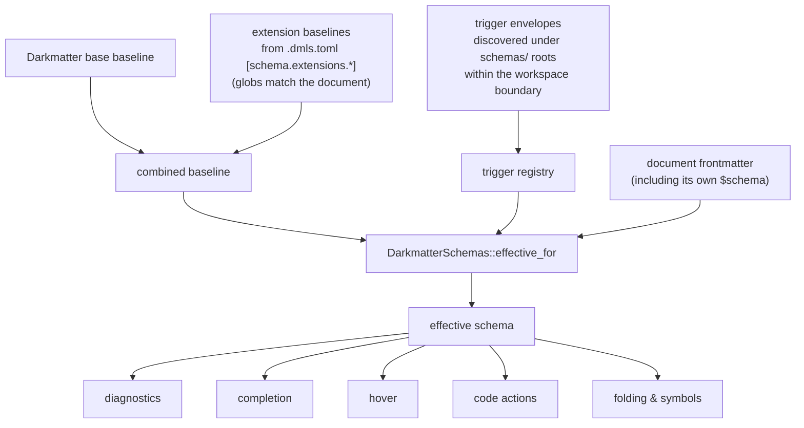

# DMLS Schema Support

## Overview

The **Darkmatter Language Server** (DMLS) is the piece of the Darkmatter package area that makes [Simplified Schemas](./authoring-schemas.md) come alive inside your editor. It speaks standard **LSP 3.17 over stdio**, so it works in any conforming editor, and it is verified against the four editors we care most about: VS Code, Zed, Neovim, and Helix.

Two principles govern everything in this document:

1. **The library is the only authority.** DMLS never re-implements schema parsing, selection, validation, or completion logic. It calls the same `darkmatter` library types that `md compose` and `md schema validate` call, so what your editor tells you and what the CLI enforces can never drift apart.
2. **Editor analysis is passive.** Every schema request — diagnostics, completion, hover, navigation — runs on source text plus already-captured workspace context. Nothing executes a shell command, fetches a remote URL, or mutates a file. A schema may *declare* `file(eager)` or `expression` values, but DMLS only ever *explains* them; it never runs them.

DMLS layers schema intelligence onto two very different authoring experiences:

- **consuming documents** — a Markdown file whose frontmatter is validated, completed, and explained against its effective schema
- **authoring schemas** — editing the `$schema` property inline, an external `kind: schema` file, or a trigger envelope, where the schema grammar itself becomes the language being edited

Both are covered below, and the [coverage matrix](#coverage-matrix) gives the honest per-feature scorecard for each.

## How DMLS Assembles the Effective Schema

Before any schema intelligence can fire, DMLS must decide *which* schema applies. It reproduces the compose precedence described in [Authoring Schemas](./authoring-schemas.md#schema-layering) — nothing schema-related is editor-specific:



A few details worth knowing:

- the base baseline always applies, so a document with no `$schema` of its own still gets schema-driven completion and hover for keys like `title` or `style`
- extension baselines whose activation globs match the document contribute their shapes even when the document declares no `$schema` — this is how a Claudine prompt gets `provider`/`model` completions "for free"
- the effective schema (and every file it depends on — the referenced `$schema` file, its imports, its examples, and each matched extension baseline) is content-hash cached per document; editing any dependency invalidates the bundle immediately
- when a schema fails to load, DMLS keeps the **last good** bundle serving completion and hover rather than flapping to nothing mid-keystroke

> **Note:** the implemented trigger envelope kind is `kind: trigger-schema`, discovered by scanning `schemas/` directories within the document's workspace boundary (the nearest workspace folder, narrowed by the Git repository root when one applies). The authoring documentation describes the agreed target contract under the canonical spelling `kind: schema-trigger`; the naming migration is still in flight, so match the spelling above when targeting today's DMLS. A malformed envelope is reported as a file-level `dm.schema.prepare` diagnostic on the envelope file itself — never on the documents it would have served — and the last-good registry keeps serving consumers while it is broken.

DMLS does **not** read the `SCHEMA_DIR` environment variable; that is a CLI/library-side discovery mechanism. In the editor, additional always-on baselines arrive through [configuration](#extensibility-through-configuration) instead.

## Implemented LSP Features

Only capabilities that are actually implemented are ever advertised — the capability advertisement grows feature by feature and never claims a surface the server cannot answer. This section walks through each implemented feature as it interacts with schemas.

### Diagnostics

Diagnostics are **push-based** (`textDocument/publishDiagnostics`): DMLS computes them on every change (debounced, default 200 ms) and publishes them, including an empty batch when a document becomes clean. Schema diagnostics arrive with precise, source-spanned ranges — value problems range the value, `unknown_key` ranges the offending key, and `missing_required` ranges the parent mapping so it is always visible.

| Code                                                           | Meaning                                                                                               |
|----------------------------------------------------------------|-------------------------------------------------------------------------------------------------------|
| `dm.frontmatter.yaml_parse`                                    | the frontmatter YAML could not be parsed                                                              |
| `dm.schema.invalid_schema_shape`                               | the `$schema` value is not a valid schema shape (also covers a rejected standalone outer declaration) |
| `dm.schema.prepare`                                            | the schema could not be resolved, merged, or compiled                                                 |
| `dm.schema.type_mismatch`                                      | a value did not match its declared type                                                               |
| `dm.schema.constraint`                                         | a non-type constraint failed (range, length, pattern, enum, …)                                        |
| `dm.schema.missing_required`                                   | a required key is absent — **strict mode only**                                                       |
| `dm.schema.unknown_key`                                        | a key the schema does not declare is present                                                          |
| `dm.schema.deprecated_key`                                     | a deprecated key is present                                                                           |
| `dm.schema.invalid_file_reference`                             | a `file(...)`-typed value failed to parse, resolve, or match a file                                   |
| `dm.schema.invalid_suggestion`                                 | a `suggest(...)` candidate is invalid metadata for its target schema                                  |
| `dm.schema.document_malformed`                                 | a recognized standalone schema envelope is malformed                                                  |
| `dm.style.unknown_key` / `dm.style.deprecated_key`             | `style:` surface problems                                                                             |
| `dm.expression.malformed` / `dm.expression.unknown_identifier` | expression-typed frontmatter values that do not parse or name something resolvable                    |

The severity policy follows one guiding principle: *diagnose edit-time problems, not compose-time ones*. A document is a template; values arrive at compose time via CLI `--set`, seeds, `$(...)` expansion, or an interactive prompt. So:

- a `required` key that is absent is **not** flagged by default — it is expected to be injected at launch (`schema.strict` re-enables it)
- a value holding a deferred `{{ … }}` or `$(...)` construct is not type-checked; its type is unknowable until the value is real
- `unknown_key` is a warning by default and an error in strict mode

Standalone schema documents **own their problems**: when a `kind: schema` file is open in the editor, its `invalid_suggestion` warnings and `document_malformed` errors are published on that file, never duplicated onto the Markdown documents consuming it.

### Completion

Completion is a merged provider chain (substrate → wiki → frontmatter → DSL), so a schema-driven candidate and a Markdown candidate can coexist in one response. Within frontmatter, the effective schema drives:

- **schema keys** — not-yet-present property keys at any nesting depth an inline object declares, with required keys marked
- **enum values** — the declared choices for an `enum(...)` property
- **boolish scaffolds** — the accepted spellings for `boolish` properties
- **file paths** — workspace-relative path completion inside `file(...)` values
- **`style.*` keys** — the style descriptor catalog when the cursor is inside the opaque `style` object
- **`suggest(...)` candidates** — advisory value suggestions (including block-sequence items) that aid discovery but never validate
- **literal-discriminated union arms** — when a union's arms are discriminated by a `literal(...)` value, selecting the authored discriminant narrows key completion to that arm's shape
- **imported types** — named types offered as `Name@this` when the passive schema namespace declares them
- **`ctx.*` variables** — the generated context keys, fully qualified

While *authoring a schema* — inside an inline `$schema` value, a `type-definition`-typed value, or a standalone schema file — the same request flips to grammar completion, driven by the shared descriptor catalogs:

- type keywords from the [`SimplifiedSchema` Types](./schema-types.md) catalog (each offered with its `[]` array form)
- definition scaffolds: `{}`, `[]`, and `Name@./types.yaml`
- constraint keywords from the [`SimplifiedSchema` Constraints](./schema-constraints.md) catalog, **filtered by the subject type's accepted-constraint list** — `min(` is not offered under a `boolean`, and the postfix `[](...)` list offers only the array-level constraint surface
- `$schema` file references (`./schema.yaml` scaffolds plus workspace paths)

A deliberate gap: a constraint's *arguments* (a regex body, a glob, an enum member) are author-supplied values — the catalog has nothing truthful to offer there, so completion is silent rather than guessing.

All items are **eager and self-contained**: every item carries an explicit `textEdit` replacing the exact token under the cursor, with plain insert text (no snippets) and no `completionItem/resolve` round-trip. This is deliberately Zed-safe. Trigger characters are `/` (paths), `#` (anchors), `(` (directive options and function arguments), and `.` (`ctx.` members inside an open `{{ }}`).

### Hover

Hovering a schema-declared frontmatter property renders its full declaration — type (including `Name@reference` for imports and `[]` array suffixes), a `literal(...)` pinned value, `Required`, eager timing, enum values, default, and the `->` prose description. The formatting rule is bounded by what LSP hover Markdown can express (color is a theme decision, never ours): **inline-code box = the subject, bold = its type, italic = its enum/default values, plain prose = the description**.

Hover also understands schema *authoring*:

- hovering a property definition inside a `$schema` value or a standalone schema file renders a `type-definition` block — what the definition declares, whether it is required, its eager timing
- hovering an `expression`-typed value gets the shared expression hover (parsed form plus the `ctx.*`/function catalog)
- hovering a declared-but-unset key inside a body `{{ … }}` interpolation falls back to the schema property's description — a set frontmatter value always wins

### Navigation

- **go-to-definition** on a `$schema` file reference or a `file(...)` value jumps to the target file; both also render as clickable **document links**
- an interpolation variable in the body jumps to the frontmatter key that defines it, and a key the effective schema declares counts as a known identifier even when the document has not set it
- **references** answers "who transcludes this file" across the workspace graph

Document highlights currently cover headings and wiki links; schema keys are not yet highlightable (see [below](#not-implemented-yet)).

### Structure

- **folding** covers the frontmatter block and its nested mappings, alongside headings, code fences, and directive blocks
- **document symbols** can surface top-level frontmatter keys in the outline — gated on the `[symbols] frontmatter = true` configuration, off by default so the outline stays prose-first

### Quick Fixes and Formatting

One schema-specific code action ships today: **add a missing required key**, offered directly on a `dm.schema.missing_required` diagnostic (and therefore only in strict mode). Other code actions — create the missing file, migrate a deprecated `style:` key, close an unclosed `::block`, wrap a malformed interpolation in a literal — are schema-adjacent rather than schema-driven. Whole-document **formatting** is byte-equivalent to the `md clean` cleanup sequence; it is a document-level operation, not a schema one.

## Not Implemented (yet)

The honest list. None of these are advertised to the editor, so no client will ever ask for them and receive a lie:

| Surface                                                    | Status                                                                                                                                                                                                        |
|------------------------------------------------------------|---------------------------------------------------------------------------------------------------------------------------------------------------------------------------------------------------------------|
| **Inlay hints** (`textDocument/inlayHint`)                 | not implemented — the `[hints]` config section is *parsed* today so configs stay valid, but no provider answers it yet                                                                                        |
| **Code lenses** (`textDocument/codeLens`)                  | not implemented — no compose-preview or reference-count lenses                                                                                                                                                |
| **Signature help** (`textDocument/signatureHelp`)          | not implemented — function signatures surface through completion `detail` and hover instead                                                                                                                   |
| **Semantic tokens for frontmatter and schemas**            | the frozen V1 legend covers body constructs only (interpolations, directives, wiki links); expression tokens are reserved in the legend for a future phase, and no frontmatter/schema token family exists yet |
| **Rename of schema keys**                                  | rename today covers headings and files only; renaming a frontmatter key (and its `{{ … }}` usages) is not offered                                                                                             |
| **References / highlights on schema keys**                 | references answer transclusion questions; there is no "every usage of this frontmatter key" query yet                                                                                                         |
| **Pull diagnostics** (`textDocument/diagnostic`)           | push-only; editors that prefer pull get the same diagnostics via `publishDiagnostics`                                                                                                                         |
| **Commands** (`workspace/executeCommand`)                  | no server commands (compose preview, cache invalidation, …) yet                                                                                                                                               |
| **Selection ranges / linked editing / on-type formatting** | client capability gates are tracked in the server's client profile, but no handlers are routed                                                                                                                |
| **Constraint-argument completion**                         | deliberately absent (see [Completion](#completion))                                                                                                                                                           |
| **Remote URI `$schema` references**                        | the grammar reserves them, but remote resolution is not implemented anywhere in Darkmatter yet                                                                                                                |
| **`SCHEMA_DIR` discovery**                                 | not read by DMLS; editor-side baselines arrive via `.dmls.toml`                                                                                                                                               |

## Coverage Matrix

The scorecard: one dimension is the LSP capability, the other is the Darkmatter schema/DSL surface it is applied to. Legend: ✅ shipped · 🟨 partial (see notes) · ❌ not yet · — does not apply.

| Schema surface                                | Diagnostics | Completion | Hover | Def. / Links | Fold. / Symbols | Sem. Tokens | Rename | Code Actions |
|-----------------------------------------------|:-----------:|:----------:|:-----:|:------------:|:---------------:|:-----------:|:------:|:------------:|
| Frontmatter keys (schema-declared)            | ✅          | ✅ ¹       | ✅    | —            | 🟨 ²            | ❌          | ❌     | ✅ ³         |
| Frontmatter values (type / constraint)        | ✅          | ✅         | ✅    | —            | —               | ❌          | ❌     | —            |
| `enum(...)` and `suggest(...)` values         | ✅ ⁴        | ✅ ⁵       | ✅    | —            | —               | ❌          | ❌     | —            |
| Union types with `literal(...)` discriminants | ✅          | ✅ ⁶       | ✅    | —            | —               | ❌          | ❌     | —            |
| Imports (`Name@file`)                         | ✅ ⁷        | ✅ ⁸       | ✅    | 🟨 ⁹         | —               | ❌          | ❌     | —            |
| Pattern dictionary keys (`<string>`, …)       | ✅          | ❌ ¹⁰      | 🟨 ¹¹ | —            | —               | ❌          | ❌     | —            |
| `file(...)` references                        | ✅          | ✅         | —     | ✅           | —               | ❌          | ❌     | —            |
| `$schema` inline authoring                    | ✅          | ✅ ¹²      | ✅    | —            | —               | ❌          | ❌     | —            |
| `$schema` file reference                      | ✅          | 🟨 ¹³      | —     | ✅           | —               | ❌          | ❌     | —            |
| Standalone schema documents (`kind: schema`)  | ✅ ¹⁴       | ✅         | ✅    | —            | —               | ❌          | ❌     | —            |
| `expression`-typed values                     | ✅          | ✅         | ✅    | —            | —               | ❌ ¹⁵       | ❌     | —            |
| `style.*` keys                                | ✅          | ✅         | ✅    | —            | —               | ❌          | ❌     | ✅           |
| Trigger envelopes (`kind: trigger-schema`)    | ✅ ¹⁶       | —          | —     | —            | —               | ❌          | ❌     | —            |
| `ctx.*` generated keys                        | —           | ✅         | ✅    | —            | —               | ❌ ¹⁵       | ❌     | —            |

1. Required keys marked; nested keys offered per the enclosing inline-object shape.
2. Nested-mapping folding ships; frontmatter document symbols are config-gated (`[symbols] frontmatter = true`).
3. Add-missing-key, on the `missing_required` diagnostic (strict mode only).
4. Constraint violations for enums; `invalid_suggestion` linting for advisory candidates.
5. Enum choices rigid; `suggest(...)` candidates advisory — they never validate.
6. The authored `literal(...)` discriminant selects one union arm; key completion narrows to it.
7. Missing/cyclic imports surface through `dm.schema.prepare` with source origins.
8. Declared names offered as `Name@this` while authoring.
9. Whole-file `$schema` references jump and link; a `Name@file` import inside an inline schema does not yet.
10. Pattern keys validate but are not offered as completions — an inline object's keys are the author's own.
11. Authored pattern-key definitions hover in schema documents; consumers hover the value definition only where the shape resolves it.
12. Type keywords, array forms, scaffolds, and subject-filtered constraint keywords; constraint *arguments* are deliberately not completed.
13. Path completions and scaffolds for the reference itself.
14. The schema file owns its problems (`invalid_suggestion`, `document_malformed`); they never duplicate onto consumers.
15. Reserved in the semantic-token legend for a future expression phase; not emitted in V1.
16. The matched schema merges into the effective schema; a malformed envelope is diagnosed on the envelope file.

The short version: **the read/analyze half of the LSP surface (diagnostics, completion, hover, navigation, structure) is broadly shipped for schemas, while the styling-and-refactor half (semantic tokens, rename, references-on-keys, lenses, hints) is still ahead of us.**

## Editor Support

All four primary editors get the complete schema feature set described above; the differences between them are in how a few capabilities are *delivered*, driven by what each client advertises. Position-encoding negotiation (UTF-8/UTF-16), per-client gates for folding, semantic tokens, and file operations, and hover Markdown fidelity are all handled by a capability profile computed once at `initialize`. The per-editor matrix and setup guides live in the DMLS docs: [`dmls/docs/features.md`](../../../dmls/docs/features.md).

## Extensibility Through Configuration

DMLS is configured through a **`.dmls.toml`** file at the workspace root (which also doubles as the editor root marker). Configuration has three sources, merged in this precedence:

1. the editor's `workspace/configuration` / `didChangeConfiguration` overlay (highest)
2. `.dmls.toml` at the workspace root
3. built-in defaults

Every key is parsed even where its consumer lands in a later phase, so a config written today stays valid as features arrive. Configuration is hot-reloadable: a `didChangeConfiguration` re-reads the file layer, re-merges, and re-publishes diagnostics for all open documents without a restart. A malformed overlay is logged and discarded — bad editor settings can never wedge the server; the last good config keeps serving.

The schema-relevant sections:

```toml
[schema]
# Strict mode: unknown frontmatter keys become errors and missing
# required keys are diagnosed at edit time.
strict = false

# Baseline schema extensions. Pure data: a schema file plus activation
# globs. This is the entire Claudine integration — there is zero
# Claudine-specific code in the server.
[schema.extensions.claudine]
path = "darkmatter/docs/schemas/claudine.yaml"
globs = [".claude/**", "prompts/**"]

[style]
# Strict mode for the style: surface (unknown/deprecated keys).
strict = false

[symbols]
# Surface top-level frontmatter keys in the document outline.
frontmatter = false

[semantic_tokens]
# Master switch for semantic-token emission (body families today).
enable = true

[diagnostics]
# Debounce (ms) for immediate-tier diagnostics after the last edit.
debounce_ms = 200

[code_actions.categories]
# Per-category enable/disable overrides; absent categories are enabled.
"add-missing-key" = true
```

The `[schema.extensions.*]` table is the workhorse. Each entry is a **pure-data baseline extension**: point `path` at a SimplifiedSchema YAML file (relative paths resolve against the workspace root) and list `globs` that select the documents it applies to. The extension's shape merges over the base baseline with compose precedence, and its keys participate in completion and hover exactly like built-in ones — even for documents that declare no `$schema` of their own. Editing an extension's file (or any type it imports) content-hash-invalidates every bundle that matched it, so the change is visible on the next keystroke.

This is how any tool built on Darkmatter — Claudine today, whatever comes next — teaches DMLS about its document vocabulary without the server ever learning a tool-specific code path.

## Extensibility Programmatically

DMLS deliberately ships **no plugin API** in v1: no dynamic provider registration, no custom completion sources, no server-side hooks. That is a design decision, not an omission — the editor surface stays a *projection* of the library, and the extension seam lives one layer down where it benefits every consumer at once.

The programmatic seam is the **`darkmatter` library itself** (`darkmatter::markdown::schemas`). Everything DMLS knows about schemas, it learned from these public types — so a host application that uses the same types gets identical semantics for free:

- **`DarkmatterSchemas`** is the schema engine builder. Stack your own baselines the same way DMLS does:
    - `with_baseline(...)` / `with_baseline_from_file(...)` / `with_baseline_json_schema(...)` — add SimplifiedSchema or raw JSON Schema baselines
    - `with_trigger_discovery(...)` / `with_trigger_registry(...)` — activate trigger matching
    - `effective_for(&markdown)` — resolve the layered effective schema for a document, exactly the call DMLS's overlay makes
    - `validate(...)`, `validate_for_phase(...)`, `detect(...)` — validation and schema detection/inference

- **`EffectiveSchema`** carries the assembled result: `validate_with_positions(...)` for source-spanned problems, `dependencies()` for the files the schema depends on (what DMLS content-hash watches), and `advisories()` for non-fatal findings.
- **`parse_standalone_schema_document`** is the passive classifier for standalone schema files — the same authority that decides when your open buffer is a `kind: schema` document deserving authoring intelligence.
- **The shared catalogs** — `schema_type_descriptors()`, `schema_constraint_descriptors()`, `suggestions_for_path()`, `select_literal_discriminant_arm()`, and the tolerant cursor parsers `locate_schema_declaration_cursor(...)` / `locate_type_definition_cursor(...)` — are public. DMLS completion and library validation call the *same* arm selectors and descriptor iterators, which is why editor completions cannot drift from CLI validation. Any tool that wants DMLS-grade schema intelligence (a documentation generator, a linter, a custom editor) consumes these and inherits every grammar rule by reference.

The pattern in practice: a host application (Claudine is the worked example) authors its vocabulary as schema *data*, injects it programmatically through the `DarkmatterSchemas` builder for its own runtime, and — for the editor experience — ships the same YAML file referenced from a `[schema.extensions.*]` entry. One schema artifact, zero server code, identical behavior everywhere.

## See Also

- [Authoring Schemas](./authoring-schemas.md) — the SimplifiedSchema grammar, layering rules, and trigger design
- [SimplifiedSchema Types](./schema-types.md) and [Constraints](./schema-constraints.md) — the catalogs behind completion and hover
- [Schema Validation](./schema-validation.md) and [Schema Discovery](./schema-discovery.md) — the CLI/library side of the same authority
- [Schema Triggers](./schema-targeting.md) — the trigger matching model and its implementation status
- [`dmls/docs/features.md`](../../../dmls/docs/features.md), [`autocomplete.md`](../../../dmls/docs/autocomplete.md), [`hover.md`](../../../dmls/docs/hover.md), [`diagnostics.md`](../../../dmls/docs/diagnostics.md) — the DMLS crate's own capability documentation and per-editor setup guides
