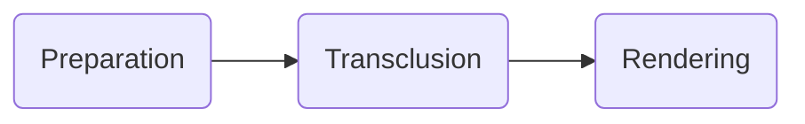

# Testing Composition

This is a basic test of _composition_ through the Markdown pipeline we use in Darkmatter. The overall flow is:

```mermaid
flowchart LR
    S1(Preparation)
    S2(Transclusion)
    S3(Rendering)

    S1 --> S2 --> S3
```

::file ./one.md

::file ./two.md

