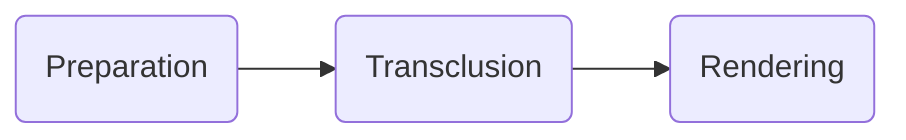

# Testing Composition

This is a basic test of _composition_ through the Markdown pipeline we use in Darkmatter. The overall flow is:

::file ./preparation.md

::file ./what-is-transclusion.md exclude="## Secret Section"

## Conditional Disclosure

::file ./disclosure-cc.md when="env.AGENT == 'claude'"
::file ./disclosure-oc.md when="env.AGENT == 'opencode'"
::file ./disclosure.md when="!env.AGENT"

## Some Other Things

::toc-linking ./other.md
