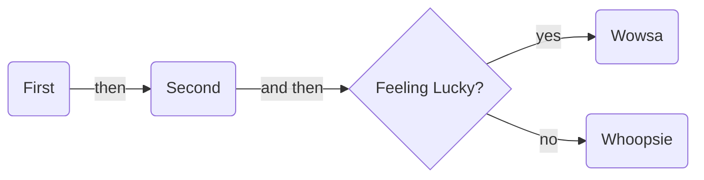

# Rendering Mermaid and Graphs Diagrams

Darkmatter provides support for rendering both [Mermaid](https://mermaid.js.org/intro/) diagrams and [Object Graphs]() using **dot** syntax.

## Mermaid

Mermaid provides lots of different diagrams but the OG is the **flowchart**:

This support includes being able to ornament the diagrams like adding a **title** (_seen above_).
