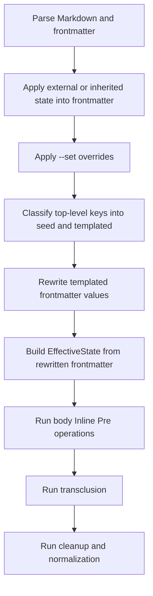

# Frontmatter Interpolation Technical Design

This document defines the technical design for the feature described in `darkmatter/features/2026-03-30-fm-interpolation/spec.md`.

It is written against the current `darkmatter` compose architecture, centered on:

- `darkmatter/lib/src/markdown/compose/mod.rs`
- `darkmatter/lib/src/markdown/compose/types.rs`
- `darkmatter/lib/src/markdown/compose/state.rs`
- `darkmatter/lib/src/markdown/compose/frontmatter_interpolation.rs`
- `darkmatter/lib/src/markdown/compose/interpolation/`
- `darkmatter/lib/src/markdown/frontmatter.rs`

## Overview

Darkmatter already supports interpolation in the Markdown body. This feature adds an earlier interpolation pass for frontmatter values so computed metadata can participate in later compose stages.

The key behavior is:

1. Initialize frontmatter with inherited and external state.
2. Apply explicit `--set` overrides.
3. Resolve `{{ ... }}` expressions inside frontmatter values using only non-templated frontmatter values plus `ctx.*` and `env.*`.
4. Build the final effective state from the rewritten frontmatter.
5. Run normal body interpolation and the rest of the compose pipeline.

That makes frontmatter interpolation a state-shaping operation, not a rendering convenience.

## Goals

1. Resolve templated frontmatter values before the final effective state is built.
2. Reuse the existing interpolation grammar, parser, evaluator, and warning model.
3. Preserve deterministic behavior across transclusion and child-document composition.
4. Keep the first version simple by disallowing chained interpolation between templated top-level frontmatter keys.
5. Make the behavior visible in compose operations, reports, docs, and tests.

## Non-Goals

1. Interpolating frontmatter keys.
2. Supporting source-order-dependent chaining such as `plan: "{{spec}}.txt"` when `spec` is also templated.
3. Producing typed values from interpolated strings. Rewritten leaves remain strings.
4. Introducing a second expression language or a frontmatter-specific evaluator.

## Functional Contract

### Pipeline placement

`FrontmatterInterpolation` is the first Inline Pre operation, but it executes during compose state preparation rather than through the generic body-operation dispatcher.

It runs:

1. After parent or external state has been merged into the document frontmatter.
2. After `--set` overrides have been applied.
3. Before `EffectiveStateBuilder` constructs the lookup state used by later stages.

### Seed-only semantics

Frontmatter interpolation is intentionally single-pass and top-level-key scoped.

Each top-level frontmatter entry is classified as one of:

- Seed value: the full value tree contains no interpolation expressions.
- Templated value: any nested leaf contains at least one interpolation expression.

Only seed values participate in lookup for the frontmatter interpolation pass.

Example:

```yaml
---
base: /tmp/project
author: Alice
spec: "{{base}}/spec.md"
meta:
  owner: Alice
  docs: "{{base}}/docs"
---
```

Classification:

- `base` is a seed value.
- `author` is a seed value.
- `spec` is templated.
- `meta` is templated because one nested string contains `{{ ... }}`.

This avoids ambiguous chaining rules and keeps the pass deterministic.

### Lookup scope

Frontmatter interpolation resolves against three namespaces:

| Namespace | Source | Example |
| --- | --- | --- |
| bare key | Seed frontmatter values | `{{ base }}` |
| `ctx.` | Runtime compose context | `{{ ctx.today }}` |
| `env.` | Captured environment variables | `{{ env.HOME }}` |

Nested access into seed values is supported:

```yaml
---
meta:
  owner:
    name: Alice
path: "{{meta.owner.name}}"
---
```

### Value-shape behavior

Interpolation walks the value tree for each templated top-level key.

| Value kind | Behavior |
| --- | --- |
| `String` | Rewrite `{{ ... }}` expressions |
| `Array` | Recurse into each element |
| `Object` | Recurse into each field value |
| `Number` / `Bool` / `Null` | Preserve unchanged |

Only string leaves are rewritten. The surrounding JSON/YAML structure is preserved.

### Missing variables and failures

Frontmatter interpolation uses the same evaluator semantics as body interpolation.

- Missing values resolve to the empty string.
- Fallbacks work: `{{ color | "unknown" }}`.
- Ternaries work: `{{ enabled ? "yes" : "no" }}`.
- Helper functions work: `{{ length(items) }}`.

Failure policy:

- If `fail_fast` is enabled, parse or evaluation failures abort compose.
- Otherwise, the original string leaf is preserved and a warning is emitted.

## State and Data Flow



### State precedence

The state visible to frontmatter interpolation must be prepared in this order:

1. Parsed document frontmatter.
2. External or inherited state applied into the document frontmatter using the same deep-merge semantics expected elsewhere in compose.
3. `--set` overrides, which win unconditionally.
4. Frontmatter interpolation, which mutates the resulting frontmatter in place.

Important consequence: nested inherited or external state must be visible to the frontmatter interpolation pass, not only to the later effective-state builder.

## Architecture

### Module responsibilities

The feature lives across three layers.

#### 1. Compose pipeline integration

`darkmatter/lib/src/markdown/compose/mod.rs`

Responsibilities:

- perform frontmatter preparation before effective-state construction
- invoke frontmatter interpolation when enabled
- collect warnings and replacement counts
- record performance metrics

#### 2. Frontmatter interpolation engine

`darkmatter/lib/src/markdown/compose/frontmatter_interpolation.rs`

Responsibilities:

- detect whether a top-level key is seed or templated
- construct the seed-only lookup state
- recursively rewrite templated value trees
- return a stage-specific report

#### 3. Shared interpolation core

`darkmatter/lib/src/markdown/compose/interpolation/`

Responsibilities:

- scan `{{ ... }}` spans
- parse expressions
- evaluate them against an abstract lookup provider
- rewrite strings in either Markdown-aware or plain-text mode

The frontmatter pass should reuse this layer rather than implementing a second parser or evaluator.

## Detailed Design

### Compose operation model

The feature is a first-class compose operation:

- `ComposeOperation::FrontmatterInterpolation`
- phase: `ComposePhase::InlinePre`
- report counter: `ComposeReport::frontmatter_interpolations_applied`
- perf stage: `ComposeStage::FrontmatterInterpolation`

It must appear first in `ComposeOperation::default_order()`.

### Frontmatter preparation

The frontmatter preparation path must produce the same visible state that later compose stages expect.

Required behavior:

1. Merge external state into frontmatter before interpolation.
2. Use deep merge semantics for nested objects.
3. Preserve document values over inherited or external defaults unless the caller explicitly uses `--set`.
4. Apply `--set` after state merge and before frontmatter interpolation.

The implementation should not maintain a shallow, frontmatter-only merge path that diverges from the effective-state merge model. That split is error-prone and causes nested inherited values to disappear during frontmatter interpolation.

### Seed state

The lookup used during frontmatter interpolation is intentionally smaller than the final `EffectiveState`.

Recommended internal model:

```rust
pub(crate) struct FrontmatterSeedState {
    data: HashMap<String, serde_json::Value>,
    context: ComposeContext,
}
```

Behavior:

- `data` contains only seed top-level entries.
- dotted paths traverse nested objects inside `data`.
- `ctx.*` resolves from `ComposeContext`.
- `env.*` resolves from `ComposeContext::env()`.

This state is purpose-built for the frontmatter pass and should not expose templated peers.

### Lookup abstraction

The evaluator should depend on a small lookup trait rather than on `EffectiveState` directly.

Recommended internal trait:

```rust
pub trait InterpolationLookup {
    fn get(&self, path: &str) -> Option<serde_json::Value>;
    fn get_string(&self, path: &str) -> String;
}
```

Implementations:

- `EffectiveState`
- `FrontmatterSeedState`

That allows body interpolation and frontmatter interpolation to share parser and evaluator logic while using different sources of truth.

### String rewriting

String rewriting should be centralized in a shared helper used by both interpolation stages.

Recommended API:

```rust
pub(crate) enum ScanMode {
    MarkdownAware,
    Plain,
}

pub(crate) struct InterpolationRewrite {
    pub output: String,
    pub replacements: usize,
    pub warnings: Vec<ComposeWarning>,
}

pub(crate) fn interpolate_text<L: InterpolationLookup>(
    input: &str,
    evaluator: &Evaluator<L>,
    scan_mode: ScanMode,
    fail_fast: bool,
    warning_stage: &'static str,
) -> Result<InterpolationRewrite, MarkdownError>;
```

Mode behavior:

- `MarkdownAware` skips inline code spans and fenced code blocks. This is used by body interpolation.
- `Plain` scans the whole string. This is used by frontmatter interpolation.

### Detection and rewrite algorithm

Top-level classification uses a recursive detector:

```rust
fn contains_interpolation(value: &serde_json::Value) -> bool
```

Rules:

1. `String`: true when plain scanning finds one or more interpolation spans.
2. `Array`: true if any child matches.
3. `Object`: true if any field value matches.
4. other scalars: false.

The rewrite algorithm is:

1. Snapshot the current top-level frontmatter map.
2. Partition keys into `seed_map` and `templated_keys`.
3. If no templated keys exist, return a zeroed report.
4. Build `FrontmatterSeedState` from `seed_map` and the compose context.
5. For each templated top-level key, recursively rewrite the value tree.
6. Replace the mutated value back into `Frontmatter`.
7. Accumulate replacement counts and warnings.

Recursive rewrite helper shape:

```rust
fn rewrite_value<L: InterpolationLookup>(
    value: &serde_json::Value,
    evaluator: &Evaluator<L>,
    fail_fast: bool,
) -> Result<(serde_json::Value, usize, Vec<ComposeWarning>), MarkdownError>
```

## Compose-Time Effects

After the frontmatter pass completes, the rewritten frontmatter becomes the source for:

1. body interpolation
2. page-block conditions
3. frontmatter-driven transclusions such as `prologue` and `epilogue`
4. child-document inherited state during recursive transclusion

This is why the pass must happen before the final effective state is built.

### Child-document composition

No special child-only mechanism is needed if inherited state is routed through the same frontmatter preparation path.

Expected behavior:

1. Parent effective state is exported as child external state.
2. Child frontmatter is initialized from that external state.
3. Child frontmatter interpolation runs using child seed values plus inherited state that survived the deep merge.
4. Child effective state is then built from the rewritten child frontmatter.

### Frontmatter transclusion

No special parser branch is needed for `prologue` and `epilogue`.

If frontmatter interpolation mutates the stored frontmatter before transclusion parsing, existing frontmatter transclusion logic can consume the resolved string values directly.

## CLI and Context Capture Requirements

The CLI must capture runtime context from the full document, not only from the body content after frontmatter has been stripped.

Required behavior:

1. Demand-driven `ctx.*` scanning must include frontmatter values.
2. A document that references `ctx.repo_root` only from frontmatter must still capture the repo context group.
3. The library and CLI must share the same document-level context-capture semantics.

The preferred approach is a document-aware capture entry point such as:

```rust
ComposeContext::capture_for_document(base_dir, &markdown)
```

That keeps the optimization while ensuring frontmatter-only `ctx.*` expressions are not missed.

## Diagnostics and Reporting

### Warning shape

Frontmatter warnings should use a distinct stage label:

```text
frontmatter-interpolation
```

Messages should include the top-level key when practical, for example:

```text
frontmatter-interpolation: key 'spec': failed to parse 'base |': unexpected token
```

### Compose report behavior

`ComposeReport` must track frontmatter interpolation separately from body interpolation.

Required behavior:

- `has_changes()` returns true when frontmatter interpolation changed anything.
- `summary()` includes a dedicated `N frontmatter interpolation(s)` entry.
- `merge()` adds frontmatter interpolation counts across nested reports.

### Performance reporting

Perf instrumentation should record the stage independently from body interpolation so regressions are visible in compose profiling.

## Testing Plan

### Unit tests

Add or maintain focused tests for:

1. seed-versus-templated classification
2. nested object and array rewriting
3. dotted lookups into nested seed values
4. missing-variable behavior
5. fail-fast versus warning behavior
6. chained templated-key limitation

### Compose integration tests

Add or maintain integration coverage for:

1. the base spec example
2. `--set`-driven frontmatter interpolation
3. nested external state participating in frontmatter interpolation
4. child frontmatter deriving values from parent state
5. interpolated `prologue` and `epilogue`
6. page blocks reading interpolated frontmatter values
7. disabling `FrontmatterInterpolation`
8. report summary and merge behavior

### CLI integration tests

Add or maintain CLI-level tests for:

1. frontmatter-only `ctx.*` references
2. frontmatter interpolation with `--state`
3. frontmatter interpolation with `--set`

These tests are necessary because the CLI has its own context-capture path and can drift from the library behavior.

## Limitations and Tradeoffs

### Supported limitation

The design intentionally does not support chained interpolation between templated top-level keys:

```yaml
---
base: /root
spec: "{{base}}/spec.md"
plan: "{{spec}}.plan.md"
---
```

In this case:

- `spec` is templated and therefore excluded from the seed state.
- `plan` cannot observe the resolved value of `spec` during the same pass.
- `{{spec}}` behaves as missing input and resolves to the empty string unless a fallback is provided.

This is a deliberate tradeoff to keep the pass single-shot, deterministic, and easy to reason about.

### Future extension path

If chained references are ever needed, they should be introduced as a separate feature with explicit semantics, such as:

- topological dependency ordering
- bounded multi-pass evaluation
- cycle detection and diagnostics

That should not be added implicitly to this design.

## Implementation Notes

The implementation is correct when all of the following are true:

1. frontmatter interpolation runs before final effective-state construction
2. nested inherited or external state is visible to the pass
3. frontmatter-only `ctx.*` references work through the CLI
4. body interpolation observes the rewritten frontmatter values
5. transclusion and page-block stages consume the same rewritten values

Those points are the acceptance bar for this design, not optional polish.
