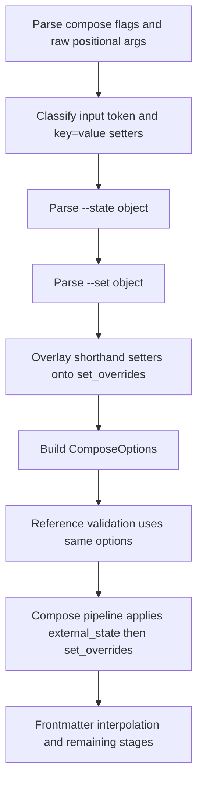

# Compose Setter Shorthand Technical Design

This document defines the technical design for the feature described in `darkmatter/features/2026-04-08-setting-props/spec.md`.

It is written against the current `darkmatter` compose architecture, centered on:

- `darkmatter/cli/src/args.rs`
- `darkmatter/cli/src/commands.rs`
- `darkmatter/cli/tests/cli.rs`
- `darkmatter/lib/src/markdown/compose/types.rs`
- `darkmatter/lib/src/markdown/compose/mod.rs`
- `darkmatter/lib/src/markdown/reference/graph.rs`
- `darkmatter/docs/cli/compose.md`

## Overview

`md compose` already supports two frontmatter seed mechanisms:

- `--state <object>` for default-fill semantics
- `--set <object>` for unconditional overrides

The missing piece is an ergonomic shorthand for the common case where the caller only wants to set one or two top-level properties. This feature adds positional `key=value` arguments to `md compose` and lowers them into the existing `set_overrides` path used by `--set`.

Example:

```bash
md compose feature.md iteration=1 draft=false name=Alice
```

This is CLI sugar, not a new compose-library concept. The library already knows how to apply override values before frontmatter interpolation, reference validation, and the rest of the compose pipeline. The design therefore keeps the change concentrated in CLI argument parsing and option construction.

## Goals

1. Add a concise `key=value` shorthand for top-level frontmatter overrides on `md compose`.
2. Preserve current compose semantics by translating shorthand setters into `ComposeOptions::set_overrides`.
3. Make shorthand setters available during reference validation, not only during final composition.
4. Support typed right-hand-side values without forcing callers to wrap everything in a JSON object.
5. Keep precedence deterministic when `--state`, `--set`, and shorthand setters are combined.

## Non-Goals

1. Changing library-level compose APIs or adding a new state category beyond existing `external_state` and `set_overrides`.
2. Introducing nested path syntax such as `meta.author=Alice`.
3. Changing `--state` semantics from default-fill to overwrite.
4. Replacing `--set`; the shorthand is an additional CLI entry point, not a deprecation.
5. Supporting arbitrary filenames that look exactly like `key=value` without any disambiguation convention.

## Functional Contract

### Supported syntax

The compose command accepts zero or more setter tokens with this shape:

```text
KEY=VALUE
```

Examples:

```bash
md compose doc.md iteration=1
md compose doc.md draft=false name=Alice
cat doc.md | md compose iteration=1
md compose - title="Sprint Plan"
```

Rules:

- `KEY` is a top-level frontmatter property name.
- `VALUE` may be empty. `foo=` sets `foo` to the empty string.
- Multiple setter tokens are allowed.
- If the same key appears more than once, the last shorthand setter wins.

### Key grammar

To keep shorthand unambiguous and intentionally scoped to top-level properties, `KEY` must match:

```text
[A-Za-z_][A-Za-z0-9_-]*
```

Implications:

- `iteration=1` is a shorthand setter.
- `meta.author=Alice` is not shorthand in v1.
- `./file=name.md` is not shorthand because the left side contains `/`.

This grammar is deliberate. It lets the CLI distinguish ordinary file paths from setter syntax without leaking nested-path semantics into compose.

### Value parsing

The right-hand side is parsed with this policy:

1. If `VALUE` parses as JSON5, use the parsed value.
2. Otherwise, store it as a string.

Examples:

| Token | Stored value |
| --- | --- |
| `iteration=1` | number `1` |
| `draft=true` | boolean `true` |
| `items=[1,2]` | array |
| `meta={author:"Alice"}` | object |
| `name=Alice` | string `"Alice"` |
| `empty=` | string `""` |

Using JSON5 here keeps shorthand aligned with the existing `--state` and `--set` compose inputs while still allowing bare strings.

### Precedence

The effective frontmatter state for compose is prepared in this order:

1. Parsed document frontmatter
2. `--state` defaults
3. `--set` object overrides
4. Shorthand `key=value` overrides
5. Frontmatter interpolation and later compose stages

This means shorthand setters are equivalent to a more local, more ergonomic form of `--set`, and they win if both sources define the same key.

Example:

```bash
md compose doc.md \
  --state '{"stage":"plan","iteration":0}' \
  --set '{"iteration":1}' \
  iteration=2
```

Final pre-compose value of `iteration` is `2`.

### Input resolution behavior

`md compose` currently models input as a single optional positional path. That is too rigid for this feature because shorthand setters should also work when compose reads from stdin.

V1 therefore changes compose positional parsing to:

- accept a raw list of positional tokens
- classify at most one token as the input path
- classify any token matching the setter grammar as a shorthand setter

Examples:

```bash
md compose doc.md iteration=1
md compose iteration=1 doc.md
cat doc.md | md compose iteration=1
md compose - iteration=1
```

All four forms are valid.

If more than one non-setter positional token remains after classification, the CLI returns an error.

### Filename ambiguity

A literal filename like `foo=bar.md` is ambiguous with shorthand syntax. V1 resolves that ambiguity in favor of shorthand when the token matches the setter grammar exactly.

Escape hatches:

- prefix the path with `./`, for example `./foo=bar.md`
- use an `@` file reference if appropriate
- use `-` plus stdin when piping content

This is acceptable because the ambiguous filename case is rare and the escape hatch is straightforward.

### Validation behavior

Shorthand setters must participate in the same early option construction path already used for `--state` and `--set`.

That ensures they are visible to:

- reference validation
- `when=` condition evaluation in reference scanning
- interpolated transclusion targets such as `::file docs/{{doc}}`
- the final compose pipeline

Example:

```bash
md compose template.md doc=readme.md
```

If `template.md` contains `::file docs/{{doc}}`, validation and composition both resolve against `docs/readme.md`.

## Architecture

### 1. CLI surface

`darkmatter/cli/src/args.rs`

The `Compose` subcommand should stop modeling the first positional as a typed `input: Option<PathBuf>`. Instead, it should accept a raw positional tail, for example:

- `args: Vec<OsString>` or equivalent

The rest of the compose flags remain unchanged:

- `--state`
- `--set`
- output flags
- allow flags
- perf flags

This keeps clap responsible for option parsing while leaving final positional classification to the command layer.

### Completion impact

The existing compose input positional uses `complete_markdown_files`. Switching to a raw positional vector means completion should become compose-specific:

- if the current token already contains `=`, do not suggest files
- otherwise, suggest markdown files and `-`

That preserves useful path completion without fighting the new setter syntax.

### 2. Positional classification helper

`darkmatter/cli/src/commands.rs`

Add a small helper dedicated to compose positional parsing, conceptually:

```rust
struct ParsedComposeArgs {
    input: Option<PathBuf>,
    shorthand_setters: serde_json::Map<String, serde_json::Value>,
}
```

Responsibilities:

1. Iterate raw compose positional tokens in order.
2. Detect shorthand setter tokens using the key grammar above.
3. Parse setter values with JSON5-or-string fallback.
4. Capture at most one non-setter token as `input`.
5. Error on multiple non-setter positional tokens.

Suggested helpers:

- `fn parse_compose_positionals(...) -> Result<ParsedComposeArgs>`
- `fn parse_compose_setter(token: &str) -> Option<Result<(String, Value)>>`
- `fn parse_shorthand_value(raw: &str) -> Value`

This keeps the main `run_compose` path readable and makes the shorthand behavior directly unit-testable.

### 3. Compose option construction

`darkmatter/cli/src/commands.rs`

`run_compose` already has the correct architectural shape:

- resolve input
- load markdown
- capture shared context
- parse `--state` and `--set` before validation
- run validation with cloned compose options
- run final compose

The only required change is to merge shorthand setters into the existing override map before validation begins.

Recommended construction flow:

1. Parse `--state` into `external_state` exactly as today.
2. Parse `--set` into a `serde_json::Map<String, Value>`.
3. Overlay shorthand setters onto that map.
4. If the merged override map is non-empty, call `with_set_overrides(Value::Object(map))`.

This design deliberately avoids any library change. The compose library already applies `set_overrides` in the right place:

1. after external/default state is merged into frontmatter
2. before frontmatter interpolation
3. before effective state construction

That ordering is already implemented in `darkmatter/lib/src/markdown/compose/mod.rs`.

### 4. No compose-library behavior change

No changes are required in:

- `darkmatter/lib/src/markdown/compose/types.rs`
- `darkmatter/lib/src/markdown/compose/mod.rs`
- `darkmatter/lib/src/markdown/reference/graph.rs`

The library already supports:

- `external_state` for default-fill semantics
- `set_overrides` for unconditional overwrite semantics
- early option reuse during reference validation

The shorthand feature should remain a pure CLI translation layer.

## State and Data Flow



The important point is that shorthand setters are not a post-processing step. They are folded into the same option set consumed by both validation and composition.

## Error Handling

The CLI should return explicit errors for:

1. Invalid `--state` JSON/JSON5 object
2. Invalid `--set` JSON/JSON5 object
3. More than one non-setter positional token
4. Setter token with an empty key, for example `=value`
5. Setter token whose key fails the allowed top-level key grammar

A malformed shorthand value does not error if it simply fails JSON5 parsing. In that case it becomes a string.

Examples:

- `iteration=abc` -> string `"abc"`
- `meta={author:}` -> string `"{author:}"`

This mirrors the ergonomic behavior of `md set` while still giving typed values for well-formed literals.

## Testing Plan

Add CLI coverage in `darkmatter/cli/tests/cli.rs`.

Required tests:

1. Basic shorthand setter on a file input:
   - `md compose doc.md iteration=1`
2. Basic shorthand setter with stdin and no explicit input token:
   - `cat doc.md | md compose iteration=1`
3. Multiple shorthand setters with mixed scalar types:
   - `iteration=1 draft=false name=Alice`
4. JSON5 object or array value:
   - `meta={author:"Alice"}`
5. Shorthand setter participates in validation for interpolated transclusion targets.
6. Shorthand setter wins over `--state`.
7. Shorthand setter wins over `--set`.
8. Duplicate shorthand keys are last-write-wins.
9. Empty value produces an empty string.
10. Multiple non-setter positional tokens return a user-facing error.
11. `./foo=bar.md` is treated as an input path, not a setter.

The current tests for `--state` and `--set` should remain unchanged and continue to pass.

## Documentation Updates

Update:

- `darkmatter/docs/cli/compose.md`
- `darkmatter/cli/README.md`

Documentation changes:

1. Add usage examples with shorthand setters.
2. Add a short precedence note:
   - `--state` fills defaults
   - `--set` overrides
   - shorthand setters override both
3. Document the top-level-key limitation.
4. Document the filename escape hatch for ambiguous `foo=bar.md` paths.

## Implementation Summary

This feature should be implemented entirely in the CLI layer.

The design is:

1. Parse raw compose positionals instead of a single typed `input`.
2. Classify `key=value` tokens with a restricted top-level key grammar.
3. Parse right-hand-side values as JSON5 with string fallback.
4. Merge shorthand setters into the existing `set_overrides` option.
5. Reuse the existing validation and compose flow without library changes.

That keeps the implementation small, preserves current compose semantics, and gives callers the shorthand they actually want for one-off frontmatter overrides.
