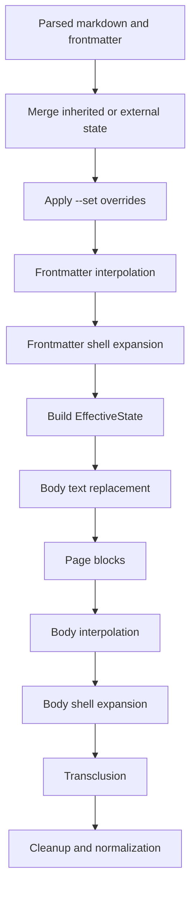

# Frontmatter Shell Expansion Technical Design

This document defines the technical design for the feature described in `darkmatter/features/2026-04-08-shell-expansion-in-fm/spec.md`.

It is written against the current `darkmatter` compose architecture, centered on:

- `darkmatter/lib/src/markdown/compose/mod.rs`
- `darkmatter/lib/src/markdown/compose/types.rs`
- `darkmatter/lib/src/markdown/compose/frontmatter_interpolation.rs`
- `darkmatter/lib/src/markdown/compose/shell_expansion/`
- `darkmatter/lib/src/markdown/frontmatter.rs`
- `darkmatter/cli/src/args.rs`
- `darkmatter/cli/src/commands.rs`

## Overview

Darkmatter already supports body-level shell expansion through `::shell ...` directives. This feature adds a distinct compose operation, `FrontmatterShellExpansion`, that executes approved shell commands stored in frontmatter string values and rewrites those values before the final effective compose state is built.

Example:

```yaml
---
files: "$(sniff repo dirty-files)"
---
```

After composition reaches the new stage, `files` becomes the command output as a string value in frontmatter. Later stages such as body interpolation, page blocks, and frontmatter transclusion then consume that rewritten value exactly as if the author had written it directly.

This is a state-shaping stage, not a rendering convenience.

## Goals

1. Add a first-class `FrontmatterShellExpansion` operation to the compose pipeline.
2. Run frontmatter shell expansion after frontmatter interpolation and before effective-state construction.
3. Reuse the existing shell approval, blacklist, whitelist, alias, executor, and timeout infrastructure as much as possible.
4. Add configurable timeout behavior for both body shell expansion and frontmatter shell expansion.
5. Keep frontmatter shell syntax intentionally narrower than body `::shell` directives.
6. Extend shell-command discovery so preflight approval includes frontmatter-based shell commands when they are discoverable without execution.

## Non-Goals

1. Supporting embedded shell substitutions inside larger strings such as `"prefix $(cmd) suffix"`.
2. Supporting frontmatter-shell-specific error-handling switches like body `--when-error` or `--stderr-contains`.
3. Re-parsing shell output as YAML, JSON, or typed frontmatter. Expanded values remain strings.
4. Allowing interpolated text to supply the executable token for a frontmatter shell command.
5. Perfect preflight discovery of commands hidden behind shell-generated transclusion paths.

## Functional Contract

### Supported Syntax

V1 supports top-level frontmatter properties whose value is a single string matching this shape:

```text
$(<command and args>)
$(<command and args>)::timeout:<seconds>
```

Examples:

```yaml
---
files: "$(sniff repo dirty-files)"
cwd: "$(pwd)::timeout:1"
---
```

Rules:

- The entire frontmatter value must be a shell expansion expression.
- The optional timeout suffix is outside the closing `)`.
- The timeout value is an integer number of seconds greater than zero.
- Nested object fields or array elements are out of scope for v1 even if they contain the same text pattern.

### Pipeline Placement

The new stage runs in Inline Pre and must execute in this order:

1. Merge external or inherited state into frontmatter.
2. Apply `--set` overrides.
3. Run `FrontmatterInterpolation`.
4. Run `FrontmatterShellExpansion`.
5. Build the final `EffectiveState`.
6. Continue with body-oriented Inline Pre operations.

That ordering is required because frontmatter interpolation may parameterize the shell command or timeout suffix, and the shell output must be visible to all later stages.

### Interpolation Interaction

Frontmatter interpolation continues to run first. That means these are valid:

```yaml
---
file: README.md
dir: "$(dirname {{file}})"
timeout_secs: 2
pwd: "$(pwd)::timeout:{{timeout_secs}}"
---
```

After frontmatter interpolation, the shell-expansion stage sees concrete strings:

- `$(dirname README.md)`
- `$(pwd)::timeout:2`

### Executable Token Rule

Interpolation may contribute argument values, but it may not contribute the executable token.

Rejected examples:

```yaml
---
cmd: ls
bad: "$({{cmd}} -la)"
---
```

```yaml
---
filter: grep
bad: "$(cat README.md | {{filter}} todo)"
---
```

The first example is rejected because the executable token is derived from interpolation. The second is already rejected by the shell tokenizer because pipes are forbidden, but it is also conceptually invalid under this feature's security model.

Accepted example:

```yaml
---
file: README.md
dir: "$(dirname {{file}})"
---
```

Here the executable token `dirname` is literal and only the argument is interpolated.

### Timeout Semantics

Timeout behavior is shared by body shell expansion and frontmatter shell expansion.

Defaults:

- global timeout: 10 seconds
- default timeout outcome: error

Configurable behavior:

- library caller can override the global timeout duration
- library caller can choose timeout outcome: error or empty string
- CLI exposes `--timeout <seconds>`
- CLI exposes `--allow-shell-timeout`, which converts timeout failures into empty-string replacements
- a specific shell invocation can override the timeout with `::timeout:<seconds>`

Effects of a timeout:

- `Error`: compose aborts with a shell-expansion error
- `EmptyString`: the shell result is replaced with `""`

For the fallback mode, compose should also emit a warning so the output does not silently hide a stalled command.

## State and Data Flow



Important consequence: frontmatter shell expansion must happen before `EffectiveStateBuilder`, because its output is part of the frontmatter consumed by page blocks, interpolation, and frontmatter transclusion.

## Architecture

### 1. Compose Operation Model

Add a new operation:

- `ComposeOperation::FrontmatterShellExpansion`
- phase: `ComposePhase::InlinePre`
- perf stage: `ComposeStage::FrontmatterShellExpansion`
- report counter: `ComposeReport::frontmatter_shell_expansions_applied`

`ComposeOperation::default_order()` becomes:

1. `FrontmatterInterpolation`
2. `FrontmatterShellExpansion`
3. `TextReplacement`
4. `PageBlocks`
5. `Interpolation`
6. `ShellExpansion`
7. transclusion operations
8. cleanup and normalization

### 2. Pre-Effective-State Refactor

Today `FrontmatterInterpolation` is already handled outside the generic operation dispatcher because it mutates frontmatter before `EffectiveState` exists. Adding a second stage with the same property is a good reason to formalize that split.

Recommended refactor:

- introduce a helper in `compose/mod.rs`, for example `prepare_frontmatter_for_compose(...)`
- move these steps into it:
  - external-state merge
  - `--set` overrides
  - frontmatter interpolation
  - frontmatter shell expansion
- build `EffectiveState` only after that helper completes

This avoids stacking multiple fake no-op operations in the generic loop and keeps perf accounting honest.

### 3. Frontmatter Shell Expansion Module

Add a new module:

- `darkmatter/lib/src/markdown/compose/frontmatter_shell_expansion.rs`

Responsibilities:

- scan top-level frontmatter entries for candidate shell expressions
- parse the `$()` wrapper and optional timeout suffix
- validate the executable-token interpolation rule
- convert candidates into shell-command specs
- execute approved commands through the shared shell runtime
- rewrite frontmatter values in place
- return a stage-specific report and warnings

Recommended internal shape:

```rust
pub(crate) struct FrontmatterShellExpansionReport {
    pub replacements: usize,
    pub approvals_used: usize,
    pub warnings: Vec<ComposeWarning>,
}

pub(crate) struct FrontmatterShellDirective {
    pub key: String,
    pub raw_template: String,
    pub raw_command: String,
    pub executable: String,
    pub args: Vec<String>,
    pub timeout_override: Option<std::time::Duration>,
}
```

### 4. Candidate Detection

V1 should intentionally scan only top-level string-valued entries:

- if the value is not a string, ignore it
- if the string does not fully match `$(` ... `)` with optional `::timeout:<n>` suffix, ignore it
- otherwise parse it as a frontmatter shell directive

This keeps behavior explicit and keeps origin reporting simple at the property level.

### 5. Parsing Strategy

Frontmatter shell parsing should not reuse the body `::shell` line parser directly, because the syntax and option model are different. It should, however, reuse the shared argv tokenizer once the wrapper is removed.

Recommended parsing steps:

1. Confirm exact wrapper shape and optional timeout suffix.
2. Extract the inner command string.
3. Validate that the first token in the original string is not fully or partially produced by interpolation.
4. Tokenize the concrete command with the existing shell tokenizer.
5. Build a `FrontmatterShellDirective`.

Notes:

- The frontmatter variant does not support body-style error-handling switches.
- If the executable is missing, blacklisted, denied, or times out, error handling follows the shared shell runtime rules.
- Since timeout is a suffix-level concern, it should be parsed before tokenization.

### 6. Interpolation Provenance Check

The one security rule that the existing tokenizer cannot enforce is "the executable token may not come from interpolation."

Recommended implementation:

- frontmatter shell expansion receives both:
  - the rewritten frontmatter value after `FrontmatterInterpolation`
  - the original pre-interpolation string snapshot for the same key
- the parser inspects the original string between `$(` and the first unescaped token boundary
- if that prefix contains any `{{ ... }}` expression, reject the directive

This is sufficient because:

- the tokenizer already rejects `|`, `&&`, `||`, `<`, `>`, `;`, backticks, and nested `$()`
- the remaining security gap is specifically dynamic executable substitution

## Shared Shell Runtime Changes

### Command Origin

Body directives are line-based. Frontmatter directives are key-based. The current API only models body locations well enough.

Introduce an origin type shared across approval, errors, and discovery:

```rust
pub enum ShellCommandOrigin {
    Body { line: usize },
    Frontmatter { key: String },
}
```

Then update these types to use it instead of a bare line number:

- `ShellApprovalRequest`
- `ShellCommandEntry`
- `ShellExpansionError`

This keeps the approval flow unchanged while allowing messages like:

- body: `README.md:42`
- frontmatter: `README.md frontmatter.files`

### Timeout Model

The current timeout duration already exists on `ComposeOptions` and `ShellExpansionOptions`. Extend that model with outcome behavior and per-command overrides.

Recommended additions:

```rust
pub enum ShellTimeoutBehavior {
    Error,
    EmptyString,
}
```

New option fields:

- `ComposeOptions::shell_timeout_behavior`
- `ShellExpansionOptions::timeout_behavior`

New builders:

- `ComposeOptions::with_shell_timeout_behavior(...)`
- `ComposeOptions::with_allow_shell_timeout(bool)` as a convenience wrapper

New per-command field:

- body and frontmatter command specs carry `timeout_override: Option<Duration>`

Execution behavior:

- effective timeout = directive override or global timeout
- on timeout:
  - `Error`: return `ShellExpansionError::Timeout`
  - `EmptyString`: return an empty string plus a compose warning

### Shared Command Executor

To minimize drift between body and frontmatter behavior, execution should converge on a shared command-spec path:

- normalize command
- resolve alias
- apply whitelist or blacklist policy
- invoke executor with effective timeout and origin
- handle timeout fallback uniformly

This can be implemented either by extending the current `ShellDirective` model or by introducing a small shared `ShellCommandSpec` used by both body and frontmatter origin wrappers.

## Discovery and Preflight Approval

### Current Constraint

Existing `collect_shell_commands()` works because body `::shell` runs after transclusion, so the transclusion graph can be discovered without executing shell commands first.

Frontmatter shell expansion changes that assumption. A frontmatter shell result may feed:

- body interpolation
- page-block conditions
- `prologue` or `epilogue`
- transclusion targets that are only reachable after shell execution

So complete transitive preflight discovery is impossible without speculative execution, which this feature must not do.

### Recommended Discovery Model

Extend `collect_shell_commands()` to collect frontmatter shell commands from documents that are reachable before shell-generated graph changes occur.

Algorithm:

1. Clone the current document.
2. Apply frontmatter interpolation only.
3. Inspect top-level frontmatter values for frontmatter shell expressions.
4. Continue the existing dry-run compose path for text replacement, page blocks, interpolation, and transclusion.
5. Parse remaining body `::shell` directives from composed content.
6. Deduplicate by normalized command as today.

Behavioral contract:

- frontmatter shell commands in the root document are discovered up front
- frontmatter shell commands in statically reachable child documents are also discovered
- commands hidden behind transclusion targets that only exist after shell execution are not discoverable in preflight and will be handled by the runtime approval path during compose

This should be documented explicitly rather than hidden.

## CLI Design

### New Compose Flags

Add to `darkmatter/cli/src/args.rs` under `Command::Compose`:

- `--timeout <seconds>`
- `--allow-shell-timeout`

Recommended semantics:

- `--timeout` sets the global shell timeout for both body and frontmatter shell expansion
- `--allow-shell-timeout` changes timeout outcome from error to empty string

These flags apply only to the compose command, because shell expansion is part of compose, not plain render.

### Compose Option Wiring

In `darkmatter/cli/src/commands.rs`:

- extend shell option construction to pass through timeout duration and timeout behavior
- update shell-expansion error formatting to render origin-aware locations
- when timeout fallback is enabled, allow compose to complete and print the resulting warnings on stderr

## Detailed File Changes

### `darkmatter/lib/src/markdown/compose/types.rs`

- add `ComposeOperation::FrontmatterShellExpansion`
- add `ComposeStage::FrontmatterShellExpansion`
- update `ComposeOperation::COUNT`, indexes, phases, `default_order()`, and display output
- add `ComposeReport::frontmatter_shell_expansions_applied`
- add timeout-behavior fields and builders to `ComposeOptions`
- update `ShellExpansionOptions` projection

### `darkmatter/lib/src/markdown/compose/perf.rs`

- add `PerfMetricKind::FrontmatterShellExpansion`
- update metric ordering and storage size

### `darkmatter/lib/src/markdown/compose/mod.rs`

- refactor frontmatter-preparation work into a dedicated helper
- run frontmatter shell expansion before `EffectiveStateBuilder`
- record frontmatter shell expansion counts, approvals, warnings, and perf metrics
- keep generic Inline Pre execution focused on body content operations

### `darkmatter/lib/src/markdown/compose/frontmatter_shell_expansion.rs`

- new module implementing scanning, parsing, execution, and mutation of frontmatter shell values

### `darkmatter/lib/src/markdown/compose/shell_expansion/types.rs`

- add command-origin model
- add timeout behavior
- add per-command timeout override support
- update approval and error types accordingly

### `darkmatter/lib/src/markdown/compose/shell_expansion/parser.rs`

- teach body `::shell` parsing to understand a trailing `::timeout:<n>` suffix
- keep existing error-handling-option support intact

### `darkmatter/lib/src/markdown/compose/shell_expansion/executor.rs`

- accept the effective timeout per command
- route timeout fallback through shared behavior rather than always erroring

### `darkmatter/lib/src/markdown/compose/shell_expansion/discovery.rs`

- inspect root and statically reachable child frontmatter for frontmatter shell expressions
- return origin-aware `ShellCommandEntry` values

### `darkmatter/cli/src/args.rs`

- add `--timeout`
- add `--allow-shell-timeout`

### `darkmatter/cli/src/commands.rs`

- wire new flags into `ComposeOptions`
- update origin-aware shell error rendering

### Documentation

Update or add:

- `darkmatter/docs/darkmatter-compose-pipeline.md`
- `darkmatter/docs/inline/shell-expansion.md`
- `darkmatter/docs/inline/fm-shell-expansion.md`
- feature spec backlinks or blast-radius metadata if this area uses it

Notably, the pipeline doc already links `./inline/fm-shell-expansion.md`, so this feature should create that document instead of leaving the link dangling.

## Testing Plan

### Unit Tests

Add focused tests for:

- frontmatter candidate detection
- parsing of `$(cmd)` and `$(cmd)::timeout:n`
- rejection of malformed wrappers
- rejection when interpolation appears in the executable token
- acceptance when interpolation appears only in argument positions
- timeout-suffix parsing for body `::shell`
- origin-aware error formatting

### Compose Integration Tests

Add integration coverage for:

- frontmatter shell output visible to body interpolation
- frontmatter shell output visible to page blocks
- frontmatter shell output visible to frontmatter transclusion
- default timeout failure behavior
- timeout fallback to empty string with warning
- per-command timeout override beating the global timeout
- body and frontmatter shell expansions coexisting in one document

### Discovery Tests

Add tests proving:

- root-document frontmatter shell commands are included in discovery
- statically reachable child-document frontmatter shell commands are included
- discovery remains deduplicated by normalized command
- runtime approval still handles commands that were not discoverable during preflight

### CLI Tests

Add argument-parsing and command tests for:

- `md compose doc.md --timeout 3`
- `md compose doc.md --allow-shell-timeout`
- compose warnings printed when fallback mode suppresses a timeout

## Risks and Open Questions

### 1. Discovery Cannot Be Perfect

If a shell-expanded frontmatter value produces a new transclusion target, commands inside that newly reached file cannot be discovered before initial approval. The design intentionally accepts this and relies on runtime approval for those late-discovered commands.

### 2. Top-Level-Only Scope

Restricting v1 to top-level string properties avoids ambiguous behavior and awkward provenance for nested values. If nested support becomes desirable later, it should be added deliberately with explicit key-path semantics.

### 3. Timeout Fallback Should Warn

Replacing timed-out commands with empty strings is useful for resilience, but silent fallback would make debugging extremely hard. The implementation should always emit a warning in this mode.

## Recommended Implementation Sequence

1. Add the new compose operation, stage, report counter, and timeout-behavior types.
2. Refactor pre-effective-state preparation in `compose/mod.rs`.
3. Implement `frontmatter_shell_expansion.rs`.
4. Extend shared shell types with origin-aware reporting and per-command timeout overrides.
5. Update body `::shell` parsing for `::timeout:<n>`.
6. Extend discovery to include frontmatter commands where possible.
7. Wire CLI flags.
8. Update docs and add tests.
