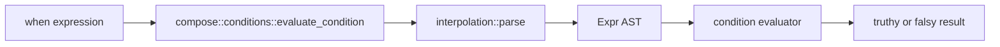

# Technical Design: Infix Logic Conditions

This document defines the technical design for the feature described in `darkmatter/features/2026-04-17-logic-conditions/spec.md`.

It is written against the current Darkmatter compose architecture, centered on:

- `darkmatter/lib/src/markdown/compose/conditions.rs`
- `darkmatter/lib/src/markdown/compose/interpolation/lexer.rs`
- `darkmatter/lib/src/markdown/compose/interpolation/parser.rs`
- `darkmatter/lib/src/markdown/compose/interpolation/mod.rs`
- `darkmatter/lib/src/markdown/compose/page_blocks/engine.rs`
- `darkmatter/lib/src/markdown/compose/transclusion/conditions.rs`
- `darkmatter/lib/src/markdown/reference/graph.rs`
- `darkmatter/docs/topics/boolean-conditional-logic.md`

## Overview

Darkmatter already supports boolean composition conditions through `And(...)` and `Or(...)` inside `when="..."` expressions. This feature adds infix logical operators:

- `&&` for logical AND
- `||` for logical OR

The main design constraint is compatibility. Darkmatter's shared interpolation lexer currently treats `||` as a fallback alias for `|`, and that behavior is already exercised by interpolation and frontmatter tests such as `{{ plan || "plan.md" }}`. Reinterpreting `||` globally as logical OR would therefore create an avoidable regression outside condition evaluation.

The recommended implementation is to add a condition-specific parse mode used only by `when=` evaluation. In that mode:

- `&&` parses as logical AND
- `||` parses as logical OR
- single `|` remains the existing fallback operator

Regular interpolation parsing remains unchanged.

## Goals

1. Support `&&` and `||` in every existing `when=` surface.
2. Preserve existing `And(...)` and `Or(...)` syntax.
3. Avoid breaking interpolation fallback behavior outside condition evaluation.
4. Reuse the existing parser and evaluator stack instead of creating a second expression language.
5. Keep precedence and grouping rules explicit and testable.

## Non-Goals

1. Changing body interpolation semantics for `{{ ... }}`.
2. Deprecating or removing `And(...)` and `Or(...)`.
3. Adding new comparison operators such as `<=`.
4. Changing truthiness rules, variable resolution, or `ctx`/`env` semantics.
5. Reworking CLI flags, compose reports, or cache formats.

## Current State

Today, condition evaluation flows through the shared interpolation parser:



Current parser behavior:

- `And(a, b)` and `Or(a, b)` work because they are ordinary function calls.
- `!`, comparisons, fallback `|`, and ternary `? :` already work in conditions.
- `||` is tokenized as the same fallback token as `|`.
- `&&` is not recognized by the interpolation lexer.

Current condition consumers:

- page blocks in `darkmatter/lib/src/markdown/compose/page_blocks/engine.rs`
- transclusion in `darkmatter/lib/src/markdown/compose/transclusion/conditions.rs`
- reference-graph conditional filtering in `darkmatter/lib/src/markdown/reference/graph.rs`

Because all of those call the same condition evaluator, this feature only needs one shared implementation path.

## Primary Recommendation

Add a condition-specific parser mode and a dedicated `parse_condition()` entrypoint. Keep `parse()` as the default interpolation parser.

This is the key design decision.

Rationale:

1. It enables `when="a && b || c"` everywhere conditions are evaluated.
2. It preserves existing interpolation behavior such as `{{ plan || "plan.md" }}`.
3. It keeps boolean-condition syntax localized to the condition subsystem rather than silently changing the entire expression language.
4. It avoids introducing a new public AST variant if infix operators are lowered into existing `And(...)` and `Or(...)` function-call nodes.

## Functional Contract

### Supported Condition Syntax

Existing forms remain valid:

```md
::file ./private.md when="And(user.is_admin, env.INTERNAL_DOCS)"
::block when="Or(env.OPENAI_API_KEY, env.ANTHROPIC_API_KEY)"
```

New infix equivalents become valid:

```md
::file ./private.md when="user.is_admin && env.INTERNAL_DOCS"
::block when="env.OPENAI_API_KEY || env.ANTHROPIC_API_KEY"
```

Mixed expressions are also valid:

```md
::block when="(release.enabled && env.CI) || preview"
::file ./doc.md when="(env.AGENT | env.DEFAULT_AGENT) == 'claude'"
```

### Scope

The new infix operators apply to all condition-evaluation surfaces, which in practice means every `when=` expression that routes through `compose::conditions::evaluate_condition`.

They do not apply to general interpolation parsing unless that interpolation is itself being parsed as a condition.

### Backward Compatibility

Backward compatibility rules:

1. `And(...)` and `Or(...)` continue to work unchanged.
2. Single-pipe fallback `|` continues to work in conditions.
3. Regular interpolation parsing keeps its current `||` fallback alias behavior.
4. No existing condition examples using single `|` fallback need to be rewritten.

Compatibility note:

- in condition mode, `a || b` now means logical OR, not fallback
- in interpolation mode, `a || b` continues to mean fallback alias for `a | b`

That split is intentional and should be documented explicitly.

## Grammar and Precedence

### Recommended Condition Grammar

Condition-mode grammar should become:

```text
expression     = ternary
ternary        = logical_or ("?" logical_or ":" logical_or)?
logical_or     = logical_and ("||" logical_and)*
logical_and    = fallback ("&&" fallback)*
fallback       = comparison ("|" comparison)*
comparison     = unary (comp_op unary)?
unary          = "!" unary | primary
primary        = literal | variable | function_call | "(" expression ")"
function_call  = variable "(" args? ")"
args           = expression ("," expression)*
literal        = STRING | NUMBER
```

### Precedence

Recommended precedence from highest to lowest:

1. function calls
2. unary `!`
3. comparisons: `==`, `!=`, `>`, `>=`, `<`
4. fallback: `|`
5. logical AND: `&&`
6. logical OR: `||`
7. ternary: `? :`

This ordering keeps fallback value resolution tighter than boolean composition, which makes expressions like `a || b | c` parse as `a || (b | c)` instead of `(a || b) | c`.

### Associativity

- `&&` and `||` should be left-associative.
- chained fallback remains left-associative, matching current behavior.
- ternary remains non-chainable in the existing parser style.

Examples:

| Expression | Parse shape |
| --- | --- |
| `a && b && c` | `And(And(a, b), c)` |
| `a || b || c` | `Or(Or(a, b), c)` |
| `a && b || c` | `Or(And(a, b), c)` |
| `a || b && c` | `Or(a, And(b, c))` |
| `a || b | c` | `Or(a, Fallback(b, c))` |
| `a | b && c` | `And(Fallback(a, b), c)` |

## Parser Design

### Parse Mode

Introduce a parser or lexer mode that distinguishes interpolation parsing from condition parsing.

Recommended internal shape:

```rust
pub(crate) enum ParseMode {
    Interpolation,
    Condition,
}
```

Recommended entrypoints:

```rust
pub fn parse(input: &str) -> Result<Expr, ParseError>;
pub(crate) fn parse_condition(input: &str) -> Result<Expr, ParseError>;
```

Behavior:

- `parse()` keeps the current interpolation behavior.
- `parse_condition()` enables `&&` and `||`.

### Lexer Changes

In `darkmatter/lib/src/markdown/compose/interpolation/lexer.rs`:

1. Add condition-aware tokenization for `&&`.
2. Add condition-aware tokenization for `||`.
3. Preserve current interpolation-mode handling where `||` collapses to fallback `|`.

Recommended token additions:

```rust
pub enum Token {
    // existing variants...
    AndAnd,
    OrOr,
}
```

Mode-specific behavior:

- interpolation mode:
  - `|` -> `Token::Pipe`
  - `||` -> `Token::Pipe` for backward compatibility
  - `&&` -> lexer error
- condition mode:
  - `|` -> `Token::Pipe`
  - `||` -> `Token::OrOr`
  - `&&` -> `Token::AndAnd`

Single `&` should remain invalid in all modes.

### Parser Changes

In `darkmatter/lib/src/markdown/compose/interpolation/parser.rs`:

1. keep the existing parse path for interpolation mode
2. add a condition-mode expression ladder for logical OR and logical AND
3. route `parse_condition()` through that condition-mode ladder

Recommended parser structure:

- `parse_expression()` remains interpolation-mode aware
- add `parse_condition_expression()`
- add `parse_logical_or()`
- add `parse_logical_and()`

### AST Lowering Strategy

Do not add a new public `Expr` enum variant for logical infix operators.

Instead, lower infix operators into the existing function-call representation:

```rust
// a && b
Expr::FunctionCall {
    name: "And".to_string(),
    args: vec![a, b],
}

// a || b
Expr::FunctionCall {
    name: "Or".to_string(),
    args: vec![a, b],
}
```

This is the recommended representation because:

1. `Expr` is already a public type, and adding enum variants would be a public API break for exhaustive downstream matches.
2. the condition evaluator already understands `And(...)` and `Or(...)`.
3. it keeps the change localized to lexer, parser, and evaluator behavior rather than public AST shape.

Nested chains may be emitted as nested binary calls. Flattening into a single variadic `And(...)` or `Or(...)` call is optional, but not required for correctness.

## Evaluator Changes

### Short-Circuit Semantics

The condition evaluator should give both infix and function-call boolean logic the same semantics:

- `&&` short-circuits on the first falsy operand
- `||` short-circuits on the first truthy operand
- `And(...)` and `Or(...)` should be updated to short-circuit as well

This is important for consistency. After this change:

- `And(a, b, c)`
- `a && b && c`

should behave the same.

### Implementation Detail

In `darkmatter/lib/src/markdown/compose/conditions.rs`, update `eval_function()` so the `and` and `or` branches evaluate arguments incrementally instead of collecting all results first.

Recommended behavior:

```rust
"and" => {
    for arg in args {
        if !is_truthy(&eval_expr(arg, state)?) {
            return Ok(Value::Bool(false));
        }
    }
    Ok(Value::Bool(true))
}
"or" => {
    for arg in args {
        if is_truthy(&eval_expr(arg, state)?) {
            return Ok(Value::Bool(true));
        }
    }
    Ok(Value::Bool(false))
}
```

Benefits:

1. infix and function-call forms stay aligned
2. skipped branches do not trigger avoidable evaluation errors
3. behavior becomes more intuitive for conditional expressions

No other truthiness or comparison rules need to change.

## Integration Points

No new feature toggle is required. Existing condition consumers automatically inherit the new syntax once `compose::conditions::evaluate_condition()` switches to `parse_condition()`.

Required call-site change:

```rust
let parsed = parse_condition(expr)?;
```

Affected files:

- `darkmatter/lib/src/markdown/compose/conditions.rs`
- `darkmatter/lib/src/markdown/compose/transclusion/conditions.rs`
- consumers that indirectly use `evaluate_condition()` through those modules

No changes are required to:

- compose options
- compose reports
- performance reporting
- cache manifests

Cache note:

`when` strings are already included in operation cache inputs, so the feature does not require cache-key schema changes.

## Error Handling

### Parse Errors

Condition parse errors should remain line-aware through `ConditionError::Parse`.

New invalid cases include:

- `a &&`
- `&& a`
- `a ||`
- `a & b`
- `a | | b`

### Interpolation-Mode Errors

Regular interpolation parsing should continue to reject `&&`.

Recommended error message:

```text
Unexpected character: '&'
```

Keeping the existing generic lexer error is acceptable for v1. A more tailored message such as "`&&` is only supported in `when` conditions" is a good follow-up, but not required for this feature.

## Tests

### Lexer and Parser Unit Tests

Add parser coverage in `darkmatter/lib/src/markdown/compose/interpolation/parser.rs` and lexer coverage in `.../lexer.rs` for:

1. `a && b`
2. `a || b`
3. `a && b || c`
4. `a || b && c`
5. `(a || b) && c`
6. `a || (b | c)`
7. interpolation-mode `plan || "plan.md"` still parsing as fallback
8. interpolation-mode `a && b` still failing

### Condition Evaluator Unit Tests

Add coverage in `darkmatter/lib/src/markdown/compose/conditions.rs` for:

1. `a && b`
2. `a || b`
3. mixed precedence
4. grouped expressions
5. `And(...)` and `Or(...)` still working
6. short-circuit behavior for both infix and function-call forms

Short-circuit regression examples:

- `false && UnknownFn(x)` should evaluate to `false`
- `true || UnknownFn(x)` should evaluate to `true`
- `And(false, UnknownFn(x))` should evaluate to `false`
- `Or(true, UnknownFn(x))` should evaluate to `true`

### Compose Integration Tests

Add or extend compose-level tests in `darkmatter/lib/src/markdown/compose/mod.rs` for:

1. page blocks using `&&`
2. page blocks using `||`
3. transclusion directives using mixed infix logic
4. fallback and infix operators in the same condition

Examples:

```md
::block when="draft && env.AGENT == 'claude'"
```

```md
::file ./default.md when="env.AGENT == 'claude' || !env.AGENT"
```

### Reference Graph Coverage

Add at least one test in the reference-graph path to confirm conditional extraction respects infix boolean logic the same way compose does.

That closes the loop for all current `when=` consumers.

## Documentation Updates

Update `darkmatter/docs/topics/boolean-conditional-logic.md` to:

1. describe `&&` and `||` as supported condition syntax
2. retain `And(...)` and `Or(...)` as valid alternatives
3. document precedence including fallback `|`
4. clarify the compatibility split:
   - `when="a || b"` means logical OR
   - `{{ a || "default" }}` remains interpolation fallback sugar

Recommended doc examples:

```md
::file ./release.md when="release.enabled && env.CI"
::file ./llm-notes.md when="env.OPENAI_API_KEY || env.ANTHROPIC_API_KEY"
::block when="(env.AGENT | env.DEFAULT_AGENT) == 'claude'"
```

## Risks and Tradeoffs

### 1. Condition vs. Interpolation Syntax Split

The main tradeoff is that `||` will now mean different things in different parser modes.

- in condition mode: logical OR
- in interpolation mode: fallback alias

This is acceptable because:

1. it preserves existing interpolation compatibility
2. the feature request is specifically about boolean conditions
3. the split is documentable and testable

### 2. Function-Call Short-Circuit Behavior

Making `And(...)` and `Or(...)` short-circuit is a small behavioral change. It is the right change because it aligns old and new syntax and removes surprising evaluation failures, but it should be called out in tests and docs.

### 3. Future Grammar Growth

A condition-specific parse mode creates a clean place for future condition-only syntax such as `<=` if Darkmatter later chooses to add it. That is a benefit, not a cost, but it reinforces the need to keep parser-mode boundaries explicit.

## Implementation Summary

Recommended implementation steps:

1. Add parser or lexer mode support for interpolation vs. condition parsing.
2. Add `Token::AndAnd` and `Token::OrOr`.
3. Add `parse_condition()` with logical-operator precedence.
4. Lower infix operators into existing `And(...)` and `Or(...)` function-call AST nodes.
5. Update `compose::conditions::evaluate_condition()` to use `parse_condition()`.
6. Make `And(...)` and `Or(...)` evaluation short-circuit.
7. Add parser, evaluator, compose, and reference-graph coverage.
8. Update `darkmatter/docs/topics/boolean-conditional-logic.md`.

This keeps the feature small, compatible, and idiomatic to Darkmatter's existing compose stack.
