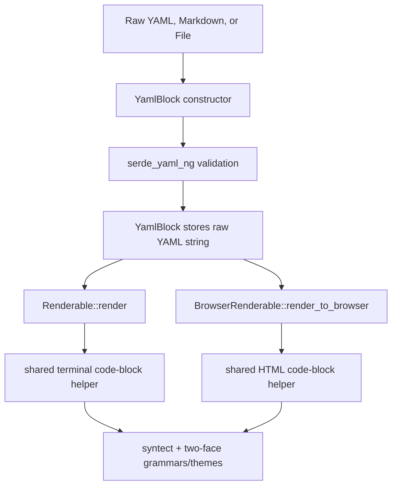

# YAML Component Technical Design

## Summary

Add a `YamlBlock` component to `darkmatter` that validates YAML at construction time and renders the original YAML text through Darkmatter's existing fenced-code highlighting path. The component is an ingestion convenience: it accepts raw YAML, Markdown frontmatter, Markdown files, or YAML files, then presents the payload as the same highlighted `yaml` block users already get from a Markdown fenced code block.

`YamlBlock` lives in Darkmatter because it depends on Markdown/frontmatter semantics and Darkmatter's `syntect` / `two-face` highlighting stack. It implements `biscuit_terminal::components::renderable::Renderable` and `BrowserRenderable` so consumers can embed it in terminal and browser-oriented output.

## Goals

- Provide a typed `YamlBlock` wrapper around validated raw YAML text.
- Reuse existing syntax highlighting and theme selection for both terminal and HTML output.
- Reuse Darkmatter's frontmatter parser for Markdown ingestion.
- Preserve byte-for-byte payload text after validation, except for the explicit empty-frontmatter fallback to `{}`.
- Keep `serde_yaml_ng::Value` out of the public API.
- Avoid adding any YAML-specific visual renderer beyond highlighted code-block output.

## Non-Goals

- No tree view, collapsible view, key/value table, or structural YAML renderer.
- No extraction of fenced YAML blocks from Markdown bodies.
- No multi-document YAML stream API.
- No YAML editing or persistence API.
- No page-level frontmatter configuration for `YamlBlock` in this feature.
- No changes to how normal Markdown ` ```yaml ` fences are parsed.

## Package Boundaries

| Concern | Package / Module |
| --- | --- |
| YAML validation | `darkmatter/lib` using `serde_yaml_ng` |
| Markdown frontmatter extraction | `darkmatter/lib/src/markdown/frontmatter.rs` |
| Syntax and theme loading | `darkmatter/lib/src/markdown/highlighting/` |
| Terminal render trait | `biscuit-terminal` `Renderable` |
| Browser render trait | `biscuit-terminal` `BrowserRenderable` |
| Terminal capability detection | Not used directly by `YamlBlock`; only the trait-provided `Terminal` argument is accepted |

No new crate dependency is required. `darkmatter/lib/Cargo.toml` already depends on `serde_yaml_ng`, `syntect`, and `two-face`.

## Public API

Expose the component from `darkmatter::markdown`:

```rust
pub use yaml_block::{YamlBlock, YamlBlockError};
```

Add a new module:

```text
darkmatter/lib/src/markdown/yaml_block.rs
```

Primary type:

```rust
#[derive(Debug, Clone, PartialEq, Eq)]
pub struct YamlBlock {
    yaml: String,
    layout: biscuit_terminal::utils::layout::Layout,
}
```

Constructors:

```rust
impl YamlBlock {
    pub fn new<T: Into<String>>(yaml: T) -> Result<Self, YamlBlockError>;

    pub fn from_markdown_content<T: Into<String>>(md: T) -> Result<Self, YamlBlockError>;

    pub fn from_markdown_file<P: AsRef<std::path::Path>>(path: P)
        -> Result<Self, YamlBlockError>;

    pub fn from_yaml_file<P: AsRef<std::path::Path>>(path: P) -> Result<Self, YamlBlockError>;

    pub fn yaml(&self) -> &str;

    pub fn into_yaml(self) -> String;
}
```

The `yaml()` and `into_yaml()` accessors are included to make the component testable and useful without exposing the parsed `serde_yaml_ng::Value`.

## Error Type

Use a dedicated error type instead of overloading `MarkdownError`:

```rust
#[derive(Debug, thiserror::Error)]
pub enum YamlBlockError {
    #[error("Failed to read YAML source: {0}")]
    Io(#[from] std::io::Error),

    #[error("Failed to parse YAML: {0}")]
    YamlParse(#[from] serde_yaml_ng::Error),

    #[error("Failed to parse markdown frontmatter: {0}")]
    MarkdownParse(#[from] crate::markdown::MarkdownError),
}
```

`MarkdownParse` is retained because `Markdown::try_from_content` returns `MarkdownError::FrontmatterParse` for malformed frontmatter. This preserves the source YAML captured by `MarkdownError` and avoids flattening richer Markdown diagnostics into a plain YAML error.

Constructor mapping:

| Constructor | `Io` | `YamlParse` | `MarkdownParse` |
| --- | --- | --- | --- |
| `new` | No | Yes | No |
| `from_yaml_file` | Yes | Yes | No |
| `from_markdown_content` | No | Yes for re-serialized frontmatter validation failures | Yes for frontmatter extraction failures |
| `from_markdown_file` | Yes | Yes for re-serialized frontmatter validation failures | Yes for frontmatter extraction failures |

## Frontmatter Extraction

`from_markdown_content` should call `Markdown::try_from_content`, not the infallible `From<&str>` conversion. The infallible conversions intentionally drop malformed frontmatter by returning an empty map, which is not acceptable for this component's fail-fast constructor semantics.

Extraction rules:

1. Parse the Markdown source with `Markdown::try_from_content`.
2. If the parsed frontmatter map is empty, use the literal payload `{}`.
3. If the map is non-empty, serialize the `FrontmatterMap` back to YAML with `serde_yaml_ng::to_string`.
4. Validate that serialized YAML via the same `validate_yaml` helper used by `new`.
5. Store the serialized YAML text, not the parsed value.

This means frontmatter ingestion preserves semantic content and key order through `IndexMap`, but not necessarily the exact whitespace or comments from the original frontmatter block. That is acceptable for Markdown ingestion because Darkmatter's public frontmatter abstraction is already structured data, not a raw-span API.

## Validation

Add a small private helper:

```rust
fn validate_yaml(yaml: &str) -> Result<(), serde_yaml_ng::Error> {
    let _: serde_yaml_ng::Value = serde_yaml_ng::from_str(yaml)?;
    Ok(())
}
```

`YamlBlock::new` stores the original `String` after validation. It does not normalize, trim, or reserialize raw YAML.

Empty raw YAML should be accepted only if `serde_yaml_ng` accepts it. Missing Markdown frontmatter is a separate case and produces `{}` explicitly.

## Rendering Architecture

The component should not duplicate the current code-block rendering logic. Instead, move the existing code-block rendering functions into reusable helpers with a narrow API, then call those helpers from both Markdown output and `YamlBlock`.



### Shared Terminal Helper

Current terminal code highlighting is private in `darkmatter/lib/src/markdown/output/terminal.rs` as `highlight_code`. Move the reusable portion to a new module:

```text
darkmatter/lib/src/markdown/output/code_block.rs
```

Suggested API:

```rust
pub(crate) fn render_terminal_code_block(
    code: &str,
    language: &str,
    highlighter: &CodeHighlighter,
    options: &TerminalCodeBlockOptions,
) -> MarkdownResult<String>;

pub(crate) struct TerminalCodeBlockOptions {
    pub include_line_numbers: bool,
    pub meta: CodeBlockMeta,
    pub color_mode: ColorMode,
}
```

`TerminalOptions` can be converted into `TerminalCodeBlockOptions` inside `terminal.rs`. `YamlBlock` can construct the same options with:

- `language = "yaml"`
- `include_line_numbers = false`
- `meta = CodeBlockMeta::default()`
- `color_mode = detect_color_mode()` or a stored default, matching the existing default behavior for terminal rendering

This keeps padding, line-number behavior, highlighted-line support, syntax lookup, and ANSI reset behavior identical to normal Markdown code blocks.

### Shared HTML Helper

Current HTML code highlighting is private in `darkmatter/lib/src/markdown/output/html.rs` as `highlight_code_block`. Move it into the same `output/code_block.rs` module or a sibling `output/html_code.rs` helper:

```rust
pub(crate) fn render_html_code_block(
    code: &str,
    language: &str,
    highlighter: &CodeHighlighter,
    options: &HtmlCodeBlockOptions,
) -> MarkdownResult<String>;

pub(crate) struct HtmlCodeBlockOptions {
    pub include_line_numbers: bool,
    pub include_container: bool,
    pub meta: CodeBlockMeta,
}
```

For `YamlBlock`, set `include_container` to the same value used by Markdown code blocks unless implementation proves that the acceptance criterion requires the first emitted code element to be exactly `<pre><code class="language-yaml">`. The expected practical output is the existing wrapper plus the inner code block:

```html
<div class="code-block">
<pre><code class="language-yaml">...</code></pre>
</div>
```

Tests should assert the required `<pre><code class="language-yaml">` substring rather than depending on wrapper absence.

### Trait Implementations

Terminal:

```rust
impl Renderable for YamlBlock {
    fn render(&self, term: &Terminal) -> String {
        let color_mode = detect_color_mode();
        let highlighter = CodeHighlighter::new(ThemePair::Github, color_mode);
        render_terminal_code_block(self.yaml(), "yaml", &highlighter, &options)
            .unwrap_or_else(|err| fallback_plain_yaml(self.yaml(), &err))
    }

    fn layout(&self) -> &Layout;
    fn layout_mut(&mut self) -> &mut Layout;
    fn as_any(&self) -> &dyn Any;
    fn is_block_level(&self) -> bool { true }
}
```

The `term` argument should be used if the shared helper accepts terminal width or color-depth configuration later. The initial implementation can follow existing code-block behavior and rely on `TerminalOptions`-style defaults.

Browser:

```rust
impl BrowserRenderable for YamlBlock {
    fn render_to_browser(&self) -> String {
        let color_mode = detect_color_mode();
        let highlighter = CodeHighlighter::new(ThemePair::Github, color_mode);
        render_html_code_block(self.yaml(), "yaml", &highlighter, &options)
            .unwrap_or_else(|_| {
                format!(
                    "<pre><code class=\"language-yaml\">{}</code></pre>",
                    html_escape::encode_text(self.yaml())
                )
            })
    }

    fn as_any(&self) -> &dyn Any;
}
```

The browser fallback must HTML-escape the YAML text.

## Theme Behavior

`YamlBlock` inherits Darkmatter's existing theme defaults:

- Terminal path uses `CodeHighlighter` with `ThemePair::Github` or the current code-block default.
- Browser path uses the same `CodeHighlighter` and HTML style generation as Markdown code blocks.
- `detect_color_mode()` remains the only automatic light/dark selector.

Do not add `YamlBlock`-specific theme fields in this feature. If consumers need explicit theme control later, add options or builder methods without changing constructor behavior.

## Syntax Lookup

The shared helper should pass `yaml` as the language token. Darkmatter's `CodeHighlighter` loads syntaxes through the existing grammar module backed by `two-face`, so YAML support should come from the same syntax set used by all Markdown fenced blocks.

If a YAML syntax is missing, the shared helper should fall back to plain text exactly as Markdown code blocks do today. Validation still runs, so missing syntax support affects only coloring, not correctness.

## File I/O

`from_yaml_file`:

1. Read with `std::fs::read_to_string`.
2. Call `YamlBlock::new`.
3. Map read failures to `YamlBlockError::Io`.
4. Map parse failures to `YamlBlockError::YamlParse`.

`from_markdown_file`:

1. Read with `std::fs::read_to_string`.
2. Call `YamlBlock::from_markdown_content`.
3. Preserve the same error mapping.

No source path is stored in `YamlBlock`. This keeps the type a pure renderable payload.

## Module Changes

Expected edits:

| File | Change |
| --- | --- |
| `darkmatter/lib/src/markdown/mod.rs` | Add `mod yaml_block;` and re-export `YamlBlock` and `YamlBlockError`. |
| `darkmatter/lib/src/markdown/yaml_block.rs` | Define the component, constructors, errors, validation, and trait impls. |
| `darkmatter/lib/src/markdown/output/code_block.rs` | Add shared terminal and HTML code-block render helpers. |
| `darkmatter/lib/src/markdown/output/mod.rs` | Expose the shared helper module as `pub(crate)`. |
| `darkmatter/lib/src/markdown/output/terminal.rs` | Replace private `highlight_code` call sites with the shared terminal helper. |
| `darkmatter/lib/src/markdown/output/html.rs` | Replace private `highlight_code_block` call sites with the shared HTML helper. |

Keep the helper module `pub(crate)` to avoid prematurely committing to a general code-block rendering API.

## Testing Plan

Add focused tests in `yaml_block.rs`:

- `new` accepts valid YAML and stores the original payload.
- `new` rejects malformed YAML with `YamlBlockError::YamlParse`.
- `from_yaml_file` maps missing files to `Io`.
- `from_yaml_file` maps malformed files to `YamlParse`.
- `from_markdown_content` with no frontmatter returns `{}`.
- `from_markdown_content` ignores Markdown body content.
- `from_markdown_content` maps malformed frontmatter to `MarkdownParse`.
- `yaml()` and `into_yaml()` expose stored payload as expected.

Add rendering parity tests:

- Terminal render of `YamlBlock::new(X)` matches terminal render of `Markdown::from(format!("```yaml\n{X}\n```"))` after normalizing any wrapper newline differences required by `Renderable::render`.
- Browser render contains `<pre><code class="language-yaml">`.
- Browser render escapes YAML scalar content containing `<`, `>`, and `&`.
- Light and dark `ColorMode` paths are exercised by constructing `CodeHighlighter` explicitly in the shared helper tests.

Use `tempfile` if already available in the crate. If it is not available, use a test fixture under a temporary directory from `std::env::temp_dir()` and clean it up explicitly to avoid adding a dependency for this feature.

## Documentation

Update:

- `darkmatter/lib/README.md` with a short `YamlBlock` example.
- `darkmatter/README.md` if it lists reusable Markdown components.
- `.claude/skills/darkmatter/SKILL.md` because this adds a reusable Markdown rendering component.

No `docs/dependencies.md` update is required unless implementation adds a new crate.

## Compatibility

This feature is additive. Existing Markdown parsing and fenced-code rendering behavior should remain unchanged. The only shared-code risk is the refactor of private highlighting helpers; parity tests between Markdown code fences and `YamlBlock` should guard that path.

## Open Decisions for Implementation

- Whether to make the shared code-block helper accept full `TerminalOptions` / `HtmlOptions` or smaller option structs. Smaller structs reduce coupling, but full options may minimize initial refactor churn.
- Whether `YamlBlock::render` should use `ThemePair::Github` directly or route through `TerminalOptions::default()`. Prefer routing through the same defaults used by Markdown terminal output if the helper refactor makes that practical.
- Whether `BrowserRenderable::render_to_browser` should include generated `<style>` output. Prefer no embedded style by default so the component is embeddable; document that callers rendering standalone HTML should include Darkmatter's code-block styles.
