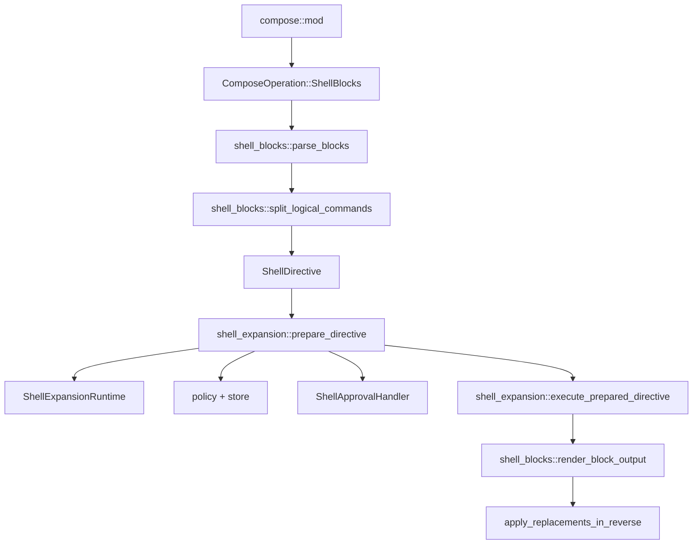

# Shell Blocks Technical Design

This document complements the functional specification in `darkmatter/features/_unscheduled/shell-block/spec.md`. The spec remains the source of truth for user-facing behavior, syntax, output rules, and security requirements. This design focuses on how Shell Blocks should fit into the existing Darkmatter compose architecture without duplicating the detailed behavioral contract from the spec.

## Summary

Add `::shell-block` / `::end-block` as a new Inline Pre compose operation that reuses the existing shell-expansion policy, approval, alias resolution, timeout, execution, and error-handling machinery. The new work is primarily structural:

- parse paired block directives with the same stack discipline as page blocks
- split a shell-block body into logical commands before tokenization
- approve every logical command before executing any command in the block
- execute prepared commands sequentially and render their per-command outputs using the block-specific output contract
- report diagnostics with source excerpts because composed line numbers may not map cleanly back to author files

## Goals

1. Add a first-class `ComposeOperation::ShellBlocks` immediately after `ShellExpansion`.
2. Keep command execution direct through `std::process::Command`; do not introduce shell interpreter semantics.
3. Reuse `shell_expansion::prepare_directive`, `execute_prepared_directive`, `ErrorHandling`, `ShellExpansionRuntime`, and policy store code.
4. Make shell-block parsing aware of `::block` nesting so shared `::end-block` delimiters are unambiguous.
5. Keep approval discovery flat: every logical command appears as an ordinary `ShellCommandEntry`.
6. Keep error rendering specific enough to show the failing logical command and neighboring shell-block body lines.

## Non-Goals

1. No transaction or rollback model for partially executed blocks.
2. No shell pipes, `&&`, `||`, semicolons, redirects, command substitution, or multi-command logical lines.
3. No new policy file format.
4. No new approval decision type.
5. No deprecation of existing `::shell` directives.

## Current Architecture

The existing shell expansion stack already owns the security-sensitive pieces:

| Concern | Existing Module |
| --- | --- |
| `::shell` line parsing | `darkmatter/lib/src/markdown/compose/shell_expansion/parser.rs` |
| shell-like tokenization | `darkmatter/lib/src/markdown/compose/shell_expansion/tokenize.rs` |
| policy and approval | `darkmatter/lib/src/markdown/compose/shell_expansion/mod.rs` |
| execution and timeout | `darkmatter/lib/src/markdown/compose/shell_expansion/executor.rs` |
| command discovery | `darkmatter/lib/src/markdown/compose/shell_expansion/discovery.rs` |
| shared runtime | `ShellExpansionRuntime` and `PipelineRuntime` |
| page block pairing | `darkmatter/lib/src/markdown/compose/page_blocks/parser.rs` |

Shell Blocks should be a thin compose-layer extension over those pieces rather than a second shell subsystem.

## Module Layout

Add a new sibling module:

```text
darkmatter/lib/src/markdown/compose/shell_blocks/
├── mod.rs
├── parser.rs
├── body.rs
├── render.rs
└── types.rs
```

Responsibilities:

- `parser.rs`: find `::shell-block` regions, parse opening parameters, track spans and source excerpt context
- `body.rs`: convert physical body lines into logical command records using continuation rules
- `render.rs`: join per-command execution results into block replacement text
- `types.rs`: shell-block regions, logical commands, parse errors, execution reports
- `mod.rs`: orchestration entrypoints used by `Markdown::run_shell_blocks_stage`

The existing `shell_expansion` module remains the owner of individual command approval and execution.



## Compose Integration

Add a new operation:

```rust
pub enum ComposeOperation {
    FrontmatterInterpolation,
    FrontmatterShellExpansion,
    TextReplacement,
    PageBlocks,
    Interpolation,
    ShellExpansion,
    ShellBlocks,
    BlockTransclusion,
    FrontmatterTransclusion,
    CodeTransclusion,
    TocLinking,
    Cleanup,
    Normalization,
}
```

`ShellBlocks` belongs to `ComposePhase::InlinePre` and runs immediately after `ShellExpansion`, matching `spec.md`.

Required type updates:

- increment `ComposeOperation::COUNT`
- assign a stable index after `ShellExpansion`
- include the operation in `default_order()`
- add `Display` text `ShellBlocks`
- add `PerfMetricKind::ShellBlocks`
- add `ComposeReport::shell_blocks_applied`

Add `Markdown::run_shell_blocks_stage` beside `run_shell_expansion_stage`. It should:

1. parse shell-block regions from current content
2. resolve policy paths and load runtime policy once if any block exists
3. prepare every logical command in a block before executing the first one
4. execute prepared commands sequentially
5. render a replacement per block
6. apply replacements in reverse span order
7. merge warnings and approval counts into `ComposeReport`

## Shared Block Pairing

The spec requires page blocks and shell blocks to share `::end-block`. The cleanest implementation is to introduce a small shared scanner:

```text
darkmatter/lib/src/markdown/compose/block_pairs.rs
```

Suggested core types:

```rust
pub(crate) enum BlockOpenKind {
    Page,
    Shell,
}

pub(crate) struct BlockPair {
    pub kind: BlockOpenKind,
    pub span: Range<usize>,
    pub body_span: Range<usize>,
    pub start_line: usize,
    pub end_line: usize,
    pub opening_text: String,
}
```

The scanner should skip fenced code regions via `parse_utils::find_code_regions()`, push `::block` and `::shell-block` openers onto one stack, and pop on every `::end-block`. It should validate that `::end-block` has no trailing content.

`page_blocks::parser` can either wrap this scanner or keep its current region-tree builder while sharing the opener/closer tokenization. The important invariant is one stack for both opener kinds, not independent parsers that can disagree about nesting.

## Shell Block Types

```rust
pub(crate) struct ShellBlockRegion {
    pub span: Range<usize>,
    pub body_span: Range<usize>,
    pub start_line: usize,
    pub end_line: usize,
    pub options: ErrorHandling,
    pub timeout_override: Option<Duration>,
    pub excerpt: SourceExcerpt,
}

pub(crate) struct ShellBlockCommand {
    pub raw_command: String,
    pub executable: String,
    pub args: Vec<String>,
    pub physical_span: Range<usize>,
    pub start_line: usize,
    pub end_line: usize,
}
```

`SourceExcerpt` should be a compact owned structure containing a few body lines around the relevant logical command. It is intentionally not just `line: usize`, because interpolation and prior compose operations can make the rendered document line number diverge from the original file.

`ShellCommandOrigin` should gain:

```rust
ShellBlock {
    start_line: usize,
    command_line: usize,
}
```

This lets approval prompts, warnings, and errors distinguish `::shell` from shell-block commands without changing the approval handler contract.

## Opening Parameter Parsing

`::shell-block` parameters use key-value syntax, not `::shell` flags. Parse them with `parse_utils::Cursor`.

Supported mappings:

| Shell Block Parameter | Existing `ErrorHandling` Field |
| --- | --- |
| `when_error="text"` | `when_error` |
| `when_exit_code="N,text"` | `when_exit_code.push((N, text))` |
| `except_exit_code="N,text"` | `except_exit_code.push((N, text))` |
| `stderr_contains="find,text"` | `stderr_contains.push((find, text))` |
| `stderr_lacks="find,text"` | `stderr_lacks.push((find, text))` |
| `enrich_error="text"` | `enrich_error` |
| `enrich_error_on="N,text"` | `enrich_error_on.push((N, text))` |
| `timeout=N` | `timeout_override` |

For wrong-style options, return targeted parse errors:

- `--when-error` on `::shell-block`: suggest `when_error="..."`
- `--when-exit-code`: suggest `when_exit_code="N,..."`
- `::timeout:N`: suggest `timeout=N`
- `when-error`: suggest `when_error`

Unknown key-value options should be hard parse errors for this feature. Silent ignore would be risky because these options affect error behavior.

## Body Splitting

`shell_blocks::body::split_logical_commands` should operate before tokenization:

1. ignore blank physical lines
2. treat a non-empty line as a new logical command
3. if a line ends with an unescaped trailing `\`, remove that continuation marker and append the next non-blank physical line with one space separator
4. preserve logical command start and end lines for diagnostics
5. tokenize each logical command with `shell_expansion::tokenize::tokenize`

After continuation folding, the normal tokenizer remains authoritative. This preserves the existing direct-execution security model and rejects pipes, chaining, redirection, and command substitution in one place.

Implementation note: continuation folding should only treat a final backslash as a continuation when it is the last non-whitespace character. A line ending in `\\` should remain a literal escaped backslash and then be tokenized normally.

## Approval And Execution

Shell Blocks need a two-phase per-block flow:

```rust
let prepared = block
    .commands
    .iter()
    .map(|cmd| shell_expansion::prepare_directive(&cmd.as_directive(...), ...))
    .collect::<Result<Vec<_>, _>>()?;

for prepared in prepared {
    let result = shell_expansion::execute_prepared_directive(&prepared, options)?;
    // collect rendered command output or handle failure
}
```

This satisfies the spec rule that if any command is denied, no command in that block executes. The guarantee is block-local: commands in earlier shell blocks may already have executed.

Error handling remains per command because each logical command becomes a `ShellDirective` carrying the block-level `ErrorHandling` clone. A later enhancement could add per-command overrides, but that is out of scope.

## Output Rendering

Render from `DirectiveExecutionResult::combined_output()` with the shell-block contract from `spec.md`:

- trim each command's combined output
- drop empty command outputs
- append one newline after each non-empty command output
- insert one blank line between non-empty command outputs
- render an empty string if every command output is empty

Suggested helper:

```rust
pub(crate) fn render_block_output(results: &[ShellBlockCommandResult]) -> String;
```

On an unhandled command failure after earlier commands have succeeded, the stage should return a shell-block error containing the partial outputs and the failing command context. The exact visual demotion can be implemented in the `BlockError` renderer rather than by mutating the Markdown replacement text.

## Error Model

Keep shell-block parsing errors distinct, but convert execution failures through existing shell errors where possible.

```rust
#[derive(Debug, thiserror::Error)]
pub enum ShellBlockError {
    #[error("Shell block parse error at line {line}: {message}")]
    Parse {
        line: usize,
        message: String,
        excerpt: SourceExcerpt,
    },

    #[error("Unterminated shell block opened at line {line}")]
    Unterminated {
        line: usize,
        opening_text: String,
        excerpt: SourceExcerpt,
    },

    #[error("Shell block command failed at line {command_line}: {source}")]
    Command {
        block_start_line: usize,
        command_line: usize,
        partial_output: Vec<String>,
        excerpt: SourceExcerpt,
        #[source]
        source: ShellExpansionError,
    },
}
```

`ShellBlockError` should implement `biscuit_terminal::errors::BlockError`. The rendered block should include:

- error class and short title
- source file when available
- block opener line and command line
- a code excerpt with the failing logical command highlighted or clearly marked
- existing shell-expansion details for command not found, denial, timeout, or execution failure
- a hint when the author likely used `::shell` flag syntax instead of shell-block key-value syntax

Add `MarkdownError::ShellBlock(#[from] ShellBlockError)` and delegate status-block rendering the same way `ShellExpansion` and `PageBlock` do.

## Discovery

Extend `shell_expansion::discovery::collect_shell_commands` to include shell-block logical commands in the flat result list. Discovery should run the same pre-execution compose subset it already uses, plus the page/shell shared block scanner, so false page blocks do not contribute shell-block commands.

For each logical command, produce `ShellCommandEntry` with:

- `raw_command`: folded logical command
- `executable` and `args`: after tokenization and alias passthrough logic
- `normalized`: existing `normalize_command`
- `source_file`: same source attribution as existing body shell entries
- `origin`: `ShellCommandOrigin::ShellBlock { ... }`

No approval infrastructure change is needed. Pre-approved command sets remain normalized command strings.

## Testing Strategy

Parser tests:

- simple one-command block
- multiple sibling blocks
- body continuation folding
- blank line ignoring
- rejected pipes, chaining, redirects, command substitution
- nested `::block` containing `::shell-block`
- nested `::shell-block` inside false page block
- unmatched and unterminated `::end-block`
- wrong-style parameter hints

Execution tests:

- all commands approved before first execution
- denial of command 2 prevents command 1 execution in the same block
- successful multiple commands render with exactly one blank line between non-empty outputs
- empty command output is omitted without extra separators
- `when_error` fallback applies to only the failing command and subsequent commands still run
- unhandled failure preserves earlier outputs in `ShellBlockError`
- timeout override on the block applies to every command in the block

Discovery tests:

- shell-block commands appear in `collect_shell_commands`
- discovery preserves source file and origin
- false page blocks exclude nested shell-block commands
- transcluded documents contribute shell-block commands once their conditions pass

CLI integration tests can stay light because the approval handler remains the same. Most behavior should be unit-tested in the library.

## Performance Notes

Shell-block parsing is linear in document size and can reuse code-region scanning. The only extra allocation with many shell blocks is one owned `String` per folded logical command plus small excerpt buffers for diagnostics.

Approval preparation happens before execution within each block. This adds one vector of `PreparedShellDirective` per block, but the vector length is bounded by the number of logical commands in that block and avoids duplicate policy loads.

Execution remains sequential by design. Running shell-block commands concurrently would violate the "multiple commands one after another" authoring model and make side effects harder to reason about.

## Documentation Updates

When implementing this feature, update:

- `darkmatter/docs/inline/shell-expansion.md` or a new adjacent `shell-blocks.md`
- `darkmatter/docs/darkmatter-compose-pipeline.md` for the new Inline Pre operation
- `darkmatter/README.md` only if public examples mention shell expansion
- `.claude/skills/darkmatter/SKILL.md` so future agents know Shell Blocks are part of the compose pipeline

No deprecation notes are needed. Existing `::shell` remains the compact single-command form.
