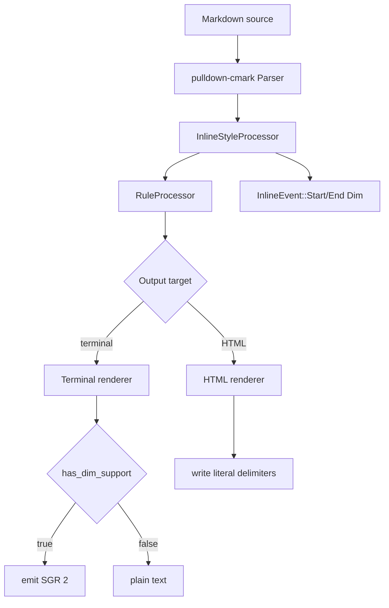

# Technical Design: Dim Markdown Syntax

This document defines the technical design for the feature described in
`darkmatter/features/_unscheduled/dim-markdown/spec.md`.

The feature adds a terminal-first inline Markdown extension:

```markdown
This text is ⌄dimmed⌄.
```

In terminal output, the span maps to ANSI SGR `2` when the active terminal is
known to support dim/faint text. In non-supporting terminals it renders as
ordinary text. HTML output intentionally preserves the source delimiters as
literal `⌄` characters because the specification does not define an HTML
representation.

## Current Context

Darkmatter already extends `pulldown-cmark` with a custom inline event layer:

- `darkmatter/lib/src/markdown/inline/types.rs`
- `darkmatter/lib/src/markdown/inline/mod.rs`
- `darkmatter/lib/src/markdown/output/terminal.rs`
- `darkmatter/lib/src/markdown/output/html.rs`

The existing `MarkProcessor` scans `Event::Text` values for `==...==` and emits
`InlineEvent::Start(InlineTag::Mark)` / `InlineEvent::End(InlineTag::Mark)`.
Terminal and HTML renderers consume that custom event stream after the
`RuleProcessor` adds horizontal-rule support.

`biscuit-terminal::components::Prose` already supports `<dim>...</dim>` and
`{{dim}}` tokens internally, but its dim rendering is optimistic today. This
feature needs an explicit terminal capability query so Darkmatter can suppress
SGR `2` where dim is unsupported.

## Goals

1. Parse paired U+2304 `⌄` delimiters into a new inline `Dim` tag.
2. Preserve literal `⌄` for unmatched delimiters, escaped delimiters, code spans,
   and fenced or indented code blocks.
3. Render dim spans with SGR `2` only when capability detection says the active
   terminal supports dim text.
4. Render dim spans as normal-intensity text when dim is unsupported.
5. Keep HTML output literal: `⌄text⌄` in Markdown becomes `⌄text⌄` in HTML text.
6. Add focused tests for parsing, terminal rendering, HTML passthrough, tables,
   nesting, escaping, and code exclusions.
7. Update user-facing docs, rustdoc, dependencies docs if crate dependencies
   change, and the Darkmatter skill.

## Non-Goals

1. Add a general custom inline parser for every future delimiter.
2. Add a CLI flag, feature gate, compatibility mode, or deprecation path.
3. Define `<dim>` or CSS output for Darkmatter HTML rendering.
4. Change `biscuit-terminal::Prose` markup semantics.
5. Change Markdown composition, frontmatter, transclusion, or cleanup behavior.
6. Recognize lookalike characters such as `˅`, `∨`, or ASCII `v`.

## Design Overview



The implementation should evolve `MarkProcessor` into a small inline style
processor that handles both `==mark==` and `⌄dim⌄` in one pass over each
`Event::Text`. This keeps Darkmatter's custom inline event model intact and
avoids adding another iterator adapter with competing state.

## Event Model Changes

Update `darkmatter/lib/src/markdown/inline/types.rs`:

```rust
#[derive(Debug, Clone, Copy, PartialEq, Eq, Hash)]
pub enum InlineTag {
    /// Highlighted/marked text (`==text==`).
    Mark,

    /// Dim/faint text (`⌄text⌄`).
    Dim,
}
```

No new `InlineEvent` variant is required. `Dim` uses the existing
`InlineEvent::Start(InlineTag)` and `InlineEvent::End(InlineTag)` variants.

The type docs should be updated so they no longer describe `MarkProcessor` as
the only producer of custom inline tags. Recommended wording:

- `InlineTag::Mark`: custom highlight syntax.
- `InlineTag::Dim`: terminal-first dim syntax; HTML preserves delimiters.
- `InlineEvent`: custom inline tags plus horizontal-rule events.

## Inline Processor

Rename `MarkProcessor` to `InlineStyleProcessor` and keep a compatibility type
alias:

```rust
pub type MarkProcessor<'a, I> = InlineStyleProcessor<'a, I>;
```

This avoids a large immediate churn while letting new code and docs use the more
accurate name. The terminal and HTML modules can migrate to `InlineStyleProcessor`
as part of this feature.

### Processing Contract

The processor receives `pulldown_cmark::Event` values and emits `InlineEvent`
values.

It should:

1. Track fenced and indented code blocks with the existing `in_code_block` flag.
2. Pass `Event::Code(_)` through unchanged.
3. Fast-path text without `==` or `⌄`.
4. Split eligible `Event::Text` values into standard text events and custom
   start/end events.
5. Convert unmatched opening delimiters back to literal text.
6. Preserve escaped delimiters as literal text after `pulldown-cmark` has applied
   normal Markdown backslash escaping.

### Delimiter Rules

The spec says `⌄` follows the same parsing rules as `_`. The existing `==`
scanner is intentionally simpler than CommonMark emphasis parsing, so dim
support should not copy that simplistic toggling behavior for all cases.

Implement a local delimiter classifier for U+2304:

```rust
struct Delimiter {
    byte_start: usize,
    byte_end: usize,
    can_open: bool,
    can_close: bool,
}
```

For a `⌄` delimiter, compute the previous and next Unicode scalar values around
the delimiter and classify:

- A delimiter can open when it is not followed by Unicode whitespace and the next
  character exists.
- A delimiter can close when it is not preceded by Unicode whitespace and the
  previous character exists.
- Inside a word, treat it like `_`: do not allow both sides to form an intraword
  pair when the previous and next characters are both alphanumeric.
- Escaped delimiters are already surfaced by `pulldown-cmark` as literal text in
  normal cases; for robustness, a raw backslash immediately before `⌄` in a text
  event should force the delimiter literal and remove only the Markdown escape
  slash if it survived.

Pair delimiters with a small stack:

```text
for delimiter in delimiters:
  if delimiter.can_close and stack has opener:
    pair opener with delimiter
  else if delimiter.can_open:
    push opener
  else:
    literal
```

Because the delimiter is one Unicode scalar and not a run, this is substantially
simpler than full `*` / `_` delimiter-run parsing. The behavior will be close to
CommonMark emphasis without replacing `pulldown-cmark`'s parser.

### Mixed `==` and `⌄` Handling

The processor should scan all supported delimiters in byte order and build a
single event list. This avoids a bug class where processing `==` first could
hide or reorder `⌄` spans inside the generated text segments.

Recommended internal representation:

```rust
enum InlineDelimiterKind {
    Mark,
    Dim,
}

struct InlineDelimiter {
    kind: InlineDelimiterKind,
    byte_start: usize,
    byte_end: usize,
    can_open: bool,
    can_close: bool,
}
```

`==` can keep its current simple pair behavior. `⌄` should use the classifier
above. If implementation risk is high, it is acceptable to introduce `Dim` with
the same text-scope pairing constraint as `Mark` and document the remaining
CommonMark edge cases in tests, but the preferred implementation should satisfy
the spec's `_`-like intraword behavior.

## Terminal Capability Detection

Add a dim support query to `biscuit-terminal`:

```rust
pub fn dim_support() -> bool
```

Location:

- `biscuit-terminal/lib/src/discovery/detection.rs`

Expose a Darkmatter wrapper for consistency with italics and underline:

```rust
pub fn supports_dim() -> bool {
    biscuit_terminal::discovery::detection::dim_support()
}
```

Location:

- `darkmatter/lib/src/terminal/supports.rs`
- `darkmatter/lib/src/terminal/mod.rs`

### Detection Strategy

Most modern ANSI terminals support SGR `2`, but some terminals ignore it or make
it indistinguishable from normal intensity. The initial detector should be
conservative and deterministic:

1. Return `false` when `TERM=dumb`.
2. Return `false` when color depth is `ColorDepth::None`.
3. Return `true` for known modern terminal apps already recognized by
   `get_terminal_app()`: Kitty, WezTerm, Ghostty, iTerm2, Warp, VS Code,
   Alacritty, Konsole, Foot, Contour, and GNOME Terminal.
4. Return `true` for common ANSI terminal names in `TERM`: `xterm`, `xterm-256color`,
   `screen`, `screen-256color`, `tmux`, `tmux-256color`, `rxvt`, and `linux`.
5. Return `false` otherwise.

This is intentionally similar to `italics_support()` but less restrictive:
SGR `2` is older and more widely available than italic rendering. If users later
find a false negative, the detection table can be expanded without changing
Darkmatter's public API.

## Terminal Rendering

Add a `DimMode` option mirroring `ItalicMode`:

```rust
#[derive(Debug, Clone, Copy, PartialEq, Eq, Default)]
pub enum DimMode {
    #[default]
    Auto,
    Always,
    Never,
}
```

Add it to `TerminalOptions`:

```rust
pub dim_mode: DimMode,
```

Resolve it once near `emit_italic`:

```rust
let emit_dim = options.dim_mode.should_emit_dim();
```

Update the terminal renderer state:

```rust
let mut in_dim = false;
```

Handle custom events:

```rust
InlineEvent::Start(InlineTag::Dim) => {
    in_dim = true;
    let scope = ScopeCache::global().scope_for_inline_tag(InlineTag::Dim);
    scope_stack.push(scope);
}
InlineEvent::End(InlineTag::Dim) => {
    in_dim = false;
    scope_stack.pop();
}
```

Thread `in_dim` and `emit_dim` through:

- `resolve_prose_text_style`
- `emit_prose_text`
- `LineWrapper::emit_styled`
- `LineWrapper::emit_word`
- table-cell inline rendering state

`emit_prose_text` should apply SGR `2` before the foreground color only when
both `in_dim` and `emit_dim` are true:

```rust
if emit_dim && in_dim {
    result.push_str("\x1b[2m");
}
```

Use SGR `22` to clear dim when emitting targeted resets is practical. The
existing renderer often uses `\x1b[0m` after styled text; that is acceptable, but
tests should verify that bold and dim can nest without leaking style across the
span. SGR `22` resets both bold and dim, so any future targeted reset logic must
restore active bold when closing only the dim span inside a strong span.

### Scope Cache

If `ScopeCache::scope_for_inline_tag` is currently exhaustive for `Mark`, add a
scope mapping for `Dim`. The dim mapping should not depend on theme colors for
the visual effect; it is present so the stack-depth accounting used by
`resolve_prose_text_style` remains correct.

Recommended scope name:

```text
markup.faint.markdown
```

If syntect rejects that scope or it is not useful in loaded themes, fall back to
the paragraph parent style and let `in_dim` drive the SGR attribute.

## HTML Rendering

HTML output is out of scope for semantic dim rendering. The HTML renderer must
not silently drop the delimiters.

Handle `Dim` custom events like this:

```rust
InlineEvent::Start(InlineTag::Dim) => output.push('⌄'),
InlineEvent::End(InlineTag::Dim) => output.push('⌄'),
```

Because normal text is escaped through `html_escape::encode_text`, literal U+2304
is safe to write directly. This preserves source readability while still allowing
other nested Markdown events to render normally:

```markdown
⌄dim and **strong**⌄
```

becomes:

```html
<p>⌄dim and <strong>strong</strong>⌄</p>
```

## Tables

Darkmatter buffers table cell content and renders it through
`biscuit-terminal::Table`. Add dim tracking to `TableCellInlineState`:

```rust
struct TableCellInlineState {
    in_strikethrough: bool,
    in_mark: bool,
    in_dim: bool,
    in_emphasis: bool,
    in_strong: bool,
}
```

When a table cell has dim but not mark, serialize through `Prose` using
`<dim>...</dim>` only if `emit_dim` is true. If `emit_dim` is false, render the
plain text path so table width measurement sees no additional escape codes.

When dim combines with strong, emphasis, or strikethrough, the serialized Prose
order should be stable:

```text
<bold><italic><strikethrough><dim>text</dim></strikethrough></italic></bold>
```

`Prose` already maps `<dim>` to SGR `2` and closes it with SGR `22`, so table
tests should include combined bold+dim cells to catch accidental bold reset
loss.

## Public API

This feature adds:

- `InlineTag::Dim`
- `DimMode`
- `TerminalOptions::dim_mode`
- `darkmatter::terminal::supports_dim()`
- `biscuit_terminal::discovery::detection::dim_support()`

No public constructor or new Markdown type is needed.

Because `TerminalOptions` is `#[non_exhaustive]`, adding `dim_mode` is source
compatible for external struct literals only if callers already use update
syntax or builders. Existing in-repo tests that construct `TerminalOptions`
directly must set `..Default::default()` or include the new field.

## Testing Strategy

### Inline Processor Unit Tests

Add tests in `darkmatter/lib/src/markdown/inline/mod.rs`:

- `⌄dimmed⌄` emits balanced `Dim` start/end events.
- `This is ⌄unclosed` renders literal `⌄`.
- `⌄⌄` emits an empty balanced span.
- `\⌄literal\⌄` renders literal delimiters and no `Dim` events.
- `` `⌄code⌄` `` emits no `Dim` events.
- Fenced code containing `⌄code⌄` emits no `Dim` events.
- `foo⌄bar⌄baz` follows the intended intraword rule.
- `*⌄dim italic⌄*` preserves both `Emphasis` and `Dim` events.
- `==⌄dim mark⌄==` preserves both `Mark` and `Dim` events.

### Terminal Unit Tests

Add tests in `darkmatter/lib/src/markdown/output/terminal.rs`:

- `DimMode::Always` produces `\x1b[2m` for `⌄dim⌄`.
- `DimMode::Never` strips the delimiters and produces no `\x1b[2m`.
- `DimMode::Always` with `**⌄bold dim⌄**` includes bold and dim and does not
  leak either style into following text.
- Unclosed delimiters remain literal in terminal output.
- Inline code and fenced code retain literal delimiters.
- Dim works inside list items and blockquotes.
- Dim table cells keep correct visible text and do not expose delimiters.

### HTML Unit Tests

Add tests in `darkmatter/lib/src/markdown/output/html.rs`:

- `⌄dim⌄` renders as literal `⌄dim⌄`.
- `⌄dim and **strong**⌄` preserves delimiters around nested HTML.
- Inline code and fenced code preserve literal delimiters.
- HTML escaping remains correct for content inside dim spans.

### biscuit-terminal Tests

Add detection tests in `biscuit-terminal/lib/src/discovery/detection.rs`:

- `TERM=dumb` returns false.
- `TERM_PROGRAM=WezTerm` returns true.
- `TERM=xterm-256color` returns true.
- no known signals plus no color support returns false.

These tests should follow the existing scoped environment guard pattern used by
terminal capability tests.

## Documentation Updates

Update:

- `darkmatter/docs/topics/output-formats.md`
- `darkmatter/docs/topics/html.md` with the explicit literal HTML behavior
- `darkmatter/lib/README.md` or `darkmatter/README.md` if inline syntax is listed
- rustdoc for `darkmatter::markdown::inline`
- rustdoc for `TerminalOptions`
- `.claude/skills/darkmatter/SKILL.md`
- `.claude/skills/biscuit-terminal/SKILL.md` if `dim_support()` is added there

No dependency docs update is needed unless implementation adds a new crate.

## Implementation Plan

1. Add `biscuit_terminal::discovery::detection::dim_support()` and tests.
2. Expose `darkmatter::terminal::supports_dim()`.
3. Add `InlineTag::Dim` and update inline event docs.
4. Rename `MarkProcessor` to `InlineStyleProcessor`, preserving a type alias.
5. Implement U+2304 delimiter detection and pairing.
6. Wire `Dim` through terminal renderer state, prose text emission, wrapper
   emission, and table cell rendering.
7. Add `DimMode` and `TerminalOptions::dim_mode`.
8. Preserve literal delimiters in HTML rendering.
9. Add unit and integration tests.
10. Update docs and skill files.

## Risks and Decisions

The largest technical risk is parser fidelity. `pulldown-cmark` does not expose
a public hook for adding a new CommonMark delimiter to its inline parser, so
Darkmatter must approximate `_` behavior in its own text-event processor. The
design keeps this constrained to one delimiter and one module. If exact
CommonMark delimiter-run behavior becomes important later, the right follow-up
is a dedicated inline extension parser rather than adding more special cases to
the scanner.

The second risk is SGR `22`: it clears both bold and dim. Existing rendering
mostly emits full resets per text fragment, so the initial implementation can
remain correct by recomputing all active styles for each emitted fragment.
Tests for nested strong plus dim should be treated as mandatory.

The HTML behavior is intentionally literal. Ignoring `Dim` events would remove
the delimiters and surprise users; emitting `<span>` or `<dim>` would exceed the
spec. Literal delimiter emission is the narrowest behavior that preserves source
meaning without defining a browser style.
