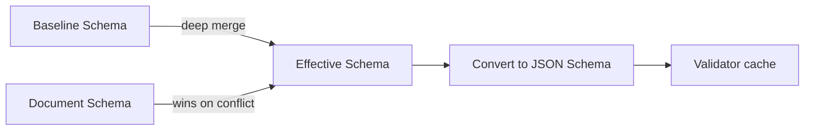
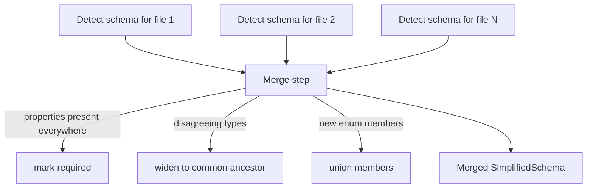

# Schemas in Darkmatter

Darkmatter brings the ability to **define**, **detect**, and **evaluate** schemas for Markdown frontmatter. This feature reuses the YAML-community convention of a top-level `$schema` property, but adds a friendlier authoring surface — **SimplifiedSchema** — for non-technical authors who shouldn't need to hand-write JSON Schema.

## Goals & Non-Goals

**Goals**

- Let authors declare frontmatter shape with a single-line grammar that is intelligible to non-developers.
- Convert every SimplifiedSchema to a Draft 2020-12 JSON Schema so a single, well-tested validator path is used everywhere.
- Allow a project to define a **baseline** schema that every document inherits from, and let individual documents extend it.
- Provide schema **detection** as a productivity aid for adopting schemas on existing corpora.
- Surface schema knowledge to other Darkmatter subsystems (notably shell completions for `file` and `enum` properties).

**Non-Goals (v1)**

- Remote (`https://`) `$schema` references. Local references only — may be added later.
- A YAML/JSON Schema authoring GUI.
- Cross-document constraints (e.g. "this slug must be unique across the corpus"). The extension hooks below leave room for this; the v1 spec does not deliver it.
- Coercion of values (numeric strings → numbers, etc.). `numberlike` / `boolish` accept *either* shape but do not rewrite the document.

## Foundational Decisions

- **Decision #1** — the `$schema` property is reserved by Darkmatter inside frontmatter.
- **Decision #2** — the *value* of `$schema` may be:
    1. An inline **SimplifiedSchema** dictionary, or
    2. A file reference (resolved via `biscuit-file`'s `FileReference`) to either:
        - a YAML file whose root contains a `$schema:` property holding a SimplifiedSchema, or
        - a `.json` / `.yaml` file whose contents are a valid JSON Schema document.
- **Decision #3** — every valid SimplifiedSchema must be convertible to JSON Schema deterministically and without IO.
- **Decision #4** — all validation is performed against the resulting JSON Schema using the `jsonschema` crate (Draft 2020-12). SimplifiedSchema is a *surface*, not a parallel validator.
- **Decision #5** — a **baseline schema** may be set at the library level or per-CLI-invocation. The effective schema for a document is `baseline ⊕ document_schema`, where `⊕` is a deep merge in which document-level keys win.

---

# Functional Specification

## SimplifiedSchema Grammar

A SimplifiedSchema is a YAML mapping from property names to **type-and-constraint** strings.

```yaml
$schema:
    name: string
    age:  number
```

### Syntax Forms

For each property, the value follows one of four shapes:

| Form                                              | Example                                              |
|---------------------------------------------------|------------------------------------------------------|
| `{type}`                                          | `name: string`                                       |
| `{type}({constraints})`                           | `name: string(required)`                             |
| `{type} -> {description}`                         | `name: string -> The author's full name`             |
| `{type}({constraints}) -> {description}`          | `slug: string(not-empty;required) -> URL slug`       |

**Whitespace.** Whitespace inside the `(...)` constraint list is insignificant. `string(required)` and `string( required )` are equivalent. When whitespace is present the whole value must be quoted in YAML so it remains a string scalar.

**Multiple constraints.** Constraints are separated by `;` inside the parentheses. The `;` may be surrounded by whitespace.

**Optional by default.** All declared properties are optional unless the `required` constraint is present. An optional property also accepts `null` as a sentinel for absent, so a frontmatter value that resolves to `null` (for example, from a Darkmatter ternary `{{ file_exists('design.md') ? 'design.md' : null }}`) validates the same way as a missing key.

```yaml
$schema:
    design: string
# If design.md does not exist, `design` resolves to null and the document is valid.
design: "{{ file_exists('design.md') ? 'design.md' : null }}"
---
```

**Arrays.** Any type may be suffixed with `[]` to declare an array of that type. Constraints in the parentheses apply to *items*; array-level constraints are written before the brackets — see [Array Constraints](#array-constraints).

```yaml
$schema:
    tags:   string[]                      # optional array of strings
    scores: "number(min(0); max(100))[]"  # each item in 0..=100
```

**Descriptions.** The `-> {description}` suffix populates the property's `description` annotation in the generated JSON Schema and is surfaced by `md schema explain` (future) and by shell-completion help text.

### Types

The full type vocabulary:

| Type        | Accepts                                                                                                  | Notes                                                                                          |
|-------------|----------------------------------------------------------------------------------------------------------|------------------------------------------------------------------------------------------------|
| `string`    | Any YAML string scalar.                                                                                  | Constraints: `min`, `max`, `not-empty`, `pattern`, `default`, `required`.                      |
| `date`      | ISO-8601 date, `YYYY-MM-DD`.                                                                             | Generates `format: date` with assertion.                                                       |
| `datetime`  | Any valid ISO-8601 datetime.                                                                             | Generates `format: date-time` with assertion.                                                  |
| `time`      | `hh:mm`, `hh:mm:ss`, or `hh:mm:ss.ms` with optional TZ (`Z` or `±HH:MM`).                                | Generates `format: time` with assertion.                                                       |
| `number`    | Any JSON number.                                                                                         | Constraints: `min`, `max`, `integer`, `default`, `required`.                                   |
| `numberlike`| A JSON number **or** a string that parses as a number (e.g. `"4"`, `"-13"`, `"3.14"`).                   | Generated as `anyOf: [number, string with pattern]`.                                           |
| `boolean`   | Any JSON boolean.                                                                                        | Constraints: `default`, `required`.                                                            |
| `boolish`   | A JSON boolean **or** the strings `"true"` / `"false"` (case-insensitive).                               | Generated as `anyOf: [boolean, enum ["true","false","True","False","TRUE","FALSE"]]`.          |
| `object`    | Any YAML/JSON object.                                                                                    | No nested-schema authoring in v1; an `object` accepts any shape. Use a referenced sub-schema for stronger typing. |
| `file`      | A single file reference (string scalar), or an array of file references when written as `file[]`. Resolved from the CWD at validation time via `biscuit-file::FileReference`. | Constraints: `match(glob)`, `required`. Array form adds `min`, `max`. See [Files](#files).    |
| `enum`      | A value drawn from an explicit set.                                                                       | **Constraints required** — must declare members. See [Enumerations](#enumerations).            |
| `url`       | A string parseable as an absolute URL.                                                                    | Constraints: `scheme(http,https,...)`, `required`. Generates `format: uri` with assertion plus optional scheme check. |
| `email`     | A string in `addr-spec` form.                                                                             | Generates `format: email` with assertion.                                                      |
| `any`       | Anything.                                                                                                 | Only meaningful constraint is `required`.                                                      |

> Arrays of each of the above are written by appending `[]` to the type, e.g. `string[]`, `enum(red,green,blue)[]`, `file(match(*.md))[]`.

### Universal Constraints

Every type accepts:

- `required` — the property must be present in the frontmatter.
- `default(value)` — emitted as JSON Schema `default`. Does **not** cause Darkmatter to mutate documents; downstream tools (and detection) honour it.

### Union Types

Any property value — and the root schema itself — may be expressed as a **YAML sequence** of type expressions to declare an `anyOf` union. An instance is valid if it matches at least one arm.

```yaml
$schema:
    # foo accepts a string OR a number
    foo:
      - string
      - number

    # status accepts an enum, a non-negative integer, or anything else
    status:
      - "enum(draft, published, archived)"
      - "number(integer; min(0))"
      - any
```

**Arm-level constraints** apply only within their arm. The arms are independent type expressions parsed by the same grammar as the single-type form:

```yaml
$schema:
    # accepts either a positive number or a CSS-length-like string
    width:
      - "number(min(0))"
      - "string(pattern(^\\d+(px|%)$))"
```

**Property-level constraints are hoisted.** `required` and `default(...)` are property-level concerns, not arm-level, so they are extracted from whichever arm declares them and applied to the property as a whole:

- If `required` appears on **any** arm, the property is required. Declaring it on multiple arms is permitted but redundant — convention is to place it on the first arm.
- If `default(...)` appears on more than one arm with **differing** values, schema compilation is a hard error. Identical defaults on multiple arms are collapsed silently.

```yaml
$schema:
    title:
      - "string(required; not-empty)"  # `required` hoisted; `not-empty` stays on the string arm
      - "number"                        # number arm has no constraints
```

**Arm descriptions** (`-> description`) annotate that arm in the generated JSON Schema; there is no property-level description for unions.

**Limitations (v1).**

- Arrays of unions (e.g. "array whose items may be string or number") cannot be expressed in the SimplifiedSchema YAML grammar. Workaround: reference a JSON Schema file via `$schema: ./file.schema.json` (see [Open Questions](#open-questions)).
- For property-level unions, each arm must be a type expression (a YAML string scalar). Arms that are full nested object schemas are supported only at the **root**; see [Root-level Unions](#root-level-unions).

## Type Constraints

This section describes the constraint vocabulary per type. Unrecognised constraints are a **hard error** at schema-compile time (not silently ignored), so typos surface early.

### Numbers (`number`)

| Constraint  | Effect                                                       | JSON Schema mapping                |
|-------------|--------------------------------------------------------------|------------------------------------|
| `min(n)`    | Minimum value, inclusive.                                    | `minimum: n`                       |
| `max(n)`    | Maximum value, inclusive.                                    | `maximum: n`                       |
| `integer`   | Must be an integer (zero fractional part).                    | `type: integer`                    |
| `default(n)`| Default value.                                                | `default: n`                       |
| `required`  | Property is required.                                         | parent `required` array entry      |

```yaml
$schema:
    opt_number:      number
    req_positive_int: "number(min(0); integer; required)"
    rating:          "number(min(0); max(5); default(3))"
```

### Strings (`string`)

| Constraint    | Effect                                                                 | JSON Schema mapping              |
|---------------|------------------------------------------------------------------------|----------------------------------|
| `min(n)`      | Minimum length (Unicode code points).                                  | `minLength: n`                   |
| `max(n)`      | Maximum length.                                                        | `maxLength: n`                   |
| `not-empty`   | Disallow the empty string and all-whitespace.                          | `pattern: "^(?!\\s*$).+"`        |
| `pattern(re)` | ECMA-262 regex the value must match. Use single/double quotes liberally to avoid YAML escaping pain. | `pattern: "re"`                  |
| `default(s)`  | Default string.                                                        | `default: "s"`                   |
| `required`    | Property is required.                                                  | parent `required`                |

```yaml
$schema:
    name:                "string(not-empty; required)"
    favorite_expression: "string(min(5))"
    slug:                "string(pattern(^[a-z0-9-]+$); required)"
```

### Dates / Times (`date`, `datetime`, `time`)

| Constraint   | Effect                       | JSON Schema mapping |
|--------------|------------------------------|---------------------|
| `default(s)` | Default value (ISO string).  | `default: "s"`      |
| `required`   | Required.                    | parent `required`   |

The type itself emits the corresponding `format` (`date`, `date-time`, `time`) with format-assertion enabled.

### Booleans (`boolean`, `boolish`)

| Constraint     | Effect                                            | JSON Schema mapping                         |
|----------------|---------------------------------------------------|---------------------------------------------|
| `default(b)`   | `true` or `false`.                                | `default: <bool>`                           |
| `required`     | Required.                                         | parent `required`                           |

### Enumerations (`enum`)

Enums **require** a constraint list because the constraint *is* the enumeration. Other constraints can be combined via `;`.

| Constraint               | Effect                                                       | JSON Schema mapping                                |
|--------------------------|--------------------------------------------------------------|----------------------------------------------------|
| Bare comma list (positional) | Members of the enumeration.                              | `enum: [...]`                                      |
| `default(member)`        | Default value; must be one of the members.                   | `default: "member"`                                |
| `required`               | Required.                                                    | parent `required`                                  |

```yaml
$schema:
    color:  enum(red,green,blue; required)
    status: "enum(draft, published, archived; default(draft))"
```

Members containing whitespace, commas, parentheses, or `;` must be wrapped in single quotes: `enum('a, b', 'c; d')`.

### Files (`file`)

The **file** type is the string form of a `biscuit-file::FileReference`. **Relative paths are resolved from the current working directory at validation time.** Validity is:

1. The string parses successfully as a `FileReference`.
2. The reference resolves to an existing entry on the filesystem **at validation time**.
3. If a `match(glob)` constraint is present, the resolved path matches at least one positive pattern and is not excluded by any negative pattern.

| Constraint              | Effect                                                                                                              |
|-------------------------|---------------------------------------------------------------------------------------------------------------------|
| `match(globs)`          | One or more glob patterns, comma-delimited inside the parentheses. Patterns starting with `!` exclude. Globs containing commas or whitespace must be single-quoted. |
| `required`              | Required.                                                                                                           |

Array form (`file[]`) adds array-level constraints `min(n)` / `max(n)` for item-count bounds.

```yaml
$schema:
    doc:         "file(match('*.doc', '*.pdf', '*.md', '*.txt'))"
    source_code: "file(match('src/**/*.rs', '!src/**/test_*.rs'))"
    images:      "file(match('*.png', '*.jpg'))[](min(1))"
```

Knowledge of a `file` property's `match` constraint is also surfaced to the **shell-completions** subsystem so that tab-completion on that frontmatter key offers only valid paths.

### URLs (`url`)

| Constraint               | Effect                                                            | JSON Schema mapping                         |
|--------------------------|-------------------------------------------------------------------|---------------------------------------------|
| `scheme(a,b,...)`        | Restrict to one of the listed schemes (lowercased).               | Custom keyword + `format: uri`              |
| `default(s)`             | Default URL.                                                      | `default: "s"`                              |
| `required`               | Required.                                                         | parent `required`                           |

```yaml
$schema:
    homepage: "url(scheme(https))"
    canonical: "url(required)"
```

### Emails (`email`)

| Constraint   | Effect       | JSON Schema mapping        |
|--------------|--------------|----------------------------|
| `default(s)` | Default.     | `default: "s"`             |
| `required`   | Required.    | parent `required`          |

Generates `format: email` with assertion enabled.

### Arrays (suffix `[]`)

Array-shape constraints apply at the array level. **Item** constraints are written inside the parens that precede the brackets and bind to the *items*. Array-level constraints follow the brackets in a second parenthesised list.

```yaml
$schema:
    # required array of 1..=5 unique lowercase tags
    tags: "string(pattern(^[a-z][a-z0-9-]*$))[](min(1); max(5); unique; required)"
```

| Array constraint   | Effect                                                            | JSON Schema mapping            |
|--------------------|-------------------------------------------------------------------|--------------------------------|
| `min(n)`           | Minimum number of items.                                          | `minItems: n`                  |
| `max(n)`           | Maximum number of items.                                          | `maxItems: n`                  |
| `unique`           | Items must be distinct.                                           | `uniqueItems: true`            |
| `required`         | Array property is required (not items).                           | parent `required`              |
| `default([...])`   | Default array. May be empty.                                      | `default: [...]`               |

## Schema Resolution

When Darkmatter loads a document it builds the **effective schema** in this order:



### 1. Inline SimplifiedSchema

`$schema` is a mapping → treat directly as a SimplifiedSchema:

```yaml
---
$schema:
    title: "string(required)"
    tags:  "string[]"
---
```

### 2. Local-file Reference (SimplifiedSchema)

`$schema` is a string that `biscuit-file::FileReference` resolves to a YAML file whose root contains a `$schema:` property. **Relative paths are resolved from the document's parent directory** (unlike `file` type properties, which resolve from the CWD):

```yaml
---
$schema: ./schemas/post.yaml
---
```

```yaml
# ./schemas/post.yaml
$schema:
    title: "string(required)"
    slug:  "string(pattern(^[a-z0-9-]+$); required)"
```

The referenced file is itself a SimplifiedSchema and is loaded, parsed, and converted by the same code path. The `$schema:` key in the referenced file is **mandatory** — files lacking it are an error.

### 3. Local-file Reference (JSON Schema)

`$schema` is a string that resolves to a `.json` file (or a `.yaml` file whose root does **not** carry a `$schema:` SimplifiedSchema property — see disambiguation below):

```yaml
---
$schema: ./schemas/post.schema.json
---
```

The file is parsed as JSON Schema (Draft 2020-12) and used directly.

**Disambiguation rule.** When resolving a referenced YAML file:

1. Parse as YAML.
2. If the root mapping contains a `$schema` key whose **value is a mapping**, treat the file as SimplifiedSchema.
3. Otherwise (root has no `$schema`, or `$schema` is a string URI like `https://json-schema.org/draft/2020-12/schema`), treat the file as JSON Schema.

JSON files (`.json`) are always treated as JSON Schema.

### 4. Root-level Unions

The root `$schema` may itself be a YAML sequence, in which case each arm is a complete object schema and the document is valid if its frontmatter matches at least one arm.

Each arm may be:

1. An inline SimplifiedSchema mapping, or
2. A string that `biscuit-file::FileReference` resolves to a SimplifiedSchema YAML file or a JSON Schema file (same disambiguation rule as for single-file references).

```yaml
---
$schema:
  - ./schemas/post.yaml      # arm 1: file reference
  - ./schemas/page.yaml      # arm 2: file reference
  - title: string            # arm 3: inline SimplifiedSchema
    body:  string
---
```

The effective JSON Schema is `{ "anyOf": [arm1, arm2, ...] }`. **Baseline merging is applied to each arm independently** — a baseline declares the fields every arm inherits.

**Failure reporting.** When validation fails against a root union, the CLI reports the closest-matching arm (the one producing the fewest problems) by default and prefixes problems with the arm index (e.g. `arm[1]: title is required`). `--format json` emits the full per-arm problem list keyed by `arm_index`.

### 5. Remote References

Not supported in v1. Any `http://` / `https://` value for `$schema` produces a clear error directing the user to download the schema locally.

### Baseline Schemas

A **baseline schema** is a SimplifiedSchema (or JSON Schema) that every validated document inherits. The library exposes:

```rust
let api = DarkmatterSchemas::new()
    .with_baseline_from_file("./schemas/baseline.yaml")?;
```

The CLI accepts the baseline per invocation:

```bash
md schema validate post.md --schema ./schemas/baseline.yaml
md schema validate post.md     # falls back to $BASELINE_SCHEMA env var
```

**JSON Schema baseline restrictions.** When the baseline is a JSON Schema (rather than a SimplifiedSchema), it is restricted to simple object schemas:
- The root must have `"type": "object"`.
- Validation must be expressed only through top-level `properties` and `required`.
- Any use of `$ref`, `allOf`, `anyOf`, `if/then/else`, `patternProperties`, `additionalProperties: false`, or other complex constructs causes `SchemaError::Baseline` at load time.
- This restriction exists because the merge algorithm (`baseline ⊕ document`) operates on a property-name-keyed deep merge, which only works for simple object schemas.

**Resolution order for the CLI baseline:**

1. `--schema <path>` flag (if present).
2. `$BASELINE_SCHEMA` environment variable.
3. No baseline (document schema is the effective schema).

**Merge semantics** (`baseline ⊕ document`):

- Object-level deep merge keyed by property name.
- Where both sides declare a property, the **document side wins entirely** — its type and constraints replace the baseline's. There is no constraint-level interleaving.
- `required` is a property-level constraint, so wholly replacing a property removes any inherited `required`. To preserve inherited requiredness while changing the type, the document must restate `required`.
- Properties present only in the baseline remain in the effective schema.
- Properties present only in the document are added.

This semantics is chosen because per-constraint merging produces surprising results (e.g. a baseline `min(5)` silently shadowing a document `min(3)`).

## Schema Validation

### Command

```bash
md schema validate <file>... [--schema <path>] [--format pretty|json] [--quiet]
```

- `<file>...` — one or more Markdown files. Globs are expanded by the shell.
- `--schema <path>` — baseline schema for this invocation.
- `--format pretty` *(default)* — human-readable, Prose-styled output. One block per file, problems listed with source line/column from the frontmatter.
- `--format json` — newline-delimited JSON, one object per file, suitable for piping into other tools.
- `--quiet` — suppress success lines; only failures print.

### Exit Codes

| Code | Meaning                                                 |
|------|---------------------------------------------------------|
| 0    | All files validated successfully.                       |
| 1    | One or more files failed validation.                    |
| 2    | Schema or baseline could not be loaded.                 |
| 3    | A file's frontmatter could not be parsed at all.        |
| 64   | Usage error (bad flags, etc.).                          |

### Output Shape (`--format pretty`)

```
post.md  ✓ valid (schema: ./schemas/post.yaml)

draft.md  ✗ 2 problems
  • title is required
      at line 2, column 1 of frontmatter
  • tags[2] does not match pattern ^[a-z0-9-]+$
      at line 6, column 5 of frontmatter
```

Rendered via `biscuit-terminal::Prose` for colour/style.

### Output Shape (`--format json`)

```json
{"file":"post.md","valid":true,"schema":"./schemas/post.yaml","problems":[]}
{"file":"draft.md","valid":false,"schema":null,"problems":[
  {"path":"/title","message":"is required","line":2,"column":1},
  {"path":"/tags/2","message":"does not match pattern ^[a-z0-9-]+$","line":6,"column":5}
]}
```

### Behaviour When `$schema` is Absent

- If a baseline is configured, the document is validated against the baseline alone.
- If no baseline and no `$schema`, validation **succeeds vacuously** and emits a warning line in `pretty` mode (suppressed by `--quiet`).

## Schema Detection

### Command

```bash
md schema detect <file>... [--format yaml|json] [--merge]
```

- `--format yaml` *(default)* — emit a SimplifiedSchema YAML document.
- `--format json` — emit the equivalent JSON Schema.
- `--merge` — when multiple files are given, **union** detections: a property is required only if present in every file; types are widened to the common supertype where they differ; enum members accumulate.

### Algorithm (single file)

1. Parse the document, extract the frontmatter object.
2. For each top-level property, infer a type by inspecting its YAML/JSON value:
    - boolean scalar → `boolean`
    - integer scalar → `number(integer)`
    - float scalar → `number`
    - string scalar that parses as ISO date/datetime/time → that type
    - string scalar that parses as a URL → `url(scheme(<scheme>))`
    - string scalar that parses as an email → `email`
    - string scalar that resolves via `FileReference` to an existing path → `file`
    - other string scalars → `string`
    - arrays → detect the item type recursively; if items disagree, fall back to `any[]`
    - objects → `object` (v1 does not synthesize nested SimplifiedSchemas)
3. **No constraints are inferred** — detection produces base types only (e.g., `string`, `number`, `file`). Pattern, min/max, enum members, and other constraints are never synthesised from values.
4. All detected properties are marked **optional** — a single sample cannot prove requiredness.
5. Emit the SimplifiedSchema with detected types and a comment header noting the source file(s).

### Multi-file Merge (`--merge`)



Type widening hierarchy used by the merge:

```
date  ┐
time  ├──> string
url   │
email ┘
number(integer) ──> number ──> numberlike
boolean ──> boolish
file ──> string   (only if the strings stop resolving)
```

When inferred types share a common ancestor in the hierarchy above, the merger widens to that ancestor. When they are **genuinely disjoint** (e.g. `string` and `boolean`), the merger emits a SimplifiedSchema **union** for that property rather than collapsing to `any`. Example output:

```yaml
$schema:
    flag:
      - boolean
      - string
```

**Merge does not combine constraints** — since detection infers base types only, there are no constraints to merge. Properties detected as `enum(...)` in different files are treated as disjoint types and become a union.

### Limitations (called out in CLI output)

- A property absent from one file cannot be distinguished from a property that is optional and merely not present — detection always errs on the side of optional.
- `object` properties are not deeply detected in v1.
- `pattern` constraints are not inferred.

## Shell Completions Integration

When Darkmatter generates shell completions for a CLI that consumes a Darkmatter document (`md`, third-party tools using the library), it consults the effective schema:

- **`file` properties (including `file[]`)** — completion suggests filesystem paths filtered by the `match` glob(s).
- **`enum` properties** — completion offers the enumerated members.
- **`url` / `email` / date-family properties** — completion offers a one-line hint of expected format but no values.

This is a read-only consumer of the schema; no schema changes are required to use it.

---

# Technical Specification

## Module Layout

```
darkmatter/lib/src/markdown/schemas/
├── mod.rs                  # public API: DarkmatterSchemas, EffectiveSchema, validate, detect
├── simplified/
│   ├── mod.rs              # SimplifiedSchema type
│   ├── grammar.rs          # type-constraint parser (lexer + parser)
│   ├── types.rs            # enum SimplifiedType, struct Constraint
│   └── convert.rs          # SimplifiedSchema -> serde_json::Value (JSON Schema)
├── resolve.rs              # $schema resolution (inline | file | baseline merge)
├── validate.rs             # validator construction, caching, error mapping
├── detect.rs               # inference + multi-file merge
├── format.rs               # custom format validators (darkmatter-file, darkmatter-url-scheme)
└── errors.rs               # SchemaError, ValidationProblem
```

CLI subcommands live in `darkmatter/cli/src/commands/schema/`:

```
darkmatter/cli/src/commands/schema/
├── mod.rs        # `md schema` parent command
├── validate.rs   # `md schema validate`
└── detect.rs     # `md schema detect`
```

## Dependencies

Add to `darkmatter/lib/Cargo.toml`:

| Crate                  | Version  | Reason                                                              |
|------------------------|----------|---------------------------------------------------------------------|
| `jsonschema`           | `0.46`   | Validator. Draft 2020-12, custom formats, `iter_errors`, regex engine swap. |
| `serde_json`           | (existing) | JSON Schema construction and validator input.                     |
| `serde_yaml_ng`        | (existing) | Parsing referenced YAML schemas / SimplifiedSchema files.         |
| `biscuit-file`         | (existing) | `FileReference` for `file` type & `$schema` resolution.            |
| `globset`              | `0.4`    | Compile `match(...)` globs once per schema.                         |
| `url`                  | `2`      | `url` type validation (parse + scheme inspection).                  |
| `regex`                | (existing) | Pattern engine for `jsonschema::PatternOptions::regex()` (linear-time, ReDoS-safe). |
| `thiserror`            | (existing) | Error enums.                                                        |

`jsonschema` is configured with:

- `Draft::Draft202012`
- `should_validate_formats(true)` so `format` keywords assert.
- `PatternOptions::regex()` for ReDoS-safe regex.
- Custom format `darkmatter-file` (delegates to `FileReference` + glob match).
- Custom format `darkmatter-url-scheme/<csv>` for the `url(scheme(...))` case.

Default features only — no `resolve-http`, no `resolve-async`, no `resolve-file` (we resolve `$schema` ourselves via `FileReference`).

## Public Library API

```rust
// darkmatter/lib/src/markdown/schemas/mod.rs

/// Entry point for the schemas subsystem.
pub struct DarkmatterSchemas {
    baseline: Option<SimplifiedSchema>,
    cache:    ValidatorCache,
}

impl DarkmatterSchemas {
    pub fn new() -> Self;

    pub fn with_baseline(self, schema: SimplifiedSchema) -> Self;
    pub fn with_baseline_from_file(self, path: impl AsRef<Path>) -> Result<Self, SchemaError>;
    pub fn with_baseline_json_schema(self, value: serde_json::Value) -> Result<Self, SchemaError>;

    /// Build the effective schema for a Markdown source. Reads the `$schema` from
    /// frontmatter (if any), resolves it, and merges the baseline.
    pub fn effective_for(&self, source: &Markdown) -> Result<EffectiveSchema, SchemaError>;

    /// Validate a document's frontmatter. Equivalent to
    /// `self.effective_for(doc)?.validate(doc.frontmatter())`.
    pub fn validate(&self, source: &Markdown) -> Result<ValidationReport, SchemaError>;

    /// Detect a schema from one or more documents.
    pub fn detect(&self, sources: &[&Markdown], opts: DetectOptions) -> SimplifiedSchema;
}

pub struct EffectiveSchema {
    pub simplified: Option<SimplifiedSchema>, // None if effective schema came from a raw JSON Schema file
    pub json_schema: serde_json::Value,
    validator: Arc<jsonschema::Validator>,
}

impl EffectiveSchema {
    pub fn validate(&self, frontmatter: &serde_json::Value) -> ValidationReport;
}

pub struct ValidationReport {
    pub valid: bool,
    pub problems: Vec<ValidationProblem>,
}

pub struct ValidationProblem {
    pub path:      String,       // JSON pointer, e.g. "/tags/2"
    pub message:   String,
    pub line:      Option<u32>,  // resolved from frontmatter source map
    pub column:    Option<u32>,
    /// Index of the root-union arm under which this problem was raised.
    /// `None` for non-union schemas. Property-level union failures are
    /// reported as a single problem at the property path with message
    /// "did not match any of: <arm 1>, <arm 2>, ..." rather than per-arm.
    pub arm_index: Option<usize>,
}
```

### SimplifiedSchema Type

```rust
/// A SimplifiedSchema is either a single object shape or a root-level union of object shapes.
pub enum SimplifiedSchema {
    Single(SchemaShape),
    Union(Vec<SchemaArm>),
}

/// A single object schema body — a map of property names to (possibly union) property definitions.
pub struct SchemaShape {
    pub properties: IndexMap<String, PropertyDef>,
}

/// One arm of a root-level union: an inline shape or an unresolved file reference.
/// File refs are resolved by `resolve.rs` before validator construction.
pub enum SchemaArm {
    Inline(SchemaShape),
    FileRef(String),
}

/// A property definition is either a single atom or a property-level union of atoms.
pub enum PropertyDef {
    Single(PropertyAtom),
    Union(Vec<PropertyAtom>),
}

/// One arm of a property-level union (or the body of a non-union property).
pub struct PropertyAtom {
    pub ty:                SimplifiedType,
    pub is_array:          bool,
    pub constraints:       Vec<Constraint>,
    pub array_constraints: Vec<Constraint>,
    pub description:       Option<String>,
}

pub enum SimplifiedType {
    String, Date, DateTime, Time, Number, NumberLike,
    Boolean, Boolish, Object, File,
    Enum, Url, Email, Any,
}

pub enum Constraint {
    Required,
    Default(serde_json::Value),
    // numeric
    Min(f64), Max(f64), Integer,
    // string
    MinLen(usize), MaxLen(usize), NotEmpty, Pattern(String),
    // enum
    Members(Vec<String>),
    // file
    Match(Vec<String>),
    // url
    Scheme(Vec<String>),
    // array
    Unique,
}
```

`IndexMap` preserves declaration order so generated JSON Schemas are deterministic and diff-friendly.

**Hoisting rule.** Before conversion, `convert::to_json_schema` walks each `PropertyDef::Union` and partitions its arm constraints: `Required` and `Default` are removed from arms and recorded at the property level (with the multi-default conflict check). All remaining constraints stay arm-local. This keeps the conversion of each arm identical to the single-atom case.

### Grammar Parsing

The type-and-constraint string is parsed by a small hand-written lexer/parser in `simplified/grammar.rs`. Two layers cooperate: a **YAML-shape** layer (handled by `simplified/mod.rs` over `serde_yaml_ng::Value`) decides whether a property value is a single type expression, a property-level union, or — at the root — a union of object schemas; a **string** layer (the EBNF below) parses each individual type expression.

**YAML-shape layer**

| YAML shape at `$schema`                                  | Interpretation                                          |
|----------------------------------------------------------|---------------------------------------------------------|
| Mapping                                                  | Single `SchemaShape`                                    |
| Sequence whose items are all mappings or strings         | Root-level union (`SimplifiedSchema::Union`)            |

| YAML shape at a property value                           | Interpretation                                          |
|----------------------------------------------------------|---------------------------------------------------------|
| Scalar (string)                                          | Single `PropertyAtom` — parse the string per EBNF       |
| Sequence whose items are all scalars                     | Property-level union (`PropertyDef::Union`)             |
| Sequence containing any non-scalar                       | Error (`SchemaError::Grammar`)                          |
| Mapping                                                  | Error (`SchemaError::Grammar`) — reserved for future nested object schemas |

**String layer (EBNF)** — parses a single type expression after the YAML-shape layer has identified it:

```
type_expr_string := type_expr ( "->" description )?
type_expr        := type_name ( "(" item_constraints ")" )? ( "[]" ( "(" arr_constraints ")" )? )?
type_name        := "string" | "date" | "datetime" | "time" | "number" | "numberlike"
                  | "boolean" | "boolish" | "object" | "file"
                  | "enum" | "url" | "email" | "any"
item_constraints := constraint ( ";" constraint )*
arr_constraints  := constraint ( ";" constraint )*
constraint       := IDENT
                  | IDENT "(" arglist ")"
arglist          := arg ( "," arg )*
arg              := NUMBER | BARE_WORD | SQUOTED | DQUOTED
description      := <rest-of-string, trimmed>
```

Errors surface as `SchemaError::Grammar { property, message, span }` with the original property name and byte span for source-location reporting.

## SimplifiedSchema → JSON Schema

`simplified::convert::to_json_schema(&SimplifiedSchema) -> serde_json::Value` produces a fully-formed Draft 2020-12 schema. Mapping table:

| SimplifiedSchema                                 | JSON Schema fragment                                                              |
|--------------------------------------------------|------------------------------------------------------------------------------------|
| `string`                                         | `{ "type": "string" }`                                                             |
| `string(min(5); max(80))`                        | `{ "type": "string", "minLength": 5, "maxLength": 80 }`                           |
| `string(not-empty)`                              | `{ "type": "string", "pattern": "^(?!\\s*$).+" }`                                  |
| `string(pattern(^[a-z]+$))`                      | `{ "type": "string", "pattern": "^[a-z]+$" }`                                      |
| `date`                                           | `{ "type": "string", "format": "date" }`                                           |
| `datetime`                                       | `{ "type": "string", "format": "date-time" }`                                      |
| `time`                                           | `{ "type": "string", "format": "time" }`                                           |
| `number`                                         | `{ "type": "number" }`                                                             |
| `number(min(0); integer)`                        | `{ "type": "integer", "minimum": 0 }`                                              |
| `numberlike`                                     | `{ "anyOf": [{"type":"number"},{"type":"string","pattern":"^-?\\d+(\\.\\d+)?$"}]}` |
| `boolean`                                        | `{ "type": "boolean" }`                                                            |
| `boolish`                                        | `{ "anyOf":[{"type":"boolean"},{"enum":["true","false","True","False","TRUE","FALSE"]}]}` |
| `object`                                         | `{ "type": "object" }`                                                             |
| `file`                                           | `{ "type": "string", "format": "darkmatter-file" }`                                |
| `file(match('*.md', '!_*.md'))`                  | `{ "type": "string", "format": "darkmatter-file", "x-darkmatter-match": ["*.md","!_*.md"] }` |
| `file(match('*.png'))[](min(1))`                  | `{ "type": "array", "minItems": 1, "items": { ...as file... } }`                   |
| `enum(red,green,blue)`                           | `{ "enum": ["red","green","blue"] }`                                               |
| `url`                                            | `{ "type": "string", "format": "uri" }`                                            |
| `url(scheme(https))`                             | `{ "type": "string", "format": "uri", "x-darkmatter-url-scheme": ["https"] }`      |
| `email`                                          | `{ "type": "string", "format": "email" }`                                          |
| `any`                                            | `{}`                                                                               |
| any `[]` suffix                                  | wraps the item schema in `{ "type": "array", "items": ..., <array constraints> }`  |
| YAML sequence as property value (union)          | `{ "anyOf": [<arm1>, <arm2>, ...] }`; `required` / `default` on any arm are hoisted to the parent. |
| YAML sequence as root `$schema` (root union)     | `{ "$schema": "...", "anyOf": [<arm1>, <arm2>, ...] }` where each arm is a full object schema (after resolving file-ref arms and applying baseline per arm). |
| `required` constraint                            | adds the property name to the parent object's `"required"` array.                  |
| `default(v)`                                     | `"default": v`                                                                     |
| Description suffix                               | `"description": "..."`                                                             |

`x-darkmatter-*` keys are extension annotations preserved on the JSON Schema; the custom format validators read them at validate time.

The root mapping emits:

```json
{
  "$schema": "https://json-schema.org/draft/2020-12/schema",
  "type": "object",
  "additionalProperties": true,
  "properties": { ... },
  "required": [ ... ]
}
```

`additionalProperties` is `true` by default. A future feature flag may opt into `false`; this is **not** in v1 to avoid breaking existing documents that carry tooling-specific frontmatter.

## Validator Construction & Caching

```rust
fn build_validator(json_schema: &serde_json::Value) -> Result<Validator, SchemaError> {
    use jsonschema::{Draft, PatternOptions};

    jsonschema::options()
        .with_draft(Draft::Draft202012)
        .with_pattern_options(PatternOptions::regex())
        .should_validate_formats(true)
        .with_format("darkmatter-file", validate_file_reference)
        .with_format("email", jsonschema::format::email)        // explicit, not the default
        .build(json_schema)
        .map_err(SchemaError::from)
}
```

### Custom Format: `darkmatter-file`

```rust
fn validate_file_reference(value: &str) -> bool {
    // 1. Parse via FileReference.
    // 2. Confirm the resolved path exists.
    // 3. If the surrounding schema fragment carries `x-darkmatter-match`,
    //    pull the globs and require a positive match (with negative-glob filtering).
    // Step 3 requires schema context — implemented as a custom Keyword, not a Format,
    // and registered alongside the format. See ADR below.
}
```

**ADR — Format vs Keyword for `file(match(...))`.** A `format` validator sees only the string value, not the surrounding schema. Because `match(...)` is a *schema-bound* constraint, we register a custom **keyword** `x-darkmatter-match` that runs after the format check; the format check covers parse-and-exists, the keyword covers the glob filter. Globsets are compiled once per validator at build time and cached by schema-content hash.

### Validator Cache

`ValidatorCache` keys by the SHA-256 of the canonicalised JSON Schema bytes. The cache:

- is `Arc<Mutex<HashMap<[u8; 32], Arc<Validator>>>>`,
- bounded by `DARKMATTER_SCHEMA_CACHE_SIZE` (default 64) with LRU eviction,
- is shared between `validate` and `effective_for`.

This matters because `md schema validate **/*.md` over a corpus would otherwise rebuild the same validator hundreds of times.

## CLI Commands

`md schema` is a parent command with two leaves.

### `md schema validate`

```
md schema validate <file>... [--schema <path>] [--format pretty|json] [--quiet]
```

- Reads each file via `darkmatter::Markdown::try_from(path)`.
- Builds `DarkmatterSchemas` once per invocation. If `--schema` is given, loads it; else uses `BASELINE_SCHEMA` env var; else no baseline.
- Iterates files, calling `schemas.validate(&doc)`.
- Renders per `--format`.

### `md schema detect`

```
md schema detect <file>... [--format yaml|json] [--merge]
```

- Reads each file, extracts frontmatter.
- Calls `DarkmatterSchemas::detect(&[...], DetectOptions { merge })`.
- Serialises via `serde_yaml_ng` or `serde_json` depending on `--format`.

## Error Types

```rust
#[derive(Debug, thiserror::Error)]
pub enum SchemaError {
    #[error("invalid SimplifiedSchema for property `{property}`: {message}")]
    Grammar { property: String, message: String, span: Range<usize> },

    #[error("could not resolve $schema reference `{reference}`")]
    Unresolved { reference: String, #[source] source: biscuit_file::FileReferenceError },

    #[error("referenced schema file `{path}` is neither a valid SimplifiedSchema (missing root `$schema:` key) nor a valid JSON Schema")]
    AmbiguousReferenced { path: PathBuf },

    #[error("remote $schema references are not supported in this version: `{reference}`")]
    RemoteUnsupported { reference: String },

    #[error("baseline schema could not be loaded or is not a simple object schema")]
    Baseline { #[source] source: Box<SchemaError> },

    #[error("could not build JSON Schema validator")]
    BuildValidator { #[source] source: jsonschema::ValidationError<'static> },

    #[error("io error reading `{path}`")]
    Io { path: PathBuf, #[source] source: std::io::Error },
}
```

All variants implement `biscuit_terminal::errors::BlockError` so they render as rich status blocks in CLI output (following the convention used elsewhere in darkmatter).

## Testing Strategy

| Layer                     | Test type            | Scope                                                                          |
|---------------------------|----------------------|--------------------------------------------------------------------------------|
| Grammar parser            | Unit + property      | `proptest` round-trip: random valid type expressions parse and re-serialise.   |
| `to_json_schema` mapping  | Unit (snapshot)      | One snapshot per row of the mapping table; insta snapshots in `tests/snapshots/`. |
| Generated schemas        | Meta-schema unit     | Every generated schema must build a `jsonschema::Validator` (see research §3.3). |
| Validation               | Table-driven         | `tests/fixtures/validate/<case>/{schema.yaml, doc.md, expected.json}`.         |
| Detection                | Table-driven         | `tests/fixtures/detect/<case>/{inputs/*.md, expected.yaml}`.                   |
| Baseline merge           | Unit                 | Cover precedence: doc wins on conflict, baseline-only kept, document-only added. |
| Property-level unions    | Table-driven         | Hoist `required` from any arm; reject conflicting `default(...)`; closest-arm error reporting; arm-local constraints stay arm-local. |
| Root-level unions        | Table-driven         | Inline arms + file-ref arms + JSON-Schema-file arms in one schema; baseline is merged per arm; CLI reports closest-matching arm. |
| CLI                       | `assert_cmd` + `predicates` | Exit codes, stdout shape, env-var fallback for `BASELINE_SCHEMA`.       |
| Performance               | `criterion` (smoke)  | 1000-file corpus validate; ~250 ms wall-time is an aspiration, not a hard gate. Runs in CI for trend tracking only. |

## Roll-out

1. Land `simplified/` (grammar, types, convert) behind no external API surface — internal unit-tested only.
2. Land `resolve.rs` + `validate.rs` + `format.rs`. Expose `DarkmatterSchemas` API.
3. Land `md schema validate` CLI subcommand.
4. Land `detect.rs` + `md schema detect`.
5. Wire schema-aware shell completions (separate feature; this spec defines the surface only).

## Open Questions

- **`additionalProperties: false` opt-in.** Worth adding a `strict` mode at the schema level (e.g. an outer `--strict` flag or a `$strict: true` sibling of `$schema`)? Deferred until a real user asks.
- **Inheritable enum members.** When a baseline declares `status: enum(draft, published)` and a document wants to *add* `archived`, should there be syntax for "extend, don't replace"? Out of scope for v1 — workaround is to redeclare the full enum in the document.
- **Nested object schemas.** v1 treats `object` as opaque. A natural extension is `object({ ...sub-schema... })`, or allowing a YAML mapping as a property value (currently a hard error reserved for this future use). Deferred; this spec does not foreclose it.
- **Arrays of unions.** "Array whose items may be string *or* number" cannot be written in the SimplifiedSchema grammar — `[]` suffix binds to a single type expression, and a YAML sequence at a property value position is itself the union form. Likely future syntax: `union(string, number)[]` as a sugared item form, or `items: [string, number]` inside the array's item parens. Workaround in v1 is a referenced JSON Schema file.
